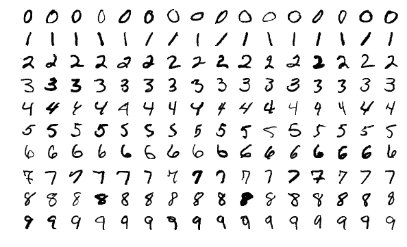
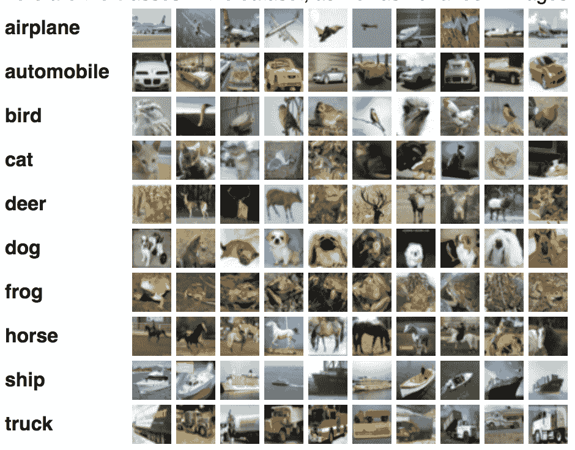
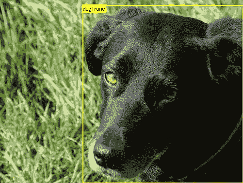
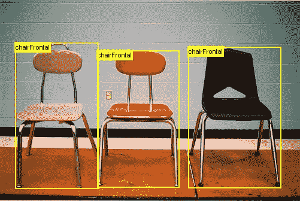
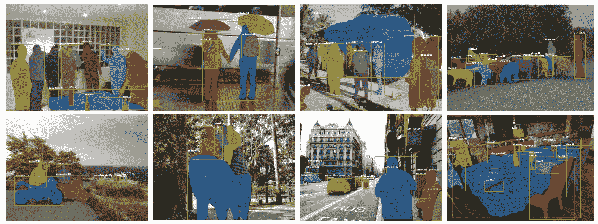
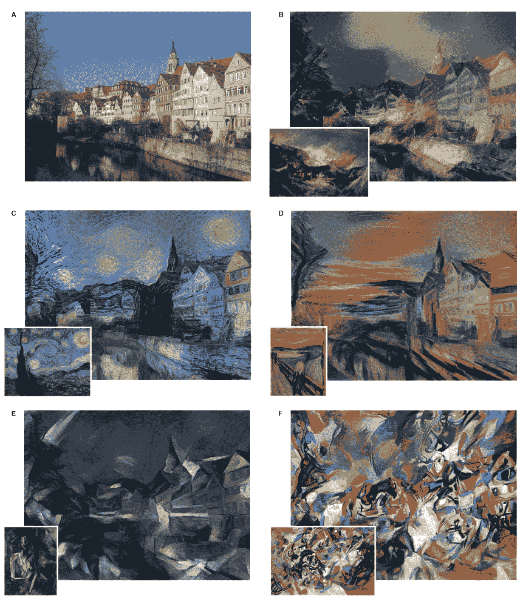
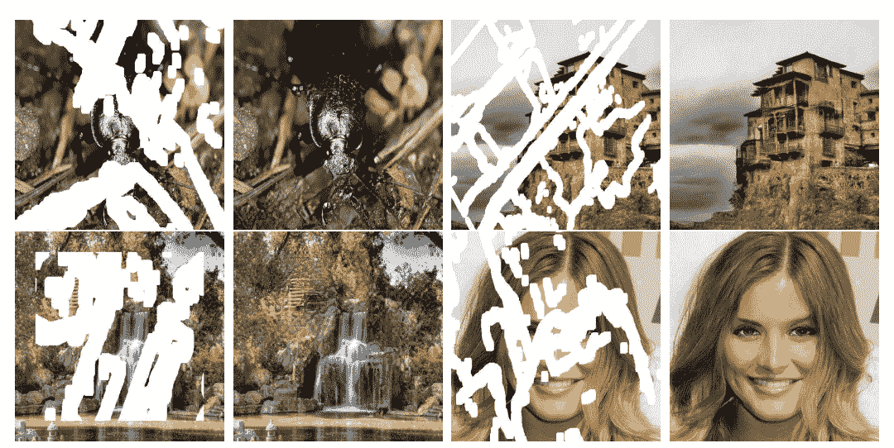
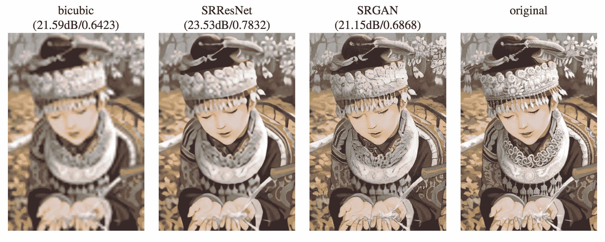
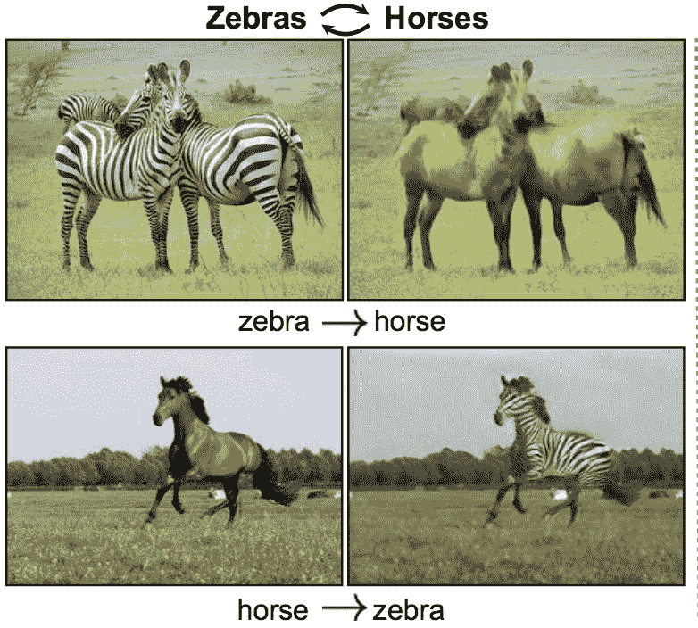
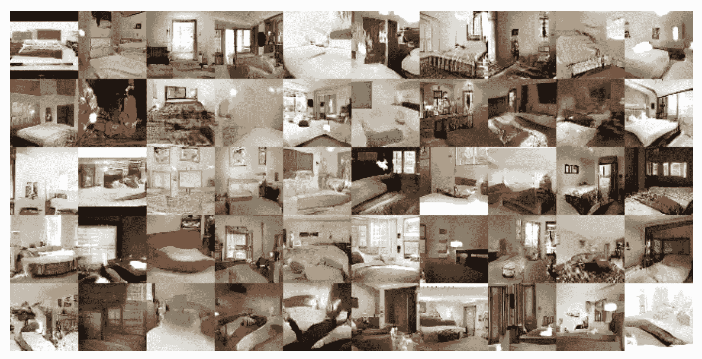

# 深度学习在计算机视觉中的 9 个应用

> 原文：<https://machinelearningmastery.com/applications-of-deep-learning-for-computer-vision/>

最后更新于 2019 年 7 月 5 日

[计算机视觉](https://machinelearningmastery.com/what-is-computer-vision/)领域正在从统计方法向深度学习神经网络方法转移。

在计算机视觉中还有许多具有挑战性的问题需要解决。然而，深度学习方法在一些具体问题上取得了最先进的成果。

最有趣的不仅仅是深度学习模型在基准问题上的表现；事实上，单个模型可以从图像中学习意义并执行视觉任务，从而消除了对专业和手工方法管道的需求。

在这篇文章中，你将发现九个有趣的计算机视觉任务，深度学习方法正在取得一些进展。

**用我的新书[计算机视觉深度学习](https://machinelearningmastery.com/deep-learning-for-computer-vision/)启动你的项目**，包括*分步教程*和所有示例的 *Python 源代码*文件。

我们开始吧。

## 概观

在这篇文章中，我们将关注以下使用深度学习的计算机视觉问题:

1.  图像分类
2.  带定位的图像分类
3.  对象检测
4.  对象分割
5.  图像风格转换
6.  图像彩色化
7.  图像重建
8.  图像超分辨率
9.  图像合成
10.  其他问题

注意，当涉及图像分类(识别)任务时，采用了来自 ILSVRC 的命名约定。虽然这些任务集中在图像上，但它们可以推广到视频帧。

我试图把重点放在你可能感兴趣的终端用户问题的类型上，而不是深度学习做得好的更学术的子问题。

每个例子都提供了问题的描述，一个例子，以及证明方法和结果的参考文献。

你有没有未列出的最喜欢的深度学习计算机视觉应用？
在下面的评论里告诉我。

## 图像分类

图像分类包括给整个图像或照片分配一个标签。

这个问题也被称为“*对象分类*”，并且可能更一般地被称为“*图像识别*”，尽管后一个任务可能适用于与图像内容分类相关的更广泛的任务集。

图像分类的一些例子包括:

*   将 x 射线标记为癌症与否(二分类)。
*   对手写数字进行分类(多类分类)。
*   给人脸照片命名(多类分类)。

用作基准问题的图像分类的一个流行例子是 [MNIST 数据集](https://machinelearningmastery.com/how-to-develop-a-convolutional-neural-network-from-scratch-for-mnist-handwritten-digit-classification/)。

来自 MNIST 数据集的手写数字示例

数字照片分类的一个流行的真实版本是[街景门牌(SVHN)数据集](http://ufldl.stanford.edu/housenumbers/)。

有关这些和其他图像分类任务的最新成果和相关论文，请参见:

*   [这个形象是什么档次的？](https://rodrigob.github.io/are_we_there_yet/build/classification_datasets_results.html)

有许多涉及对象照片的图像分类任务。两个流行的例子包括 [CIFAR-10](https://machinelearningmastery.com/how-to-develop-a-cnn-from-scratch-for-cifar-10-photo-classification/) 和 CIFAR-100 数据集，它们的照片分别被分为 10 类和 100 类。

来自 CIFAR-10 数据集的对象照片示例

[大规模视觉识别挑战赛(ILSVRC)](http://image-net.org/challenges/LSVRC/) 是一年一度的比赛，各队根据从 [ImageNet 数据库](http://www.image-net.org/)中提取的数据，在一系列计算机视觉任务中争夺最佳表现。图像分类的许多重要进展来自于发表的关于该挑战任务的论文，最显著的是关于图像分类任务的早期论文。例如:

*   [深度卷积神经网络的 ImageNet 分类](http://papers.nips.cc/paper/4824-imagenet-classification-with-deep-convolutional-neural-networks)，2012。
*   [用于大规模图像识别的超深度卷积网络](https://arxiv.org/abs/1409.1556)，2014。
*   [回旋更深](https://arxiv.org/abs/1409.4842)，2015。
*   [图像识别的深度残差学习](https://arxiv.org/abs/1512.03385)，2015。

## 带定位的图像分类

带有本地化的图像分类包括为图像指定类别标签，并通过边界框(在对象周围画一个框)显示对象在图像中的位置。

这是一个更具挑战性的图像分类版本。

局部化图像分类的一些例子包括:

*   标记 x 射线是否为癌症，并在癌症区域周围画一个方框。
*   对动物照片进行分类，并在每个场景中围绕动物画一个方框。

用于图像分类和定位的经典数据集是 [PASCAL 视觉对象类数据集](http://host.robots.ox.ac.uk:8080/pascal/VOC/)，简称 PASCAL VOC(例如 [VOC 2012](http://host.robots.ox.ac.uk/pascal/VOC/voc2012/) )。这些是多年来用于计算机视觉挑战的数据集。

2012 年挥发性有机化合物中狗的定位图像分类示例

该任务可能涉及在图像中同一对象的多个示例周围添加边界框。因此，该任务有时可被称为“*对象检测*”

《2012 年挥发性有机化合物》中多把椅子本地化的图像分类示例

用于图像分类和定位的 [ILSVRC2016 数据集](http://image-net.org/challenges/LSVRC/2016/browse-synsets)是一个流行的数据集，由 150，000 张照片和 1，000 个对象类别组成。

一些关于图像分类和本地化的论文包括:

*   [对象识别选择性搜索](https://link.springer.com/article/10.1007/s11263-013-0620-5)，2013。
*   [丰富的特征层次，用于精确的对象检测和语义分割](https://arxiv.org/abs/1311.2524)，2014。
*   [快 R-CNN](https://arxiv.org/abs/1504.08083) ，2015 年。

## 对象检测

对象检测是利用定位进行图像分类的任务，尽管一幅图像可能包含多个需要定位和分类的目标。

这是比简单的图像分类或具有定位的图像分类更具挑战性的任务，因为在不同类型的图像中经常存在多个对象。

通常，为图像分类和定位开发的技术被用于对象检测。

对象检测的一些例子包括:

*   绘制边界框并标记街道场景中的每个对象。
*   画一个边界框，给室内照片中的每个对象贴上标签。
*   绘制一个边界框，并标记风景中的每个对象。

PASCAL 视觉对象类数据集，简称 PASCAL VOC(例如 [VOC 2012](http://host.robots.ox.ac.uk/pascal/VOC/voc2012/) )，是一个用于对象检测的通用数据集。

另一个用于多个计算机视觉任务的数据集是[微软的上下文数据集中的公共对象](http://cocodataset.org/)，通常被称为 MS COCO。

在微软 COCO 数据集上用更快的 R-CNN 进行对象检测的例子

一些关于对象探测的论文包括:

*   [overheat:使用卷积网络的集成识别、定位和检测](https://arxiv.org/abs/1312.6229)，2014。
*   [更快的 R-CNN:使用区域提议网络实现实时对象检测](https://arxiv.org/abs/1506.01497)，2015 年。
*   [你只看一次:统一实时对象检测](https://arxiv.org/abs/1506.02640)，2015。

## 对象分割

对象分割或语义分割是对象检测的任务，在图像中检测到的每个对象周围画一条线。[图像分割](https://en.wikipedia.org/wiki/Image_segmentation)是将一个图像分割成多个片段的更一般的问题。

对象检测有时也称为对象分割。

与使用边界框识别对象的对象检测不同，对象分割识别图像中属于对象的特定像素。这就像一个细粒度的本地化。

更一般地说，“*图像分割*”可能指将图像中的所有像素分割成不同类别的对象。

同样，VOC 2012 和 MS COCO 数据集可以用于对象分割。

COCO 数据集上的对象分割示例
取自“Mask RCNN”。

[KITTI Vision Benchmark Suite](http://www.cvlibs.net/datasets/kitti/eval_road.php)是另一个受欢迎的对象分割数据集，它提供了用于自动驾驶汽车训练模型的街道图像。

一些关于对象分割的示例论文包括:

*   [同时检测和分割](https://arxiv.org/abs/1407.1808)，2014 年。
*   [语义分割的全卷积网络](https://ieeexplore.ieee.org/document/7478072)，2015。
*   [用于对象分割和细粒度定位的超立方体](https://arxiv.org/abs/1411.5752)，2015。
*   [SegNet:一种用于图像分割的深度卷积编解码架构](https://ieeexplore.ieee.org/document/7803544)，2016。
*   [口罩 R-CNN](https://arxiv.org/abs/1703.06870) ，2017 年。

## 风格转移

风格转移或神经风格转移是从一个或多个图像中学习风格并将该风格应用于新图像的任务。

这个任务可以被认为是一种没有客观评估的照片滤镜或变换。

例子包括将特定的著名艺术品(如巴勃罗·毕加索或文森特·梵高的作品)的风格应用到新照片中。

数据集通常涉及使用公共领域的著名艺术品和来自标准计算机视觉数据集的照片。

从著名艺术品到照片的神经风格转换示例
摘自《艺术风格的神经算法》

一些论文包括:

*   [一种艺术风格的神经算法](https://arxiv.org/abs/1508.06576)，2015。
*   [使用卷积神经网络的图像风格转移](https://ieeexplore.ieee.org/document/7780634)，2016。

## 图像彩色化

图像彩色化或神经彩色化包括将灰度图像转换成全色图像。

这个任务可以被认为是一种没有客观评估的照片滤镜或变换。

例子包括给旧的黑白照片和电影上色。

数据集通常涉及使用现有的照片数据集和创建照片的灰度版本，模型必须学会着色。

照片着色示例
摘自“彩色图像着色”

一些论文包括:

*   [彩色图像上色](https://arxiv.org/abs/1603.08511)，2016 年。
*   [要有颜色！:用于同时分类的自动图像着色的全局和局部图像先验的联合端到端学习](http://iizuka.cs.tsukuba.ac.jp/projects/colorization/data/colorization_sig2016.pdf)，2016。
*   [深度上色](https://arxiv.org/abs/1605.00075)，2016 年。

## 图像重建

图像重建和图像修复是填补图像缺失或损坏部分的任务。

这个任务可以被认为是一种没有客观评估的照片滤镜或变换。

例子包括重建旧的、损坏的黑白照片和电影(例如照片修复)。

数据集通常涉及使用现有的照片数据集和创建模型必须学会修复的损坏的照片版本。

照片修复示例。
取自“利用部分卷积对不规则孔洞进行图像修复”

一些论文包括:

*   [像素递归神经网络](https://arxiv.org/abs/1601.06759)，2016。
*   [使用部分卷积的不规则孔的图像修复](https://arxiv.org/abs/1804.07723)，2018。
*   [使用带通滤波的深度神经网络的高度可伸缩图像重建](https://arxiv.org/abs/1805.03300)，2018。

## 图像超分辨率

图像超分辨率是生成比原始图像具有更高分辨率和细节的新版本图像的任务。

通常，为图像超分辨率开发的模型可以在解决相关问题时用于图像恢复和修复。

数据集通常涉及使用现有的照片数据集和创建照片的缩小版本，模型必须学会为这些照片创建超分辨率版本。

不同超分辨率技术的结果示例。
取自“使用生成对抗网络的照片真实感单幅图像超分辨率”

一些论文包括:

*   [使用生成对抗网络的照片真实感单幅图像超分辨率](https://arxiv.org/abs/1609.04802)，2017 年。
*   [深度拉普拉斯金字塔网络实现快速精确的超分辨率](https://arxiv.org/abs/1704.03915)，2017。
*   [深度影像优先](https://arxiv.org/abs/1711.10925)，2017 年。

## 图像合成

图像合成是生成现有图像或全新图像的目标修改的任务。

这是一个正在迅速发展的非常广泛的领域。

它可能包括图像和视频的小修改(例如图像到图像的翻译)，例如:

*   更改场景中对象的样式。
*   向场景添加对象。
*   给场景添加人脸。

斑马和马造型示例。
取自“使用循环一致对抗网络的不成对图像到图像转换”

它还可能包括生成全新的图像，例如:

*   生成人脸。
*   建造浴室。
*   生成衣服。

生成的浴室示例。
摘自《深度卷积生成对抗网络的无监督表示学习》

一些论文包括:

*   [深度卷积生成对抗网络的无监督表示学习](https://arxiv.org/abs/1511.06434)，2015。
*   [使用 PixelCNN 解码器的条件图像生成](https://arxiv.org/abs/1606.05328)，2016 年。
*   [使用循环一致对抗网络的不成对图像到图像转换](https://arxiv.org/abs/1703.10593)，2017。

## 其他问题

还有其他重要和有趣的问题，我没有涉及，因为它们不是纯粹的计算机视觉任务。

图像到文本和文本到图像的显著示例:

*   图像字幕:生成图像的文本描述。
    *   [展示和讲述:一个神经图像字幕生成器](https://arxiv.org/abs/1411.4555)，2014。
*   图像描述:生成图像中每个对象的文本描述。
    *   [用于生成图像描述的深度视觉-语义对齐](https://cs.stanford.edu/people/karpathy/deepimagesent/)，2015。
*   文本到图像:根据文本描述合成图像。
    *   [阿坦甘:利用注意生成对抗网络的细粒度文本到图像生成](https://arxiv.org/abs/1711.10485)，2017。

据推测，人们学会了在其他模态和图像之间进行映射，比如音频。

## 进一步阅读

如果您想更深入地了解这个主题，本节将提供更多资源。

### 调查文件

*   [深度学习的对象检测:综述](https://arxiv.org/abs/1807.05511)，2018。
*   [利用深度学习的现代对象检测文献综述](https://arxiv.org/abs/1808.07256)，2018。
*   [医学图像分析深度学习调查](https://arxiv.org/abs/1702.05747)，2017。

### 资料组

*   [MNIST 数据集](http://yann.lecun.com/exdb/mnist/)
*   [街景门牌号数据集](http://ufldl.stanford.edu/housenumbers/)
*   [ImageNet 数据集](http://www.image-net.org/)
*   [大规模视觉识别挑战(ILSVRC)](http://image-net.org/challenges/LSVRC/)
*   [ILSVRC2016 数据集](http://image-net.org/challenges/LSVRC/2016/browse-synsets)
*   [PASCAL 可视化对象类主页](http://host.robots.ox.ac.uk:8080/pascal/VOC/)
*   [MS COCO 数据集](http://cocodataset.org/)。
*   [KITTI 视觉基准套件](http://www.cvlibs.net/datasets/kitti/eval_road.php)

### 文章

*   [这个形象是什么档次的？](https://rodrigob.github.io/are_we_there_yet/build/classification_datasets_results.html)
*   [你需要了解的 9 篇深度学习论文(了解 CNNs 第 3 部分)](https://adeshpande3.github.io/The-9-Deep-Learning-Papers-You-Need-To-Know-About.html)
*   [GAN 论文列表及审核](https://spark-in.me/post/gan-paper-review)
*   [2017 年深度学习语义分割指南](http://blog.qure.ai/notes/semantic-segmentation-deep-learning-review)。

### 参考

*   [MNIST 数据库，维基百科](https://en.wikipedia.org/wiki/MNIST_database)。
*   [AlexNet，维基百科](https://en.wikipedia.org/wiki/AlexNet)。
*   [图像分割，维基百科。](https://en.wikipedia.org/wiki/Image_segmentation)

## 摘要

在这篇文章中，你发现了深度学习在计算机视觉任务中的九个应用。

你最喜欢的计算机视觉深度学习的例子错过了吗？
评论里告诉我。

你有什么问题吗？
在下面的评论中提问，我会尽力回答。