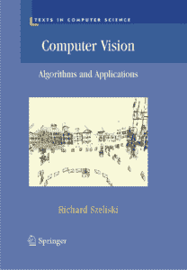
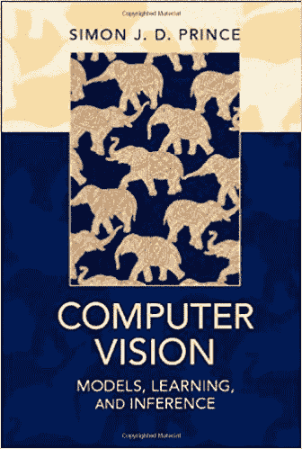
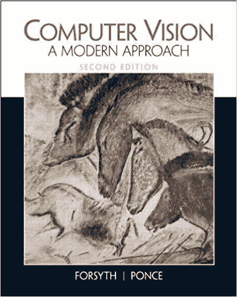
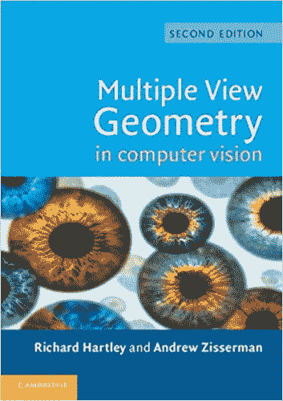
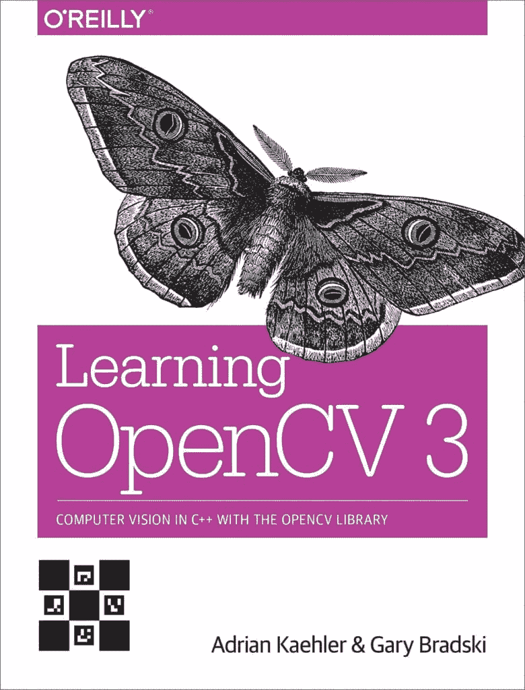
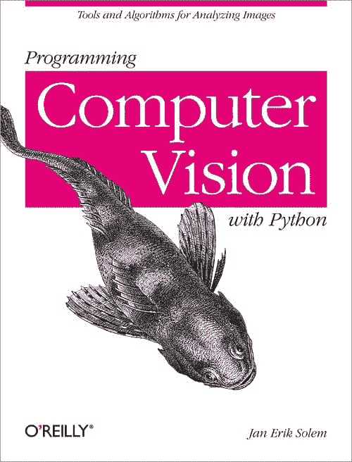
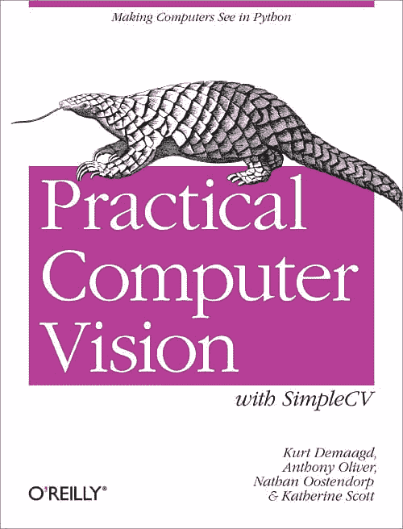

# 8 本计算机视觉入门书籍

> 原文：<https://machinelearningmastery.com/computer-vision-books/>

最后更新于 2020 年 6 月 12 日

计算机视觉是人工智能的一个分支，涉及理解数字图像的内容，如照片和视频。

深度学习在挑战[计算机视觉任务](https://machinelearningmastery.com/applications-of-deep-learning-for-computer-vision/)方面取得了令人印象深刻的进展，并有望取得进一步进展。

在深入研究深度学习技术在[计算机视觉](https://machinelearningmastery.com/what-is-computer-vision/)中的应用之前，更广泛地发展计算机视觉基础可能会有所帮助。这可能包括基础和经典的技术、理论，甚至是标准 API 的基本数据处理。

快速熟悉这个领域的最好方法之一是找一本关于这个主题的书。

在这篇文章中，你会发现关于计算机视觉的顶级教科书和程序员书籍。

**用我的新书[计算机视觉深度学习](https://machinelearningmastery.com/deep-learning-for-computer-vision/)启动你的项目**，包括*分步教程*和所有示例的 *Python 源代码*文件。

我们开始吧。

## 概观

本文分为三个部分；它们是:

1.  五大计算机视觉教科书
2.  计算机视觉程序员的三大书籍
3.  推荐

## 五大计算机视觉教科书

教科书是由专家，通常是学者写的书，旨在作为学生和从业者的参考。

他们主要关注一般方法和理论(数学)，而不是问题的实际关注点和方法的应用(代码)。

我根据顶尖学校(如麻省理工学院等)大学课程中的使用情况，收集了前五名教科书的列表。)和讨论网站(如 Quora 等)上的建议。).

计算机视觉的前五名教科书如下(没有特别的顺序):

*   [计算机视觉:算法与应用](https://amzn.to/2LcIt4J)，2010。
*   [计算机视觉:模型、学习和推理](https://amzn.to/2rxrdOF)，2012 年。
*   [计算机视觉:现代方法](https://amzn.to/2rv7AqJ)，2002。
*   [三维计算机视觉入门技术](https://amzn.to/2L9C2zF)，1998。
*   [计算机视觉中的多视图几何](https://amzn.to/2LfHLE8)，2004。

让我们依次仔细看看每本书，包括每本书的目标读者和目录。

### 计算机视觉:算法和应用

本书由[理查德·斯泽斯基](http://szeliski.org/RichardSzeliski.htm)撰写，于 2010 年出版。

计算机视觉:算法和应用

本书的 PDF 格式草稿可在[书籍的主页](http://szeliski.org/Book/)上获得。

我喜欢这本书。它为计算机视觉技术的初学者(本科生)提供了一个强大的基础，以解决广泛的标准计算机视觉问题。这本书是理查德根据他在华盛顿大学多年的教学经验编写的。

> 这本书也反映了我在公司研究实验室从事计算机视觉研究的 20 年经验[……]我主要专注于具有实际现实应用并且在实践中运行良好的问题和解决技术(算法)。因此，这本书更强调在现实世界条件下工作的基本技术，而不是更深奥的数学，它有内在的优雅，但实用性较差。

—第九页，[计算机视觉:算法与应用](https://amzn.to/2LcIt4J)，2010。

*   [图书主页](http://szeliski.org/Book/)
*   [亚马逊上的书](https://amzn.to/2LcIt4J)

这本书的目录如下:

*   1.介绍
*   2.图像形成
*   3.图像处理
*   3.特征检测和匹配
*   5.分割
*   6.基于特征的对齐
*   7.运动结构
*   8.密集运动估计
*   9.图像拼接
*   10.计算摄影
*   11.立体对应
*   12.三维重建
*   13.基于图像的渲染
*   14.承认

### 计算机视觉:模型、学习和推理

本书由[西蒙·普林斯](http://www0.cs.ucl.ac.uk/external/s.prince/)执笔，2012 年出版。

计算机视觉:模型、学习和推理

该书的草稿版本可以在[书的网站](http://www.computervisionmodels.com/)上以 PDF 格式获得。

这是一本很棒的入门书(针对学生)，涵盖了广泛的计算机视觉技术和问题。这本书花了更多的时间来介绍计算机视觉，并花了有用的时间在与概率建模相关的基础主题上。

> 这种对计算机视觉的现代处理侧重于概率模型中的学习和推理，作为一个统一的主题。它展示了如何使用训练数据来学习观察到的图像数据和我们希望估计的世界方面之间的关系，例如 3D 结构或对象类，以及如何利用这些关系从新的图像数据中推断世界。

——[计算机视觉:模型、学习和推理](https://amzn.to/2rxrdOF)，2012 年。

*   [图书主页](http://www.computervisionmodels.com/)
*   [亚马逊上的书](https://amzn.to/2rxrdOF)

这本书的目录如下:

*   1.介绍
*   2.概率导论
*   3.常见概率分布
*   4.拟合概率模型
*   5.正态分布
*   6.视觉中的学习和推理
*   7.复杂数据密度建模
*   8.回归模型
*   9.分类模型
*   10.图形模型
*   11.链条和树木模型
*   12.网格模型
*   13.图像预处理和特征提取
*   14.针孔照相机
*   15.转换模型
*   16.多个摄像头
*   17.形状模型
*   18.风格和身份的典范
*   19.时间模型
*   20.视觉词汇模型

### 计算机视觉:一种现代方法

本书由[大卫·福赛思](http://luthuli.cs.uiuc.edu/~daf/)和[让·庞塞](https://www.di.ens.fr/~ponce/)执笔，于 2011 年出版。

计算机视觉:一种现代方法

这是一本关于计算机视觉的入门教科书，所涵盖的主题可能比许多其他教科书更广泛。尽管内容广泛，但它可能不如其他一些介绍性文本受欢迎，因为阅读起来很有挑战性:它直入人心。

> ……视觉依赖于对相机和图像形成的物理过程(本书第一部分)的扎实理解，从单个像素值中获得简单的推论(第二部分)，将多个图像中可用的信息组合成一个连贯的整体(第三部分)，对像素组施加某种顺序以将其相互分离或推断形状信息(第四部分)，并使用几何信息或概率技术识别对象(第五部分)。

— xvii，[计算机视觉:现代方法](https://amzn.to/2rv7AqJ)，2002。

*   [图书主页](http://luthuli.cs.uiuc.edu/~daf/CV2E-site/cv2eindex.html)
*   [亚马逊上的书](https://amzn.to/2rv7AqJ)

这本书的目录如下:

*   第一部分:图像形成
    *   1.辐射测量-测量光线
    *   2.来源、阴影和底纹
    *   3.颜色
*   第二部分。图像模型
    *   4.几何图像特征
    *   5.分析图像特征
    *   6.概率导论
*   第三部分。早期视觉:一个图像
    *   7.线性滤波器
    *   8.边缘检测
    *   9.过滤器和功能
    *   10.纹理
*   第四部分。早期视觉:多重图像
    *   11.多视图的几何
    *   12.立体视觉
    *   13.运动的仿射结构
    *   14.来自运动的投射结构
*   第五部分.中期展望
    *   15.使用聚类方法的分割
    *   16.适合的
    *   17.用概率方法进行分割和拟合
    *   18.跟踪
*   第六部分。高层次视觉
    *   19.对应和姿势一致性
    *   20.使用分类器查找模板
    *   21.通过模板之间的关系进行识别
    *   22.方面图
*   第七部分。应用和主题
    *   23.范围数据
    *   24.应用:在数字图书馆中寻找
    *   25.应用:基于图像的渲染

### 三维计算机视觉入门技术

本书由[伊曼纽·特鲁科](https://www.dundee.ac.uk/computing/people/profile/emanuele-trucco.php)和[亚历山德罗·韦里](https://www.disi.unige.it/person/VerriA/)撰写，于 1998 年出版。

三维计算机视觉入门技术

这是一本较旧的书，主要关注计算机视觉，也关注与视觉中的 3D 问题相关的技术。这是一个很好的起点，面向本科生而不是研究生读者。

> 这本书旨在:[……]对现代计算机视觉的问题和解决方案的应用介绍。

–XIII，[三维计算机视觉入门技术](https://amzn.to/2L9C2zF)，1998。

*   [亚马逊上的书](https://amzn.to/2L9C2zF)

这本书的目录如下:

*   1.介绍
*   2.数字快照
*   3.图像噪声的处理
*   4.图像特征
*   5.更多图像功能
*   6.摄像机标定
*   7.立体视觉
*   8.移动
*   9.单图像线索的形状
*   10.承认
*   11.定位空间中的对象
*   A.附录

### 计算机视觉中的多视角几何

这本书由[理查德·哈特利](https://cecs.anu.edu.au/people/richard-hartley)和[安德鲁·齐塞曼](https://www.robots.ox.ac.uk/~az/)撰写，于 2004 年出版。

计算机视觉中的多视角几何

一些章节的样本可以从[书的网页](http://www.robots.ox.ac.uk/~vgg/hzbook/)上以 PDF 格式获得。

这是一本相当高级的关于计算机视觉专业的书(研究生水平)，特别是关于从多个图像推断几何的问题和方法。

> 这本书分为六个部分，有七个简短的附录。每个部分都引入了一种新的几何关系:背景的单应性、单视图的摄像机矩阵、两视图的基本矩阵、三视图的三焦张量和四视图的四焦张量。

—第十四页，[计算机视觉中的多视图几何图形](https://amzn.to/2LfHLE8)，2004。

*   [图书主页](http://www.robots.ox.ac.uk/~vgg/hzbook/)
*   [亚马逊上的书](https://amzn.to/2LfHLE8)

这本书的目录如下:

*   1.介绍
*   第 0 部分。背景:射影几何、变换和估计
    *   2.射影几何与 2D 变换
    *   3.射影几何与三维变换
    *   4.估计-2D 投影变换
    *   5.算法评估及误差分析
*   第一部分:摄像机几何图形和单视图几何图形
    *   6.相机模型
    *   7.摄像机矩阵的计算
    *   8.更多单视图几何图形
*   第二部分。双视图几何图形
    *   9.极线几何与基本矩阵
    *   10.摄像机和结构的三维重建
    *   11.基本矩阵的计算
    *   12.结构计算
    *   13.场景平面和单应性
    *   14.仿射极线几何
*   第三部分。三视图几何图形
    *   15.三焦张量
    *   16.三焦张量的计算
*   第四部分。正视图几何图形
    *   17.非线性和多视图张量
    *   18.n 维计算方法
    *   19.自动校准
    *   20.二元性
    *   21.唇腭裂
    *   22.简并构型
*   第五部分附录

## 计算机视觉程序员的三大书籍

程序员书籍是由专家(通常是开发人员和工程师)编写的剧本(例如奥莱利书籍)，旨在供从业者参考。

他们主要关注技术和解决问题的实际问题，关注示例代码和标准库。可以用相关理论(数学)简要描述技术，但可能不应该作为主要参考。

我收集了前三名剧本的列表，根据它们在顶级计算机视觉书籍列表中的排名和讨论网站上的推荐。

计算机视觉的前三名教科书如下(没有特别的顺序):

*   [学习 OpenCV 3](https://amzn.to/2EqF0Pv) ，2017。
*   [用 Python 编程计算机视觉](https://amzn.to/2QKTaAL)，2012。
*   [带 SimpleCV 的实用计算机视觉](https://amzn.to/2QnFqMY)，2012。

让我们依次仔细看看每本书，包括每本书的目标读者和目录。

### 学习 OpenCV 3

本书由[阿德里安·凯勒](https://www.linkedin.com/in/adriankaehler/)和[加里·布拉德斯基](https://www.linkedin.com/in/garybradski/)撰写，于 2017 年出版。这本书的副标题是“使用 OpenCV 库的 C++计算机视觉”

学习 OpenCV 3

这本书的重点是教你如何使用 OpenCV 库，也许是首款开源计算机视觉库。所有代码示例都是 C++，这表明目标受众是希望学习如何将计算机视觉融入其应用程序的专业开发人员。重要的是，作者是 OpenCV 的董事会成员和创始人。

这是一本技术书籍，也许更像是一个精心制作的应用编程接口文档，而不是剧本。

> 这本书提供了 C++开源计算机视觉库(OpenCV)3 . x 版本的工作指南，并给出了足以帮助读者有效使用 OpenCV 的计算机视觉领域的一般背景。

——[学习 OpenCV 3](https://amzn.to/2EqF0Pv) ，2017。

这本书可能被认为是同一作者的旧书《学习》(2008)的更新版本。

*   [图书主页(源代码)](https://github.com/oreillymedia/Learning-OpenCV-3_examples)
*   [亚马逊上的书](https://amzn.to/2EqF0Pv)

这本书的目录如下:

*   1.概观
*   2.OpenCV 简介
*   3.了解 OpenCV 数据类型
*   4.图像和大数组类型
*   5.阵列操作
*   6.绘制和注释
*   7.OpenCV 中的函数
*   8.图像、视频和数据文件
*   9.跨平台和本机窗口
*   10.滤波器和卷积
*   11.通用图像变换
*   12.映象分析
*   13.直方图和模板
*   14.轮廓
*   15.背景减法
*   16.关键点和描述符
*   17.跟踪
*   18.相机型号和校准
*   19.投影与三维视觉
*   20.OpenCV 中的机器学习基础
*   21.StatModel:OpenCV 中学习的标准模型
*   22.对象检测
*   23.OpenCV 的未来

### 用 Python 编程计算机视觉

本书由[Jan Erik somar](https://www.janeriksolem.net/)撰写，于 2012 年出版。这本书的副标题是“分析图像的工具和算法。”

用 Python 编程计算机视觉

这本书的最终草稿可以在[书的网站](http://programmingcomputervision.com/)上以 PDF 格式获得。

这是一本实践书，重点是教你如何用 Python 执行基本的计算机视觉任务，大部分是用 PIL，尽管也有 OpenCV 的基本介绍。我是这本书的粉丝，虽然使用更新的库(例如[Pillow](https://github.com/python-pillow/Pillow))需要做一些小的修改。这本书的更新到期了！

> 这本书背后的想法是给动手计算机视觉提供一个容易接近的入口，对基础理论和算法有足够的理解，成为学生、研究人员和爱好者的基础。

—第七页，[用 Python 编程计算机视觉](https://amzn.to/2QKTaAL)，2012。

*   [图书主页](http://programmingcomputervision.com/)
*   [亚马逊图书](https://amzn.to/2QKTaAL)

这本书的目录如下:

*   1.基本图像处理和处理
*   2.局部图像描述符
*   3.图像到图像映射
*   4.相机模型和增强现实
*   5.多视图几何图形
*   6.聚类图像
*   7.搜索图像
*   8.图像内容分类
*   9.图象分割法
*   10.OpenCV

### 简单实用的计算机视觉

这本书由[库尔特·德马吉德](https://www.linkedin.com/in/kurtdemaagd/)、安东尼·奥利弗、[内森·奥斯滕多普](http://oostendorp.net/)、[凯瑟琳·斯科特](http://www.kscottz.com/)撰写，于 2012 年出版。这本书的副标题是“*让技术看到*的简单方法。”

简单实用的计算机视觉

这本书教你如何使用 Python 中的 SimpleCV 库执行基本的计算机视觉操作。这为使用 PIL(Pillow)或 OpenCV 提供了一个很好的替代方案，尽管我不认为 SimpleCV 已经被广泛采用(我很高兴被证明是错误的)。

> 了解如何使用用 Python 编写的开源框架 SimpleCV 快速轻松地构建自己的计算机视觉(CV)应用程序。通过实际应用的例子，本实践指南向您介绍了收集、处理和分析流式数字图像的基本 CV 技术。

——[带 SimpleCV 的实用计算机视觉](https://amzn.to/2QnFqMY)，2012。

*   [图书主页](http://simplecv.org/book/)
*   [亚马逊上的书](https://amzn.to/2QnFqMY)

这本书的目录如下:

*   1.介绍
*   2.了解简单简历框架
*   3.图像来源
*   4.像素和图像
*   5.光的影响
*   6.图像算法
*   7.在图像上绘图
*   8.基本特征检测
*   9.功能集操作
*   10.高级功能

## 推荐

我喜欢书，任何时候都在读几本不同的书。因此，我拥有这篇文章中列出的所有书籍。

然而，如果我被迫推荐一本教科书和一本剧本，我的建议如下:

### 推荐教材

*   [计算机视觉:算法与应用](https://amzn.to/2LcIt4J)，理查德·斯泽斯基，2010。

我推荐这本书，因为它为计算机视觉提供了一个简短的、重点突出的、可读性很强的相关理论介绍，而不会陷入太多困境。直奔主题和有用的参考文本。

### 推荐程序员书籍

*   [用 Python 编程计算机视觉](https://amzn.to/2QKTaAL)，Jan Erik Solem，2012。

我推荐这本书，因为它侧重于具有标准(或足够接近)Python 库的真实计算机视觉技术。在计算机视觉中，这是弄脏手的一个很好的起点。

## 进一步阅读

如果您想更深入地了解这个主题，本节将提供更多资源。

*   [热门计算机视觉书籍，GoodReads](https://www.goodreads.com/shelf/show/computer-vision) 。
*   [亚马逊:计算机视觉领域的畅销书](https://amzn.to/2Eo55id)。
*   [问 HN:学习计算机视觉最好的资源是什么？](https://news.ycombinator.com/item?id=14651665)
*   [视觉相关书籍，包括在线书籍和书籍支持网站](http://homepages.inf.ed.ac.uk/rbf/CVonline/books.htm)

## 摘要

在这篇文章中，你发现了关于计算机视觉的顶级教科书和剧本。

我错过了你最喜欢的一本书还是几本关于计算机视觉的书？
在下面的评论里告诉我。

你有什么问题吗？
在下面的评论中提问，我会尽力回答。