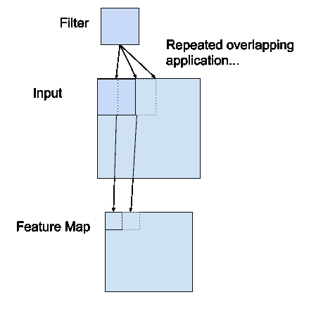

# 卷积层在深度学习神经网络中是如何工作的？

> 原文：<https://machinelearningmastery.com/convolutional-layers-for-deep-learning-neural-networks/>

最后更新于 2020 年 4 月 17 日

卷积层是卷积神经网络中使用的主要构件。

卷积是将滤波器简单地应用于导致激活的输入。对输入重复应用相同的过滤器会产生一个称为特征图的激活图，指示输入(如图像)中检测到的特征的位置和强度。

卷积神经网络的创新之处在于能够在特定预测建模问题(如图像分类)的约束下，自动并行学习特定于训练数据集的大量滤波器。结果是可以在输入图像的任何地方检测到高度特定的特征。

在本教程中，您将发现卷积如何在卷积神经网络中工作。

完成本教程后，您将知道:

*   卷积神经网络对输入应用滤波器来创建特征图，该特征图总结了输入中检测到的特征的存在。
*   滤波器可以手工制造，例如线检测器，但是卷积神经网络的创新是在特定预测问题的背景下在训练期间学习滤波器。
*   如何计算卷积神经网络中一维和二维卷积层的特征图？

**用我的新书[计算机视觉深度学习](https://machinelearningmastery.com/deep-learning-for-computer-vision/)启动你的项目**，包括*分步教程*和所有示例的 *Python 源代码*文件。

我们开始吧。


深度学习神经网络卷积层的温和介绍
图片由 [mendhak](https://www.flickr.com/photos/mendhak/5059410544/) 提供，保留部分权利。

## 教程概述

本教程分为四个部分；它们是:

1.  卷积神经网络中的卷积
2.  计算机视觉中的卷积
3.  学习过滤器的力量
4.  卷积层的工作示例

## 卷积神经网络中的卷积

卷积神经网络，简称 CNN，是一种专门设计用于处理二维图像数据的神经网络模型，尽管它们可以用于一维和三维数据。

卷积神经网络的核心是赋予网络名称的卷积层。该层执行一个称为“*卷积*的操作。

在卷积神经网络的上下文中，卷积是一种线性运算，涉及一组权重与输入的相乘，很像传统的神经网络。假设该技术是为二维输入而设计的，则在输入数据数组和二维权重数组(称为过滤器或内核)之间执行乘法。

滤波器比输入数据小，在滤波器大小的输入块和滤波器之间应用的乘法类型是点积。一个[点积](https://en.wikipedia.org/wiki/Dot_product)是输入的滤波器大小的面片和滤波器之间的元素乘法，然后求和，总是得到一个单一的值。因为它产生单个值，所以该运算通常被称为“*标量积*”。

使用小于输入的滤波器是有意的，因为它允许相同的滤波器(一组权重)在输入的不同点与输入数组相乘多次。具体来说，过滤器从左到右、从上到下系统地应用于输入数据的每个重叠部分或过滤器大小的块。

在图像上系统地应用相同的滤镜是一个很好的主意。如果过滤器被设计为检测输入中的特定类型的特征，则该过滤器在整个输入图像中的系统应用允许过滤器有机会在图像中的任何地方发现该特征。这种能力通常被称为平移不变性，例如，对特征是否存在的普遍兴趣，而不是它存在的位置。

> 如果我们更关心某个特征是否存在，而不是它到底在哪里，那么对局部平移的不变性可能是一个非常有用的特性。例如，在确定图像是否包含人脸时，我们不需要知道眼睛的位置具有像素级的完美准确率，我们只需要知道在人脸的左侧有一只眼睛，在人脸的右侧有一只眼睛。

—第 342 页，[深度学习](https://amzn.to/2Dl124s)，2016。

将滤波器与输入数组相乘一次得到的输出是单个值。当过滤器多次应用于输入数组时，结果是一个二维的输出值数组，表示对输入的过滤。因此，来自该操作的二维输出阵列被称为“*特征图*”。

一旦创建了要素图，我们就可以通过非线性传递要素图中的每个值，例如 ReLU，就像我们对完全连接的层的输出所做的那样。



应用于二维输入以创建要素地图的过滤器示例

如果你来自数字信号处理领域或数学的相关领域，你可能会把矩阵的卷积运算理解为不同的东西。具体来说，过滤器(内核)在应用到输入之前会被翻转。从技术上讲，卷积神经网络使用中描述的卷积实际上是“*互相关”*。尽管如此，在深度学习中，它被称为“*卷积*”运算。

> 许多机器学习库实现了互相关，但称之为卷积。

—第 333 页，[深度学习](https://amzn.to/2Dl124s)，2016。

综上所述，我们有一个*输入*，比如一个像素值的图像，我们有一个*滤波器*，它是一组权重，这个滤波器被系统地应用到输入数据中，创建一个*特征图*。

## 计算机视觉中的卷积

将卷积运算应用于图像数据的想法对于卷积神经网络来说并不是新的或独特的；这是计算机视觉中常用的技术。

从历史上看，过滤器是由计算机视觉专家手工设计的，然后将其应用于图像以产生特征图或应用过滤器的输出，然后以某种方式使图像的分析更容易。

例如，下面是一个手工制作的 3×3 元素过滤器，用于检测垂直线:

```py
0.0, 1.0, 0.0
0.0, 1.0, 0.0
0.0, 1.0, 0.0
```

将此过滤器应用于图像将生成仅包含垂直线的要素地图。它是一个垂直线探测器。

从过滤器中的权重值可以看出这一点；中心垂直线中的任何像素值都将被正激活，任何一侧的任何像素值都将被负激活。跨图像中的像素值系统地拖动此滤镜只能突出显示垂直线像素。

也可以创建水平线检测器并将其应用于图像，例如:

```py
0.0, 0.0, 0.0
1.0, 1.0, 1.0
0.0, 0.0, 0.0
```

组合来自两个过滤器的结果，例如组合两个特征图，将导致图像中的所有线被高亮显示。

可以设计一套数十个甚至数百个其他小过滤器来检测图像中的其他特征。

在神经网络中使用卷积运算的创新之处在于，滤波器的值是要在网络训练期间学习的权重。

网络将了解从输入中提取哪些类型的特征。具体而言，在随机梯度下降下训练，网络被迫学习从图像中提取特征，该特征最小化网络被训练来解决的特定任务的损失，例如提取对将图像分类为狗或猫最有用的特征。

在这种背景下，你可以看到这是一个强大的想法。

## 学习过滤器的力量

学习特定于机器学习任务的单个过滤器是一项强大的技术。

然而，卷积神经网络在实践中取得了更多的成就。

### 多重过滤器

卷积神经网络不学习单个滤波器；事实上，对于给定的输入，他们并行学习多个特征。

例如，对于给定的输入，卷积层通常并行学习 32 到 512 个滤波器。

这给了模型 32，甚至 512 从输入中提取特征的不同方式，或者两者的许多不同方式“*学习看到*”并且在训练之后，*看到*输入数据的许多不同方式。

这种多样性允许专门化，例如，不仅仅是线条，而是在您的特定训练数据中看到的特定线条。

### 多通道

彩色图像有多个通道，通常每个颜色通道一个，例如红色、绿色和蓝色。

从数据角度来看，这意味着作为模型输入的单个图像实际上是三个图像。

滤波器必须始终具有与输入相同数量的通道，通常称为“*深度*”。如果输入图像有 3 个通道(例如深度为 3)，则应用于该图像的过滤器也必须有 3 个通道(例如深度为 3)。在这种情况下，对于行、列和深度，3×3 过滤器实际上是 3x3x3 或[3，3，3]。无论输入的深度和过滤器的深度如何，过滤器都使用点积运算应用于输入，从而产生单个值。

这意味着，如果卷积层具有 32 个滤波器，这 32 个滤波器不仅对于二维图像输入是二维的，而且也是三维的，对于三个通道中的每一个都具有特定的滤波器权重。然而，每个过滤器产生一个单一的特征图。这意味着对于所创建的 32 个特征图，应用具有 32 个滤波器的卷积层的输出深度是 32。

### 多层

卷积层不仅应用于输入数据，例如原始像素值，还可以应用于其他层的输出。

卷积层的堆叠允许输入的分层分解。

考虑直接对原始像素值进行操作的滤波器将学习提取低级特征，例如线。

对第一线层的输出进行操作的过滤器可以提取作为较低级特征的组合的特征，例如包括多条线以表达形状的特征。

这个过程一直持续到非常深的层提取人脸、动物、房屋等等。

这正是我们在实践中看到的。随着网络深度的增加，特征的抽象程度越来越高。

## 卷积层的工作示例

Keras 深度学习库提供了一套卷积层。

我们可以通过查看一些使用人为数据和手工过滤器的工作示例来更好地理解卷积运算。

在本节中，我们将同时查看一维卷积层和二维卷积层示例，以使卷积操作具体化，并提供一个使用 Keras 层的工作示例。

### 1D 卷积层的例子

我们可以定义一个一维输入，它有八个元素，所有元素的值都是 0.0，中间有两个元素凸起，值是 1.0。

```py
[0, 0, 0, 1, 1, 0, 0, 0]
```

对于 1D 卷积层，Keras 的输入必须是三维的。

第一维指每个输入样本；在这种情况下，我们只有一个样本。第二个维度是指每个样本的长度；在这种情况下，长度是八。第三维度是指每个样本中的通道数；在这种情况下，我们只有一个通道。

因此，输入数组的形状将是[1，8，1]。

```py
# define input data
data = asarray([0, 0, 0, 1, 1, 0, 0, 0])
data = data.reshape(1, 8, 1)
```

我们将定义一个期望输入样本具有形状[8，1]的模型。

该模型将有一个形状为 3 或三个元素宽的过滤器。Keras 将过滤器的形状称为*内核大小*。

```py
# create model
model = Sequential()
model.add(Conv1D(1, 3, input_shape=(8, 1)))
```

默认情况下，卷积层中的滤波器用随机权重初始化。在这个人为的例子中，我们将手动指定单个过滤器的权重。我们将定义一个能够检测凸起的过滤器，即由低输入值包围的高输入值，正如我们在输入示例中定义的那样。

我们将定义的三元素过滤器如下所示:

```py
[0, 1, 0]
```

卷积层也有一个偏置输入值，也需要一个权重，我们将设置为零。

因此，我们可以强制一维卷积层的权重使用手工滤波器，如下所示:

```py
# define a vertical line detector
weights = [asarray([[[0]],[[1]],[[0]]]), asarray([0.0])]
# store the weights in the model
model.set_weights(weights)
```

必须在三维结构中按照行、列和通道来指定权重。该筛选器有一行、三列和一个通道。

我们可以检索重量并确认它们设置正确。

```py
# confirm they were stored
print(model.get_weights())
```

最后，我们可以对输入数据应用单个过滤器。

我们可以通过调用模型上的 *predict()* 函数来实现。这将直接返回特征图:即在输入序列中系统地应用过滤器的输出。

```py
# apply filter to input data
yhat = model.predict(data)
print(yhat)
```

将所有这些结合在一起，下面列出了完整的示例。

```py
# example of calculation 1d convolutions
from numpy import asarray
from keras.models import Sequential
from keras.layers import Conv1D
# define input data
data = asarray([0, 0, 0, 1, 1, 0, 0, 0])
data = data.reshape(1, 8, 1)
# create model
model = Sequential()
model.add(Conv1D(1, 3, input_shape=(8, 1)))
# define a vertical line detector
weights = [asarray([[[0]],[[1]],[[0]]]), asarray([0.0])]
# store the weights in the model
model.set_weights(weights)
# confirm they were stored
print(model.get_weights())
# apply filter to input data
yhat = model.predict(data)
print(yhat)
```

运行示例首先打印网络的权重；这证实了我们的手工过滤器是按照我们的预期设置在模型中的。

接下来，将过滤器应用于输入模式，并计算和显示特征图。我们可以从特征图的值中看到，凹凸被正确检测到。

```py
[array([[[0.]],
       [[1.]],
       [[0.]]], dtype=float32), array([0.], dtype=float32)]

[[[0.]
  [0.]
  [1.]
  [1.]
  [0.]
  [0.]]]
```

让我们仔细看看这里发生了什么。

回想一下，输入是一个八元素向量，值为:[0，0，0，1，1，0，0，0]。

首先，通过计算点积(")将三元素滤波器[0，1，0]应用于输入[0，0，0]的前三个输入运算符)，这导致要素图中的单个输出值为零。

回想一下，点积是元素乘法的和，或者这里是(0 x 0) + (1 x 0) + (0 x 0) = 0。在 NumPy 中，这可以手动实现为:

```py
from numpy import asarray
print(asarray([0, 1, 0]).dot(asarray([0, 0, 0])))
```

在我们的手动示例中，如下所示:

```py
[0, 1, 0] . [0, 0, 0] = 0
```

然后沿着输入序列的一个元素移动过滤器，并重复该过程；具体来说，对索引 1、2 和 3 处的输入序列应用了相同的过滤器，这也导致了要素图中的零输出。

```py
[0, 1, 0] . [0, 0, 1] = 0
```

我们是系统化的，所以再次，过滤器沿着输入的另一个元素移动，并应用于索引 2、3 和 4 处的输入。这一次输出在要素地图中的值为 1。我们检测到了这个特征，并适当地激活了它。

```py
[0, 1, 0] . [0, 1, 1] = 1
```

重复这个过程，直到我们计算出整个特征图。

```py
[0, 0, 1, 1, 0, 0]
```

请注意，要素图有六个元素，而我们的输入有八个元素。这是滤波器如何应用于输入序列的假象。还有其他方法可以将过滤器应用到改变结果特征图形状的输入序列，例如填充，但我们不会在这篇文章中讨论这些方法。

您可以想象，使用不同的输入，我们可能会以或多或少的强度检测到特征，并且在过滤器中使用不同的权重，我们将检测到输入序列中的不同特征。

### 2D 卷积层的例子

我们可以将上一节中的凹凸检测示例扩展为二维图像中的垂直线检测器。

同样，我们可以限制输入，在这种情况下是一个 8×8 像素的正方形输入图像，其中有一个通道(例如灰度)，中间有一条垂直线。

```py
[0, 0, 0, 1, 1, 0, 0, 0]
[0, 0, 0, 1, 1, 0, 0, 0]
[0, 0, 0, 1, 1, 0, 0, 0]
[0, 0, 0, 1, 1, 0, 0, 0]
[0, 0, 0, 1, 1, 0, 0, 0]
[0, 0, 0, 1, 1, 0, 0, 0]
[0, 0, 0, 1, 1, 0, 0, 0]
[0, 0, 0, 1, 1, 0, 0, 0]
```

Conv2D 层的输入必须是四维的。

第一维定义了样本；在这种情况下，只有一个样本。第二维度定义行数；在这种情况下，八个。第三维度定义了列的数量，在这种情况下也是八列，最后是通道的数量，在这种情况下是一个。

因此，在这种情况下，输入必须具有四维形状[样本、行、列、通道]或[1，8，8，1]。

```py
# define input data
data = [[0, 0, 0, 1, 1, 0, 0, 0],
		[0, 0, 0, 1, 1, 0, 0, 0],
		[0, 0, 0, 1, 1, 0, 0, 0],
		[0, 0, 0, 1, 1, 0, 0, 0],
		[0, 0, 0, 1, 1, 0, 0, 0],
		[0, 0, 0, 1, 1, 0, 0, 0],
		[0, 0, 0, 1, 1, 0, 0, 0],
		[0, 0, 0, 1, 1, 0, 0, 0]]
data = asarray(data)
data = data.reshape(1, 8, 8, 1)
```

我们将使用单个滤波器定义 Conv2D，就像我们在上一节中使用 Conv1D 示例所做的那样。

过滤器将是二维和正方形，形状为 3×3。该层将期望输入样本具有形状[列、行、通道]或[8，8，1]。

```py
# create model
model = Sequential()
model.add(Conv2D(1, (3,3), input_shape=(8, 8, 1)))
```

我们将定义一个垂直线检测器过滤器来检测输入数据中的单个垂直线。

过滤器如下所示:

```py
0, 1, 0
0, 1, 0
0, 1, 0
```

我们可以这样实现:

```py
# define a vertical line detector
detector = [[[[0]],[[1]],[[0]]],
            [[[0]],[[1]],[[0]]],
            [[[0]],[[1]],[[0]]]]
weights = [asarray(detector), asarray([0.0])]
# store the weights in the model
model.set_weights(weights)
# confirm they were stored
print(model.get_weights())
```

最后，我们将对输入图像应用过滤器，这将产生一个特征图，我们期望显示输入图像中垂直线的检测。

```py
# apply filter to input data
yhat = model.predict(data)
```

要素地图输出的形状将是四维的，具有形状[批次、行、列、过滤器]。我们将执行单个批处理，我们有一个滤波器(一个滤波器和一个输入通道)，因此输出形状为[1，？, ?, 1].我们可以将单个要素地图的内容漂亮地打印如下:

```py
for r in range(yhat.shape[1]):
	# print each column in the row
	print([yhat[0,r,c,0] for c in range(yhat.shape[2])])
```

将所有这些结合在一起，下面列出了完整的示例。

```py
# example of calculation 2d convolutions
from numpy import asarray
from keras.models import Sequential
from keras.layers import Conv2D
# define input data
data = [[0, 0, 0, 1, 1, 0, 0, 0],
		[0, 0, 0, 1, 1, 0, 0, 0],
		[0, 0, 0, 1, 1, 0, 0, 0],
		[0, 0, 0, 1, 1, 0, 0, 0],
		[0, 0, 0, 1, 1, 0, 0, 0],
		[0, 0, 0, 1, 1, 0, 0, 0],
		[0, 0, 0, 1, 1, 0, 0, 0],
		[0, 0, 0, 1, 1, 0, 0, 0]]
data = asarray(data)
data = data.reshape(1, 8, 8, 1)
# create model
model = Sequential()
model.add(Conv2D(1, (3,3), input_shape=(8, 8, 1)))
# define a vertical line detector
detector = [[[[0]],[[1]],[[0]]],
            [[[0]],[[1]],[[0]]],
            [[[0]],[[1]],[[0]]]]
weights = [asarray(detector), asarray([0.0])]
# store the weights in the model
model.set_weights(weights)
# confirm they were stored
print(model.get_weights())
# apply filter to input data
yhat = model.predict(data)
for r in range(yhat.shape[1]):
	# print each column in the row
	print([yhat[0,r,c,0] for c in range(yhat.shape[2])])
```

运行该示例首先确认手工过滤器在层权重中定义正确

接下来，打印计算出的要素图。从数字的比例中我们可以看出，过滤器确实检测到了特征图中间具有强激活的单个垂直线。

```py
[array([[[[0.]],
        [[1.]],
        [[0.]]],
       [[[0.]],
        [[1.]],
        [[0.]]],
       [[[0.]],
        [[1.]],
        [[0.]]]], dtype=float32), array([0.], dtype=float32)]

[0.0, 0.0, 3.0, 3.0, 0.0, 0.0]
[0.0, 0.0, 3.0, 3.0, 0.0, 0.0]
[0.0, 0.0, 3.0, 3.0, 0.0, 0.0]
[0.0, 0.0, 3.0, 3.0, 0.0, 0.0]
[0.0, 0.0, 3.0, 3.0, 0.0, 0.0]
[0.0, 0.0, 3.0, 3.0, 0.0, 0.0]
```

让我们仔细看看计算出了什么。

首先，将滤镜应用于图像的左上角，即 3×3 元素的图像块。从技术上来说，图像块是三维的，只有一个通道，过滤器也有相同的尺寸。我们不能使用[点()](https://docs.scipy.org/doc/numpy/reference/generated/numpy.dot.html)函数在 NumPy 中实现这一点，相反，我们必须使用 [tensordot()](https://docs.scipy.org/doc/numpy/reference/generated/numpy.tensordot.html) 函数，以便我们可以适当地对所有维度求和，例如:

```py
from numpy import asarray
from numpy import tensordot
m1 = asarray([[0, 1, 0],
			  [0, 1, 0],
			  [0, 1, 0]])
m2 = asarray([[0, 0, 0],
			  [0, 0, 0],
			  [0, 0, 0]])
print(tensordot(m1, m2))
```

该计算导致 0.0 的单个输出值，例如，未检测到特征。这为我们提供了要素地图左上角的第一个元素。

手动，如下所示:

```py
0, 1, 0     0, 0, 0
0, 1, 0  .  0, 0, 0 = 0
0, 1, 0     0, 0, 0
```

过滤器向左移动一列，重复该过程。同样，不会检测到该特征。

```py
0, 1, 0     0, 0, 1
0, 1, 0  .  0, 0, 1 = 0
0, 1, 0     0, 0, 1
```

再向左移动一次到下一列，该特征就被第一次检测到，导致强激活。

```py
0, 1, 0     0, 1, 1
0, 1, 0  .  0, 1, 1 = 3
0, 1, 0     0, 1, 1
```

重复该过程，直到滤波器的边缘靠在输入图像的边缘或最后一列上。这给出了要素地图第一整行中的最后一个元素。

```py
[0.0, 0.0, 3.0, 3.0, 0.0, 0.0]
```

然后，过滤器向下移动一行，回到第一列，该过程从左到右相关，得到要素图的第二行。打开，直到滤镜的底部停留在输入图像的底部或最后一行。

同样，与上一节一样，我们可以看到特征图是一个 6×6 的矩阵，小于 8×8 的输入图像，因为滤波器如何应用于输入图像受到限制。

## 进一步阅读

如果您想更深入地了解这个主题，本节将提供更多资源。

### 邮件

*   [机器学习卷积神经网络速成班](https://machinelearningmastery.com/crash-course-convolutional-neural-networks/)

### 书

*   第九章:卷积网络，[深度学习](https://amzn.to/2Dl124s)，2016。
*   第五章:计算机视觉深度学习，[Python 深度学习](https://amzn.to/2Dnshvc)，2017。

### 应用程序接口

*   [Keras 卷积层应用编程接口](https://keras.io/layers/convolutional/)
*   num py . asar ray API

## 摘要

在本教程中，您发现了卷积在卷积神经网络中是如何工作的。

具体来说，您了解到:

*   卷积神经网络对输入应用滤波器来创建特征图，该特征图总结了输入中检测到的特征的存在。
*   滤波器可以手工制造，例如线检测器，但是卷积神经网络的创新是在特定预测问题的背景下在训练期间学习滤波器。
*   如何计算卷积神经网络中一维和二维卷积层的特征图？

你有什么问题吗？
在下面的评论中提问，我会尽力回答。