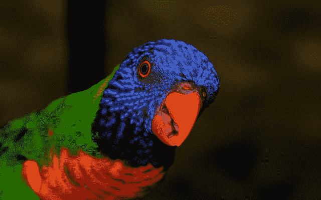
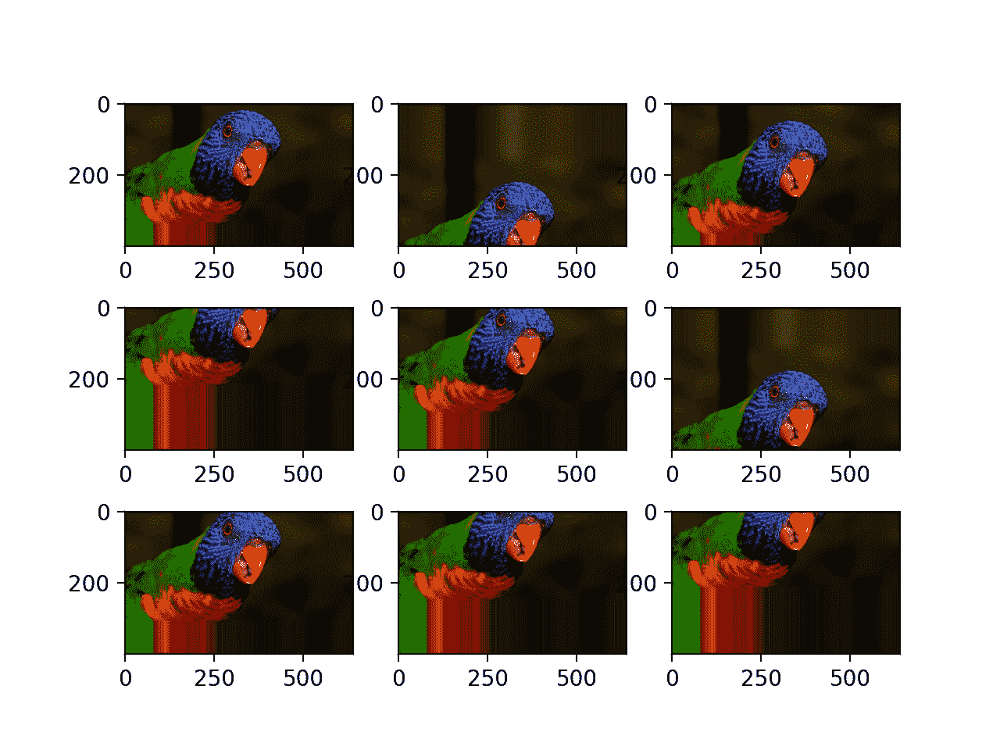
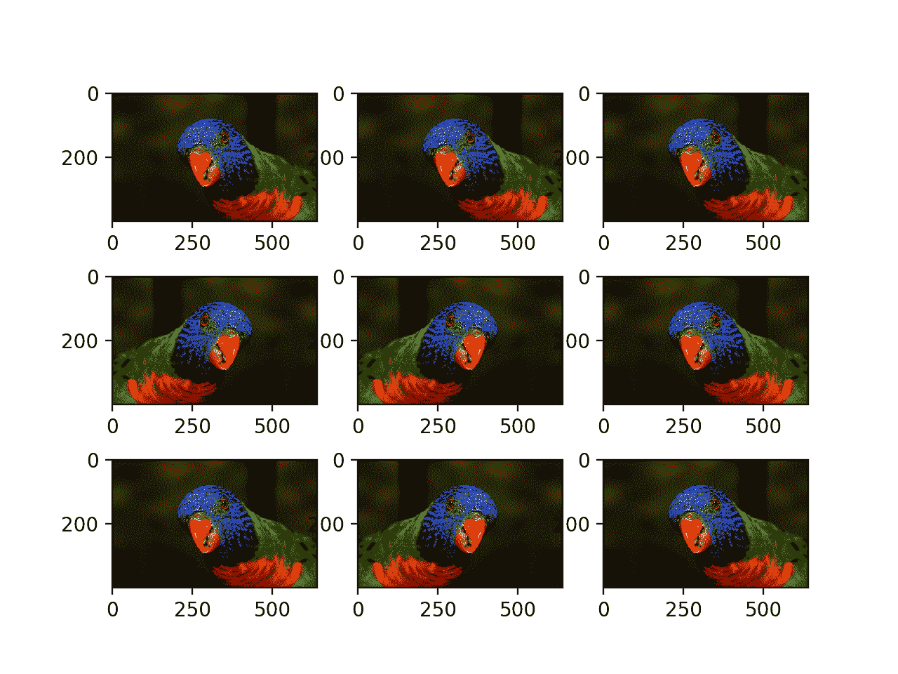
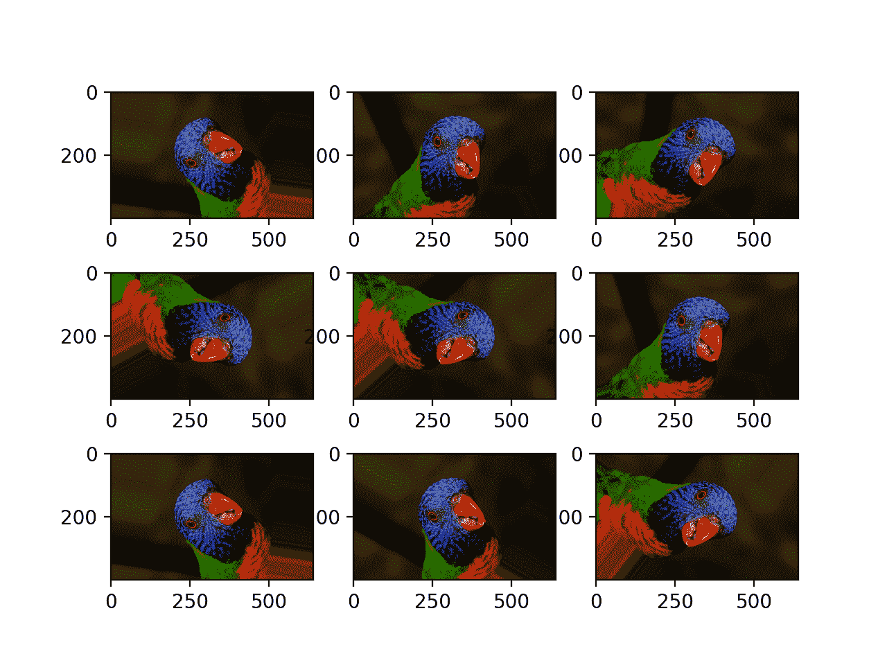
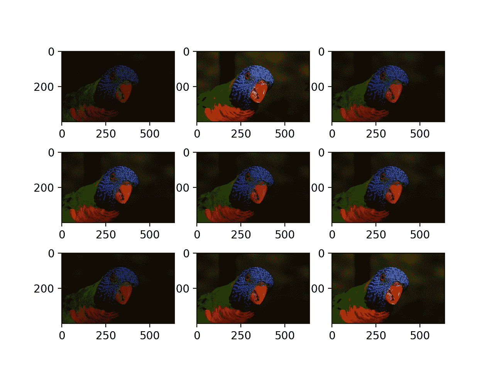
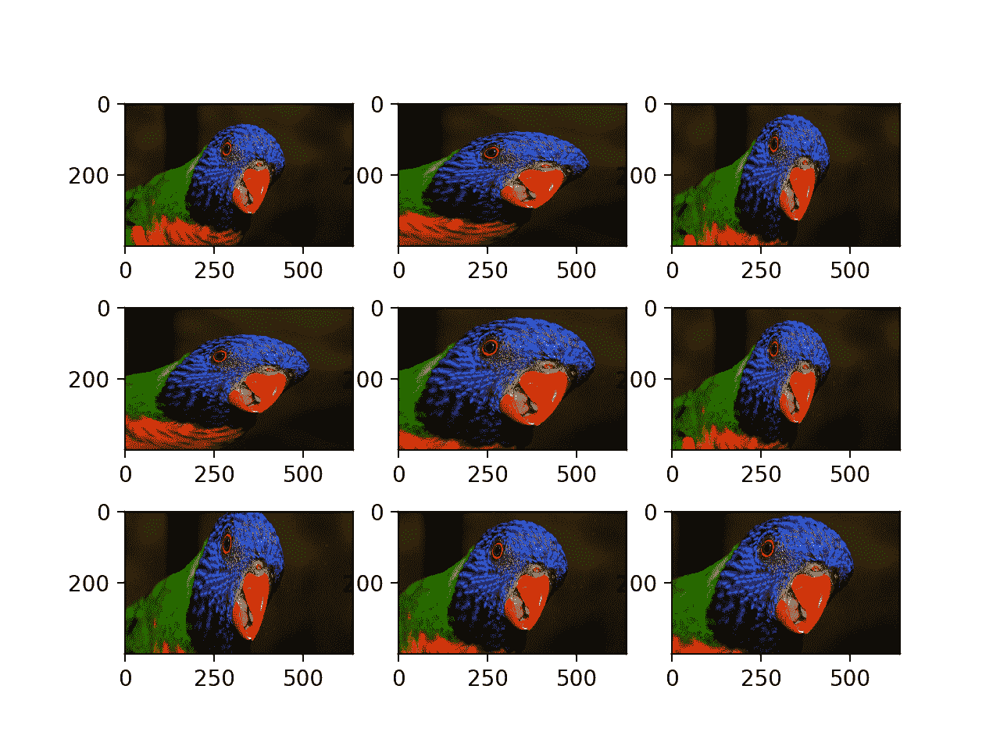

# 如何在 Keras 中配置图像数据扩充

> 原文：<https://machinelearningmastery.com/how-to-configure-image-data-augmentation-when-training-deep-learning-neural-networks/>

最后更新于 2019 年 7 月 5 日

图像数据扩充是一种技术，可用于通过在数据集中创建图像的修改版本来人工扩展训练数据集的大小。

在更多的数据上训练深度学习神经网络模型可以产生更熟练的模型，并且增强技术可以创建图像的变化，这可以提高拟合模型将他们所学知识推广到新图像的能力。

Keras 深度学习神经网络库通过 *ImageDataGenerator* 类提供了使用图像数据扩充来拟合模型的能力。

在本教程中，您将发现如何在训练深度学习神经网络时使用图像数据扩充。

完成本教程后，您将知道:

*   为了提高模型的表现和泛化能力，使用图像数据扩充来扩展训练数据集。
*   Keras 深度学习库中通过 *ImageDataGenerator* 类支持图像数据扩充。
*   如何使用移动，翻转，亮度和缩放图像数据扩充。

**用我的新书[计算机视觉深度学习](https://machinelearningmastery.com/deep-learning-for-computer-vision/)启动你的项目**，包括*分步教程*和所有示例的 *Python 源代码*文件。

我们开始吧。

*   **更新 2019 年 5 月**:出图时像素值的固定数据类型。
*   **更新 6 月/2019** :修复了 API 示例中的小错别字(感谢圣乔治)。

## 教程概述

本教程分为八个部分；它们是:

1.  图像数据增长
2.  样本图像
3.  使用图像数据生成器进行图像扩充
4.  水平和垂直位移增强
5.  水平和垂直翻转增强
6.  随机旋转增强
7.  随机亮度增强
8.  随机缩放增加

## 图像数据增长

深度学习神经网络的表现通常会随着可用数据量的增加而提高。

数据扩充是一种从现有训练数据中人工创建新训练数据的技术。这是通过将特定于领域的技术应用于来自训练数据的示例来完成的，这些训练数据创建了新的和不同的训练示例。

图像数据扩充可能是最广为人知的数据扩充类型，包括在训练数据集中创建与原始图像属于同一类的图像的变换版本。

变换包括图像处理领域的一系列操作，例如移动、翻转、缩放等等。

目的是用新的、合理的例子扩展训练数据集。这意味着，模型可能会看到训练集图像的变化。例如，水平翻转一张猫的照片可能有意义，因为照片可能是从左边或右边拍摄的。猫的照片垂直翻转是没有意义的，也可能是不合适的，因为模特不太可能看到颠倒的猫的照片。

因此，很明显，必须在训练数据集和问题领域知识的背景下谨慎选择用于训练数据集的特定数据扩充技术。此外，单独和协同地试验数据扩充方法，看看它们是否会对模型表现产生可衡量的改进，这可能是有用的，也许可以使用一个小的原型数据集、模型和训练运行。

现代深度学习算法，如卷积神经网络，或 CNN，可以学习对其在图像中的位置不变的特征。然而，增强可以进一步帮助这种变换不变的学习方法，并且可以帮助模型学习对变换也不变的特征，例如从左到右到自上而下的排序、照片中的光照水平等等。

图像数据扩充通常仅适用于训练数据集，而不适用于验证或测试数据集。这与图像大小调整和像素缩放等数据准备不同；它们必须在与模型交互的所有数据集上一致地执行。

## 样本图像

我们需要一个样本图像来演示标准的数据扩充技术。

在本教程中，我们将使用一张名为“[羽毛朋友](https://www.flickr.com/photos/thenovys/3854468621/)”的鸟的照片，该照片由 AndYaDontStop 拍摄，并在许可许可下发布。

下载图像并保存在当前工作目录下，文件名为“*bird.jpg*”。



羽毛的朋友，由安德亚登斯托普拍摄。
保留部分权利。

*   [下载照片(bird.jpg)](https://machinelearningmastery.com/wp-content/uploads/2019/01/bird.jpg)

## 使用图像数据生成器进行图像扩充

Keras 深度学习库提供了在训练模型时自动使用数据扩充的能力。

这是通过使用[图像数据生成器类](https://keras.io/preprocessing/image/)来实现的。

首先，类可以被实例化，数据扩充类型的配置由类构造函数的参数指定。

支持一系列技术以及像素缩放方法。我们将重点关注五种主要的图像数据扩充技术；具体来说:

*   图像通过*宽度 _ 移动 _ 范围*和*高度 _ 移动 _ 范围*参数移动。
*   图像通过*水平翻转*和*垂直翻转*参数翻转。
*   通过*旋转 _ 范围*参数进行图像旋转
*   通过*亮度 _ 范围*参数的图像亮度。
*   通过 *zoom_range* 参数进行图像缩放。

例如，可以构造 ImageDataGenerator 类的一个实例。

```py
...
# create data generator
datagen = ImageDataGenerator()
```

一旦构造完成，就可以为图像数据集创建迭代器。

迭代器将为每次迭代返回一批增强图像。

迭代器可以通过 *flow()* 函数从加载到内存中的图像数据集创建；例如:

```py
...
# load image dataset
X, y = ...
# create iterator
it = datagen.flow(X, y)
```

或者，可以为位于磁盘上指定目录中的图像数据集创建迭代器，其中该目录中的图像根据它们的类别被组织到子目录中。

```py
...
# create iterator
it = datagen.flow_from_directory(X, y, ...)
```

一旦创建了迭代器，就可以通过调用 *fit_generator()* 函数来训练神经网络模型。

*步长/周期*参数必须指定组成一个周期的样本批次数。例如，如果您的原始数据集有 10，000 个图像，并且您的批次大小为 32，那么在增强数据上拟合模型时， *steps_per_epoch* 的合理值可能是 *ceil(10，000/32)* ，或者 313 个批次。

```py
# define model
model = ...
# fit model on the augmented dataset
model.fit_generator(it, steps_per_epoch=313, ...)
```

数据集中的图像不会直接使用。相反，只有增强图像被提供给模型。因为增强是随机执行的，这允许在训练期间生成和使用修改的图像和原始图像的近照(例如，几乎没有增强)。

数据生成器也可用于指定验证数据集和测试数据集。通常，使用单独的*图像数据生成器*实例，该实例可能具有与用于训练数据集的*图像数据生成器*实例相同的像素缩放配置(本教程中未涉及)，但不使用数据扩充。这是因为数据扩充仅用作一种技术，用于人工扩展训练数据集，以提高未增强数据集上的模型表现。

现在我们已经熟悉了如何使用 *ImageDataGenerator* ，接下来让我们来看看一些针对图像数据的具体数据扩充技术。

我们将通过查看图像扩充后的示例来单独演示每种技术。这是一个很好的实践，建议在配置数据扩充时使用。训练时同时使用一系列增强技术也很常见。我们已经将这些技术分离为每个部分一个，仅用于演示目的。

## 水平和垂直位移增强

移动到图像意味着在一个方向上移动图像的所有像素，例如水平或垂直，同时保持图像尺寸相同。

这意味着图像中的一些像素将被剪切掉，并且图像中有一个区域需要指定新的像素值。

*图像数据生成器*构造器的*宽度 _ 位移 _ 范围*和*高度 _ 位移 _ 范围*参数分别控制水平和垂直位移量。

这些参数可以指定一个浮点值，该值指示要移动的图像的宽度或高度的百分比(介于 0 和 1 之间)。或者，可以指定多个像素来移动图像。

具体而言，对于每个图像和执行的移位，将对在无移位和百分比或像素值之间的范围内的值进行采样，例如[0，值]。或者，您可以指定一个最小和最大范围的元组或数组，从中对移位进行采样；例如:[-100，100]或[-0.5，0.5]。

下面的示例演示了一个水平移动，其 *width_shift_range* 参数在[-200，200]像素之间，并生成了一个生成图像的图来演示效果。

```py
# example of horizontal shift image augmentation
from numpy import expand_dims
from keras.preprocessing.image import load_img
from keras.preprocessing.image import img_to_array
from keras.preprocessing.image import ImageDataGenerator
from matplotlib import pyplot
# load the image
img = load_img('bird.jpg')
# convert to numpy array
data = img_to_array(img)
# expand dimension to one sample
samples = expand_dims(data, 0)
# create image data augmentation generator
datagen = ImageDataGenerator(width_shift_range=[-200,200])
# prepare iterator
it = datagen.flow(samples, batch_size=1)
# generate samples and plot
for i in range(9):
	# define subplot
	pyplot.subplot(330 + 1 + i)
	# generate batch of images
	batch = it.next()
	# convert to unsigned integers for viewing
	image = batch[0].astype('uint8')
	# plot raw pixel data
	pyplot.imshow(image)
# show the figure
pyplot.show()
```

运行该示例创建为图像扩充配置的*图像数据生成器*的实例，然后创建迭代器。迭代器在一个循环中被调用九次，每个增强的图像被绘制出来。

我们可以在结果的图中看到，执行了一系列不同的随机选择的正和负水平移位，并且图像边缘的像素值被复制以填充移位所创建的图像的空白部分。


随机水平位移生成的增广图

下面是通过 *height_shift_range* 参数更新为执行图像垂直移动的相同示例，在这种情况下，指定图像移动的百分比为图像高度的 0.5%。

```py
# example of vertical shift image augmentation
from numpy import expand_dims
from keras.preprocessing.image import load_img
from keras.preprocessing.image import img_to_array
from keras.preprocessing.image import ImageDataGenerator
from matplotlib import pyplot
# load the image
img = load_img('bird.jpg')
# convert to numpy array
data = img_to_array(img)
# expand dimension to one sample
samples = expand_dims(data, 0)
# create image data augmentation generator
datagen = ImageDataGenerator(height_shift_range=0.5)
# prepare iterator
it = datagen.flow(samples, batch_size=1)
# generate samples and plot
for i in range(9):
	# define subplot
	pyplot.subplot(330 + 1 + i)
	# generate batch of images
	batch = it.next()
	# convert to unsigned integers for viewing
	image = batch[0].astype('uint8')
	# plot raw pixel data
	pyplot.imshow(image)
# show the figure
pyplot.show()
```

运行该示例会创建一个图像图，其中增加了随机的正负垂直位移。

我们可以看到，水平和垂直的正负偏移对所选照片可能都有意义，但在某些情况下，图像边缘的重复像素可能对模型没有意义。

请注意，其他填充模式可以通过“*填充 _ 模式*”参数指定。



随机垂直移动的增强图像图

## 水平和垂直翻转增强

图像翻转意味着在垂直或水平翻转的情况下分别反转像素的行或列。

翻转增强由*图像数据生成器*类构造器的布尔*水平翻转*或*垂直翻转*参数指定。对于像本教程中使用的鸟照片这样的照片，水平翻转可能有意义，但垂直翻转没有意义。

对于其他类型的图像，如航空照片、宇宙学照片和显微照片，也许垂直翻转是有意义的。

下面的例子演示了通过*水平翻转*参数用水平翻转来增强所选照片。

```py
# example of horizontal flip image augmentation
from numpy import expand_dims
from keras.preprocessing.image import load_img
from keras.preprocessing.image import img_to_array
from keras.preprocessing.image import ImageDataGenerator
from matplotlib import pyplot
# load the image
img = load_img('bird.jpg')
# convert to numpy array
data = img_to_array(img)
# expand dimension to one sample
samples = expand_dims(data, 0)
# create image data augmentation generator
datagen = ImageDataGenerator(horizontal_flip=True)
# prepare iterator
it = datagen.flow(samples, batch_size=1)
# generate samples and plot
for i in range(9):
	# define subplot
	pyplot.subplot(330 + 1 + i)
	# generate batch of images
	batch = it.next()
	# convert to unsigned integers for viewing
	image = batch[0].astype('uint8')
	# plot raw pixel data
	pyplot.imshow(image)
# show the figure
pyplot.show()
```

运行该示例会创建一个包含九幅增强图像的图。

我们可以看到，水平翻转随机应用于一些图像，而不是其他图像。



随机水平翻转的增强图像图

## 随机旋转增强

旋转增强将图像从 0 度到 360 度随机顺时针旋转给定的度数。

这种旋转可能会将像素旋转出图像帧，并留下帧中没有必须填充的像素数据的区域。

下面的例子通过*旋转范围*参数演示了随机旋转，图像的旋转在 0 到 90 度之间。

```py
# example of random rotation image augmentation
from numpy import expand_dims
from keras.preprocessing.image import load_img
from keras.preprocessing.image import img_to_array
from keras.preprocessing.image import ImageDataGenerator
from matplotlib import pyplot
# load the image
img = load_img('bird.jpg')
# convert to numpy array
data = img_to_array(img)
# expand dimension to one sample
samples = expand_dims(data, 0)
# create image data augmentation generator
datagen = ImageDataGenerator(rotation_range=90)
# prepare iterator
it = datagen.flow(samples, batch_size=1)
# generate samples and plot
for i in range(9):
	# define subplot
	pyplot.subplot(330 + 1 + i)
	# generate batch of images
	batch = it.next()
	# convert to unsigned integers for viewing
	image = batch[0].astype('uint8')
	# plot raw pixel data
	pyplot.imshow(image)
# show the figure
pyplot.show()
```

运行该示例会生成旋转图像的示例，在某些情况下会显示旋转出帧的像素和最近邻填充。



随机旋转增强生成的图像图

## 随机亮度增强

图像的亮度可以通过随机变暗图像、变亮图像或两者来增强。

其目的是允许模型在不同的光照水平下对图像进行概括。

这可以通过将*亮度 _ 范围*参数指定给*图像数据生成器()*构造函数来实现，该构造函数将最小和最大范围指定为代表用于选择增亮量的百分比的浮点数。

小于 1.0 的值会使图像变暗，例如[0.5，1.0]，而大于 1.0 的值会使图像变亮，例如[1.0，1.5]，其中 1.0 对亮度没有影响。

下面的示例演示了亮度图像扩充，允许生成器在 1.0(无变化)和 0.2 或 20%之间随机变暗图像。

```py
# example of brighting image augmentation
from numpy import expand_dims
from keras.preprocessing.image import load_img
from keras.preprocessing.image import img_to_array
from keras.preprocessing.image import ImageDataGenerator
from matplotlib import pyplot
# load the image
img = load_img('bird.jpg')
# convert to numpy array
data = img_to_array(img)
# expand dimension to one sample
samples = expand_dims(data, 0)
# create image data augmentation generator
datagen = ImageDataGenerator(brightness_range=[0.2,1.0])
# prepare iterator
it = datagen.flow(samples, batch_size=1)
# generate samples and plot
for i in range(9):
	# define subplot
	pyplot.subplot(330 + 1 + i)
	# generate batch of images
	batch = it.next()
	# convert to unsigned integers for viewing
	image = batch[0].astype('uint8')
	# plot raw pixel data
	pyplot.imshow(image)
# show the figure
pyplot.show()
```

运行该示例显示了应用了不同变暗量的增强图像。



随机增亮生成的图像图

## 随机缩放增加

缩放增强随机放大图像，或者在图像周围添加新的像素值，或者分别插值像素值。

图像缩放可以通过*图像数据生成器*构造器的*缩放范围*参数进行配置。您可以将缩放百分比指定为单个浮点数，或将范围指定为数组或元组。

如果指定了浮动，则缩放范围将为[1 值，1+值]。例如，如果指定 0.3，则范围将为[0.7，1.3]，或者介于 70%(放大)和 130%(缩小)之间。

分别从每个维度(宽度、高度)的缩放区域中均匀随机地采样缩放量。

缩放可能感觉不直观。请注意，小于 1.0 的缩放值将放大图像，例如[0.5，0.5]使图像中的对象变大或变近 50%，大于 1.0 的值将缩小图像 50%，例如[1.5，1.5]使图像中的对象变小或变远。[1.0，1.0]的缩放没有效果。

下面的例子演示了放大图像，例如放大照片中的对象。

```py
# example of zoom image augmentation
from numpy import expand_dims
from keras.preprocessing.image import load_img
from keras.preprocessing.image import img_to_array
from keras.preprocessing.image import ImageDataGenerator
from matplotlib import pyplot
# load the image
img = load_img('bird.jpg')
# convert to numpy array
data = img_to_array(img)
# expand dimension to one sample
samples = expand_dims(data, 0)
# create image data augmentation generator
datagen = ImageDataGenerator(zoom_range=[0.5,1.0])
# prepare iterator
it = datagen.flow(samples, batch_size=1)
# generate samples and plot
for i in range(9):
	# define subplot
	pyplot.subplot(330 + 1 + i)
	# generate batch of images
	batch = it.next()
	# convert to unsigned integers for viewing
	image = batch[0].astype('uint8')
	# plot raw pixel data
	pyplot.imshow(image)
# show the figure
pyplot.show()
```

运行该示例会生成缩放图像的示例，显示宽度和高度维度不同的随机放大，这也会随机更改图像中对象的纵横比。



随机放大型生成的图像图

## 进一步阅读

如果您想更深入地了解这个主题，本节将提供更多资源。

### 邮件

*   [利用 Keras 进行深度学习的图像扩充](https://machinelearningmastery.com/image-augmentation-deep-learning-keras/)

### 应用程序接口

*   [图像预处理 Keras API](https://keras.io/preprocessing/image/)
*   [Keras 图像预处理代码](https://github.com/keras-team/keras-preprocessing/blob/master/keras_preprocessing/image/affine_transformations.py)
*   [顺序模型应用编程接口](https://keras.io/models/sequential/)

### 文章

*   [用很少的数据构建强大的图像分类模型，Keras Blog](https://blog.keras.io/building-powerful-image-classification-models-using-very-little-data.html) 。

## 摘要

在本教程中，您发现了如何在训练深度学习神经网络时使用图像数据扩充。

具体来说，您了解到:

*   为了提高模型的表现和泛化能力，使用图像数据扩充来扩展训练数据集。
*   Keras 深度学习库中通过 ImageDataGenerator 类支持图像数据扩充。
*   如何使用移动，翻转，亮度和缩放图像数据扩充。

你有什么问题吗？
在下面的评论中提问，我会尽力回答。