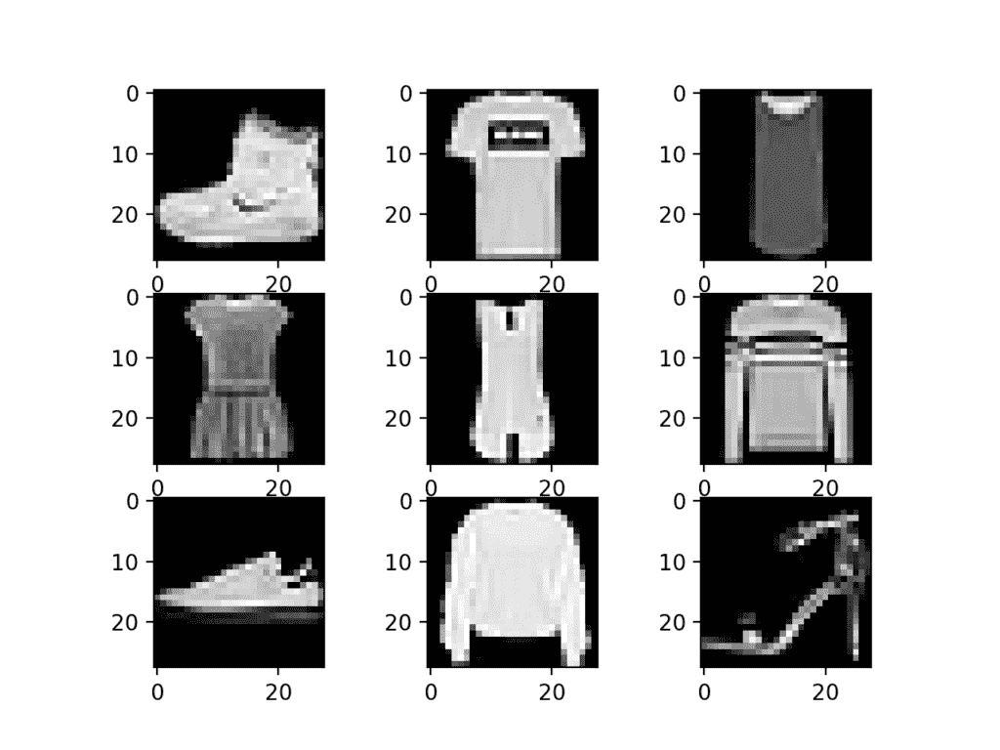
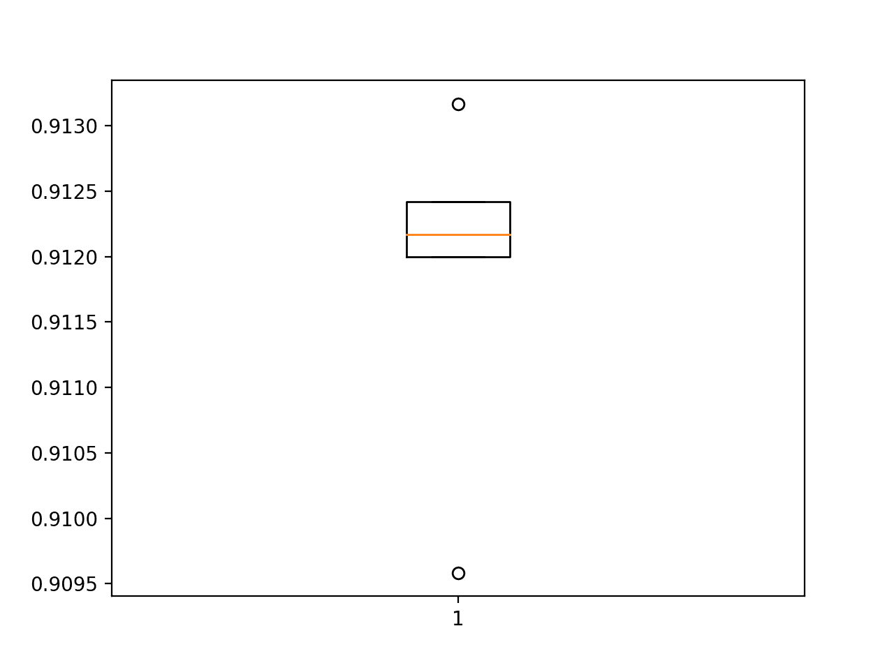
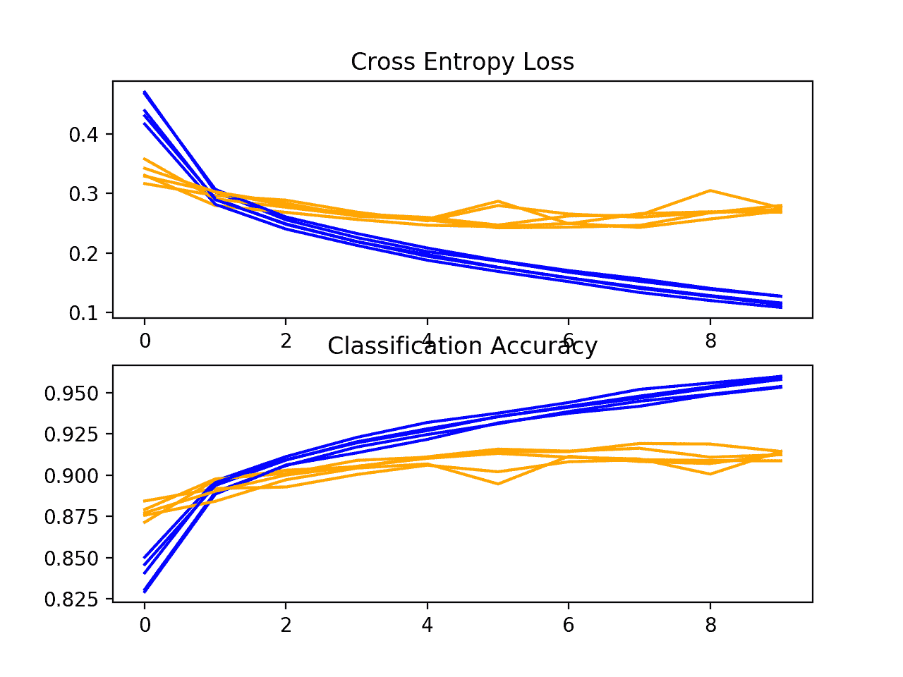
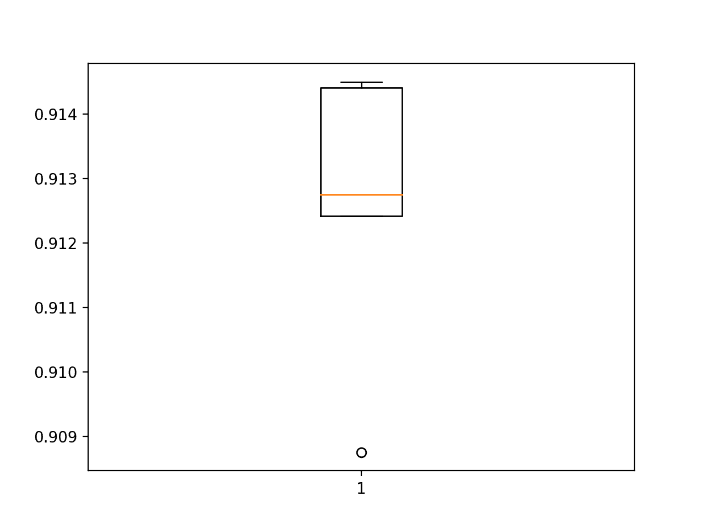
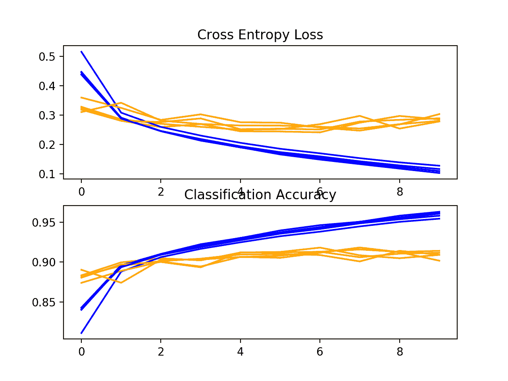
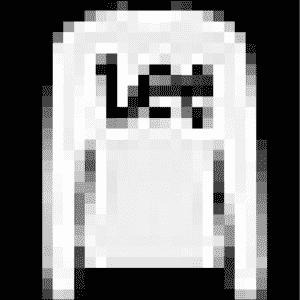

# 用于 Fashion-MNIST 服装分类的深度学习 CNN

> 原文：<https://machinelearningmastery.com/how-to-develop-a-cnn-from-scratch-for-fashion-mnist-clothing-classification/>

最后更新于 2020 年 8 月 28 日

时装-MNIST 服装分类问题是一个用于计算机视觉和深度学习的新标准数据集。

虽然数据集相对简单，但它可以作为学习和实践如何从零开始开发、评估和使用深度卷积神经网络进行图像分类的基础。这包括如何开发一个健壮的测试工具来评估模型的表现，如何探索模型的改进，以及如何保存模型并在以后加载它来对新数据进行预测。

在本教程中，您将发现如何从零开始开发用于服装分类的卷积神经网络。

完成本教程后，您将知道:

*   如何开发一个测试工具来开发一个健壮的模型评估，并为分类任务建立一个表现基线。
*   如何探索基线模型的扩展，以提高学习和模型能力。
*   如何开发最终模型，评估最终模型的表现，并使用它对新图像进行预测。

**用我的新书[计算机视觉深度学习](https://machinelearningmastery.com/deep-learning-for-computer-vision/)启动你的项目**，包括*分步教程*和所有示例的 *Python 源代码*文件。

我们开始吧。

*   **更新 2019 年 6 月**:修复了在 CV 循环之外定义模型的小错误。更新结果(感谢 Aditya)。
*   **2019 年 10 月更新**:针对 Keras 2.3 和 TensorFlow 2.0 更新。


如何从零开始为时尚 MNIST 服装分类开发深度卷积神经网络
图片由 [Zdrovit Skurcz](https://www.flickr.com/photos/zdrovit/41868296331/) 提供，版权所有。

## 教程概述

本教程分为五个部分；它们是:

1.  时尚 MNIST 服装分类
2.  模型评估方法
3.  如何开发基线模型
4.  如何开发改进的模型
5.  如何最终确定模型并做出预测

## 时尚 MNIST 服装分类

[时尚-MNIST](https://github.com/zalandoresearch/fashion-mnist) 数据集被提议作为 MNIST 数据集的更具挑战性的替代数据集。

它是一个数据集，由 60，000 个 28×28 像素的小正方形灰度图像组成，包括 10 种服装，如鞋子、t 恤、连衣裙等。下面列出了所有 0-9 整数到类标签的映射。

*   0: T 恤/上衣
*   1:裤子
*   2:套头衫
*   3:着装
*   4:外套
*   5:凉鞋
*   6:衬衫
*   7:运动鞋
*   8:包
*   9:踝靴

这是一个比 MNIST 更具挑战性的分类问题，通过深度学习卷积神经网络可以获得最佳结果，在等待测试数据集上的分类准确率约为 90%至 95%。

以下示例使用 Keras API 加载时尚 MNIST 数据集，并创建训练数据集中前九幅图像的图。

```py
# example of loading the fashion mnist dataset
from matplotlib import pyplot
from keras.datasets import fashion_mnist
# load dataset
(trainX, trainy), (testX, testy) = fashion_mnist.load_data()
# summarize loaded dataset
print('Train: X=%s, y=%s' % (trainX.shape, trainy.shape))
print('Test: X=%s, y=%s' % (testX.shape, testy.shape))
# plot first few images
for i in range(9):
	# define subplot
	pyplot.subplot(330 + 1 + i)
	# plot raw pixel data
	pyplot.imshow(trainX[i], cmap=pyplot.get_cmap('gray'))
# show the figure
pyplot.show()
```

运行该示例将加载时尚 MNIST 训练和测试数据集，并打印它们的形状。

我们可以看到训练数据集中有 6 万个例子，测试数据集中有 1 万个例子，图像确实是 28×28 像素的正方形。

```py
Train: X=(60000, 28, 28), y=(60000,)
Test: X=(10000, 28, 28), y=(10000,)
```

还创建了数据集中前九幅图像的图，显示这些图像确实是衣物的灰度照片。



时尚 MNIST 数据集图像子集的绘图

## 模型评估方法

[时尚 MNIST](https://github.com/zalandoresearch/fashion-mnist) 数据集是作为对广泛使用的 [MNIST 数据集](http://yann.lecun.com/exdb/mnist/)的响应而开发的，由于使用了现代卷积神经网络，*已经有效地解决了*。

时尚-MNIST 被提议作为 MNIST 的替代品，尽管这个问题还没有解决，但通常有可能达到 10%或更低的错误率。像 MNIST 一样，它可以成为开发和实践使用卷积神经网络解决图像分类方法的有用起点。

我们可以从零开始开发一个新的模型，而不是回顾数据集上表现良好的模型的文献。

数据集已经有了我们可以使用的定义良好的训练和测试数据集。

为了估计给定训练运行的模型表现，我们可以进一步将训练集拆分为训练和验证数据集。然后，可以绘制每次运行的训练和验证数据集的表现，以提供学习曲线和对模型学习问题的深入了解。

Keras API 通过在训练模型时为 *model.fit()* 函数指定“ *validation_data* ”参数来支持这一点，该函数将返回一个对象，该对象描述所选损失的模型表现和每个训练时期的度量。

```py
# record model performance on a validation dataset during training
history = model.fit(..., validation_data=(valX, valY))
```

为了估计模型在一般问题上的表现，我们可以使用 [k 倍交叉验证](https://machinelearningmastery.com/k-fold-cross-validation/)，也许是 5 倍交叉验证。这将给出关于训练和测试数据集的差异以及学习算法的随机性质的模型方差的一些说明。模型的表现可以作为 k 倍的平均表现，用标准偏差给出，如果需要，可以用来估计置信区间。

我们可以使用 Sklearn API 中的 [KFold](https://Sklearn.org/stable/modules/generated/sklearn.model_selection.KFold.html) 类来实现给定神经网络模型的 K 折交叉验证评估。有许多方法可以实现这一点，尽管我们可以选择一种灵活的方法，其中 KFold 仅用于指定用于每个拆分的行索引。

```py
# example of k-fold cv for a neural net
data = ...
# prepare cross validation
kfold = KFold(5, shuffle=True, random_state=1)
# enumerate splits
for train_ix, test_ix in kfold.split(data):
        model = ...
	...
```

我们将保留实际的测试数据集，并将其用作最终模型的评估。

## 如何开发基线模型

第一步是开发一个基线模型。

这一点至关重要，因为它既涉及到为测试工具开发基础设施，以便我们设计的任何模型都可以在数据集上进行评估，又建立了问题模型表现的基线，通过该基线可以比较所有的改进。

测试线束的设计是模块化的，我们可以为每个部件开发单独的功能。如果我们愿意的话，这允许测试装具的给定方面独立于其他方面进行修改或交互改变。

我们可以用五个关键元素来开发这个测试工具。它们是数据集的加载、数据集的准备、模型的定义、模型的评估和结果的呈现。

### 加载数据集

我们知道一些关于数据集的事情。

例如，我们知道图像都是预分割的(例如，每个图像包含一件衣服)，图像都具有相同的 28×28 像素的正方形大小，并且图像是灰度的。因此，我们可以加载图像并重塑数据阵列，使其具有单一颜色通道。

```py
# load dataset
(trainX, trainY), (testX, testY) = fashion_mnist.load_data()
# reshape dataset to have a single channel
trainX = trainX.reshape((trainX.shape[0], 28, 28, 1))
testX = testX.reshape((testX.shape[0], 28, 28, 1))
```

我们还知道有 10 个类，类被表示为唯一的整数。

因此，我们可以对每个样本的类元素使用[一热编码](https://machinelearningmastery.com/why-one-hot-encode-data-in-machine-learning/)，将整数转换为 10 元素二进制向量，类值的索引为 1。我们可以通过*to _ classic()*效用函数来实现。

```py
# one hot encode target values
trainY = to_categorical(trainY)
testY = to_categorical(testY)
```

*load_dataset()* 函数实现了这些行为，可以用来加载数据集。

```py
# load train and test dataset
def load_dataset():
	# load dataset
	(trainX, trainY), (testX, testY) = fashion_mnist.load_data()
	# reshape dataset to have a single channel
	trainX = trainX.reshape((trainX.shape[0], 28, 28, 1))
	testX = testX.reshape((testX.shape[0], 28, 28, 1))
	# one hot encode target values
	trainY = to_categorical(trainY)
	testY = to_categorical(testY)
	return trainX, trainY, testX, testY
```

### 准备像素数据

我们知道，数据集中每个图像的像素值都是介于黑白或 0 到 255 之间的无符号整数。

我们不知道缩放用于建模的像素值的最佳方式，但是我们知道需要一些缩放。

一个好的起点是归一化灰度图像的像素值，例如将它们重新缩放到范围[0，1]。这包括首先将数据类型从无符号整数转换为浮点数，然后将像素值除以最大值。

```py
# convert from integers to floats
train_norm = train.astype('float32')
test_norm = test.astype('float32')
# normalize to range 0-1
train_norm = train_norm / 255.0
test_norm = test_norm / 255.0
```

下面的 *prep_pixels()* 函数实现了这些行为，并提供了需要缩放的训练和测试数据集的像素值。

```py
# scale pixels
def prep_pixels(train, test):
	# convert from integers to floats
	train_norm = train.astype('float32')
	test_norm = test.astype('float32')
	# normalize to range 0-1
	train_norm = train_norm / 255.0
	test_norm = test_norm / 255.0
	# return normalized images
	return train_norm, test_norm
```

在任何建模之前，必须调用该函数来准备像素值。

### 定义模型

接下来，我们需要为这个问题定义一个基线卷积神经网络模型。

该模型有两个主要方面:由卷积层和池化层组成的特征提取前端，以及进行预测的分类器后端。

对于卷积前端，我们可以从单个卷积层开始，它具有小的滤波器大小(3，3)和适度数量的滤波器(32)，然后是最大池层。过滤图然后可以被展平以向分类器提供特征。

假设问题是一个多类分类，我们知道我们将需要一个具有 10 个节点的输出层，以便预测属于 10 个类中每一个的图像的概率分布。这也需要使用 softmax 激活功能。在特征提取器和输出层之间，我们可以添加一个密集层来解释特征，在本例中有 100 个节点。

所有层将使用 [ReLU 激活](https://machinelearningmastery.com/rectified-linear-activation-function-for-deep-learning-neural-networks/)功能和 he 权重初始化方案，两者都是最佳实践。

对于学习率为 0.01、动量为 0.9 的随机梯度下降优化器，我们将使用保守配置。[分类交叉熵损失函数](https://machinelearningmastery.com/how-to-choose-loss-functions-when-training-deep-learning-neural-networks/)将被优化，适用于多类分类，我们将监控分类准确率度量，这是合适的，因为我们在 10 类中的每一类都有相同数量的例子。

下面的 *define_model()* 函数将定义并返回这个模型。

```py
# define cnn model
def define_model():
	model = Sequential()
	model.add(Conv2D(32, (3, 3), activation='relu', kernel_initializer='he_uniform', input_shape=(28, 28, 1)))
	model.add(MaxPooling2D((2, 2)))
	model.add(Flatten())
	model.add(Dense(100, activation='relu', kernel_initializer='he_uniform'))
	model.add(Dense(10, activation='softmax'))
	# compile model
	opt = SGD(lr=0.01, momentum=0.9)
	model.compile(optimizer=opt, loss='categorical_crossentropy', metrics=['accuracy'])
	return model
```

### 评估模型

模型定义后，我们需要对其进行评估。

该模型将使用 5 重交叉验证进行评估。选择 *k=5* 的值是为了提供重复评估的基线，并且不要太大而需要很长的运行时间。每个测试集将占训练数据集的 20%，或者大约 12，000 个例子，接近于这个问题的实际测试集的大小。

训练数据集在被分割之前被混洗，并且每次都执行样本混洗，以便我们评估的任何模型在每个文件夹中都将具有相同的训练和测试数据集，从而提供苹果对苹果的比较。

我们将为一个适度的 10 个训练时期训练基线模型，默认批量为 32 个例子。每个折叠的测试集将用于在训练运行的每个时期评估模型，因此我们可以稍后创建学习曲线，并在运行结束时评估模型的表现。因此，我们将跟踪每次运行的结果历史，以及折叠的分类准确率。

下面的 *evaluate_model()* 函数实现了这些行为，将训练数据集作为参数，并返回一个准确性分数和训练历史的列表，稍后可以对其进行总结。

```py
# evaluate a model using k-fold cross-validation
def evaluate_model(dataX, dataY, n_folds=5):
	scores, histories = list(), list()
	# prepare cross validation
	kfold = KFold(n_folds, shuffle=True, random_state=1)
	# enumerate splits
	for train_ix, test_ix in kfold.split(dataX):
		# define model
		model = define_model()
		# select rows for train and test
		trainX, trainY, testX, testY = dataX[train_ix], dataY[train_ix], dataX[test_ix], dataY[test_ix]
		# fit model
		history = model.fit(trainX, trainY, epochs=10, batch_size=32, validation_data=(testX, testY), verbose=0)
		# evaluate model
		_, acc = model.evaluate(testX, testY, verbose=0)
		print('> %.3f' % (acc * 100.0))
		# append scores
		scores.append(acc)
		histories.append(history)
	return scores, histories
```

### 呈现结果

一旦评估了模型，我们就可以展示结果了。

有两个关键方面需要介绍:训练期间模型学习行为的诊断和模型表现的估计。这些可以使用单独的函数来实现。

首先，诊断包括创建一个线图，显示在 k 折叠交叉验证的每个折叠期间，模型在列车和测试集上的表现。这些图对于了解模型是过拟合、欠拟合还是非常适合数据集很有价值。

我们将创建一个有两个支线剧情的单一人物，一个是损失，一个是准确性。蓝色线将指示训练数据集上的模型表现，橙色线将指示等待测试数据集上的表现。下面的*summary _ diagnostics()*函数在给定收集的训练历史的情况下创建并显示该图。

```py
# plot diagnostic learning curves
def summarize_diagnostics(histories):
	for i in range(len(histories)):
		# plot loss
		pyplot.subplot(211)
		pyplot.title('Cross Entropy Loss')
		pyplot.plot(histories[i].history['loss'], color='blue', label='train')
		pyplot.plot(histories[i].history['val_loss'], color='orange', label='test')
		# plot accuracy
		pyplot.subplot(212)
		pyplot.title('Classification Accuracy')
		pyplot.plot(histories[i].history['accuracy'], color='blue', label='train')
		pyplot.plot(histories[i].history['val_accuracy'], color='orange', label='test')
	pyplot.show()
```

接下来，可以通过计算平均值和标准偏差来总结每次折叠期间收集的分类准确度分数。这提供了在该数据集上训练的模型的平均预期表现的估计，以及平均值的平均方差的估计。我们还将通过创建和显示一个方框和触须图来总结分数的分布。

下面的*summary _ performance()*函数为模型评估期间收集的给定分数列表实现了这一点。

```py
# summarize model performance
def summarize_performance(scores):
	# print summary
	print('Accuracy: mean=%.3f std=%.3f, n=%d' % (mean(scores)*100, std(scores)*100, len(scores)))
	# box and whisker plots of results
	pyplot.boxplot(scores)
	pyplot.show()
```

### 完整示例

我们需要一个驱动测试线束的功能。

这包括调用所有的定义函数。

```py
# run the test harness for evaluating a model
def run_test_harness():
	# load dataset
	trainX, trainY, testX, testY = load_dataset()
	# prepare pixel data
	trainX, testX = prep_pixels(trainX, testX)
	# evaluate model
	scores, histories = evaluate_model(trainX, trainY)
	# learning curves
	summarize_diagnostics(histories)
	# summarize estimated performance
	summarize_performance(scores)
```

我们现在拥有我们需要的一切；下面列出了 MNIST 数据集上基线卷积神经网络模型的完整代码示例。

```py
# baseline cnn model for fashion mnist
from numpy import mean
from numpy import std
from matplotlib import pyplot
from sklearn.model_selection import KFold
from keras.datasets import fashion_mnist
from keras.utils import to_categorical
from keras.models import Sequential
from keras.layers import Conv2D
from keras.layers import MaxPooling2D
from keras.layers import Dense
from keras.layers import Flatten
from keras.optimizers import SGD

# load train and test dataset
def load_dataset():
	# load dataset
	(trainX, trainY), (testX, testY) = fashion_mnist.load_data()
	# reshape dataset to have a single channel
	trainX = trainX.reshape((trainX.shape[0], 28, 28, 1))
	testX = testX.reshape((testX.shape[0], 28, 28, 1))
	# one hot encode target values
	trainY = to_categorical(trainY)
	testY = to_categorical(testY)
	return trainX, trainY, testX, testY

# scale pixels
def prep_pixels(train, test):
	# convert from integers to floats
	train_norm = train.astype('float32')
	test_norm = test.astype('float32')
	# normalize to range 0-1
	train_norm = train_norm / 255.0
	test_norm = test_norm / 255.0
	# return normalized images
	return train_norm, test_norm

# define cnn model
def define_model():
	model = Sequential()
	model.add(Conv2D(32, (3, 3), activation='relu', kernel_initializer='he_uniform', input_shape=(28, 28, 1)))
	model.add(MaxPooling2D((2, 2)))
	model.add(Flatten())
	model.add(Dense(100, activation='relu', kernel_initializer='he_uniform'))
	model.add(Dense(10, activation='softmax'))
	# compile model
	opt = SGD(lr=0.01, momentum=0.9)
	model.compile(optimizer=opt, loss='categorical_crossentropy', metrics=['accuracy'])
	return model

# evaluate a model using k-fold cross-validation
def evaluate_model(dataX, dataY, n_folds=5):
	scores, histories = list(), list()
	# prepare cross validation
	kfold = KFold(n_folds, shuffle=True, random_state=1)
	# enumerate splits
	for train_ix, test_ix in kfold.split(dataX):
		# define model
		model = define_model()
		# select rows for train and test
		trainX, trainY, testX, testY = dataX[train_ix], dataY[train_ix], dataX[test_ix], dataY[test_ix]
		# fit model
		history = model.fit(trainX, trainY, epochs=10, batch_size=32, validation_data=(testX, testY), verbose=0)
		# evaluate model
		_, acc = model.evaluate(testX, testY, verbose=0)
		print('> %.3f' % (acc * 100.0))
		# append scores
		scores.append(acc)
		histories.append(history)
	return scores, histories

# plot diagnostic learning curves
def summarize_diagnostics(histories):
	for i in range(len(histories)):
		# plot loss
		pyplot.subplot(211)
		pyplot.title('Cross Entropy Loss')
		pyplot.plot(histories[i].history['loss'], color='blue', label='train')
		pyplot.plot(histories[i].history['val_loss'], color='orange', label='test')
		# plot accuracy
		pyplot.subplot(212)
		pyplot.title('Classification Accuracy')
		pyplot.plot(histories[i].history['accuracy'], color='blue', label='train')
		pyplot.plot(histories[i].history['val_accuracy'], color='orange', label='test')
	pyplot.show()

# summarize model performance
def summarize_performance(scores):
	# print summary
	print('Accuracy: mean=%.3f std=%.3f, n=%d' % (mean(scores)*100, std(scores)*100, len(scores)))
	# box and whisker plots of results
	pyplot.boxplot(scores)
	pyplot.show()

# run the test harness for evaluating a model
def run_test_harness():
	# load dataset
	trainX, trainY, testX, testY = load_dataset()
	# prepare pixel data
	trainX, testX = prep_pixels(trainX, testX)
	# evaluate model
	scores, histories = evaluate_model(trainX, trainY)
	# learning curves
	summarize_diagnostics(histories)
	# summarize estimated performance
	summarize_performance(scores)

# entry point, run the test harness
run_test_harness()
```

运行该示例会打印交叉验证过程中每个折叠的分类准确率。这有助于了解模型评估正在进行。

**注**:考虑到算法或评估程序的随机性，或数值准确率的差异，您的[结果可能会有所不同](https://machinelearningmastery.com/different-results-each-time-in-machine-learning/)。考虑运行该示例几次，并比较平均结果。

我们可以看到，对于每个折叠，基线模型实现了低于 10%的错误率，并且在两种情况下实现了 98%和 99%的准确性。这些都是好结果。

```py
> 91.200
> 91.217
> 90.958
> 91.242
> 91.317
```

接下来，显示了一个诊断图，提供了对模型在每个折叠中的学习行为的洞察。

在这种情况下，我们可以看到该模型通常实现了良好的拟合，训练和测试学习曲线收敛。可能有一些轻微过拟合的迹象。


损失和准确性-学习-基线曲线-时尚模型-MNIST-数据集-k 倍期间-交叉验证

接下来，计算模型表现的总结。我们可以看到，在这种情况下，模型的估计技能约为 96%，这令人印象深刻。

```py
Accuracy: mean=91.187 std=0.121, n=5
```

最后，创建一个方框和触须图来总结准确度分数的分布。



盒子-触须-准确度图-时尚基线模型分数-MNIST-数据集-评估-使用-k-折叠-交叉验证

正如我们所料，这种分布遍及 90 年代末。

我们现在有了一个健壮的测试工具和一个表现良好的基线模型。

## 如何开发改进的模型

我们有很多方法可以探索基线模型的改进。

我们将关注那些通常会带来改善的领域，即所谓的低挂水果。第一种是对卷积运算的改变，增加填充，第二种是在此基础上增加滤波器的数量。

### 填充卷积

向卷积运算添加填充通常可以导致更好的模型表现，因为更多的特征图输入图像被给予参与或贡献输出的机会

默认情况下，卷积运算使用“*有效的*”填充，这意味着卷积仅在可能的情况下应用。这可以更改为“*相同的*”填充，以便在输入周围添加零值，从而使输出具有与输入相同的大小。

```py
...
model.add(Conv2D(32, (3, 3), padding='same', activation='relu', kernel_initializer='he_uniform', input_shape=(28, 28, 1)))
```

为了完整起见，下面提供了完整的代码列表，包括对填充的更改。

```py
# model with padded convolutions for the fashion mnist dataset
from numpy import mean
from numpy import std
from matplotlib import pyplot
from sklearn.model_selection import KFold
from keras.datasets import fashion_mnist
from keras.utils import to_categorical
from keras.models import Sequential
from keras.layers import Conv2D
from keras.layers import MaxPooling2D
from keras.layers import Dense
from keras.layers import Flatten
from keras.optimizers import SGD

# load train and test dataset
def load_dataset():
	# load dataset
	(trainX, trainY), (testX, testY) = fashion_mnist.load_data()
	# reshape dataset to have a single channel
	trainX = trainX.reshape((trainX.shape[0], 28, 28, 1))
	testX = testX.reshape((testX.shape[0], 28, 28, 1))
	# one hot encode target values
	trainY = to_categorical(trainY)
	testY = to_categorical(testY)
	return trainX, trainY, testX, testY

# scale pixels
def prep_pixels(train, test):
	# convert from integers to floats
	train_norm = train.astype('float32')
	test_norm = test.astype('float32')
	# normalize to range 0-1
	train_norm = train_norm / 255.0
	test_norm = test_norm / 255.0
	# return normalized images
	return train_norm, test_norm

# define cnn model
def define_model():
	model = Sequential()
	model.add(Conv2D(32, (3, 3), padding='same', activation='relu', kernel_initializer='he_uniform', input_shape=(28, 28, 1)))
	model.add(MaxPooling2D((2, 2)))
	model.add(Flatten())
	model.add(Dense(100, activation='relu', kernel_initializer='he_uniform'))
	model.add(Dense(10, activation='softmax'))
	# compile model
	opt = SGD(lr=0.01, momentum=0.9)
	model.compile(optimizer=opt, loss='categorical_crossentropy', metrics=['accuracy'])
	return model

# evaluate a model using k-fold cross-validation
def evaluate_model(dataX, dataY, n_folds=5):
	scores, histories = list(), list()
	# prepare cross validation
	kfold = KFold(n_folds, shuffle=True, random_state=1)
	# enumerate splits
	for train_ix, test_ix in kfold.split(dataX):
		# define model
		model = define_model()
		# select rows for train and test
		trainX, trainY, testX, testY = dataX[train_ix], dataY[train_ix], dataX[test_ix], dataY[test_ix]
		# fit model
		history = model.fit(trainX, trainY, epochs=10, batch_size=32, validation_data=(testX, testY), verbose=0)
		# evaluate model
		_, acc = model.evaluate(testX, testY, verbose=0)
		print('> %.3f' % (acc * 100.0))
		# append scores
		scores.append(acc)
		histories.append(history)
	return scores, histories

# plot diagnostic learning curves
def summarize_diagnostics(histories):
	for i in range(len(histories)):
		# plot loss
		pyplot.subplot(211)
		pyplot.title('Cross Entropy Loss')
		pyplot.plot(histories[i].history['loss'], color='blue', label='train')
		pyplot.plot(histories[i].history['val_loss'], color='orange', label='test')
		# plot accuracy
		pyplot.subplot(212)
		pyplot.title('Classification Accuracy')
		pyplot.plot(histories[i].history['accuracy'], color='blue', label='train')
		pyplot.plot(histories[i].history['val_accuracy'], color='orange', label='test')
	pyplot.show()

# summarize model performance
def summarize_performance(scores):
	# print summary
	print('Accuracy: mean=%.3f std=%.3f, n=%d' % (mean(scores)*100, std(scores)*100, len(scores)))
	# box and whisker plots of results
	pyplot.boxplot(scores)
	pyplot.show()

# run the test harness for evaluating a model
def run_test_harness():
	# load dataset
	trainX, trainY, testX, testY = load_dataset()
	# prepare pixel data
	trainX, testX = prep_pixels(trainX, testX)
	# evaluate model
	scores, histories = evaluate_model(trainX, trainY)
	# learning curves
	summarize_diagnostics(histories)
	# summarize estimated performance
	summarize_performance(scores)

# entry point, run the test harness
run_test_harness()
```

再次运行该示例会报告交叉验证过程中每个折叠的模型表现。

**注**:考虑到算法或评估程序的随机性，或数值准确率的差异，您的[结果可能会有所不同](https://machinelearningmastery.com/different-results-each-time-in-machine-learning/)。考虑运行该示例几次，并比较平均结果。

与跨交叉验证折叠的基线相比，我们可以看到模型表现可能有一点改进。

```py
> 90.875
> 91.442
> 91.242
> 91.275
> 91.450
```

创建学习曲线的图。与基线模型一样，我们可能会看到一些轻微的过拟合。或许可以通过使用正规化或针对较少时期的培训来解决这一问题。



损失和准确性-学习曲线-相同填充-时尚-MNIST-数据集-在 k-折叠-交叉验证期间

接下来，给出了模型的估计表现，显示了模型的平均准确率非常轻微下降的表现，与基线模型的 91.187%相比，下降了 91.257%。

这可能是也可能不是真正的影响，因为它在标准偏差的范围内。也许更多的重复实验可以梳理出这个事实。

```py
Accuracy: mean=91.257 std=0.209, n=5
```



盒子和触须-准确度图-相同填充的分数-时尚-MNIST-数据集-评估-使用-k-折叠-交叉验证

### 增加过滤器

卷积层中使用的滤波器数量的增加通常可以提高表现，因为它可以为从输入图像中提取简单特征提供更多机会。

当使用非常小的滤波器时，例如 3×3 像素，这一点尤其重要。

在这个变化中，我们可以将卷积层的滤波器数量从 32 个增加到 64 个的两倍。我们还将通过使用“*”相同的“*”填充来建立可能的改进。

```py
...
model.add(Conv2D(64, (3, 3), padding='same', activation='relu', kernel_initializer='he_uniform', input_shape=(28, 28, 1)))
```

为了完整起见，下面提供了完整的代码列表，包括对填充的更改。

```py
# model with double the filters for the fashion mnist dataset
from numpy import mean
from numpy import std
from matplotlib import pyplot
from sklearn.model_selection import KFold
from keras.datasets import fashion_mnist
from keras.utils import to_categorical
from keras.models import Sequential
from keras.layers import Conv2D
from keras.layers import MaxPooling2D
from keras.layers import Dense
from keras.layers import Flatten
from keras.optimizers import SGD

# load train and test dataset
def load_dataset():
	# load dataset
	(trainX, trainY), (testX, testY) = fashion_mnist.load_data()
	# reshape dataset to have a single channel
	trainX = trainX.reshape((trainX.shape[0], 28, 28, 1))
	testX = testX.reshape((testX.shape[0], 28, 28, 1))
	# one hot encode target values
	trainY = to_categorical(trainY)
	testY = to_categorical(testY)
	return trainX, trainY, testX, testY

# scale pixels
def prep_pixels(train, test):
	# convert from integers to floats
	train_norm = train.astype('float32')
	test_norm = test.astype('float32')
	# normalize to range 0-1
	train_norm = train_norm / 255.0
	test_norm = test_norm / 255.0
	# return normalized images
	return train_norm, test_norm

# define cnn model
def define_model():
	model = Sequential()
	model.add(Conv2D(64, (3, 3), padding='same', activation='relu', kernel_initializer='he_uniform', input_shape=(28, 28, 1)))
	model.add(MaxPooling2D((2, 2)))
	model.add(Flatten())
	model.add(Dense(100, activation='relu', kernel_initializer='he_uniform'))
	model.add(Dense(10, activation='softmax'))
	# compile model
	opt = SGD(lr=0.01, momentum=0.9)
	model.compile(optimizer=opt, loss='categorical_crossentropy', metrics=['accuracy'])
	return model

# evaluate a model using k-fold cross-validation
def evaluate_model(dataX, dataY, n_folds=5):
	scores, histories = list(), list()
	# prepare cross validation
	kfold = KFold(n_folds, shuffle=True, random_state=1)
	# enumerate splits
	for train_ix, test_ix in kfold.split(dataX):
		# define model
		model = define_model()
		# select rows for train and test
		trainX, trainY, testX, testY = dataX[train_ix], dataY[train_ix], dataX[test_ix], dataY[test_ix]
		# fit model
		history = model.fit(trainX, trainY, epochs=10, batch_size=32, validation_data=(testX, testY), verbose=0)
		# evaluate model
		_, acc = model.evaluate(testX, testY, verbose=0)
		print('> %.3f' % (acc * 100.0))
		# append scores
		scores.append(acc)
		histories.append(history)
	return scores, histories

# plot diagnostic learning curves
def summarize_diagnostics(histories):
	for i in range(len(histories)):
		# plot loss
		pyplot.subplot(211)
		pyplot.title('Cross Entropy Loss')
		pyplot.plot(histories[i].history['loss'], color='blue', label='train')
		pyplot.plot(histories[i].history['val_loss'], color='orange', label='test')
		# plot accuracy
		pyplot.subplot(212)
		pyplot.title('Classification Accuracy')
		pyplot.plot(histories[i].history['accuracy'], color='blue', label='train')
		pyplot.plot(histories[i].history['val_accuracy'], color='orange', label='test')
	pyplot.show()

# summarize model performance
def summarize_performance(scores):
	# print summary
	print('Accuracy: mean=%.3f std=%.3f, n=%d' % (mean(scores)*100, std(scores)*100, len(scores)))
	# box and whisker plots of results
	pyplot.boxplot(scores)
	pyplot.show()

# run the test harness for evaluating a model
def run_test_harness():
	# load dataset
	trainX, trainY, testX, testY = load_dataset()
	# prepare pixel data
	trainX, testX = prep_pixels(trainX, testX)
	# evaluate model
	scores, histories = evaluate_model(trainX, trainY)
	# learning curves
	summarize_diagnostics(histories)
	# summarize estimated performance
	summarize_performance(scores)

# entry point, run the test harness
run_test_harness()
```

运行该示例会报告交叉验证过程中每个折叠的模型表现。

**注**:考虑到算法或评估程序的随机性，或数值准确率的差异，您的[结果可能会有所不同](https://machinelearningmastery.com/different-results-each-time-in-machine-learning/)。考虑运行该示例几次，并比较平均结果。

每倍分数可能表明比基线和单独使用相同的填充有一些进一步的改进。

```py
> 90.917
> 90.908
> 90.175
> 91.158
> 91.408
```

创建了一个学习曲线的图，在这种情况下显示模型仍然对问题有合理的拟合，有一些运行过拟合的小迹象。



损失和准确性-学习曲线-更多-过滤器和填充-时尚-MNIST-数据集-k-折叠-交叉验证

接下来，给出了模型的估计表现，与基线相比，表现略有提高，从 90.913%提高到 91.257%。

同样，变化仍然在标准差的范围内，不清楚效果是否真实。

```py
Accuracy: mean=90.913 std=0.412, n=5
```

## 如何最终确定模型并做出预测

只要我们有想法，有时间和资源来测试，模型改进的过程可能会持续很长时间。

在某些时候，必须选择并采用最终的模型配置。在这种情况下，我们将保持简单，并使用基线模型作为最终模型。

首先，我们将最终确定我们的模型，但是在整个训练数据集上拟合一个模型，并将该模型保存到文件中供以后使用。然后，我们将加载模型，并在等待测试数据集上评估其表现，以了解所选模型在实践中的实际表现。最后，我们将使用保存的模型对单个图像进行预测。

### 保存最终模型

最终模型通常适合所有可用数据，例如所有训练和测试数据集的组合。

在本教程中，我们有意保留一个测试数据集，以便我们可以估计最终模型的表现，这在实践中可能是一个好主意。因此，我们将只在训练数据集上拟合我们的模型。

```py
# fit model
model.fit(trainX, trainY, epochs=10, batch_size=32, verbose=0)
```

一旦合适，我们可以通过调用模型上的 *save()* 函数将最终模型保存到一个 h5 文件中，并传入选择的文件名。

```py
# save model
model.save('final_model.h5')
```

**注意**:保存和加载 Keras 模型需要在您的工作站上安装 [h5py 库](https://www.h5py.org/)。

下面列出了在训练数据集上拟合最终模型并将其保存到文件中的完整示例。

```py
# save the final model to file
from keras.datasets import fashion_mnist
from keras.utils import to_categorical
from keras.models import Sequential
from keras.layers import Conv2D
from keras.layers import MaxPooling2D
from keras.layers import Dense
from keras.layers import Flatten
from keras.optimizers import SGD

# load train and test dataset
def load_dataset():
	# load dataset
	(trainX, trainY), (testX, testY) = fashion_mnist.load_data()
	# reshape dataset to have a single channel
	trainX = trainX.reshape((trainX.shape[0], 28, 28, 1))
	testX = testX.reshape((testX.shape[0], 28, 28, 1))
	# one hot encode target values
	trainY = to_categorical(trainY)
	testY = to_categorical(testY)
	return trainX, trainY, testX, testY

# scale pixels
def prep_pixels(train, test):
	# convert from integers to floats
	train_norm = train.astype('float32')
	test_norm = test.astype('float32')
	# normalize to range 0-1
	train_norm = train_norm / 255.0
	test_norm = test_norm / 255.0
	# return normalized images
	return train_norm, test_norm

# define cnn model
def define_model():
	model = Sequential()
	model.add(Conv2D(32, (3, 3), activation='relu', kernel_initializer='he_uniform', input_shape=(28, 28, 1)))
	model.add(MaxPooling2D((2, 2)))
	model.add(Flatten())
	model.add(Dense(100, activation='relu', kernel_initializer='he_uniform'))
	model.add(Dense(10, activation='softmax'))
	# compile model
	opt = SGD(lr=0.01, momentum=0.9)
	model.compile(optimizer=opt, loss='categorical_crossentropy', metrics=['accuracy'])
	return model

# run the test harness for evaluating a model
def run_test_harness():
	# load dataset
	trainX, trainY, testX, testY = load_dataset()
	# prepare pixel data
	trainX, testX = prep_pixels(trainX, testX)
	# define model
	model = define_model()
	# fit model
	model.fit(trainX, trainY, epochs=10, batch_size=32, verbose=0)
	# save model
	model.save('final_model.h5')

# entry point, run the test harness
run_test_harness()
```

运行此示例后，您将在当前工作目录中拥有一个名为“ *final_model.h5* ”的 1.2 兆字节文件。

### 评估最终模型

我们现在可以加载最终模型，并在等待测试数据集上对其进行评估。

如果我们有兴趣向项目涉众展示所选模型的表现，这是我们可以做的事情。

可通过 *load_model()* 功能加载模型。

下面列出了加载保存的模型并在测试数据集上对其进行评估的完整示例。

```py
# evaluate the deep model on the test dataset
from keras.datasets import fashion_mnist
from keras.models import load_model
from keras.utils import to_categorical

# load train and test dataset
def load_dataset():
	# load dataset
	(trainX, trainY), (testX, testY) = fashion_mnist.load_data()
	# reshape dataset to have a single channel
	trainX = trainX.reshape((trainX.shape[0], 28, 28, 1))
	testX = testX.reshape((testX.shape[0], 28, 28, 1))
	# one hot encode target values
	trainY = to_categorical(trainY)
	testY = to_categorical(testY)
	return trainX, trainY, testX, testY

# scale pixels
def prep_pixels(train, test):
	# convert from integers to floats
	train_norm = train.astype('float32')
	test_norm = test.astype('float32')
	# normalize to range 0-1
	train_norm = train_norm / 255.0
	test_norm = test_norm / 255.0
	# return normalized images
	return train_norm, test_norm

# run the test harness for evaluating a model
def run_test_harness():
	# load dataset
	trainX, trainY, testX, testY = load_dataset()
	# prepare pixel data
	trainX, testX = prep_pixels(trainX, testX)
	# load model
	model = load_model('final_model.h5')
	# evaluate model on test dataset
	_, acc = model.evaluate(testX, testY, verbose=0)
	print('> %.3f' % (acc * 100.0))

# entry point, run the test harness
run_test_harness()
```

运行该示例将加载保存的模型，并在暂挂测试数据集上评估该模型。

计算并打印测试数据集中模型的分类准确率。

**注**:考虑到算法或评估程序的随机性，或数值准确率的差异，您的[结果可能会有所不同](https://machinelearningmastery.com/different-results-each-time-in-machine-learning/)。考虑运行该示例几次，并比较平均结果。

在这种情况下，我们可以看到模型达到了 90.990%的准确率，或者说仅仅是不到 10%的分类误差，这还不错。

```py
> 90.990
```

### 作出预测

我们可以使用保存的模型对新图像进行预测。

该模型假设新图像是灰度的，它们已经被分割，使得一幅图像包含黑色背景上的一件居中的衣服，并且图像的大小是 28×28 像素的正方形。

下面是从 MNIST 测试数据集中提取的图像。您可以将其保存在当前工作目录中，文件名为“ *sample_image.png* ”。



样品服装(套头衫)

*   [下载影像(sample_image.png)](https://machinelearningmastery.com/wp-content/uploads/2019/05/sample_image.png)

我们将假装这是一个全新的、看不见的图像，按照要求的方式准备，看看我们如何使用保存的模型来预测图像所代表的整数。对于这个例子，我们期望类“ *2* ”用于“*套头衫*”(也称为套头衫)。

首先，我们可以加载图像，强制为灰度格式，并强制大小为 28×28 像素。然后，可以调整加载图像的大小，使其具有单个通道，并表示数据集中的单个样本。 *load_image()* 函数实现了这一点，并将返回已加载的准备分类的图像。

重要的是，像素值的准备方式与在拟合最终模型时为训练数据集准备像素值的方式相同，在这种情况下，最终模型是归一化的。

```py
# load and prepare the image
def load_image(filename):
	# load the image
	img = load_img(filename, grayscale=True, target_size=(28, 28))
	# convert to array
	img = img_to_array(img)
	# reshape into a single sample with 1 channel
	img = img.reshape(1, 28, 28, 1)
	# prepare pixel data
	img = img.astype('float32')
	img = img / 255.0
	return img
```

接下来，我们可以像上一节一样加载模型，并调用*predict _ class()*函数来预测图像中的服装。

```py
# predict the class
result = model.predict_classes(img)
```

下面列出了完整的示例。

```py
# make a prediction for a new image.
from keras.preprocessing.image import load_img
from keras.preprocessing.image import img_to_array
from keras.models import load_model

# load and prepare the image
def load_image(filename):
	# load the image
	img = load_img(filename, grayscale=True, target_size=(28, 28))
	# convert to array
	img = img_to_array(img)
	# reshape into a single sample with 1 channel
	img = img.reshape(1, 28, 28, 1)
	# prepare pixel data
	img = img.astype('float32')
	img = img / 255.0
	return img

# load an image and predict the class
def run_example():
	# load the image
	img = load_image('sample_image.png')
	# load model
	model = load_model('final_model.h5')
	# predict the class
	result = model.predict_classes(img)
	print(result[0])

# entry point, run the example
run_example()
```

运行该示例首先加载和准备图像，加载模型，然后正确预测加载的图像代表套头衫或“2”类。

```py
2
```

## 扩展ˌ扩张

本节列出了一些您可能希望探索的扩展教程的想法。

*   **正规化**。探索与基线模型相比，添加正则化如何影响模型表现，例如权重衰减、提前停止和退出。
*   **调整学习率**。探究与基线模型相比，不同的学习率如何影响模型表现，例如 0.001 和 0.0001。
*   **调整模型深度**。探索与基线模型相比，向模型中添加更多层如何影响模型表现，例如模型的分类器部分中的另一个卷积和池层块或另一个密集层。

如果你探索这些扩展，我很想知道。
在下面的评论中发表你的发现。

## 进一步阅读

如果您想更深入地了解这个主题，本节将提供更多资源。

### 蜜蜂

*   [硬数据集 API](https://keras.io/datasets/)
*   [Keras 数据集代码](https://github.com/keras-team/keras/tree/master/keras/datasets)
*   [sklearn.model_selection。KFold 原料药](https://Sklearn.org/stable/modules/generated/sklearn.model_selection.KFold.html)

### 文章

*   [时尚-MNIST GitHub 资源库](https://github.com/zalandoresearch/fashion-mnist)

## 摘要

在本教程中，您发现了如何从零开始开发用于服装分类的卷积神经网络。

具体来说，您了解到:

*   如何开发一个测试工具来开发一个健壮的模型评估，并为分类任务建立一个表现基线。
*   如何探索基线模型的扩展，以提高学习和模型能力。
*   如何开发最终模型，评估最终模型的表现，并使用它对新图像进行预测。

你有什么问题吗？
在下面的评论中提问，我会尽力回答。