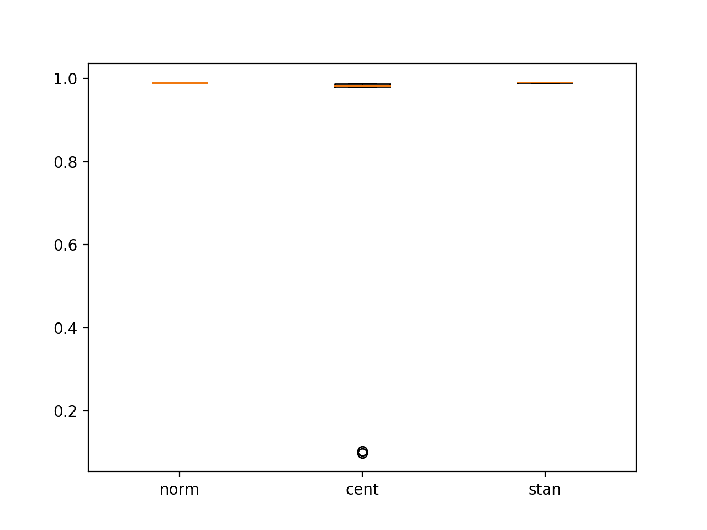

# 如何用 CNN 评估图像分类的像素缩放方法

> 原文：<https://machinelearningmastery.com/how-to-evaluate-pixel-scaling-methods-for-image-classification/>

最后更新于 2020 年 8 月 28 日

在图像分类任务中，必须先准备好图像数据，然后才能将其用作建模的基础。

准备图像数据的一个方面是缩放像素值，例如将值归一化到范围 0-1、居中、标准化等等。

> 如何为你的图像分类或者[计算机视觉](https://machinelearningmastery.com/what-is-computer-vision/)建模任务选择一个好的，甚至是最好的像素缩放方法？

在本教程中，您将发现如何使用深度学习方法选择像素缩放方法进行图像分类。

完成本教程后，您将知道:

*   使用特定数据集上的实验和经验结果选择像素缩放方法的过程。
*   如何实现标准的像素缩放方法，为建模准备图像数据。
*   如何通过案例研究为标准图像分类问题选择像素缩放方法。

**用我的新书[计算机视觉深度学习](https://machinelearningmastery.com/deep-learning-for-computer-vision/)启动你的项目**，包括*分步教程*和所有示例的 *Python 源代码*文件。

我们开始吧。


如何使用卷积神经网络评估图像分类的像素缩放方法[安德烈斯·阿尔瓦拉多](https://www.flickr.com/photos/104082864@N04/46758894811/)摄，版权所有。

## 教程概述

本教程分为 6 个部分；它们是:

1.  选择像素缩放方法的步骤
2.  选择数据集:MNIST 图像分类
3.  选择模型:卷积神经网络
4.  选择像素缩放方法
5.  运行实验
6.  分析结果

## 选择像素缩放方法的步骤

给定一个新的图像分类任务，应该使用什么样的像素缩放方法？

这个问题有很多种回答方式；例如:

*   使用据报道用于研究论文中类似问题的技术。
*   使用博客文章、课程或书籍中的启发法。
*   使用你最喜欢的技巧。
*   使用最简单的技巧。
*   …

相反，我建议使用实验来发现什么最适合您的特定数据集。

这可以通过以下过程实现:

*   **第一步:选择数据集**。这可能是整个训练数据集，也可能是一个小子集。想法是快速完成实验并得出结果。
*   **第二步:选择型号**。设计一个熟练的模型，但不一定是解决问题的最佳模型。可能需要模型的一些并行原型。
*   **第三步:选择像素缩放方法**。列出 3-5 个评估你的问题的数据准备方案。
*   **第四步:运行实验**。以这样的方式运行实验，即结果是可靠的和有代表性的，理想的情况是将每个实验重复多次。
*   **第五步:分析结果**。从学习速度和重复实验的平均表现两方面比较方法。

实验方法将使用一个非优化的模型，也许还有一个训练数据的子集，这两者都可能给你必须做出的决定增加噪音。

因此，您正在寻找一个信号，表明您的图像的一个数据准备方案明显优于其他方案；如果数据集不是这种情况，那么应该使用最简单(计算复杂度最低)的技术，例如像素归一化。

高级像素缩放方法的清晰信号可以通过以下两种方式之一看到:

*   **更快的学习**。学习曲线清楚地表明，在给定的数据准备方案下，模型学习得更快。
*   **准确率更高**。在给定的数据准备方案下，平均模型表现明显显示出更好的准确性。

现在，我们有了一个为图像数据选择像素缩放方法的过程，让我们看一个例子。我们将使用适合美国有线电视新闻网的 MNIST 图像分类任务，并评估一系列标准像素缩放方法。

## 第一步。选择数据集:MNIST 图像分类

MNIST 问题，简称 MNIST，是一个由 70，000 幅手写数字图像组成的图像分类问题。

该问题的目标是将手写数字的给定图像分类为从 0 到 9 的整数。因此，这是一个多类图像分类问题。

它是评估机器学习和深度学习算法的标准数据集。[数据集的最佳结果](https://rodrigob.github.io/are_we_there_yet/build/classification_datasets_results.html#4d4e495354)约为 99.79%准确，或误差率约为 0.21%(例如小于 1%)。

该数据集作为 Keras 库的一部分提供，可以通过调用[Keras . datasets . mnist . load _ data()函数](https://keras.io/datasets/#mnist-database-of-handwritten-digits)自动下载(如果需要)并加载到内存中。

该函数返回两个元组:一个用于训练输入和输出，一个用于测试输入和输出。例如:

```py
# example of loading the MNIST dataset
from keras.datasets import mnist
(x_train, y_train), (x_test, y_test) = mnist.load_data()
```

我们可以加载 MNIST 数据集并对其进行汇总。

下面列出了完整的示例。

```py
# load and summarize the MNIST dataset
from keras.datasets import mnist
# load dataset
(train_images, train_labels), (test_images, test_labels) = mnist.load_data()
# summarize dataset shape
print('Train', train_images.shape, train_labels.shape)
print('Test', (test_images.shape, test_labels.shape))
# summarize pixel values
print('Train', train_images.min(), train_images.max(), train_images.mean(), train_images.std())
print('Train', test_images.min(), test_images.max(), test_images.mean(), test_images.std())
```

运行该示例首先将数据集加载到内存中。然后报告训练和测试数据集的形状。

我们可以看到，所有图像都是 28×28 像素，只有一个灰度图像通道。训练数据集有 60，000 幅图像，测试数据集有 10，000 幅图像。

我们还可以看到，像素值是介于 0 和 255 之间的整数值，并且两个数据集之间像素值的平均值和标准差相似。

```py
Train (60000, 28, 28) (60000,)
Test ((10000, 28, 28), (10000,))
Train 0 255 33.318421449829934 78.56748998339798
Train 0 255 33.791224489795916 79.17246322228644
```

数据集相对较小；我们将使用整个训练和测试数据集

现在我们已经熟悉了 MNIST 以及如何加载数据集，让我们回顾一下一些像素缩放方法。

## 第二步。选择模型:卷积神经网络

我们将使用卷积神经网络模型来评估不同的像素缩放方法。

预计美国有线电视新闻网在这个问题上表现非常好，尽管为这个实验选择的模型不一定表现好或最好。相反，它必须是熟练的(比随机的更好)，并且必须允许不同数据准备方案的影响在学习速度和/或模型表现方面有所不同。

因此，模型必须有足够的能力来学习问题。

我们将演示 MNIST 问题的基线模型。

首先，必须加载数据集，扩展训练和测试数据集的形状以添加通道维度，设置为 1，因为我们只有一个黑白通道。

```py
# load dataset
(trainX, trainY), (testX, testY) = mnist.load_data()
# reshape dataset to have a single channel
width, height, channels = trainX.shape[1], trainX.shape[2], 1
trainX = trainX.reshape((trainX.shape[0], width, height, channels))
testX = testX.reshape((testX.shape[0], width, height, channels))
```

接下来，我们将对本例的像素值进行归一化，并对多类分类所需的目标值进行热编码。

```py
# normalize pixel values
trainX = trainX.astype('float32') / 255
testX = testX.astype('float32') / 255
# one hot encode target values
trainY = to_categorical(trainY)
testY = to_categorical(testY)
```

该模型被定义为一个卷积层，后跟一个最大池层；这种组合再次重复，然后过滤器映射被展平，由完全连接的层解释，然后是输出层。

ReLU 激活功能用于隐藏层，softmax 激活功能用于输出层。指定足够的过滤器映射和节点，以提供足够的能力来学习问题。

```py
# define model
model = Sequential()
model.add(Conv2D(32, (3, 3), activation='relu', input_shape=(width, height, channels)))
model.add(MaxPooling2D((2, 2)))
model.add(Conv2D(64, (3, 3), activation='relu'))
model.add(MaxPooling2D((2, 2)))
model.add(Flatten())
model.add(Dense(64, activation='relu'))
model.add(Dense(10, activation='softmax'))
```

随机梯度下降的 [Adam](https://machinelearningmastery.com/adam-optimization-algorithm-for-deep-learning/) 变异用于寻找模型权重。使用分类交叉熵损失函数，这是多类分类所需要的，并且在训练期间监控分类准确率。

```py
# compile model
model.compile(optimizer='adam', loss='categorical_crossentropy', metrics=['accuracy'])
```

该模型适用于五个训练时期，并且使用了 128 幅图像的大批量。

```py
# fit model
model.fit(trainX, trainY, epochs=5, batch_size=128)
```

一旦拟合，就在测试数据集上评估模型。

```py
# evaluate model
_, acc = model.evaluate(testX, testY, verbose=0)
print(acc)
```

下面列出了完整的例子，大约一分钟后就可以在中央处理器上轻松运行。

```py
# baseline cnn model for the mnist problem
from keras.datasets import mnist
from keras.utils import to_categorical
from keras.models import Sequential
from keras.layers import Conv2D
from keras.layers import MaxPooling2D
from keras.layers import Dense
from keras.layers import Flatten
# load dataset
(trainX, trainY), (testX, testY) = mnist.load_data()
# reshape dataset to have a single channel
width, height, channels = trainX.shape[1], trainX.shape[2], 1
trainX = trainX.reshape((trainX.shape[0], width, height, channels))
testX = testX.reshape((testX.shape[0], width, height, channels))
# normalize pixel values
trainX = trainX.astype('float32') / 255
testX = testX.astype('float32') / 255
# one hot encode target values
trainY = to_categorical(trainY)
testY = to_categorical(testY)
# define model
model = Sequential()
model.add(Conv2D(32, (3, 3), activation='relu', input_shape=(width, height, channels)))
model.add(MaxPooling2D((2, 2)))
model.add(Conv2D(64, (3, 3), activation='relu'))
model.add(MaxPooling2D((2, 2)))
model.add(Flatten())
model.add(Dense(64, activation='relu'))
model.add(Dense(10, activation='softmax'))
# compile model
model.compile(optimizer='adam', loss='categorical_crossentropy', metrics=['accuracy'])
# fit model
model.fit(trainX, trainY, epochs=5, batch_size=128)
# evaluate model
_, acc = model.evaluate(testX, testY, verbose=0)
print(acc)
```

运行实例表明，该模型能够很好地快速学习问题。

**注**:考虑到算法或评估程序的随机性，或数值准确率的差异，您的[结果可能会有所不同](https://machinelearningmastery.com/different-results-each-time-in-machine-learning/)。考虑运行该示例几次，并比较平均结果。

事实上，在这次运行中，模型在测试数据集上的表现是 99%，即 1%的错误率。这不是最先进的(通过设计)，但也离最先进的不远。

```py
60000/60000 [==============================] - 13s 220us/step - loss: 0.2321 - acc: 0.9323
Epoch 2/5
60000/60000 [==============================] - 12s 204us/step - loss: 0.0628 - acc: 0.9810
Epoch 3/5
60000/60000 [==============================] - 13s 208us/step - loss: 0.0446 - acc: 0.9861
Epoch 4/5
60000/60000 [==============================] - 13s 209us/step - loss: 0.0340 - acc: 0.9895
Epoch 5/5
60000/60000 [==============================] - 12s 208us/step - loss: 0.0287 - acc: 0.9908
0.99
```

## 第三步。选择像素缩放方法

神经网络模型通常不能在原始像素值上训练，例如 0 到 255 范围内的像素值。

原因是网络使用输入的加权和，为了网络既稳定又有效地训练，权重应该保持较小。

相反，像素值必须在训练之前进行缩放。缩放像素值可能有三种主要方法；它们是:

*   **归一化**:像素值缩放到 0-1 的范围。
*   **居中**:从每个像素值中减去平均像素值，得到以零的平均值为中心的像素值分布。
*   **标准化**:像素值缩放为标准高斯，均值为零，标准差为 1。

传统上，使用 sigmoid 激活函数，求和为 0(零均值)的输入是首选。随着 ReLU 和类似激活功能的广泛采用，情况可能会也可能不会如此。

此外，在居中和标准化中，可以跨通道、图像、小批量或整个训练数据集计算平均值或均值和标准偏差。这可能会对可能评估的所选缩放方法增加额外的变化。

规范化通常是默认方法，因为我们可以假设像素值总是在 0-255 的范围内，这使得该过程实现起来非常简单有效。

尽管平均值可以按图像(全局)或通道(局部)计算，并且可以跨一批图像或整个训练数据集计算，但是居中通常被推荐为首选方法，因为它在许多流行的论文中被使用，并且论文中描述的过程通常并不确切指定使用了哪种变化。

我们将试验上面列出的三种方法，即标准化、居中和标准化。对中的平均值和标准化的平均值和标准偏差将在整个训练数据集中计算。

您可以探索的其他变化包括:

*   计算每个通道的统计数据(对于彩色图像)。
*   计算每个图像的统计数据。
*   计算每个批次的统计数据。
*   居中或标准化后的标准化。

以下示例实现了三种选定的像素缩放方法，并演示了它们对 MNIST 数据集的影响。

```py
# demonstrate pixel scaling methods on mnist dataset
from keras.datasets import mnist

# normalize images
def prep_normalize(train, test):
	# convert from integers to floats
	train_norm = train.astype('float32')
	test_norm = test.astype('float32')
	# normalize to range 0-1
	train_norm = train_norm / 255.0
	test_norm = test_norm / 255.0
	# return normalized images
	return train_norm, test_norm

# center images
def prep_center(train, test):
	# convert from integers to floats
	train_cent = train.astype('float32')
	test_cent = test.astype('float32')
	# calculate statistics
	m = train_cent.mean()
	# center datasets
	train_cent = train_cent - m
	test_cent = test_cent - m
	# return normalized images
	return train_cent, test_cent

# standardize images
def prep_standardize(train, test):
	# convert from integers to floats
	train_stan = train.astype('float32')
	test_stan = test.astype('float32')
	# calculate statistics
	m = train_stan.mean()
	s = train_stan.std()
	# center datasets
	train_stan = (train_stan - m) / s
	test_stan = (test_stan - m) / s
	# return normalized images
	return train_stan, test_stan

# load dataset
(train_images, train_labels), (test_images, test_labels) = mnist.load_data()
# normalize
trainX, testX = prep_normalize(train_images, test_images)
print('normalization')
print('Train', trainX.min(), trainX.max(), trainX.mean(), trainX.std())
print('Test', testX.min(), testX.max(), testX.mean(), testX.std())
# center
trainX, testX = prep_center(train_images, test_images)
print('center')
print('Train', trainX.min(), trainX.max(), trainX.mean(), trainX.std())
print('Test', testX.min(), testX.max(), testX.mean(), testX.std())
# standardize
trainX, testX = prep_standardize(train_images, test_images)
print('standardize')
print('Train', trainX.min(), trainX.max(), trainX.mean(), trainX.std())
print('Test', testX.min(), testX.max(), testX.mean(), testX.std())
```

运行该示例首先标准化数据集，并报告训练和测试数据集的最小、最大、平均和标准偏差。

**注**:考虑到算法或评估程序的随机性，或数值准确率的差异，您的[结果可能会有所不同](https://machinelearningmastery.com/different-results-each-time-in-machine-learning/)。考虑运行该示例几次，并比较平均结果。

然后，针对定心和标准化数据准备方案重复这一过程。结果提供了缩放程序确实被正确实现的证据。

```py
normalization
Train 0.0 1.0 0.13066062 0.30810776
Test 0.0 1.0 0.13251467 0.31048027

center
Train -33.318447 221.68155 -1.9512918e-05 78.567444
Test -33.318447 221.68155 0.47278798 79.17245

standardize
Train -0.42407447 2.8215446 -3.4560264e-07 0.9999998
Test -0.42407447 2.8215446 0.0060174568 1.0077008
```

## 第四步。运行实验

既然我们已经定义了要评估的数据集、模型和数据准备方案，我们就可以定义和运行实验了。

每个模型在 CPU 上运行大约需要一分钟，所以我们不想实验花费太长时间。我们将评估三个数据准备方案中的每一个，每个方案将被评估 10 次，这意味着在现代硬件上完成实验大约需要 30 分钟。

我们可以定义一个函数，在需要时重新加载数据集。

```py
# load train and test dataset
def load_dataset():
	# load dataset
	(trainX, trainY), (testX, testY) = mnist.load_data()
	# reshape dataset to have a single channel
	width, height, channels = trainX.shape[1], trainX.shape[2], 1
	trainX = trainX.reshape((trainX.shape[0], width, height, channels))
	testX = testX.reshape((testX.shape[0], width, height, channels))
	# one hot encode target values
	trainY = to_categorical(trainY)
	testY = to_categorical(testY)
	return trainX, trainY, testX, testY
```

我们还可以定义一个函数来定义和编译我们的模型，以适应问题。

```py
# define cnn model
def define_model():
	model = Sequential()
	model.add(Conv2D(32, (3, 3), activation='relu', input_shape=(width, height, channels)))
	model.add(MaxPooling2D((2, 2)))
	model.add(Conv2D(64, (3, 3), activation='relu'))
	model.add(MaxPooling2D((2, 2)))
	model.add(Flatten())
	model.add(Dense(64, activation='relu'))
	model.add(Dense(10, activation='softmax'))
	# compile model
	model.compile(optimizer='adam', loss='categorical_crossentropy', metrics=['accuracy'])
	return model
```

我们已经有了为训练和测试数据集准备像素数据的功能。

最后，我们可以定义一个名为*repeat _ evaluation()*的函数，该函数以数据准备函数的名称调用来准备数据，并将加载数据集并重复定义模型、准备数据集、拟合和评估模型。它将返回一个准确性分数列表，可用于总结模型在所选数据准备方案下的表现。

```py
# repeated evaluation of model with data prep scheme
def repeated_evaluation(datapre_func, n_repeats=10):
	# prepare data
	trainX, trainY, testX, testY = load_dataset()
	# repeated evaluation
	scores = list()
	for i in range(n_repeats):
		# define model
		model = define_model()
		# prepare data
		prep_trainX, prep_testX = datapre_func(trainX, testX)
		# fit model
		model.fit(prep_trainX, trainY, epochs=5, batch_size=64, verbose=0)
		# evaluate model
		_, acc = model.evaluate(prep_testX, testY, verbose=0)
		# store result
		scores.append(acc)
		print('> %d: %.3f' % (i, acc * 100.0))
	return scores
```

然后可以为三个数据准备方案中的每一个调用*repeat _ evaluation()*函数，并且可以报告方案下模型表现的均值和标准差。

我们还可以创建一个方框和触须图来总结和比较每个方案的准确性分数分布。

```py
all_scores = list()
# normalization
scores = repeated_evaluation(prep_normalize)
print('Normalization: %.3f (%.3f)' % (mean(scores), std(scores)))
all_scores.append(scores)
# center
scores = repeated_evaluation(prep_center)
print('Centered: %.3f (%.3f)' % (mean(scores), std(scores)))
all_scores.append(scores)
# standardize
scores = repeated_evaluation(prep_standardize)
print('Standardized: %.3f (%.3f)' % (mean(scores), std(scores)))
all_scores.append(scores)
# box and whisker plots of results
pyplot.boxplot(all_scores, labels=['norm', 'cent', 'stan'])
pyplot.show()
```

将所有这些结合在一起，下面列出了运行实验来比较 MNIST 数据集上的像素缩放方法的完整示例。

```py
# comparison of training-set based pixel scaling methods on MNIST
from numpy import mean
from numpy import std
from matplotlib import pyplot
from keras.datasets import mnist
from keras.utils import to_categorical
from keras.models import Sequential
from keras.layers import Conv2D
from keras.layers import MaxPooling2D
from keras.layers import Dense
from keras.layers import Flatten

# load train and test dataset
def load_dataset():
	# load dataset
	(trainX, trainY), (testX, testY) = mnist.load_data()
	# reshape dataset to have a single channel
	width, height, channels = trainX.shape[1], trainX.shape[2], 1
	trainX = trainX.reshape((trainX.shape[0], width, height, channels))
	testX = testX.reshape((testX.shape[0], width, height, channels))
	# one hot encode target values
	trainY = to_categorical(trainY)
	testY = to_categorical(testY)
	return trainX, trainY, testX, testY

# define cnn model
def define_model():
	model = Sequential()
	model.add(Conv2D(32, (3, 3), activation='relu', input_shape=(28, 28, 1)))
	model.add(MaxPooling2D((2, 2)))
	model.add(Conv2D(64, (3, 3), activation='relu'))
	model.add(MaxPooling2D((2, 2)))
	model.add(Flatten())
	model.add(Dense(64, activation='relu'))
	model.add(Dense(10, activation='softmax'))
	# compile model
	model.compile(optimizer='adam', loss='categorical_crossentropy', metrics=['accuracy'])
	return model

# normalize images
def prep_normalize(train, test):
	# convert from integers to floats
	train_norm = train.astype('float32')
	test_norm = test.astype('float32')
	# normalize to range 0-1
	train_norm = train_norm / 255.0
	test_norm = test_norm / 255.0
	# return normalized images
	return train_norm, test_norm

# center images
def prep_center(train, test):
	# convert from integers to floats
	train_cent = train.astype('float32')
	test_cent = test.astype('float32')
	# calculate statistics
	m = train_cent.mean()
	# center datasets
	train_cent = train_cent - m
	test_cent = test_cent - m
	# return normalized images
	return train_cent, test_cent

# standardize images
def prep_standardize(train, test):
	# convert from integers to floats
	train_stan = train.astype('float32')
	test_stan = test.astype('float32')
	# calculate statistics
	m = train_stan.mean()
	s = train_stan.std()
	# center datasets
	train_stan = (train_stan - m) / s
	test_stan = (test_stan - m) / s
	# return normalized images
	return train_stan, test_stan

# repeated evaluation of model with data prep scheme
def repeated_evaluation(datapre_func, n_repeats=10):
	# prepare data
	trainX, trainY, testX, testY = load_dataset()
	# repeated evaluation
	scores = list()
	for i in range(n_repeats):
		# define model
		model = define_model()
		# prepare data
		prep_trainX, prep_testX = datapre_func(trainX, testX)
		# fit model
		model.fit(prep_trainX, trainY, epochs=5, batch_size=64, verbose=0)
		# evaluate model
		_, acc = model.evaluate(prep_testX, testY, verbose=0)
		# store result
		scores.append(acc)
		print('> %d: %.3f' % (i, acc * 100.0))
	return scores

all_scores = list()
# normalization
scores = repeated_evaluation(prep_normalize)
print('Normalization: %.3f (%.3f)' % (mean(scores), std(scores)))
all_scores.append(scores)
# center
scores = repeated_evaluation(prep_center)
print('Centered: %.3f (%.3f)' % (mean(scores), std(scores)))
all_scores.append(scores)
# standardize
scores = repeated_evaluation(prep_standardize)
print('Standardized: %.3f (%.3f)' % (mean(scores), std(scores)))
all_scores.append(scores)
# box and whisker plots of results
pyplot.boxplot(all_scores, labels=['norm', 'cent', 'stan'])
pyplot.show()
```

在中央处理器上运行该示例可能需要大约 30 分钟。

**注**:考虑到算法或评估程序的随机性，或数值准确率的差异，您的[结果可能会有所不同](https://machinelearningmastery.com/different-results-each-time-in-machine-learning/)。考虑运行该示例几次，并比较平均结果。

报告模型每次重复评估的准确性，并在每次运行结束时重复准确性得分的平均值和标准偏差。

```py
> 0: 98.930
> 1: 98.960
> 2: 98.910
> 3: 99.050
> 4: 99.040
> 5: 98.800
> 6: 98.880
> 7: 99.020
> 8: 99.100
> 9: 99.050
Normalization: 0.990 (0.001)
> 0: 98.570
> 1: 98.530
> 2: 98.230
> 3: 98.110
> 4: 98.840
> 5: 98.720
> 6: 9.800
> 7: 98.170
> 8: 98.710
> 9: 10.320
Centered: 0.808 (0.354)
> 0: 99.150
> 1: 98.820
> 2: 99.000
> 3: 98.850
> 4: 99.140
> 5: 99.050
> 6: 99.120
> 7: 99.100
> 8: 98.940
> 9: 99.110
Standardized: 0.990 (0.001
```



不同像素缩放方法下美国有线电视新闻网在 MNIST 表现的盒须图

## 第五步。分析结果

为简洁起见，我们将只在数据准备方案的比较中查看模型表现。这项研究的扩展还将关注每个像素缩放方法下的学习率。

实验结果表明，在 MNIST 数据集上，像素归一化和标准化与所选模型之间的差异很小或没有差异(在所选准确率下)。

从这些结果来看，我会在这个数据集和这个模型上使用规范化而不是标准化，因为结果很好，而且与标准化相比规范化很简单。

这些是有用的结果，因为它们表明在建模之前对像素值进行居中的默认启发式方法对于这个数据集来说并不是好的建议。

可悲的是，方框图和触须图并不能很容易地比较准确率分数的分布，因为中心缩放方法的一些可怕的异常值会挤压分布。

## 扩展ˌ扩张

本节列出了一些您可能希望探索的扩展教程的想法。

*   **分批缩放**。更新研究以计算每个批次的缩放统计数据，而不是整个训练数据集，并查看这对缩放方法的选择是否有影响。
*   **学习曲线**。更新研究，为每种数据缩放方法收集一些学习曲线，并比较学习速度。
*   **CIFAR** 。在 [CIFAR-10 数据集](https://machinelearningmastery.com/how-to-develop-a-cnn-from-scratch-for-cifar-10-photo-classification/)上重复研究，并添加支持全局(跨所有通道缩放)和局部(每个通道缩放)方法的像素缩放方法。

如果你探索这些扩展，我很想知道。
在下面的评论中发表你的发现。

## 进一步阅读

如果您想更深入地了解这个主题，本节将提供更多资源。

*   [MNIST 数据库，维基百科。](https://en.wikipedia.org/wiki/MNIST_database)
*   [MNIST，类别数据集结果。](https://rodrigob.github.io/are_we_there_yet/build/classification_datasets_results.html#4d4e495354)
*   [MNIST 手写数字数据库，Keras API。](https://keras.io/datasets/#mnist-database-of-handwritten-digits)

## 摘要

在本教程中，您发现了如何使用深度学习方法为图像分类选择像素缩放方法。

具体来说，您了解到:

*   使用特定数据集上的实验和经验结果选择像素缩放方法的过程。
*   如何实现标准的像素缩放方法，为建模准备图像数据。
*   如何通过案例研究为标准图像分类问题选择像素缩放方法。

你有什么问题吗？
在下面的评论中提问，我会尽力回答。