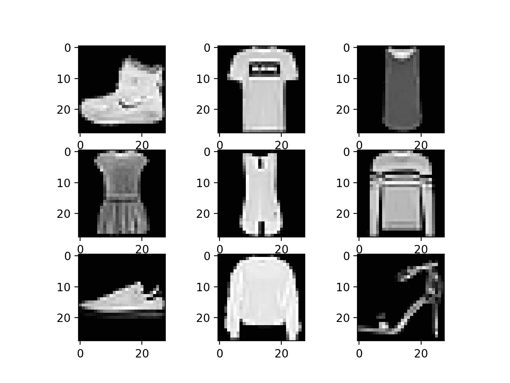
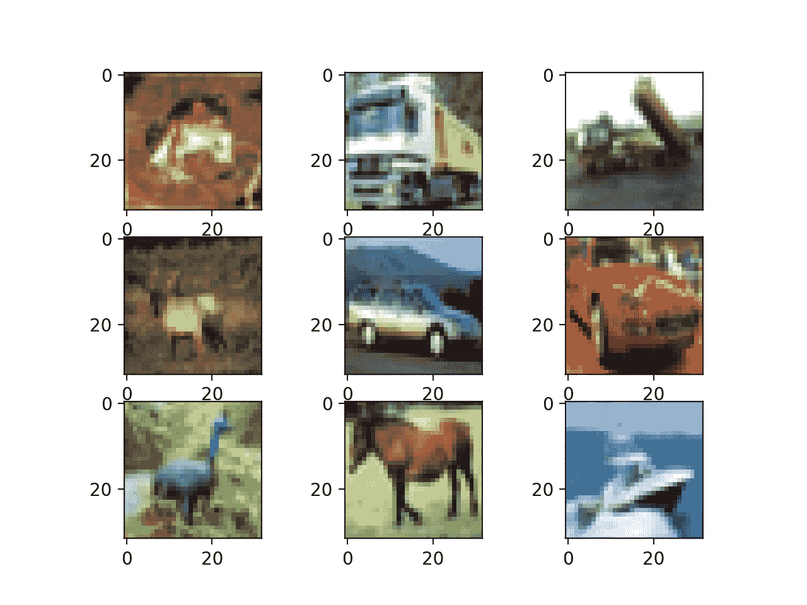
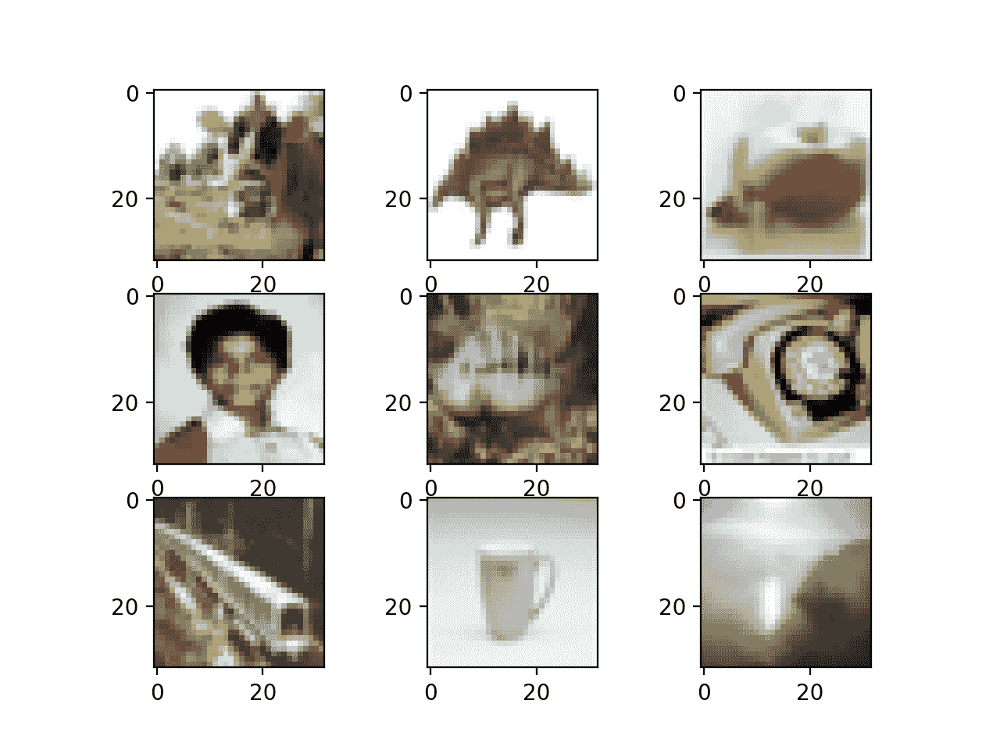

# 如何用 Keras 加载和可视化标准计算机视觉数据集

> 原文：<https://machinelearningmastery.com/how-to-load-and-visualize-standard-computer-vision-datasets-with-keras/>

最后更新于 2019 年 7 月 5 日

开始使用计算机视觉的深度学习方法时，使用标准的计算机视觉数据集可能会很方便。

标准数据集通常很好理解，很小，易于加载。它们可以为测试技术和复制结果提供基础，以便建立对库和方法的信心。

在本教程中，您将发现 Keras 深度学习库提供的标准计算机视觉数据集。

完成本教程后，您将知道:

*   使用 Keras 下载标准计算机视觉数据集的应用编程接口和习惯用法。
*   MNIST、时尚-MNIST、CIFAR-10 和 CIFAR-100 计算机视觉数据集的结构、性质和最佳结果。
*   如何使用 Keras API 加载和可视化标准计算机视觉数据集。

**用我的新书[计算机视觉深度学习](https://machinelearningmastery.com/deep-learning-for-computer-vision/)启动你的项目**，包括*分步教程*和所有示例的 *Python 源代码*文件。

我们开始吧。


如何用 Keras 加载和可视化标准计算机视觉数据集
图片由[玛丽娜·德尔·卡斯特尔](https://www.flickr.com/photos/marinadelcastell/14032345481/)提供，保留部分权利。

## 教程概述

本教程分为五个部分；它们是:

1.  Keras 计算机视觉数据集
2.  MNIST 数据集
3.  时尚-MNIST 数据集
4.  CIFAR-10 数据集
5.  CIFAR-100 数据集

## Keras 计算机视觉数据集

Keras 深度学习库提供对四个标准计算机视觉数据集的访问。

这特别有用，因为它允许您快速开始测试计算机视觉的模型架构和配置。

提供了四个特定的多类图像类别数据集；它们是:

*   **MNIST** :手写数字照片分类(10 类)。
*   **时尚-MNIST** :服装单品照片分类(10 类)。
*   **CIFAR-10** :对象小照片分类(10 类)。
*   **CIFAR-100** :普通对象小照片分类(100 类)。

数据集可通过特定于数据集的加载函数在 *keras.datasets* 模块下获得。

调用加载函数后，数据集被下载到您的工作站并存储在 *~/。keras* 目录下有一个“*数据集*”子目录。数据集以压缩格式存储，但也可能包括额外的元数据。

在第一次调用特定于数据集的加载函数并下载数据集后，不需要再次下载数据集。后续调用将立即从磁盘加载数据集。

load 函数返回两个元组，第一个包含训练数据集中样本的输入和输出元素，第二个包含测试数据集中样本的输入和输出元素。训练数据集和测试数据集之间的分割通常遵循标准分割，在对数据集进行算法基准测试时使用。

加载数据集的标准习惯用法如下:

```py
...
# load dataset
(trainX, trainy), (testX, testy) = load_data()
```

每个训练和测试 *X* 和 *y* 元素分别是像素或类值的 NumPy 数组。

其中两个数据集包含灰度图像，两个数据集包含彩色图像。灰度图像的形状必须从二维阵列转换为三维阵列，以匹配 Keras 的首选通道顺序。例如:

```py
# reshape grayscale images to have a single channel
width, height, channels = trainX.shape[1], trainX.shape[2], 1
trainX = trainX.reshape((trainX.shape[0], width, height, channels))
testX = testX.reshape((testX.shape[0], width, height, channels))
```

灰度和彩色图像像素数据都存储为 0 到 255 之间的无符号整数值。

在建模之前，图像数据将需要重新缩放，例如归一化到范围 0-1，并且可能进一步标准化。例如:

```py
# normalize pixel values
trainX = trainX.astype('float32') / 255
testX = testX.astype('float32') / 255
```

每个样本的输出元素( *y* )被存储为类整数值。每个问题都是多类分类问题(两类以上)；因此，通常的做法是在建模之前对类值进行热编码。这可以使用 Keras 提供的*to _ classic()*功能来实现；例如:

```py
...
# one hot encode target values
trainy = to_categorical(trainy)
testy = to_categorical(testy)
```

现在我们已经熟悉了使用 Keras 提供的标准计算机视觉数据集的习惯用法，让我们依次仔细看看每个数据集。

请注意，本教程中的示例假设您可以访问互联网，并且可能会在每个示例首次在您的系统上运行时下载数据集。下载速度将取决于您的互联网连接速度，建议您从命令行运行示例。

## MNIST 数据集

[MNIST 数据集](https://en.wikipedia.org/wiki/MNIST_database)是一个首字母缩略词，代表修改后的国家标准和技术研究所数据集。

它是一个由 60，000 个 0 到 9 之间的手写单个数字的 28×28 像素小正方形灰度图像组成的数据集。

任务是将手写数字的给定图像分类为代表从 0 到 9 的整数值的 10 个类别之一。

它是一个被广泛使用和深入理解的数据集，大部分是“*求解*”表现最好的模型是深度学习卷积神经网络，其分类准确率达到 99%以上，在保持测试数据集上的错误率在 0.4%到 0.2%之间。

有关为 MNIST 开发模型的分步教程，请参见:

*   [如何为 MNIST 数字分类开发深度 CNN](https://machinelearningmastery.com/how-to-develop-a-convolutional-neural-network-from-scratch-for-mnist-handwritten-digit-classification/)

以下示例使用 Keras API 加载 MNIST 数据集，并创建训练数据集中前 9 幅图像的图。

```py
# example of loading the mnist dataset
from keras.datasets import mnist
from matplotlib import pyplot
# load dataset
(trainX, trainy), (testX, testy) = mnist.load_data()
# summarize loaded dataset
print('Train: X=%s, y=%s' % (trainX.shape, trainy.shape))
print('Test: X=%s, y=%s' % (testX.shape, testy.shape))
# plot first few images
for i in range(9):
	# define subplot
	pyplot.subplot(330 + 1 + i)
	# plot raw pixel data
	pyplot.imshow(trainX[i], cmap=pyplot.get_cmap('gray'))
# show the figure
pyplot.show()
```

运行该示例将加载 MNIST 训练和测试数据集，并打印它们的形状。

我们可以看到训练数据集中有 6 万个例子，测试数据集中有 1 万个例子，图像确实是 28×28 像素的正方形。

```py
Train: X=(60000, 28, 28), y=(60000,)
Test: X=(10000, 28, 28), y=(10000,)
```

还创建了数据集中前九幅图像的图，显示了要分类的图像的自然手写特性。


从 MNIST 数据集绘制图像子集

## 时尚-MNIST 数据集

[时尚-MNIST](https://github.com/zalandoresearch/fashion-mnist) 被提议作为 MNIST 数据集的更具挑战性的替代数据集。

它是一个数据集，由 60，000 个 28×28 像素的小正方形灰度图像组成，包括 10 种服装，如鞋子、t 恤、连衣裙等。

这是一个比 MNIST 更具挑战性的分类问题，通过深度学习卷积网络可以获得最佳结果，在保持测试数据集上的分类准确率约为 95%至 96%。

有关为时尚 MNIST 开发模型的分步教程，请参见:

*   [如何为时尚 MNIST 服装分类开发深度 CNN](https://machinelearningmastery.com/how-to-develop-a-cnn-from-scratch-for-fashion-mnist-clothing-classification/)

以下示例使用 Keras API 加载时尚 MNIST 数据集，并创建训练数据集中前九幅图像的图。

```py
# example of loading the fashion mnist dataset
from matplotlib import pyplot
from keras.datasets import fashion_mnist
# load dataset
(trainX, trainy), (testX, testy) = fashion_mnist.load_data()
# summarize loaded dataset
print('Train: X=%s, y=%s' % (trainX.shape, trainy.shape))
print('Test: X=%s, y=%s' % (testX.shape, testy.shape))
# plot first few images
for i in range(9):
	# define subplot
	pyplot.subplot(330 + 1 + i)
	# plot raw pixel data
	pyplot.imshow(trainX[i], cmap=pyplot.get_cmap('gray'))
# show the figure
pyplot.show()
```

运行该示例将加载时尚 MNIST 训练和测试数据集，并打印它们的形状。

我们可以看到训练数据集中有 6 万个例子，测试数据集中有 1 万个例子，图像确实是 28×28 像素的正方形。

```py
Train: X=(60000, 28, 28), y=(60000,)
Test: X=(10000, 28, 28), y=(10000,)
```

还创建了数据集中前九幅图像的图，显示这些图像确实是衣物的灰度照片。



时尚 MNIST 数据集图像子集的绘图

## CIFAR-10 数据集

CIFAR 是加拿大高级研究所的首字母缩略词，CIFAR-10 数据集是由 CIFAR 研究所的[研究人员与 CIFAR-100 数据集(将在下一节中介绍)一起开发的。](https://www.cs.toronto.edu/~kriz/cifar.html)

数据集由 60，000 张 32×32 像素彩色照片组成，这些照片来自 10 个类别的对象，如青蛙、鸟类、猫、船等。

这些都是非常小的图像，比典型的照片小得多，数据集是用于计算机视觉研究的。

CIFAR-10 是一个数据集，被广泛用于机器学习领域的计算机视觉算法基准测试。问题是“*解决了*”通过深度学习卷积神经网络，在测试数据集上的分类准确率达到 96%或 97%以上，在该问题上取得了最佳表现。

以下示例使用 Keras API 加载 [CIFAR-10 数据集](https://machinelearningmastery.com/how-to-develop-a-cnn-from-scratch-for-cifar-10-photo-classification/)，并创建训练数据集中前九幅图像的图。

```py
# example of loading the cifar10 dataset
from matplotlib import pyplot
from keras.datasets import cifar10
# load dataset
(trainX, trainy), (testX, testy) = cifar10.load_data()
# summarize loaded dataset
print('Train: X=%s, y=%s' % (trainX.shape, trainy.shape))
print('Test: X=%s, y=%s' % (testX.shape, testy.shape))
# plot first few images
for i in range(9):
	# define subplot
	pyplot.subplot(330 + 1 + i)
	# plot raw pixel data
	pyplot.imshow(trainX[i])
# show the figure
pyplot.show()
```

运行该示例将加载 CIFAR-10 训练和测试数据集，并打印它们的形状。

我们可以看到训练数据集中有 50000 个例子，测试数据集中有 10000 个例子，图像确实是 32×32 像素、彩色的正方形，有三个通道。

```py
Train: X=(50000, 32, 32, 3), y=(50000, 1)
Test: X=(10000, 32, 32, 3), y=(10000, 1)
```

还会创建数据集中前九幅图像的图。很明显，与现代照片相比，这些图像确实非常小；在分辨率极低的情况下，很难看清某些图像中到底表现了什么。

这种低分辨率很可能是顶级算法在数据集上所能达到的有限表现的原因。



从 CIFAR-10 数据集绘制图像子集

## CIFAR-100 数据集

CIFAR-100 数据集是由加拿大高级研究所(CIFAR)的学者与 CIFAR-10 数据集一起准备的。

数据集由 60，000 张 32×32 像素的彩色照片组成，这些照片来自 100 个类别的对象，如鱼、花、昆虫等等。

像 CIFAR-10 一样，这些图像是有意制作的小而不切实际的照片，数据集旨在用于计算机视觉研究。

下面的示例使用 Keras API 加载 CIFAR-100 数据集，并创建训练数据集中前九个图像的图。

```py
# example of loading the cifar100 dataset
from matplotlib import pyplot
from keras.datasets import cifar100
# load dataset
(trainX, trainy), (testX, testy) = cifar100.load_data()
# summarize loaded dataset
print('Train: X=%s, y=%s' % (trainX.shape, trainy.shape))
print('Test: X=%s, y=%s' % (testX.shape, testy.shape))
# plot first few images
for i in range(9):
	# define subplot
	pyplot.subplot(330 + 1 + i)
	# plot raw pixel data
	pyplot.imshow(trainX[i])
# show the figure
pyplot.show()
```

运行该示例将加载 CIFAR-100 训练和测试数据集，并打印它们的形状。

我们可以看到训练数据集中有 50000 个例子，测试数据集中有 10000 个例子，图像确实是 32×32 像素、彩色的正方形，有三个通道。

```py
Train: X=(50000, 32, 32, 3), y=(50000, 1)
Test: X=(10000, 32, 32, 3), y=(10000, 1)
```

还创建了数据集中前九幅图像的图，像 CIFAR-10 一样，图像的低分辨率会使清晰地看到一些照片中存在的内容变得具有挑战性。



从 CIFAR-100 数据集绘制图像子集

虽然有组织成 100 个类的图像，但是这 100 个类被组织成 20 个超类，例如普通类的组。

默认情况下，Keras 将返回 100 个类的标签，尽管在调用 *load_data()* 函数时，可以通过将“ *label_mode* ”参数设置为“*粗*”(而不是默认的“*精*”)来检索标签。例如:

```py
# load coarse labels
(trainX, trainy), (testX, testy) = cifar100.load_data(label_mode='coarse')
```

当使用*到 _ classic()*函数对标签进行一次热编码时，区别就很明显了，其中每个输出向量不是有 100 个维度，而是只有 20 个维度。下面的示例通过加载带有课程标签的数据集并对课程标签进行编码来演示这一点。

```py
# example of loading the cifar100 dataset with coarse labels
from keras.datasets import cifar100
from keras.utils import to_categorical
# load coarse labels
(trainX, trainy), (testX, testy) = cifar100.load_data(label_mode='coarse')
# one hot encode target values
trainy = to_categorical(trainy)
testy = to_categorical(testy)
# summarize loaded dataset
print('Train: X=%s, y=%s' % (trainX.shape, trainy.shape))
print('Test: X=%s, y=%s' % (testX.shape, testy.shape))
```

运行该示例会像以前一样加载 CIFS ar-100 数据集，但现在图像被分类为属于二十个超类之一。

类标签是一个热编码的，我们可以看到每个标签由一个 20 个元素的向量表示，而不是我们期望的 100 个元素的向量。

```py
Train: X=(50000, 32, 32, 3), y=(50000, 20)
Test: X=(10000, 32, 32, 3), y=(10000, 20)
```

## 进一步阅读

如果您想更深入地了解这个主题，本节将提供更多资源。

### 蜜蜂

*   [硬数据集 API](https://keras.io/datasets/)
*   [Keras 数据集代码](https://github.com/keras-team/keras/tree/master/keras/datasets)

### 文章

*   [MNIST 数据库，维基百科。](https://en.wikipedia.org/wiki/MNIST_database)
*   [类别数据集结果，这个图像的类别是什么？](https://rodrigob.github.io/are_we_there_yet/build/classification_datasets_results.html)
*   [时尚-MNIST GitHub 资源库](https://github.com/zalandoresearch/fashion-mnist)
*   [CIFAR-10，维基百科。](https://en.wikipedia.org/wiki/CIFAR-10)
*   [CIFAR-10 数据集和 CIFAR-100 数据集](https://www.cs.toronto.edu/~kriz/cifar.html)。

## 摘要

在本教程中，您发现了 Keras 深度学习库提供的标准计算机视觉数据集。

具体来说，您了解到:

*   使用 Keras 下载标准计算机视觉数据集的应用编程接口和习惯用法。
*   MNIST、时尚-MNIST、CIFAR-10 和 CIFAR-100 计算机视觉数据集的结构、性质和最佳结果。
*   如何使用 Keras API 加载和可视化标准计算机视觉数据集。

你有什么问题吗？
在下面的评论中提问，我会尽力回答。