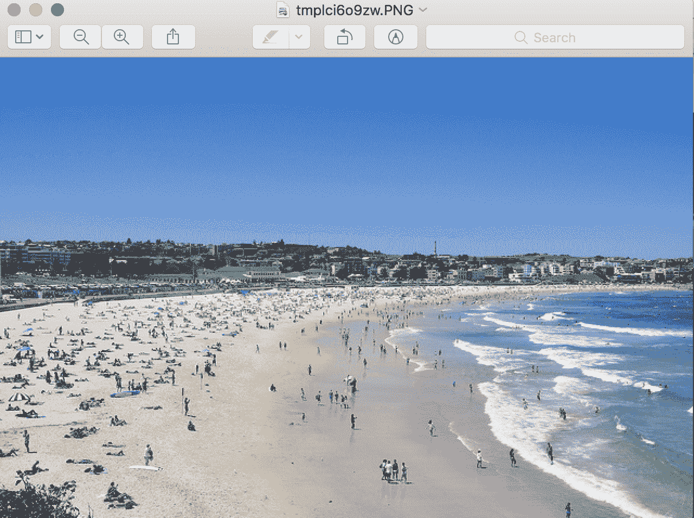
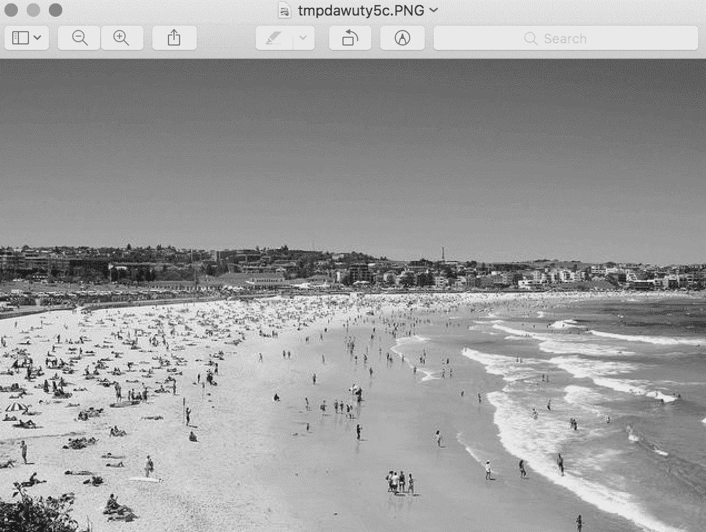

# 如何使用 Keras API 加载、转换和保存图像

> 原文：<https://machinelearningmastery.com/how-to-load-convert-and-save-images-with-the-keras-api/>

最后更新于 2019 年 7 月 5 日

Keras 深度学习库为加载、准备和扩充图像数据提供了一个复杂的应用编程接口。

该应用编程接口还包括一些未记录的功能，允许您快速轻松地加载、转换和保存图像文件。这些功能在开始计算机视觉深度学习项目时非常方便，允许您最初使用相同的 Keras API 来检查和处理图像数据。

在本教程中，您将发现如何使用 Keras API 提供的基本图像处理功能。

完成本教程后，您将知道:

*   如何使用 Keras API 加载和显示图像。
*   如何使用 Keras API 将加载的图像转换为 NumPy 数组并转换回 PIL 格式。
*   如何使用 Keras API 将加载的图像转换为灰度并保存到新文件中。

**用我的新书[计算机视觉深度学习](https://machinelearningmastery.com/deep-learning-for-computer-vision/)启动你的项目**，包括*分步教程*和所有示例的 *Python 源代码*文件。

我们开始吧。

## 教程概述

本教程分为五个部分；它们是:

1.  测试图像
2.  图像处理应用编程接口
3.  如何用 Keras 加载图像
4.  用 Keras 转换图像
5.  用 Keras 保存图像

## 测试图像

第一步是选择要在本教程中使用的测试图像。

我们将使用一张由伊莎贝尔·舒尔茨拍摄的悉尼邦迪海滩的照片，该照片是在许可的知识共享许可下发布的。


悉尼邦迪海滩

下载图片，放入当前工作目录，文件名为“ *bondi_beach.jpg* ”。

*   [点击下载 bondi_beach.jpg](https://machinelearningmastery.com/wp-content/uploads/2019/01/bondi_beach.jpg)

## 图像处理应用编程接口

Keras 深度学习库提供了处理图像数据的实用程序。

主要的应用编程接口是结合了数据加载、准备和增强的 [ImageDataGenerator 类](https://keras.io/preprocessing/image/)。

在本教程中，我们将不涉及 ImageDataGenerator 类。相反，我们将仔细研究一些记录较少或未记录的函数，这些函数在使用 Keras API 处理图像数据和建模时可能会很有用。

具体来说，Keras 提供了加载、转换和保存图像数据的功能。功能在 [utils.py](https://github.com/keras-team/keras-preprocessing/blob/master/keras_preprocessing/image/utils.py) 功能中，通过 [image.py](https://github.com/keras-team/keras/blob/master/keras/preprocessing/image.py) 模块显示。

当开始一个新的深度学习计算机视觉项目或当您需要检查特定图像时，这些功能可能是有用的便利功能。

在应用编程接口文档的[应用部分](https://keras.io/applications/)中，当使用预先训练的模型时，会演示其中的一些功能。

Keras 中的所有图像处理都需要安装[枕库](https://python-pillow.org/)。如果没有安装，可以查看[安装说明](https://pillow.readthedocs.io/en/stable/installation.html)。

让我们依次仔细看看这些功能。

## 如何用 Keras 加载图像

Keras 提供了 *load_img()* 功能，用于将文件中的图像作为 PIL 图像对象加载。

以下示例将邦迪海滩照片从文件中加载为 PIL 图像，并报告了加载图像的详细信息。

```py
# example of loading an image with the Keras API
from keras.preprocessing.image import load_img
# load the image
img = load_img('bondi_beach.jpg')
# report details about the image
print(type(img))
print(img.format)
print(img.mode)
print(img.size)
# show the image
img.show()
```

运行该示例将加载图像并报告关于加载图像的详细信息。

我们可以确认该图像是以 JPEG 格式加载的 PIL 图像，具有 RGB 通道，大小为 640×427 像素。

```py
<class 'PIL.JpegImagePlugin.JpegImageFile'>
JPEG
RGB
(640, 427)
```

然后使用工作站上的默认应用程序显示加载的图像，在本例中，是 macOS 上的预览应用程序。



使用默认应用程序显示 PIL 图像的示例

*load_img()* 函数提供了加载图像时可能有用的附加参数，例如允许以灰度加载图像的“*灰度*”(默认为 False)、 *color_mode* (允许指定图像模式或通道格式)(默认为 rgb)以及允许指定元组(高度、宽度)的“ *target_size* ”，加载后自动调整图像大小。

## 如何用 Keras 转换图像

Keras 提供了 *img_to_array()* 功能，用于将 PIL 格式的加载图像转换为 [NumPy 数组](https://machinelearningmastery.com/index-slice-reshape-numpy-arrays-machine-learning-python/)以用于深度学习模型。

该应用编程接口还提供了 *array_to_img()* 功能，可用于将像素数据的 NumPy 数组转换为 PIL 图像。如果在图像为阵列格式时修改了像素数据，然后可以保存或查看，这将非常有用。

下面的示例加载测试图像，将其转换为 NumPy 数组，然后将其转换回 PIL 图像。

```py
# example of converting an image with the Keras API
from keras.preprocessing.image import load_img
from keras.preprocessing.image import img_to_array
from keras.preprocessing.image import array_to_img
# load the image
img = load_img('bondi_beach.jpg')
print(type(img))
# convert to numpy array
img_array = img_to_array(img)
print(img_array.dtype)
print(img_array.shape)
# convert back to image
img_pil = array_to_img(img_array)
print(type(img))
```

运行该示例首先以 PIL 格式加载照片，然后将图像转换为 NumPy 数组并报告数据类型和形状。

我们可以看到，像素值由无符号整数转换为 32 位浮点值，在这种情况下，转换为数组格式[ *高度、宽度、通道* ]。最后，图像被转换回 PIL 格式。

```py
<class 'PIL.JpegImagePlugin.JpegImageFile'>
float32
(427, 640, 3)
<class 'PIL.JpegImagePlugin.JpegImageFile'>
```

## 如何用 Keras 保存图像

Keras API 还提供了 *save_img()* 功能，将图像保存到文件中。

该函数采用路径保存图像，图像数据采用 NumPy 数组格式。文件格式是从文件名推断出来的，但也可以通过“ *file_format* ”参数指定。

如果您已经处理了图像像素数据(如缩放)，并希望保存图像以备后用，这将非常有用。

以下示例加载灰度格式的照片图像，将其转换为 NumPy 数组，并将其保存为新文件名。

```py
# example of saving an image with the Keras API
from keras.preprocessing.image import load_img
from keras.preprocessing.image import save_img
from keras.preprocessing.image import img_to_array
# load image as as grayscale
img = load_img('bondi_beach.jpg', grayscale=True)
# convert image to a numpy array
img_array = img_to_array(img)
# save the image with a new filename
save_img('bondi_beach_grayscale.jpg', img_array)
# load the image to confirm it was saved correctly
img = load_img('bondi_beach_grayscale.jpg')
print(type(img))
print(img.format)
print(img.mode)
print(img.size)
img.show()
```

运行该示例首先加载图像，并强制格式为灰度。

然后将图像转换为 NumPy 数组，并保存到当前工作目录中的新文件名“*”bondi _ beach _ grade . jpg*。

为确认文件保存正确，它将作为 PIL 图像再次加载，并报告图像的详细信息。

```py
<class 'PIL.Image.Image'>
None
RGB
(640, 427)
```

然后，使用工作站上的默认图像预览应用程序显示加载的灰度图像，该应用程序在 macOS 中是预览应用程序。



使用默认图像查看应用程序显示的已保存灰度图像示例

## 进一步阅读

如果您想更深入地了解这个主题，本节将提供更多资源。

### 邮件

*   [如何使用预先训练好的 VGG 模型对照片中的对象进行分类](https://machinelearningmastery.com/use-pre-trained-vgg-model-classify-objects-photographs/)

### 应用程序接口

*   [枕库](https://python-pillow.org/)
*   [Keras 图像预处理 API](https://keras.io/preprocessing/image/)
*   [Keras 应用程序接口](https://keras.io/applications/)
*   [Keras image.py 源代码](https://github.com/keras-team/keras/blob/master/keras/preprocessing/image.py)
*   [硬 utils.py 源代码](https://github.com/keras-team/keras-preprocessing/blob/master/keras_preprocessing/image/utils.py)

## 摘要

在本教程中，您发现了如何使用 Keras API 提供的基本图像处理功能。

具体来说，您了解到:

*   如何使用 Keras API 加载和显示图像。
*   如何使用 Keras API 将加载的图像转换为 NumPy 数组并转换回 PIL 格式。
*   如何使用 Keras API 将加载的图像转换为灰度并保存到新文件中。

你有什么问题吗？
在下面的评论中提问，我会尽力回答。