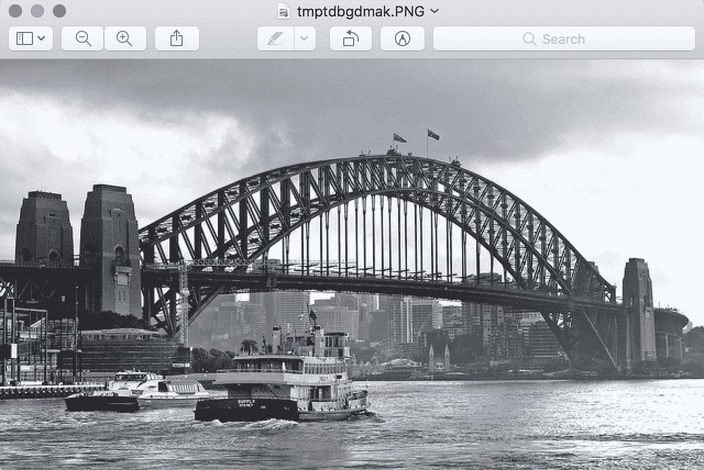

# 如何为深度学习手动缩放图像像素数据

> 原文：<https://machinelearningmastery.com/how-to-manually-scale-image-pixel-data-for-deep-learning/>

最后更新于 2019 年 7 月 5 日

图像由像素值矩阵组成。

黑白图像是单个像素矩阵，而彩色图像对于每个颜色通道都有单独的像素值阵列，例如红色、绿色和蓝色。

像素值通常是 0 到 255 之间的无符号整数。尽管这些像素值可以以原始格式直接呈现给神经网络模型，但这会导致建模过程中的挑战，例如模型的训练速度比预期的慢。

相反，在建模之前准备图像像素值可能会有很大的好处，例如简单地将像素值缩放到 0-1 的范围，以居中甚至标准化这些值。

在本教程中，您将发现使用深度学习神经网络建模的图像数据。

完成本教程后，您将知道:

*   如何将像素值归一化到 0 到 1 之间的范围。
*   如何在全局跨通道和局部每通道中心像素值。
*   如何标准化像素值以及如何将标准化像素值转移到正域。

**用我的新书[计算机视觉深度学习](https://machinelearningmastery.com/deep-learning-for-computer-vision/)启动你的项目**，包括*分步教程*和所有示例的 *Python 源代码*文件。

我们开始吧。

## 教程概述

本教程分为四个部分；它们是:

1.  样本图像
2.  归一化像素值
3.  中心像素值
4.  标准化像素值

## 样本图像

在本教程中，我们需要一个用于测试的示例图像。

我们将使用“T2”伯纳德·斯拉格拍摄的悉尼海港大桥的照片。新西兰”并在许可许可下发布。


悉尼海港大桥由伯纳德·斯普拉格拍摄。NZ"
保留部分权利。

下载照片，放入当前工作目录，文件名为“ *sydney_bridge.jpg* ”。

*   [点击下载照片(sydney_bridge.jpg)](https://machinelearningmastery.com/wp-content/uploads/2019/01/The-Sydney-Harbor-Bridge-Photograph-Loaded-From-File.png)

下面的示例将加载图像，显示关于加载图像的一些属性，然后显示图像。

本示例和教程的其余部分假设您已经安装了 Pillow Python 库。

```py
# load and show an image with Pillow
from PIL import Image
# load the image
image = Image.open('sydney_bridge.jpg')
# summarize some details about the image
print(image.format)
print(image.mode)
print(image.size)
# show the image
image.show()
```

运行该示例会报告图像的格式(即 JPEG)和模式(即三个颜色通道的 RGB)。

接下来，报告图像的大小，显示宽度为 640 像素，高度为 374 像素。

```py
JPEG
RGB
(640, 374)
```

然后使用工作站上显示图像的默认应用程序预览图像。



从文件加载的悉尼海港大桥照片

## 归一化像素值

对于大多数图像数据，像素值是 0 到 255 之间的整数。

神经网络使用小的权值处理输入，而具有大整数值的输入会扰乱或减慢学习过程。因此，对像素值进行归一化是一种很好的做法，这样每个像素值都有一个介于 0 和 1 之间的值。

图像像素值在 0-1 范围内有效，图像可以正常观看。

这可以通过将所有像素值除以最大像素值来实现；那是 255。这是跨所有通道执行的，与图像中存在的像素值的实际范围无关。

以下示例加载图像并将其转换为 NumPy 数组。报告阵列的数据类型，然后打印所有三个通道的最小和最大像素值。接下来，在像素值被归一化并报告新的像素值范围之前，阵列被转换为浮点数据类型。

```py
# example of pixel normalization
from numpy import asarray
from PIL import Image
# load image
image = Image.open('sydney_bridge.jpg')
pixels = asarray(image)
# confirm pixel range is 0-255
print('Data Type: %s' % pixels.dtype)
print('Min: %.3f, Max: %.3f' % (pixels.min(), pixels.max()))
# convert from integers to floats
pixels = pixels.astype('float32')
# normalize to the range 0-1
pixels /= 255.0
# confirm the normalization
print('Min: %.3f, Max: %.3f' % (pixels.min(), pixels.max()))
```

运行该示例打印像素值的 NumPy 数组的数据类型，我们可以看到它是一个 8 位无符号整数。

打印最小和最大像素值，分别显示预期的 0 和 255。像素值被归一化，然后报告 0.0 和 1.0 的新最小值和最大值。

```py
Data Type: uint8
Min: 0.000, Max: 255.000
Min: 0.000, Max: 1.000
```

如果您对要执行的数据准备类型有疑问，规范化是一个很好的默认数据准备。

它可以针对每个图像执行，并且不需要计算整个训练数据集的统计数据，因为像素值的范围是一个域标准。

## 中心像素值

图像数据的一种流行的数据准备技术是从像素值中减去平均值。

这种方法称为居中，因为像素值的分布以零值为中心。

居中可以在标准化之前或之后进行。将像素居中然后归一化将意味着像素值将居中接近 0.5 并且在 0-1 的范围内。归一化后居中将意味着像素将具有正值和负值，在这种情况下，图像将无法正确显示(例如，像素的值预计在 0-255 或 0-1 的范围内)。规范化后的居中可能是首选，尽管测试这两种方法可能都是值得的。

居中要求在从像素值中减去平均像素值之前计算平均像素值。平均值有多种计算方法；例如:

*   pbr 图像
*   每小批图像(在随机梯度下降下)。
*   每个训练数据集。

可以计算图像中所有像素的平均值，称为全局居中，或者可以计算彩色图像中每个通道的平均值，称为局部居中。

*   **全局居中**:计算并减去跨颜色通道的平均像素值。
*   **局部居中**:计算并减去每个颜色通道的平均像素值。

每个图像的全局居中很常见，因为实现起来很简单。同样常见的是每个小批量的全局或局部中心化，原因相同:它快速且易于实现。

在某些情况下，每个通道的平均值是在整个训练数据集中预先计算的。在这种情况下，图像手段必须在训练期间和将来对训练模型的任何推断中被存储和使用。例如，为 ImageNet 训练数据集计算的每通道像素平均值如下:

*   **ImageNet 训练数据集表示**:【0.485，0.456，0.406】

对于使用这些方法以图像为中心训练的模型，这些方法可用于新任务的[转移学习](https://machinelearningmastery.com/how-to-use-transfer-learning-when-developing-convolutional-neural-network-models/)，使用相同的方法标准化新任务的图像可能是有益的，甚至是必需的。

我们来看几个例子。

### 全局居中

以下示例计算加载图像中所有三个颜色通道的全局平均值，然后使用全局平均值将像素值居中。

```py
# example of global centering (subtract mean)
from numpy import asarray
from PIL import Image
# load image
image = Image.open('sydney_bridge.jpg')
pixels = asarray(image)
# convert from integers to floats
pixels = pixels.astype('float32')
# calculate global mean
mean = pixels.mean()
print('Mean: %.3f' % mean)
print('Min: %.3f, Max: %.3f' % (pixels.min(), pixels.max()))
# global centering of pixels
pixels = pixels - mean
# confirm it had the desired effect
mean = pixels.mean()
print('Mean: %.3f' % mean)
print('Min: %.3f, Max: %.3f' % (pixels.min(), pixels.max()))
```

运行该示例，我们可以看到平均像素值约为 152。

一旦居中，我们可以确认像素值的新平均值为 0.0，并且新的数据范围围绕该平均值为正和负。

```py
Mean: 152.149
Min: 0.000, Max: 255.000
Mean: -0.000
Min: -152.149, Max: 102.851
```

### 局部居中

下面的示例计算加载图像中每个颜色通道的平均值，然后分别将每个通道的像素值居中。

请注意，NumPy 允许我们指定通过“*轴*参数计算平均值、最小值和最大值等统计量的维度。在本例中，我们将宽度和高度维度设置为(0，1)，这样就剩下第三个维度或通道。结果是三个通道阵列各有一个平均值、最小值或最大值。

还要注意，当我们计算平均值时，我们将数据类型指定为'*float 64*'；这是必需的，因为这将导致以 64 位准确率执行均值的所有子操作，例如求和。如果没有这一点，将在较低的分辨率下执行求和，并且给定准确率损失中的累积误差，所得到的平均值将是错误的，这又意味着每个通道的中心像素值的平均值将不是零(或者非常小的接近零的数字)。

```py
# example of per-channel centering (subtract mean)
from numpy import asarray
from PIL import Image
# load image
image = Image.open('sydney_bridge.jpg')
pixels = asarray(image)
# convert from integers to floats
pixels = pixels.astype('float32')
# calculate per-channel means and standard deviations
means = pixels.mean(axis=(0,1), dtype='float64')
print('Means: %s' % means)
print('Mins: %s, Maxs: %s' % (pixels.min(axis=(0,1)), pixels.max(axis=(0,1))))
# per-channel centering of pixels
pixels -= means
# confirm it had the desired effect
means = pixels.mean(axis=(0,1), dtype='float64')
print('Means: %s' % means)
print('Mins: %s, Maxs: %s' % (pixels.min(axis=(0,1)), pixels.max(axis=(0,1))))
```

运行该示例首先报告每个通道的平均像素值，以及每个通道的最小值和最大值。像素值居中，然后报告每个通道的新平均值和最小/最大像素值。

我们可以看到，新的平均像素值是非常小的接近零的数字，并且这些值是以零为中心的负值和正值。

```py
Means: [148.61581718 150.64154412 157.18977691]
Mins: [0\. 0\. 0.], Maxs: [255\. 255\. 255.]
Means: [1.14413078e-06 1.61369515e-06 1.37722619e-06]
Mins: [-148.61581 -150.64154 -157.18977], Maxs: [106.384186 104.35846 97.81023 ]
```

## 标准化像素值

像素值的分布通常遵循[正态或高斯分布，例如钟形](https://machinelearningmastery.com/statistical-data-distributions/)。

这种分布可以存在于每个图像、每个小批量图像中，或者存在于整个训练数据集中以及全局或每个通道中。

因此，将像素值的分布转换为标准高斯分布可能会有好处:既可以将像素值以零为中心，又可以通过标准偏差对值进行归一化。结果是像素值的标准高斯分布，平均值为 0.0，标准偏差为 1.0。

与居中一样，操作可以在每个图像、每个小批量和整个训练数据集中执行，并且可以在通道间全局执行或在通道间局部执行。

标准化可能优于标准化和单独居中，它会导致小输入值的零居中值，大致在-3 到 3 的范围内，这取决于数据集的具体情况。

为了输入数据的一致性，如果可能的话，使用每个小批量或整个训练数据集计算的统计数据来标准化每个通道的图像可能更有意义。

我们来看一些例子。

### 全球标准化

以下示例计算加载图像中所有颜色通道的平均值和标准偏差，然后使用这些值来标准化像素值。

```py
# example of global pixel standardization
from numpy import asarray
from PIL import Image
# load image
image = Image.open('sydney_bridge.jpg')
pixels = asarray(image)
# convert from integers to floats
pixels = pixels.astype('float32')
# calculate global mean and standard deviation
mean, std = pixels.mean(), pixels.std()
print('Mean: %.3f, Standard Deviation: %.3f' % (mean, std))
# global standardization of pixels
pixels = (pixels - mean) / std
# confirm it had the desired effect
mean, std = pixels.mean(), pixels.std()
print('Mean: %.3f, Standard Deviation: %.3f' % (mean, std))
```

运行该示例首先计算全局平均值和标准偏差像素值，标准化像素值，然后通过分别报告 0.0 和 1.0 的新全局平均值和标准偏差来确认转换。

```py
Mean: 152.149, Standard Deviation: 70.642
Mean: -0.000, Standard Deviation: 1.000
```

### 积极的全球标准化

可能希望将像素值保持在正域中，可能是为了使图像可视化，或者可能是为了在模型中选择激活函数。

实现这一点的一种流行方式是将标准化像素值裁剪到[-1，1]的范围内，然后将值从[-1，1]重新缩放到[0，1]。

下面的示例更新了全局标准化示例，以演示这种额外的重新缩放。

```py
# example of global pixel standardization shifted to positive domain
from numpy import asarray
from numpy import clip
from PIL import Image
# load image
image = Image.open('sydney_bridge.jpg')
pixels = asarray(image)
# convert from integers to floats
pixels = pixels.astype('float32')
# calculate global mean and standard deviation
mean, std = pixels.mean(), pixels.std()
print('Mean: %.3f, Standard Deviation: %.3f' % (mean, std))
# global standardization of pixels
pixels = (pixels - mean) / std
# clip pixel values to [-1,1]
pixels = clip(pixels, -1.0, 1.0)
# shift from [-1,1] to [0,1] with 0.5 mean
pixels = (pixels + 1.0) / 2.0
# confirm it had the desired effect
mean, std = pixels.mean(), pixels.std()
print('Mean: %.3f, Standard Deviation: %.3f' % (mean, std))
print('Min: %.3f, Max: %.3f' % (pixels.min(), pixels.max()))
```

运行该示例首先报告全局平均值和标准偏差像素值；像素被标准化，然后被重新缩放。

接下来，报告新的平均值和标准偏差分别约为 0.5 和 0.3，新的最小值和最大值确认为 0.0 和 1.0。

```py
Mean: 152.149, Standard Deviation: 70.642
Mean: 0.510, Standard Deviation: 0.388
Min: 0.000, Max: 1.000
```

### 地方标准化

下面的示例计算每个通道加载图像的平均值和标准偏差，然后使用这些统计数据分别标准化每个通道中的像素。

```py
# example of per-channel pixel standardization
from numpy import asarray
from PIL import Image
# load image
image = Image.open('sydney_bridge.jpg')
pixels = asarray(image)
# convert from integers to floats
pixels = pixels.astype('float32')
# calculate per-channel means and standard deviations
means = pixels.mean(axis=(0,1), dtype='float64')
stds = pixels.std(axis=(0,1), dtype='float64')
print('Means: %s, Stds: %s' % (means, stds))
# per-channel standardization of pixels
pixels = (pixels - means) / stds
# confirm it had the desired effect
means = pixels.mean(axis=(0,1), dtype='float64')
stds = pixels.std(axis=(0,1), dtype='float64')
print('Means: %s, Stds: %s' % (means, stds))
```

运行该示例首先计算并报告每个通道中像素值的平均值和标准偏差。

然后对像素值进行标准化，重新计算统计数据，确认新的零均值和单位标准偏差。

```py
Means: [148.61581718 150.64154412 157.18977691], Stds: [70.21666738 70.6718887 70.75185228]
Means: [ 6.26286458e-14 -4.40909176e-14 -8.38046276e-13], Stds: [1\. 1\. 1.]
```

## 扩展ˌ扩张

本节列出了一些您可能希望探索的扩展教程的想法。

*   **开发功能**。开发一个函数来缩放提供的图像，使用参数来选择要执行的准备类型，
*   **投影方法**。研究并实现从像素数据中消除线性相关性的数据准备方法，如主成分分析和 ZCA。
*   **数据集统计**。选择并更新其中一个居中或标准化示例，以计算整个训练数据集中的统计数据，然后在准备用于训练或推理的图像数据时应用这些统计数据。

如果你探索这些扩展，我很想知道。

## 进一步阅读

如果您想更深入地了解这个主题，本节将提供更多资源。

### 应用程序接口

*   [平均空气污染指数](https://docs.scipy.org/doc/numpy/reference/generated/numpy.mean.html)
*   [沿多轴取平均值对大数组给出错误结果，发布](https://github.com/numpy/numpy/issues/8869)。

### 文章

*   [数据预处理，用于视觉识别的 CS231n 卷积神经网络](https://cs231n.github.io/neural-networks-2/)
*   [深度学习为什么要通过减去数据集的图像均值来归一化图像，而不是当前的图像均值？](https://stats.stackexchange.com/questions/211436/why-normalize-images-by-subtracting-datasets-image-mean-instead-of-the-current)
*   [在将卷积神经网络应用于图像分类任务之前，有哪些对图像进行预处理的方法？](https://www.quora.com/What-are-some-ways-of-pre-procesing-images-before-applying-convolutional-neural-networks-for-the-task-of-image-classification)
*   [对分类中的图像预处理一头雾水，Pytorch 发出](https://discuss.pytorch.org/t/confused-about-the-image-preprocessing-in-classification/3965)。

## 摘要

在本教程中，您发现了如何使用深度学习神经网络为建模准备图像数据。

具体来说，您了解到:

*   如何将像素值归一化到 0 到 1 之间的范围。
*   如何在全局跨通道和局部每通道中心像素值。
*   如何标准化像素值以及如何将标准化像素值转移到正域。

你有什么问题吗？
在下面的评论中提问，我会尽力回答。