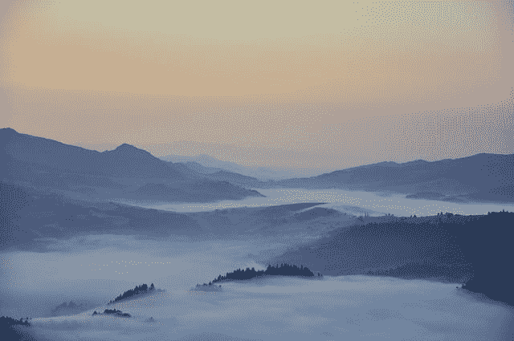
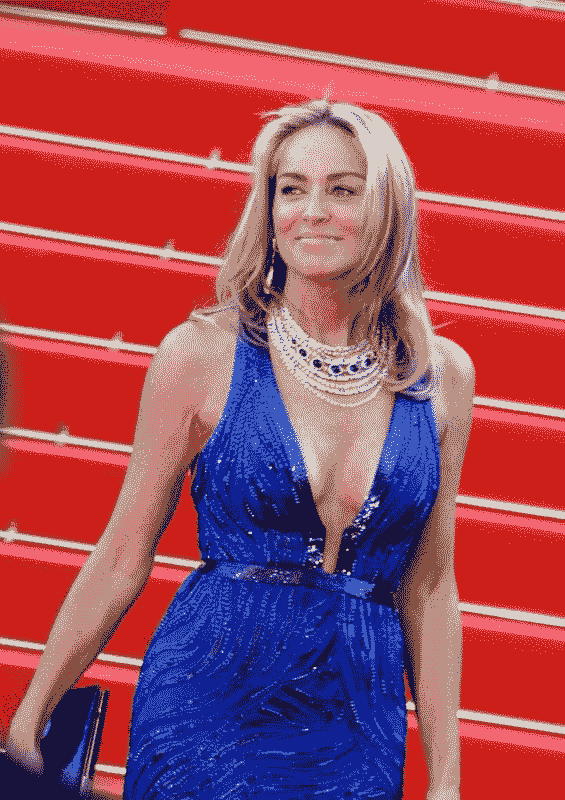
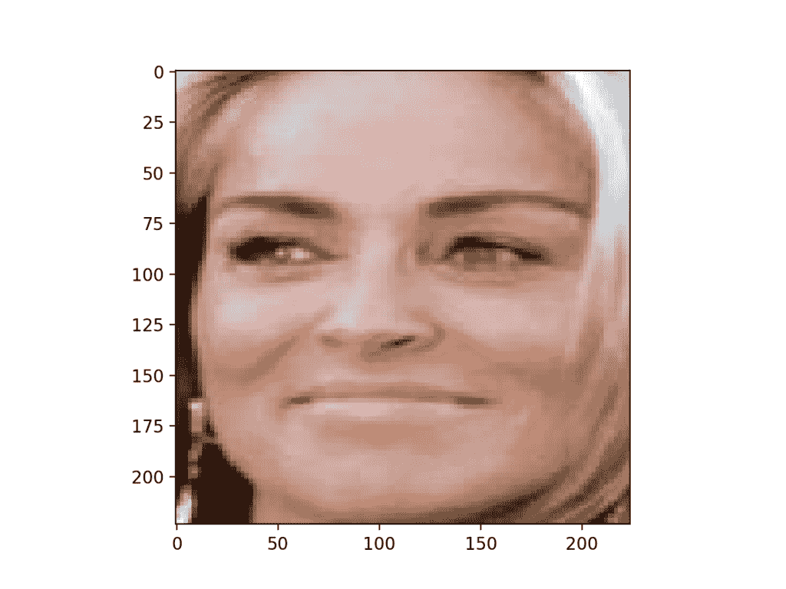
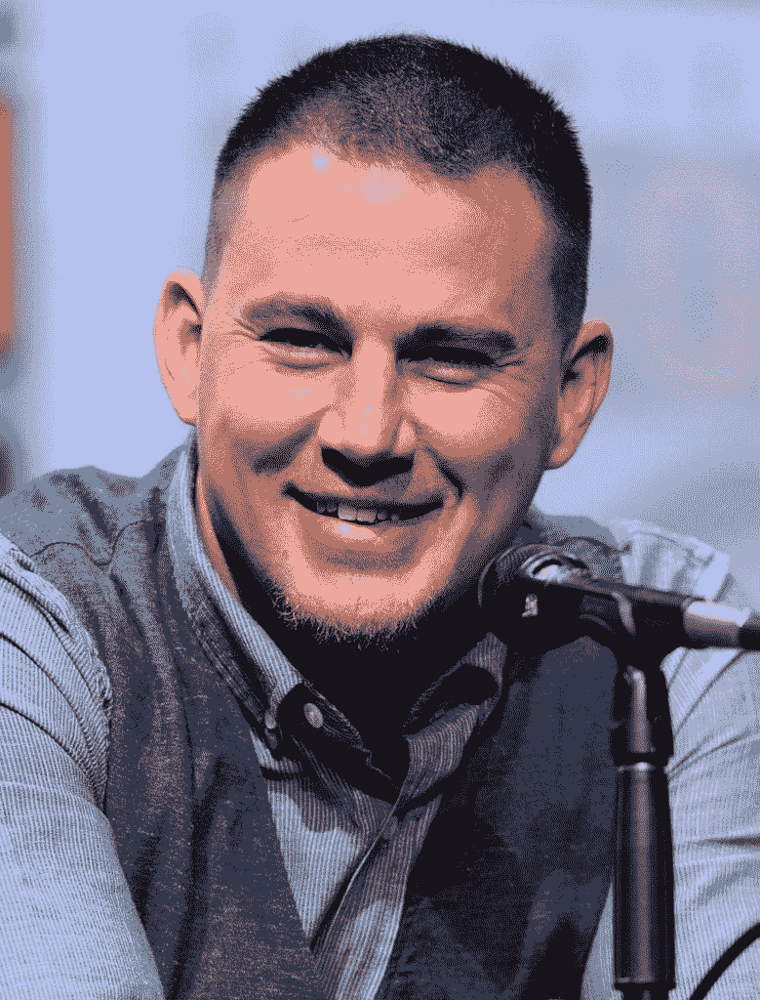

# 如何在 Keras 中将 VGGFace2 用于人脸识别

> 原文：<https://machinelearningmastery.com/how-to-perform-face-recognition-with-vggface2-convolutional-neural-network-in-keras/>

最后更新于 2020 年 8 月 24 日

[人脸识别](https://machinelearningmastery.com/introduction-to-deep-learning-for-face-recognition/)是一项基于人脸照片识别和验证人的计算机视觉任务。

最近，深度学习卷积神经网络已经超越了经典方法，并在标准人脸识别数据集上取得了最先进的结果。最先进模型的一个例子是牛津视觉几何小组的研究人员开发的 VGGFace 和 VGGFace2 模型。

尽管该模型实现起来很有挑战性，训练起来也很耗费资源，但通过使用免费提供的预训练模型和第三方开源库，它可以很容易地在标准深度学习库中使用，例如 Keras。

在本教程中，您将发现如何使用 VGGFace2 深度学习模型开发用于人脸识别和验证的人脸识别系统。

完成本教程后，您将知道:

*   关于用于人脸识别的 VGGFace 和 VGGFace2 模型，以及如何安装 keras_vggface 库，以便在 Python 中使用这些模型和 keras。
*   如何开发人脸识别系统来预测给定照片中的名人姓名？
*   如何开发一个人脸验证系统来确认给定人脸照片的人的身份。

**用我的新书[计算机视觉深度学习](https://machinelearningmastery.com/deep-learning-for-computer-vision/)启动你的项目**，包括*分步教程*和所有示例的 *Python 源代码*文件。

我们开始吧。

*   **2019 年 11 月更新:**针对 TensorFlow v2.0、VGGFace v0.6 和 MTCNN v0.1.0 进行了更新。



如何在 Keras
中使用 VGGFace2 卷积神经网络进行人脸识别。

## 教程概述

本教程分为六个部分；它们是:

1.  人脸识别
2.  VGGFace 和 VGGFace2 型号
3.  如何安装 keras-vggface 库
4.  如何检测人脸进行人脸识别
5.  如何使用 VGGFace2 进行人脸识别
6.  如何使用 VGGFace2 进行人脸验证

## 人脸识别

人脸识别是从人脸照片中识别和验证人的一般任务。

2011 年出版的名为《[人脸识别手册》](https://amzn.to/2EuR8Oo)的人脸识别书籍描述了人脸识别的两种主要模式，如下所示:

*   **人脸验证**。给定人脸与已知身份(例如*的一对一映射是这个人吗？*)。
*   **人脸识别**。给定人脸与已知人脸数据库的一对多映射(例如*这个人是谁？*)。

> 人脸识别系统有望自动识别图像和视频中的人脸。它可以在两种模式中的一种或两种模式下工作:(1)人脸验证(或认证)和(2)人脸识别(或识别)。

—第 1 页，[人脸识别手册](https://amzn.to/2EuR8Oo)。2011.

在本教程中，我们将探索这两种人脸识别任务。

## VGGFace 和 VGGFace2 型号

VGGFace 是指为人脸识别开发的一系列模型，由牛津大学视觉几何组(VGG)的成员在基准计算机视觉数据集上演示。

在撰写本文时，有两种主要的 VGG 人脸识别模型；它们是 VGGFace 和 VGGFace2。让我们依次仔细看看每一个。

### VGGFace 模型

后来命名的 VGGFace 模型是由 Omkar Parkhi 在 2015 年的论文《深度人脸识别》中描述的

论文的一个贡献是描述了如何开发一个非常大的训练数据集，这是训练基于现代卷积神经网络的人脸识别系统所必需的，以便与脸书和谷歌用来训练模型的大数据集竞争。

> …[我们]提出了一种创建相当大的人脸数据集的方法，同时只需要有限的人力来进行注释。为此，我们提出了一种利用网络上的知识来源收集人脸数据的方法(第 3 节)。我们使用这个过程来构建一个拥有超过 200 万张脸的数据集，并将它免费提供给研究团体。

——[深度人脸识别](http://www.robots.ox.ac.uk/~vgg/publications/2015/Parkhi15/parkhi15.pdf)，2015 年。

然后，该数据集被用作开发深度 CNN 的基础，用于人脸识别任务，如人脸识别和验证。具体来说，模型在非常大的数据集上训练，然后在基准人脸识别数据集上评估，证明该模型在从人脸生成广义特征方面是有效的。

他们描述了首先训练人脸分类器的过程，该分类器使用输出层中的 softmax 激活函数将人脸分类为人。然后移除该层，使得网络的输出是面部的矢量特征表示，称为面部嵌入。然后，通过微调进一步训练该模型，以便使为同一身份生成的向量之间的欧几里德距离更小，而为不同身份生成的向量更大。这是使用三重态损失函数实现的。

> 三元组丢失训练旨在学习在最终应用中表现良好的分数向量，即通过比较欧氏空间中的人脸描述符来进行身份验证。[……]一个三元组(A，p，n)包含一个锚脸图像和一个正 p！=主播身份的 a 和负 n 个例子。投影 W’是在目标数据集上学习的

——[深度人脸识别](http://www.robots.ox.ac.uk/~vgg/publications/2015/Parkhi15/parkhi15.pdf)，2015 年。

在 [VGG 风格](https://machinelearningmastery.com/use-pre-trained-vgg-model-classify-objects-photographs/)中使用了深度卷积神经网络架构，具有小核的卷积层块和 ReLU 激活，随后是最大池层，以及在网络的分类器端使用完全连接的层。

### VGGFace2 型号

来自 VGG 的曹琼等人在他们 2017 年的论文《VGGFace2:跨姿势和年龄识别人脸的数据集》中描述了一项后续工作

他们将 VGGFace2 描述为一个大得多的数据集，这些数据集是他们为了训练和评估更有效的人脸识别模型而收集的。

> 本文介绍了一个新的大规模人脸数据集 VGGFace2。该数据集包含 9131 名受试者的 331 万张图像，平均每个受试者有 362.6 张图像。图片从谷歌图像搜索下载，在姿势、年龄、光照、种族和职业(如演员、运动员、政治家)方面有很大差异。

——[vggface 2:一个跨姿势和年龄识别人脸的数据集](https://arxiv.org/abs/1710.08092)，2017。

这篇论文的重点是这个数据集是如何收集、整理的，以及在建模之前图像是如何准备的。然而，VGGFace2 已经成为一个名称，指的是在这个数据集上训练的预先训练的模型，这些模型已经提供了人脸识别。

模型是在数据集上训练的，特别是 ResNet-50 和 SqueezeNet-ResNet-50 模型(称为 SE-ResNet-50 或 SENet)，作者提供了这些[模型的变体以及相关代码。这些模型在标准人脸识别数据集上进行评估，展示了最先进的表现。](https://github.com/ox-vgg/vgg_face2)

> ……我们证明，在 VGGFace2 上训练的深度模型(ResNet-50 和 SENet)在[…]基准测试中取得了最先进的表现。

——[vggface 2:一个跨姿势和年龄识别人脸的数据集](https://arxiv.org/abs/1710.08092)，2017。

具体来说，基于挤压网的模型总体上提供了更好的表现。

> 从零开始学习的 ResNet-50 和 SENet 之间的比较表明，SENet 在验证和识别方面具有一贯的卓越表现。[……]此外，通过在两个数据集 VGGFace2 和 MS1M 上进行训练，利用各自提供的不同优势，可以进一步提高 SENet 的表现。

——[vggface 2:一个跨姿势和年龄识别人脸的数据集](https://arxiv.org/abs/1710.08092)，2017。

人脸嵌入由给定模型预测为 2048 长度向量。向量的长度然后被归一化，例如使用 [L2 向量范数](https://machinelearningmastery.com/vector-norms-machine-learning/)(到原点的欧几里德距离)被归一化为长度 1 或单位范数。这被称为“*面部描述符*”。使用余弦相似度计算面部描述符(或称为“主题模板”的面部描述符组)之间的距离。

> 面部描述符是从与分类器层相邻的层中提取的。这导致 2048 维描述符，然后 L2 归一化

——[vggface 2:一个跨姿势和年龄识别人脸的数据集](https://arxiv.org/abs/1710.08092)，2017。

## 如何安装 keras-vggface 库

VGFFace2 的作者为他们的模型提供了[源代码，以及可以用标准深度学习框架(如 Caffe 和 PyTorch)下载的预训练模型，尽管没有 TensorFlow 或 Keras 的例子。](https://github.com/ox-vgg/vgg_face2)

我们可以将提供的模型转换为 TensorFlow 或 Keras 格式，并开发模型定义，以便加载和使用这些预先训练好的模型。谢天谢地，这项工作已经完成，可以直接被第三方项目和库使用。

或许在 Keras 中使用 VGGFace2(和 VGGFace)模型的最佳第三方库是 [keras-vggface 项目](https://github.com/rcmalli/keras-vggface)和由[瑞菲克·坎马利](https://www.linkedin.com/in/refik-can-malli-185b5aa4/)创建的库。

鉴于这是一个第三方开源项目，可能会有变化，我在这里创建了一个[叉的项目。](https://github.com/jbrownlee/keras-vggface)

该库可以通过 pip 安装；例如:

```py
sudo pip install git+https://github.com/rcmalli/keras-vggface.git
```

成功安装后，您应该会看到如下消息:

```py
Successfully installed keras-vggface-0.6
```

您可以通过查询已安装的软件包来确认库安装正确:

```py
pip show keras-vggface
```

这将总结包的细节；例如:

```py
Name: keras-vggface
Version: 0.6
Summary: VGGFace implementation with Keras framework
Home-page: https://github.com/rcmalli/keras-vggface
Author: Refik Can MALLI
Author-email: mallir@itu.edu.tr
License: MIT
Location: ...
Requires: numpy, scipy, h5py, pillow, keras, six, pyyaml
Required-by:
```

您也可以通过将库加载到脚本中并打印当前版本来确认库加载正确；例如:

```py
# check version of keras_vggface
import keras_vggface
# print version
print(keras_vggface.__version__)
```

运行该示例将加载库并打印当前版本。

```py
0.6
```

## 如何检测人脸进行人脸识别

在我们能够进行人脸识别之前，我们需要检测人脸。

[人脸检测](https://machinelearningmastery.com/how-to-perform-face-detection-with-classical-and-deep-learning-methods-in-python-with-keras/)是在照片中自动定位人脸，并通过在人脸范围周围画一个边界框来定位人脸的过程。

在本教程中，我们还将使用多任务级联卷积神经网络(MTCNN)进行人脸检测，例如从照片中查找和提取人脸。这是一个最先进的人脸检测深度学习模型，在 2016 年发表的题为“使用多任务级联卷积网络的联合人脸检测和对齐”的论文中有所描述

我们将在 [ipazc/mtcnn](https://github.com/ipazc/mtcnn) 项目中使用 [Iván de Paz Centeno](https://www.linkedin.com/in/ivandepazcenteno/) 提供的实现。这也可以通过 pip 安装，如下所示:

```py
sudo pip install mtcnn
```

我们可以通过导入库并打印版本来确认库安装正确；比如说。

```py
# confirm mtcnn was installed correctly
import mtcnn
# print version
print(mtcnn.__version__)
```

运行该示例将打印库的当前版本。

```py
0.1.0
```

我们可以使用 *mtcnn* 库来创建一个人脸检测器，并提取人脸供我们在后续章节中与 VGGFace 人脸检测器模型一起使用。

第一步是加载一个图像作为 NumPy 数组，我们可以使用 [Matplotlib imread()函数](https://matplotlib.org/api/_as_gen/matplotlib.pyplot.imread.html)来实现。

```py
# load image from file
pixels = pyplot.imread(filename)
```

接下来，我们可以创建一个 [MTCNN 人脸检测器](https://machinelearningmastery.com/how-to-perform-face-detection-with-classical-and-deep-learning-methods-in-python-with-keras/)类，并使用它来检测加载的照片中的所有人脸。

```py
# create the detector, using default weights
detector = MTCNN()
# detect faces in the image
results = detector.detect_faces(pixels)
```

结果是一个边界框列表，其中每个边界框定义了边界框的左下角，以及宽度和高度。

如果我们假设照片中只有一张脸用于实验，我们可以如下确定边界框的像素坐标。

```py
# extract the bounding box from the first face
x1, y1, width, height = results[0]['box']
x2, y2 = x1 + width, y1 + height
```

我们可以用这些坐标提取人脸。

```py
# extract the face
face = pixels[y1:y2, x1:x2]
```

然后，我们可以使用 PIL 图书馆来调整这个小图像的脸所需的大小；具体来说，该模型期望形状为 224×224 的正方形输入面。

```py
# resize pixels to the model size
image = Image.fromarray(face)
image = image.resize((224, 224))
face_array = asarray(image)
```

将所有这些结合在一起，函数 *extract_face()* 将从加载的文件名中加载一张照片，并返回提取的人脸。

它假设照片包含一张脸，并将返回检测到的第一张脸。

```py
# extract a single face from a given photograph
def extract_face(filename, required_size=(224, 224)):
	# load image from file
	pixels = pyplot.imread(filename)
	# create the detector, using default weights
	detector = MTCNN()
	# detect faces in the image
	results = detector.detect_faces(pixels)
	# extract the bounding box from the first face
	x1, y1, width, height = results[0]['box']
	x2, y2 = x1 + width, y1 + height
	# extract the face
	face = pixels[y1:y2, x1:x2]
	# resize pixels to the model size
	image = Image.fromarray(face)
	image = image.resize(required_size)
	face_array = asarray(image)
	return face_array
```

我们可以用照片来测试这个功能。

从维基百科下载莎朗[斯通 2013 年拍摄的照片，该照片是在许可许可下发布的。](https://en.wikipedia.org/wiki/File:Sharon_Stone_Cannes_2013_2.jpg)

下载照片并将其放入当前工作目录，文件名为“ *sharon_stone1.jpg* ”。



莎伦的照片(sharon_stone1.jpg)
Stone，来自维基百科。

*   [下载莎朗斯通照片(莎朗斯通 1.jpg)](https://machinelearningmastery.com/wp-content/uploads/2019/03/sharon_stone1.jpg)

下面列出了加载莎朗·斯通的照片、提取面部并绘制结果的完整示例。

```py
# example of face detection with mtcnn
from matplotlib import pyplot
from PIL import Image
from numpy import asarray
from mtcnn.mtcnn import MTCNN

# extract a single face from a given photograph
def extract_face(filename, required_size=(224, 224)):
	# load image from file
	pixels = pyplot.imread(filename)
	# create the detector, using default weights
	detector = MTCNN()
	# detect faces in the image
	results = detector.detect_faces(pixels)
	# extract the bounding box from the first face
	x1, y1, width, height = results[0]['box']
	x2, y2 = x1 + width, y1 + height
	# extract the face
	face = pixels[y1:y2, x1:x2]
	# resize pixels to the model size
	image = Image.fromarray(face)
	image = image.resize(required_size)
	face_array = asarray(image)
	return face_array

# load the photo and extract the face
pixels = extract_face('sharon_stone1.jpg')
# plot the extracted face
pyplot.imshow(pixels)
# show the plot
pyplot.show()
```

运行该示例加载照片，提取人脸，并绘制结果。

我们可以看到人脸被正确检测和提取。

结果表明，我们可以使用开发的 *extract_face()* 函数作为后续章节中使用 VGGFace 人脸识别模型进行示例的基础。



使用有线电视新闻网模型从莎朗·斯通的照片中检测人脸

## 如何使用 VGGFace2 进行人脸识别

在这一节中，我们将使用 VGGFace2 模型对维基百科中的名人照片进行人脸识别。

可以使用 *VGGFace()* 构造函数并通过“*模型*参数指定要创建的模型类型来创建 VGGFace 模型。

```py
model = VGGFace(model='...')
```

*keras-vggface* 库提供了三个预训练的 VGGModels，一个通过*model = ' vgg 16′*(默认)的 VGGFace1 模型，以及两个 VGGFace2 模型' *resnet50* 和' *senet50* 。

下面的例子创建了一个“ *resnet50* ”的 VGGFace2 模型，并总结了输入和输出的形状。

```py
# example of creating a face embedding
from keras_vggface.vggface import VGGFace
# create a vggface2 model
model = VGGFace(model='resnet50')
# summarize input and output shape
print('Inputs: %s' % model.inputs)
print('Outputs: %s' % model.outputs)
```

第一次创建模型时，库会下载模型权重并保存在*中。/keras/models/vggface/* 目录在你的主目录中。 *resnet50* 型号的权重大小约为 158 兆字节，因此下载可能需要几分钟，具体取决于您的互联网连接速度。

运行该示例会打印模型的输入和输出张量的形状。

我们可以看到，该模型期望输入 244×244 形状的人脸彩色图像，输出将是 8631 人的类预测。这是有意义的，因为[预训练模型](http://www.robots.ox.ac.uk/~vgg/data/vgg_face2/meta_infor.html)是在 [MS-Celeb-1M 数据集](https://www.microsoft.com/en-us/research/project/ms-celeb-1m-challenge-recognizing-one-million-celebrities-real-world/) ( [列在这个 CSV 文件](http://www.robots.ox.ac.uk/~vgg/data/vgg_face2/meta/identity_meta.csv)中)的 8631 个身份上训练的。

```py
Inputs: [<tf.Tensor 'input_1:0' shape=(?, 224, 224, 3) dtype=float32>]
Outputs: [<tf.Tensor 'classifier/Softmax:0' shape=(?, 8631) dtype=float32>]
```

这个 Keras 模型可以直接用来预测一张给定的脸属于八千多个已知名人中的一个或多个的概率；例如:

```py
# perform prediction
yhat = model.predict(samples)
```

一旦做出预测，就可以将类整数映射到名人的名字，并且可以检索出概率最高的前五个名字。

该行为由 *keras-vggface* 库中的 *decode_predictions()* 函数提供。

```py
# convert prediction into names
results = decode_predictions(yhat)
# display most likely results
for result in results[0]:
	print('%s: %.3f%%' % (result[0], result[1]*100))
```

在我们可以用人脸进行预测之前，像素值必须以与 VGGFace 模型拟合时准备的数据相同的方式进行缩放。具体来说，像素值必须使用训练数据集中的平均值以每个通道为中心。

这可以通过使用*keras-vgf ace*库中提供的*prepare _ input()*功能并指定“*版本=2* ”来实现，以便使用用于训练 vgf ace 2 模型而不是 vgf ace 1 模型(默认)的平均值来缩放图像。

```py
# convert one face into samples
pixels = pixels.astype('float32')
samples = expand_dims(pixels, axis=0)
# prepare the face for the model, e.g. center pixels
samples = preprocess_input(samples, version=2)
```

我们可以将所有这些联系在一起，并预测我们在前一节下载的香农·斯通照片的身份，特别是“ *sharon_stone1.jpg* ”。

下面列出了完整的示例。

```py
# Example of face detection with a vggface2 model
from numpy import expand_dims
from matplotlib import pyplot
from PIL import Image
from numpy import asarray
from mtcnn.mtcnn import MTCNN
from keras_vggface.vggface import VGGFace
from keras_vggface.utils import preprocess_input
from keras_vggface.utils import decode_predictions

# extract a single face from a given photograph
def extract_face(filename, required_size=(224, 224)):
	# load image from file
	pixels = pyplot.imread(filename)
	# create the detector, using default weights
	detector = MTCNN()
	# detect faces in the image
	results = detector.detect_faces(pixels)
	# extract the bounding box from the first face
	x1, y1, width, height = results[0]['box']
	x2, y2 = x1 + width, y1 + height
	# extract the face
	face = pixels[y1:y2, x1:x2]
	# resize pixels to the model size
	image = Image.fromarray(face)
	image = image.resize(required_size)
	face_array = asarray(image)
	return face_array

# load the photo and extract the face
pixels = extract_face('sharon_stone1.jpg')
# convert one face into samples
pixels = pixels.astype('float32')
samples = expand_dims(pixels, axis=0)
# prepare the face for the model, e.g. center pixels
samples = preprocess_input(samples, version=2)
# create a vggface model
model = VGGFace(model='resnet50')
# perform prediction
yhat = model.predict(samples)
# convert prediction into names
results = decode_predictions(yhat)
# display most likely results
for result in results[0]:
	print('%s: %.3f%%' % (result[0], result[1]*100))
```

运行该示例加载照片，提取我们知道存在的单个人脸，然后预测人脸的身份。

然后显示前五个概率最高的名称。

**注**:考虑到算法或评估程序的随机性，或数值准确率的差异，您的[结果可能会有所不同](https://machinelearningmastery.com/different-results-each-time-in-machine-learning/)。考虑运行该示例几次，并比较平均结果。

我们可以看到，该模型正确地将人脸识别为属于莎朗·斯通，可能性为 99.642%。

```py
b' Sharon_Stone': 99.642%
b' Noelle_Reno': 0.085%
b' Elisabeth_R\xc3\xb6hm': 0.033%
b' Anita_Lipnicka': 0.026%
b' Tina_Maze': 0.019%
```

我们可以用另一个名人来测试这个模型，在这个例子中，是一个男性，查宁·塔图姆。

根据许可协议，2017 年拍摄的查宁·塔图姆照片可以在维基百科上获得。

下载照片并保存在当前工作目录下，文件名为“*”channing _ Tatum . jpg*。



查宁·塔图姆的照片，来自维基百科。

*   [下载查宁·塔图姆照片](https://machinelearningmastery.com/wp-content/uploads/2019/03/channing_tatum.jpg)

请更改代码以加载查宁·塔图姆的照片；例如:

```py
pixels = extract_face('channing_tatum.jpg')
```

用新照片运行该示例，我们可以看到该模型正确地将人脸识别为属于查宁·塔图姆，可能性为 94.432%。

```py
b' Channing_Tatum': 94.432%
b' Eoghan_Quigg': 0.146%
b' Les_Miles': 0.113%
b' Ibrahim_Afellay': 0.072%
b' Tovah_Feldshuh': 0.070%
```

你可能想用维基百科上的名人照片来尝试这个例子。尝试不同的性别、种族和年龄。你会发现这个模式并不完美，但是对于那些它确实很了解的名人来说，它可以是有效的。

您可能想尝试该模型的其他版本，如“ *vgg16* ”和“ *senet50* ”，然后比较结果。比如我发现有一张[奥斯卡·伊萨克](https://en.wikipedia.org/wiki/Oscar_Isaac#/media/File:Oscar_Isaac_by_Gage_Skidmore.jpg)的照片， *vgg16* 是有效的，而 VGGFace2 车型则没有。

该模型可用于识别新面孔。一种方法是用新的人脸数据集重新训练模型，也许只是模型的分类器部分。

## 如何使用 VGGFace2 进行人脸验证

VGGFace2 模型可用于人脸验证。

这包括计算新的给定面部的面部嵌入，并将该嵌入与系统已知的面部的单个例子的嵌入进行比较。

人脸嵌入是表示从人脸中提取的特征的向量。然后可以将其与为其他面生成的矢量进行比较。例如，另一个靠近的向量(以某种度量)可能是同一个人，而另一个远的向量(以某种度量)可能是不同的人。

欧几里德距离和余弦距离等典型度量是在两个嵌入之间计算的，如果距离低于预定义的阈值(通常针对特定数据集或应用程序进行调整)，则称这些面匹配或验证。

首先，我们可以通过将“ *include_top* ”参数设置为“ *False* ”来加载不带分类器的 VGGFace 模型，通过“ *input_shape* 指定输出的形状，并将“ *pooling* ”设置为“ *avg* ”，从而使用全局平均池将模型输出端的过滤器映射简化为一个向量。

```py
# create a vggface model
model = VGGFace(model='resnet50', include_top=False, input_shape=(224, 224, 3), pooling='avg')
```

然后，该模型可用于进行预测，这将返回作为输入提供的一个或多个面部的面部嵌入。

```py
# perform prediction
yhat = model.predict(samples)
```

我们可以定义一个新的函数，在给定包含人脸的照片的文件名列表的情况下，该函数将通过上一节中开发的 *extract_face()* 函数从每张照片中提取一张人脸，VGGFace2 模型的输入需要预处理，可以通过调用*prepare _ input()*来实现，然后为每张照片预测人脸嵌入。

下面的*get _ embedding()*函数实现了这一点，为每个提供的照片文件名返回一个包含一个人脸嵌入的数组。

```py
# extract faces and calculate face embeddings for a list of photo files
def get_embeddings(filenames):
	# extract faces
	faces = [extract_face(f) for f in filenames]
	# convert into an array of samples
	samples = asarray(faces, 'float32')
	# prepare the face for the model, e.g. center pixels
	samples = preprocess_input(samples, version=2)
	# create a vggface model
	model = VGGFace(model='resnet50', include_top=False, input_shape=(224, 224, 3), pooling='avg')
	# perform prediction
	yhat = model.predict(samples)
	return yhat
```

我们可以通过计算和存储该照片中面部的面部嵌入来拍摄我们之前使用的莎朗·斯通的照片(例如*莎朗·斯通 1.jpg* )作为我们对莎朗·斯通身份的定义。

然后，我们可以计算莎朗·斯通的其他照片中人脸的嵌入，并测试我们是否能有效地验证她的身份。我们也可以用其他人照片中的脸来确认他们不是莎朗·斯通。

可以通过计算已知身份的嵌入和候选面部的嵌入之间的余弦距离来执行验证。这可以使用[余弦()SciPy 函数](https://docs.scipy.org/doc/scipy/reference/generated/scipy.spatial.distance.cosine.html)来实现。两个嵌入之间的最大距离为 1.0，而最小距离为 0.0。用于面部识别的常用截止值介于 0.4 和 0.6 之间，例如 0.5，尽管这应该针对应用进行调整。

下面的 *is_match()* 函数实现了这一点，计算两个嵌入之间的距离并解释结果。

```py
# determine if a candidate face is a match for a known face
def is_match(known_embedding, candidate_embedding, thresh=0.5):
	# calculate distance between embeddings
	score = cosine(known_embedding, candidate_embedding)
	if score <= thresh:
		print('>face is a Match (%.3f <= %.3f)' % (score, thresh))
	else:
		print('>face is NOT a Match (%.3f > %.3f)' % (score, thresh))
```

我们可以通过从维基百科下载更多莎朗·斯通的照片来测试一些正面的例子。

具体来说，2002 年拍摄的照片(下载并另存为“ *sharon_stone2.jpg* ”)，2017 年拍摄的照片(下载并另存为“ *sharon_stone3.jpg* ”)

*   [莎朗斯通照片 2('莎朗斯通 2.jpg')](https://machinelearningmastery.com/wp-content/uploads/2019/03/sharon_stone2.jpg)
*   [莎朗斯通照片 3('莎朗斯通 3.jpg')](https://machinelearningmastery.com/wp-content/uploads/2019/03/sharon_stone3.jpg)

我们将测试这两个阳性病例，并将前一部分的查宁·塔图姆照片作为阴性样本。

下面列出了人脸验证的完整代码示例。

```py
# face verification with the VGGFace2 model
from matplotlib import pyplot
from PIL import Image
from numpy import asarray
from scipy.spatial.distance import cosine
from mtcnn.mtcnn import MTCNN
from keras_vggface.vggface import VGGFace
from keras_vggface.utils import preprocess_input

# extract a single face from a given photograph
def extract_face(filename, required_size=(224, 224)):
	# load image from file
	pixels = pyplot.imread(filename)
	# create the detector, using default weights
	detector = MTCNN()
	# detect faces in the image
	results = detector.detect_faces(pixels)
	# extract the bounding box from the first face
	x1, y1, width, height = results[0]['box']
	x2, y2 = x1 + width, y1 + height
	# extract the face
	face = pixels[y1:y2, x1:x2]
	# resize pixels to the model size
	image = Image.fromarray(face)
	image = image.resize(required_size)
	face_array = asarray(image)
	return face_array

# extract faces and calculate face embeddings for a list of photo files
def get_embeddings(filenames):
	# extract faces
	faces = [extract_face(f) for f in filenames]
	# convert into an array of samples
	samples = asarray(faces, 'float32')
	# prepare the face for the model, e.g. center pixels
	samples = preprocess_input(samples, version=2)
	# create a vggface model
	model = VGGFace(model='resnet50', include_top=False, input_shape=(224, 224, 3), pooling='avg')
	# perform prediction
	yhat = model.predict(samples)
	return yhat

# determine if a candidate face is a match for a known face
def is_match(known_embedding, candidate_embedding, thresh=0.5):
	# calculate distance between embeddings
	score = cosine(known_embedding, candidate_embedding)
	if score <= thresh:
		print('>face is a Match (%.3f <= %.3f)' % (score, thresh))
	else:
		print('>face is NOT a Match (%.3f > %.3f)' % (score, thresh))

# define filenames
filenames = ['sharon_stone1.jpg', 'sharon_stone2.jpg',
	'sharon_stone3.jpg', 'channing_tatum.jpg']
# get embeddings file filenames
embeddings = get_embeddings(filenames)
# define sharon stone
sharon_id = embeddings[0]
# verify known photos of sharon
print('Positive Tests')
is_match(embeddings[0], embeddings[1])
is_match(embeddings[0], embeddings[2])
# verify known photos of other people
print('Negative Tests')
is_match(embeddings[0], embeddings[3])
```

第一张照片作为莎朗·斯通的模板，列表中剩余的照片为正反照片，以供测试验证。

运行该示例，我们可以看到系统正确验证了莎朗·斯通早期和晚期照片中的两个阳性病例。

**注**:考虑到算法或评估程序的随机性，或数值准确率的差异，您的[结果可能会有所不同](https://machinelearningmastery.com/different-results-each-time-in-machine-learning/)。考虑运行该示例几次，并比较平均结果。

我们还可以看到，查宁·塔图姆的照片没有被正确地验证为莎朗·斯通。探索其他负面照片的验证，如其他女性名人的照片，将是一个有趣的扩展。

```py
Positive Tests
>face is a Match (0.418 <= 0.500)
>face is a Match (0.295 <= 0.500)
Negative Tests
>face is NOT a Match (0.709 > 0.500)
```

**注**:模型生成的嵌入并不是针对用来训练模型的名人照片。该模型被认为可以为任何人脸生成有用的嵌入；或许可以用自己的照片对比亲戚朋友的照片来尝试一下。

## 进一步阅读

如果您想更深入地了解这个主题，本节将提供更多资源。

### 报纸

*   [深度人脸识别](http://www.robots.ox.ac.uk/~vgg/publications/2015/Parkhi15/parkhi15.pdf)，2015 年。
*   [VGGFace2:跨姿势和年龄识别人脸的数据集](https://arxiv.org/abs/1710.08092)，2017。
*   [使用多任务级联卷积网络的联合人脸检测和对准](https://arxiv.org/abs/1604.02878)，2016。

### 书

*   [人脸识别手册](https://amzn.to/2EuR8Oo)，第二版，2011 年。

### 应用程序接口

*   [视觉几何集团(VGG)主页](http://www.robots.ox.ac.uk/~vgg/)。
*   [VGGFace 主页](http://www.robots.ox.ac.uk/~vgg/software/vgg_face/)。
*   [VGGFace2 主页](https://www.robots.ox.ac.uk/~vgg/data/vgg_face2/)。
*   [GitHub 官方 VGGFace2 项目](https://github.com/ox-vgg/vgg_face2)。
*   [喀尔巴阡山项目，GitHub](https://github.com/rcmalli/keras-vggface) 。
*   [MS-celebe-1M 数据集主页](https://www.microsoft.com/en-us/research/project/ms-celeb-1m-challenge-recognizing-one-million-celebrities-real-world/)。
*   [scipy.spatial.distance .余弦 API](https://docs.scipy.org/doc/scipy/reference/generated/scipy.spatial.distance.cosine.html)

## 摘要

在本教程中，您发现了如何使用 VGGFace2 深度学习模型开发用于人脸识别和验证的人脸识别系统。

具体来说，您了解到:

*   关于用于人脸识别的 VGGFace 和 VGGFace2 模型，以及如何安装 keras_vggface 库，以便在 Python 中使用这些模型和 keras。
*   如何开发人脸识别系统来预测给定照片中的名人姓名？
*   如何开发一个人脸验证系统来确认给定人脸照片的人的身份。

你有什么问题吗？
在下面的评论中提问，我会尽力回答。