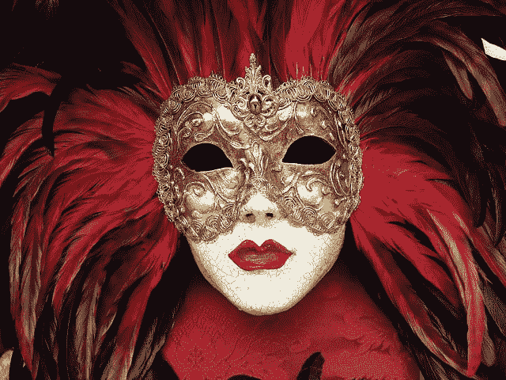
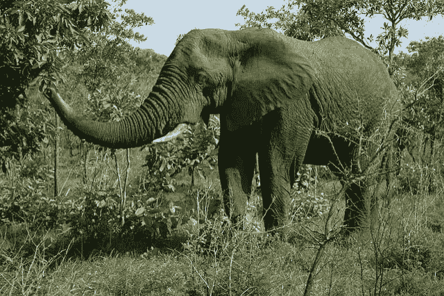
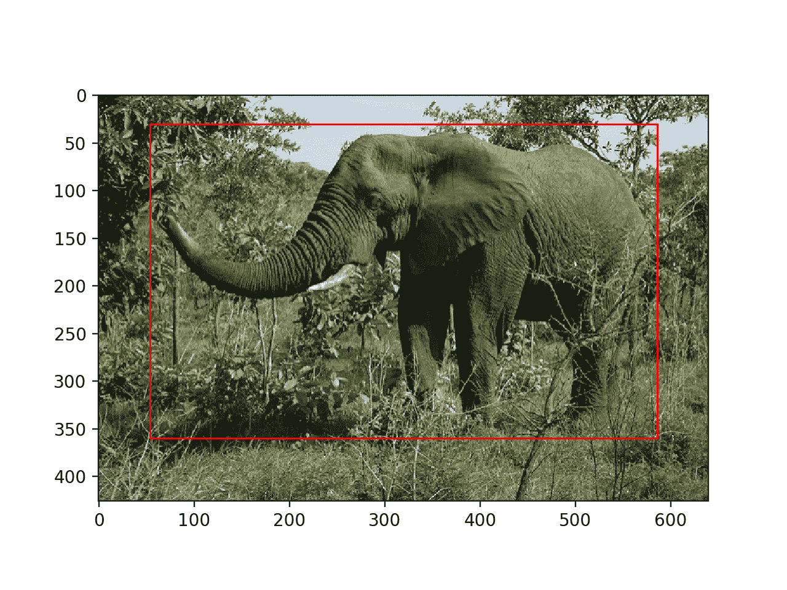
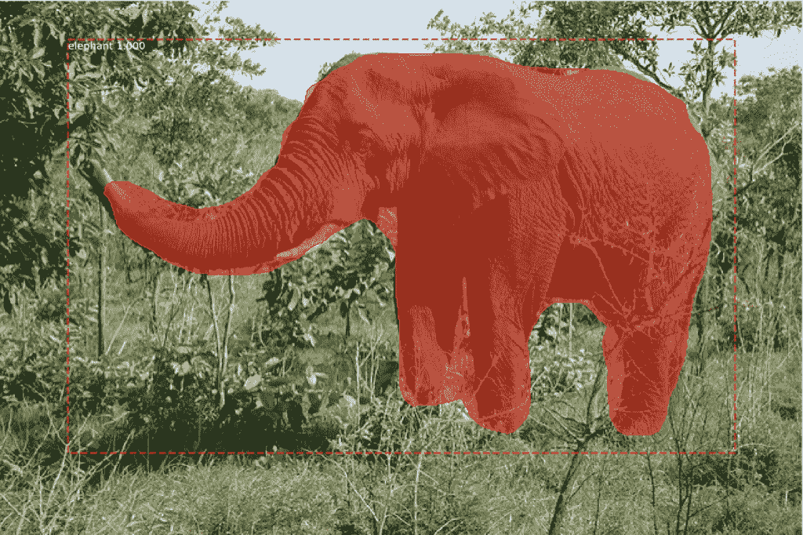

# 如何在 Keras 中将 Mask RCNN 用于照片中的对象检测

> 原文：<https://machinelearningmastery.com/how-to-perform-object-detection-in-photographs-with-mask-r-cnn-in-keras/>

最后更新于 2020 年 9 月 2 日

对象检测是计算机视觉中的一项任务，包括识别给定照片中一个或多个目标的存在、位置和类型。

这是一个具有挑战性的问题，涉及建立在对象识别(例如，它们在哪里)、对象定位(例如，它们的范围是什么)和对象分类(例如，它们是什么)的方法之上。

近年来，深度学习技术在对象检测方面取得了最先进的成果，例如在标准基准数据集和计算机视觉竞赛中。最值得注意的是基于区域的卷积神经网络，以及最近的一种称为掩模的技术，该技术能够在一系列对象检测任务中获得最先进的结果。

在本教程中，您将发现如何使用遮罩 R-CNN 模型来检测新照片中的对象。

完成本教程后，您将知道:

*   用于对象检测的基于区域的卷积神经网络系列模型，以及最近的一个变种，称为掩蔽神经网络。
*   Keras 深度学习库的 Mask R-CNN 的最佳开源库实现。
*   如何使用预先训练好的 Mask R-CNN 对新照片进行对象定位和检测。

**用我的新书[计算机视觉深度学习](https://machinelearningmastery.com/deep-learning-for-computer-vision/)启动你的项目**，包括*分步教程*和所有示例的 *Python 源代码*文件。

我们开始吧。



如何在带有遮罩的照片中进行对象检测，版权所有。

## 教程概述

本教程分为三个部分；它们是:

1.  美国有线电视新闻网和面具美国有线电视新闻网
2.  马特波特口罩研究项目
3.  基于掩模的对象检测

**注**:本教程需要 TensorFlow 1 . 15 . 3 版和 Keras 2.2.4 版。它不适用于 TensorFlow 2.0+或 Keras 2.2.5+，因为在编写本文时，第三方库尚未更新。

您可以按如下方式安装这些特定版本的库:

```py
sudo pip install --no-deps tensorflow==1.15.3
sudo pip install --no-deps keras==2.2.4
```

## 用于对象检测的掩模

对象检测是一项计算机视觉任务，包括定位图像中的一个或多个目标，并对图像中的每个目标进行分类。

这是一项具有挑战性的计算机视觉任务，既需要成功的对象定位来定位和绘制图像中每个对象周围的边界框，又需要对象分类来预测被定位的对象的正确类别。

对象检测的扩展包括标记图像中属于每个检测到的对象的特定像素，而不是在对象定位期间使用粗略的边界框。这个更难的问题通常被称为对象分割或语义分割。

基于区域的卷积神经网络，或称 R-CNN，是一个为对象检测而设计的卷积神经网络模型家族，由 [Ross Girshick](http://www.rossgirshick.info/) 等人开发。

这种方法可能有四种主要的变化，导致了目前被称为面具的顶峰。每种变化的突出方面可以总结如下:

*   **R-CNN** :包围盒由“*选择性搜索*算法提出，在用线性支持向量机进行最后一组对象分类之前，每个包围盒被拉伸，并通过深度卷积神经网络提取特征，例如 [AlexNet](https://en.wikipedia.org/wiki/AlexNet) 。
*   **快速 R-CNN** :单一模型的简化设计，仍然指定边界框作为输入，但是在深度 CNN 之后使用感兴趣区域池层来合并区域，模型直接预测类标签和感兴趣区域。
*   **更快的 R-CNN** :增加了区域提议网络，解释从深层 CNN 提取的特征，学习直接提议感兴趣的区域。
*   **Mask RCNN**:fast R-CNN 的扩展，增加了一个输出模型，用于预测每个检测对象的蒙版。

在 2018 年发表的题为“ [Mask R-CNN](https://arxiv.org/abs/1703.06870) ”的论文中介绍的 Mask R-CNN 模型是该系列模型的最新变体，同时支持对象检测和对象分割。这篇论文很好地总结了这方面的模型:

> 基于区域的包围盒对象检测方法是关注可管理数量的候选对象区域，并在每个 RoI 上独立评估卷积网络。美国有线电视新闻网得到了扩展，允许使用感兴趣区域池关注要素地图上的感兴趣区域，从而提高了速度和准确性。更快的美国有线电视新闻网通过区域建议网络学习注意力机制来推进这一趋势。更快的 R-CNN 对许多后续改进是灵活和健壮的，并且是几个基准中的当前领先框架。

——[口罩 R-CNN](https://arxiv.org/abs/1703.06870) ，2018 年。

该系列方法可能是最有效的对象检测方法之一，可以在计算机视觉基准数据集上获得最先进的结果。虽然准确，但与 YOLO 等替代模型相比，这些模型在进行预测时可能会很慢，后者可能不太准确，但设计用于实时预测。

## 马特波特口罩研究项目

Mask R-CNN 是一个需要实现的复杂模型，尤其是与简单甚至最先进的深度卷积神经网络模型相比。

R-CNN 模型的每个版本都有源代码，在独立的 GitHub 存储库中提供，原型模型基于 [Caffe 深度学习框架](http://caffe.berkeleyvision.org/)。例如:

*   [R-CNN:具有卷积神经网络特征的区域，GitHub](https://github.com/rbgirshick/rcnn) 。
*   [快速 R-CNN，GitHub](https://github.com/rbgirshick/fast-rcnn) 。
*   [更快的 R-CNN Python 代码，GitHub](https://github.com/rbgirshick/py-faster-rcnn) 。
*   [探测器，Facebook AI，GitHub](https://github.com/facebookresearch/Detectron) 。

我们可以使用建立在 Keras 深度学习框架之上的可靠的第三方实现，而不是从零开始开发 R-CNN 或 Mask R-CNN 模型的实现。

口罩 R-CNN 最好的第三方实现是由[马特波特](https://matterport.com/)开发的[口罩 R-CNN 项目](https://github.com/matterport/Mask_RCNN)。该项目是在许可许可(即麻省理工学院许可)下发布的开源项目，该代码已被广泛用于各种项目和卡格尔竞赛。

然而，它是一个开源项目，受制于项目开发者的奇思妙想。因此，[我有一个可用项目的分叉](https://github.com/jbrownlee/Mask_RCNN)，以防将来 API 有重大变化。

该项目不依赖于应用编程接口文档，尽管它确实以 Python 笔记本的形式提供了许多示例，您可以使用这些示例来理解如何使用该库。可能有助于复习的两本笔记本是:

*   [口罩 R-CNN 演示，笔记本](https://github.com/matterport/Mask_RCNN/blob/master/samples/demo.ipynb)。
*   [口罩 R-CNN–检查训练模型，笔记本](https://github.com/matterport/Mask_RCNN/blob/master/samples/coco/inspect_model.ipynb)。

在 Matterport 库中使用 Mask R-CNN 模型可能有三个主要用例；它们是:

*   **对象检测应用**:使用预先训练好的模型对新图像进行对象检测。
*   **通过迁移学习的新模型**:在为新的对象检测数据集开发模型时，使用预先训练的模型作为起点。
*   **从零开始新模型**:为对象检测数据集从零开始开发新模型。

为了熟悉模型和库，我们将在下一节中查看第一个示例。

## 带掩模的对象检测

在本节中，我们将使用 Matterport Mask R-CNN 库对任意照片执行对象检测。

很像使用预先训练的深度 CNN 进行图像分类，例如在 ImageNet 数据集上训练的 [VGG-16，我们可以使用预先训练的 Mask R-CNN 模型来检测新照片中的对象。在这种情况下，我们将使用 Mask RCNN 上训练的](https://machinelearningmastery.com/use-pre-trained-vgg-model-classify-objects-photographs/) [MS COCO 对象检测问题](http://cocodataset.org/)。

### 面罩安装

第一步是安装库。

在撰写本文时，该库没有分布式版本，所以我们必须手动安装。好消息是，这非常容易。

安装包括克隆 GitHub 存储库和在您的工作站上运行安装脚本。如果您遇到问题，请参阅藏在库的自述文件中的[安装说明](https://github.com/matterport/Mask_RCNN#installation)。

#### 第一步。克隆面具

这就像从命令行运行以下命令一样简单:

```py
git clone https://github.com/matterport/Mask_RCNN.git
```

这将创建一个名为 *Mask_RCNN* 的新本地目录，如下所示:

```py
Mask_RCNN
├── assets
├── build
│   ├── bdist.macosx-10.13-x86_64
│   └── lib
│       └── mrcnn
├── dist
├── images
├── mask_rcnn.egg-info
├── mrcnn
└── samples
    ├── balloon
    ├── coco
    ├── nucleus
    └── shapes
```

#### 第二步。安装屏蔽

该库可以通过 pip 直接安装。

将目录改为 *Mask_RCNN* 目录，运行安装脚本。

在命令行中，键入以下内容:

```py
cd Mask_RCNN
python setup.py install
```

在 Linux 或 MacOS 上，您可能需要安装具有 sudo 权限的软件；例如，您可能会看到如下错误:

```py
error: can't create or remove files in install directory
```

在这种情况下，使用 sudo 安装软件:

```py
sudo python setup.py install
```

然后，该库将直接安装，您将看到许多成功安装的消息，以下列内容结尾:

```py
...
Finished processing dependencies for mask-rcnn==2.1
```

这确认您成功地安装了库，并且您拥有最新的版本，在撰写本文时是 2.1 版。

#### 步骤 3:确认库已安装

确认库安装正确总是一个好主意。

您可以通过 pip 命令查询库来确认库安装正确；例如:

```py
pip show mask-rcnn
```

您应该会看到通知您版本和安装位置的输出；例如:

```py
Name: mask-rcnn
Version: 2.1
Summary: Mask R-CNN for object detection and instance segmentation
Home-page: https://github.com/matterport/Mask_RCNN
Author: Matterport
Author-email: waleed.abdulla@gmail.com
License: MIT
Location: ...
Requires:
Required-by:
```

我们现在可以使用图书馆了。

### 对象定位示例

我们将使用预先训练好的 Mask RCNN 模型来检测新照片上的对象。

#### 第一步。下载模型权重

首先，下载预训练模型的权重，特别是在 MS Coco 数据集上训练的 Mask R-CNN。

权重可从 GitHub 项目中获得，文件约为 250 兆字节。将模型权重下载到当前工作目录中名为“ *mask_rcnn_coco.h5* 的文件中。

*   [下载权重(mask_rcnn_coco.h5)](https://github.com/matterport/Mask_RCNN/releases/download/v2.0/mask_rcnn_coco.h5) (246 兆)

#### 第二步。下载照片样本

我们还需要一张照片来探测对象。

我们将使用 Flickr 在许可许可下发布的照片，特别是曼迪·戈德堡拍摄的大象照片。

将照片下载到您当前的工作目录中，文件名为“*elephant.jpg*”。



大象(elephant.jpg)
曼迪·戈德堡摄，版权所有。

*   [下载照片(elephant.jpg)](https://machinelearningmastery.com/wp-content/uploads/2019/03/elephant.jpg)

#### 第三步。负荷建模和预测

首先，必须通过实例 *MaskRCNN* 类定义模型。

此类需要一个配置对象作为参数。配置对象定义了在训练或推理过程中如何使用模型。

在这种情况下，配置将只指定每批图像的数量(一个)和要预测的类的数量。

您可以在 [config.py 文件](https://github.com/matterport/Mask_RCNN/blob/master/mrcnn/config.py)中看到配置对象的完整范围和可以覆盖的属性。

```py
# define the test configuration
class TestConfig(Config):
     NAME = "test"
     GPU_COUNT = 1
     IMAGES_PER_GPU = 1
     NUM_CLASSES = 1 + 80
```

我们现在可以定义 *MaskRCNN* 实例。

我们将模型定义为类型“*推断*”，表示我们感兴趣的是做预测而不是训练。我们还必须指定一个可以写入任何日志消息的目录，在这种情况下，它将是当前的工作目录。

```py
# define the model
rcnn = MaskRCNN(mode='inference', model_dir='./', config=TestConfig())
```

下一步是加载我们下载的权重。

```py
# load coco model weights
rcnn.load_weights('mask_rcnn_coco.h5', by_name=True)
```

现在我们可以对我们的图像进行预测。首先，我们可以加载图像并将其转换为 NumPy 数组。

```py
# load photograph
img = load_img('elephant.jpg')
img = img_to_array(img)
```

然后我们可以用这个模型做一个预测。我们将调用*检测()*函数，并将单个图像传递给它，而不是像在正常的 Keras 模型上那样调用 *predict()* 。

```py
# make prediction
results = rcnn.detect([img], verbose=0)
```

结果包含我们传递到 *detect()* 函数的每个图像的字典，在本例中，是一个图像的单个字典的列表。

字典中有边界框、遮罩等的键，每个键指向图像中检测到的多个可能对象的列表。

笔记词典的关键字如下:

*   *感兴趣区域*:检测到的对象的边界框或感兴趣区域。
*   *遮罩*:检测对象的遮罩。
*   *class_ids* ':检测到的对象的类整数。
*   *得分*':每个预测类的概率或置信度。

我们可以通过首先获取第一幅图像的字典(例如*结果【0】*)，然后检索边界框列表(例如 *['rois']* )来绘制图像中检测到的每个框。

```py
boxes = results[0]['rois']
```

每个边界框都是根据图像中边界框的左下角和右上角坐标来定义的

```py
y1, x1, y2, x2 = boxes[0]
```

我们可以使用这些坐标从 matplotlib API 创建一个[矩形()，并在图像顶部绘制每个矩形。](https://matplotlib.org/api/_as_gen/matplotlib.patches.Rectangle.html)

```py
# get coordinates
y1, x1, y2, x2 = box
# calculate width and height of the box
width, height = x2 - x1, y2 - y1
# create the shape
rect = Rectangle((x1, y1), width, height, fill=False, color='red')
# draw the box
ax.add_patch(rect)
```

为了保持整洁，我们可以创建一个函数来做到这一点，它将获取照片的文件名和要绘制的边界框列表，并将显示带有框的照片。

```py
# draw an image with detected objects
def draw_image_with_boxes(filename, boxes_list):
     # load the image
     data = pyplot.imread(filename)
     # plot the image
     pyplot.imshow(data)
     # get the context for drawing boxes
     ax = pyplot.gca()
     # plot each box
     for box in boxes_list:
          # get coordinates
          y1, x1, y2, x2 = box
          # calculate width and height of the box
          width, height = x2 - x1, y2 - y1
          # create the shape
          rect = Rectangle((x1, y1), width, height, fill=False, color='red')
          # draw the box
          ax.add_patch(rect)
     # show the plot
     pyplot.show()
```

我们现在可以将所有这些联系在一起，加载预训练的模型，并使用它来检测我们的大象照片中的对象，然后用所有检测到的对象绘制照片。

下面列出了完整的示例。

```py
# example of inference with a pre-trained coco model
from keras.preprocessing.image import load_img
from keras.preprocessing.image import img_to_array
from mrcnn.config import Config
from mrcnn.model import MaskRCNN
from matplotlib import pyplot
from matplotlib.patches import Rectangle

# draw an image with detected objects
def draw_image_with_boxes(filename, boxes_list):
     # load the image
     data = pyplot.imread(filename)
     # plot the image
     pyplot.imshow(data)
     # get the context for drawing boxes
     ax = pyplot.gca()
     # plot each box
     for box in boxes_list:
          # get coordinates
          y1, x1, y2, x2 = box
          # calculate width and height of the box
          width, height = x2 - x1, y2 - y1
          # create the shape
          rect = Rectangle((x1, y1), width, height, fill=False, color='red')
          # draw the box
          ax.add_patch(rect)
     # show the plot
     pyplot.show()

# define the test configuration
class TestConfig(Config):
     NAME = "test"
     GPU_COUNT = 1
     IMAGES_PER_GPU = 1
     NUM_CLASSES = 1 + 80

# define the model
rcnn = MaskRCNN(mode='inference', model_dir='./', config=TestConfig())
# load coco model weights
rcnn.load_weights('mask_rcnn_coco.h5', by_name=True)
# load photograph
img = load_img('elephant.jpg')
img = img_to_array(img)
# make prediction
results = rcnn.detect([img], verbose=0)
# visualize the results
draw_image_with_boxes('elephant.jpg', results[0]['rois'])
```

运行该示例会加载模型并执行对象检测。更准确地说，我们已经执行了对象定位，只在检测到的对象周围绘制边界框。

在这种情况下，我们可以看到模型已经正确定位了照片中的单个对象，大象，并在它周围画了一个红色的方框。



一只大象的照片，所有对象都用边界框定位

### 对象检测示例

现在我们知道如何加载模型并使用它进行预测，让我们更新示例来执行真实对象检测。

也就是说，除了定位对象，我们还想知道它们是什么。

*Mask_RCNN* API 提供了一个名为 *display_instances()* 的函数，该函数将获取加载图像的像素值数组和预测字典的各个方面，如边界框、分数和类别标签，并将绘制带有所有这些注释的照片。

参数之一是字典的“ *class_ids* ”键中可用的预测类标识符列表。该函数还需要 id 到类标签的映射。预训练的模型适合具有 80 个(81 个包括背景)类别标签的数据集，在下面列出的[面具 R-CNN 演示，笔记本教程](https://github.com/matterport/Mask_RCNN/blob/master/samples/demo.ipynb)中作为列表提供是有帮助的。

```py
# define 81 classes that the coco model knowns about
class_names = ['BG', 'person', 'bicycle', 'car', 'motorcycle', 'airplane',
               'bus', 'train', 'truck', 'boat', 'traffic light',
               'fire hydrant', 'stop sign', 'parking meter', 'bench', 'bird',
               'cat', 'dog', 'horse', 'sheep', 'cow', 'elephant', 'bear',
               'zebra', 'giraffe', 'backpack', 'umbrella', 'handbag', 'tie',
               'suitcase', 'frisbee', 'skis', 'snowboard', 'sports ball',
               'kite', 'baseball bat', 'baseball glove', 'skateboard',
               'surfboard', 'tennis racket', 'bottle', 'wine glass', 'cup',
               'fork', 'knife', 'spoon', 'bowl', 'banana', 'apple',
               'sandwich', 'orange', 'broccoli', 'carrot', 'hot dog', 'pizza',
               'donut', 'cake', 'chair', 'couch', 'potted plant', 'bed',
               'dining table', 'toilet', 'tv', 'laptop', 'mouse', 'remote',
               'keyboard', 'cell phone', 'microwave', 'oven', 'toaster',
               'sink', 'refrigerator', 'book', 'clock', 'vase', 'scissors',
               'teddy bear', 'hair drier', 'toothbrush']
```

然后我们可以向*display _ instance()*函数提供大象照片的预测细节；例如:

```py
# get dictionary for first prediction
r = results[0]
# show photo with bounding boxes, masks, class labels and scores
display_instances(img, r['rois'], r['masks'], r['class_ids'], class_names, r['scores'])
```

*display_instances()* 功能非常灵活，允许您只绘制蒙版或边界框。您可以在 [visualize.py 源文件](https://github.com/matterport/Mask_RCNN/blob/master/mrcnn/visualize.py)中了解该功能的更多信息。

下面列出了使用 *display_instances()* 功能进行此更改的完整示例。

```py
# example of inference with a pre-trained coco model
from keras.preprocessing.image import load_img
from keras.preprocessing.image import img_to_array
from mrcnn.visualize import display_instances
from mrcnn.config import Config
from mrcnn.model import MaskRCNN

# define 81 classes that the coco model knowns about
class_names = ['BG', 'person', 'bicycle', 'car', 'motorcycle', 'airplane',
               'bus', 'train', 'truck', 'boat', 'traffic light',
               'fire hydrant', 'stop sign', 'parking meter', 'bench', 'bird',
               'cat', 'dog', 'horse', 'sheep', 'cow', 'elephant', 'bear',
               'zebra', 'giraffe', 'backpack', 'umbrella', 'handbag', 'tie',
               'suitcase', 'frisbee', 'skis', 'snowboard', 'sports ball',
               'kite', 'baseball bat', 'baseball glove', 'skateboard',
               'surfboard', 'tennis racket', 'bottle', 'wine glass', 'cup',
               'fork', 'knife', 'spoon', 'bowl', 'banana', 'apple',
               'sandwich', 'orange', 'broccoli', 'carrot', 'hot dog', 'pizza',
               'donut', 'cake', 'chair', 'couch', 'potted plant', 'bed',
               'dining table', 'toilet', 'tv', 'laptop', 'mouse', 'remote',
               'keyboard', 'cell phone', 'microwave', 'oven', 'toaster',
               'sink', 'refrigerator', 'book', 'clock', 'vase', 'scissors',
               'teddy bear', 'hair drier', 'toothbrush']

# define the test configuration
class TestConfig(Config):
     NAME = "test"
     GPU_COUNT = 1
     IMAGES_PER_GPU = 1
     NUM_CLASSES = 1 + 80

# define the model
rcnn = MaskRCNN(mode='inference', model_dir='./', config=TestConfig())
# load coco model weights
rcnn.load_weights('mask_rcnn_coco.h5', by_name=True)
# load photograph
img = load_img('elephant.jpg')
img = img_to_array(img)
# make prediction
results = rcnn.detect([img], verbose=0)
# get dictionary for first prediction
r = results[0]
# show photo with bounding boxes, masks, class labels and scores
display_instances(img, r['rois'], r['masks'], r['class_ids'], class_names, r['scores'])
```

运行该示例显示了大象的照片，其注释由遮罩模型预测，具体如下:

*   **边界框**。每个检测到的对象周围的虚线边界框。
*   **类别标签**。为每个检测到的对象分配的类标签写在边界框的左上角。
*   **预测置信度**。写在边界框左上角的每个检测到的对象的类别标签预测的置信度。
*   **对象蒙版轮廓**。每个检测到的对象的遮罩的多边形轮廓。
*   **对象遮罩**。每个检测到的对象的蒙版的多边形填充。

结果给人留下了深刻的印象，并激发了许多关于如何在实践中使用如此强大的预训练模型的想法。



用边界框和遮罩检测到所有对象的大象照片

## 进一步阅读

如果您想更深入地了解这个主题，本节将提供更多资源。

### 报纸

*   [丰富的特征层次，用于精确的对象检测和语义分割](https://arxiv.org/abs/1311.2524)，2013。
*   [用于视觉识别的深度卷积网络中的空间金字塔池](https://arxiv.org/abs/1406.4729)，2014。
*   [快 R-CNN](https://arxiv.org/abs/1504.08083) ，2015 年。
*   [更快的 R-CNN:使用区域提议网络实现实时对象检测](https://arxiv.org/abs/1506.01497)，2016 年。
*   [口罩 R-CNN](https://arxiv.org/abs/1703.06870) ，2017 年。

### 应用程序接口

*   [matplotlib . patches . rectangle API](https://matplotlib.org/api/_as_gen/matplotlib.patches.Rectangle.html)

### 资源

*   [面具 R-CNN，GitHub](https://github.com/matterport/Mask_RCNN) 。
*   [口罩 R-CNN 演示，笔记本](https://github.com/matterport/Mask_RCNN/blob/master/samples/demo.ipynb)。
*   [口罩 R-CNN–检查训练模型，笔记本](https://github.com/matterport/Mask_RCNN/blob/master/samples/coco/inspect_model.ipynb)。

### 美国有线电视新闻网代码库

*   [R-CNN:具有卷积神经网络特征的区域，GitHub](https://github.com/rbgirshick/rcnn) 。
*   [快速 R-CNN，GitHub](https://github.com/rbgirshick/fast-rcnn) 。
*   [更快的 R-CNN Python 代码，GitHub](https://github.com/rbgirshick/py-faster-rcnn) 。
*   [探测器，Facebook AI，GitHub](https://github.com/facebookresearch/Detectron) 。

## 摘要

在本教程中，您发现了如何使用遮罩模型来检测新照片中的对象。

具体来说，您了解到:

*   用于对象检测的基于区域的卷积神经网络系列模型，以及最近的一个变种，称为掩蔽神经网络。
*   Keras 深度学习库的 Mask R-CNN 的最佳开源库实现。
*   如何使用预先训练好的 Mask R-CNN 对新照片进行对象定位和检测。

你有什么问题吗？
在下面的评论中提问，我会尽力回答。