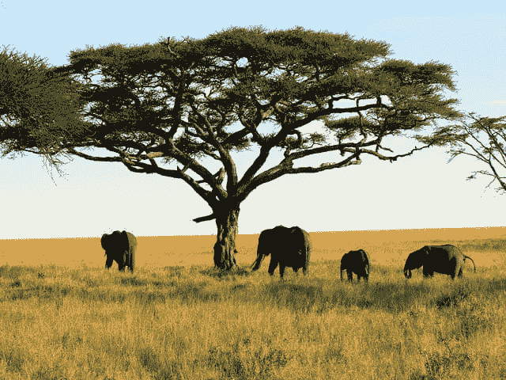
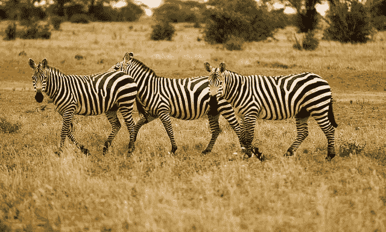
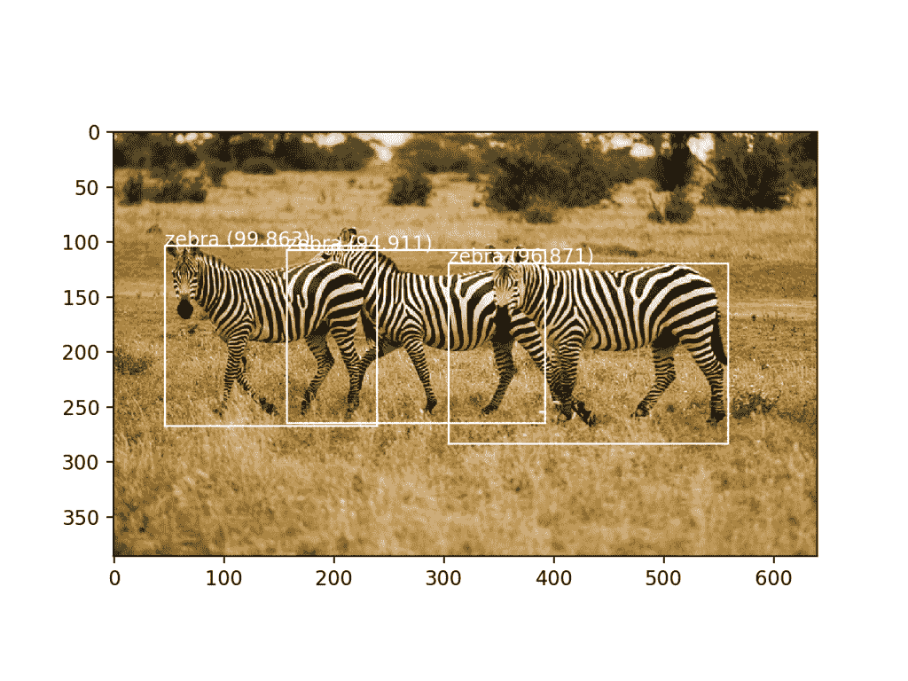

# 如何在 Keras 中将 YOLOv3 用于对象检测

> 原文：<https://machinelearningmastery.com/how-to-perform-object-detection-with-yolov3-in-keras/>

最后更新于 2019 年 10 月 8 日

对象检测是计算机视觉中的一项任务，包括识别给定照片中一个或多个目标的存在、位置和类型。

这是一个具有挑战性的问题，涉及建立在对象识别(例如，它们在哪里)、对象定位(例如，它们的范围是什么)和对象分类(例如，它们是什么)的方法之上。

近年来，深度学习技术在对象检测方面取得了最先进的成果，例如在标准基准数据集和计算机视觉竞赛中。值得注意的是“你只看一次”，或 YOLO，卷积神经网络家族，实现了接近最先进的结果与单一的端到端模型，可以实时执行对象检测。

在本教程中，您将发现如何在新照片上开发用于对象检测的 YOLOv3 模型。

完成本教程后，您将知道:

*   基于 YOLO 的卷积神经网络模型系列，用于对象检测，最近的变体称为 YOLOv3。
*   Keras 深度学习库的 YOLOv3 的最佳开源库实现。
*   如何使用预先训练好的 YOLOv3 对新照片进行对象定位和检测。

**用我的新书[计算机视觉深度学习](https://machinelearningmastery.com/deep-learning-for-computer-vision/)启动你的项目**，包括*分步教程*和所有示例的 *Python 源代码*文件。

我们开始吧。

*   **2019 年 10 月更新**:针对 Keras 2.3.0 API 和 TensorFlow 2.0.0 进行了更新和测试。

如何在 Keras
中使用 YOLOv3 执行对象检测[大卫·伯克维茨](https://www.flickr.com/photos/davidberkowitz/5699832418/)摄，保留部分权利。

## 教程概述

本教程分为三个部分；它们是:

1.  对象探测 YOLO
2.  Experiencor YOLO3 项目
3.  用 YOLOv3 进行对象检测

## 对象探测 YOLO

对象检测是一项计算机视觉任务，包括定位图像中的一个或多个目标，并对图像中的每个目标进行分类。

这是一项具有挑战性的计算机视觉任务，既需要成功的对象定位来定位和绘制图像中每个对象周围的边界框，又需要对象分类来预测被定位的对象的正确类别。

“*你只看一次*”或“YOLO”系列模型是一系列为快速对象检测而设计的端到端深度学习模型，由 [Joseph Redmon](https://pjreddie.com/) 等人开发，并在 2015 年发表的题为“[你只看一次:统一、实时的对象检测](https://arxiv.org/abs/1506.02640)”的论文中首次进行了描述

这种方法包括一个深度卷积神经网络(最初是谷歌网的一个版本，后来根据 VGG 进行了更新，并被称为暗网)，它将输入分成一个单元网格，每个单元直接预测一个边界框和对象分类。结果是通过后处理步骤将大量候选边界框合并成最终预测。

在撰写本文时，该方法主要有三种变体；它们是 YOLOv1、YOLOv2 和 YOLOv3。第一个版本提出了通用架构，而第二个版本完善了设计，并使用预定义的锚点框来改进边界框建议，第三个版本进一步完善了模型架构和训练过程。

虽然模型的准确率接近但不如基于区域的卷积神经网络，但由于其检测速度，它们在对象检测中很受欢迎，通常在视频或摄像机输入下实时演示。

> 单个神经网络在一次评估中直接从完整图像中预测边界框和类概率。由于整个检测流水线是单个网络，因此可以直接在检测表现上进行端到端优化。

——[你只看一次:统一实时对象检测](https://arxiv.org/abs/1506.02640)，2015。

在本教程中，我们将重点介绍如何使用 YOLOv3。

## Keras 项目的 Experiencor YOLO3

每个版本的 YOLO 源代码，以及预先训练的模型。

官方的 [DarkNet GitHub](https://github.com/pjreddie/darknet) 存储库包含论文中提到的 YOLO 版本的源代码，用 c 语言编写。该存储库提供了如何使用代码进行对象检测的逐步教程。

从零开始实现这是一个具有挑战性的模型，尤其是对于初学者，因为它需要开发许多定制的模型元素来进行训练和预测。例如，即使直接使用预先训练的模型，也需要复杂的代码来提取和解释模型输出的预测边界框。

我们可以使用第三方实现，而不是从零开始开发这些代码。有许多第三方实现是为将 YOLO 与 Keras 一起使用而设计的，但没有一个是标准化的，并且被设计成用作库。

[yadk 项目](https://github.com/allanzelener/YAD2K)是 YOLOv2 事实上的标准，并提供脚本将预先训练的权重转换为 Keras 格式，使用预先训练的模型进行预测，并提供提取和解释预测的边界框所需的代码。许多其他第三方开发人员已经将此代码作为起点，并对其进行了更新以支持 YOLOv3。

使用预先训练的 YOLO 模型的最广泛使用的项目可能是由[胡恩·恩高克·安(Huynh Ngoc Anh)](https://www.linkedin.com/in/ngoca/)或 experiencor 开发的名为“ [keras-yolo3:用 YOLO3](https://github.com/experiencor/keras-yolo3) 训练和检测对象”的项目。项目中的代码已经在一个许可的麻省理工开源许可下可用。像 YAD2K 一样，它提供脚本来加载和使用预先训练的 YOLO 模型，以及在新的数据集上开发 YOLOv3 模型的迁移学习。

他还有一个 [keras-yolo2](https://github.com/experiencor/keras-yolo2) 项目，为 YOLOv2 提供类似的代码，以及如何在存储库中使用代码的详细教程。 [keras-yolo3](https://github.com/experiencor/keras-yolo3) 项目似乎是该项目的更新版本。

有趣的是，experiencor 已经将该模型用作一些实验的基础，并对标准对象检测问题(如袋鼠数据集、浣熊数据集、红细胞检测等)训练了 YOLOv3 版本。他列出了模型表现，提供了模型权重供下载，并提供了模型行为的 YouTube 视频。例如:

*   [使用 YOLO 3](https://www.youtube.com/watch?v=lxLyLIL7OsU) 检测浣熊

<iframe loading="lazy" title="Raccoon Detection using YOLO 3" width="500" height="281" src="about:blank" frameborder="0" allow="accelerometer; autoplay; encrypted-media; gyroscope; picture-in-picture" allowfullscreen="" data-rocket-lazyload="fitvidscompatible" data-lazy-src="https://www.youtube.com/embed/lxLyLIL7OsU?feature=oembed"><iframe title="Raccoon Detection using YOLO 3" width="500" height="281" src="https://www.youtube.com/embed/lxLyLIL7OsU?feature=oembed" frameborder="0" allow="accelerometer; autoplay; encrypted-media; gyroscope; picture-in-picture" allowfullscreen=""/>
 
 
在本教程中，我们将使用 experiencor 的 keras-yolo3 项目作为使用 YOLOv3 模型执行对象检测的基础。
 
如果存储库改变或被移除(这可能发生在第三方开源项目中)，在编写时会提供一个<a href="https://github.com/jbrownlee/keras-yolo3">代码分叉。</a>
 <h2>用 YOLOv3 进行对象检测</h2> 
<a href="https://github.com/experiencor/keras-yolo3"> keras-yolo3 </a>项目为使用 YOLOv3 模型提供了大量功能，包括对象检测、迁移学习和从零开始训练新模型。
 
在本节中，我们将使用一个预先训练好的模型对一张看不见的照片进行对象检测。该功能在名为“<a href="https://raw.githubusercontent.com/experiencor/keras-yolo3/master/yolo3_one_file_to_detect_them_all.py">yolo 3 _ one _ file _ to _ detect _ them _ all . py</a>”的存储库中的单个 Python 文件中可用，该文件约有 435 行。事实上，这个脚本是一个程序，它将使用预先训练的权重来准备模型，并使用该模型来执行对象检测和输出模型。这也取决于 OpenCV。
 
我们将不再直接使用这个程序，而是重用这个程序中的元素，并开发自己的脚本，首先准备并保存一个 Keras YOLOv3 模型，然后加载该模型，为新照片做出预测。
 <h3>创建和保存模型</h3> 
第一步是下载预先训练好的模型权重。
 
这些是在 MSCOCO 数据集上使用 DarkNet 代码库训练的。下载模型砝码，并将其放入您当前的工作目录中，文件名为“<em> yolov3.weights </em>”这是一个很大的文件，根据您的互联网连接速度，下载可能需要一些时间。
 <ul> <li><a href="https://pjreddie.com/media/files/yolov3.weights"> YOLOv3 预训练模型权重(yolov3.weights) (237 MB) </a></li> </ul> 
接下来，我们需要定义一个 Keras 模型，该模型具有正确的层数和类型，以匹配下载的模型权重。该模型架构被称为“<em>暗网</em>”，最初是基于 VGG-16 模型。
 
“<a href="https://raw.githubusercontent.com/experiencor/keras-yolo3/master/yolo3_one_file_to_detect_them_all.py">yolo 3 _ one _ file _ to _ detect _ theme _ all . py</a>脚本提供了<em> make_yolov3_model() </em>函数为我们创建模型，以及用于创建层块的辅助函数<em> _conv_block() </em>。这两个函数可以直接从脚本中复制。
 
我们现在可以为 YOLOv3 定义 Keras 模型。
 <pre> # define the model model = make_yolov3_model()</pre>
接下来，我们需要加载模型权重。模型权重以 DarkNet 使用的任何格式存储。我们可以使用脚本中提供的<em>加权阅读器</em>类，而不是试图手动解码文件。
 
为了使用<em>权重读取器</em>，它用我们的权重文件的路径来实例化(例如“<em> yolov3.weights </em>”)。这将解析文件，并将模型权重以我们可以设置到我们的 Keras 模型中的格式加载到内存中。
 <pre> # load the model weights weight_reader = WeightReader('yolov3.weights')</pre>
然后，我们可以调用<em>权重读取器</em>实例的<em> load_weights() </em>函数，传入我们定义的 Keras 模型，将权重设置到层中。
 <pre> # set the model weights into the model weight_reader.load_weights(model)</pre>
就是这样；我们现在有一个 YOLOv3 模型可供使用。
 
我们可以将这个模型保存到一个 Keras 兼容的. h5 模型文件中，以备后用。
 <pre> # save the model to file model.save('model.h5')</pre>
我们可以把这一切联系在一起；下面列出了完整的代码示例，包括直接从“<em>yolo 3 _ one _ file _ to _ detect _ them _ all . py</em>”脚本中复制的函数。
 <pre> # create a YOLOv3 Keras model and save it to file # based on https://github.com/experiencor/keras-yolo3 import struct import numpy as np from keras.layers import Conv2D from keras.layers import Input from keras.layers import BatchNormalization from keras.layers import LeakyReLU from keras.layers import ZeroPadding2D from keras.layers import UpSampling2D from keras.layers.merge import add, concatenate from keras.models import Model def _conv_block(inp, convs, skip=True): x = inp count = 0 for conv in convs: if count == (len(convs) - 2) and skip: skip_connection = x count += 1 if conv['stride'] &gt; 1: x = ZeroPadding2D(((1,0),(1,0)))(x) # peculiar padding as darknet prefer left and top x = Conv2D(conv['filter'], conv['kernel'], strides=conv['stride'], padding='valid' if conv['stride'] &gt; 1 else 'same', # peculiar padding as darknet prefer left and top name='conv_' + str(conv['layer_idx']), use_bias=False if conv['bnorm'] else True)(x) if conv['bnorm']: x = BatchNormalization(epsilon=0.001, name='bnorm_' + str(conv['layer_idx']))(x) if conv['leaky']: x = LeakyReLU(alpha=0.1, name='leaky_' + str(conv['layer_idx']))(x) return add([skip_connection, x]) if skip else x def make_yolov3_model(): input_image = Input(shape=(None, None, 3)) # Layer 0 =&gt; 4 x = _conv_block(input_image, [{'filter': 32, 'kernel': 3, 'stride': 1, 'bnorm': True, 'leaky': True, 'layer_idx': 0}, {'filter': 64, 'kernel': 3, 'stride': 2, 'bnorm': True, 'leaky': True, 'layer_idx': 1}, {'filter': 32, 'kernel': 1, 'stride': 1, 'bnorm': True, 'leaky': True, 'layer_idx': 2}, {'filter': 64, 'kernel': 3, 'stride': 1, 'bnorm': True, 'leaky': True, 'layer_idx': 3}]) # Layer 5 =&gt; 8 x = _conv_block(x, [{'filter': 128, 'kernel': 3, 'stride': 2, 'bnorm': True, 'leaky': True, 'layer_idx': 5}, {'filter': 64, 'kernel': 1, 'stride': 1, 'bnorm': True, 'leaky': True, 'layer_idx': 6}, {'filter': 128, 'kernel': 3, 'stride': 1, 'bnorm': True, 'leaky': True, 'layer_idx': 7}]) # Layer 9 =&gt; 11 x = _conv_block(x, [{'filter': 64, 'kernel': 1, 'stride': 1, 'bnorm': True, 'leaky': True, 'layer_idx': 9}, {'filter': 128, 'kernel': 3, 'stride': 1, 'bnorm': True, 'leaky': True, 'layer_idx': 10}]) # Layer 12 =&gt; 15 x = _conv_block(x, [{'filter': 256, 'kernel': 3, 'stride': 2, 'bnorm': True, 'leaky': True, 'layer_idx': 12}, {'filter': 128, 'kernel': 1, 'stride': 1, 'bnorm': True, 'leaky': True, 'layer_idx': 13}, {'filter': 256, 'kernel': 3, 'stride': 1, 'bnorm': True, 'leaky': True, 'layer_idx': 14}]) # Layer 16 =&gt; 36 for i in range(7): x = _conv_block(x, [{'filter': 128, 'kernel': 1, 'stride': 1, 'bnorm': True, 'leaky': True, 'layer_idx': 16+i*3}, {'filter': 256, 'kernel': 3, 'stride': 1, 'bnorm': True, 'leaky': True, 'layer_idx': 17+i*3}]) skip_36 = x # Layer 37 =&gt; 40 x = _conv_block(x, [{'filter': 512, 'kernel': 3, 'stride': 2, 'bnorm': True, 'leaky': True, 'layer_idx': 37}, {'filter': 256, 'kernel': 1, 'stride': 1, 'bnorm': True, 'leaky': True, 'layer_idx': 38}, {'filter': 512, 'kernel': 3, 'stride': 1, 'bnorm': True, 'leaky': True, 'layer_idx': 39}]) # Layer 41 =&gt; 61 for i in range(7): x = _conv_block(x, [{'filter': 256, 'kernel': 1, 'stride': 1, 'bnorm': True, 'leaky': True, 'layer_idx': 41+i*3}, {'filter': 512, 'kernel': 3, 'stride': 1, 'bnorm': True, 'leaky': True, 'layer_idx': 42+i*3}]) skip_61 = x # Layer 62 =&gt; 65 x = _conv_block(x, [{'filter': 1024, 'kernel': 3, 'stride': 2, 'bnorm': True, 'leaky': True, 'layer_idx': 62}, {'filter': 512, 'kernel': 1, 'stride': 1, 'bnorm': True, 'leaky': True, 'layer_idx': 63}, {'filter': 1024, 'kernel': 3, 'stride': 1, 'bnorm': True, 'leaky': True, 'layer_idx': 64}]) # Layer 66 =&gt; 74 for i in range(3): x = _conv_block(x, [{'filter': 512, 'kernel': 1, 'stride': 1, 'bnorm': True, 'leaky': True, 'layer_idx': 66+i*3}, {'filter': 1024, 'kernel': 3, 'stride': 1, 'bnorm': True, 'leaky': True, 'layer_idx': 67+i*3}]) # Layer 75 =&gt; 79 x = _conv_block(x, [{'filter': 512, 'kernel': 1, 'stride': 1, 'bnorm': True, 'leaky': True, 'layer_idx': 75}, {'filter': 1024, 'kernel': 3, 'stride': 1, 'bnorm': True, 'leaky': True, 'layer_idx': 76}, {'filter': 512, 'kernel': 1, 'stride': 1, 'bnorm': True, 'leaky': True, 'layer_idx': 77}, {'filter': 1024, 'kernel': 3, 'stride': 1, 'bnorm': True, 'leaky': True, 'layer_idx': 78}, {'filter': 512, 'kernel': 1, 'stride': 1, 'bnorm': True, 'leaky': True, 'layer_idx': 79}], skip=False) # Layer 80 =&gt; 82 yolo_82 = _conv_block(x, [{'filter': 1024, 'kernel': 3, 'stride': 1, 'bnorm': True, 'leaky': True, 'layer_idx': 80}, {'filter': 255, 'kernel': 1, 'stride': 1, 'bnorm': False, 'leaky': False, 'layer_idx': 81}], skip=False) # Layer 83 =&gt; 86 x = _conv_block(x, [{'filter': 256, 'kernel': 1, 'stride': 1, 'bnorm': True, 'leaky': True, 'layer_idx': 84}], skip=False) x = UpSampling2D(2)(x) x = concatenate([x, skip_61]) # Layer 87 =&gt; 91 x = _conv_block(x, [{'filter': 256, 'kernel': 1, 'stride': 1, 'bnorm': True, 'leaky': True, 'layer_idx': 87}, {'filter': 512, 'kernel': 3, 'stride': 1, 'bnorm': True, 'leaky': True, 'layer_idx': 88}, {'filter': 256, 'kernel': 1, 'stride': 1, 'bnorm': True, 'leaky': True, 'layer_idx': 89}, {'filter': 512, 'kernel': 3, 'stride': 1, 'bnorm': True, 'leaky': True, 'layer_idx': 90}, {'filter': 256, 'kernel': 1, 'stride': 1, 'bnorm': True, 'leaky': True, 'layer_idx': 91}], skip=False) # Layer 92 =&gt; 94 yolo_94 = _conv_block(x, [{'filter': 512, 'kernel': 3, 'stride': 1, 'bnorm': True, 'leaky': True, 'layer_idx': 92}, {'filter': 255, 'kernel': 1, 'stride': 1, 'bnorm': False, 'leaky': False, 'layer_idx': 93}], skip=False) # Layer 95 =&gt; 98 x = _conv_block(x, [{'filter': 128, 'kernel': 1, 'stride': 1, 'bnorm': True, 'leaky': True, 'layer_idx': 96}], skip=False) x = UpSampling2D(2)(x) x = concatenate([x, skip_36]) # Layer 99 =&gt; 106 yolo_106 = _conv_block(x, [{'filter': 128, 'kernel': 1, 'stride': 1, 'bnorm': True, 'leaky': True, 'layer_idx': 99}, {'filter': 256, 'kernel': 3, 'stride': 1, 'bnorm': True, 'leaky': True, 'layer_idx': 100}, {'filter': 128, 'kernel': 1, 'stride': 1, 'bnorm': True, 'leaky': True, 'layer_idx': 101}, {'filter': 256, 'kernel': 3, 'stride': 1, 'bnorm': True, 'leaky': True, 'layer_idx': 102}, {'filter': 128, 'kernel': 1, 'stride': 1, 'bnorm': True, 'leaky': True, 'layer_idx': 103}, {'filter': 256, 'kernel': 3, 'stride': 1, 'bnorm': True, 'leaky': True, 'layer_idx': 104}, {'filter': 255, 'kernel': 1, 'stride': 1, 'bnorm': False, 'leaky': False, 'layer_idx': 105}], skip=False) model = Model(input_image, [yolo_82, yolo_94, yolo_106]) return model class WeightReader: def __init__(self, weight_file): with open(weight_file, 'rb') as w_f: major, = struct.unpack('i', w_f.read(4)) minor, = struct.unpack('i', w_f.read(4)) revision, = struct.unpack('i', w_f.read(4)) if (major*10 + minor) &gt;= 2 and major &lt; 1000 and minor &lt; 1000: w_f.read(8) else: w_f.read(4) transpose = (major &gt; 1000) or (minor &gt; 1000) binary = w_f.read() self.offset = 0 self.all_weights = np.frombuffer(binary, dtype='float32') def read_bytes(self, size): self.offset = self.offset + size return self.all_weights[self.offset-size:self.offset] def load_weights(self, model): for i in range(106): try: conv_layer = model.get_layer('conv_' + str(i)) print("loading weights of convolution #" + str(i)) if i not in [81, 93, 105]: norm_layer = model.get_layer('bnorm_' + str(i)) size = np.prod(norm_layer.get_weights()[0].shape) beta = self.read_bytes(size) # bias gamma = self.read_bytes(size) # scale mean = self.read_bytes(size) # mean var = self.read_bytes(size) # variance weights = norm_layer.set_weights([gamma, beta, mean, var]) if len(conv_layer.get_weights()) &gt; 1: bias = self.read_bytes(np.prod(conv_layer.get_weights()[1].shape)) kernel = self.read_bytes(np.prod(conv_layer.get_weights()[0].shape)) kernel = kernel.reshape(list(reversed(conv_layer.get_weights()[0].shape))) kernel = kernel.transpose([2,3,1,0]) conv_layer.set_weights([kernel, bias]) else: kernel = self.read_bytes(np.prod(conv_layer.get_weights()[0].shape)) kernel = kernel.reshape(list(reversed(conv_layer.get_weights()[0].shape))) kernel = kernel.transpose([2,3,1,0]) conv_layer.set_weights([kernel]) except ValueError: print("no convolution #" + str(i)) def reset(self): self.offset = 0 # define the model model = make_yolov3_model() # load the model weights weight_reader = WeightReader('yolov3.weights') # set the model weights into the model weight_reader.load_weights(model) # save the model to file model.save('model.h5')</pre>
在现代硬件上运行该示例可能需要不到一分钟的时间。
 
加载权重文件时，您将看到由<em>权重读取器</em>类输出的关于加载内容的调试信息。
 <pre> ... loading weights of convolution #99 loading weights of convolution #100 loading weights of convolution #101 loading weights of convolution #102 loading weights of convolution #103 loading weights of convolution #104 loading weights of convolution #105</pre>
在运行结束时，<em> model.h5 </em>文件保存在您当前的工作目录中，其大小与原始重量文件(237MB)大致相同，但准备好加载并直接用作 Keras 模型。
 <h3>做个预测</h3> 
我们需要一张新的照片来进行对象检测，理想情况下，使用模型从<a href="http://cocodataset.org/"> MSCOCO 数据集</a>中知道的对象。
 
我们将使用一张由<a href="https://www.flickr.com/photos/boegh/5676993427/"> Boegh </a>在狩猎中拍摄的三只斑马的照片，并在许可的情况下发布。
 

三只斑马的照片 由博伊拍摄，保留部分权利。

 <ul> <li><a href="https://machinelearningmastery.com/wp-content/uploads/2019/03/zebra.jpg">三只斑马的照片(zebra.jpg)</a></li> </ul> 
下载照片，并将其放入当前工作目录，文件名为“<em>zebra.jpg</em>”。
 
做出预测很简单，尽管解释预测需要一些工作。
 
第一步是<a href="https://machinelearningmastery.com/save-load-keras-deep-learning-models/">加载 Keras 模型</a>。这可能是做预测最慢的部分。
 <pre> # load yolov3 model model = load_model('model.h5')</pre>
接下来，我们需要加载我们的新照片，并准备它作为模型的合适输入。该模型期望输入是 416×416 像素正方形的彩色图像。
 
我们可以使用<em> load_img() </em> Keras 函数加载图像，加载后使用 target_size 参数调整图像大小。我们还可以使用<em> img_to_array() </em>函数将加载的 PIL 图像对象转换为 NumPy 数组，然后将像素值从 0-255 重新缩放为 0-1 个 32 位浮点值。
 <pre> # load the image with the required size image = load_img('zebra.jpg', target_size=(416, 416)) # convert to numpy array image = img_to_array(image) # scale pixel values to [0, 1] image = image.astype('float32') image /= 255.0</pre>
我们希望稍后再次显示原始照片，这意味着我们需要将所有检测到的对象的边界框从方形缩放回原始形状。因此，我们可以加载图像并检索原始形状。
 <pre> # load the image to get its shape image = load_img('zebra.jpg') width, height = image.size</pre>
我们可以将所有这些绑定到一个名为<em> load_image_pixels() </em>的便利函数中，该函数获取文件名和目标大小，并返回准备作为输入提供给 Keras 模型的缩放像素数据，以及图像的原始宽度和高度。
 <pre> # load and prepare an image def load_image_pixels(filename, shape): # load the image to get its shape image = load_img(filename) width, height = image.size # load the image with the required size image = load_img(filename, target_size=shape) # convert to numpy array image = img_to_array(image) # scale pixel values to [0, 1] image = image.astype('float32') image /= 255.0 # add a dimension so that we have one sample image = expand_dims(image, 0) return image, width, height</pre>
然后我们可以调用这个函数来加载我们的斑马照片。
 <pre> # define the expected input shape for the model input_w, input_h = 416, 416 # define our new photo photo_filename = 'zebra.jpg' # load and prepare image image, image_w, image_h = load_image_pixels(photo_filename, (input_w, input_h))</pre>
我们现在可以将照片输入到 Keras 模型中并进行预测。
 <pre> # make prediction yhat = model.predict(image) # summarize the shape of the list of arrays print([a.shape for a in yhat])</pre>
就这样，至少做个预测。下面列出了完整的示例。
 <pre> # load yolov3 model and perform object detection # based on https://github.com/experiencor/keras-yolo3 from numpy import expand_dims from keras.models import load_model from keras.preprocessing.image import load_img from keras.preprocessing.image import img_to_array # load and prepare an image def load_image_pixels(filename, shape): # load the image to get its shape image = load_img(filename) width, height = image.size # load the image with the required size image = load_img(filename, target_size=shape) # convert to numpy array image = img_to_array(image) # scale pixel values to [0, 1] image = image.astype('float32') image /= 255.0 # add a dimension so that we have one sample image = expand_dims(image, 0) return image, width, height # load yolov3 model model = load_model('model.h5') # define the expected input shape for the model input_w, input_h = 416, 416 # define our new photo photo_filename = 'zebra.jpg' # load and prepare image image, image_w, image_h = load_image_pixels(photo_filename, (input_w, input_h)) # make prediction yhat = model.predict(image) # summarize the shape of the list of arrays print([a.shape for a in yhat])</pre>
运行该示例将返回三个 NumPy 数组的列表，其形状显示为输出。
 
这些数组预测边界框和类标签，但是是编码的。它们必须被解释。
 <pre> [(1, 13, 13, 255), (1, 26, 26, 255), (1, 52, 52, 255)]</pre>
 <h3>做出预测并解释结果</h3> 
事实上，模型的输出是来自三种不同网格大小的编码候选边界框，这些框被定义为锚框的上下文，是基于对 MSCOCO 数据集中对象大小的分析而精心选择的。
 
experiencor 提供的脚本提供了一个名为<em> decode_netout() </em>的函数，该函数将一次获取一个 NumPy 数组，并对候选边界框和类预测进行解码。此外，不自信地描述对象的任何边界框(例如，所有类概率都低于阈值)都被忽略。我们将使用 60%或 0.6 的概率。该函数返回一系列<em>边界框</em>实例，这些实例在输入图像形状和类别概率的上下文中定义了每个边界框的角。
 <pre> # define the anchors anchors = [[116,90, 156,198, 373,326], [30,61, 62,45, 59,119], [10,13, 16,30, 33,23]] # define the probability threshold for detected objects class_threshold = 0.6 boxes = list() for i in range(len(yhat)): # decode the output of the network boxes += decode_netout(yhat[i][0], anchors[i], class_threshold, input_h, input_w)</pre>
接下来，可以将边界框拉伸回原始图像的形状。这很有帮助，因为这意味着稍后我们可以绘制原始图像并绘制边界框，希望能检测到真实的对象。
 
experiencor 脚本提供了<em>correct _ yolo _ box()</em>函数来执行边界框坐标的转换，将边界框列表、我们加载的照片的原始形状以及网络输入的形状作为参数。边界框的坐标直接更新。
 <pre> # correct the sizes of the bounding boxes for the shape of the image correct_yolo_boxes(boxes, image_h, image_w, input_h, input_w)</pre>
该模型已经预测了许多候选边界框，并且大多数框将引用相同的对象。可以过滤边界框列表，并且可以合并那些重叠并引用同一对象的框。我们可以将重叠量定义为一个配置参数，在本例中为 50%或 0.5。边界框区域的这种过滤通常被称为非最大抑制，并且是所需的后处理步骤。
 
experiencor 脚本通过<em> do_nms() </em>函数提供这一功能，该函数接受边界框列表和阈值参数。不是清除重叠框，而是清除它们的重叠类的预测概率。这样，如果检测到另一种对象类型，就可以保留和使用这些框。
 <pre> # suppress non-maximal boxes do_nms(boxes, 0.5)</pre>
这将给我们留下同样数量的盒子，但只有极少数感兴趣的。我们可以只检索那些强烈预测对象存在的盒子:即超过 60%的自信。这可以通过枚举所有框并检查类预测值来实现。然后，我们可以为该框查找相应的类标签，并将其添加到列表中。每个类标签都必须考虑每个框，以防同一个框强烈预测多个对象。
 
我们可以开发一个<em>get _ box()</em>函数来实现这一点，它将盒子列表、已知标签和我们的分类阈值作为参数，并返回盒子、标签和分数的并行列表。
 <pre> # get all of the results above a threshold def get_boxes(boxes, labels, thresh): v_boxes, v_labels, v_scores = list(), list(), list() # enumerate all boxes for box in boxes: # enumerate all possible labels for i in range(len(labels)): # check if the threshold for this label is high enough if box.classes[i] &gt; thresh: v_boxes.append(box) v_labels.append(labels[i]) v_scores.append(box.classes[i]*100) # don't break, many labels may trigger for one box return v_boxes, v_labels, v_scores</pre>
我们可以用盒子列表来调用这个函数。
 
我们还需要一个包含模型已知的类标签的字符串列表，这些标签在训练期间以正确的顺序使用，特别是来自 MSCOCO 数据集的那些类标签。谢天谢地，这是 experiencor 脚本中提供的。
 <pre> # define the labels labels = ["person", "bicycle", "car", "motorbike", "aeroplane", "bus", "train", "truck", "boat", "traffic light", "fire hydrant", "stop sign", "parking meter", "bench", "bird", "cat", "dog", "horse", "sheep", "cow", "elephant", "bear", "zebra", "giraffe", "backpack", "umbrella", "handbag", "tie", "suitcase", "frisbee", "skis", "snowboard", "sports ball", "kite", "baseball bat", "baseball glove", "skateboard", "surfboard", "tennis racket", "bottle", "wine glass", "cup", "fork", "knife", "spoon", "bowl", "banana", "apple", "sandwich", "orange", "broccoli", "carrot", "hot dog", "pizza", "donut", "cake", "chair", "sofa", "pottedplant", "bed", "diningtable", "toilet", "tvmonitor", "laptop", "mouse", "remote", "keyboard", "cell phone", "microwave", "oven", "toaster", "sink", "refrigerator", "book", "clock", "vase", "scissors", "teddy bear", "hair drier", "toothbrush"] # get the details of the detected objects v_boxes, v_labels, v_scores = get_boxes(boxes, labels, class_threshold)</pre>
现在我们有了那几箱强预测的对象，我们可以总结它们了。
 <pre> # summarize what we found for i in range(len(v_boxes)): print(v_labels[i], v_scores[i])</pre>
我们还可以绘制原始照片，并在每个检测到的对象周围绘制边界框。这可以通过从每个边界框中检索坐标并创建一个矩形对象来实现。
 <pre> box = v_boxes[i] # get coordinates y1, x1, y2, x2 = box.ymin, box.xmin, box.ymax, box.xmax # calculate width and height of the box width, height = x2 - x1, y2 - y1 # create the shape rect = Rectangle((x1, y1), width, height, fill=False, color='white') # draw the box ax.add_patch(rect)</pre>
我们也可以画一个带有类标签和置信度的字符串。
 <pre> # draw text and score in top left corner label = "%s (%.3f)" % (v_labels[i], v_scores[i]) pyplot.text(x1, y1, label, color='white')</pre>
下面的<em>draw _ box()</em>函数实现了这一点，获取原始照片的文件名以及边界框、标签和分数的平行列表，并创建一个显示所有检测到的对象的图。
 <pre> # draw all results def draw_boxes(filename, v_boxes, v_labels, v_scores): # load the image data = pyplot.imread(filename) # plot the image pyplot.imshow(data) # get the context for drawing boxes ax = pyplot.gca() # plot each box for i in range(len(v_boxes)): box = v_boxes[i] # get coordinates y1, x1, y2, x2 = box.ymin, box.xmin, box.ymax, box.xmax # calculate width and height of the box width, height = x2 - x1, y2 - y1 # create the shape rect = Rectangle((x1, y1), width, height, fill=False, color='white') # draw the box ax.add_patch(rect) # draw text and score in top left corner label = "%s (%.3f)" % (v_labels[i], v_scores[i]) pyplot.text(x1, y1, label, color='white') # show the plot pyplot.show()</pre>
然后我们可以调用这个函数来绘制我们的最终结果。
 <pre> # draw what we found draw_boxes(photo_filename, v_boxes, v_labels, v_scores)</pre>
现在，我们已经具备了使用 YOLOv3 模型进行预测、解释结果并绘制它们以供审查所需的所有要素。
 
为了完整起见，下面列出了完整的代码清单，包括来自 experiencor 脚本的原始函数和修改后的函数。
 <pre> # load yolov3 model and perform object detection # based on https://github.com/experiencor/keras-yolo3 import numpy as np from numpy import expand_dims from keras.models import load_model from keras.preprocessing.image import load_img from keras.preprocessing.image import img_to_array from matplotlib import pyplot from matplotlib.patches import Rectangle class BoundBox: def __init__(self, xmin, ymin, xmax, ymax, objness = None, classes = None): self.xmin = xmin self.ymin = ymin self.xmax = xmax self.ymax = ymax self.objness = objness self.classes = classes self.label = -1 self.score = -1 def get_label(self): if self.label == -1: self.label = np.argmax(self.classes) return self.label def get_score(self): if self.score == -1: self.score = self.classes[self.get_label()] return self.score def _sigmoid(x): return 1\. / (1\. + np.exp(-x)) def decode_netout(netout, anchors, obj_thresh, net_h, net_w): grid_h, grid_w = netout.shape[:2] nb_box = 3 netout = netout.reshape((grid_h, grid_w, nb_box, -1)) nb_class = netout.shape[-1] - 5 boxes = [] netout[..., :2] = _sigmoid(netout[..., :2]) netout[..., 4:] = _sigmoid(netout[..., 4:]) netout[..., 5:] = netout[..., 4][..., np.newaxis] * netout[..., 5:] netout[..., 5:] *= netout[..., 5:] &gt; obj_thresh for i in range(grid_h*grid_w): row = i / grid_w col = i % grid_w for b in range(nb_box): # 4th element is objectness score objectness = netout[int(row)][int(col)][b][4] if(objectness.all() &lt;= obj_thresh): continue # first 4 elements are x, y, w, and h x, y, w, h = netout[int(row)][int(col)][b][:4] x = (col + x) / grid_w # center position, unit: image width y = (row + y) / grid_h # center position, unit: image height w = anchors[2 * b + 0] * np.exp(w) / net_w # unit: image width h = anchors[2 * b + 1] * np.exp(h) / net_h # unit: image height # last elements are class probabilities classes = netout[int(row)][col][b][5:] box = BoundBox(x-w/2, y-h/2, x+w/2, y+h/2, objectness, classes) boxes.append(box) return boxes def correct_yolo_boxes(boxes, image_h, image_w, net_h, net_w): new_w, new_h = net_w, net_h for i in range(len(boxes)): x_offset, x_scale = (net_w - new_w)/2./net_w, float(new_w)/net_w y_offset, y_scale = (net_h - new_h)/2./net_h, float(new_h)/net_h boxes[i].xmin = int((boxes[i].xmin - x_offset) / x_scale * image_w) boxes[i].xmax = int((boxes[i].xmax - x_offset) / x_scale * image_w) boxes[i].ymin = int((boxes[i].ymin - y_offset) / y_scale * image_h) boxes[i].ymax = int((boxes[i].ymax - y_offset) / y_scale * image_h) def _interval_overlap(interval_a, interval_b): x1, x2 = interval_a x3, x4 = interval_b if x3 &lt; x1: if x4 &lt; x1: return 0 else: return min(x2,x4) - x1 else: if x2 &lt; x3: return 0 else: return min(x2,x4) - x3 def bbox_iou(box1, box2): intersect_w = _interval_overlap([box1.xmin, box1.xmax], [box2.xmin, box2.xmax]) intersect_h = _interval_overlap([box1.ymin, box1.ymax], [box2.ymin, box2.ymax]) intersect = intersect_w * intersect_h w1, h1 = box1.xmax-box1.xmin, box1.ymax-box1.ymin w2, h2 = box2.xmax-box2.xmin, box2.ymax-box2.ymin union = w1*h1 + w2*h2 - intersect return float(intersect) / union def do_nms(boxes, nms_thresh): if len(boxes) &gt; 0: nb_class = len(boxes[0].classes) else: return for c in range(nb_class): sorted_indices = np.argsort([-box.classes[c] for box in boxes]) for i in range(len(sorted_indices)): index_i = sorted_indices[i] if boxes[index_i].classes[c] == 0: continue for j in range(i+1, len(sorted_indices)): index_j = sorted_indices[j] if bbox_iou(boxes[index_i], boxes[index_j]) &gt;= nms_thresh: boxes[index_j].classes[c] = 0 # load and prepare an image def load_image_pixels(filename, shape): # load the image to get its shape image = load_img(filename) width, height = image.size # load the image with the required size image = load_img(filename, target_size=shape) # convert to numpy array image = img_to_array(image) # scale pixel values to [0, 1] image = image.astype('float32') image /= 255.0 # add a dimension so that we have one sample image = expand_dims(image, 0) return image, width, height # get all of the results above a threshold def get_boxes(boxes, labels, thresh): v_boxes, v_labels, v_scores = list(), list(), list() # enumerate all boxes for box in boxes: # enumerate all possible labels for i in range(len(labels)): # check if the threshold for this label is high enough if box.classes[i] &gt; thresh: v_boxes.append(box) v_labels.append(labels[i]) v_scores.append(box.classes[i]*100) # don't break, many labels may trigger for one box return v_boxes, v_labels, v_scores # draw all results def draw_boxes(filename, v_boxes, v_labels, v_scores): # load the image data = pyplot.imread(filename) # plot the image pyplot.imshow(data) # get the context for drawing boxes ax = pyplot.gca() # plot each box for i in range(len(v_boxes)): box = v_boxes[i] # get coordinates y1, x1, y2, x2 = box.ymin, box.xmin, box.ymax, box.xmax # calculate width and height of the box width, height = x2 - x1, y2 - y1 # create the shape rect = Rectangle((x1, y1), width, height, fill=False, color='white') # draw the box ax.add_patch(rect) # draw text and score in top left corner label = "%s (%.3f)" % (v_labels[i], v_scores[i]) pyplot.text(x1, y1, label, color='white') # show the plot pyplot.show() # load yolov3 model model = load_model('model.h5') # define the expected input shape for the model input_w, input_h = 416, 416 # define our new photo photo_filename = 'zebra.jpg' # load and prepare image image, image_w, image_h = load_image_pixels(photo_filename, (input_w, input_h)) # make prediction yhat = model.predict(image) # summarize the shape of the list of arrays print([a.shape for a in yhat]) # define the anchors anchors = [[116,90, 156,198, 373,326], [30,61, 62,45, 59,119], [10,13, 16,30, 33,23]] # define the probability threshold for detected objects class_threshold = 0.6 boxes = list() for i in range(len(yhat)): # decode the output of the network boxes += decode_netout(yhat[i][0], anchors[i], class_threshold, input_h, input_w) # correct the sizes of the bounding boxes for the shape of the image correct_yolo_boxes(boxes, image_h, image_w, input_h, input_w) # suppress non-maximal boxes do_nms(boxes, 0.5) # define the labels labels = ["person", "bicycle", "car", "motorbike", "aeroplane", "bus", "train", "truck", "boat", "traffic light", "fire hydrant", "stop sign", "parking meter", "bench", "bird", "cat", "dog", "horse", "sheep", "cow", "elephant", "bear", "zebra", "giraffe", "backpack", "umbrella", "handbag", "tie", "suitcase", "frisbee", "skis", "snowboard", "sports ball", "kite", "baseball bat", "baseball glove", "skateboard", "surfboard", "tennis racket", "bottle", "wine glass", "cup", "fork", "knife", "spoon", "bowl", "banana", "apple", "sandwich", "orange", "broccoli", "carrot", "hot dog", "pizza", "donut", "cake", "chair", "sofa", "pottedplant", "bed", "diningtable", "toilet", "tvmonitor", "laptop", "mouse", "remote", "keyboard", "cell phone", "microwave", "oven", "toaster", "sink", "refrigerator", "book", "clock", "vase", "scissors", "teddy bear", "hair drier", "toothbrush"] # get the details of the detected objects v_boxes, v_labels, v_scores = get_boxes(boxes, labels, class_threshold) # summarize what we found for i in range(len(v_boxes)): print(v_labels[i], v_scores[i]) # draw what we found draw_boxes(photo_filename, v_boxes, v_labels, v_scores)</pre>
再次运行该示例将打印模型原始输出的形状。
 
接下来是模型检测到的对象及其置信度的摘要。我们可以看到，该模型已经检测到三只斑马，所有的可能性都在 90%以上。
 <pre> [(1, 13, 13, 255), (1, 26, 26, 255), (1, 52, 52, 255)] zebra 94.91060376167297 zebra 99.86329674720764 zebra 96.8708872795105</pre>
创建照片的绘图，并绘制三个边界框。我们可以看到，该模型确实成功检测到了照片中的三只斑马。
 

三只斑马的照片，每只斑马都用 YOLOv3 模型检测到，并用边界框进行了定位

 <h2>进一步阅读</h2> 
如果您想更深入地了解这个主题，本节将提供更多资源。
 <h3>报纸</h3> <ul> <li><a href="https://arxiv.org/abs/1506.02640">你只看一次:统一实时对象检测</a>，2015。</li> <li><a href="https://arxiv.org/abs/1612.08242"> YOLO9000:更好更快更强</a>，2016。</li> <li><a href="https://arxiv.org/abs/1804.02767"> YOLOv3:一个增量改进</a>，2018。</li> </ul> <h3>应用程序接口</h3> <ul> <li><a href="https://matplotlib.org/api/_as_gen/matplotlib.patches.Rectangle.html">matplotlib . patches . rectangle API</a></li> </ul> <h3>资源</h3> <ul> <li><a href="https://pjreddie.com/darknet/yolo/"> YOLO:实时对象检测，首页</a>。</li> <li><a href="https://github.com/pjreddie/darknet">官方暗网和 YOLO 源代码，GitHub </a>。</li> <li><a href="https://github.com/pjreddie/darknet/wiki/YOLO:-Real-Time-Object-Detection">官方 YOLO:实时对象检测</a>。</li> <li><a href="https://experiencor.github.io/"> Huynh Ngoc Anh，experiencor，首页</a>。</li> <li><a href="https://github.com/experiencor/keras-yolo3">体验者/喀拉拉-yolo3，GitHub </a>。</li> </ul> <h3>Keras 项目的其他 YOLO</h3> <ul> <li><a href="https://github.com/allanzelener/YAD2K">allalener/YAD 2k，GitHub </a>。</li> <li><a href="https://github.com/qqwweee/keras-yolo3">qwweee/keras-yolo 3，GitHub </a>。</li> <li>小高/约洛夫 3 GitHub 。</li> </ul> <h2>摘要</h2> 
在本教程中，您发现了如何在新照片上开发用于对象检测的 YOLOv3 模型。
 
具体来说，您了解到:
 <ul> <li>基于 YOLO 的卷积神经网络模型系列，用于对象检测，最近的变体称为 YOLOv3。</li> <li>Keras 深度学习库的 YOLOv3 的最佳开源库实现。</li> <li>如何使用预先训练好的 YOLOv3 对新照片进行对象定位和检测。</li> </ul> 
你有什么问题吗？ 在下面的评论中提问，我会尽力回答。
 
 </body></html></iframe>