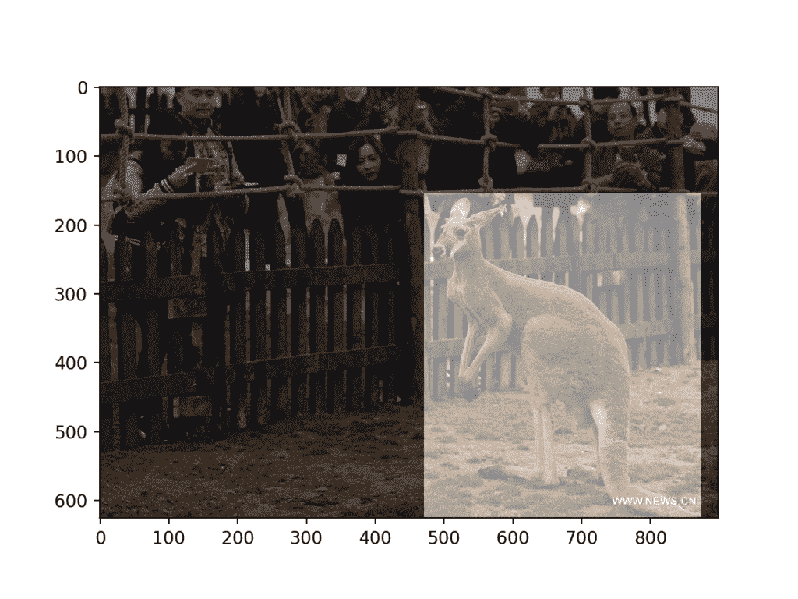
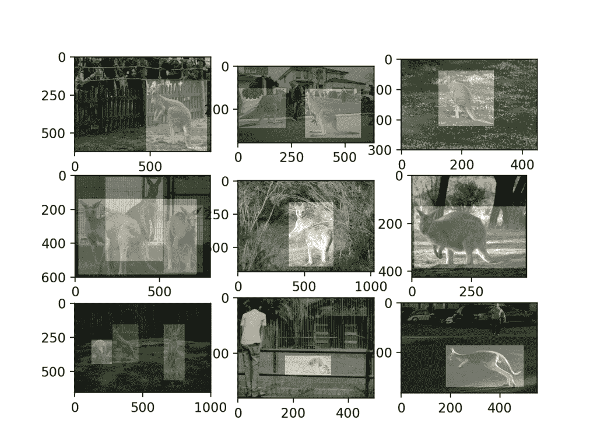
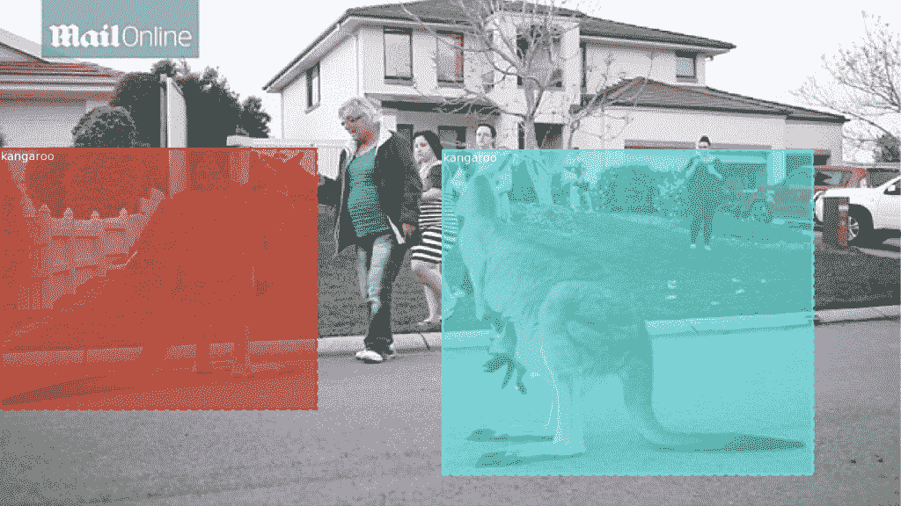
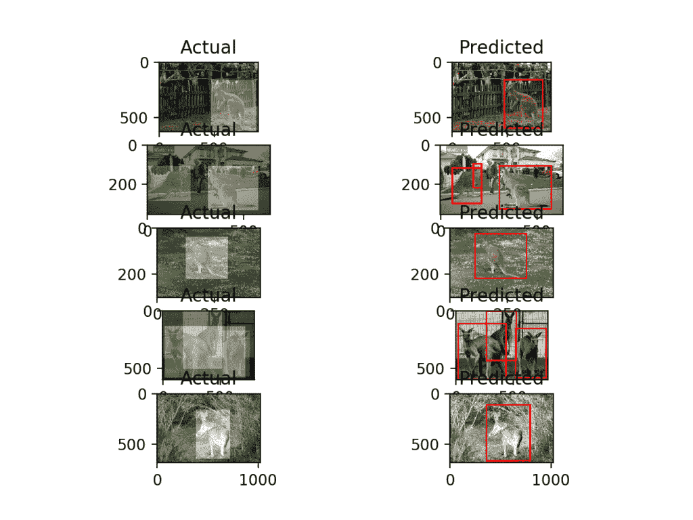
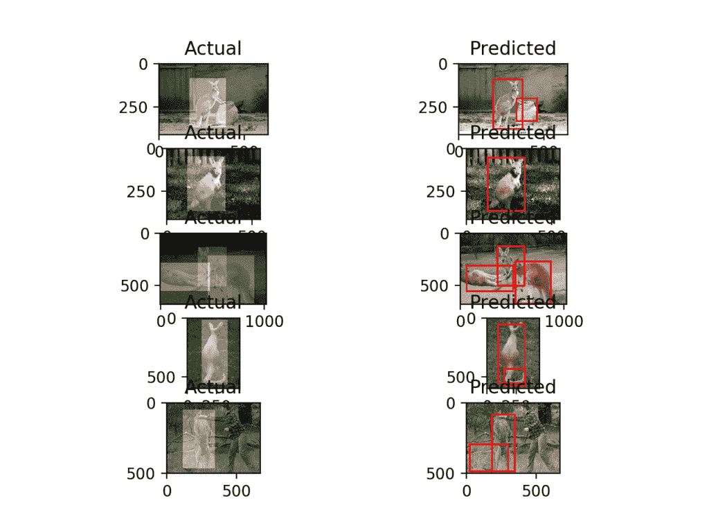

# 如何使用 Keras 训练对象检测模型

> 原文：<https://machinelearningmastery.com/how-to-train-an-object-detection-model-with-keras/>

最后更新于 2020 年 9 月 2 日

对象检测是一项具有挑战性的计算机视觉任务，包括预测目标在图像中的位置以及检测到的目标类型。

基于掩模区域的卷积神经网络模型是目标识别任务的最先进方法之一。Matterport Mask R-CNN 项目提供了一个库，允许您为自己的对象检测任务开发和训练 Mask R-CNN Keras 模型。对于初学者来说，使用该库可能很棘手，需要仔细准备数据集，尽管它允许通过转移学习进行快速训练，使用在具有挑战性的对象检测任务上训练的顶级模型，如 MS COCO。

在本教程中，您将发现如何为照片中的袋鼠对象检测开发一个 Mask R-CNN 模型。

完成本教程后，您将知道:

*   如何准备一个对象检测数据集，准备用 R-CNN 建模。
*   如何利用迁移学习在新的数据集上训练对象检测模型？
*   如何在测试数据集上评估拟合 Mask R-CNN 模型，并对新照片进行预测。

**用我的新书[计算机视觉深度学习](https://machinelearningmastery.com/deep-learning-for-computer-vision/)启动你的项目**，包括*分步教程*和所有示例的 *Python 源代码*文件。

我们开始吧。


如何训练对象检测模型在照片中找到袋鼠(R-CNN with Keras)
图片作者:[罗尼·罗伯逊](https://www.flickr.com/photos/16633132@N04/16146584567/)，版权所有。

## 教程概述

本教程分为五个部分；它们是:

1.  如何为 Keras 安装口罩
2.  如何准备用于对象检测的数据集
3.  如何训练一个用于袋鼠检测的掩蔽模型
4.  如何评估一个面具
5.  如何在新照片中检测袋鼠

**注**:本教程需要 TensorFlow 1 . 15 . 3 版和 Keras 2.2.4 版。它不适用于 TensorFlow 2.0+或 Keras 2.2.5+，因为在编写本文时，第三方库尚未更新。

您可以按如下方式安装这些特定版本的库:

```py
sudo pip install --no-deps tensorflow==1.15.3
sudo pip install --no-deps keras==2.2.4
```

## 如何为 Keras 安装口罩

对象检测是计算机视觉中的一项任务，包括识别给定图像中一个或多个目标的存在、位置和类型。

这是一个具有挑战性的问题，涉及建立在对象识别(例如，它们在哪里)、对象定位(例如，它们的范围是什么)和对象分类(例如，它们是什么)的方法之上。

基于区域的卷积神经网络，或称 R-CNN，是一个为对象检测而设计的卷积神经网络模型家族，由 [Ross Girshick](http://www.rossgirshick.info/) 等人开发。该方法可能有四种主要变体，导致了目前被称为 Mask R-CNN 的顶峰。在 2018 年发表的题为“ [Mask R-CNN](https://arxiv.org/abs/1703.06870) ”的论文中介绍的 Mask R-CNN 是该系列模型的最新变体，同时支持对象检测和对象分割。对象分割不仅包括定位图像中的对象，还为图像指定一个遮罩，精确指示图像中哪些像素属于该对象。

Mask R-CNN 是一个需要实现的复杂模型，尤其是与简单甚至最先进的深度卷积神经网络模型相比。我们可以使用建立在 Keras 深度学习框架之上的可靠的第三方实现，而不是从零开始开发 R-CNN 或 Mask R-CNN 模型的实现。

Mask R-CNN 最好的第三方实现是由[马特波特](https://matterport.com/)开发的 [Mask R-CNN 项目](https://github.com/matterport/Mask_RCNN)。该项目是在许可许可(例如麻省理工学院许可)下发布的开源项目，该代码已被广泛用于各种项目和卡格尔竞赛。

第一步是安装库。

在撰写本文时，该库没有分布式版本，所以我们必须手动安装。好消息是，这非常容易。

安装包括克隆 GitHub 存储库和在您的工作站上运行安装脚本。如果您遇到问题，请参阅藏在库的自述文件中的[安装说明](https://github.com/matterport/Mask_RCNN#installation)。

### 第一步。克隆面具

这就像从命令行运行以下命令一样简单:

```py
git clone https://github.com/matterport/Mask_RCNN.git
```

这将创建一个名为 *Mask_RCNN* 的新本地目录，如下所示:

```py
Mask_RCNN
├── assets
├── build
│   ├── bdist.macosx-10.13-x86_64
│   └── lib
│       └── mrcnn
├── dist
├── images
├── mask_rcnn.egg-info
├── mrcnn
└── samples
    ├── balloon
    ├── coco
    ├── nucleus
    └── shapes
```

### 第二步。安装屏蔽

该库可以通过 pip 直接安装。

将目录改为 *Mask_RCNN* 目录，运行安装脚本。

在命令行中，键入以下内容:

```py
cd Mask_RCNN
python setup.py install
```

在 Linux 或 MacOS 上，可能需要安装有 sudo 权限的软件；例如，您可能会看到如下错误:

```py
error: can't create or remove files in install directory
```

在这种情况下，使用 sudo 安装软件:

```py
sudo python setup.py install
```

如果您使用的是 Python 虚拟环境( [virtualenv](https://virtualenv.pypa.io/en/latest/) )，例如在 [EC2 深度学习 AMI 实例](https://aws.amazon.com/marketplace/pp/B077GF11NF)(本教程推荐)上，您可以按如下方式将 Mask_RCNN 安装到您的环境中:

```py
sudo ~/anaconda3/envs/tensorflow_p36/bin/python setup.py install
```

然后，该库将直接安装，您将看到许多成功安装的消息，以下列内容结尾:

```py
...
Finished processing dependencies for mask-rcnn==2.1
```

这确认您成功地安装了库，并且您拥有最新的版本，在撰写本文时是 2.1 版。

### 步骤 3:确认库已安装

确认库安装正确总是一个好主意。

您可以通过 pip 命令查询库来确认库安装正确；例如:

```py
pip show mask-rcnn
```

您应该会看到通知您版本和安装位置的输出；例如:

```py
Name: mask-rcnn
Version: 2.1
Summary: Mask R-CNN for object detection and instance segmentation
Home-page: https://github.com/matterport/Mask_RCNN
Author: Matterport
Author-email: waleed.abdulla@gmail.com
License: MIT
Location: ...
Requires:
Required-by:
```

我们现在可以使用图书馆了。

## 如何准备用于对象检测的数据集

接下来，我们需要一个数据集来建模。

在本教程中，我们将使用[Huynh Ngoc Anh](https://www.linkedin.com/in/ngoca)(experiencor)提供的[袋鼠数据集](https://github.com/experiencor/kangaroo)。数据集由包含袋鼠的 183 张照片和为每张照片中的袋鼠提供边界框的 XML 注释文件组成。

掩码 R-CNN 旨在学习预测对象的边界框以及检测到的对象的掩码，袋鼠数据集不提供掩码。因此，我们将使用数据集来学习袋鼠对象检测任务，并忽略遮罩，不关注模型的图像分割能力。

为了准备这个数据集进行建模，需要几个步骤，我们将在本节中依次完成每个步骤，包括下载数据集、解析注释文件、开发一个可由 *Mask_RCNN* 库使用的*kangaroodaset*对象，然后测试数据集对象以确认我们正确加载了图像和注释。

### 安装数据集

第一步是将数据集下载到您当前的工作目录中。

这可以通过直接克隆 GitHub 存储库来实现，如下所示:

```py
git clone https://github.com/experiencor/kangaroo.git
```

这将创建一个名为“*袋鼠*”的新目录，其中一个子目录名为“ *images/* ”，包含袋鼠的所有 JPEG 照片，另一个子目录名为“ *annotes/* ”，包含描述每张照片中袋鼠位置的所有 XML 文件。

```py
kangaroo
├── annots
└── images
```

在每个子目录中，您可以看到照片和注释文件使用一致的命名约定，文件名使用 5 位零填充的编号系统；例如:

```py
images/00001.jpg
images/00002.jpg
images/00003.jpg
...
annots/00001.xml
annots/00002.xml
annots/00003.xml
...
```

这使得将照片和注释文件匹配在一起变得非常容易。

我们还可以看到编号系统不是连续的，有一些照片丢失了，例如没有“*00007*”JPG 或者 XML。

这意味着我们应该集中精力加载目录中的实际文件列表，而不是使用编号系统。

### 解析注释文件

下一步是找出如何加载注释文件。

首先打开第一个标注文件( *annots/00001.xml* )看一下；你应该看到:

```py
<annotation>
	<folder>Kangaroo</folder>
	<filename>00001.jpg</filename>
	<path>...</path>
	<source>
		<database>Unknown</database>
	</source>
	<size>
		<width>450</width>
		<height>319</height>
		<depth>3</depth>
	</size>
	<segmented>0</segmented>
	<object>
		<name>kangaroo</name>
		<pose>Unspecified</pose>
		<truncated>0</truncated>
		<difficult>0</difficult>
		<bndbox>
			<xmin>233</xmin>
			<ymin>89</ymin>
			<xmax>386</xmax>
			<ymax>262</ymax>
		</bndbox>
	</object>
	<object>
		<name>kangaroo</name>
		<pose>Unspecified</pose>
		<truncated>0</truncated>
		<difficult>0</difficult>
		<bndbox>
			<xmin>134</xmin>
			<ymin>105</ymin>
			<xmax>341</xmax>
			<ymax>253</ymax>
		</bndbox>
	</object>
</annotation>
```

我们可以看到，注释文件包含一个描述照片形状的“*大小*”元素，以及一个或多个描述照片中袋鼠对象的边界框的“*对象*”元素。

大小和边界框是我们从每个注释文件中需要的最小信息。我们可以编写一些仔细的 XML 解析代码来处理这些注释文件，这对生产系统来说是个好主意。相反，我们将走捷径开发，使用 XPath 查询直接从每个文件中提取我们需要的数据，例如一个 *//size* 查询提取大小元素，一个*//对象*或一个 *//bndbox* 查询提取包围盒元素。

Python 提供了 [ElementTree API](https://docs.python.org/3/library/xml.etree.elementtree.html) ，可以用来加载和解析一个 XML 文件，我们可以使用 [find()](https://docs.python.org/3/library/xml.etree.elementtree.html#xml.etree.ElementTree.Element.find) 和 [findall()](https://docs.python.org/3/library/xml.etree.elementtree.html#xml.etree.ElementTree.Element.findall) 函数对加载的文档执行 XPath 查询。

首先，注释文件必须作为 *ElementTree* 对象加载和解析。

```py
# load and parse the file
tree = ElementTree.parse(filename)
```

加载后，我们可以检索文档的根元素，并从中执行 XPath 查询。

```py
# get the root of the document
root = tree.getroot()
```

我们可以使用 findall()函数查询“*”。//bndbox* '查找所有' *bndbox* 元素，然后枚举每个元素以提取定义每个边界框的 *x* 和 *y、*T8】min 和 *max* 值。

元素文本也可以解析为整数值。

```py
# extract each bounding box
for box in root.findall('.//bndbox'):
	xmin = int(box.find('xmin').text)
	ymin = int(box.find('ymin').text)
	xmax = int(box.find('xmax').text)
	ymax = int(box.find('ymax').text)
	coors = [xmin, ymin, xmax, ymax]
```

然后，我们可以将每个边界框的定义收集到一个列表中。

图像的尺寸也可能有帮助，可以直接查询。

```py
# extract image dimensions
width = int(root.find('.//size/width').text)
height = int(root.find('.//size/height').text)
```

我们可以将所有这些绑定到一个函数中，该函数将注释文件名作为参数，提取边界框和图像尺寸细节，并返回它们供使用。

下面的*extract _ box()*函数实现了这个行为。

```py
# function to extract bounding boxes from an annotation file
def extract_boxes(filename):
	# load and parse the file
	tree = ElementTree.parse(filename)
	# get the root of the document
	root = tree.getroot()
	# extract each bounding box
	boxes = list()
	for box in root.findall('.//bndbox'):
		xmin = int(box.find('xmin').text)
		ymin = int(box.find('ymin').text)
		xmax = int(box.find('xmax').text)
		ymax = int(box.find('ymax').text)
		coors = [xmin, ymin, xmax, ymax]
		boxes.append(coors)
	# extract image dimensions
	width = int(root.find('.//size/width').text)
	height = int(root.find('.//size/height').text)
	return boxes, width, height
```

我们可以在我们的注释文件上测试这个函数，例如，在目录中的第一个注释文件上。

下面列出了完整的示例。

```py
# example of extracting bounding boxes from an annotation file
from xml.etree import ElementTree

# function to extract bounding boxes from an annotation file
def extract_boxes(filename):
	# load and parse the file
	tree = ElementTree.parse(filename)
	# get the root of the document
	root = tree.getroot()
	# extract each bounding box
	boxes = list()
	for box in root.findall('.//bndbox'):
		xmin = int(box.find('xmin').text)
		ymin = int(box.find('ymin').text)
		xmax = int(box.find('xmax').text)
		ymax = int(box.find('ymax').text)
		coors = [xmin, ymin, xmax, ymax]
		boxes.append(coors)
	# extract image dimensions
	width = int(root.find('.//size/width').text)
	height = int(root.find('.//size/height').text)
	return boxes, width, height

# extract details form annotation file
boxes, w, h = extract_boxes('kangaroo/annots/00001.xml')
# summarize extracted details
print(boxes, w, h)
```

运行该示例会返回一个列表，其中包含注释文件中每个边界框的详细信息，以及照片宽度和高度的两个整数。

```py
[[233, 89, 386, 262], [134, 105, 341, 253]] 450 319
```

现在我们知道了如何加载注释文件，我们可以考虑使用这个功能来开发一个数据集对象。

### 开发袋鼠机器人对象

mask-rcnn 库要求训练、验证和测试数据集由 [mrcnn.utils.Dataset 对象](https://github.com/matterport/Mask_RCNN/blob/master/mrcnn/utils.py)管理。

这意味着必须定义一个新的类来扩展 *mrcnn.utils.Dataset* 类，并定义一个函数来加载数据集，使用您喜欢的任何名称，如 *load_dataset()* ，并覆盖两个函数，一个用于加载名为 *load_mask()* 的掩码，另一个用于加载名为 *image_reference()* 的图像引用(路径或 URL)。

```py
# class that defines and loads the kangaroo dataset
class KangarooDataset(Dataset):
	# load the dataset definitions
	def load_dataset(self, dataset_dir, is_train=True):
		# ...

	# load the masks for an image
	def load_mask(self, image_id):
		# ...

	# load an image reference
	def image_reference(self, image_id):
		# ...
```

要使用*数据集*对象，先实例化它，然后必须调用您的自定义加载函数，最后调用内置的 *prepare()* 函数。

例如，我们将创建一个名为*kangarodatasset*的新类，使用如下:

```py
# prepare the dataset
train_set = KangarooDataset()
train_set.load_dataset(...)
train_set.prepare()
```

自定义加载函数，例如 *load_dataset()* 负责定义类和定义数据集中的图像。

通过调用内置的 *add_class()* 函数并指定“*源*”(数据集的名称)、“ *class_id* 或类的整数(例如第一个类的 1 作为 0 保留给背景类)以及“ *class_name* ”(例如“*袋鼠*)来定义类。

```py
# define one class
self.add_class("dataset", 1, "kangaroo")
```

通过调用内置的 *add_image()* 函数并指定“*源*”(数据集的名称)、唯一的“ *image_id* ”(例如不带像“ *00001* ”这样的文件扩展名的文件名)以及可以加载图像的路径(例如“*袋鼠/images/00001.jpg* ”)来定义对象。

这将为图像定义一个“*图像信息*”字典，以后可以通过将图像添加到数据集的索引或顺序来检索该字典。您还可以指定将添加到图像信息字典中的其他参数，例如定义注释路径的“*注释*”。

```py
# add to dataset
self.add_image('dataset', image_id='00001', path='kangaroo/images/00001.jpg', annotation='kangaroo/annots/00001.xml')
```

例如，我们可以实现一个 *load_dataset()* 函数，该函数获取数据集目录的路径并加载数据集中的所有图像。

注意，测试显示图像编号“ *00090* ”存在问题，因此我们将从数据集中将其排除。

```py
# load the dataset definitions
def load_dataset(self, dataset_dir):
	# define one class
	self.add_class("dataset", 1, "kangaroo")
	# define data locations
	images_dir = dataset_dir + '/images/'
	annotations_dir = dataset_dir + '/annots/'
	# find all images
	for filename in listdir(images_dir):
		# extract image id
		image_id = filename[:-4]
		# skip bad images
		if image_id in ['00090']:
			continue
		img_path = images_dir + filename
		ann_path = annotations_dir + image_id + '.xml'
		# add to dataset
		self.add_image('dataset', image_id=image_id, path=img_path, annotation=ann_path)
```

我们可以更进一步，给函数增加一个参数来定义*数据集*实例是用于训练还是测试/验证。我们有大约 160 张照片，因此我们可以使用大约 20%或最后 32 张照片作为测试或验证数据集，使用前 131 张或 80%作为训练数据集。

这种划分可以使用文件名中的整数来进行，其中照片号 150 之前的所有照片都将被训练并等于或在 150 之后用于测试。更新后的 *load_dataset()* 支持训练和测试数据集，如下所示。

```py
# load the dataset definitions
def load_dataset(self, dataset_dir, is_train=True):
	# define one class
	self.add_class("dataset", 1, "kangaroo")
	# define data locations
	images_dir = dataset_dir + '/images/'
	annotations_dir = dataset_dir + '/annots/'
	# find all images
	for filename in listdir(images_dir):
		# extract image id
		image_id = filename[:-4]
		# skip bad images
		if image_id in ['00090']:
			continue
		# skip all images after 150 if we are building the train set
		if is_train and int(image_id) >= 150:
			continue
		# skip all images before 150 if we are building the test/val set
		if not is_train and int(image_id) < 150:
			continue
		img_path = images_dir + filename
		ann_path = annotations_dir + image_id + '.xml'
		# add to dataset
		self.add_image('dataset', image_id=image_id, path=img_path, annotation=ann_path)
```

接下来，我们需要定义 *load_mask()* 函数，为给定的“ *image_id* 加载蒙版。

在这种情况下，' *image_id* '是数据集中某个图像的整数索引，它是根据加载数据集时通过调用 *add_image()* 添加图像的顺序来分配的。该函数必须为与 *image_id* 关联的照片返回一个或多个遮罩的数组，以及每个遮罩的类别。

我们没有面具，但我们有边界框。我们可以为给定的照片加载边界框，并将它们作为蒙版返回。然后，该库将从我们的“*遮罩*”中推断边界框，这些遮罩将具有相同的大小。

首先，我们必须为 *image_id* 加载注释文件。这包括首先检索*图像 _id* 的“*图像信息*字典，然后检索我们通过先前调用 *add_image()* 为图像存储的注释路径。然后，我们可以使用前面部分开发的*extract _ box()*调用中的路径来获取边界框列表和图像的尺寸。

```py
# get details of image
info = self.image_info[image_id]
# define box file location
path = info['annotation']
# load XML
boxes, w, h = self.extract_boxes(path)
```

我们现在可以为每个边界框定义一个遮罩和一个关联的类。

蒙版是一个二维数组，其尺寸与照片相同，对象不在时所有值为零，对象在照片中时所有值为一。

我们可以通过创建一个 NumPy 数组来实现这一点，该数组对于已知大小的图像具有所有零值，对于每个边界框具有一个通道。

```py
# create one array for all masks, each on a different channel
masks = zeros([h, w, len(boxes)], dtype='uint8')
```

每个包围盒定义为盒的 *min* 和 *max* 、 *x* 和 *y* 坐标。

这些可以直接用于定义数组中的行和列范围，然后可以标记为 1。

```py
# create masks
for i in range(len(boxes)):
	box = boxes[i]
	row_s, row_e = box[1], box[3]
	col_s, col_e = box[0], box[2]
	masks[row_s:row_e, col_s:col_e, i] = 1
```

该数据集中的所有对象都具有相同的类。我们可以通过“*类名*”字典来检索类索引，然后将其添加到要与掩码一起返回的列表中。

```py
self.class_names.index('kangaroo')
```

将这些结合在一起，完整的 *load_mask()* 功能如下所示。

```py
# load the masks for an image
def load_mask(self, image_id):
	# get details of image
	info = self.image_info[image_id]
	# define box file location
	path = info['annotation']
	# load XML
	boxes, w, h = self.extract_boxes(path)
	# create one array for all masks, each on a different channel
	masks = zeros([h, w, len(boxes)], dtype='uint8')
	# create masks
	class_ids = list()
	for i in range(len(boxes)):
		box = boxes[i]
		row_s, row_e = box[1], box[3]
		col_s, col_e = box[0], box[2]
		masks[row_s:row_e, col_s:col_e, i] = 1
		class_ids.append(self.class_names.index('kangaroo'))
	return masks, asarray(class_ids, dtype='int32')
```

最后，我们必须实现 *image_reference()* 功能。

这个函数负责返回给定的“ *image_id* ”的路径或 URL，我们知道这只是“*image info*dict”上的“ *path* 属性。

```py
# load an image reference
def image_reference(self, image_id):
	info = self.image_info[image_id]
	return info['path']
```

就这样。我们已经为袋鼠数据集的*遮罩-rcnn* 库成功定义了*数据集*对象。

下面提供了该类的完整列表以及一个训练和测试数据集。

```py
# split into train and test set
from os import listdir
from xml.etree import ElementTree
from numpy import zeros
from numpy import asarray
from mrcnn.utils import Dataset

# class that defines and loads the kangaroo dataset
class KangarooDataset(Dataset):
	# load the dataset definitions
	def load_dataset(self, dataset_dir, is_train=True):
		# define one class
		self.add_class("dataset", 1, "kangaroo")
		# define data locations
		images_dir = dataset_dir + '/images/'
		annotations_dir = dataset_dir + '/annots/'
		# find all images
		for filename in listdir(images_dir):
			# extract image id
			image_id = filename[:-4]
			# skip bad images
			if image_id in ['00090']:
				continue
			# skip all images after 150 if we are building the train set
			if is_train and int(image_id) >= 150:
				continue
			# skip all images before 150 if we are building the test/val set
			if not is_train and int(image_id) < 150:
				continue
			img_path = images_dir + filename
			ann_path = annotations_dir + image_id + '.xml'
			# add to dataset
			self.add_image('dataset', image_id=image_id, path=img_path, annotation=ann_path)

	# extract bounding boxes from an annotation file
	def extract_boxes(self, filename):
		# load and parse the file
		tree = ElementTree.parse(filename)
		# get the root of the document
		root = tree.getroot()
		# extract each bounding box
		boxes = list()
		for box in root.findall('.//bndbox'):
			xmin = int(box.find('xmin').text)
			ymin = int(box.find('ymin').text)
			xmax = int(box.find('xmax').text)
			ymax = int(box.find('ymax').text)
			coors = [xmin, ymin, xmax, ymax]
			boxes.append(coors)
		# extract image dimensions
		width = int(root.find('.//size/width').text)
		height = int(root.find('.//size/height').text)
		return boxes, width, height

	# load the masks for an image
	def load_mask(self, image_id):
		# get details of image
		info = self.image_info[image_id]
		# define box file location
		path = info['annotation']
		# load XML
		boxes, w, h = self.extract_boxes(path)
		# create one array for all masks, each on a different channel
		masks = zeros([h, w, len(boxes)], dtype='uint8')
		# create masks
		class_ids = list()
		for i in range(len(boxes)):
			box = boxes[i]
			row_s, row_e = box[1], box[3]
			col_s, col_e = box[0], box[2]
			masks[row_s:row_e, col_s:col_e, i] = 1
			class_ids.append(self.class_names.index('kangaroo'))
		return masks, asarray(class_ids, dtype='int32')

	# load an image reference
	def image_reference(self, image_id):
		info = self.image_info[image_id]
		return info['path']

# train set
train_set = KangarooDataset()
train_set.load_dataset('kangaroo', is_train=True)
train_set.prepare()
print('Train: %d' % len(train_set.image_ids))

# test/val set
test_set = KangarooDataset()
test_set.load_dataset('kangaroo', is_train=False)
test_set.prepare()
print('Test: %d' % len(test_set.image_ids))
```

运行该示例成功加载和准备了列车和测试数据集，并打印了每个数据集的图像数。

```py
Train: 131
Test: 32
```

现在我们已经定义了数据集，让我们确认图像、遮罩和边界框处理正确。

### 测试袋鼠对象

第一个有用的测试是确认图像和遮罩可以正确加载。

我们可以通过使用 *image_id* 调用 *load_image()* 函数来创建数据集并加载图像，然后使用相同的 *image_id* 调用 *load_mask()* 函数来加载图像的遮罩。

```py
# load an image
image_id = 0
image = train_set.load_image(image_id)
print(image.shape)
# load image mask
mask, class_ids = train_set.load_mask(image_id)
print(mask.shape)
```

接下来，我们可以使用 Matplotlib API 绘制照片，然后在顶部绘制带有 alpha 值的第一个蒙版，这样下面的照片仍然可以看到

```py
# plot image
pyplot.imshow(image)
# plot mask
pyplot.imshow(mask[:, :, 0], cmap='gray', alpha=0.5)
pyplot.show()
```

下面列出了完整的示例。

```py
# plot one photograph and mask
from os import listdir
from xml.etree import ElementTree
from numpy import zeros
from numpy import asarray
from mrcnn.utils import Dataset
from matplotlib import pyplot

# class that defines and loads the kangaroo dataset
class KangarooDataset(Dataset):
	# load the dataset definitions
	def load_dataset(self, dataset_dir, is_train=True):
		# define one class
		self.add_class("dataset", 1, "kangaroo")
		# define data locations
		images_dir = dataset_dir + '/images/'
		annotations_dir = dataset_dir + '/annots/'
		# find all images
		for filename in listdir(images_dir):
			# extract image id
			image_id = filename[:-4]
			# skip bad images
			if image_id in ['00090']:
				continue
			# skip all images after 150 if we are building the train set
			if is_train and int(image_id) >= 150:
				continue
			# skip all images before 150 if we are building the test/val set
			if not is_train and int(image_id) < 150:
				continue
			img_path = images_dir + filename
			ann_path = annotations_dir + image_id + '.xml'
			# add to dataset
			self.add_image('dataset', image_id=image_id, path=img_path, annotation=ann_path)

	# extract bounding boxes from an annotation file
	def extract_boxes(self, filename):
		# load and parse the file
		tree = ElementTree.parse(filename)
		# get the root of the document
		root = tree.getroot()
		# extract each bounding box
		boxes = list()
		for box in root.findall('.//bndbox'):
			xmin = int(box.find('xmin').text)
			ymin = int(box.find('ymin').text)
			xmax = int(box.find('xmax').text)
			ymax = int(box.find('ymax').text)
			coors = [xmin, ymin, xmax, ymax]
			boxes.append(coors)
		# extract image dimensions
		width = int(root.find('.//size/width').text)
		height = int(root.find('.//size/height').text)
		return boxes, width, height

	# load the masks for an image
	def load_mask(self, image_id):
		# get details of image
		info = self.image_info[image_id]
		# define box file location
		path = info['annotation']
		# load XML
		boxes, w, h = self.extract_boxes(path)
		# create one array for all masks, each on a different channel
		masks = zeros([h, w, len(boxes)], dtype='uint8')
		# create masks
		class_ids = list()
		for i in range(len(boxes)):
			box = boxes[i]
			row_s, row_e = box[1], box[3]
			col_s, col_e = box[0], box[2]
			masks[row_s:row_e, col_s:col_e, i] = 1
			class_ids.append(self.class_names.index('kangaroo'))
		return masks, asarray(class_ids, dtype='int32')

	# load an image reference
	def image_reference(self, image_id):
		info = self.image_info[image_id]
		return info['path']

# train set
train_set = KangarooDataset()
train_set.load_dataset('kangaroo', is_train=True)
train_set.prepare()
# load an image
image_id = 0
image = train_set.load_image(image_id)
print(image.shape)
# load image mask
mask, class_ids = train_set.load_mask(image_id)
print(mask.shape)
# plot image
pyplot.imshow(image)
# plot mask
pyplot.imshow(mask[:, :, 0], cmap='gray', alpha=0.5)
pyplot.show()
```

运行该示例首先打印照片的形状并屏蔽 NumPy 数组。

我们可以确认两个阵列的宽度和高度相同，只是通道数量不同。我们还可以看到，这种情况下的第一张照片(例如 *image_id=0* )只有一个蒙版。

```py
(626, 899, 3)
(626, 899, 1)
```

在第一个蒙版被覆盖的情况下，照片的情节也被创建。

在这种情况下，我们可以看到照片中有一只袋鼠，面具正确地限制了袋鼠。



覆盖对象检测面具的袋鼠照片

我们可以对数据集中的前九张照片重复这一过程，将一幅图中的每张照片绘制为一个子图，并为每张照片绘制所有遮罩。

```py
# plot first few images
for i in range(9):
	# define subplot
	pyplot.subplot(330 + 1 + i)
	# plot raw pixel data
	image = train_set.load_image(i)
	pyplot.imshow(image)
	# plot all masks
	mask, _ = train_set.load_mask(i)
	for j in range(mask.shape[2]):
		pyplot.imshow(mask[:, :, j], cmap='gray', alpha=0.3)
# show the figure
pyplot.show()
```

运行该示例表明照片加载正确，并且那些具有多个对象的照片正确定义了单独的遮罩。



带有对象检测遮罩的训练数据集中袋鼠前九张照片的绘图

另一个有用的调试步骤可能是加载数据集中所有的“*图像信息*”对象，并将它们打印到控制台。

这有助于确认对 *load_dataset()* 函数中的 *add_image()* 函数的所有调用都按预期工作。

```py
# enumerate all images in the dataset
for image_id in train_set.image_ids:
	# load image info
	info = train_set.image_info[image_id]
	# display on the console
	print(info)
```

在加载的训练数据集上运行该代码将显示所有的“*图像信息*”字典，显示数据集中每个图像的路径和 id。

```py
{'id': '00132', 'source': 'dataset', 'path': 'kangaroo/images/00132.jpg', 'annotation': 'kangaroo/annots/00132.xml'}
{'id': '00046', 'source': 'dataset', 'path': 'kangaroo/images/00046.jpg', 'annotation': 'kangaroo/annots/00046.xml'}
{'id': '00052', 'source': 'dataset', 'path': 'kangaroo/images/00052.jpg', 'annotation': 'kangaroo/annots/00052.xml'}
...
```

最后，*蒙版-rcnn* 库提供了显示图像和蒙版的实用程序。我们可以使用其中一些内置函数来确认数据集是否正常运行。

例如，*蒙版-rcnn* 库提供了*MRC nn . visualize . display _ instances()*功能，该功能将显示带有边界框、蒙版和类别标签的照片。这要求通过*提取 _ bbox()*功能从遮罩中提取边界框。

```py
# define image id
image_id = 1
# load the image
image = train_set.load_image(image_id)
# load the masks and the class ids
mask, class_ids = train_set.load_mask(image_id)
# extract bounding boxes from the masks
bbox = extract_bboxes(mask)
# display image with masks and bounding boxes
display_instances(image, bbox, mask, class_ids, train_set.class_names)
```

为了完整起见，下面提供了完整的代码列表。

```py
# display image with masks and bounding boxes
from os import listdir
from xml.etree import ElementTree
from numpy import zeros
from numpy import asarray
from mrcnn.utils import Dataset
from mrcnn.visualize import display_instances
from mrcnn.utils import extract_bboxes

# class that defines and loads the kangaroo dataset
class KangarooDataset(Dataset):
	# load the dataset definitions
	def load_dataset(self, dataset_dir, is_train=True):
		# define one class
		self.add_class("dataset", 1, "kangaroo")
		# define data locations
		images_dir = dataset_dir + '/images/'
		annotations_dir = dataset_dir + '/annots/'
		# find all images
		for filename in listdir(images_dir):
			# extract image id
			image_id = filename[:-4]
			# skip bad images
			if image_id in ['00090']:
				continue
			# skip all images after 150 if we are building the train set
			if is_train and int(image_id) >= 150:
				continue
			# skip all images before 150 if we are building the test/val set
			if not is_train and int(image_id) < 150:
				continue
			img_path = images_dir + filename
			ann_path = annotations_dir + image_id + '.xml'
			# add to dataset
			self.add_image('dataset', image_id=image_id, path=img_path, annotation=ann_path)

	# extract bounding boxes from an annotation file
	def extract_boxes(self, filename):
		# load and parse the file
		tree = ElementTree.parse(filename)
		# get the root of the document
		root = tree.getroot()
		# extract each bounding box
		boxes = list()
		for box in root.findall('.//bndbox'):
			xmin = int(box.find('xmin').text)
			ymin = int(box.find('ymin').text)
			xmax = int(box.find('xmax').text)
			ymax = int(box.find('ymax').text)
			coors = [xmin, ymin, xmax, ymax]
			boxes.append(coors)
		# extract image dimensions
		width = int(root.find('.//size/width').text)
		height = int(root.find('.//size/height').text)
		return boxes, width, height

	# load the masks for an image
	def load_mask(self, image_id):
		# get details of image
		info = self.image_info[image_id]
		# define box file location
		path = info['annotation']
		# load XML
		boxes, w, h = self.extract_boxes(path)
		# create one array for all masks, each on a different channel
		masks = zeros([h, w, len(boxes)], dtype='uint8')
		# create masks
		class_ids = list()
		for i in range(len(boxes)):
			box = boxes[i]
			row_s, row_e = box[1], box[3]
			col_s, col_e = box[0], box[2]
			masks[row_s:row_e, col_s:col_e, i] = 1
			class_ids.append(self.class_names.index('kangaroo'))
		return masks, asarray(class_ids, dtype='int32')

	# load an image reference
	def image_reference(self, image_id):
		info = self.image_info[image_id]
		return info['path']

# train set
train_set = KangarooDataset()
train_set.load_dataset('kangaroo', is_train=True)
train_set.prepare()
# define image id
image_id = 1
# load the image
image = train_set.load_image(image_id)
# load the masks and the class ids
mask, class_ids = train_set.load_mask(image_id)
# extract bounding boxes from the masks
bbox = extract_bboxes(mask)
# display image with masks and bounding boxes
display_instances(image, bbox, mask, class_ids, train_set.class_names)
```

运行该示例会创建一个绘图，用单独的颜色显示带有每个对象的遮罩的照片。

根据设计，边界框与遮罩完全匹配，并以虚线轮廓显示。最后，每个对象都标有类标签，在本例中是“*袋鼠*”。



显示对象检测遮罩、边界框和类别标签的照片

现在我们确信我们的数据集被正确加载，我们可以使用它来拟合一个遮罩模型。

## 如何训练用于袋鼠检测的掩码 R-CNN 模型

Mask R-CNN 模型可以从零开始拟合，尽管像其他计算机视觉应用程序一样，使用迁移学习可以节省时间并提高表现。

预拟合在 MS COCO 对象检测数据集上的 Mask R-CNN 模型可以用作起点，然后根据特定数据集进行定制，在这种情况下是袋鼠数据集。

第一步是下载预拟合 Mask R-CNN 模型的模型文件(架构和权重)。权重可从 GitHub 项目获得，文件约为 250 兆字节。

将模型权重下载到当前工作目录中名为“ *mask_rcnn_coco.h5* 的文件中。

*   [下载权重(mask_rcnn_coco.h5) 246M](https://github.com/matterport/Mask_RCNN/releases/download/v2.0/mask_rcnn_coco.h5)

接下来，必须定义模型的配置对象。

这是一个新的类，扩展了 *mrcnn.config.Config* 类，定义了预测问题的属性(如类的名称和数量)和训练模型的算法(如学习率)。

配置必须通过“*名称*”属性定义配置名称，例如“*袋鼠 _cfg* ”，该属性将用于在运行期间将细节和模型保存到文件中。配置还必须通过“ *NUM_CLASSES* ”属性定义预测问题中的类的数量。在这种情况下，我们只有一个袋鼠的对象类型，尽管背景总是有一个额外的类。

最后，我们必须定义每个训练时期使用的样本(照片)数量。这将是训练数据集中的照片数量，在本例中为 131 张。

将这些联系在一起，我们的自定义*类定义如下。*

```py
# define a configuration for the model
class KangarooConfig(Config):
	# Give the configuration a recognizable name
	NAME = "kangaroo_cfg"
	# Number of classes (background + kangaroo)
	NUM_CLASSES = 1 + 1
	# Number of training steps per epoch
	STEPS_PER_EPOCH = 131

# prepare config
config = KangarooConfig()
```

接下来，我们可以定义我们的模型。

这是通过创建一个 *mrcnn.model.MaskRCNN* 类的实例，并通过将“*模式*参数设置为“*训练*来指定用于训练的模型来实现的。

“*配置*参数也必须用我们的*袋鼠配置*类的实例来指定。

最后，需要一个目录来保存配置文件，并在每个时期结束时保存检查点模型。我们将使用当前的工作目录。

```py
# define the model
model = MaskRCNN(mode='training', model_dir='./', config=config)
```

接下来，可以加载预定义的模型架构和权重。这可以通过在模型上调用 *load_weights()* 函数并指定下载的“ *mask_rcnn_coco.h5* 文件的路径来实现。

该模型将按原样使用，尽管特定于类的输出层将被移除，以便可以定义和训练新的输出层。这可以通过指定“ *exclude* ”参数并列出模型加载后要排除或移除的所有输出层来实现。这包括分类标签、边界框和遮罩的输出层。

```py
# load weights (mscoco)
model.load_weights('mask_rcnn_coco.h5', by_name=True, exclude=["mrcnn_class_logits", "mrcnn_bbox_fc",  "mrcnn_bbox", "mrcnn_mask"])
```

接下来，可以通过调用 *train()* 函数并传入训练数据集和验证数据集来将模型拟合到训练数据集上。我们还可以在配置中将学习率指定为默认学习率(0.001)。

我们还可以指定要训练哪些层。在这种情况下，我们将只训练头部，也就是模型的输出层。

```py
# train weights (output layers or 'heads')
model.train(train_set, test_set, learning_rate=config.LEARNING_RATE, epochs=5, layers='heads')
```

我们可以在这个训练的基础上进一步调整模型中的所有权重。这可以通过使用较小的学习率并将“层”参数从“头”更改为“全部”来实现。

下面列出了在袋鼠数据集上训练面罩的完整示例。

这可能需要一些时间在中央处理器上执行，即使使用现代硬件。我建议用 GPU 运行代码，比如在[亚马逊 EC2](https://machinelearningmastery.com/develop-evaluate-large-deep-learning-models-keras-amazon-web-services/) 上运行，在 P3 类型的硬件上大约五分钟就能完成。

```py
# fit a mask rcnn on the kangaroo dataset
from os import listdir
from xml.etree import ElementTree
from numpy import zeros
from numpy import asarray
from mrcnn.utils import Dataset
from mrcnn.config import Config
from mrcnn.model import MaskRCNN

# class that defines and loads the kangaroo dataset
class KangarooDataset(Dataset):
	# load the dataset definitions
	def load_dataset(self, dataset_dir, is_train=True):
		# define one class
		self.add_class("dataset", 1, "kangaroo")
		# define data locations
		images_dir = dataset_dir + '/images/'
		annotations_dir = dataset_dir + '/annots/'
		# find all images
		for filename in listdir(images_dir):
			# extract image id
			image_id = filename[:-4]
			# skip bad images
			if image_id in ['00090']:
				continue
			# skip all images after 150 if we are building the train set
			if is_train and int(image_id) >= 150:
				continue
			# skip all images before 150 if we are building the test/val set
			if not is_train and int(image_id) < 150:
				continue
			img_path = images_dir + filename
			ann_path = annotations_dir + image_id + '.xml'
			# add to dataset
			self.add_image('dataset', image_id=image_id, path=img_path, annotation=ann_path)

	# extract bounding boxes from an annotation file
	def extract_boxes(self, filename):
		# load and parse the file
		tree = ElementTree.parse(filename)
		# get the root of the document
		root = tree.getroot()
		# extract each bounding box
		boxes = list()
		for box in root.findall('.//bndbox'):
			xmin = int(box.find('xmin').text)
			ymin = int(box.find('ymin').text)
			xmax = int(box.find('xmax').text)
			ymax = int(box.find('ymax').text)
			coors = [xmin, ymin, xmax, ymax]
			boxes.append(coors)
		# extract image dimensions
		width = int(root.find('.//size/width').text)
		height = int(root.find('.//size/height').text)
		return boxes, width, height

	# load the masks for an image
	def load_mask(self, image_id):
		# get details of image
		info = self.image_info[image_id]
		# define box file location
		path = info['annotation']
		# load XML
		boxes, w, h = self.extract_boxes(path)
		# create one array for all masks, each on a different channel
		masks = zeros([h, w, len(boxes)], dtype='uint8')
		# create masks
		class_ids = list()
		for i in range(len(boxes)):
			box = boxes[i]
			row_s, row_e = box[1], box[3]
			col_s, col_e = box[0], box[2]
			masks[row_s:row_e, col_s:col_e, i] = 1
			class_ids.append(self.class_names.index('kangaroo'))
		return masks, asarray(class_ids, dtype='int32')

	# load an image reference
	def image_reference(self, image_id):
		info = self.image_info[image_id]
		return info['path']

# define a configuration for the model
class KangarooConfig(Config):
	# define the name of the configuration
	NAME = "kangaroo_cfg"
	# number of classes (background + kangaroo)
	NUM_CLASSES = 1 + 1
	# number of training steps per epoch
	STEPS_PER_EPOCH = 131

# prepare train set
train_set = KangarooDataset()
train_set.load_dataset('kangaroo', is_train=True)
train_set.prepare()
print('Train: %d' % len(train_set.image_ids))
# prepare test/val set
test_set = KangarooDataset()
test_set.load_dataset('kangaroo', is_train=False)
test_set.prepare()
print('Test: %d' % len(test_set.image_ids))
# prepare config
config = KangarooConfig()
config.display()
# define the model
model = MaskRCNN(mode='training', model_dir='./', config=config)
# load weights (mscoco) and exclude the output layers
model.load_weights('mask_rcnn_coco.h5', by_name=True, exclude=["mrcnn_class_logits", "mrcnn_bbox_fc",  "mrcnn_bbox", "mrcnn_mask"])
# train weights (output layers or 'heads')
model.train(train_set, test_set, learning_rate=config.LEARNING_RATE, epochs=5, layers='heads')
```

运行该示例将使用标准的 Keras 进度条报告进度。

**注**:考虑到算法或评估程序的随机性，或数值准确率的差异，您的[结果可能会有所不同](https://machinelearningmastery.com/different-results-each-time-in-machine-learning/)。考虑运行该示例几次，并比较平均结果。

我们可以看到，对于网络的每个输出头，报告了许多不同的训练和测试损失分数。注意哪一项损失可能会很令人困惑。

在这个我们感兴趣的对象检测而不是对象分割的例子中，我建议关注训练和验证数据集上分类输出的损失(例如 *mrcnn_class_loss* 和 *val_mrcnn_class_loss* ，以及训练和验证数据集的包围盒输出的损失( *mrcnn_bbox_loss* 和 *val_mrcnn_bbox_loss* )。

```py
Epoch 1/5
131/131 [==============================] - 106s 811ms/step - loss: 0.8491 - rpn_class_loss: 0.0044 - rpn_bbox_loss: 0.1452 - mrcnn_class_loss: 0.0420 - mrcnn_bbox_loss: 0.2874 - mrcnn_mask_loss: 0.3701 - val_loss: 1.3402 - val_rpn_class_loss: 0.0160 - val_rpn_bbox_loss: 0.7913 - val_mrcnn_class_loss: 0.0092 - val_mrcnn_bbox_loss: 0.2263 - val_mrcnn_mask_loss: 0.2975
Epoch 2/5
131/131 [==============================] - 69s 526ms/step - loss: 0.4774 - rpn_class_loss: 0.0025 - rpn_bbox_loss: 0.1159 - mrcnn_class_loss: 0.0170 - mrcnn_bbox_loss: 0.1134 - mrcnn_mask_loss: 0.2285 - val_loss: 0.6261 - val_rpn_class_loss: 8.9502e-04 - val_rpn_bbox_loss: 0.1624 - val_mrcnn_class_loss: 0.0197 - val_mrcnn_bbox_loss: 0.2148 - val_mrcnn_mask_loss: 0.2282
Epoch 3/5
131/131 [==============================] - 67s 515ms/step - loss: 0.4471 - rpn_class_loss: 0.0029 - rpn_bbox_loss: 0.1153 - mrcnn_class_loss: 0.0234 - mrcnn_bbox_loss: 0.0958 - mrcnn_mask_loss: 0.2097 - val_loss: 1.2998 - val_rpn_class_loss: 0.0144 - val_rpn_bbox_loss: 0.6712 - val_mrcnn_class_loss: 0.0372 - val_mrcnn_bbox_loss: 0.2645 - val_mrcnn_mask_loss: 0.3125
Epoch 4/5
131/131 [==============================] - 66s 502ms/step - loss: 0.3934 - rpn_class_loss: 0.0026 - rpn_bbox_loss: 0.1003 - mrcnn_class_loss: 0.0171 - mrcnn_bbox_loss: 0.0806 - mrcnn_mask_loss: 0.1928 - val_loss: 0.6709 - val_rpn_class_loss: 0.0016 - val_rpn_bbox_loss: 0.2012 - val_mrcnn_class_loss: 0.0244 - val_mrcnn_bbox_loss: 0.1942 - val_mrcnn_mask_loss: 0.2495
Epoch 5/5
131/131 [==============================] - 65s 493ms/step - loss: 0.3357 - rpn_class_loss: 0.0024 - rpn_bbox_loss: 0.0804 - mrcnn_class_loss: 0.0193 - mrcnn_bbox_loss: 0.0616 - mrcnn_mask_loss: 0.1721 - val_loss: 0.8878 - val_rpn_class_loss: 0.0030 - val_rpn_bbox_loss: 0.4409 - val_mrcnn_class_loss: 0.0174 - val_mrcnn_bbox_loss: 0.1752 - val_mrcnn_mask_loss: 0.2513
```

模型文件在每个纪元结束时创建并保存在一个子目录中，该子目录以“*袋鼠 _cfg* 开头，后跟随机字符。

必须选择要使用的模型；在这种情况下，每个时期的边界框的损失继续减少，因此我们将在运行结束时使用最终模型(' T0 ' mask _ rcnn _ 袋鼠 _cfg_0005.h5 ')。

将模型文件从配置目录复制到当前工作目录中。我们将在下面的部分中使用它来评估模型并进行预测。

结果表明，也许更多的训练时期可能是有用的，也许微调模型中的所有层；这可能会对教程进行有趣的扩展。

接下来，让我们看看如何评估这个模型的表现。

## 如何评估一个面具

对象识别任务的模型表现通常使用平均绝对准确率(mAP)来评估。

我们正在预测边界框，因此我们可以根据预测的边界框和实际边界框重叠的程度来确定边界框预测是否良好。这可以通过将重叠区域除以两个边界框的总面积来计算，或者将交集除以并集来计算，称为并集上的“*交集*”或 IoU。完美的边界框预测的 IoU 为 1。

如果 IoU 大于 0.5，则假设边界框为正预测是标准的，例如，它们重叠 50%或更多。

准确率是指所有预测的边界框中正确预测的边界框的百分比(IoU > 0.5)。回忆是照片中所有对象中正确预测的边界框的百分比(IoU > 0.5)。

随着我们做出更多的预测，召回率将会增加，但随着我们开始做出假阳性预测，精确度将会下降或变得不稳定。召回( *x* )可以相对于每一个预测数的准确率( *y* )来绘制，以创建曲线或直线。我们可以最大化这条线上每个点的值，并为每个召回值计算准确率或 AP 的平均值。

**注**:AP 的计算方式存在差异，例如广泛使用的 PASCAL VOC 数据集和 MS COCO 数据集的计算方式不同。

数据集中所有图像的平均准确率(AP)的平均值或平均值称为平均准确率(mAP)。

mask-rcnn 库提供了一个 *mrcnn.utils.compute_ap* 来计算给定图像的 ap 和其他度量。这些应用程序分数可以在整个数据集上收集，并计算平均值，以了解该模型在检测数据集中的对象方面有多好。

首先，我们必须定义一个新的*配置*对象来进行预测，而不是训练。我们可以扩展我们之前定义的*袋鼠配置*来重用参数。相反，我们将定义一个具有相同值的新对象，以保持代码紧凑。配置必须改变使用图形处理器进行推理的一些默认值，这些默认值不同于为训练模型而设置的默认值(无论您是在图形处理器上运行还是在中央处理器上运行)。

```py
# define the prediction configuration
class PredictionConfig(Config):
	# define the name of the configuration
	NAME = "kangaroo_cfg"
	# number of classes (background + kangaroo)
	NUM_CLASSES = 1 + 1
	# simplify GPU config
	GPU_COUNT = 1
	IMAGES_PER_GPU = 1
```

接下来，我们可以使用配置定义模型，并将“*模式*”参数设置为“*推理*，而不是“*训练*”。

```py
# create config
cfg = PredictionConfig()
# define the model
model = MaskRCNN(mode='inference', model_dir='./', config=cfg)
```

接下来，我们可以从保存的模型中加载权重。

我们可以通过指定模型文件的路径来做到这一点。在这种情况下，模型文件在当前工作目录中是'*mask _ rcnn _ 袋鼠 _cfg_0005.h5* '。

```py
# load model weights
model.load_weights('mask_rcnn_kangaroo_cfg_0005.h5', by_name=True)
```

接下来，我们可以对模型进行评估。这包括枚举数据集中的图像，进行预测，并在预测所有图像的平均 AP 之前计算预测的 AP。

首先，对于给定的*图像 _id* ，可以从数据集中加载图像和地面真实遮罩。这可以通过 *load_image_gt()* 便利功能来实现。

```py
# load image, bounding boxes and masks for the image id
image, image_meta, gt_class_id, gt_bbox, gt_mask = load_image_gt(dataset, cfg, image_id, use_mini_mask=False)
```

接下来，加载图像的像素值必须以与训练数据相同的方式进行缩放，例如居中。这可以使用 *mold_image()* 便利功能来实现。

```py
# convert pixel values (e.g. center)
scaled_image = mold_image(image, cfg)
```

然后需要将图像的维度在数据集中扩展一个样本，并将其用作模型预测的输入。

```py
sample = expand_dims(scaled_image, 0)
# make prediction
yhat = model.detect(sample, verbose=0)
# extract results for first sample
r = yhat[0]
```

接下来，可以将预测与使用 *compute_ap()* 函数计算的地面事实和度量进行比较。

```py
# calculate statistics, including AP
AP, _, _, _ = compute_ap(gt_bbox, gt_class_id, gt_mask, r["rois"], r["class_ids"], r["scores"], r['masks'])
```

可以将 AP 值添加到列表中，然后计算平均值。

将这些联系在一起，下面的 *evaluate_model()* 函数实现了这一点，并计算给定数据集、模型和配置的 mAP。

```py
# calculate the mAP for a model on a given dataset
def evaluate_model(dataset, model, cfg):
	APs = list()
	for image_id in dataset.image_ids:
		# load image, bounding boxes and masks for the image id
		image, image_meta, gt_class_id, gt_bbox, gt_mask = load_image_gt(dataset, cfg, image_id, use_mini_mask=False)
		# convert pixel values (e.g. center)
		scaled_image = mold_image(image, cfg)
		# convert image into one sample
		sample = expand_dims(scaled_image, 0)
		# make prediction
		yhat = model.detect(sample, verbose=0)
		# extract results for first sample
		r = yhat[0]
		# calculate statistics, including AP
		AP, _, _, _ = compute_ap(gt_bbox, gt_class_id, gt_mask, r["rois"], r["class_ids"], r["scores"], r['masks'])
		# store
		APs.append(AP)
	# calculate the mean AP across all images
	mAP = mean(APs)
	return mAP
```

我们现在可以在训练和测试数据集上计算模型的 mAP。

```py
# evaluate model on training dataset
train_mAP = evaluate_model(train_set, model, cfg)
print("Train mAP: %.3f" % train_mAP)
# evaluate model on test dataset
test_mAP = evaluate_model(test_set, model, cfg)
print("Test mAP: %.3f" % test_mAP)
```

为了完整起见，下面提供了完整的代码列表。

```py
# evaluate the mask rcnn model on the kangaroo dataset
from os import listdir
from xml.etree import ElementTree
from numpy import zeros
from numpy import asarray
from numpy import expand_dims
from numpy import mean
from mrcnn.config import Config
from mrcnn.model import MaskRCNN
from mrcnn.utils import Dataset
from mrcnn.utils import compute_ap
from mrcnn.model import load_image_gt
from mrcnn.model import mold_image

# class that defines and loads the kangaroo dataset
class KangarooDataset(Dataset):
	# load the dataset definitions
	def load_dataset(self, dataset_dir, is_train=True):
		# define one class
		self.add_class("dataset", 1, "kangaroo")
		# define data locations
		images_dir = dataset_dir + '/images/'
		annotations_dir = dataset_dir + '/annots/'
		# find all images
		for filename in listdir(images_dir):
			# extract image id
			image_id = filename[:-4]
			# skip bad images
			if image_id in ['00090']:
				continue
			# skip all images after 150 if we are building the train set
			if is_train and int(image_id) >= 150:
				continue
			# skip all images before 150 if we are building the test/val set
			if not is_train and int(image_id) < 150:
				continue
			img_path = images_dir + filename
			ann_path = annotations_dir + image_id + '.xml'
			# add to dataset
			self.add_image('dataset', image_id=image_id, path=img_path, annotation=ann_path)

	# extract bounding boxes from an annotation file
	def extract_boxes(self, filename):
		# load and parse the file
		tree = ElementTree.parse(filename)
		# get the root of the document
		root = tree.getroot()
		# extract each bounding box
		boxes = list()
		for box in root.findall('.//bndbox'):
			xmin = int(box.find('xmin').text)
			ymin = int(box.find('ymin').text)
			xmax = int(box.find('xmax').text)
			ymax = int(box.find('ymax').text)
			coors = [xmin, ymin, xmax, ymax]
			boxes.append(coors)
		# extract image dimensions
		width = int(root.find('.//size/width').text)
		height = int(root.find('.//size/height').text)
		return boxes, width, height

	# load the masks for an image
	def load_mask(self, image_id):
		# get details of image
		info = self.image_info[image_id]
		# define box file location
		path = info['annotation']
		# load XML
		boxes, w, h = self.extract_boxes(path)
		# create one array for all masks, each on a different channel
		masks = zeros([h, w, len(boxes)], dtype='uint8')
		# create masks
		class_ids = list()
		for i in range(len(boxes)):
			box = boxes[i]
			row_s, row_e = box[1], box[3]
			col_s, col_e = box[0], box[2]
			masks[row_s:row_e, col_s:col_e, i] = 1
			class_ids.append(self.class_names.index('kangaroo'))
		return masks, asarray(class_ids, dtype='int32')

	# load an image reference
	def image_reference(self, image_id):
		info = self.image_info[image_id]
		return info['path']

# define the prediction configuration
class PredictionConfig(Config):
	# define the name of the configuration
	NAME = "kangaroo_cfg"
	# number of classes (background + kangaroo)
	NUM_CLASSES = 1 + 1
	# simplify GPU config
	GPU_COUNT = 1
	IMAGES_PER_GPU = 1

# calculate the mAP for a model on a given dataset
def evaluate_model(dataset, model, cfg):
	APs = list()
	for image_id in dataset.image_ids:
		# load image, bounding boxes and masks for the image id
		image, image_meta, gt_class_id, gt_bbox, gt_mask = load_image_gt(dataset, cfg, image_id, use_mini_mask=False)
		# convert pixel values (e.g. center)
		scaled_image = mold_image(image, cfg)
		# convert image into one sample
		sample = expand_dims(scaled_image, 0)
		# make prediction
		yhat = model.detect(sample, verbose=0)
		# extract results for first sample
		r = yhat[0]
		# calculate statistics, including AP
		AP, _, _, _ = compute_ap(gt_bbox, gt_class_id, gt_mask, r["rois"], r["class_ids"], r["scores"], r['masks'])
		# store
		APs.append(AP)
	# calculate the mean AP across all images
	mAP = mean(APs)
	return mAP

# load the train dataset
train_set = KangarooDataset()
train_set.load_dataset('kangaroo', is_train=True)
train_set.prepare()
print('Train: %d' % len(train_set.image_ids))
# load the test dataset
test_set = KangarooDataset()
test_set.load_dataset('kangaroo', is_train=False)
test_set.prepare()
print('Test: %d' % len(test_set.image_ids))
# create config
cfg = PredictionConfig()
# define the model
model = MaskRCNN(mode='inference', model_dir='./', config=cfg)
# load model weights
model.load_weights('mask_rcnn_kangaroo_cfg_0005.h5', by_name=True)
# evaluate model on training dataset
train_mAP = evaluate_model(train_set, model, cfg)
print("Train mAP: %.3f" % train_mAP)
# evaluate model on test dataset
test_mAP = evaluate_model(test_set, model, cfg)
print("Test mAP: %.3f" % test_mAP)
```

运行该示例将对训练和测试数据集中的每个图像进行预测，并计算每个图像的 mAP。

**注**:考虑到算法或评估程序的随机性，或数值准确率的差异，您的[结果可能会有所不同](https://machinelearningmastery.com/different-results-each-time-in-machine-learning/)。考虑运行该示例几次，并比较平均结果。

mAP 高于 90%或 95%是一个很好的分数。我们可以看到，mAP 分数在两个数据集上都很好，在测试数据集上可能比在训练数据集上稍好。

这可能是因为数据集非常小，和/或因为模型可以从进一步的训练中受益。

```py
Train mAP: 0.929
Test mAP: 0.958
```

既然我们对这个模型是合理的有了一些信心，我们就可以用它来做一些预测。

## 如何在新照片中检测袋鼠

我们可以使用训练好的模型来检测新照片中的袋鼠，特别是在我们期望有袋鼠的照片中。

首先，我们需要一张新的袋鼠照片。

我们可以去 Flickr 上随便找一张袋鼠的照片。或者，我们可以使用测试数据集中未用于训练模型的任何照片。

我们在上一节已经看到了如何用图像进行预测。具体来说，就是缩放像素值，调用 *model.detect()* 。例如:

```py
# example of making a prediction
...
# load image
image = ...
# convert pixel values (e.g. center)
scaled_image = mold_image(image, cfg)
# convert image into one sample
sample = expand_dims(scaled_image, 0)
# make prediction
yhat = model.detect(sample, verbose=0)
...
```

让我们更进一步，对数据集中的多个图像进行预测，然后将带有边框的照片与照片和预测的边框并排绘制出来。这将提供一个直观的指南，说明模型在预测方面有多好。

第一步是从数据集中加载图像和遮罩。

```py
# load the image and mask
image = dataset.load_image(image_id)
mask, _ = dataset.load_mask(image_id)
```

接下来，我们可以对图像进行预测。

```py
# convert pixel values (e.g. center)
scaled_image = mold_image(image, cfg)
# convert image into one sample
sample = expand_dims(scaled_image, 0)
# make prediction
yhat = model.detect(sample, verbose=0)[0]
```

接下来，我们可以为地面真相创建一个子场景，并用已知的边界框绘制图像。

```py
# define subplot
pyplot.subplot(n_images, 2, i*2+1)
# plot raw pixel data
pyplot.imshow(image)
pyplot.title('Actual')
# plot masks
for j in range(mask.shape[2]):
	pyplot.imshow(mask[:, :, j], cmap='gray', alpha=0.3)
```

然后，我们可以在第一个子图的基础上创建第二个子图，绘制第一个子图，再次绘制照片，这次用红色绘制预测的边界框。

```py
# get the context for drawing boxes
pyplot.subplot(n_images, 2, i*2+2)
# plot raw pixel data
pyplot.imshow(image)
pyplot.title('Predicted')
ax = pyplot.gca()
# plot each box
for box in yhat['rois']:
	# get coordinates
	y1, x1, y2, x2 = box
	# calculate width and height of the box
	width, height = x2 - x1, y2 - y1
	# create the shape
	rect = Rectangle((x1, y1), width, height, fill=False, color='red')
	# draw the box
	ax.add_patch(rect)
```

我们可以将所有这些绑定到一个函数中，该函数获取数据集、模型和配置，并用地面真实和预测边界框创建数据集中前五张照片的图。

```py
# plot a number of photos with ground truth and predictions
def plot_actual_vs_predicted(dataset, model, cfg, n_images=5):
	# load image and mask
	for i in range(n_images):
		# load the image and mask
		image = dataset.load_image(i)
		mask, _ = dataset.load_mask(i)
		# convert pixel values (e.g. center)
		scaled_image = mold_image(image, cfg)
		# convert image into one sample
		sample = expand_dims(scaled_image, 0)
		# make prediction
		yhat = model.detect(sample, verbose=0)[0]
		# define subplot
		pyplot.subplot(n_images, 2, i*2+1)
		# plot raw pixel data
		pyplot.imshow(image)
		pyplot.title('Actual')
		# plot masks
		for j in range(mask.shape[2]):
			pyplot.imshow(mask[:, :, j], cmap='gray', alpha=0.3)
		# get the context for drawing boxes
		pyplot.subplot(n_images, 2, i*2+2)
		# plot raw pixel data
		pyplot.imshow(image)
		pyplot.title('Predicted')
		ax = pyplot.gca()
		# plot each box
		for box in yhat['rois']:
			# get coordinates
			y1, x1, y2, x2 = box
			# calculate width and height of the box
			width, height = x2 - x1, y2 - y1
			# create the shape
			rect = Rectangle((x1, y1), width, height, fill=False, color='red')
			# draw the box
			ax.add_patch(rect)
	# show the figure
	pyplot.show()
```

下面列出了加载训练好的模型并对训练和测试数据集中的前几幅图像进行预测的完整示例。

```py
# detect kangaroos in photos with mask rcnn model
from os import listdir
from xml.etree import ElementTree
from numpy import zeros
from numpy import asarray
from numpy import expand_dims
from matplotlib import pyplot
from matplotlib.patches import Rectangle
from mrcnn.config import Config
from mrcnn.model import MaskRCNN
from mrcnn.model import mold_image
from mrcnn.utils import Dataset

# class that defines and loads the kangaroo dataset
class KangarooDataset(Dataset):
	# load the dataset definitions
	def load_dataset(self, dataset_dir, is_train=True):
		# define one class
		self.add_class("dataset", 1, "kangaroo")
		# define data locations
		images_dir = dataset_dir + '/images/'
		annotations_dir = dataset_dir + '/annots/'
		# find all images
		for filename in listdir(images_dir):
			# extract image id
			image_id = filename[:-4]
			# skip bad images
			if image_id in ['00090']:
				continue
			# skip all images after 150 if we are building the train set
			if is_train and int(image_id) >= 150:
				continue
			# skip all images before 150 if we are building the test/val set
			if not is_train and int(image_id) < 150:
				continue
			img_path = images_dir + filename
			ann_path = annotations_dir + image_id + '.xml'
			# add to dataset
			self.add_image('dataset', image_id=image_id, path=img_path, annotation=ann_path)

	# load all bounding boxes for an image
	def extract_boxes(self, filename):
		# load and parse the file
		root = ElementTree.parse(filename)
		boxes = list()
		# extract each bounding box
		for box in root.findall('.//bndbox'):
			xmin = int(box.find('xmin').text)
			ymin = int(box.find('ymin').text)
			xmax = int(box.find('xmax').text)
			ymax = int(box.find('ymax').text)
			coors = [xmin, ymin, xmax, ymax]
			boxes.append(coors)
		# extract image dimensions
		width = int(root.find('.//size/width').text)
		height = int(root.find('.//size/height').text)
		return boxes, width, height

	# load the masks for an image
	def load_mask(self, image_id):
		# get details of image
		info = self.image_info[image_id]
		# define box file location
		path = info['annotation']
		# load XML
		boxes, w, h = self.extract_boxes(path)
		# create one array for all masks, each on a different channel
		masks = zeros([h, w, len(boxes)], dtype='uint8')
		# create masks
		class_ids = list()
		for i in range(len(boxes)):
			box = boxes[i]
			row_s, row_e = box[1], box[3]
			col_s, col_e = box[0], box[2]
			masks[row_s:row_e, col_s:col_e, i] = 1
			class_ids.append(self.class_names.index('kangaroo'))
		return masks, asarray(class_ids, dtype='int32')

	# load an image reference
	def image_reference(self, image_id):
		info = self.image_info[image_id]
		return info['path']

# define the prediction configuration
class PredictionConfig(Config):
	# define the name of the configuration
	NAME = "kangaroo_cfg"
	# number of classes (background + kangaroo)
	NUM_CLASSES = 1 + 1
	# simplify GPU config
	GPU_COUNT = 1
	IMAGES_PER_GPU = 1

# plot a number of photos with ground truth and predictions
def plot_actual_vs_predicted(dataset, model, cfg, n_images=5):
	# load image and mask
	for i in range(n_images):
		# load the image and mask
		image = dataset.load_image(i)
		mask, _ = dataset.load_mask(i)
		# convert pixel values (e.g. center)
		scaled_image = mold_image(image, cfg)
		# convert image into one sample
		sample = expand_dims(scaled_image, 0)
		# make prediction
		yhat = model.detect(sample, verbose=0)[0]
		# define subplot
		pyplot.subplot(n_images, 2, i*2+1)
		# plot raw pixel data
		pyplot.imshow(image)
		pyplot.title('Actual')
		# plot masks
		for j in range(mask.shape[2]):
			pyplot.imshow(mask[:, :, j], cmap='gray', alpha=0.3)
		# get the context for drawing boxes
		pyplot.subplot(n_images, 2, i*2+2)
		# plot raw pixel data
		pyplot.imshow(image)
		pyplot.title('Predicted')
		ax = pyplot.gca()
		# plot each box
		for box in yhat['rois']:
			# get coordinates
			y1, x1, y2, x2 = box
			# calculate width and height of the box
			width, height = x2 - x1, y2 - y1
			# create the shape
			rect = Rectangle((x1, y1), width, height, fill=False, color='red')
			# draw the box
			ax.add_patch(rect)
	# show the figure
	pyplot.show()

# load the train dataset
train_set = KangarooDataset()
train_set.load_dataset('kangaroo', is_train=True)
train_set.prepare()
print('Train: %d' % len(train_set.image_ids))
# load the test dataset
test_set = KangarooDataset()
test_set.load_dataset('kangaroo', is_train=False)
test_set.prepare()
print('Test: %d' % len(test_set.image_ids))
# create config
cfg = PredictionConfig()
# define the model
model = MaskRCNN(mode='inference', model_dir='./', config=cfg)
# load model weights
model_path = 'mask_rcnn_kangaroo_cfg_0005.h5'
model.load_weights(model_path, by_name=True)
# plot predictions for train dataset
plot_actual_vs_predicted(train_set, model, cfg)
# plot predictions for test dataset
plot_actual_vs_predicted(test_set, model, cfg)
```

运行该示例首先创建一个图形，显示训练数据集中的五张照片，这些照片带有地面真实边界框，同一张照片和预测边界框在旁边。

**注**:考虑到算法或评估程序的随机性，或数值准确率的差异，您的[结果可能会有所不同](https://machinelearningmastery.com/different-results-each-time-in-machine-learning/)。考虑运行该示例几次，并比较平均结果。

我们可以看到模型在这些例子中做得很好，找到了所有的袋鼠，即使在一张照片中有两三只袋鼠的情况下。第二张向下的照片(在右栏)确实显示了一个失误，模型已经预测了同一个袋鼠周围的边界框两次。



用地面真实度和预测边界框绘制训练数据集中袋鼠的照片

创建第二个图形，显示测试数据集中的五张照片，包括地面真实边界框和预测边界框。

这些图像在训练中是看不到的，同样，在每张照片中，模型都检测到了袋鼠。我们可以看到，在第二张最后一张照片的情况下，出现了一个小错误。具体来说，同一只袋鼠被检测了多次。

毫无疑问，这些差异可以通过更多的训练来消除，也许可以通过更大的数据集和/或数据扩充来鼓励模型检测人作为背景，并且只检测一次给定的袋鼠。



用地面真实度和预测边界框绘制训练数据集中袋鼠的照片

## 进一步阅读

如果您想更深入地了解这个主题，本节将提供更多资源。

### 报纸

*   [口罩 R-CNN，2017](https://arxiv.org/abs/1703.06870) 。

### 项目

*   [袋鼠数据集，GitHub](https://github.com/experiencor/kangaroo) 。
*   [屏蔽 RCNN 项目，GitHub](https://github.com/matterport/Mask_RCNN) 。

### 蜜蜂

*   [XML . be . element REE API](https://docs.python.org/3/library/xml.etree.elementtree.html)
*   [matplotlib . patches . rectangle API](https://matplotlib.org/api/_as_gen/matplotlib.patches.Rectangle.html)
*   [matplotlib . pyplot . subplot API](https://matplotlib.org/api/_as_gen/matplotlib.pyplot.subplot.html)
*   [matplotlib . pyplot . im how API](https://matplotlib.org/api/_as_gen/matplotlib.pyplot.imshow.html)

### 文章

*   [色彩喷溅:用 Mask RCNN 和 TensorFlow 进行实例分割，2018](https://engineering.matterport.com/splash-of-color-instance-segmentation-with-mask-r-cnn-and-tensorflow-7c761e238b46) 。
*   [口罩 R-CNN–检查气球训练模型，笔记本](https://github.com/matterport/Mask_RCNN/blob/master/samples/balloon/inspect_balloon_model.ipynb)。
*   [Mask RCNN–在形状数据集上训练，笔记本](https://github.com/matterport/Mask_RCNN/blob/master/samples/shapes/train_shapes.ipynb)。
*   [对象检测平均准确率图，2018](https://medium.com/@jonathan_hui/map-mean-average-precision-for-object-detection-45c121a31173) 。

## 摘要

在本教程中，您发现了如何为照片中的袋鼠对象检测开发一个 Mask R-CNN 模型。

具体来说，您了解到:

*   如何准备一个对象检测数据集，准备用 R-CNN 建模。
*   如何利用迁移学习在新的数据集上训练对象检测模型？
*   如何在测试数据集上评估拟合 Mask R-CNN 模型，并对新照片进行预测。

你有什么问题吗？
在下面的评论中提问，我会尽力回答。