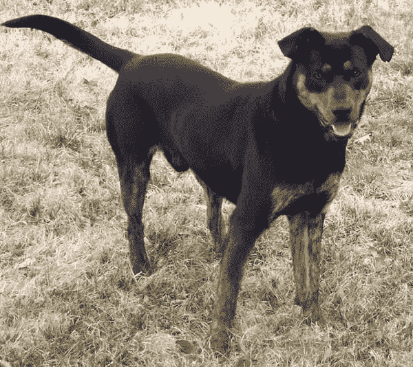

# 在 Keras 中将计算机视觉模型用于迁移学习

> 原文：<https://machinelearningmastery.com/how-to-use-transfer-learning-when-developing-convolutional-neural-network-models/>

最后更新于 2020 年 8 月 18 日

深度卷积神经网络模型在非常大的数据集上训练可能需要几天甚至几周的时间。

简化这一过程的一种方法是重用为标准计算机视觉基准数据集(如 ImageNet 图像识别任务)开发的预训练模型的模型权重。表现最好的模型可以直接下载使用，也可以集成到新的模型中来解决你自己的计算机视觉问题。

在这篇文章中，你将发现在为计算机视觉应用开发卷积神经网络时，如何使用[转移学习](https://machinelearningmastery.com/transfer-learning-for-deep-learning/)。

看完这篇文章，你会知道:

*   迁移学习包括使用在一个问题上训练的模型作为相关问题的起点。
*   迁移学习是灵活的，允许直接使用预先训练好的模型，作为特征提取预处理，并集成到全新的模型中。
*   Keras 可以方便地访问 ImageNet 图像识别任务中的许多顶级模型，如 VGG、Inception 和 ResNet。

**用我的新书[计算机视觉深度学习](https://machinelearningmastery.com/deep-learning-for-computer-vision/)启动你的项目**，包括*分步教程*和所有示例的 *Python 源代码*文件。

我们开始吧。

*   **2020 年 8 月更新**:更新了 Keras 2.4.3 和 TensorFlow 2.3 的 API。


开发卷积神经网络模型时如何使用迁移学习
图片由 [GoToVan](https://www.flickr.com/photos/gotovan/35603947204/) 提供，保留部分权利。

## 概观

本教程分为五个部分；它们是:

1.  什么是迁移学习？
2.  图像识别中的迁移学习
3.  如何使用预训练模型
4.  迁移学习模型
5.  使用预训练模型的示例

## 什么是迁移学习？

迁移学习通常指的是在一个问题上训练的模型以某种方式用于第二个相关问题的过程。

在深度学习中，迁移学习是一种技术，通过这种技术，神经网络模型首先在与正在解决的问题相似的问题上进行训练。来自训练模型的一个或多个层随后被用于在感兴趣的问题上训练的新模型中。

> 这通常在监督学习环境中理解，其中输入是相同的，但是目标可能是不同的性质。例如，我们可能在第一个设置中了解一组视觉类别，如猫和狗，然后在第二个设置中了解一组不同的视觉类别，如蚂蚁和黄蜂。

—第 536 页，[深度学习](https://amzn.to/2NJW3gE)，2016。

迁移学习具有减少神经网络模型的训练时间的优点，并且可以导致较低的泛化误差。

重用层中的权重可以用作训练过程的起点，并根据新问题进行调整。这种用法将迁移学习视为一种权重初始化方案。当第一个相关问题比感兴趣的问题有更多的标记数据时，这可能是有用的，并且问题结构的相似性可能在两种情况下都有用。

> ……目标是利用第一个设置中的数据来提取信息，这些信息可能在学习时有用，甚至在第二个设置中直接进行预测时有用。

—第 538 页，[深度学习](https://amzn.to/2NJW3gE)，2016。

## 图像识别中的迁移学习

已经为图像分类开发了一系列高表现模型，并在年度 [ImageNet 大规模视觉识别挑战](http://www.image-net.org/challenges/LSVRC/)或 ILSVRC 上进行了演示。

考虑到比赛中使用的图像来源，这一挑战通常简称为 [ImageNet](http://image-net.org/) ，在卷积神经网络的架构和训练方面带来了许多创新。此外，比赛中使用的许多模型已经在许可许可下发布。

这些模型可以作为计算机视觉应用中迁移学习的基础。

这是可取的，原因有很多，尤其是:

*   **有用的学习特征**:模型已经学会了如何从照片中检测通用特征，假设它们是在 1000 个类别的 100 多万张图像上训练的。
*   **最先进的表现**:模型实现了最先进的表现，并且在开发它们的特定图像识别任务中保持有效。
*   **易访问**:模型权重以免费下载文件的形式提供，很多库提供了方便的 API，可以直接下载使用模型。

可以下载模型权重，并使用一系列不同的深度学习库(包括 Keras)在同一模型架构中使用。

## 如何使用预训练模型

预训练模型的使用只受你创造力的限制。

例如，模型可以按原样下载和使用，例如嵌入到应用程序中并用于对新照片进行分类。

或者，可以下载模型并用作特征提取模型。这里，来自模型输出层之前的层的模型输出被用作新分类器模型的输入。

回想一下，更靠近模型输入层的卷积层学习低级特征，例如线，层中间的层学习复杂的抽象特征，这些抽象特征组合了从输入中提取的低级特征，而更靠近输出的层在分类任务的上下文中解释提取的特征。

有了这种理解，就可以选择从现有的预训练模型中提取特征的详细程度。例如，如果一个新的任务与对照片中的对象进行分类有很大的不同(例如不同于 ImageNet)，那么在几层之后，预训练模型的输出可能是合适的。如果新任务与照片中对象分类的任务非常相似，那么也许可以使用模型中更深层次的输出，或者甚至可以使用输出层之前的完全连接层的输出。

预训练的模型可以用作单独的特征提取程序，在这种情况下，输入可以由模型或模型的一部分预处理为每个输入图像的给定输出(例如，数字向量)，然后当训练新模型时，该输出可以用作输入。

或者，预训练模型或模型的期望部分可以直接集成到新的神经网络模型中。在这种用法中，预训练的权重可以被冻结，以便它们不会随着新模型的训练而更新。或者，权重可以在新模型的训练期间被更新，可能具有较低的学习率，从而允许预训练模型在训练新模型时像权重初始化方案一样工作。

我们可以将其中一些使用模式总结如下:

*   **分类器**:直接使用预先训练好的模型对新图像进行分类。
*   **独立特征提取器**:预先训练好的模型，或者模型的某一部分，用于对图像进行预处理，提取相关特征。
*   **集成特征提取器**:预先训练好的模型，或者模型的某一部分，被集成到一个新的模型中，但是预先训练好的模型的层在训练过程中被冻结。
*   **权重初始化**:将预先训练好的模型，或者模型的某一部分，集成到一个新的模型中，预先训练好的模型的各层与新的模型协同训练。

在开发和训练深度卷积神经网络模型时，每种方法都是有效的，并且节省了大量时间。

可能不清楚哪种预训练模型的使用会在新的计算机视觉任务中产生最佳结果，因此可能需要一些实验。

## 迁移学习模型

也许有十几个或更多的图像识别顶级模型可以下载并用作图像识别和相关计算机视觉任务的基础。

可能有三种更受欢迎的型号如下:

*   VGG(例如 VGG16 或 VGG19)。
*   GoogLeNet(例如 inceptionv 3)。
*   剩余网络(例如 ResNet50)。

这些模型被广泛用于迁移学习，不仅因为它们的表现，还因为它们是引入特定架构创新的例子，即一致和重复结构(VGG)、初始模块(谷歌网)和剩余模块(ResNet)。

Keras 提供了许多为图像识别任务开发的表现最佳的预训练模型。

它们可通过[应用程序接口](https://keras.io/applications/)获得，包括加载具有或不具有预训练权重的模型的功能，以及以给定模型可能期望的方式准备数据的功能(例如，缩放尺寸和像素值)。

第一次加载预训练模型时，Keras 会下载所需的模型权重，考虑到您的互联网连接速度，这可能需要一些时间。重量存储在*中。keras/models/* 位于您的主目录下，下次使用时将从该位置加载。

加载给定模型时，可以将“ *include_top* ”参数设置为 *False* ，在这种情况下，用于进行预测的模型的完全连接的输出层不会被加载，从而允许添加和训练新的输出层。例如:

```py
...
# load model without output layer
model = VGG16(include_top=False)
```

此外，当“ *include_top* ”参数为 *False* 时，必须指定“ *input_tensor* ”参数，以允许模型的预期固定大小输入被更改。例如:

```py
...
# load model and specify a new input shape for images
new_input = Input(shape=(640, 480, 3))
model = VGG16(include_top=False, input_tensor=new_input)
```

没有顶层的模型将直接从最后一个卷积层或池层输出激活。总结这些激活以便在分类器中使用或作为输入的特征向量表示的一种方法是添加全局池层，例如最大全局池或平均全局池。结果是一个矢量，可以用作输入的特征描述符。Keras 通过可以设置为“ *avg* 或“ *max* 的“*池*参数”直接提供此功能。例如:

```py
...
# load model and specify a new input shape for images and avg pooling output
new_input = Input(shape=(640, 480, 3))
model = VGG16(include_top=False, input_tensor=new_input, pooling='avg')
```

可以使用*预处理 _ 输入()*功能为给定模型准备图像；例如，以开发模型时对训练数据集中的图像执行的方式来执行像素缩放。例如:

```py
...
# prepare an image
from keras.applications.vgg16 import preprocess_input
images = ...
prepared_images = preprocess_input(images)
```

最后，您可能希望在数据集上使用模型架构，但不使用预先训练的权重，而是使用随机权重初始化模型，并从零开始训练模型。

这可以通过将“*权重*”参数设置为“无”而不是默认的“ *imagenet* 来实现。此外，可以设置“*类*参数来定义数据集中的类数量，然后在模型的输出层中为您配置这些类。例如:

```py
...
# define a new model with random weights and 10 classes
new_input = Input(shape=(640, 480, 3))
model = VGG16(weights=None, input_tensor=new_input, classes=10)
```

现在我们已经熟悉了该应用编程接口，让我们看看如何使用 Keras 应用编程接口加载三个模型。

### 加载 VGG16 预训练模型

VGG16 模型是由牛津大学视觉图形小组(VGG)开发的，并在 2014 年发表的题为“用于大规模图像识别的非常深卷积网络”的论文中进行了描述

默认情况下，该模型期望将彩色输入图像重新缩放至 224×224 平方的大小。

模型可以按如下方式加载:

```py
# example of loading the vgg16 model
from keras.applications.vgg16 import VGG16
# load model
model = VGG16()
# summarize the model
model.summary()
```

运行该示例将加载 VGG16 模型，并在需要时下载模型权重。

然后，该模型可以直接用于将照片分类为 1000 个类别之一。在这种情况下，总结模型架构以确认它被正确加载。

```py
_________________________________________________________________
Layer (type)                 Output Shape              Param #
=================================================================
input_1 (InputLayer)         (None, 224, 224, 3)       0
_________________________________________________________________
block1_conv1 (Conv2D)        (None, 224, 224, 64)      1792
_________________________________________________________________
block1_conv2 (Conv2D)        (None, 224, 224, 64)      36928
_________________________________________________________________
block1_pool (MaxPooling2D)   (None, 112, 112, 64)      0
_________________________________________________________________
block2_conv1 (Conv2D)        (None, 112, 112, 128)     73856
_________________________________________________________________
block2_conv2 (Conv2D)        (None, 112, 112, 128)     147584
_________________________________________________________________
block2_pool (MaxPooling2D)   (None, 56, 56, 128)       0
_________________________________________________________________
block3_conv1 (Conv2D)        (None, 56, 56, 256)       295168
_________________________________________________________________
block3_conv2 (Conv2D)        (None, 56, 56, 256)       590080
_________________________________________________________________
block3_conv3 (Conv2D)        (None, 56, 56, 256)       590080
_________________________________________________________________
block3_pool (MaxPooling2D)   (None, 28, 28, 256)       0
_________________________________________________________________
block4_conv1 (Conv2D)        (None, 28, 28, 512)       1180160
_________________________________________________________________
block4_conv2 (Conv2D)        (None, 28, 28, 512)       2359808
_________________________________________________________________
block4_conv3 (Conv2D)        (None, 28, 28, 512)       2359808
_________________________________________________________________
block4_pool (MaxPooling2D)   (None, 14, 14, 512)       0
_________________________________________________________________
block5_conv1 (Conv2D)        (None, 14, 14, 512)       2359808
_________________________________________________________________
block5_conv2 (Conv2D)        (None, 14, 14, 512)       2359808
_________________________________________________________________
block5_conv3 (Conv2D)        (None, 14, 14, 512)       2359808
_________________________________________________________________
block5_pool (MaxPooling2D)   (None, 7, 7, 512)         0
_________________________________________________________________
flatten (Flatten)            (None, 25088)             0
_________________________________________________________________
fc1 (Dense)                  (None, 4096)              102764544
_________________________________________________________________
fc2 (Dense)                  (None, 4096)              16781312
_________________________________________________________________
predictions (Dense)          (None, 1000)              4097000
=================================================================
Total params: 138,357,544
Trainable params: 138,357,544
Non-trainable params: 0
_________________________________________________________________
```

### 加载选项 3 预训练模型

InceptionV3 是初始架构的第三次迭代，最初是为 GoogLeNet 模型开发的。

这个模型是由谷歌的研究人员开发的，并在 2015 年的论文《重新思考计算机视觉的初始架构》中进行了描述

该模型期望彩色图像具有 299×299 的正方形形状。

模型可以按如下方式加载:

```py
# example of loading the inception v3 model
from keras.applications.inception_v3 import InceptionV3
# load model
model = InceptionV3()
# summarize the model
model.summary()
```

运行该示例将加载模型，如果需要的话下载权重，然后总结模型架构以确认它被正确加载。

为了简洁起见，这里省略了输出，因为它是一个具有许多层的深度模型。

### 加载 ResNet50 预训练模型

剩余网络，简称 ResNet，是一种利用包含快捷连接的剩余模块的模型。

它是由微软的研究人员开发的，并在 2015 年的论文《图像识别的深度残差学习》中进行了描述

该模型期望彩色图像具有 224×224 的正方形形状。

```py
# example of loading the resnet50 model
from keras.applications.resnet50 import ResNet50
# load model
model = ResNet50()
# summarize the model
model.summary()
```

运行该示例将加载模型，如果需要的话下载权重，然后总结模型架构以确认它被正确加载。

为了简洁起见，这里省略了输出，因为它是一个深度模型。

## 使用预训练模型的示例

现在我们已经熟悉了如何在 Keras 中加载预先训练好的模型，让我们来看一些如何在实践中使用它们的例子。

在这些示例中，我们将使用 VGG16 模型，因为它使用起来相对简单，理解起来也很简单。

在这些例子中，我们还需要一张照片。下面是一张狗的照片，由贾斯汀·摩根拍摄，根据许可许可提供。



一只狗的照片

下载照片，并将其放入当前工作目录，文件名为“*dog.jpg*”。

*   [一只狗的照片(dog.jpg)](https://machinelearningmastery.com/wp-content/uploads/2019/02/dog.jpg)

### 作为分类器的预训练模型

预训练的模型可以直接用于将新照片分类为 ILSVRC 中图像分类任务的 1000 个已知类别之一。

我们将使用 VGG16 模型对新图像进行分类。

首先，照片需要加载并重新整形为模型预期的 224×224 的正方形，像素值按照模型预期的方式缩放。该模型对一组样本进行操作，因此对于一幅具有 224×224 像素和三个通道的图像，加载图像的维度需要扩展 1。

```py
# load an image from file
image = load_img('dog.jpg', target_size=(224, 224))
# convert the image pixels to a numpy array
image = img_to_array(image)
# reshape data for the model
image = image.reshape((1, image.shape[0], image.shape[1], image.shape[2]))
# prepare the image for the VGG model
image = preprocess_input(image)
```

接下来，可以加载模型并进行预测。

这意味着做出了属于 1000 个类别中的每一个的照片的预测概率。在这个例子中，我们只关心最有可能的类，因此我们可以解码预测，并检索具有最高概率的类的标签或名称。

```py
# predict the probability across all output classes
yhat = model.predict(image)
# convert the probabilities to class labels
label = decode_predictions(yhat)
# retrieve the most likely result, e.g. highest probability
label = label[0][0]
```

将所有这些联系在一起，下面的完整示例加载了一张新照片，并预测了最有可能的类别。

```py
# example of using a pre-trained model as a classifier
from keras.preprocessing.image import load_img
from keras.preprocessing.image import img_to_array
from keras.applications.vgg16 import preprocess_input
from keras.applications.vgg16 import decode_predictions
from keras.applications.vgg16 import VGG16
# load an image from file
image = load_img('dog.jpg', target_size=(224, 224))
# convert the image pixels to a numpy array
image = img_to_array(image)
# reshape data for the model
image = image.reshape((1, image.shape[0], image.shape[1], image.shape[2]))
# prepare the image for the VGG model
image = preprocess_input(image)
# load the model
model = VGG16()
# predict the probability across all output classes
yhat = model.predict(image)
# convert the probabilities to class labels
label = decode_predictions(yhat)
# retrieve the most likely result, e.g. highest probability
label = label[0][0]
# print the classification
print('%s (%.2f%%)' % (label[1], label[2]*100))
```

运行这个例子预测的不仅仅是狗；它还以 33.59%的概率预测了特定品种的‘T0’杜宾犬，这实际上可能是正确的。

```py
Doberman (33.59%)
```

### 作为特征提取预处理器的预训练模型

预先训练好的模型可以作为一个独立的程序从新照片中提取特征。

具体而言，照片的提取特征可以是模型将用来描述照片中特定特征的数字向量。然后，这些特性可以用作开发新模型的输入。

VGG16 型号的最后几层是输出层之前的全连接层。这些层将提供一组复杂的特征来描述给定的输入图像，并且可以在为图像分类或相关的计算机视觉任务训练新模型时提供有用的输入。

可以为模型加载和准备图像，就像我们在前面的例子中所做的那样。

我们将使用模型的分类器输出部分加载模型，但是手动移除最终的输出层。这意味着具有 4，096 个节点的第二个最后一个完全连接的层将是新的输出层。

```py
# load model
model = VGG16()
# remove the output layer
model = Model(inputs=model.inputs, outputs=model.layers[-2].output)
```

这个由 4，096 个数字组成的向量将用于表示给定输入图像的复杂特征，然后可以将其保存到文件中以供以后加载，并用作训练新模型的输入。我们可以把它保存为泡菜文件。

```py
# get extracted features
features = model.predict(image)
print(features.shape)
# save to file
dump(features, open('dog.pkl', 'wb'))
```

将所有这些结合在一起，下面列出了将该模型用作独立特征提取模型的完整示例。

```py
# example of using the vgg16 model as a feature extraction model
from keras.preprocessing.image import load_img
from keras.preprocessing.image import img_to_array
from keras.applications.vgg16 import preprocess_input
from keras.applications.vgg16 import decode_predictions
from keras.applications.vgg16 import VGG16
from keras.models import Model
from pickle import dump
# load an image from file
image = load_img('dog.jpg', target_size=(224, 224))
# convert the image pixels to a numpy array
image = img_to_array(image)
# reshape data for the model
image = image.reshape((1, image.shape[0], image.shape[1], image.shape[2]))
# prepare the image for the VGG model
image = preprocess_input(image)
# load model
model = VGG16()
# remove the output layer
model = Model(inputs=model.inputs, outputs=model.layers[-2].output)
# get extracted features
features = model.predict(image)
print(features.shape)
# save to file
dump(features, open('dog.pkl', 'wb'))
```

运行该示例加载照片，然后准备模型作为特征提取模型。

从加载的照片中提取特征，并打印特征向量的形状，显示它有 4，096 个数字。该功能随后被保存到当前工作目录中的新文件 *dog.pkl* 中。

```py
(1, 4096)
```

可以对新训练数据集中的每张照片重复该过程。

### 预训练模型作为模型中的特征提取器

我们可以直接使用预训练模型中的部分或全部层作为新模型的特征提取组件。

这可以通过加载模型，然后简单地添加新层来实现。这可能涉及添加新的卷积和池层来扩展模型的特征提取能力，或者添加新的完全连接的分类器类型层来学习如何在新的数据集上解释提取的特征，或者一些组合。

例如，我们可以通过将“ *include_top* ”参数指定为“ *False* ”来加载没有模型的分类器部分的 VGG16 模型，并将新数据集中图像的首选形状指定为 300×300。

```py
# load model without classifier layers
model = VGG16(include_top=False, input_shape=(300, 300, 3))
```

然后，我们可以使用 Keras 函数 API 在 VGG16 模型中的最后一个池层之后添加一个新的扁平化层，然后定义一个新的分类器模型，该模型具有一个密集的全连接层和一个输出层，该输出层将预测 10 个类的概率。

```py
# add new classifier layers
flat1 = Flatten()(model.layers[-1].output)
class1 = Dense(1024, activation='relu')(flat1)
output = Dense(10, activation='softmax')(class1)
# define new model
model = Model(inputs=model.inputs, outputs=output)
```

添加扁平化层的另一种方法是用平均池层定义 VGG16 模型，然后添加完全连接的层。也许在您的应用程序中尝试这两种方法，看看哪种方法的表现最好。

VGG16 模型的权重和新模型的权重将在新的数据集上一起训练。

下面列出了完整的示例。

```py
# example of tending the vgg16 model
from keras.applications.vgg16 import VGG16
from keras.models import Model
from keras.layers import Dense
from keras.layers import Flatten
# load model without classifier layers
model = VGG16(include_top=False, input_shape=(300, 300, 3))
# add new classifier layers
flat1 = Flatten()(model.layers[-1].output)
class1 = Dense(1024, activation='relu')(flat1)
output = Dense(10, activation='softmax')(class1)
# define new model
model = Model(inputs=model.inputs, outputs=output)
# summarize
model.summary()
# ...
```

运行该示例定义了准备培训的新模型，并总结了模型架构。

我们可以看到，我们已经展平了最后一个池层的输出，并添加了新的完全连接的层。

```py
_________________________________________________________________
Layer (type)                 Output Shape              Param #
=================================================================
input_1 (InputLayer)         (None, 300, 300, 3)       0
_________________________________________________________________
block1_conv1 (Conv2D)        (None, 300, 300, 64)      1792
_________________________________________________________________
block1_conv2 (Conv2D)        (None, 300, 300, 64)      36928
_________________________________________________________________
block1_pool (MaxPooling2D)   (None, 150, 150, 64)      0
_________________________________________________________________
block2_conv1 (Conv2D)        (None, 150, 150, 128)     73856
_________________________________________________________________
block2_conv2 (Conv2D)        (None, 150, 150, 128)     147584
_________________________________________________________________
block2_pool (MaxPooling2D)   (None, 75, 75, 128)       0
_________________________________________________________________
block3_conv1 (Conv2D)        (None, 75, 75, 256)       295168
_________________________________________________________________
block3_conv2 (Conv2D)        (None, 75, 75, 256)       590080
_________________________________________________________________
block3_conv3 (Conv2D)        (None, 75, 75, 256)       590080
_________________________________________________________________
block3_pool (MaxPooling2D)   (None, 37, 37, 256)       0
_________________________________________________________________
block4_conv1 (Conv2D)        (None, 37, 37, 512)       1180160
_________________________________________________________________
block4_conv2 (Conv2D)        (None, 37, 37, 512)       2359808
_________________________________________________________________
block4_conv3 (Conv2D)        (None, 37, 37, 512)       2359808
_________________________________________________________________
block4_pool (MaxPooling2D)   (None, 18, 18, 512)       0
_________________________________________________________________
block5_conv1 (Conv2D)        (None, 18, 18, 512)       2359808
_________________________________________________________________
block5_conv2 (Conv2D)        (None, 18, 18, 512)       2359808
_________________________________________________________________
block5_conv3 (Conv2D)        (None, 18, 18, 512)       2359808
_________________________________________________________________
block5_pool (MaxPooling2D)   (None, 9, 9, 512)         0
_________________________________________________________________
flatten_1 (Flatten)          (None, 41472)             0
_________________________________________________________________
dense_1 (Dense)              (None, 1024)              42468352
_________________________________________________________________
dense_2 (Dense)              (None, 10)                10250
=================================================================
Total params: 57,193,290
Trainable params: 57,193,290
Non-trainable params: 0
_________________________________________________________________
```

或者，我们可能希望使用 VGG16 模型层，但是在不更新 VGG16 层权重的情况下训练模型的新层。这将允许新的输出层学习解释 VGG16 模型的学习功能。

这可以通过在训练之前将加载的 VGG 模型中的每个层的“*可训练*”属性设置为假来实现。例如:

```py
# load model without classifier layers
model = VGG16(include_top=False, input_shape=(300, 300, 3))
# mark loaded layers as not trainable
for layer in model.layers:
	layer.trainable = False
...
```

您可以选择哪些层是可训练的。

例如，也许您想重新训练模型中的一些卷积层，但是模型中没有更早的层。例如:

```py
# load model without classifier layers
model = VGG16(include_top=False, input_shape=(300, 300, 3))
# mark some layers as not trainable
model.get_layer('block1_conv1').trainable = False
model.get_layer('block1_conv2').trainable = False
model.get_layer('block2_conv1').trainable = False
model.get_layer('block2_conv2').trainable = False
...
```

## 进一步阅读

如果您想更深入地了解这个主题，本节将提供更多资源。

### 邮件

*   [如何利用深度学习神经网络的迁移学习提高表现](https://machinelearningmastery.com/how-to-improve-performance-with-transfer-learning-for-deep-learning-neural-networks/)
*   [深度学习迁移学习入门](https://machinelearningmastery.com/transfer-learning-for-deep-learning/)
*   [如何使用预先训练好的 VGG 模型对照片中的对象进行分类](https://machinelearningmastery.com/use-pre-trained-vgg-model-classify-objects-photographs/)

### 书

*   [深度学习](https://amzn.to/2NJW3gE)，2016 年。

### 报纸

*   [迁移学习调查](https://ieeexplore.ieee.org/document/5288526)，2010。
*   [深度神经网络中的特征是如何转移的？](https://arxiv.org/abs/1411.1792)，2014 年。
*   [美国有线电视新闻网特写现成的:一个令人震惊的识别基线](https://www.cv-foundation.org/openaccess/content_cvpr_workshops_2014/W15/html/Razavian_CNN_Features_Off-the-Shelf_2014_CVPR_paper.html)，2014 年。

### 蜜蜂

*   [Keras 应用程序接口](https://keras.io/applications/)

### 文章

*   [迁移学习，维基百科](https://en.wikipedia.org/wiki/Transfer_learning)。
*   [迁移学习——机器学习的下一个前沿](http://ruder.io/transfer-learning/)，2017。

## 摘要

在这篇文章中，你发现了如何在为计算机视觉应用开发卷积神经网络时使用转移学习。

具体来说，您了解到:

*   迁移学习包括使用在一个问题上训练的模型作为相关问题的起点。
*   迁移学习是灵活的，允许使用预先训练的模型直接作为特征提取预处理，并集成到全新的模型中。
*   Keras 可以方便地访问 ImageNet 图像识别任务中的许多顶级模型，如 VGG、Inception 和 ResNet。

你有什么问题吗？
在下面的评论中提问，我会尽力回答。