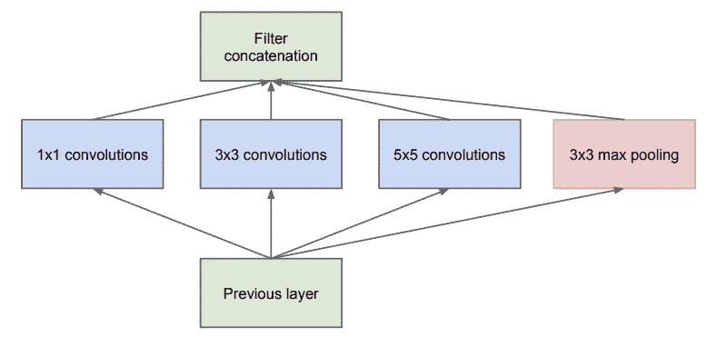
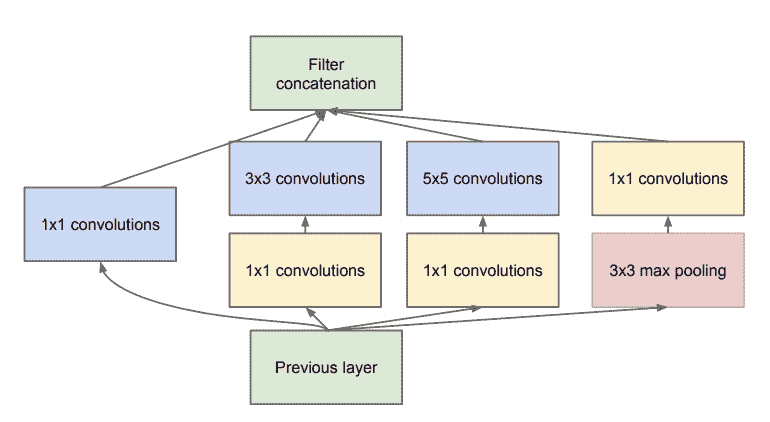
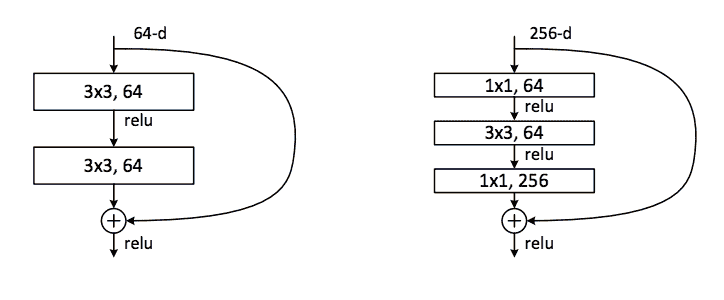

# 用于管理模型复杂性`1×1`卷积的温和介绍

> 原文：<https://machinelearningmastery.com/introduction-to-1x1-convolutions-to-reduce-the-complexity-of-convolutional-neural-networks/>

最后更新于 2019 年 7 月 5 日

池化可用于对要素地图的内容进行下采样，减少其宽度和高度，同时保持其显著特征。

深度卷积神经网络的一个问题是特征图的数量通常随着网络的深度而增加。当使用更大的滤波器尺寸(例如 5×5 和 7×7)时，这个问题会导致所需的参数数量和计算量急剧增加。

为了解决这个问题，可以使用 1×1 [卷积层](https://machinelearningmastery.com/convolutional-layers-for-deep-learning-neural-networks/)，它提供了一个通道池，通常称为要素地图池或投影层。这种简单的技术可以用于降维，减少特征图的数量，同时保留它们的显著特征。它还可以直接用于创建要素地图的一对一投影，以跨通道池化要素或增加要素地图的数量，例如在传统的池化层之后。

在本教程中，您将发现如何使用 1×1 滤波器来控制卷积神经网络中特征映射的数量。

完成本教程后，您将知道:

*   1×1 滤波器可用于创建一叠要素图的线性投影。
*   1×1 创建的投影可以像通道池一样工作，并用于降维。
*   由 1×1 创建的投影也可以直接使用或用于增加模型中的特征地图的数量。

**用我的新书[计算机视觉深度学习](https://machinelearningmastery.com/deep-learning-for-computer-vision/)启动你的项目**，包括*分步教程*和所有示例的 *Python 源代码*文件。

我们开始吧。


1×1 卷积的温和介绍降低卷积神经网络的复杂性
[图片版权](https://www.flickr.com/photos/98703782@N04/9278049442/)，保留部分权利。

## 教程概述

本教程分为五个部分；它们是:

1.  通道上的卷积
2.  要素地图过多的问题
3.  使用 1×1 过滤器对要素地图进行下采样
4.  如何使用 1×1 卷积的例子
5.  有线电视新闻网模型架构中的 1×1 滤波器示例

## 通道上的卷积

回想一下，卷积运算是将较小的滤波器线性应用于较大的输入，从而产生输出特征图。

应用于输入图像或输入要素图的过滤器总是产生一个数字。过滤器从左至右和从上至下系统地应用于输入，产生二维特征图。一个过滤器创建一个相应的要素地图。

过滤器必须具有与输入相同的深度或通道数，然而，无论输入和过滤器的深度如何，结果输出都是单个数字，一个过滤器创建一个具有单个通道的要素图。

让我们用一些例子来具体说明这一点:

*   如果输入有一个通道，如灰度图像，则 3×3 滤波器将应用于 3x3x1 块。
*   如果输入图像有红色、绿色和蓝色三个通道，那么将在 3x3x3 块中应用 3×3 滤波器。
*   如果输入是来自另一个卷积层或池化层的特征图块，并且深度为 64，则 3×3 滤波器将应用于 3x3x64 块，以创建组成单个输出特征图的单个值。

一个卷积层的输出深度仅由应用于输入的并行滤波器的数量来定义。

## 要素地图过多的问题

卷积层中使用的输入深度或滤波器数量通常会随着网络深度的增加而增加，从而导致生成的特征图数量增加。这是一种常见的模型设计模式。

此外，一些网络体系结构，例如初始体系结构，也可以连接来自多个卷积层的输出特征图，这也可以显著增加到后续卷积层的输入深度。

卷积神经网络中的大量特征映射会导致问题，因为卷积运算必须向下执行到输入的深度。如果正在执行的卷积运算相对较大，例如 5×5 或 7×7 像素，这是一个特别的问题，因为这可能导致相当多的参数(权重)以及反过来执行卷积运算的计算(大的空间和时间复杂度)。

池化层旨在缩小要素地图的比例，并系统地将网络中要素地图的宽度和高度减半。然而，池化层不会改变模型中的过滤器数量、深度或通道数量。

深度卷积神经网络需要相应的池化类型的层，该层可以下采样或减少特征图的深度或数量。

## 使用 1×1 过滤器对要素地图进行下采样

解决方案是使用 1×1 滤波器对深度或特征图数量进行下采样。

1×1 滤波器对于输入中的每个通道只有一个参数或权重，就像任何滤波器的应用都会产生一个输出值一样。这种结构允许 1×1 滤波器像单个神经元一样工作，输入来自输入中每个特征映射的相同位置。然后，该单个神经元可以以一个的[步幅从左到右和从上到下系统地应用，而不需要任何](https://machinelearningmastery.com/padding-and-stride-for-convolutional-neural-networks/)[填充](https://machinelearningmastery.com/padding-and-stride-for-convolutional-neural-networks/)，从而产生与输入具有相同宽度和高度的特征图。

1×1 滤波器非常简单，不涉及输入中的任何相邻像素；它可能不被认为是卷积运算。相反，它是输入的线性加权或投影。此外，非线性被用于其他卷积层，允许投影对输入特征图执行非平凡计算。

这个简单的 1×1 过滤器提供了一种有效总结输入特征图的方法。反过来，多个 1×1 过滤器的使用允许调整要创建的输入要素图的汇总数量，有效地允许根据需要增加或减少要素图的深度。

因此，具有 1×1 滤波器的卷积层可以在卷积神经网络中的任何点使用，以控制特征映射的数量。因此，它通常被称为投影操作或投影层，甚至是要素地图或通道池层。

既然我们知道可以用 1×1 的过滤器控制特征图的数量，那么我们就用一些例子来具体说明一下。

## 如何使用 1×1 卷积的例子

通过一些例子，我们可以利用 1×1 的过滤混凝土。

考虑我们有一个卷积神经网络，它期望输入的彩色图像具有 256x256x3 像素的正方形形状。

然后，这些图像通过具有 512 个滤镜的第一隐藏层，每个滤镜的大小为 3×3，填充相同，随后是 [ReLU 激活功能](https://machinelearningmastery.com/rectified-linear-activation-function-for-deep-learning-neural-networks/)。

下面的例子演示了这个简单的模型。

```py
# example of simple cnn model
from keras.models import Sequential
from keras.layers import Conv2D
# create model
model = Sequential()
model.add(Conv2D(512, (3,3), padding='same', activation='relu', input_shape=(256, 256, 3)))
# summarize model
model.summary()
```

运行该示例会创建模型并总结模型架构。

没有惊喜；第一个隐藏层的输出是一组三维形状为 256x256x512 的要素图。

```py
_________________________________________________________________
Layer (type)                 Output Shape              Param #
=================================================================
conv2d_1 (Conv2D)            (None, 256, 256, 512)     14336
=================================================================
Total params: 14,336
Trainable params: 14,336
Non-trainable params: 0
_________________________________________________________________
```

### 投影要素地图示例

1×1 过滤器可用于创建要素地图的投影。

创建的要素地图的数量将是相同的，并且效果可能是对已提取的要素的细化。这通常被称为通道池，与传统的每个通道上的功能池相反。它可以如下实现:

```py
model.add(Conv2D(512, (1,1), activation='relu'))
```

我们可以看到，我们使用了相同数量的特征，并且仍然遵循具有整流线性激活函数的滤波器的应用。

下面列出了完整的示例。

```py
# example of a 1x1 filter for projection
from keras.models import Sequential
from keras.layers import Conv2D
# create model
model = Sequential()
model.add(Conv2D(512, (3,3), padding='same', activation='relu', input_shape=(256, 256, 3)))
model.add(Conv2D(512, (1,1), activation='relu'))
# summarize model
model.summary()
```

运行该示例会创建模型并总结体系结构。

我们可以看到，要素地图的宽度或高度没有变化，通过设计，要素地图的数量通过应用简单的投影操作保持不变。

```py
_________________________________________________________________
Layer (type)                 Output Shape              Param #
=================================================================
conv2d_1 (Conv2D)            (None, 256, 256, 512)     14336
_________________________________________________________________
conv2d_2 (Conv2D)            (None, 256, 256, 512)     262656
=================================================================
Total params: 276,992
Trainable params: 276,992
Non-trainable params: 0
_________________________________________________________________
```

### 减少要素地图的示例

1×1 滤波器可用于减少要素图的数量。

这是此类过滤器最常见的应用，因此，该层通常称为要素地图池层。

在本例中，我们可以将深度(或通道)从 512 减少到 64。如果我们要添加到模型中的后续层是另一个带有 7×7 滤波器的卷积层，这可能会很有用。这些过滤器仅适用于深度 64，而不是 512。

```py
model.add(Conv2D(64, (1,1), activation='relu'))
```

64 个特征图的组成与原始 512 不相同，但是包含捕获显著特征的降维的有用总结，使得 7×7 操作可能对 64 个特征图具有与原始 512 相似的效果。

此外，具有 64 个滤波器的 7×7 卷积层本身应用于由第一隐藏层输出的 512 个特征图将产生大约一百万个参数(权重)。如果首先使用 1×1 滤波器将特征图的数量减少到 64 个，那么 7×7 层所需的参数数量大约只有 20 万个，这是一个巨大的差异。

下面列出了使用 1×1 滤波器进行降维的完整示例。

```py
# example of a 1x1 filter for dimensionality reduction
from keras.models import Sequential
from keras.layers import Conv2D
# create model
model = Sequential()
model.add(Conv2D(512, (3,3), padding='same', activation='relu', input_shape=(256, 256, 3)))
model.add(Conv2D(64, (1,1), activation='relu'))
# summarize model
model.summary()
```

运行该示例会创建模型并总结其结构。

我们可以看到，特征地图的宽度和高度没有变化，但特征地图的数量从 512 个减少到 64 个。

```py
_________________________________________________________________
Layer (type)                 Output Shape              Param #
=================================================================
conv2d_1 (Conv2D)            (None, 256, 256, 512)     14336
_________________________________________________________________
conv2d_2 (Conv2D)            (None, 256, 256, 64)      32832
=================================================================
Total params: 47,168
Trainable params: 47,168
Non-trainable params: 0
_________________________________________________________________
```

### 增加要素地图的示例

1×1 滤波器可用于增加要素图的数量。

这是在应用另一个卷积层之前在池层之后使用的常见操作。

过滤器的投影效果可以根据需要多次应用于输入，允许特征图的数量按比例增加，但仍具有捕捉原始特征的合成。

我们可以将要素地图的数量从第一个隐藏层的 512 个输入增加到 1，024 个要素地图的两倍。

```py
model.add(Conv2D(1024, (1,1), activation='relu'))
```

下面列出了完整的示例。

```py
# example of a 1x1 filter to increase dimensionality
from keras.models import Sequential
from keras.layers import Conv2D
# create model
model = Sequential()
model.add(Conv2D(512, (3,3), padding='same', activation='relu', input_shape=(256, 256, 3)))
model.add(Conv2D(1024, (1,1), activation='relu'))
# summarize model
model.summary()
```

运行该示例会创建模型并总结其结构。

我们可以看到，要素地图的宽度和高度保持不变，要素地图的数量从 512 个增加到两倍，达到 1024 个。

```py
_________________________________________________________________
Layer (type)                 Output Shape              Param #
=================================================================
conv2d_1 (Conv2D)            (None, 256, 256, 512)     14336
_________________________________________________________________
conv2d_2 (Conv2D)            (None, 256, 256, 1024)    525312
=================================================================
Total params: 539,648
Trainable params: 539,648
Non-trainable params: 0
_________________________________________________________________
```

现在我们已经熟悉了如何使用 1×1 滤波器，让我们看一些例子，它们已经被用于卷积神经网络模型的体系结构中。

## 有线电视新闻网模型架构中的 1×1 滤波器示例

在本节中，我们将重点介绍一些重要的例子，其中 1×1 滤波器已被用作现代卷积神经网络模型架构中的关键元素。

### 网络中的网络

林敏等人在 2013 年的论文《网络中的网络》中首次描述并推广了 1×1 过滤器

在这篇论文中，作者提出需要一个 MLP 卷积层和需要跨信道池来促进跨信道学习。

> 这种级联的跨信道参数池结构允许跨信道信息的复杂且可学习的交互。

——[网络中的网络](https://arxiv.org/abs/1312.4400)，2013 年。

他们将 1×1 卷积层描述为跨信道参数池的具体实现，实际上，这正是 1×1 滤波器所实现的。

> 每个池化层对输入特征图执行加权线性重组，然后通过一个整流线性单元。[……]跨通道参数池层也相当于一个具有 1×1 卷积核的卷积层。

——[网络中的网络](https://arxiv.org/abs/1312.4400)，2013 年。

### 初始架构

克里斯蒂安·塞格迪(Christian Szegedy)等人在 2014 年发表的题为“T0”的论文中提到，在初始模块的设计中，1×1 滤波器被明确用于降维和增加特征图的维数

本文描述了一个“*初始模块*”，其中特征图的输入块由不同的卷积层并行处理，每个卷积层具有不同大小的滤波器，其中 1×1 大小的滤波器是所使用的层之一。



天真初始模块示例
摘自《用卷积深入》，2014 年。

然后，并行层的输出按信道堆叠，产生非常深的卷积层堆叠，供后续初始模块处理。

> 池化层的输出与卷积层的输出的合并将不可避免地导致各级输出数量的增加。即使这种架构可能覆盖了最佳的稀疏结构，它也会非常低效地完成，导致几个阶段内的计算爆炸。

——[用回旋更深入](https://arxiv.org/abs/1409.4842)，2014。

然后重新设计初始模块，在使用 5×5 和 7×7 大小的滤波器的并行卷积层之前，使用 1×1 滤波器来减少特征映射的数量。

> 这就引出了建议架构的第二个想法:在计算需求增加过多的情况下，明智地应用降维和投影。[……]也就是说，在昂贵的 3×3 和 5×5 卷积之前，使用 1×1 卷积来计算约简。除了用作还原剂，它们还包括整流线性激活的使用，这使得它们具有双重用途

——[用回旋更深入](https://arxiv.org/abs/1409.4842)，2014。

1×1 过滤器还用于在池化后增加要素地图的数量，从而人为地创建下采样的要素地图内容的更多投影。



降维初始模块的例子
摘自《用卷积深入》，2014 年。

### 残余建筑

在何等人 2015 年发表的论文《用于图像识别的深度残差学习》中，1×1 滤波器被用作投影技术，以匹配残差网络设计中输入的滤波器数量和残差模块的输出

作者描述了一个由“*剩余模块*”组成的架构，其中模块的输入被添加到模块的输出，这被称为快捷连接。

因为输入被添加到模块的输出中，所以维度必须在宽度、高度和深度方面匹配。宽度和高度可以通过填充来保持，尽管使用了 1×1 滤波器来根据需要更改输入的深度，以便将其添加到模块的输出中。这种类型的连接称为投影快捷连接。

此外，由于计算效率的原因，剩余模块使用具有 1×1 滤波器的瓶颈设计来减少特征图的数量。

> 这三层是 1×1、3×3 和 1×1 卷积，其中 1×1 层负责减少然后增加(恢复)维度，留下 3×3 层是输入/输出维度较小的瓶颈。

——[图像识别的深度残差学习](https://arxiv.org/abs/1512.03385)，2015。



带有快捷连接的正常和瓶颈残差模块示例
摘自《图像识别深度残差学习》，2015 年。

## 进一步阅读

如果您想更深入地了解这个主题，本节将提供更多资源。

### 报纸

*   [网络中的网络](https://arxiv.org/abs/1312.4400)，2013 年。
*   [用回旋更深入](https://arxiv.org/abs/1409.4842)，2014。
*   [图像识别的深度残差学习](https://arxiv.org/abs/1512.03385)，2015。

## 文章

*   [一个接一个【1 x 1】卷积——反直觉有用](https://iamaaditya.github.io/2016/03/one-by-one-convolution/)，2016。
*   [美国有线电视新闻网](https://www.facebook.com/yann.lecun/posts/10152820758292143)无全连接层上的 Yann LeCun，2015。
*   [网络和 1×1 卷积中的网络，YouTube](https://www.youtube.com/watch?v=c1RBQzKsDCk) 。

## 摘要

在本教程中，您发现了如何使用 1×1 滤波器来控制卷积神经网络中特征映射的数量。

具体来说，您了解到:

*   1×1 滤波器可用于创建一叠要素图的线性投影。
*   1×1 创建的投影可以像通道池一样工作，并用于降维。
*   由 1×1 创建的投影也可以直接使用或用于增加模型中的特征地图的数量。

你有什么问题吗？
在下面的评论中提问，我会尽力回答。