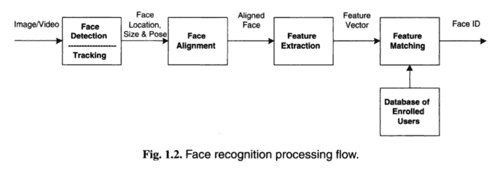

# 面向人脸识别的深度学习入门

> 原文：<https://machinelearningmastery.com/introduction-to-deep-learning-for-face-recognition/>

最后更新于 2019 年 7 月 5 日

人脸识别是通过人脸来识别和验证照片中的人的问题。

这是一项由人类轻而易举地完成的任务，即使在不同的光线下，当面部因年龄而改变或被配饰和面部毛发遮挡时也是如此。然而，直到最近几十年，它仍然是一个具有挑战性的计算机视觉问题。

深度学习方法能够利用非常大的人脸数据集，学习丰富而紧凑的人脸表示，允许现代模型首先表现良好，然后超越人类的人脸识别能力。

在这篇文章中，你将发现人脸识别的问题，以及深度学习方法如何达到超人的表现。

看完这篇文章，你会知道:

*   人脸识别是一个广泛的识别或验证照片和视频中的人的问题。
*   人脸识别是一个由检测、对齐、特征提取和识别任务组成的过程
*   深度学习模型首先接近，然后超过了人脸识别任务的人类表现。

**用我的新书[计算机视觉深度学习](https://machinelearningmastery.com/deep-learning-for-computer-vision/)启动你的项目**，包括*分步教程*和所有示例的 *Python 源代码*文件。

我们开始吧。

人脸识别深度学习入门
图片由[苏珊·尼尔森](https://www.flickr.com/photos/infomastern/24928560891/)提供，版权所有。

## 概观

本教程分为五个部分；它们是:

1.  照片中的脸
2.  自动人脸识别过程
3.  人脸检测任务
4.  人脸识别任务
5.  人脸识别的深度学习

## 照片中的脸

经常需要自动识别照片中的人。

有很多原因可以让我们自动识别照片中的人。

例如:

*   我们可能希望将对资源的访问限制在一个人，称为面部认证。
*   我们可能想确认这个人与他们的身份证匹配，这叫做面部验证。
*   我们可能想给一张脸起一个名字，叫做脸识别。

一般来说，我们称之为“自动”*人脸识别*的问题，它可能适用于静态照片或视频流中的人脸。

人类可以非常容易地完成这项任务。

我们可以在图像中找到人脸，并评论这些人是谁，如果他们知道的话。我们可以很好地做到这一点，比如当人们变老了，戴着太阳镜，有不同颜色的头发，看着不同的方向，等等。我们可以做得很好，以至于我们可以在没有人脸的地方找到人脸，比如在云层中。

然而，即使经过 60 年或更长时间的研究，这仍然是软件自动执行的一个难题。直到最近。

> 例如，识别在光照和/或姿态变化的室外环境中获取的人脸图像仍然是一个很大程度上未解决的问题。换句话说，目前的系统离人类感知系统的能力还很远。

——[人脸识别:文献综述](https://dl.acm.org/citation.cfm?id=954342)，2003 年。

## 自动人脸识别过程

人脸识别是识别或验证照片中人脸的问题。

> 人脸机器识别问题的一般陈述可以表述如下:给定场景的静止或视频图像，使用存储的人脸数据库识别或验证场景中的一个或多个人

——[人脸识别:文献综述](https://dl.acm.org/citation.cfm?id=954342)，2003 年。

人脸识别通常被描述为一个过程，首先涉及四个步骤；分别是:[人脸检测](https://machinelearningmastery.com/how-to-perform-face-detection-with-classical-and-deep-learning-methods-in-python-with-keras/)，人脸对齐，特征提取，最后是人脸识别。

1.  **人脸检测**。在图像中找到一个或多个面，并用边界框标记。
2.  **面对齐**。标准化面部，使其与数据库保持一致，例如几何和光度测量。
3.  **特征提取**。从面部提取可用于识别任务的特征。
4.  **人脸识别**。在准备好的数据库中，将人脸与一个或多个已知人脸进行匹配。

一个给定的系统对于每个步骤可以有一个单独的模块或程序，这是传统的情况，或者可以将一些或所有的步骤组合成一个单一的过程。

以下提供的《人脸识别手册》一书中提供了该过程的有用概述:

人脸识别过程步骤概述。摘自《人脸识别手册》，2011 年。

## 人脸检测任务

[人脸检测](https://machinelearningmastery.com/how-to-perform-face-detection-with-classical-and-deep-learning-methods-in-python-with-keras/)是人脸识别不平凡的第一步。

这是一个对象识别的问题，需要识别照片中每个面部的位置(例如位置)和面部的范围(例如用边界框)。对象识别本身是一个具有挑战性的问题，尽管在这种情况下，它是相似的，因为只有一种类型的对象，例如人脸，要被定位，尽管人脸可以变化很大。

> 人脸是一个动态的对象，其外观具有高度的可变性，这使得人脸检测成为计算机视觉中的一个难题。

——[人脸检测:一项调查](https://www.sciencedirect.com/science/article/pii/S107731420190921X)，2001。

此外，因为这是更广泛的人脸识别系统的第一步，人脸检测必须是鲁棒的。例如，如果无法首先检测到人脸，则无法识别该人脸。这意味着人脸必须通过各种方向、角度、光线水平、发型、帽子、眼镜、面部毛发、妆容、年龄等等来检测。

> 作为一个视觉前端处理器，人脸检测系统也应该能够实现这一任务，而不管光照、方向和相机距离如何

——[人脸检测:一项调查](https://www.sciencedirect.com/science/article/pii/S107731420190921X)，2001。

2001 年的论文标题为“[人脸检测:一项调查](https://www.sciencedirect.com/science/article/pii/S107731420190921X)”提供了人脸检测方法的分类，可大致分为两大类:

*   基于特征。
*   基于图像。

基于特征的人脸检测使用手工制作的过滤器，根据对该领域的深入了解来搜索和定位照片中的人脸。当过滤器匹配时，它们可以非常快速和非常有效，尽管当它们不匹配时，它们会显著失效，例如使它们变得有些脆弱。

> ……明确利用人脸知识，并遵循经典的检测方法，在基于知识的分析之前，先导出低层特征。在不同的系统级别上利用了面部的外观属性，例如肤色和面部几何形状。

——[人脸检测:一项调查](https://www.sciencedirect.com/science/article/pii/S107731420190921X)，2001。

或者，基于图像的人脸检测是整体性的，并且学习如何从整个图像中自动定位和提取人脸。神经网络适合这类方法。

> …将人脸检测作为一般的识别问题。基于图像的人脸表示，例如在 2D 强度阵列中，使用训练算法直接分类为人脸组，而无需特征推导和分析。[……]这些相对较新的技术通过映射和训练方案将人脸知识隐含地结合到系统中。

——[人脸检测:一项调查](https://www.sciencedirect.com/science/article/pii/S107731420190921X)，2001。

也许多年来用于人脸检测的主要方法(在许多相机中使用)在 2004 年的论文中有所描述，该论文的标题为“鲁棒实时对象检测”，“称为检测器级联或简称为“*级联”*

> 他们的检测器被称为检测器级联，由一系列简单到复杂的人脸分类器组成，吸引了广泛的研究。此外，探测器级联已被部署在许多商业产品中，如智能手机和数码相机。虽然级联检测器可以准确地找到可见的直立人脸，但它们通常无法从不同的角度检测人脸，例如侧视或部分遮挡的人脸。

——[使用深度卷积神经网络的多视角人脸检测](https://arxiv.org/abs/1502.02766)，2015。

有关人脸检测深度学习的教程，请参见:

*   [如何在 Keras 中进行深度学习的人脸检测](https://machinelearningmastery.com/how-to-perform-face-detection-with-classical-and-deep-learning-methods-in-python-with-keras/)

## 人脸识别任务

人脸识别的任务很广泛，可以根据预测问题的具体需要进行定制。

例如，在 1995 年发表的题为“人脸的人类和机器识别:一项调查”的论文中，作者描述了三项人脸识别任务:

*   **人脸匹配**:找到给定人脸的最佳匹配。
*   **人脸相似度**:查找与给定人脸最相似的人脸。
*   **人脸变换**:生成与给定人脸相似的新人脸。

他们将这三项独立的任务总结如下:

> 匹配要求候选匹配人脸图像在系统选择的某一组人脸图像中。除了匹配之外，相似性检测还要求找到与召回的人脸相似的人脸图像。这要求识别系统使用的相似性度量与人类使用的相似性度量紧密匹配。变换应用要求系统创建的新图像与人类对人脸的回忆相似。

——[人脸的人与机器识别:一项调查](https://ieeexplore.ieee.org/abstract/document/381842)，1995。

2011 年出版的名为《[人脸识别手册》](https://amzn.to/2EuR8Oo)的人脸识别书籍描述了人脸识别的两种主要模式，如下所示:

*   **人脸验证**。给定人脸与已知身份(例如*的一对一映射是这个人吗？*)。
*   **人脸识别**。给定人脸与已知人脸数据库的一对多映射(例如*这个人是谁？*)。

> 人脸识别系统有望自动识别图像和视频中的人脸。它可以在两种模式中的一种或两种模式下工作:(1)人脸验证(或认证)和(2)人脸识别(或识别)。

—第 1 页，[人脸识别手册](https://amzn.to/2EuR8Oo)。2011.

我们可以将人脸识别问题描述为在具有输入和输出的样本上训练的监督预测建模任务。

在所有任务中，输入是包含至少一张脸的照片，很可能是检测到的也可能已经对齐的脸。

输出因任务所需的预测类型而异；例如:

*   在人脸验证任务的情况下，它可以是二进制类别标签或二进制类别概率。
*   它可以是一个分类类别标签或一组人脸识别任务的概率。
*   在相似性类型任务的情况下，它可以是相似性度量。

## 人脸识别的深度学习

人脸识别一直是计算机视觉研究的一个活跃领域。

在 1991 年发表的题为“使用特征脸的人脸识别”的论文中，描述了一种更广为人知和采用的人脸识别“机器学习”方法他们的方法，简称为“T2”特征脸“T3”，是一个里程碑，因为它取得了令人印象深刻的结果，并展示了简单的整体方法的能力。

> 人脸图像被投影到特征空间(“人脸空间”)上，该特征空间对已知人脸图像之间的变化进行最佳编码。人脸空间由“特征脸”定义，特征脸是人脸集合的特征向量；它们不一定对应于孤立的特征，如眼睛、耳朵和鼻子

——[使用特征脸的人脸识别](https://www.computer.org/csdl/proceedings/cvpr/1991/2148/00/00139758.pdf)，1991 年。

2018 年发表的题为《[深度人脸识别:一项调查](https://arxiv.org/abs/1804.06655)》的论文对近 30 年来人脸识别的研究状况进行了有益的总结，强调了从整体学习方法(如特征脸)，到局部手工特征检测，到浅层学习方法，最后到目前最先进的深度学习方法的广泛趋势。

> 整体方法在 20 世纪 90 年代主导了人脸识别领域。2000 年代早期，手工制作的局部描述符开始流行，2000 年代后期引入了局部特征学习方法。[……][浅层学习法]表现从 60%左右稳步提升到 90%以上，而深度学习在短短三年内将表现提升到 99.80%。

——[深度人脸识别:一项调查](https://arxiv.org/abs/1804.06655)，2018。

鉴于 AlexNet 在 2012 年对更简单的图像分类问题的突破，2014 年和 2015 年出现了一系列关于人脸识别深度学习方法的研究和出版物。功能很快达到接近人类水平的表现，然后在三年内超过标准人脸识别数据集的人类水平表现，考虑到之前几十年的努力，这是一个惊人的改进速度。

人脸识别深度学习可能有四个里程碑式的系统推动了这些创新；它们是:DeepFace、DeepID 系列系统、VGGFace 和 FaceNet。让我们简要地讨论一下每一个。

DeepFace 是由 Yaniv Taigman 等人从[脸书 AI Research](https://research.fb.com/category/facebook-ai-research/) 和特拉维夫描述的基于深度卷积神经网络的系统。这在 2014 年的论文《T2 深度人脸:缩小人脸验证中与人类水平的差距》中有所描述这可能是使用深度学习进行人脸识别的第一次重大飞跃，在标准基准数据集上实现了接近人类水平的表现。

> 我们的方法在野生(LFW)数据集中的标记人脸上达到 97.35%的准确率，将当前技术水平的误差降低了 27%以上，接近人类水平的表现。

——[deep Face:缩小与人脸验证中人层面表现的差距](https://ieeexplore.ieee.org/document/6909616)，2014。

DeepID，或“T0”深藏身份特征，是一系列系统(如 DeepID、DeepID2 等)。)，最早由孙一等人在 2014 年发表的论文《从预测 10，000 个类中深度学习人脸表征》中描述他们的系统最初被描述得很像 DeepFace，尽管在随后的出版物中被扩展，通过对比损失的训练来支持识别和验证任务。

> 人脸识别的关键挑战是开发有效的特征表示，以减少个人内部的差异，同时扩大个人之间的差异。[……]人脸识别任务通过将从不同身份提取的 DeepID2 特征拉开来增加人与人之间的差异，而人脸验证任务通过将从同一身份提取的 DeepID2 特征拉到一起来减少人与人之间的差异，这两个特征对于人脸识别都是必不可少的。

——[联合识别验证深度学习人脸表示](https://papers.nips.cc/paper/5416-deep-learning-face-representation-by-joint-identification-verification.pdf)，2014。

DeepID 系统是第一批在任务中获得优于人类的表现的深度学习模型之一，例如 DeepID2 在野生(LFW)数据集中的[标记人脸上获得了 99.15%的表现，优于人类的表现为 97.53%。随后的系统，如 FaceNet 和 VGGFace，对这些结果进行了改进。](http://vis-www.cs.umass.edu/lfw/)

谷歌的 Florian Schroff 等人在 2015 年发表的题为“ [FaceNet:人脸识别和聚类的统一嵌入”](https://arxiv.org/abs/1503.03832)的论文中描述了 FaceNet 他们的系统取得了当时最先进的成果，并提出了一种被称为“T2”三重损失“T3”的创新，允许图像被有效地编码为特征向量，从而允许通过距离计算进行快速相似度计算和匹配。

> FaceNet，它直接学习从人脸图像到紧致欧氏空间的映射，其中距离直接对应于人脸相似性的度量。[……]我们的方法使用了经过训练的深度卷积网络来直接优化嵌入本身，而不是像以前的深度学习方法那样使用中间瓶颈层。为了进行训练，我们使用一种新的在线三元组挖掘方法生成的粗略对齐的匹配/不匹配人脸面片的三元组

——[Face net:人脸识别和聚类的统一嵌入](https://arxiv.org/abs/1503.03832)，2015。

有关 FaceNet 的教程，请参见:

*   [如何在 Keras 开发一个使用 FaceNet 的人脸识别系统](https://machinelearningmastery.com/how-to-develop-a-face-recognition-system-using-facenet-in-keras-and-an-svm-classifier/)

VGGFace(因为没有更好的名字)是由牛津大学视觉几何组(VGG)的 Omkar Parkhi 等人开发的，并在他们 2015 年发表的题为“[深度人脸识别](http://cis.csuohio.edu/~sschung/CIS660/DeepFaceRecognition_parkhi15.pdf)”的论文中进行了描述除了一个更好调整的模型，他们的工作重点是如何收集一个非常大的训练数据集，并使用它来训练一个非常深的 CNN 人脸识别模型，使他们能够在标准数据集上获得当时最先进的结果。

> …我们展示了如何通过自动化和人工的结合来组装一个非常大规模的数据集(2.6M 图像，超过 2.6K 人)

——[深度人脸识别](http://cis.csuohio.edu/~sschung/CIS660/DeepFaceRecognition_parkhi15.pdf)，2015 年。

有关 VGGFace 的教程，请参见:

*   [如何在 Keras 用 VGGFace2 进行人脸识别](https://machinelearningmastery.com/how-to-perform-face-recognition-with-vggface2-convolutional-neural-network-in-keras/)

尽管这些可能是计算机视觉深度学习领域的关键早期里程碑，但进展仍在继续，许多创新集中在损失函数上，以有效地训练模型。

优秀的最新总结见 2018 年论文《[深度人脸识别:一项调查》](https://arxiv.org/abs/1804.06655)

## 进一步阅读

如果您想更深入地了解这个主题，本节将提供更多资源。

### 书

*   [人脸识别手册](https://amzn.to/2EuR8Oo)，第二版，2011 年。

### 人脸识别论文

*   [人脸识别:文献综述](https://dl.acm.org/citation.cfm?id=954342)，2003。
*   [人脸检测:一项调查](https://www.sciencedirect.com/science/article/pii/S107731420190921X)，2001。
*   [人脸的人与机器识别:一项调查](https://ieeexplore.ieee.org/abstract/document/381842)，1995。
*   [鲁棒实时对象检测](https://link.springer.com/article/10.1023/B:VISI.0000013087.49260.fb)，2004。
*   [使用特征脸的人脸识别](https://www.computer.org/csdl/proceedings/cvpr/1991/2148/00/00139758.pdf)，1991。

### 深度学习人脸识别论文

*   [深度人脸识别:一项调查](https://arxiv.org/abs/1804.06655)，2018。
*   [深度人脸识别](http://cis.csuohio.edu/~sschung/CIS660/DeepFaceRecognition_parkhi15.pdf)，2015 年。
*   [FaceNet:人脸识别和聚类的统一嵌入](https://arxiv.org/abs/1503.03832)，2015。
*   [DeepFace:缩小与人脸验证中人层面表现的差距](https://ieeexplore.ieee.org/document/6909616)，2014。
*   [联合识别-验证深度学习人脸表征](https://papers.nips.cc/paper/5416-deep-learning-face-representation-by-joint-identification-verification.pdf)，2014。
*   [来自预测万类的深度学习人脸表征](https://dl.acm.org/citation.cfm?id=2679769)，2014。
*   [使用深度卷积神经网络的多视角人脸检测](https://arxiv.org/abs/1502.02766)，2015。
*   [从面部部位反应到人脸检测:深度学习方法](https://arxiv.org/abs/1509.06451)，2015。
*   [用 GaussianFace](https://arxiv.org/abs/1404.3840) 超越 LFW 的人类级人脸验证表现，2014。

### 文章

*   [面部识别系统，维基百科](https://en.wikipedia.org/wiki/Facial_recognition_system)。
*   [面部识别，维基百科](https://en.wikipedia.org/wiki/Facial_recognition)。
*   [人脸检测，维基百科](https://en.wikipedia.org/wiki/Face_detection)。
*   [野生数据集中的标记面](http://vis-www.cs.umass.edu/lfw/)

## 摘要

在这篇文章中，你发现了人脸识别的问题，以及深度学习方法如何达到超人的表现。

具体来说，您了解到:

*   人脸识别是一个广泛的识别或验证照片和视频中的人的问题。
*   人脸识别是一个由检测、对齐、特征提取和识别任务组成的过程
*   深度学习模型首先接近，然后超过了人脸识别任务的人类表现。

你有什么问题吗？
在下面的评论中提问，我会尽力回答。