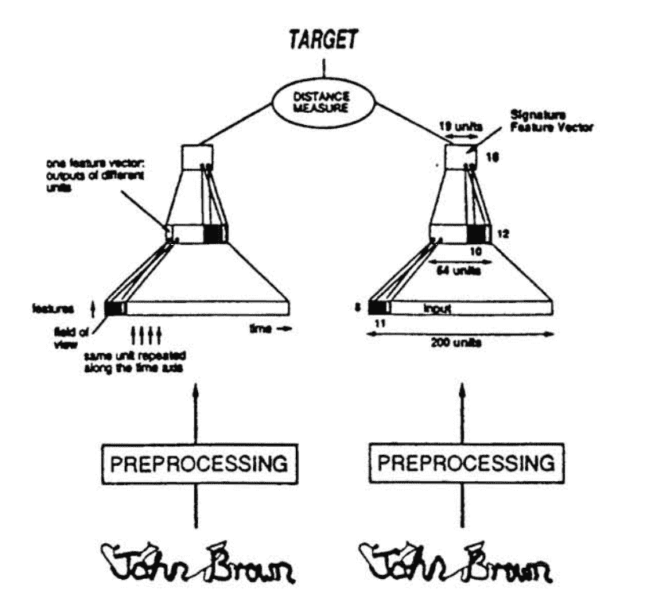
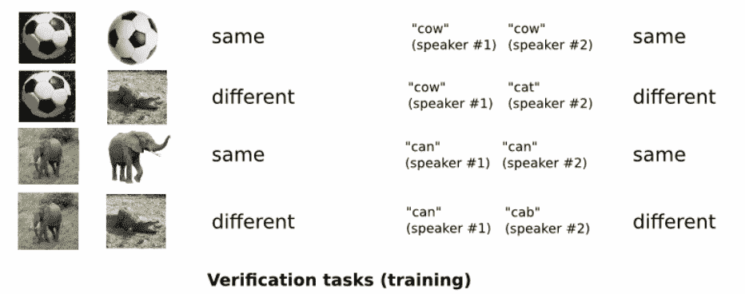
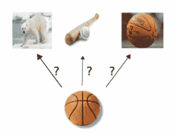
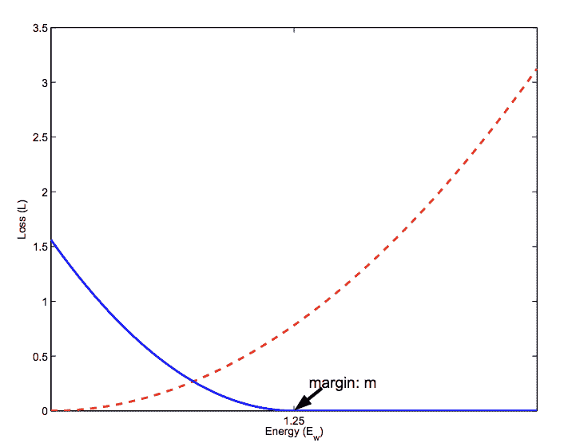
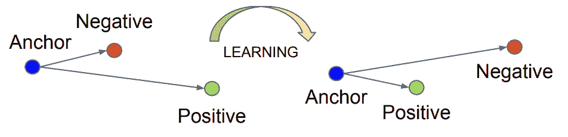

# 用于人脸识别的单样本学习

> 原文：<https://machinelearningmastery.com/one-shot-learning-with-siamese-networks-contrastive-and-triplet-loss-for-face-recognition/>

最后更新于 2020 年 6 月 11 日

单样本学习是一种分类任务，其中一个或几个示例用于对未来的许多新示例进行分类。

这是在[人脸识别](https://machinelearningmastery.com/introduction-to-deep-learning-for-face-recognition/)领域中看到的任务的特征，例如人脸识别和人脸验证，在这些任务中，人们必须在给定一张或几张模板照片的情况下，根据不同的面部表情、照明条件、配饰和发型进行正确分类。

现代人脸识别系统通过学习一种丰富的低维特征表示(称为人脸嵌入)来解决通过人脸识别进行单样本学习的问题，这种低维特征表示可以很容易地针对人脸进行计算，并在验证和识别任务中进行比较。

历史上，嵌入是使用暹罗网络为单样本学习问题学习的。具有比较损失函数的暹罗网络的训练导致了更好的表现，后来导致了谷歌在 FaceNet 系统中使用的三重损失函数，该函数在基准人脸识别任务上取得了当时最先进的结果。

在这篇文章中，你将发现人脸识别中单样本学习的挑战，以及如何使用比较和三重损失函数来学习高质量的人脸嵌入。

看完这篇文章，你会知道:

*   单样本学习是分类任务，给定每个类的一个(或几个)例子，需要进行许多预测，人脸识别就是单样本学习的例子。
*   暹罗网络是一种解决单样本学习的方法，其中将已知示例和候选示例的学习特征向量进行比较。
*   对比损失和后期三重损失函数可以用来学习高质量的人脸嵌入向量，为现代人脸识别系统提供基础。

**用我的新书[计算机视觉深度学习](https://machinelearningmastery.com/deep-learning-for-computer-vision/)启动你的项目**，包括*分步教程*和所有示例的 *Python 源代码*文件。

我们开始吧。

使用暹罗网络、对比和三连音丢失进行人脸识别的单样本学习
图片由[希斯·卡詹丁](https://www.flickr.com/photos/96228372@N06/47130775531/)提供，保留部分权利。

## 概观

本教程分为四个部分；它们是:

1.  单样本学习和人脸识别
2.  暹罗单样本学习网络
3.  降维的对比损失
4.  学习人脸嵌入的三重损失

## 单样本学习和人脸识别

典型地，分类包括拟合给定每个类的许多例子的模型，然后使用拟合模型对每个类的许多例子进行预测。

例如，我们可能有来自三个不同物种的成千上万的植物测量。一个模型可以适用于这些例子，从给定物种的测量值的共性中进行归纳，并对比不同物种测量值的差异。结果，希望，是一个稳健的模型，给定一套新的测量在未来，可以准确地预测植物物种。

单样本学习是一种分类任务，其中每个类给出一个例子(或非常少的例子)，用于准备一个模型，该模型反过来必须对未来许多未知的例子进行预测。

> 在单样本学习的情况下，一个对象类的单个样本被呈现给算法。

——[学习识别视觉对象类中的知识转移](http://vision.stanford.edu/documents/Fei-Fei_ICDL2006.pdf)，2006。

对于人类来说，这是一个相对容易的问题。例如，一个人可能会看到一辆法拉利跑车，在未来，能够在新的情况下，在路上，在电影中，在书籍中，以及在不同的灯光和颜色下识别法拉利。

> 人类在很少监督的情况下学习新概念——例如，一个孩子可以从一本书的一张图片中概括出“长颈鹿”的概念——然而，我们最好的深度学习系统需要成百上千个例子。

——[单样本学习的匹配网络](http://papers.nips.cc/paper/6385-matching-networks-for-one-shot-learning)，2017。

单样本学习与零样本学习既有联系又有区别。

> 这应该与零触发学习相区别，在零触发学习中，模型不能查看目标类的任何示例。

——[用于单次拍摄图像识别的暹罗神经网络](https://www.cs.cmu.edu/~rsalakhu/papers/oneshot1.pdf)，2015。

人脸识别任务提供了单样本学习的例子。

具体而言，在面部识别的情况下，模型或系统可能只有给定人的面部的一个或几个示例，并且必须从表情、发型、照明、配饰等发生变化的新照片中正确识别该人。

在人脸验证的情况下，一个模型或系统可能只有一个记录在案的人脸示例，并且必须正确验证该人的新照片，可能每天都要验证一次。

因此，人脸识别是单样本学习的一个常见例子。

## 暹罗单样本学习网络

暹罗网络是一种因其用于单样本学习而得到普及的网络。

暹罗网络是具有两个并行神经网络的体系结构，每个神经网络采用不同的输入，并且其输出被组合以提供一些预测。

这是一个为验证任务而设计的网络，由 Jane Bromley 等人在 1993 年发表的题为“使用暹罗时间延迟神经网络进行签名验证”的论文中首次提出

> 该算法基于一种新型的人工神经网络，称为“暹罗”神经网络。该网络由两个输出端相连的相同子网组成。

——[使用“暹罗”时延神经网络的签名验证](http://papers.nips.cc/paper/769-signature-verification-using-a-siamese-time-delay-neural-network.pdf)，1993 年。

使用两个相同的网络，一个获取该人的已知签名，另一个获取候选签名。两个网络的输出被组合并评分，以指示候选签名是真实的还是伪造的。

> 验证包括将提取的特征向量与签名者存储的特征向量进行比较。比所选阈值更接近该存储表示的签名被接受，所有其他签名作为伪造被拒绝。

——[使用“暹罗”时延神经网络的签名验证](http://papers.nips.cc/paper/769-signature-verification-using-a-siamese-time-delay-neural-network.pdf)，1993 年。

用于签名验证的暹罗网络示例。
摘自:使用“暹罗”时延神经网络的签名验证。

暹罗网络是最近才使用的，在 Gregory Koch 等人在 2015 年发表的题为“[用于单次图像识别的暹罗神经网络](https://www.cs.cmu.edu/~rsalakhu/papers/oneshot1.pdf)的论文中，深度卷积神经网络被用于并行图像输入。”

深度 CNN 首先被训练来区分每一类的例子。其思想是让模型学习能够有效地从输入图像中提取抽象特征的特征向量。

用于训练暹罗网络的图像验证示例。
取自:用于单镜头图像识别的暹罗神经网络。

然后，模型被重新用于验证，以预测新的例子是否与每个类的模板相匹配。

具体而言，每个网络产生输入图像的特征向量，然后使用 L1 距离和 sigmoid 激活对其进行比较。将该模型应用于计算机视觉中手写字符数据集的基准测试。

用于测试暹罗网络的一次性图像分类示例。
取自:用于单镜头图像识别的暹罗神经网络。

暹罗网络的有趣之处在于它通过学习特征表示(特征向量)来解决单样本学习的方法，然后将这些特征表示与验证任务进行比较。

使用暹罗网络开发的人脸识别系统的一个例子是 DeepFace，由 [Yaniv Taigman](https://research.fb.com/people/taigman-yaniv/) 等人在 2014 年题为“ [DeepFace:缩小人脸验证中与人类水平表现的差距](https://ieeexplore.ieee.org/document/6909616)的论文中描述

他们的方法包括首先训练用于人脸识别的模型，然后移除模型的分类器层，并使用激活作为特征向量，然后对两个不同的人脸进行计算和比较，用于人脸验证。

> 我们还测试了一种端到端的度量学习方法，称为暹罗网络:一旦被学习，人脸识别网络(没有顶层)将被复制两次(每个输入图像一次)，这些特征用于直接预测两个输入图像是否属于同一个人。

——[deep Face:缩小与人脸验证中人层面表现的差距](https://ieeexplore.ieee.org/document/6909616)，2014。

## 降维的对比损失

学习复杂输入的向量表示，如图像，是[降维](https://en.wikipedia.org/wiki/Dimensionality_reduction)的一个例子。

> 降维旨在将高维数据转换为低维表示，从而将相似的输入对象映射到流形上的邻近点。

——[通过学习不变映射进行降维](https://ieeexplore.ieee.org/abstract/document/1640964)，2006。

有效降维的目标是学习一种新的低维表示，它保留了输入的结构，使得输出向量之间的距离有意义地捕捉输入中的差异。然而，向量必须捕捉输入中的不变特征。

> 问题是在给定输入空间中样本之间的邻域关系的情况下，找到一个将高维输入模式映射到低维输出的函数。

——[通过学习不变映射进行降维](https://ieeexplore.ieee.org/abstract/document/1640964)，2006。

降维是暹罗网络用来解决单样本学习的方法。

在他们 2006 年题为“通过学习不变映射”的论文[降维中，](https://ieeexplore.ieee.org/abstract/document/1640964) [Raia Hadsell](http://raiahadsell.com/index.html) 等人探索使用暹罗网络和卷积神经网络对图像数据进行降维，并提出通过对比损失来训练模型。

不同于可能评估训练数据集中所有输入示例的模型表现的其他损失函数，对比损失是在输入对之间计算的，例如在提供给暹罗网络的两个输入之间。

成对的例子被提供给网络，并且损失函数基于样本的类别是相同还是不同来不同地惩罚模型。具体而言，如果类别相同，则损失函数促使模型输出更相似的特征向量，而如果类别不同，则损失函数促使模型输出不太相似的特征向量。

> 对比损失需要面部图像对，然后将正对拉在一起，将负对推开。[……]然而，对比损失的主要问题是保证金参数往往难以选择。

——[深度人脸识别:一项调查](https://arxiv.org/abs/1804.06655)，2018 年。

损失函数要求选择一个裕度，用于确定不同对的示例受到惩罚的限度。选择这个余量需要仔细考虑，这是使用损失函数的一个缺点。

相似(红色)和不相似(蓝色)对的对比损耗计算图。
取自:通过学习不变映射进行降维

对比损失可以用来训练一个人脸识别系统，专门用于人脸验证的任务。此外，这可以通过顺序提供成对的示例并在计算损失和更新模型之前保存预测的特征向量来实现，而不需要在暹罗网络架构中使用并行模型。

一个例子是 DeepID2 和后续系统(DeepID2+和 DeepID3)，它们使用深度卷积神经网络，但不是暹罗网络架构，并在基准人脸识别数据集上取得了当时最先进的结果。

> 验证信号直接调节深度 ID2，可以有效减少个体内部的差异。常用的约束包括 L1/L2 范数和余弦相似性。我们在 L2 范数的基础上采用了以下损失函数，它最初是由 Hadsell 等人提出的降维方法。

——[联合识别验证深度学习人脸表示](https://arxiv.org/abs/1406.4773)，2014。

## 学习人脸嵌入的三重损失

比较损失的概念可以从两个例子进一步扩展到三个，称为三重损失。

来自谷歌的 Florian Schroff 等人在他们 2015 年的论文《T2 人脸网:人脸识别和聚类的统一嵌入》中介绍了三重损失

三重损失不是基于两个例子来计算损失，而是涉及一个锚定例子和一个正的或匹配的例子(同一类)以及一个负的或不匹配的例子(不同类)。

损失函数惩罚模型，使得匹配示例之间的距离减小，而非匹配示例之间的距离增大。

> 它需要脸三元组，然后它最小化一个锚和相同身份的正样本之间的距离，最大化锚和不同身份的负样本之间的距离。

——[深度人脸识别:一项调查](https://arxiv.org/abs/1804.06655)，2018 年。

应用三重态损失前后对锚定、正和负的影响示例。
取自:Facenet:一种用于人脸识别和聚类的统一嵌入。

结果是一个特征向量，被称为“*人脸嵌入*”，其具有有意义的欧几里德关系，使得相似的人脸产生具有小距离的嵌入(例如，可以被聚类)，并且同一人脸的不同示例产生非常小的嵌入，并且允许与其他身份进行验证和区分。

这种方法被用作 FaceNet 系统的基础，该系统在基准人脸识别数据集上取得了当时最先进的结果。

> 在本文中，我们介绍了一个名为 FaceNet 的系统，该系统直接学习从人脸图像到紧致欧氏空间的映射，其中距离直接对应于人脸相似性的度量。

——[face net:人脸识别和聚类的统一嵌入](https://www.cv-foundation.org/openaccess/content_cvpr_2015/html/)，2015。

用来训练模型的三胞胎是精心挑选的。

容易的三元组，导致很小的损失，并且在更新模型时无效。取而代之的是，寻找鼓励改变模型和预测人脸嵌入的硬三元组。

> 选择使用哪一个三元组对取得好的表现非常重要，受课程学习的启发，我们提出了一种新颖的在线负样本挖掘策略，确保随着网络训练，三元组的难度不断增加。

——[face net:人脸识别和聚类的统一嵌入](https://www.cv-foundation.org/openaccess/content_cvpr_2015/html/)，2015。

三元组以在线方式生成，并且发现所谓的硬正(匹配)和硬负(不匹配)情况，并用于估计该批的损失。

> 重要的是选择硬三元组，它们是活跃的，因此可以有助于改进模型。

——[face net:人脸识别和聚类的统一嵌入](https://www.cv-foundation.org/openaccess/content_cvpr_2015/html/)，2015。

直接训练人脸嵌入的方法，如通过三重损失，并使用嵌入作为人脸识别和人脸验证模型的基础，如 FaceNet，是现代和最先进的人脸识别方法的基础。

> ……对于从零开始训练的模型以及预训练的模型，使用三元组损失的变体来执行端到端深度度量学习比大多数其他已发布的方法要优越得多。

——[为人身重新认定三重损失辩护](https://arxiv.org/abs/1703.07737)，2017 年。

## 进一步阅读

如果您想更深入地了解这个主题，本节将提供更多资源。

### 报纸

*   [学习识别视觉对象类中的知识转移](http://vision.stanford.edu/documents/Fei-Fei_ICDL2006.pdf)，2006。
*   [单样本学习的匹配网络](http://papers.nips.cc/paper/6385-matching-networks-for-one-shot-learning)，2017。
*   [用于单次拍摄图像识别的暹罗神经网络](https://www.cs.cmu.edu/~rsalakhu/papers/oneshot1.pdf)，2015。
*   [使用“暹罗”时延神经网络的签名验证](http://papers.nips.cc/paper/769-signature-verification-using-a-siamese-time-delay-neural-network.pdf)，1993 年。
*   [DeepFace:缩小与人脸验证中人层面表现的差距](https://ieeexplore.ieee.org/document/6909616)，2014。
*   [通过学习不变映射进行降维](https://ieeexplore.ieee.org/abstract/document/1640964)，2006。
*   [深度人脸识别:一项调查](https://arxiv.org/abs/1804.06655)，2018。
*   [联合识别-验证深度学习人脸表征](https://arxiv.org/abs/1406.4773)，2014。
*   [Facenet:人脸识别和聚类的统一嵌入](https://www.cv-foundation.org/openaccess/content_cvpr_2015/html/)，2015。
*   [为人身重新认定三重损失辩护](https://arxiv.org/abs/1703.07737)，2017 年。

### 文章

*   [单样本学习，维基百科](https://en.wikipedia.org/wiki/One-shot_learning)。
*   [暹罗网，维基百科](https://en.wikipedia.org/wiki/Siamese_network)。
*   [三联体丢失，维基百科](https://en.wikipedia.org/wiki/Triplet_loss)。

## 摘要

在这篇文章中，你发现了人脸识别中单样本学习的挑战，以及如何使用比较和三重损失函数来学习高质量的人脸嵌入。

具体来说，您了解到:

*   单样本学习是分类任务，给定每个类的一个(或几个)例子，需要进行许多预测，人脸识别就是单样本学习的例子。
*   暹罗网络是一种解决单样本学习的方法，其中将已知示例和候选示例的学习特征向量进行比较。
*   对比损失和后期三重损失函数可以用来学习高质量的人脸嵌入向量，为现代人脸识别系统提供基础。

你有什么问题吗？
在下面的评论中提问，我会尽力回答。