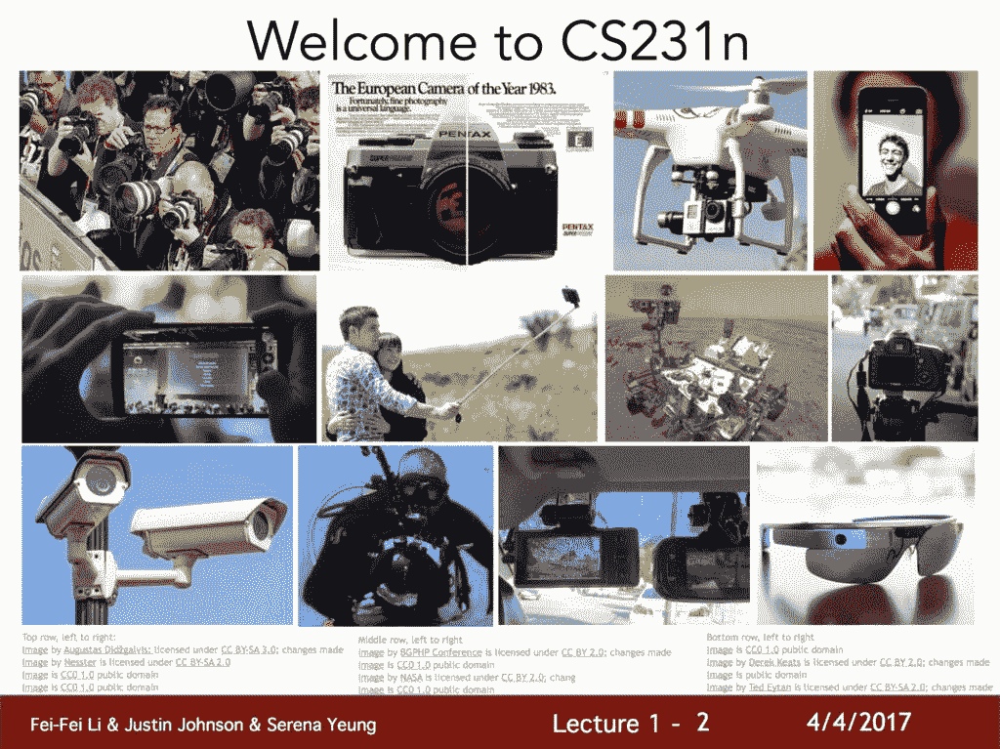
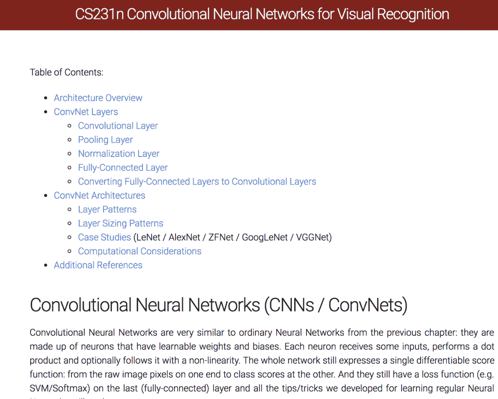

# 斯坦福卷积神经网络视觉识别课程（复习）

> 原文：<https://machinelearningmastery.com/stanford-convolutional-neural-networks-for-visual-recognition-course-review/>

最后更新于 2019 年 7 月 5 日

斯坦福大学的计算机视觉深度学习课程可能是这方面最广为人知的课程。

这并不奇怪，因为该课程已经运行了四年，由该领域的顶级学者和研究人员讲授，课程讲座和笔记免费提供。

对于学生和深度学习实践者来说，这是一个不可思议的资源。

在这篇文章中，你会发现这门课程的一个温和的介绍，你可以用它来用深度学习方法在计算机视觉上获得一个快速的开始。

看完这篇文章，你会知道:

*   课程的分类，包括谁教的，教了多久，涵盖了什么。
*   如果你已经熟悉深度学习，课程中的讲座包括三个重点讲座。
*   对课程的回顾，包括它与同一主题的类似课程的比较。

**用我的新书[计算机视觉深度学习](https://machinelearningmastery.com/deep-learning-for-computer-vision/)启动你的项目**，包括*分步教程*和所有示例的 *Python 源代码*文件。

我们开始吧。

## 概观

本教程分为三个部分；它们是:

1.  课程分解
2.  讲座分类
3.  讨论和回顾

## 课程分解

课程 CS231n 是一门关于计算机视觉的计算机科学课程，其神经网络名为“用于视觉识别的卷积神经网络”，在[斯坦福大学工程学院](https://engineering.stanford.edu/)授课

这门课程以其早期(在 AlexNet 突破三年后的 2015 年开始)和免费(提供视频和幻灯片)而闻名。

安德烈·卡普西(Andrej Karpathy)创造的有趣实验也让这门课程得到了推广，比如用 Javascript([Conventjs](https://cs.stanford.edu/people/karpathy/convnetjs/))演示计算机视觉问题的神经网络。

从入门讲座到 CS231n 课程的示例

在撰写本报告时，本课程已经运行了四年，其中每一年的大部分内容仍然可用:

*   2015: [首页](http://cs231n.stanford.edu/2015/)[教学大纲](http://cs231n.stanford.edu/2015/syllabus.html)
*   2016: [首页](http://cs231n.stanford.edu/2016/)[教学大纲](http://cs231n.stanford.edu/2016/syllabus.html)[视频](https://www.youtube.com/playlist?list=PLkt2uSq6rBVctENoVBg1TpCC7OQi31AlC)
*   2017: [首页](http://cs231n.stanford.edu/2017/)[教学大纲](http://cs231n.stanford.edu/2017/syllabus.html)[视频](https://www.youtube.com/playlist?list=PL3FW7Lu3i5JvHM8ljYj-zLfQRF3EO8sYv)
*   2018: [首页](http://cs231n.stanford.edu/)[教学大纲](http://cs231n.stanford.edu/syllabus.html)

该课程由费教授，他是斯坦福视觉实验室的著名计算机视觉研究员，最近在谷歌担任首席科学家。在 2015 年至 2016 年期间，该课程由现在特斯拉的[安德烈·卡普西](https://cs.stanford.edu/people/karpathy/)共同教授。[贾斯廷·约翰逊](https://cs.stanford.edu/people/jcjohns/)也从一开始就参与其中，并在 2017 年至 2018 年与[杨小威](http://ai.stanford.edu/~syyeung/)共同执教。

本课程的重点是卷积神经网络(CNNs)在计算机视觉问题中的应用，重点是 CNNs 的工作原理、图像分类和识别任务，以及生成模型和深度强化学习等高级应用的介绍。

> 本课程深入探讨深度学习架构的细节，重点学习这些任务的端到端模型，尤其是图像分类。

— [CS231n:用于视觉识别的卷积神经网络](http://cs231n.stanford.edu/)

## 讲座分类

在撰写本报告时，2018 年的视频尚未公开，但 2017 年的视频公开了。

因此，我们将重点关注 2017 年的教学大纲和视频内容。

*   【2017 年春季课程主页
*   【2017 年春季课程大纲
*   [春季 2017 播放 YouTube 播放列表](https://www.youtube.com/playlist?list=PLC1qU-LWwrF64f4QKQT-Vg5Wr4qEE1Zxk)

课程分为 16 场讲座，14 场涵盖课程主题，两场高级主题的客座讲座，以及一段不公开的学生演讲的最终视频。

下面提供了所有视频的完整列表及其链接:

*   [第一讲:视觉识别卷积神经网络介绍](https://www.youtube.com/watch?v=vT1JzLTH4G4&list=PL3FW7Lu3i5JvHM8ljYj-zLfQRF3EO8sYv&index=2&t=0s)
*   [第二讲:图像分类](https://www.youtube.com/watch?v=OoUX-nOEjG0&list=PL3FW7Lu3i5JvHM8ljYj-zLfQRF3EO8sYv&index=3&t=0s)
*   [第三讲:损失函数和优化](https://www.youtube.com/watch?v=h7iBpEHGVNc&list=PL3FW7Lu3i5JvHM8ljYj-zLfQRF3EO8sYv&index=4&t=0s)
*   [第四讲:神经网络导论](https://www.youtube.com/watch?v=d14TUNcbn1k&list=PL3FW7Lu3i5JvHM8ljYj-zLfQRF3EO8sYv&index=5&t=0s)
*   [第五讲:卷积神经网络](https://www.youtube.com/watch?v=bNb2fEVKeEo&list=PL3FW7Lu3i5JvHM8ljYj-zLfQRF3EO8sYv&index=6&t=0s)
*   [第六讲:训练神经网络，第一部分](https://www.youtube.com/watch?v=wEoyxE0GP2M&list=PL3FW7Lu3i5JvHM8ljYj-zLfQRF3EO8sYv&index=7&t=0s)
*   [第七讲:训练神经网络，第二部分](https://www.youtube.com/watch?v=_JB0AO7QxSA&list=PL3FW7Lu3i5JvHM8ljYj-zLfQRF3EO8sYv&index=8&t=0s)
*   [第八讲:深度学习软件](https://www.youtube.com/watch?v=6SlgtELqOWc&list=PL3FW7Lu3i5JvHM8ljYj-zLfQRF3EO8sYv&index=9&t=0s)
*   [第 9 讲:CNN 架构](https://www.youtube.com/watch?v=DAOcjicFr1Y&list=PL3FW7Lu3i5JvHM8ljYj-zLfQRF3EO8sYv&index=10&t=0s)
*   [第十讲:递归神经网络](https://www.youtube.com/watch?v=6niqTuYFZLQ&list=PL3FW7Lu3i5JvHM8ljYj-zLfQRF3EO8sYv&index=11&t=0s)
*   [第 11 讲:检测和分割](https://www.youtube.com/watch?v=nDPWywWRIRo&list=PL3FW7Lu3i5JvHM8ljYj-zLfQRF3EO8sYv&index=12&t=0s)
*   [第 12 讲:可视化和理解](https://www.youtube.com/watch?v=6wcs6szJWMY&list=PL3FW7Lu3i5JvHM8ljYj-zLfQRF3EO8sYv&index=13&t=0s)
*   [第十三讲:生成模型](https://www.youtube.com/watch?v=5WoItGTWV54&list=PL3FW7Lu3i5JvHM8ljYj-zLfQRF3EO8sYv&index=14&t=0s)
*   [第十四讲:深度强化学习](https://www.youtube.com/watch?v=lvoHnicueoE&list=PL3FW7Lu3i5JvHM8ljYj-zLfQRF3EO8sYv&index=15&t=1073s)
*   第 15 讲:
    *   [嘉宾演讲:特邀演讲:宋涵](https://www.youtube.com/watch?v=eZdOkDtYMoo&list=PL3FW7Lu3i5JvHM8ljYj-zLfQRF3EO8sYv&index=16&t=0s)
    *   [嘉宾演讲:特邀演讲:伊恩·古德费勒](https://www.youtube.com/watch?v=CIfsB_EYsVI&list=PL3FW7Lu3i5JvHM8ljYj-zLfQRF3EO8sYv&index=17&t=640s)
*   第 16 讲:学生聚光灯演讲，结论
    *   没有视频

不要忽视[课程大纲网页](http://cs231n.stanford.edu/2017/syllabus.html)。它包括有价值的材料，例如:

*   您可以在单独的浏览器选项卡中打开讲座的 PDF 幻灯片链接。
*   链接到讲座中讨论的论文，这些论文通常是必读的。
*   链接到 HTML 注释页面，包括方法和示例代码的详细描述。

通过课程大纲提供的超文本标记语言注释示例

### 经验丰富的从业者必看的讲座

也许你已经熟悉了神经网络和深度学习的基础知识。

在这种情况下，如果你想参加计算机视觉技术速成班，你不需要看所有的讲座。

讲座的必看清单如下:

*   **第五讲:卷积神经网络**。本次讲座将让您了解 CNN 层及其工作原理。
    *   [视频](https://www.youtube.com/watch?v=bNb2fEVKeEo&list=PL3FW7Lu3i5JvHM8ljYj-zLfQRF3EO8sYv&index=6&t=0s)
    *   [PDF 幻灯片](http://cs231n.stanford.edu/slides/2017/cs231n_2017_lecture5.pdf)
    *   [HTML ConvNet 笔记](https://cs231n.github.io/convolutional-networks/)
*   **第九讲:CNN 架构**。本讲座将帮助您了解流行的图像分类网络体系结构。
    *   [视频](https://www.youtube.com/watch?v=DAOcjicFr1Y&list=PL3FW7Lu3i5JvHM8ljYj-zLfQRF3EO8sYv&index=10&t=0s)
    *   [PDF 幻灯片](http://cs231n.stanford.edu/slides/2017/cs231n_2017_lecture9.pdf)
*   **第十一讲:检测与分割**。本讲座将帮助您了解图像分类和对象识别任务。
    *   [视频](https://www.youtube.com/watch?v=nDPWywWRIRo&list=PL3FW7Lu3i5JvHM8ljYj-zLfQRF3EO8sYv&index=12&t=0s)
    *   [PDF 幻灯片](http://cs231n.stanford.edu/slides/2017/cs231n_2017_lecture11.pdf)

这是最小的一组。

你可以多加三堂课，多得一点；它们是:

*   **第 12 讲:可视化和理解**。
    *   本讲座描述了理解 fit 模型所见或所学的方法。
*   **第十三讲:生成模型**。
    *   本讲座介绍了视频增强系统和图像扩充系统以及现代图像合成方法。
*   **第十四讲:深度强化学习**。
    *   这个讲座提供了深度强化学习方法的速成课程。

## 讨论和回顾

我已经看了这门课的所有视频，我想每年都会有。

最近，我花了两天时间(两个早上，2 倍的速度)看完了 2017 版课程的所有讲座，并做了大量笔记。我推荐这种方法，即使你是一个有经验的深度学习实践者。

我推荐这种方法有几个原因:

*   深度学习的领域正在迅速变化。
*   斯坦福是该领域的创新和卓越中心(例如视觉实验室)。
*   基础知识的重复会带来新的想法和见解。

尽管如此，如果你想通过对计算机视觉的深度学习来快速提高速度，上一节中建议的三个讲座是你应该走的路(例如讲座 5、9 和 11)。

这门课节奏极快。

它希望你能跟上，如果你没有得到什么，那就由你来暂停，然后去解决它。

这很公平，毕竟课程是在斯坦福大学，但它比其他课程不太友好，最著名的是吴恩达的 [DeepLearning.ai 卷积神经网络课程](https://www.youtube.com/playlist?list=PLkDaE6sCZn6Gl29AoE31iwdVwSG-KnDzF)。

因此，如果你需要一些手把手的东西，我不推荐这门课；选修另一门课程，因为它是为开发者设计的，而不是斯坦福的学生。

也就是说，你从世界顶级学者和研究生那里听到了关于 CNN 和现代方法是如何工作的，这是无价的。

事实上，这些视频是免费提供的，这对从业者来说是一个独特的机会。

## 进一步阅读

如果您想更深入地了解这个主题，本节将提供更多资源。

*   [CS231n:用于视觉识别的卷积神经网络，2018。](http://cs231n.stanford.edu/)
*   [CS231n:用于视觉识别的卷积神经网络，2017。](http://cs231n.stanford.edu/2017/)
*   [cs231 n 2017 年课表及教学大纲。](http://cs231n.stanford.edu/2017/syllabus.html)
*   [斯坦福大学 CS231n，2017 年春季，YouTube 播放列表](https://www.youtube.com/playlist?list=PLC1qU-LWwrF64f4QKQT-Vg5Wr4qEE1Zxk)
*   费飞李主页
*   [安德烈·卡尔帕西主页](https://cs.stanford.edu/people/karpathy/)
*   [贾斯廷·约翰逊主页](https://cs.stanford.edu/people/jcjohns/)
*   [杨小威主页](http://ai.stanford.edu/~syyeung/)
*   [斯坦福计算机科学课程的笔记和作业，GitHub](https://github.com/cs231n/cs231n.github.io)
*   【t0/cs231 n 次纬度】T1
*   convnetjs

## 摘要

在这篇文章中，你发现了这门课程的一个温和的介绍，你可以用它来用深度学习方法在计算机视觉上获得一个快速的开始。

具体来说，您了解到:

*   课程的分类，包括谁教的，教了多久，涵盖了什么。
*   课程中讲座的细分，包括如果你已经熟悉深度学习要重点关注的三个讲座。
*   对课程的回顾，包括它与同一主题的类似课程的比较。

你有什么问题吗？
在下面的评论中提问，我会尽力回答。