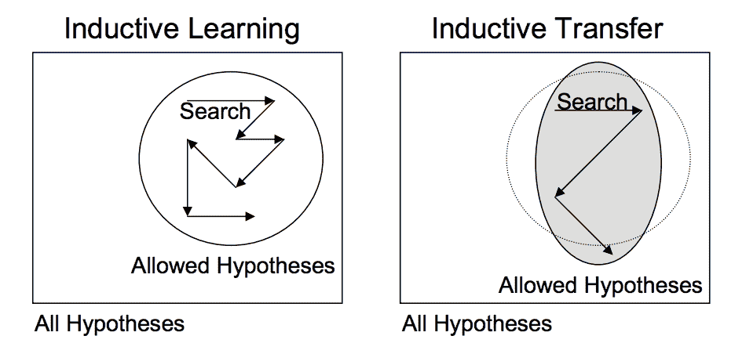
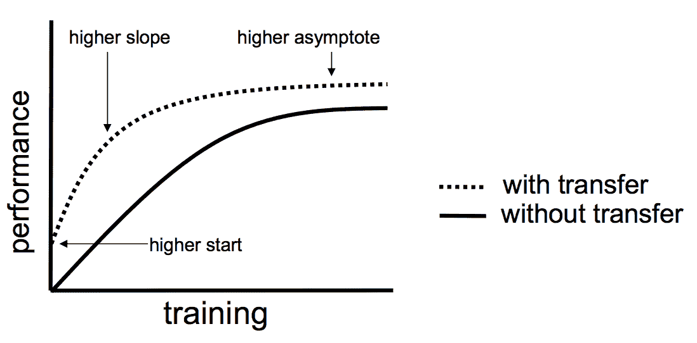

# 深度学习迁移学习入门

> 原文：<https://machinelearningmastery.com/transfer-learning-for-deep-learning/>

最后更新于 2019 年 9 月 16 日

迁移学习是一种机器学习方法，其中为一项任务开发的模型被重新用作第二项任务模型的起点。

这是深度学习中的一种流行方法，在这种方法中，预先训练的模型被用作计算机视觉和自然语言处理任务的起点，因为开发这些问题的神经网络模型需要大量的计算和时间资源，并且它们在相关问题上提供了巨大的技能提升。

在这篇文章中，您将发现如何使用迁移学习来加快培训并提高深度学习模型的表现。

看完这篇文章，你会知道:

*   什么是迁移学习，如何使用。
*   深度学习中迁移学习的常见例子。
*   什么时候在你自己的预测建模问题上使用迁移学习。

**用我的新书[计算机视觉深度学习](https://machinelearningmastery.com/deep-learning-for-computer-vision/)启动你的项目**，包括*分步教程*和所有示例的 *Python 源代码*文件。

我们开始吧。

有关如何在计算机视觉中使用迁移学习的示例，请参见帖子:

*   [用计算机视觉模型在 Keras 中进行迁移学习](https://machinelearningmastery.com/how-to-use-transfer-learning-when-developing-convolutional-neural-network-models/)

深度学习迁移学习简介
图片由[迈克的鸟](https://www.flickr.com/photos/pazzani/8819602488/)提供，版权所有。

## 什么是迁移学习？

迁移学习是一种机器学习技术，其中在一个任务上训练的模型被重新用于第二个相关任务。

> 迁移学习和领域适应指的是这样一种情况，即在一种环境中所学的知识被用来提高在另一种环境中的概括能力

—第 526 页，[深度学习](https://amzn.to/2fwdoKR)，2016。

迁移学习是一种优化，当对第二个任务建模时，它允许快速进步或提高表现。

> 迁移学习是通过从已经学习过的相关任务中转移知识来改进新任务中的学习。

——[第 11 章:迁移学习](ftp://ftp.cs.wisc.edu/machine-learning/shavlik-group/torrey.handbook09.pdf)，[机器学习应用研究手册](https://amzn.to/2fgeVro)，2009。

迁移学习与多任务学习和概念漂移等问题有关，不仅仅是深度学习的研究领域。

然而，考虑到训练深度学习模型所需的巨大资源或训练深度学习模型所基于的庞大且具有挑战性的数据集，迁移学习在深度学习中很受欢迎。

如果从第一个任务中学到的模型特征是通用的，那么迁移学习只在深度学习中起作用。

> 在转移学习中，我们首先在基础数据集和任务上训练一个基础网络，然后我们重新调整所学习的特征的用途，或者将它们转移到第二个目标网络，在目标数据集和任务上进行训练。如果特性是通用的，即既适用于基础任务又适用于目标任务，而不是特定于基础任务，那么这个过程将会起作用。

——[深度神经网络中的特征是如何转移的？](https://arxiv.org/abs/1411.1792)

深度学习中使用的这种迁移学习形式称为归纳迁移。这是可能模型(模型偏差)的范围通过使用适合不同但相关任务的模型以有益的方式缩小的地方。

归纳迁移的描述
摘自《迁移学习》

## 如何使用迁移学习？

你可以在自己的[预测建模](https://machinelearningmastery.com/gentle-introduction-to-predictive-modeling/)问题上使用迁移学习。

两种常见的方法如下:

1.  开发模型方法
2.  预训练模型方法

### 开发模型方法

1.  **选择源任务**。您必须选择具有大量数据的相关预测建模问题，其中输入数据、输出数据和/或在从输入数据到输出数据的映射过程中学习到的概念之间存在某种关系。
2.  **开发源码模型**。接下来，你必须为第一个任务开发一个熟练的模型。该模型必须优于天真模型，以确保已经执行了一些特征学习。
3.  **复用模型**。然后，源任务上的模型拟合可以用作感兴趣的第二个任务上的模型的起点。这可能涉及使用模型的全部或部分，这取决于所使用的建模技术。
4.  **调谐型号**。可选地，模型可能需要根据感兴趣的任务可用的输入输出对数据进行调整或细化。

### 预训练模型方法

1.  **选择源型号**。从可用模型中选择预先训练的源模型。许多研究机构在大型且具有挑战性的数据集上发布模型，这些数据集可能包含在可供选择的候选模型池中。
2.  **复用模型**。然后，模型预训练模型可以用作感兴趣的第二个任务的模型的起点。这可能涉及使用模型的全部或部分，这取决于所使用的建模技术。
3.  **调谐型号**。可选地，模型可能需要根据感兴趣的任务可用的输入输出对数据进行调整或细化。

这第二种类型的迁移学习在深度学习领域很常见。

## 深度学习迁移学习的例子

让我们用两个带有深度学习模型的迁移学习的常见例子来具体说明这一点。

### 利用图像数据进行迁移学习

利用使用图像数据作为输入的预测建模问题来执行转移学习是很常见的。

这可能是一个以照片或视频数据作为输入的预测任务。

对于这些类型的问题，通常使用为大型且具有挑战性的图像分类任务预先训练的深度学习模型，例如 [ImageNet](http://www.image-net.org/) 1000 级照片分类竞赛。

为这个竞赛开发模型并且做得很好的研究组织经常在许可的许可下发布他们的最终模型以供重用。这些模型可能需要几天或几周的时间来训练现代硬件。

这些模型可以下载并直接合并到新模型中，新模型需要图像数据作为输入。

这类模型的三个例子包括:

*   [牛津 VGG 模型](http://www.robots.ox.ac.uk/~vgg/research/very_deep/)
*   [谷歌初始模型](https://github.com/tensorflow/models/tree/master/research/inception)
*   [微软 ResNet 模型](https://github.com/KaimingHe/deep-residual-networks)

更多示例，请参见 [Caffe 模型动物园](https://github.com/BVLC/caffe/wiki/Model-Zoo)分享更多预训练模型。

这种方法是有效的，因为图像是在大量照片上训练的，并且要求模型在相对大量的类上进行预测，这又要求模型有效地学习从照片中提取特征，以便在问题上表现良好。

在斯坦福大学的视觉识别卷积神经网络课程中，作者提醒要谨慎选择在新模型中使用多少预先训练好的模型。

> [卷积神经网络]特征在早期层中更通用，在后期层中更针对原始数据集

—转移学习，用于视觉识别的 [CS231n 卷积神经网络](https://cs231n.github.io/transfer-learning/)

### 利用语言数据进行迁移学习

在使用文本作为输入或输出的自然语言处理问题中，执行迁移学习是很常见的。

对于这些类型的问题，使用单词嵌入，即单词到高维连续向量空间的映射，其中具有相似含义的不同单词具有相似的向量表示。

存在有效的算法来学习这些分布式单词表示，并且对于研究组织来说，在许可的许可下发布在非常大的文本文档集上训练的预训练模型是常见的。

这类模型的两个例子包括:

*   [谷歌的 word2vec 模型](https://code.google.com/archive/p/word2vec/)
*   [斯坦福的手套模型](https://nlp.stanford.edu/projects/glove/)

这些分布式单词表示模型可以被下载并结合到深度学习语言模型中，或者将单词解释为输入，或者将单词生成为模型的输出。

在《自然语言处理深度学习》一书中，约夫·戈德堡提醒道:

> ……人们可以下载在大量文本上训练的预训练单词向量……………训练体系和底层语料库的差异对结果表示有很大影响，可用的预训练表示可能不是[您的]特定用例的最佳选择。

—第 135 页，[自然语言处理中的神经网络方法](https://amzn.to/2fwTPCn)，2017。

## 什么时候使用迁移学习？

迁移学习是一种优化，是节省时间或获得更好表现的捷径。

一般来说，在开发和评估模型之前，在领域中使用迁移学习是否有好处并不明显。

Lisa Torrey 和 Jude Shavlik 在[他们关于迁移学习的章节](https://amzn.to/2fgeVro)中描述了使用迁移学习时要寻找的三个可能的好处:

1.  **更高启动**。源模型的初始技能(在优化模型之前)比其他情况下要高。
2.  **更高的坡度**。在源模型的训练过程中，技能提高的速度比其他情况下更快。
3.  **更高的渐近线**。训练模型的收敛技巧比其他情况下更好。

迁移可能改善学习的三种方式。
摘自《迁移学习》。

理想情况下，你会看到成功应用迁移学习的三个好处。

如果您可以识别具有丰富数据的相关任务，并且您有资源为该任务开发模型并在您自己的问题上重用它，或者有一个预训练的模型可以用作您自己模型的起点，那么这是一种值得尝试的方法。

在一些你可能没有太多数据的问题上，迁移学习可以让你开发出你在没有迁移学习的情况下根本无法开发的技巧模型。

源数据或源模型的选择是一个开放的问题，可能需要领域专业知识和/或通过经验形成的直觉。

## 进一步阅读

如果您想更深入地了解这个主题，本节将提供更多资源。

### 教程

*   [开发卷积神经网络模型时如何使用迁移学习](https://machinelearningmastery.com/how-to-use-transfer-learning-when-developing-convolutional-neural-network-models/)
*   [如何使用预先训练好的 VGG 模型对照片中的对象进行分类](https://machinelearningmastery.com/use-pre-trained-vgg-model-classify-objects-photographs/)
*   [如何利用深度学习神经网络的迁移学习提高表现](https://machinelearningmastery.com/how-to-improve-performance-with-transfer-learning-for-deep-learning-neural-networks/)

### 书

*   [深度学习](https://amzn.to/2fwdoKR)，2016 年。
*   [自然语言处理中的神经网络方法](https://amzn.to/2fwTPCn)，2017。

### 报纸

*   [迁移学习调查](https://pdfs.semanticscholar.org/a25f/bcbbae1e8f79c4360d26aa11a3abf1a11972.pdf)，2010。
*   [第 11 章:迁移学习](ftp://ftp.cs.wisc.edu/machine-learning/shavlik-group/torrey.handbook09.pdf)，[机器学习应用研究手册](https://amzn.to/2fgeVro)，2009。
*   [深度神经网络中的特征是如何转移的？](https://arxiv.org/abs/1411.1792)

### 预训练模型

*   [牛津 VGG 模型](http://www.robots.ox.ac.uk/~vgg/research/very_deep/)
*   [谷歌初始模型](https://github.com/tensorflow/models/tree/master/research/inception)
*   [微软 ResNet 模型](https://github.com/KaimingHe/deep-residual-networks)
*   [谷歌的 word2vec 模型](https://code.google.com/archive/p/word2vec/)
*   [斯坦福的手套模型](https://nlp.stanford.edu/projects/glove/)
*   [Caffe 模型动物园](https://github.com/BVLC/caffe/wiki/Model-Zoo)

### 文章

*   [在维基百科上转移学习](https://en.wikipedia.org/wiki/Transfer_learning)
*   [迁移学习——机器学习的下一个前沿](http://ruder.io/transfer-learning/)，2017。
*   [转移学习，用于视觉识别的 CS231n 卷积神经网络](https://cs231n.github.io/transfer-learning/)
*   [迁移学习是如何工作的？Quora 上](https://www.quora.com/How-does-transfer-learning-work)

## 摘要

在这篇文章中，您发现了如何使用迁移学习来加快培训并提高深度学习模型的表现。

具体来说，您了解到:

*   什么是迁移学习，如何在深度学习中使用。
*   何时使用迁移学习。
*   用于计算机视觉和自然语言处理任务的迁移学习的例子。

你有什么问题吗？
在下面的评论中提问，我会尽力回答。