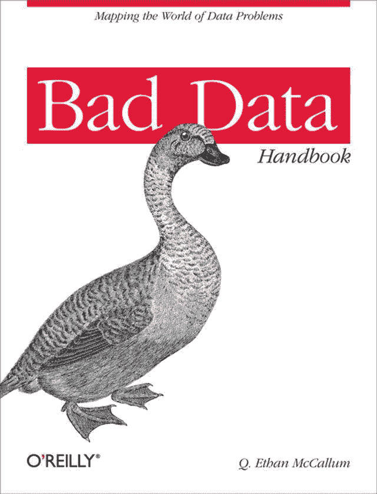
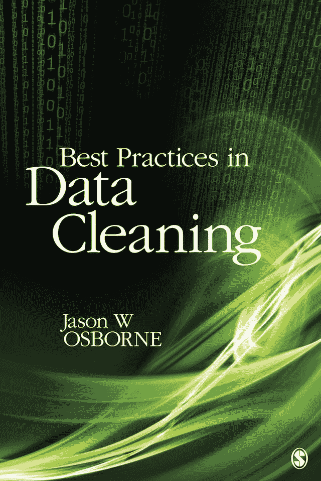
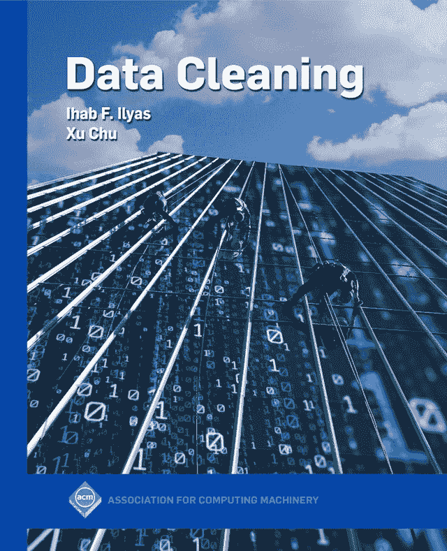
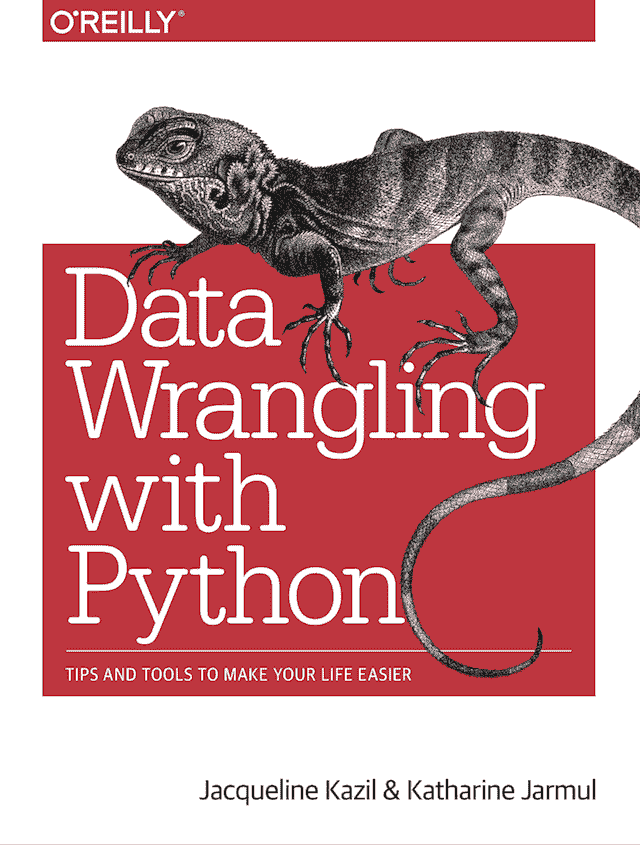
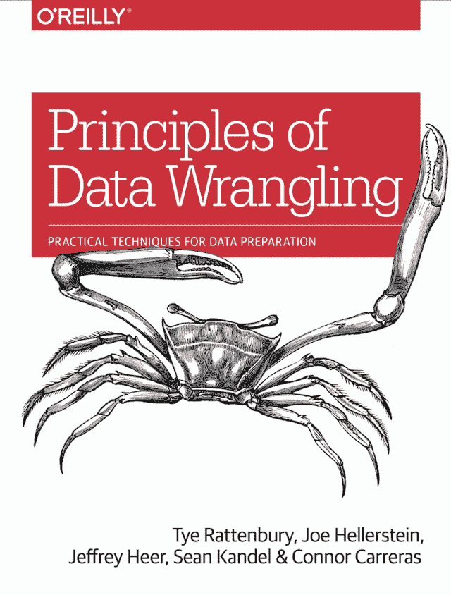
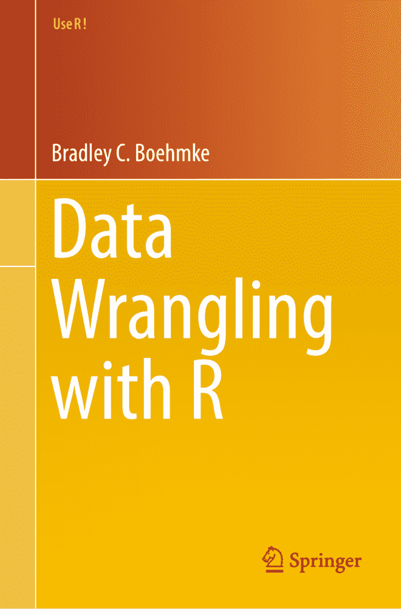

# 8 本关于数据清理和特征工程的顶级书籍

> 原文：<https://machinelearningmastery.com/books-on-data-cleaning-data-preparation-and-feature-engineering/>

数据准备是将原始数据转换成更适合建模的形式。

由于不同项目的数据在形式、类型和结构上有所不同，因此这是一个具有挑战性的讨论话题。

尽管如此，项目之间还是有一些常见的数据准备任务。这是一个庞大的研究领域，有许多名称，如“*数据清洗*”、“*数据扯皮*、“*数据预处理*、“*特征工程*”等等。其中一些是不同的数据准备任务，一些术语用于描述整个数据准备过程。

尽管这是一个很有挑战性的话题，但还是有很多关于这个话题的书。

在这篇文章中，你将发现关于数据清理、数据准备、特征工程和相关主题的顶级书籍。

我们开始吧。

**用我的新书[机器学习的数据准备](https://machinelearningmastery.com/data-preparation-for-machine-learning/)启动你的项目**，包括*分步教程*和所有示例的 *Python 源代码*文件。

## 概观

这里的重点是表格数据的数据准备，例如，表格形式的数据，在 excel 电子表格中有行和列。

数据准备是所有数据类型的重要主题，尽管每个类型都需要专业方法，例如计算机视觉中的图像数据、自然语言处理中的文本数据以及时间序列预测中的序列数据。

数据准备通常是机器学习教科书中的一章，尽管有专门针对该主题的书籍。我们将专注于这些书。

我收集了所有能找到的关于选题资料准备的书籍，挑选了我认为最好或更好的书籍，并将其组织成三组；它们是:

1.  数据清理
2.  数据争论
3.  特征工程

我会尽量给出每本书的味道，包括目标、目录，以及去哪里了解更多。

## 数据清理

数据清理是指在建模之前识别和修复数据中的错误，包括但不限于异常值、缺失值等等。

关于数据清理的顶级书籍包括:

*   [不良数据手册:清理数据，让你可以重新工作](https://amzn.to/3b5yutA)，2012。
*   [数据清理的最佳实践:收集数据前后需要做的一切的完整指南](https://amzn.to/35wjsvx)，2012 年。
*   [数据清理](https://amzn.to/2SARxFG)，2019 年。

让我们依次仔细看看每一个。

### 《不良数据手册》

《不良数据手册:清理数据让你可以重新工作》一书由[伊森·麦卡勒姆编辑，于 2012 年出版。](https://qethanm.cc/)

不良数据不仅被描述为损坏的数据，而且被描述为任何损害建模过程的数据。

> 很难确定“坏数据”的准确定义有些人认为这纯粹是一种动手操作的技术现象:缺少值、格式错误的记录和古怪的文件格式。当然，这只是一部分，但坏数据远不止这些。[……]不良数据是碍事的数据。

—第 1 页，“[不良数据手册:清理数据以便可以重新开始工作](https://amzn.to/3b5yutA)”，2012 年。

这是一个由 19 名机器学习实践者和我们收集的论文集，充满了关于数据准备和管理的有用信息。

不良数据手册

这本书的完整目录如下。

*   第 01 章:设定节奏:什么是坏数据？
*   第二章:是只有我，还是这个数据闻起来很好笑？
*   第三章:用于人类消费而非机器消费的数据
*   第四章:隐藏在纯文本中的不良数据
*   第五章:(重新)组织网络数据
*   第六章:发现骗子和矛盾网络评论中的困惑
*   第七章:坏数据请站起来好吗？
*   第八章:血、汗和尿
*   第九章:当数据和现实不符时
*   第十章:偏见和错误的微妙来源
*   第十一章:不要让完美成为好的敌人:坏数据真的坏吗？
*   第 12 章:当数据库受到攻击时:何时坚持使用文件的指南
*   第十三章:卧桌，隐藏网络
*   第 14 章:云计算的神话
*   第 15 章:数据科学的阴暗面
*   第 16 章:如何喂养和照顾你的机器学习专家
*   第 17 章:数据可追溯性
*   第十八章:社交媒体:可擦墨水？
*   第 19 章:数据质量分析揭秘:知道你的数据何时足够好

我很喜欢这本书；它充满了宝贵的实用建议。我强烈推荐！

了解更多信息:

*   [不良数据手册，亚马逊上](https://amzn.to/3b5yutA)。

### “数据清理的最佳实践”

《数据清理的最佳实践:收集数据前后需要做的所有事情的完整指南》一书由[杰森·奥斯本撰写，于 2012 年出版。](https://www.linkedin.com/in/jasonwosborne/)

这是一本关于基于计算的社会科学的数据准备的更通用的教科书，而不是专门的机器学习。然而，它包含了大量有用的建议。

> 我写这本书的目的是在一个地方收集我认为是数据清理最佳实践的系统概述，我可以证明这些东西对您的数据分析有所帮助。我寻求改变现状，改变社会科学定量研究的现状。

—第 2 页，“[数据清理的最佳实践:收集数据前后需要做的一切的完整指南”](https://amzn.to/35wjsvx)，2012 年。

数据清理的最佳实践

这本书的完整目录如下。

*   第一章:为什么数据清理很重要:揭穿健壮性神话
*   第二章:权力与数据收集规划:揭穿权力充足的神话
*   第三章:忠于目标人群:揭穿代表性神话
*   第四章:用概率采样框架使用大数据集:揭穿平等的神话
*   第五章:为潜在问题筛选你的数据:揭穿完美数据的神话
*   第六章:处理缺失或不完整的数据:揭穿空虚的神话
*   第七章:极端而有影响力的数据点:揭穿平等神话
*   第八章:通过 Box-Cox 变换提高变量的正态性:揭穿分布不相关的神话
*   第九章:可靠性重要吗？揭穿完美测量的神话
*   第十章:随机反应、动机错误反应和反应集:揭穿动机参与者的神话
*   第 11 章:为什么将连续变量二分很少是一个好的实践:揭穿分类的神话
*   第 12 章:清洁重复测量数据的特殊挑战:许多坑会掉进去
*   第 13 章:现在神话被揭穿了…:21 世纪理性量化方法论的愿景

我认为这是一般数据准备技术的一个很好的参考指南，考虑到更强的统计焦点，也许比大多数“机器学习”的书籍覆盖面更好。

了解更多信息:

*   [亚马逊上数据清理的最佳实践](https://amzn.to/35wjsvx)。

### “数据清理”

[数据清理](https://amzn.to/2SARxFG)一书由[伊哈布易勒雅斯](https://www.cc.gatech.edu/~xchu33/)[储旭](https://cs.uwaterloo.ca/~ilyas/)撰写，2019 年出版。

顾名思义，这本书专注于在建模之前修复原始数据错误的数据清理技术。

> 数据清理是指检测和修复数据中错误的各种任务和活动。在本书中，我们不关注特定的数据清理任务，而是概述了端到端数据清理过程，描述了各种错误检测和修复方法，并试图用多个分类法和视图来锚定这些建议。

—第 ixx 页，“[数据清理](https://amzn.to/2SARxFG)”，2019 年。

数据清理

这本书的完整目录如下。

*   第一章:引言
*   第二章:异常检测
*   第 3 章:重复数据消除
*   第四章:数据转换
*   第 5 章:数据质量规则定义和发现
*   第 6 章:基于规则的数据清理
*   第七章:机器学习和概率数据清洗
*   第八章:结论与未来思考

与其说它是一本实用的书，不如说它更像是一本教科书，非常适合那些既想回顾方法又想参考原始研究论文的学者和研究人员。

了解更多信息:

*   [数据清理，在亚马逊](https://amzn.to/2SARxFG)上。

## 数据争论

数据争论是数据准备的一个更通用或通俗的术语，可能包括一些数据清理和特征工程。

关于数据争论的顶级书籍包括:

*   [与 Python 的数据角力:让生活更轻松的技巧和工具](https://amzn.to/35DoLcU)，2016。
*   [数据角力原理:数据准备实用技术](https://amzn.to/3fjEGRZ)，2017。
*   [与 R](https://amzn.to/2z8NB8k) 的数据角力，2016 年。

让我们依次仔细看看每一个。

### “与 Python 的数据争论”

《与 Python 的数据角力:让你的生活更轻松的技巧和工具》一书由[杰奎琳·卡兹尔](https://www.linkedin.com/in/jackiekazil/)和[凯瑟琳·贾马尔](https://www.linkedin.com/in/katharinejarmul/)撰写，于 2016 年出版。

本书的重点是帮助您将原始数据转换成准备建模的表单的工具和方法。

> 数据争论是关于获取一个混乱的或未经提炼的数据源，并将其转化为有用的东西。

—第十二页，“[与 Python 的数据角力:让生活更轻松的技巧和工具](https://amzn.to/35DoLcU)”，2016 年。

这是一本初学者的书，适合那些初次使用 Python 进行数据准备和建模的人，例如当前的 excel 用户。

> 这本书是为那些想要探索桌面工具之外的数据争论的人准备的。如果你擅长 Excel，想让你的数据分析更上一层楼，这本书会有帮助的！

—第十二页，“[与 Python 的数据角力:让生活更轻松的技巧和工具](https://amzn.to/35DoLcU)”，2016 年。

与 Python 的数据争论

这本书的完整目录如下。

*   第一章:Python 简介
*   第二章:Python 基础
*   第三章:机器应该读取的数据
*   第四章:使用 Excel 文件
*   第五章:pdf 和 Python 中的问题解决
*   第 6 章:获取和存储数据
*   第 7 章:数据清理:调查、匹配和格式化
*   第八章:数据清理:标准化和脚本
*   第九章:数据探索与分析
*   第 10 章:展示您的数据
*   第 11 章:网页抓取:从网上获取和存储数据
*   第 12 章:高级网页抓取:屏幕抓取器和蜘蛛
*   第 13 章:原料药
*   第 14 章:自动化和扩展
*   第 15 章:结论

如果您刚开始使用 Python 进行数据加载和组织，这本书可以帮助您。

了解更多信息:

*   [与 Python 的数据角力，在亚马逊](https://amzn.to/35DoLcU)上。

### “数据争论的原则”

《数据角力的[原理:数据准备的实用技术》](https://amzn.to/3fjEGRZ)一书由 Tye Rattenbury 等人撰写，于 2017 年出版。

数据争论用于描述所有与为建模准备数据相关的任务。

> 诞生于现代敏捷分析背景下的“数据争论”一词，意在描述人们花在数据工作上的大部分时间。

—第九页，“[数据角力原理:数据准备实用技术](https://amzn.to/3fjEGRZ)”，2017。

数据争论的原则

这本书的完整目录如下。

*   第一章:引言
*   第二章:数据工作流框架
*   第三章:数据争论的动态
*   第 4 章:分析
*   第五章:转型:结构化
*   第六章:转型:丰富
*   第 7 章:使用转换清理数据
*   第八章:角色和责任
*   第九章:数据争论工具

这是一本好书，但水平很高。也许它更适合经理而不是从业者。例如，我想我没有看到一行代码。

了解更多信息:

*   [数据角力原理，在亚马逊](https://amzn.to/3fjEGRZ)上。

### “与 R 的数据争论”

《与 R 的[数据角力》一书由](https://amzn.to/2z8NB8k)[布拉德利·伯姆克](https://bradleyboehmke.github.io/)撰写，于 2016 年出版。

顾名思义，这本书专注于 r 的数据准备。

> 在这本书里，我将帮助你学习预处理数据的要点，利用 R 编程语言轻松快速地将有噪声的数据转化为可用的信息。

—第五页，[与 R](https://amzn.to/2z8NB8k) 的数据角力，2016。

这是一本实用的书。它有许多小的、重点突出的章节，其中有关于数据准备过程中会遇到的具体问题的代码示例。与本综述中的许多其他高级书籍相比，这是一个可喜的变化。

与 R 的数据争论

这本书的完整目录如下。

*   第一章:数据争论的作用
*   第二章:R 入门
*   第三章:基础
*   第四章:处理数字
*   第 5 章:处理字符串
*   第 6 章:处理正则表达式
*   第七章:处理因素
*   第八章:处理日期
*   第九章:数据结构基础
*   第 10 章:管理媒介
*   第 11 章:管理列表
*   第 12 章:管理矩阵
*   第 13 章:管理数据框
*   第 14 章:处理缺失值
*   第 15 章:导入数据
*   第 16 章:抓取数据
*   第 17 章:导出数据
*   第 18 章:功能
*   第 19 章:循环控制语句
*   第 20 章:用%>%简化代码
*   第 21 章:用 tidyr 重塑您的数据
*   第 22 章:使用 dplyr 转换您的数据

我是这本书的粉丝，如果你用的是 R，你需要一本。缺点是这本书里的 R 基础知识有点太多了。我宁愿这些被扔掉，读者被导向一本介绍性的 R 书，稍微提高对读者的要求。

了解更多信息:

*   [与 R 的数据角力，在亚马逊](https://amzn.to/2z8NB8k)上。

## 特征工程

特征工程指的是从原始数据创建新的输入变量，尽管它也指更一般的数据准备。

关于功能工程的顶级书籍包括:

*   [特征工程和选择:预测模型的实用方法](https://amzn.to/2Yvcupn)，2019。
*   [机器学习的特征工程:数据科学家的原理和技术](https://amzn.to/2zZOQXN)，2018。

让我们依次仔细看看每一个。

### “特征工程和选择”

《特征工程与选择:预测模型的实用方法》一书由[马克斯·库恩](https://www.linkedin.com/in/max-kuhn-864a9110/)和[谢尔·约翰逊](https://www.linkedin.com/in/kjell-johnson-9a65b33/)撰写，于 2019 年出版。

这本书描述了为特征工程建模准备原始数据的一般过程。

> 调整和改造预测因子，使模型更好地揭示预测因子-反应的关系，被称为特征工程。

—Xi，“特征工程和选择:预测模型的实用方法”，2019 年。

书中的例子是用 R 演示的，这很重要，因为作者 Max Kuhn 也是流行的 caret 包的创建者。

书中采取的一个重要观点是，数据准备不仅仅是满足建模算法的期望；需要最好地暴露问题的底层结构，需要反复试验和错误。这和我通常的观点是一样的，在一本现代书中看到它令人耳目一新。

> …我们通常不知道改善模型表现的预测因子的最佳再现。相反，预测器的重新工作更像是一门艺术，需要正确的工具和经验来找到更好的预测器表示。此外，我们可能需要搜索许多替代的预测器表示来提高模型表现。

—第十二页，“[特征工程和选择:预测模型的实用方法](https://amzn.to/2Yvcupn)”，2019 年。

特征工程与选择

这本书的完整目录如下。

*   第一章。介绍
*   第二章。示例:预测缺血性中风的风险
*   第三章。预测建模过程综述
*   第四章。探索性可视化
*   第五章。编码分类预测因子
*   第六章。工程数字预测器
*   第七章。检测交互效果
*   第八章。处理丢失的数据
*   第九章。使用配置文件数据
*   第十章。功能选择概述
*   第十一章。贪婪搜索方法
*   第十二章。全局搜索方法

我认为这是一本必须拥有的书，即使 R 不是你的主要语言。所讨论的方法的广度仅值标价。

了解更多信息:

*   [功能工程与选择，在亚马逊](https://amzn.to/2Yvcupn)上。

### “机器学习的特征工程”

《机器学习的[特征工程:数据科学家的原理与技术》](https://amzn.to/2zZOQXN)一书由[Alice Zheng](https://www.linkedin.com/in/alice-zheng-46b99482/)[Amanda Casari](https://www.linkedin.com/in/amcasari/)撰写，于 2018 年出版。

我认为这本书在我看过的所有书中有最直接的定义，将特征描述为模型和特征工程的数字输入，从原始数据中获得有用的数字特征。非常脆！

> 要素是原始数据的一个方面的数字表示。特征位于机器学习管道中的数据和模型之间。特征工程是从原始数据中提取特征并将它们转换成适合机器学习模型的格式的行为。

—第七页，“[机器学习的特征工程:数据科学家的原理和技术](https://amzn.to/2zZOQXN)”，2018。

这些例子是用 Python 编写的，重点是使用 NumPy 和 Pandas，并且有很多成功的例子，非常棒。我觉得这是一本相当于上面*“与 R* 的数据角力”或者*特征工程与选择*的好姐妹书或者 Python，“虽然可能覆盖面比较小。

机器学习的特征工程

这本书的完整目录如下。

*   第 1 章:机器学习管道
*   第二章:简单数字的花式把戏
*   第 3 章:文本数据:展平、过滤和分块
*   第四章:特征缩放的效果:从词袋到 Tf-Idf
*   第五章:分类变量:机器鸡时代的鸡蛋计数
*   第六章:降维:用主成分分析挤压数据饼
*   第七章:基于 K-均值模型叠加的非线性特征化
*   第 8 章:特征器自动化:图像特征提取和深度学习
*   第九章:回到未来:构建学术论文推荐系统
*   附录一:线性建模和线性代数基础

我喜欢这本书。

我想我更愿意放弃数学，直接把读者引向教科书。我也希望这些例子关注机器学习建模管道，而不是独立的转换。但是我很挑剔，并且在给定的项目中极力争取直接有用的代码。

了解更多信息:

*   [机器学习的特征工程，在亚马逊](https://amzn.to/2zZOQXN)上。

## 推荐

你必须根据你的需求选择适合你的书，例如代码或教科书，Python 或 r。

我拥有所有这些书，但我推荐的两本书是:

*   [特征工程和选择:预测模型的实用方法](https://amzn.to/2Yvcupn)，2019。
*   [机器学习的特征工程:数据科学家的原理和技术](https://amzn.to/2zZOQXN)，2018。

原因是我喜欢实用的书，当我想出该尝试什么的时候，我喜欢 R 和 Python 的视角。

一个密切的后续行动将是:

*   [与 R](https://amzn.to/2z8NB8k) 的数据角力，2016 年。
*   [不良数据手册:清理数据，让你可以重新工作](https://amzn.to/3b5yutA)，2012。

第一是超级实用；第二个充满了超级有用(但又超级具体)的建议。

对于大多数研究者需要参考的教科书，我可能会推荐:

*   [数据清理的最佳实践:收集数据前后需要做的一切的完整指南](https://amzn.to/35wjsvx)，2012 年。

## 摘要

在这篇文章中，你发现了关于数据清理、数据准备、特征工程和相关主题的顶级书籍。

**是不是错过了一本关于数据准备的好书？**
在下面的评论里告诉我。

**你读过列出的书吗？**
在评论中告诉我你对它的看法。