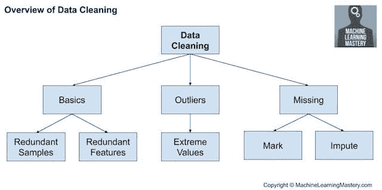
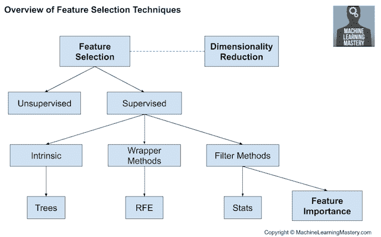
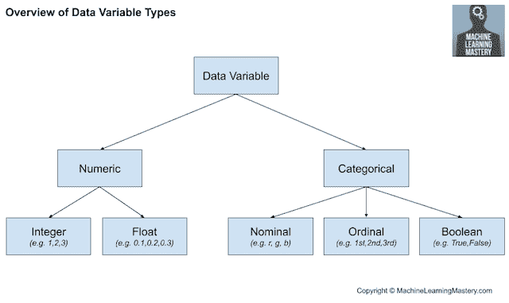
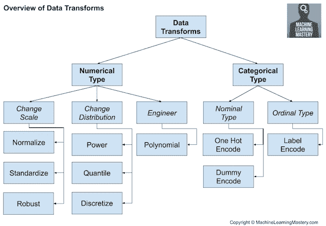
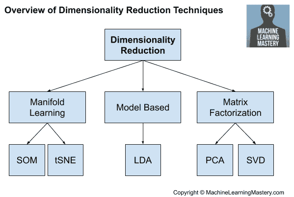

# 机器学习的数据准备技术之旅

> 原文：<https://machinelearningmastery.com/data-preparation-techniques-for-machine-learning/>

最后更新于 2020 年 6 月 30 日

预测建模机器学习项目，如分类和回归，总是涉及某种形式的数据准备。

数据集所需的具体数据准备取决于数据的具体情况，例如变量类型，以及用于建模它们的算法，这些算法可能会对数据提出期望或要求。

然而，有一组标准的数据准备算法可以应用于结构化数据(例如，像电子表格那样形成一个大表的数据)。这些数据准备算法可以按类型组织或分组到一个框架中，该框架在比较和选择特定项目的技术时很有帮助。

在本教程中，您将发现在预测建模机器学习任务中执行的常见数据准备任务。

完成本教程后，您将知道:

*   数据清理等技术可以识别和修复数据中的错误，如缺失值。
*   数据转换可以改变数据集中变量的规模、类型和概率分布。
*   特征选择和降维等技术可以减少输入变量的数量。

**用我的新书[机器学习的数据准备](https://machinelearningmastery.com/data-preparation-for-machine-learning/)启动你的项目**，包括*分步教程*和所有示例的 *Python 源代码*文件。

我们开始吧。

机器学习数据准备技术之旅
尼古拉斯·雷蒙德摄，版权所有。

## 教程概述

本教程分为六个部分；它们是:

1.  常见数据准备任务
2.  数据清理
3.  特征选择
4.  数据转换
5.  特征工程
6.  降维

## 常见数据准备任务

我们可以将数据准备定义为将原始数据转换为更适合建模的形式。

尽管如此，在预测建模项目中，在数据准备步骤之前和之后都有一些步骤是重要的，并且通知将要执行的数据准备。

应用机器学习的过程由一系列步骤组成。

我们可以在任何给定项目的步骤之间来回跳转，但是所有项目都有相同的一般步骤；它们是:

*   **第一步**:定义问题。
*   **第二步**:准备数据。
*   **第三步**:评估模型。
*   **第四步**:定型。

我们关注的是数据准备步骤(步骤 2)，在机器学习项目的数据准备步骤中，您可能会使用或探索一些常见或标准的任务。

如您所料，所执行的数据准备类型取决于您的数据。

然而，当您处理多个预测建模项目时，您会一次又一次地看到并需要相同类型的数据准备任务。

这些任务包括:

*   **数据清理**:识别并纠正数据中的错误或差错。
*   **特征选择**:识别那些与任务最相关的输入变量。
*   **数据转换**:改变变量的规模或分布。
*   **特征工程**:从可用数据中导出新变量。
*   **降维**:创建数据的紧凑投影。

这提供了一个粗略的框架，我们可以使用它来思考和导航不同的数据准备算法，我们可以考虑在一个给定的项目中使用结构化或表格数据。

让我们依次仔细看看每一个。

## 数据清理

[数据清理](https://machinelearningmastery.com/basic-data-cleaning-for-machine-learning/)涉及修复“*乱七八糟的*数据中的系统问题或错误。

最有用的数据清理涉及深厚的领域专业知识，并可能涉及识别和解决可能不正确的特定观察。

数据可能具有不正确值的原因有很多，例如输入错误、损坏、重复等等。领域专业知识可能允许明显错误的观察被识别，因为它们与预期的不同，例如一个人 200 英尺的高度。

一旦识别出混乱、嘈杂、腐败或错误的观察结果，就可以解决它们。这可能涉及删除一行或一列。或者，它可能涉及用新值替换观察值。

尽管如此，仍可以执行一般的数据清理操作，例如:

*   使用统计定义正常数据并识别异常值。
*   识别具有相同值或没有差异的列并删除它们。
*   识别重复的数据行并删除它们。
*   将空值标记为缺失。
*   使用统计或学习模型输入缺失值。

数据清理是一种通常在其他数据准备操作之前首先执行的操作。

数据清理概述

有关数据清理的更多信息，请参见教程:

*   [如何用 Python 进行机器学习的数据清洗](https://machinelearningmastery.com/basic-data-cleaning-for-machine-learning/)

## 特征选择

特征选择是指用于选择与被预测的目标变量最相关的输入特征子集的技术。

这一点很重要，因为不相关和冗余的输入变量会分散或误导学习算法，可能导致较低的预测表现。此外，希望仅使用进行预测所需的数据来开发模型，例如倾向于最简单的可能表现良好的模型。

特征选择技术通常分为使用目标变量的技术(有监督的**)和不使用目标变量的技术(无监督的**)。此外，监督技术可以进一步分为自动选择特征作为拟合模型的一部分的模型(**内在**)、明确选择导致最佳表现模型的特征的模型(**包装器**)以及对每个输入特征评分并允许选择子集的模型(**过滤器**)。****

****

特征选择技术综述

统计方法是对输入特征进行评分的常用方法，例如相关性。然后可以根据得分对特征进行排序，得分最大的子集用作模型的输入。统计度量的选择取决于输入变量的数据类型以及对可以使用的不同统计度量的审查。

有关如何基于数据类型选择统计要素选择方法的概述，请参见教程:

*   [如何选择机器学习的特征选择方法](https://machinelearningmastery.com/feature-selection-with-real-and-categorical-data/)

此外，在预测建模项目中，我们可能会遇到不同的常见特征选择用例，例如:

*   [分类目标变量的分类输入](https://machinelearningmastery.com/feature-selection-with-categorical-data/)。
*   分类目标变量的数字输入。
*   回归目标变量的数值输入。

当混合输入变量数据类型时，可以使用不同的过滤方法。或者，可以使用包装器方法，如流行的 RFE 方法，它与输入变量类型无关。

对输入特征的相对重要性进行评分的更广泛的领域被称为特征重要性，并且存在许多基于模型的技术，其输出可用于帮助解释模型、解释数据集或选择用于建模的特征。

有关特征重要性的更多信息，请参见教程:

*   [如何用 Python 计算特征重要性](https://machinelearningmastery.com/calculate-feature-importance-with-python/)

## 数据转换

数据转换用于改变数据变量的类型或分布。

这是一个不同技术的大伞，它们可以同样容易地应用于输入和输出变量。

回想一下，数据可能有几种类型之一，如**数值型**或**分类型**，每种类型都有子类型，如数值型的整型和实值型，分类型的标称型、序数型和布尔型。

*   **数值数据类型**:数值。
    *   **整数**:没有小数部分的整数。
    *   **实数**:浮点值。
*   **类别数据类型**:标签值。
    *   **序数**:具有等级顺序的标签。
    *   **标称**:无等级排序的标签。
    *   **布尔值**:值为真和假。

下图概述了高级数据类型的相同细分。

数据变量类型概述

我们可能希望在一个称为离散化的过程中将一个数值变量转换成一个序数变量。或者，我们可以将分类变量编码为整数或布尔变量，这是大多数分类任务所需要的。

*   **离散化变换**:将数值变量编码为序数变量。
*   **序数变换**:将分类变量编码为整数变量。
*   **一热变换**:将一个分类变量编码成二进制变量。

对于实值数值变量，它们在计算机中的表示方式意味着 0-1 范围内的分辨率比更宽范围的数据类型要高得多。因此，可能希望将变量缩放到这个范围，称为规范化。如果数据具有高斯概率分布，将数据转换为平均值为零、标准偏差为 1 的标准高斯可能更有用。

*   **归一化变换**:将变量缩放到 0 到 1 的范围。
*   **标准化变换**:将变量缩放为标准高斯。

数值变量的概率分布可以改变。

例如，如果分布接近高斯，但有偏斜或偏移，则可以使用幂变换使其更具高斯性。或者，可以使用分位数变换来强制概率分布，例如具有异常自然分布的变量的均匀分布或高斯分布。

*   **幂变换**:将一个变量的分布变得更高斯。
*   **分位数变换**:施加均匀或高斯等概率分布。

数据转换的一个重要考虑因素是，通常对每个变量分别执行操作。因此，我们可能希望对不同的变量类型执行不同的操作。

数据转换技术综述

我们将来可能还想在新数据上使用转换。这可以通过将变换对象与在所有可用数据上训练的最终模型一起保存到文件中来实现。

## 特征工程

特征工程是指从可用数据创建新输入变量的过程。

设计新功能是高度特定于您的数据和数据类型的。因此，它通常需要主题专家的协作来帮助识别可以从数据构建的新特征。

这种专门化使得推广到一般方法成为一个具有挑战性的话题。

然而，有一些技术是可以重用的，例如:

*   为某些状态添加布尔标志变量。
*   添加组或全局汇总统计信息，如平均值。
*   为复合变量的每个组成部分添加新的变量，例如日期时间。

从统计学中提取的一种流行方法是创建数字输入变量的副本，这些变量已经通过简单的数学运算进行了更改，例如将它们提升到幂或与其他输入变量相乘，称为多项式特征。

*   **多项式变换**:创建数值输入变量的副本，这些变量被提升到一个幂。

特征工程的主题是给单个观察增加更广泛的背景或者分解复杂的变量，两者都是为了提供一个更直接的输入数据的视角。

我喜欢把特征工程看作一种数据转换，尽管把数据转换看作一种特征工程也是合理的。

## 降维

数据集的输入特征的数量可以被认为是数据的维度。

例如，两个输入变量一起可以定义一个二维区域，其中每行数据定义该空间中的一个点。然后，这个想法可以扩展到任何数量的输入变量，以创建大型多维超体。

问题是，这个空间的维数越多(例如，输入变量越多)，数据集越有可能代表该空间的非常稀疏且可能不具有代表性的采样。这被称为维度的诅咒。

这激发了特征选择，尽管特征选择的替代方法是创建数据到低维空间的投影，该投影仍然保留原始数据的最重要属性。

这通常被称为[降维](https://machinelearningmastery.com/dimensionality-reduction-for-machine-learning/)，并提供了特征选择的替代方案。与特征选择不同，投影数据中的变量与原始输入变量没有直接关系，使得投影难以解释。

降维最常见的方法是使用矩阵分解技术:

*   主成分分析
*   奇异值分解

这些技术的主要影响是它们消除了输入变量之间的线性相关性，例如相关变量。

存在发现较低维度缩减的其他方法。我们可以称之为基于模型的方法，比如线性判别分析，也许还有自动编码器。

*   线性判别分析

有时也可以使用流形学习算法，例如科霍宁自组织映射和 t-SNE。

降维技术综述

有关降维，请参见教程:

*   [机器学习降维介绍](https://machinelearningmastery.com/dimensionality-reduction-for-machine-learning/)

## 进一步阅读

如果您想更深入地了解这个主题，本节将提供更多资源。

### 教程

*   [如何为机器学习准备数据](https://machinelearningmastery.com/how-to-prepare-data-for-machine-learning/)
*   [应用机器学习过程](https://machinelearningmastery.com/process-for-working-through-machine-learning-problems/)
*   [如何用 Python 进行机器学习的数据清洗](https://machinelearningmastery.com/basic-data-cleaning-for-machine-learning/)
*   [如何选择机器学习的特征选择方法](https://machinelearningmastery.com/feature-selection-with-real-and-categorical-data/)
*   [机器学习降维介绍](https://machinelearningmastery.com/dimensionality-reduction-for-machine-learning/)

### 书

*   [特征工程和选择:预测模型的实用方法](https://amzn.to/2VLgpex)，2019。
*   [应用预测建模](https://amzn.to/2VMhnat)，2013。
*   [数据挖掘:实用机器学习工具与技术](https://amzn.to/2Kk6tn0)，第 4 版，2016。

### 文章

*   [数据准备，维基百科](https://en.wikipedia.org/wiki/Data_preparation)。
*   数据清理，维基百科。
*   [数据预处理，维基百科](https://en.wikipedia.org/wiki/Data_pre-processing)。

## 摘要

在本教程中，您发现了在预测建模机器学习任务中执行的常见数据准备任务。

具体来说，您了解到:

*   数据清理等技术可以识别和修复数据中的错误，如缺失值。
*   数据转换可以改变数据集中变量的规模、类型和概率分布。
*   特征选择和降维等技术可以减少输入变量的数量。

**你有什么问题吗？**
在下面的评论中提问，我会尽力回答。****