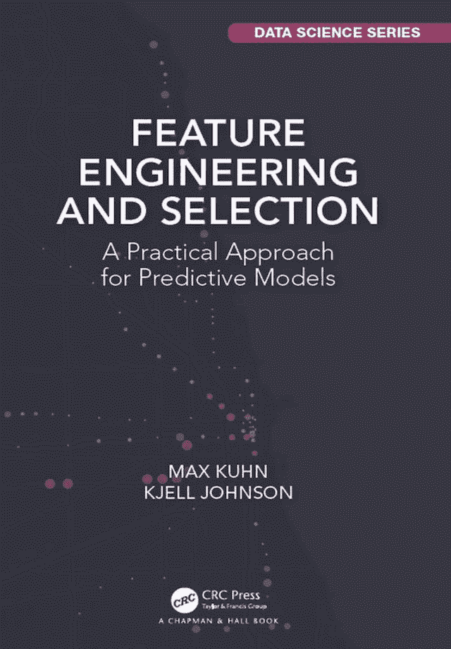

# 特征工程与选择（书评）

> 原文：<https://machinelearningmastery.com/feature-engineering-and-selection-book-review/>

最后更新于 2020 年 6 月 30 日

数据准备是将原始数据转化为学习算法的过程。

在某些情况下，为了以所需的输入格式向算法提供数据，数据准备是必需的步骤。在其他情况下，输入数据的最合适表示是未知的，必须以试错的方式进行探索，以便发现什么最适合给定的模型和数据集。

马克斯·库恩(Max Kuhn)和凯尔·约翰逊(Kjell Johnson)写了一本新书，重点介绍了数据准备这一重要主题，以及如何利用机器学习算法在预测建模项目中最大限度地利用您的数据。这本书的标题是“**特征工程和选择:预测模型的实用方法**”，于 2019 年发布。

在这篇文章中，你会发现我对《特征工程与选择》一书的回顾和分解，该书的主题是机器学习的数据准备。

让我们开始吧！

特征工程与选择(书评)

## 概观

本教程分为三个部分；它们是:

1.  特征工程与选择
2.  书的分解
3.  对这本书的最后思考

## 特征工程与选择

“[特征工程与选择:预测模型的实用方法](https://amzn.to/2VZgn4j)”是由[马克斯·库恩](https://www.linkedin.com/in/max-kuhn-864a9110/)和[谢尔·约翰逊](https://www.linkedin.com/in/kjell-johnson-9a65b33/)撰写并于 2019 年出版的一本书。

库恩和约翰逊是我最喜欢的一本关于实用机器学习的书的作者，该书名为《应用预测建模》，于 2013 年出版。而库恩也是机器学习的热门[脱字号 R 包](https://topepo.github.io/caret/index.html)的作者。因此，他们出版的任何一本书，我都会立即购买并吞食。

这本新书的重点是机器学习的数据准备问题。

作者强调，尽管拟合和评估模型是例行公事，但预测建模问题能否取得良好的表现在很大程度上取决于数据是如何准备的。

> 尽管我们试图遵循这些良好的实践，但我们有时会沮丧地发现，最佳模型的有用预测表现不如预期。这种表现的缺乏可能是由于……收集的相关预测值以模型难以获得良好表现的方式表示。

—Xi 页，“[特征工程与选择](https://amzn.to/2VZgn4j)”，2019。

它们将准备建模数据的过程称为“*特征工程*”

这和我习惯的定义略有不同。我会称之为“*数据准备*”或“*数据预处理*”并将“*特征工程*”分开作为一个子任务，专注于从现有数据创建新输入变量的系统步骤。

然而，我看到了它们的来源，因为所有的数据准备都符合这个定义。

> 调整和改造预测因子，使模型更好地揭示预测因子-反应的关系，被称为特征工程。

—Xi 页，“[特征工程与选择](https://amzn.to/2VZgn4j)”，2019。

他们指出，我们无法知道使用最合适的数据表示来实现最佳的预测建模表现，从而激发了这本书。

我们可能需要系统地测试一套表示，以便发现什么最有效。这与我通常推荐的经验方法相匹配，这种方法很少被讨论，尽管在教科书中看到令人欣慰。

> …我们通常不知道改善模型表现的预测因子的最佳再现。[……]我们可能需要搜索许多替代的预测器表示来提高模型表现。

—第十二页，“[特征工程与选择](https://amzn.to/2VZgn4j)”，2019 年。

鉴于数据准备对于在数据集上实现良好表现的重要性，本书重点强调了具体的数据准备技术以及如何使用这些技术。

> 特征工程和选择的目标是提供重新表示预测器的工具，将这些工具放在一个好的预测建模框架中，并传达我们在实践中使用这些工具的经验。

—第十二页，“[特征工程与选择](https://amzn.to/2VZgn4j)”，2019 年。

和他们之前的书一样，所有工作过的例子都在 R 中，在这种情况下，源代码可以从[书的 GitHub 项目](https://github.com/topepo/FES)中获得。

此外，与前一本书不同，这本书的全部内容也可以在网上免费获得:

*   [特征工程与选择，官网](http://www.feat.engineering/)。

接下来，让我们仔细看看这本书涵盖的主题。

## 书的分解

这本书分为 12 章

它们是:

*   **第一章**。介绍
*   **第二章**。示例:预测缺血性中风的风险
*   **第三章**。预测建模过程综述
*   **第四章**。探索性可视化
*   **第五章**。编码分类预测因子
*   **第六章**。工程数字预测器
*   **第七章**。检测交互效果
*   **第八章**。处理丢失的数据
*   **第九章**。使用配置文件数据
*   **第十章**。功能选择概述
*   **第十一章**。贪婪搜索方法
*   **第十二章**。全局搜索方法

让我们仔细看看每一章。

### 第一章。介绍

介绍性章节很好地概述了预测建模的挑战。

它首先强调了描述性模型和预测性模型之间的重要区别。

> …对特定值(如到达时间)的预测反映了一个估计问题，我们的目标不一定是了解趋势或事实是否真实，而是专注于对该值进行最准确的确定。预测中的不确定性是另一个重要的量，尤其是衡量模型生成的值的可信度。

—第 1 页，“[特征工程与选择](https://amzn.to/2VZgn4j)”，2019 年。

重要的是，这一章强调了数据准备的必要性，以便充分利用项目的预测模型。

> 在模型中有不同的方法来表示预测器，并且其中一些表示比其他的更好，这种想法导致了特征工程的想法——创建数据表示的过程，以提高模型的有效性。

—第 3 页，[特征工程与选择](https://amzn.to/2VZgn4j)，2019。

作为介绍，涵盖了许多您可能已经熟悉的基础主题，包括:

*   过拟合
*   监督和非监督程序
*   没有免费午餐
*   模型与建模过程
*   模型偏差和方差
*   经验驱动建模和经验驱动建模
*   大数据

我真的很喜欢他们指出预测建模过程的迭代本质。这不是其他地方经常讨论的数据传递。

> 在建模数据时，几乎从来没有一个单一的模型拟合或特征集可以立即解决问题。这个过程更有可能是一场反复试验以获得最佳结果的运动。

—第 16 页，“[特征工程与选择](https://amzn.to/2VZgn4j)”，2019 年。

我也很喜欢他们反复强调输入数据的所选表示对模型表现的影响，我们无法猜测给定的表示能让模型表现得多好。

> 特征集的影响可能比不同模型的影响大得多。模型和特性之间的相互作用是复杂的，有些不可预测。

—第 16 页，“[特征工程与选择](https://amzn.to/2VZgn4j)”，2019 年。

### 第二章。示例:预测缺血性中风的风险

顾名思义，本章旨在通过一个工作示例来具体说明预测建模的过程。

> 作为特征工程的入门，提供了一个带有建模过程的简短示例[……]为了说明起见，该示例将通过单个模型(逻辑回归)的镜头重点介绍探索、分析拟合和特征工程。

—第 21 页，[特征工程与选择](https://amzn.to/2VZgn4j)，2019。

### 第三章。预测建模过程综述

本章回顾了预测建模的过程，重点是数据准备如何以及在哪里适合这个过程。

它涵盖以下问题:

*   衡量绩效
*   数据分割
*   重采样
*   调整参数和过拟合
*   模型优化和调整
*   使用训练集比较模型
*   不过拟合的特征工程

本章的重要内容是，数据准备在流程中的应用至关重要，因为误用会导致数据泄露和过拟合。

> 为了使任何重采样方案产生推广到新数据的表现估计，它必须包含建模过程中可能显著影响模型有效性的所有步骤。

—第 54-55 页，“[特征工程与选择](https://amzn.to/2VZgn4j)”，2019 年。

解决方案是只在训练数据集上拟合数据准备，然后根据需要在测试集和其他数据集上应用拟合变换。当使用训练/测试分割和 [k 倍交叉验证](https://machinelearningmastery.com/k-fold-cross-validation/)时，这是预测建模的最佳实践。

> 为了提供一个可靠的方法，我们应该限制自己开发预处理技术的列表，仅在训练数据点存在的情况下估计它们，然后将这些技术应用于未来的数据(包括测试集)。

—第 55 页，“[特征工程与选择](https://amzn.to/2VZgn4j)”，2019 年。

### 第四章。探索性可视化

本章重点介绍数据准备之前要执行的一个重要步骤，即仔细查看数据。

作者建议使用数据可视化技术来首先理解被预测的目标变量，然后关注输入变量。然后，这些信息可以用来通知要探索的数据准备方法的类型。

> 当最终目的是预测响应时，探索性数据过程的第一步之一是创建可视化，帮助阐明响应的知识，然后揭示预测者和响应之间的关系。

—第 65 页，“[特征工程与选择](https://amzn.to/2VZgn4j)”，2019 年。

### 第五章。编码分类预测因子

这一章着重于总结定性信息的分类变量的替代表示。

> 分类或名义预测是那些包含定性数据

—第 93 页，“[特征工程与选择](https://amzn.to/2VZgn4j)”，2019 年。

分类变量可能具有等级顺序关系(序数)或者没有这种关系(名义)。

> 简单的分类变量也可以分为有序变量和无序变量。[……]有序和无序因素可能需要不同的方法来将嵌入的信息包含在模型中。

—第 93 页，“[特征工程与选择](https://amzn.to/2VZgn4j)”，2019 年。

这包括虚拟变量、散列和嵌入等技术。

### 第六章。工程数字预测器

这一章着重于总结定量信息的数字变量的替代表示。

> 本章的目的是开发工具，将这些类型的预测器转换成模型可以更好利用的形式。

—第 121 页，“[特征工程与选择](https://amzn.to/2VZgn4j)”，2019 年。

我们可以通过数值变量观察到许多众所周知的问题，例如:

*   变量有不同的尺度。
*   偏斜概率分布。
*   异常值或极值。
*   双峰分布。
*   复杂的相互关系。
*   多余的信息。

有趣的是，作者代表了一套由每种方法对输入变量的影响组织的技术。也就是说，该方法是对一个输入变量还是多个输入变量进行操作，并产生单个结果还是多个结果，例如:

*   一对一
*   一对多
*   多对多

这包括许多方法，例如数据缩放、幂变换和投影方法。

### 第七章。检测交互效果

本章集中讨论一个经常被忽视的主题，即研究变量如何在数据集中相互作用。

从技术上来说，相互作用是指那些变量在一起比单独考虑变量时或多或少有影响。

> 对于许多问题，响应中的额外变化可以用两个或多个预测器相互协同工作的效果来解释。[……]更正式地说，如果两个或两个以上的预测因子的综合效应不同于(小于或大于)我们在单独考虑时将它们各自效应的影响相加的预期，则称它们相互作用。

—第 157 页，“[特征工程与选择](https://amzn.to/2VZgn4j)”，2019 年。

在数据准备的背景下，这一主题经常被忽略，因为人们通常认为预测建模中使用的学习算法将学习有助于预测目标变量的变量之间的任何相关相互关系。

### 第八章。处理丢失的数据

本章重点讨论可用数据中[缺少观测值](https://machinelearningmastery.com/handle-missing-data-python/)的问题。

这是一个重要的主题，因为大多数数据都有缺失或损坏的值，或者如果数据集按比例扩大，就会有缺失或损坏的值。

> 缺失数据在真实数据集中并不罕见。

—第 157 页，“[特征工程与选择](https://amzn.to/2VZgn4j)”，2019 年。

在回顾了数据缺失的原因和有助于理解数据集中缺失值的范围的数据可视化之后，本章通过三个主要解决方案展开讨论:

*   删除缺少值的数据。
*   对缺失值进行编码，以便模型可以了解它们。
*   从可用数据中估计缺失值。

### 第九章。使用配置文件数据

本章提供了剖面数据的数据准备方法的案例研究。

它可能命名不当，但与不同规模的依赖数据有关，例如，如何对给定数据集(例如，分层结构)上的日/周/月范围的数据进行有用的数据准备。

> 由于目标是进行每日预测，日内天气测量的概况应该以某种方式在日水平上以保留潜在预测信息的方式进行总结。对于这个例子，每日特征可以包括数字数据的平均值或中间值，并且可能包括一天内的数值范围。

—第 205 页，“[特征工程与选择](https://amzn.to/2VZgn4j)”，2019 年。

恐怕我觉得这完全没意思。但我相信，对于目前从事这类数据工作的人来说，这将是最有趣的一章。

### 第十章。功能选择概述

本章将特征选择的需求作为最相关输入的选择，而不是被预测的目标变量。

> …有些可能与结果无关。[……]确实需要为建模适当地选择预测器。

—第 227 页，“[特征工程与选择](https://amzn.to/2VZgn4j)”，2019 年。

除了提升模型表现之外，选择更少的输入变量可以使模型更易于解释，尽管这通常是以牺牲模型技能为代价的。这是预测建模中常见的权衡。

> ……预测表现和可解释性之间往往存在权衡，通常不可能同时最大化两者。

—第 227 页，“[特征工程与选择](https://amzn.to/2VZgn4j)”，2019 年。

三种方法的框架用于组织特征选择方法，包括:

*   内在/隐含特征选择。
*   过滤特征选择。
*   包装特征选择。

> 特征选择方法分为三大类:内在(或隐含)方法、过滤方法和包装方法。

—第 228 页，“[特征工程与选择](https://amzn.to/2VZgn4j)”，2019 年。

剩下的两章也着重于特征选择。

### 第十一章。贪婪搜索方法

本章重点介绍一次评估一个要素，然后选择得分较高的要素子集的方法。

这包括计算输入和目标之间的统计关系强度的方法，以及重复从数据集中删除要素并在每个步骤评估模型的方法。

> 识别潜在预测性重要特征的简单方法是单独评估每个特征。[……]简单的过滤器是寻找个体预测因子的理想选择。然而，这种方法没有考虑到多个特性的影响。

—第 255 页，“[特征工程与选择](https://amzn.to/2VZgn4j)”，2019 年。

### 第十二章。全局搜索方法

本章重点介绍全局搜索算法，该算法根据适合这些特征的模型的表现来测试不同的特征子集。

> 全局搜索方法可以成为研究预测器空间和识别与响应最佳相关的预测器子集的有效工具。[……]虽然全局搜索方法通常能有效地找到好的特征集，但它们在计算上很费力。

—第 281 页，“[特征工程与选择](https://amzn.to/2VZgn4j)”，2019 年。

这包括众所周知的全局随机搜索算法，如模拟退火和遗传算法。

## 对这本书的最后思考

我认为这是数据准备方面急需的缺失教材。

我也认为，如果你是一个认真的机器学习实践者，你需要一个副本。

如果你对机器学习的 R 和 Python 都很熟悉，这本书强调了像 Python/Sklearn 这样的库要赶上 R/caret 生态系统还有多远。

说到数据准备，我认为工作示例不如演示算法时有用。也许只是我和我的喜好。考虑到每个数据集在数量、类型和要素组成方面的差异，在标准数据集上演示数据准备并不是一个有用的教学辅助工具。

我更喜欢的是更系统地涵盖我们在原始数据中可能看到的建模问题，以及每种数据准备方法如何解决这些问题。我喜欢一个长长的方法目录，它们是如何工作的，什么时候使用它们，而不是每种方法的散文。

无论如何，这只是我在努力推动如何让这本书变得更好，或者对材料的另一种看法。毫无疑问，这是必备的。

## 进一步阅读

如果您想更深入地了解这个主题，本节将提供更多资源。

*   [特征工程和选择:预测模型的实用方法](https://amzn.to/2VZgn4j)，2019。
*   [应用预测建模](https://amzn.to/3c1DGjo)，2013。
*   [特征工程与选择，官网](http://www.feat.engineering/)。
*   [功能工程与选择，GitHub](https://github.com/topepo/FES) 。

## 摘要

在这篇文章中，你发现了我对《特征工程与选择》一书的评论和分解，该书的主题是机器学习的数据准备。

你读过这本书吗？
在下面的评论中告诉我你对它的看法。

**你有什么问题吗？**
在下面的评论中提问，我会尽力回答。