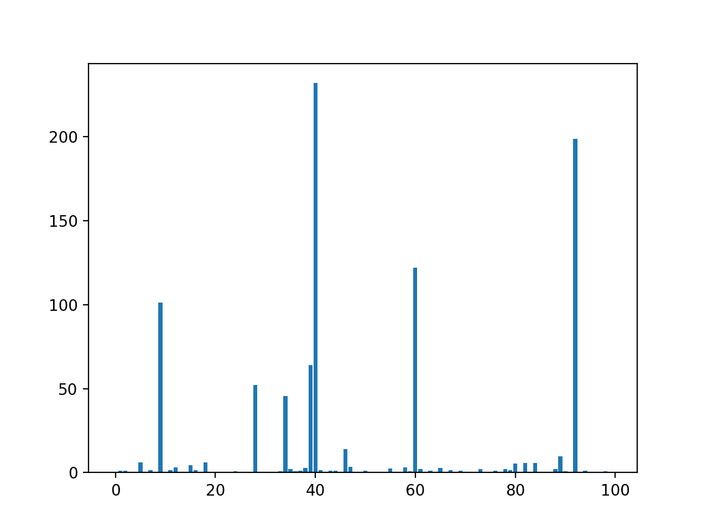
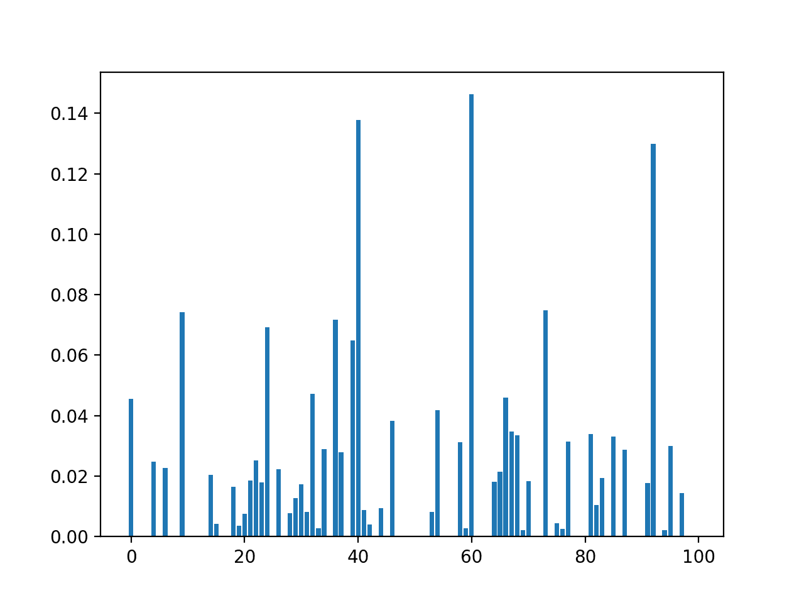
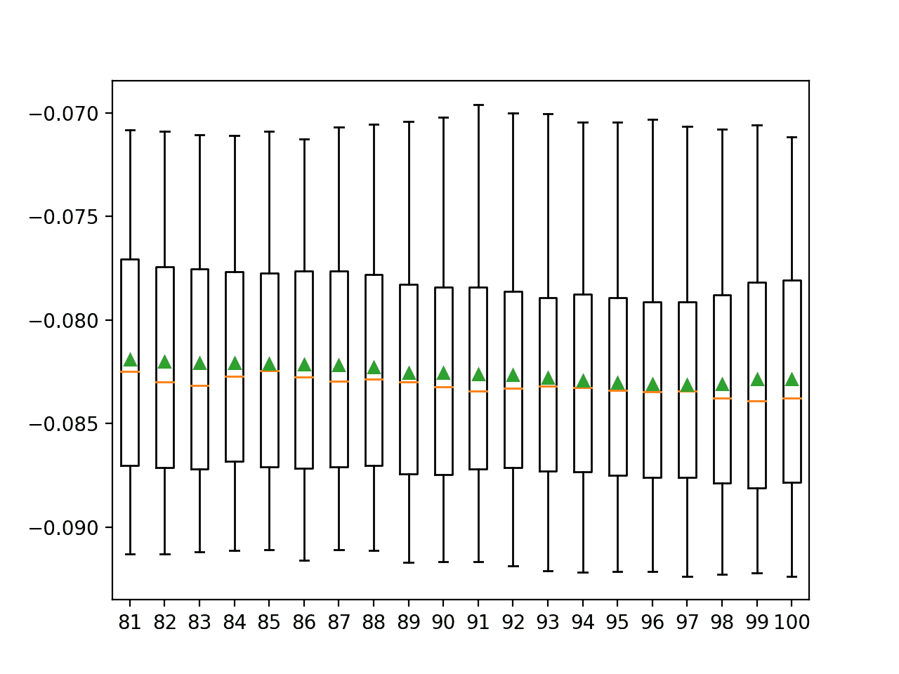

# 如何对回归数据执行特征选择

> 原文：<https://machinelearningmastery.com/feature-selection-for-regression-data/>

最后更新于 2020 年 8 月 18 日

**特征选择**是识别和选择与目标变量最相关的输入变量子集的过程。

也许特征选择最简单的情况是有数值输入变量和回归预测建模的数值目标的情况。这是因为可以计算每个输入变量和目标之间的关系强度，称为相关性，并相互进行比较。

在本教程中，您将了解如何使用回归预测建模的数字输入数据执行特征选择。

完成本教程后，您将知道:

*   如何利用相关和互信息统计评估数值输入数据的重要性？
*   拟合和评估回归模型时，如何对数值输入数据进行特征选择。
*   如何使用网格搜索调整建模管道中所选要素的数量。

**用我的新书[机器学习的数据准备](https://machinelearningmastery.com/data-preparation-for-machine-learning/)启动你的项目**，包括*分步教程*和所有示例的 *Python 源代码*文件。

我们开始吧。


如何对回归数据进行特征选择[丹尼斯·贾维斯](https://flickr.com/photos/archer10/44973439431/)摄，版权所有。

## 教程概述

本教程分为四个部分；它们是:

1.  回归数据集
2.  数字特征选择
    1.  相关特征选择
    2.  互信息特征选择
3.  使用选定特征建模
    1.  使用所有功能构建的模型
    2.  使用相关特征构建的模型
    3.  利用互信息特征建立的模型
4.  调整选定特征的数量

## 回归数据集

我们将使用合成回归数据集作为本教程的基础。

回想一下，回归问题是一个我们想要预测数值的问题。在这种情况下，我们需要一个也有数字输入变量的数据集。

Sklearn 库中的[make _ revolution()函数](https://Sklearn.org/stable/modules/generated/sklearn.datasets.make_regression.html)可用于定义数据集。它提供了对样本数量、输入特征数量以及重要的相关和冗余输入特征数量的控制。这一点至关重要，因为我们特别希望数据集具有一些冗余的输入特征。

在这种情况下，我们将定义一个包含 1000 个样本的数据集，每个样本包含 100 个输入要素，其中 10 个是信息性的，其余 90 个是冗余的。

```py
...
# generate regression dataset
X, y = make_regression(n_samples=1000, n_features=100, n_informative=10, noise=0.1, random_state=1)
```

希望特征选择技术能够识别与目标相关的部分或全部特征，或者至少识别并去除一些冗余的输入特征。

一旦定义好，我们就可以将数据分成训练集和测试集，这样我们就可以拟合和评估一个学习模型。

我们将使用 [train_test_split()函数](https://Sklearn.org/stable/modules/generated/sklearn.model_selection.train_test_split.html)形成 Sklearn，并将 67%的数据用于训练，33%的数据用于测试。

```py
...
# split into train and test sets
X_train, X_test, y_train, y_test = train_test_split(X, y, test_size=0.33, random_state=1)
```

将这些元素结合在一起，下面列出了定义、拆分和汇总原始回归数据集的完整示例。

```py
# load and summarize the dataset
from sklearn.datasets import make_regression
from sklearn.model_selection import train_test_split
# generate regression dataset
X, y = make_regression(n_samples=1000, n_features=100, n_informative=10, noise=0.1, random_state=1)
# split into train and test sets
X_train, X_test, y_train, y_test = train_test_split(X, y, test_size=0.33, random_state=1)
# summarize
print('Train', X_train.shape, y_train.shape)
print('Test', X_test.shape, y_test.shape)
```

运行该示例会报告训练集和测试集的输入和输出元素的大小。

我们可以看到，我们有 670 个示例用于培训，330 个示例用于测试。

```py
Train (670, 100) (670,)
Test (330, 100) (330,)
```

现在我们已经加载并准备好数据集，我们可以探索特征选择。

## 数字特征选择

有两种流行的特征选择技术可用于数值输入数据和数值目标变量。

它们是:

1.  相关性统计。
2.  相互信息统计。

让我们依次仔细看看每一个。

### 相关特征选择

相关性是衡量两个变量如何一起变化的指标。也许最常见的相关度量是[皮尔逊相关](https://en.wikipedia.org/wiki/Pearson_correlation_coefficient)，假设每个变量呈高斯分布，并报告它们的线性关系。

> 对于数字预测，量化每种关系和结果的经典方法是使用样本相关统计量。

—第 464 页，[应用预测建模](https://amzn.to/3b2LHTL)，2013 年。

有关线性或参数相关的更多信息，请参见教程:

*   [如何在 Python 中计算变量之间的相关性](https://machinelearningmastery.com/how-to-use-correlation-to-understand-the-relationship-between-variables/)

线性相关分数通常是介于-1 和 1 之间的值，0 表示没有关系。对于特征选择，我们通常对正值感兴趣，正值越大，关系越大，更有可能的是，特征应该被选择用于建模。这样，线性相关可以被转换成仅具有正值的相关统计。

Sklearn 机器库提供了相关统计在[f _ revolution()函数](https://Sklearn.org/stable/modules/generated/sklearn.feature_selection.f_regression.html)中的实现。该功能可用于特征选择策略，例如通过[选择最相关的前 k 个特征(最大值)](https://Sklearn.org/stable/modules/generated/sklearn.feature_selection.SelectKBest.html)。

例如，我们可以定义 *SelectKBest* 类来使用*f _ revolution()*函数并选择所有特征，然后转换火车和测试集。

```py
...
# configure to select all features
fs = SelectKBest(score_func=f_regression, k='all')
# learn relationship from training data
fs.fit(X_train, y_train)
# transform train input data
X_train_fs = fs.transform(X_train)
# transform test input data
X_test_fs = fs.transform(X_test)
return X_train_fs, X_test_fs, fs
```

然后，我们可以打印每个变量的分数(越大越好)，并将每个变量的分数绘制成条形图，以了解我们应该选择多少特征。

```py
...
# what are scores for the features
for i in range(len(fs.scores_)):
	print('Feature %d: %f' % (i, fs.scores_[i]))
# plot the scores
pyplot.bar([i for i in range(len(fs.scores_))], fs.scores_)
pyplot.show()
```

将此与上一节中的数据集数据准备结合起来，下面列出了完整的示例。

```py
# example of correlation feature selection for numerical data
from sklearn.datasets import make_regression
from sklearn.model_selection import train_test_split
from sklearn.feature_selection import SelectKBest
from sklearn.feature_selection import f_regression
from matplotlib import pyplot

# feature selection
def select_features(X_train, y_train, X_test):
	# configure to select all features
	fs = SelectKBest(score_func=f_regression, k='all')
	# learn relationship from training data
	fs.fit(X_train, y_train)
	# transform train input data
	X_train_fs = fs.transform(X_train)
	# transform test input data
	X_test_fs = fs.transform(X_test)
	return X_train_fs, X_test_fs, fs

# load the dataset
X, y = make_regression(n_samples=1000, n_features=100, n_informative=10, noise=0.1, random_state=1)
# split into train and test sets
X_train, X_test, y_train, y_test = train_test_split(X, y, test_size=0.33, random_state=1)
# feature selection
X_train_fs, X_test_fs, fs = select_features(X_train, y_train, X_test)
# what are scores for the features
for i in range(len(fs.scores_)):
	print('Feature %d: %f' % (i, fs.scores_[i]))
# plot the scores
pyplot.bar([i for i in range(len(fs.scores_))], fs.scores_)
pyplot.show()
```

运行该示例首先打印为每个输入要素和目标变量计算的分数。

**注**:考虑到算法或评估程序的随机性，或数值准确率的差异，您的[结果可能会有所不同](https://machinelearningmastery.com/different-results-each-time-in-machine-learning/)。考虑运行该示例几次，并比较平均结果。

我们不会列出所有 100 个输入变量的分数，因为这会占用太多空间。然而，我们可以看到一些变量比其他变量得分更高，例如小于 1 比 5，而其他变量得分更高，例如特征 9 的得分为 101。

```py
Feature 0: 0.009419
Feature 1: 1.018881
Feature 2: 1.205187
Feature 3: 0.000138
Feature 4: 0.167511
Feature 5: 5.985083
Feature 6: 0.062405
Feature 7: 1.455257
Feature 8: 0.420384
Feature 9: 101.392225
...
```

创建每个输入要素的要素重要性得分的条形图。

该图清楚地显示了 8 到 10 个特征比其他特征重要得多。

我们可以在配置*选择测试*时设置 *k=10* 来选择这些顶级功能。



输入特征条形图(x)与相关特征重要性条形图(y)

### 互信息特征选择

[信息论](https://machinelearningmastery.com/what-is-information-entropy/)领域的互信息是信息增益(通常用于决策树的构建)在特征选择中的应用。

计算两个变量之间的互信息，并在已知另一个变量的值的情况下，测量一个变量不确定性的减少。

您可以在下面的教程中了解更多关于相互信息的信息。

*   [什么是机器学习的信息增益和互信息](https://machinelearningmastery.com/information-gain-and-mutual-information)

当考虑两个离散(分类或序数)变量的分布时，如分类输入和分类输出数据，互信息是直接的。然而，它可以适用于数字输入和输出数据。

有关如何实现这一点的技术细节，请参见 2014 年发表的题为“离散数据集和连续数据集之间的相互信息”的论文

Sklearn 机器学习库通过[mutual _ info _ revolution()函数](https://Sklearn.org/stable/modules/generated/sklearn.feature_selection.mutual_info_regression.html)为特征选择提供了一个带有数字输入和输出变量的互信息实现。

和*f _ revolution()*一样，可以在 *SelectKBest* 特征选择策略(和其他策略)中使用。

```py
...
# configure to select all features
fs = SelectKBest(score_func=mutual_info_regression, k='all')
# learn relationship from training data
fs.fit(X_train, y_train)
# transform train input data
X_train_fs = fs.transform(X_train)
# transform test input data
X_test_fs = fs.transform(X_test)
return X_train_fs, X_test_fs, fs
```

我们可以使用数据集的互信息来执行特征选择，并打印和绘制分数(越大越好)，就像我们在上一节中所做的那样。

下面列出了使用互信息进行数字特征选择的完整示例。

```py
# example of mutual information feature selection for numerical input data
from sklearn.datasets import make_regression
from sklearn.model_selection import train_test_split
from sklearn.feature_selection import SelectKBest
from sklearn.feature_selection import mutual_info_regression
from matplotlib import pyplot

# feature selection
def select_features(X_train, y_train, X_test):
	# configure to select all features
	fs = SelectKBest(score_func=mutual_info_regression, k='all')
	# learn relationship from training data
	fs.fit(X_train, y_train)
	# transform train input data
	X_train_fs = fs.transform(X_train)
	# transform test input data
	X_test_fs = fs.transform(X_test)
	return X_train_fs, X_test_fs, fs

# load the dataset
X, y = make_regression(n_samples=1000, n_features=100, n_informative=10, noise=0.1, random_state=1)
# split into train and test sets
X_train, X_test, y_train, y_test = train_test_split(X, y, test_size=0.33, random_state=1)
# feature selection
X_train_fs, X_test_fs, fs = select_features(X_train, y_train, X_test)
# what are scores for the features
for i in range(len(fs.scores_)):
	print('Feature %d: %f' % (i, fs.scores_[i]))
# plot the scores
pyplot.bar([i for i in range(len(fs.scores_))], fs.scores_)
pyplot.show()
```

运行该示例首先打印为每个输入要素和目标变量计算的分数。

**注**:考虑到算法或评估程序的随机性，或数值准确率的差异，您的[结果可能会有所不同](https://machinelearningmastery.com/different-results-each-time-in-machine-learning/)。考虑运行该示例几次，并比较平均结果。

同样，我们不会列出所有 100 个输入变量的分数。我们可以看到许多特性的得分为 0.0，而这项技术已经识别了更多可能与目标相关的特性。

```py
Feature 0: 0.045484
Feature 1: 0.000000
Feature 2: 0.000000
Feature 3: 0.000000
Feature 4: 0.024816
Feature 5: 0.000000
Feature 6: 0.022659
Feature 7: 0.000000
Feature 8: 0.000000
Feature 9: 0.074320
...
```

创建每个输入要素的要素重要性得分的条形图。

与相关特征选择方法相比，我们可以清楚地看到更多被评分为相关的特征。这可能是因为我们在构建数据集时添加了统计噪声。



输入特征条形图(x)与互信息特征重要性条形图(y)

既然我们知道了如何对回归预测建模问题的数值输入数据执行特征选择，我们可以尝试使用所选特征开发模型并比较结果。

## 使用选定特征建模

有许多不同的技术用于对特征进行评分和基于评分选择特征；你怎么知道用哪个？

一种稳健的方法是使用不同的特征选择方法(和特征数量)来评估模型，并选择产生具有最佳表现的模型的方法。

在本节中，我们将评估一个线性回归模型，将所有特征与通过相关统计选择的特征和通过互信息选择的特征构建的模型进行比较。

线性回归是测试特征选择方法的好模型，因为如果从模型中移除不相关的特征，它可以表现得更好。

### 使用所有功能构建的模型

作为第一步，我们将使用所有可用的特征评估[线性回归](https://Sklearn.org/stable/modules/generated/sklearn.linear_model.LinearRegression.html)模型。

该模型适合训练数据集，并在测试数据集上进行评估。

下面列出了完整的示例。

```py
# evaluation of a model using all input features
from sklearn.datasets import make_regression
from sklearn.model_selection import train_test_split
from sklearn.linear_model import LinearRegression
from sklearn.metrics import mean_absolute_error
# load the dataset
X, y = make_regression(n_samples=1000, n_features=100, n_informative=10, noise=0.1, random_state=1)
# split into train and test sets
X_train, X_test, y_train, y_test = train_test_split(X, y, test_size=0.33, random_state=1)
# fit the model
model = LinearRegression()
model.fit(X_train, y_train)
# evaluate the model
yhat = model.predict(X_test)
# evaluate predictions
mae = mean_absolute_error(y_test, yhat)
print('MAE: %.3f' % mae)
```

运行该示例将打印训练数据集中模型的平均绝对误差(MAE)。

**注**:考虑到算法或评估程序的随机性，或数值准确率的差异，您的[结果可能会有所不同](https://machinelearningmastery.com/different-results-each-time-in-machine-learning/)。考虑运行该示例几次，并比较平均结果。

在这种情况下，我们可以看到模型实现了大约 0.086 的误差。

我们更喜欢使用一个特征子集，它能达到和这个一样好或者更好的误差。

```py
MAE: 0.086
```

### 使用相关特征构建的模型

我们可以使用相关性方法对特征进行评分，并选择 10 个最相关的特征。

下面的 *select_features()* 功能被更新以实现这一点。

```py
# feature selection
def select_features(X_train, y_train, X_test):
	# configure to select a subset of features
	fs = SelectKBest(score_func=f_regression, k=10)
	# learn relationship from training data
	fs.fit(X_train, y_train)
	# transform train input data
	X_train_fs = fs.transform(X_train)
	# transform test input data
	X_test_fs = fs.transform(X_test)
	return X_train_fs, X_test_fs, fs
```

下面列出了使用此特征选择方法评估线性回归模型拟合和评估数据的完整示例。

```py
# evaluation of a model using 10 features chosen with correlation
from sklearn.datasets import make_regression
from sklearn.model_selection import train_test_split
from sklearn.feature_selection import SelectKBest
from sklearn.feature_selection import f_regression
from sklearn.linear_model import LinearRegression
from sklearn.metrics import mean_absolute_error

# feature selection
def select_features(X_train, y_train, X_test):
	# configure to select a subset of features
	fs = SelectKBest(score_func=f_regression, k=10)
	# learn relationship from training data
	fs.fit(X_train, y_train)
	# transform train input data
	X_train_fs = fs.transform(X_train)
	# transform test input data
	X_test_fs = fs.transform(X_test)
	return X_train_fs, X_test_fs, fs

# load the dataset
X, y = make_regression(n_samples=1000, n_features=100, n_informative=10, noise=0.1, random_state=1)
# split into train and test sets
X_train, X_test, y_train, y_test = train_test_split(X, y, test_size=0.33, random_state=1)
# feature selection
X_train_fs, X_test_fs, fs = select_features(X_train, y_train, X_test)
# fit the model
model = LinearRegression()
model.fit(X_train_fs, y_train)
# evaluate the model
yhat = model.predict(X_test_fs)
# evaluate predictions
mae = mean_absolute_error(y_test, yhat)
print('MAE: %.3f' % mae)
```

运行该示例会报告模型在使用相关性统计信息选择的 100 个输入要素中的 10 个要素上的表现。

**注**:考虑到算法或评估程序的随机性，或数值准确率的差异，您的[结果可能会有所不同](https://machinelearningmastery.com/different-results-each-time-in-machine-learning/)。考虑运行该示例几次，并比较平均结果。

在这种情况下，我们看到模型获得了大约 2.7 的误差分数，这比使用所有特征并获得 0.086 的 MAE 的基线模型大得多。

这表明，尽管该方法对于选择什么特征有很强的想法，但是仅从这些特征构建模型并不能产生更熟练的模型。这可能是因为对目标很重要的特征被忽略了，这意味着方法在什么是重要的问题上被欺骗了。

```py
MAE: 2.740
```

让我们走另一条路，尝试使用方法删除一些冗余特征，而不是所有冗余特征。

我们可以通过将所选特征的数量设置为更大的值来实现这一点，在本例中为 88 个，希望它可以找到并丢弃 90 个冗余特征中的 12 个。

下面列出了完整的示例。

```py
# evaluation of a model using 88 features chosen with correlation
from sklearn.datasets import make_regression
from sklearn.model_selection import train_test_split
from sklearn.feature_selection import SelectKBest
from sklearn.feature_selection import f_regression
from sklearn.linear_model import LinearRegression
from sklearn.metrics import mean_absolute_error

# feature selection
def select_features(X_train, y_train, X_test):
	# configure to select a subset of features
	fs = SelectKBest(score_func=f_regression, k=88)
	# learn relationship from training data
	fs.fit(X_train, y_train)
	# transform train input data
	X_train_fs = fs.transform(X_train)
	# transform test input data
	X_test_fs = fs.transform(X_test)
	return X_train_fs, X_test_fs, fs

# load the dataset
X, y = make_regression(n_samples=1000, n_features=100, n_informative=10, noise=0.1, random_state=1)
# split into train and test sets
X_train, X_test, y_train, y_test = train_test_split(X, y, test_size=0.33, random_state=1)
# feature selection
X_train_fs, X_test_fs, fs = select_features(X_train, y_train, X_test)
# fit the model
model = LinearRegression()
model.fit(X_train_fs, y_train)
# evaluate the model
yhat = model.predict(X_test_fs)
# evaluate predictions
mae = mean_absolute_error(y_test, yhat)
print('MAE: %.3f' % mae)
```

运行该示例会报告模型在使用相关性统计信息选择的 100 个输入要素中的 88 个要素上的表现。

**注**:考虑到算法或评估程序的随机性，或数值准确率的差异，您的[结果可能会有所不同](https://machinelearningmastery.com/different-results-each-time-in-machine-learning/)。考虑运行该示例几次，并比较平均结果。

在这种情况下，我们可以看到，删除一些冗余功能导致了表现的小幅提升，与实现约 0.086 误差的基线相比，误差约为 0.085。

```py
MAE: 0.085
```

### 利用互信息特征建立的模型

我们可以重复实验，并使用互信息统计选择前 88 个特征。

下面列出了实现此功能的 *select_features()* 功能的更新版本。

```py
# feature selection
def select_features(X_train, y_train, X_test):
	# configure to select a subset of features
	fs = SelectKBest(score_func=mutual_info_regression, k=88)
	# learn relationship from training data
	fs.fit(X_train, y_train)
	# transform train input data
	X_train_fs = fs.transform(X_train)
	# transform test input data
	X_test_fs = fs.transform(X_test)
	return X_train_fs, X_test_fs, fs
```

下面列出了使用互信息进行特征选择以拟合线性回归模型的完整示例。

```py
# evaluation of a model using 88 features chosen with mutual information
from sklearn.datasets import make_regression
from sklearn.model_selection import train_test_split
from sklearn.feature_selection import SelectKBest
from sklearn.feature_selection import mutual_info_regression
from sklearn.linear_model import LinearRegression
from sklearn.metrics import mean_absolute_error

# feature selection
def select_features(X_train, y_train, X_test):
	# configure to select a subset of features
	fs = SelectKBest(score_func=mutual_info_regression, k=88)
	# learn relationship from training data
	fs.fit(X_train, y_train)
	# transform train input data
	X_train_fs = fs.transform(X_train)
	# transform test input data
	X_test_fs = fs.transform(X_test)
	return X_train_fs, X_test_fs, fs

# load the dataset
X, y = make_regression(n_samples=1000, n_features=100, n_informative=10, noise=0.1, random_state=1)
# split into train and test sets
X_train, X_test, y_train, y_test = train_test_split(X, y, test_size=0.33, random_state=1)
# feature selection
X_train_fs, X_test_fs, fs = select_features(X_train, y_train, X_test)
# fit the model
model = LinearRegression()
model.fit(X_train_fs, y_train)
# evaluate the model
yhat = model.predict(X_test_fs)
# evaluate predictions
mae = mean_absolute_error(y_test, yhat)
print('MAE: %.3f' % mae)
```

运行该示例使模型适合使用互信息选择的 88 个顶级精选要素。

**注**:考虑到算法或评估程序的随机性，或数值准确率的差异，您的[结果可能会有所不同](https://machinelearningmastery.com/different-results-each-time-in-machine-learning/)。考虑运行该示例几次，并比较平均结果。

在这种情况下，与相关统计相比，我们可以看到误差进一步减小，在这种情况下，与上一节中的 0.085 相比，MAE 约为 0.084。

```py
MAE: 0.084
```

## 调整选定特征的数量

在前面的例子中，我们选择了 88 个特征，但是我们如何知道这是一个好的或者最好的特征选择数量呢？

代替猜测，我们可以系统地测试一系列不同数量的所选特征，并发现哪一个导致最佳表现的模型。这被称为网格搜索，其中可以调整 *SelectKBest* 类的 *k* 参数。

使用[重复分层 K 折交叉验证](https://machinelearningmastery.com/k-fold-cross-validation/)来评估回归任务的模型配置是一个很好的实践。我们将通过 [RepeatedKFold 类](https://Sklearn.org/stable/modules/generated/sklearn.model_selection.RepeatedKFold.html)使用三次重复的 10 倍交叉验证。

```py
...
# define the evaluation method
cv = RepeatedKFold(n_splits=10, n_repeats=3, random_state=1)
```

我们可以定义一个[管道](https://Sklearn.org/stable/modules/generated/sklearn.pipeline.Pipeline.html)，它可以在训练集上正确准备特征选择变换，并将其应用于交叉验证的每个折叠的训练集和测试集。

在这种情况下，我们将使用互信息统计方法来选择特征。

```py
...
# define the pipeline to evaluate
model = LinearRegression()
fs = SelectKBest(score_func=mutual_info_regression)
pipeline = Pipeline(steps=[('sel',fs), ('lr', model)])
```

然后，我们可以将评估值的网格定义为 80 到 100。

请注意，网格是要搜索的参数到值的字典映射，假设我们使用的是*管道*，我们可以通过我们给它起的名称“ *sel* ”来访问 *SelectKBest* 对象，然后是由两个下划线分隔的参数名称“ *k* ，或者“ *sel__k* ”。

```py
...
# define the grid
grid = dict()
grid['sel__k'] = [i for i in range(X.shape[1]-20, X.shape[1]+1)]
```

然后，我们可以定义并运行搜索。

在这种情况下，我们将使用负平均绝对误差( *neg_mean_absolute_error* )来评估模型。它是负的，因为 Sklearn 要求分数最大化，所以 MAE 是负的，这意味着分数从-无穷大到 0(最佳)。

```py
...
# define the grid search
search = GridSearchCV(pipeline, grid, scoring='neg_mean_absolure_error', n_jobs=-1, cv=cv)
# perform the search
results = search.fit(X, y)
```

将这些联系在一起，完整的示例如下所示。

```py
# compare different numbers of features selected using mutual information
from sklearn.datasets import make_regression
from sklearn.model_selection import RepeatedKFold
from sklearn.feature_selection import SelectKBest
from sklearn.feature_selection import mutual_info_regression
from sklearn.linear_model import LinearRegression
from sklearn.pipeline import Pipeline
from sklearn.model_selection import GridSearchCV
# define dataset
X, y = make_regression(n_samples=1000, n_features=100, n_informative=10, noise=0.1, random_state=1)
# define the evaluation method
cv = RepeatedKFold(n_splits=10, n_repeats=3, random_state=1)
# define the pipeline to evaluate
model = LinearRegression()
fs = SelectKBest(score_func=mutual_info_regression)
pipeline = Pipeline(steps=[('sel',fs), ('lr', model)])
# define the grid
grid = dict()
grid['sel__k'] = [i for i in range(X.shape[1]-20, X.shape[1]+1)]
# define the grid search
search = GridSearchCV(pipeline, grid, scoring='neg_mean_squared_error', n_jobs=-1, cv=cv)
# perform the search
results = search.fit(X, y)
# summarize best
print('Best MAE: %.3f' % results.best_score_)
print('Best Config: %s' % results.best_params_)
# summarize all
means = results.cv_results_['mean_test_score']
params = results.cv_results_['params']
for mean, param in zip(means, params):
    print(">%.3f with: %r" % (mean, param))
```

运行示例网格使用互信息统计搜索不同数量的选定要素，其中使用重复交叉验证评估每个建模管道。

**注**:考虑到算法或评估程序的随机性，或数值准确率的差异，您的[结果可能会有所不同](https://machinelearningmastery.com/different-results-each-time-in-machine-learning/)。考虑运行该示例几次，并比较平均结果。

在这种情况下，我们可以看到所选特征的最佳数量是 81，这实现了大约 0.082 的 MAE(忽略符号)。

```py
Best MAE: -0.082
Best Config: {'sel__k': 81}
>-1.100 with: {'sel__k': 80}
>-0.082 with: {'sel__k': 81}
>-0.082 with: {'sel__k': 82}
>-0.082 with: {'sel__k': 83}
>-0.082 with: {'sel__k': 84}
>-0.082 with: {'sel__k': 85}
>-0.082 with: {'sel__k': 86}
>-0.082 with: {'sel__k': 87}
>-0.082 with: {'sel__k': 88}
>-0.083 with: {'sel__k': 89}
>-0.083 with: {'sel__k': 90}
>-0.083 with: {'sel__k': 91}
>-0.083 with: {'sel__k': 92}
>-0.083 with: {'sel__k': 93}
>-0.083 with: {'sel__k': 94}
>-0.083 with: {'sel__k': 95}
>-0.083 with: {'sel__k': 96}
>-0.083 with: {'sel__k': 97}
>-0.083 with: {'sel__k': 98}
>-0.083 with: {'sel__k': 99}
>-0.083 with: {'sel__k': 100}
```

我们可能希望看到所选特征的数量和 MAE 之间的关系。在这种关系中，在某种程度上，我们可能期望更多的特性导致更好的表现。

这种关系可以通过手动评估从 81 到 100 的 *SelectKBest* 的 k 的每个配置，收集 MAE 分数的样本，并使用方框图和晶须图并排绘制结果来探索。这些箱线图的分布和平均值将显示所选要素的数量和管道的 MAE 之间的任何有趣关系。

请注意，我们是在 81 而不是 80 开始传播 *k* 值的，因为 *k=80* 的 MAE 分数的分布比所考虑的所有其他 k 值都要大得多，并且它冲掉了图表上的结果图。

下面列出了实现这一点的完整示例。

```py
# compare different numbers of features selected using mutual information
from numpy import mean
from numpy import std
from sklearn.datasets import make_regression
from sklearn.model_selection import cross_val_score
from sklearn.model_selection import RepeatedKFold
from sklearn.feature_selection import SelectKBest
from sklearn.feature_selection import mutual_info_regression
from sklearn.linear_model import LinearRegression
from sklearn.pipeline import Pipeline
from matplotlib import pyplot
# define dataset
X, y = make_regression(n_samples=1000, n_features=100, n_informative=10, noise=0.1, random_state=1)
# define number of features to evaluate
num_features = [i for i in range(X.shape[1]-19, X.shape[1]+1)]
# enumerate each number of features
results = list()
for k in num_features:
	# create pipeline
	model = LinearRegression()
	fs = SelectKBest(score_func=mutual_info_regression, k=k)
	pipeline = Pipeline(steps=[('sel',fs), ('lr', model)])
	# evaluate the model
	cv = RepeatedKFold(n_splits=10, n_repeats=3, random_state=1)
	scores = cross_val_score(pipeline, X, y, scoring='neg_mean_absolute_error', cv=cv, n_jobs=-1)
	results.append(scores)
	# summarize the results
	print('>%d %.3f (%.3f)' % (k, mean(scores), std(scores)))
# plot model performance for comparison
pyplot.boxplot(results, labels=num_features, showmeans=True)
pyplot.show()
```

运行该示例首先报告每个选定特征的平均值和标准偏差。

**注**:考虑到算法或评估程序的随机性，或数值准确率的差异，您的[结果可能会有所不同](https://machinelearningmastery.com/different-results-each-time-in-machine-learning/)。考虑运行该示例几次，并比较平均结果。

在这种情况下，报告 MAE 的平均值和标准差不是很有趣，除了 80 年代的 k 值比 90 年代的 k 值更好。

```py
>81 -0.082 (0.006)
>82 -0.082 (0.006)
>83 -0.082 (0.006)
>84 -0.082 (0.006)
>85 -0.082 (0.006)
>86 -0.082 (0.006)
>87 -0.082 (0.006)
>88 -0.082 (0.006)
>89 -0.083 (0.006)
>90 -0.083 (0.006)
>91 -0.083 (0.006)
>92 -0.083 (0.006)
>93 -0.083 (0.006)
>94 -0.083 (0.006)
>95 -0.083 (0.006)
>96 -0.083 (0.006)
>97 -0.083 (0.006)
>98 -0.083 (0.006)
>99 -0.083 (0.006)
>100 -0.083 (0.006)
```

并排创建方框图和须图，显示 *k* 与 MAE 的趋势，其中绿色三角形代表平均值，橙色线代表分布的中值。



使用互信息的每个选定特征的 MAE 方框图和触须图

## 进一步阅读

如果您想更深入地了解这个主题，本节将提供更多资源。

### 教程

*   [如何选择机器学习的特征选择方法](https://machinelearningmastery.com/feature-selection-with-real-and-categorical-data/)
*   [如何用类别数据进行特征选择](https://machinelearningmastery.com/feature-selection-with-categorical-data/)
*   [如何在 Python 中计算变量之间的相关性](https://machinelearningmastery.com/how-to-use-correlation-to-understand-the-relationship-between-variables/)
*   [什么是机器学习的信息增益和互信息](https://machinelearningmastery.com/information-gain-and-mutual-information)

### 书

*   [应用预测建模](https://amzn.to/3b2LHTL)，2013。

### 蜜蜂

*   [功能选择，sci kit-学习用户指南](https://Sklearn.org/stable/modules/feature_selection.html)。
*   [sklearn . datasets . make _ revolution API](https://Sklearn.org/stable/modules/generated/sklearn.datasets.make_regression.html)。
*   [sklearn . feature _ selection . f _ 回归 API](https://Sklearn.org/stable/modules/generated/sklearn.feature_selection.f_regression.html) 。
*   [sklearn . feature _ selection . mutual _ info _ revolution API](https://Sklearn.org/stable/modules/generated/sklearn.feature_selection.mutual_info_regression.html)。

### 文章

*   [皮尔逊相关系数，维基百科](https://en.wikipedia.org/wiki/Pearson_correlation_coefficient)。

## 摘要

在本教程中，您发现了如何使用回归预测建模的数字输入数据执行特征选择。

具体来说，您了解到:

*   如何利用相关和互信息统计评估数值输入数据的重要性？
*   拟合和评估回归模型时，如何对数值输入数据进行特征选择。
*   如何使用网格搜索调整建模管道中所选要素的数量。

**你有什么问题吗？**
在下面的评论中提问，我会尽力回答。