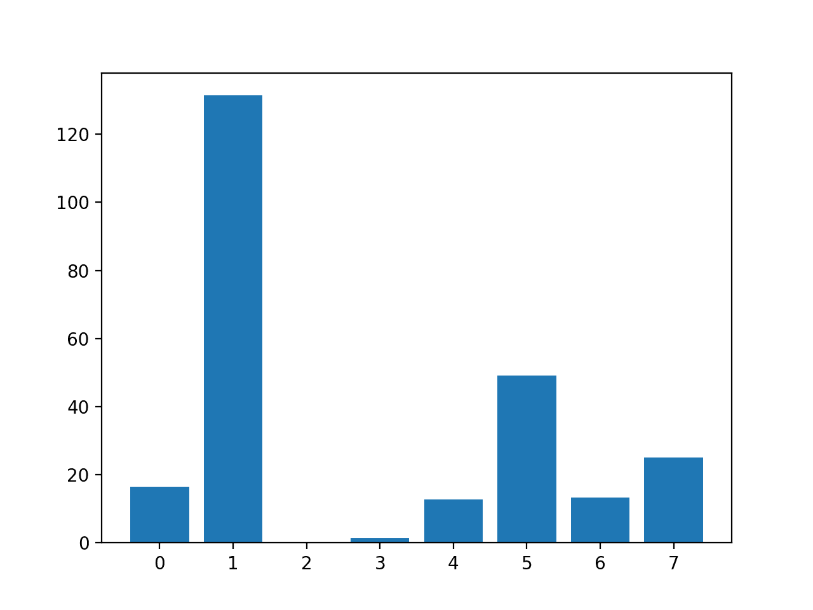
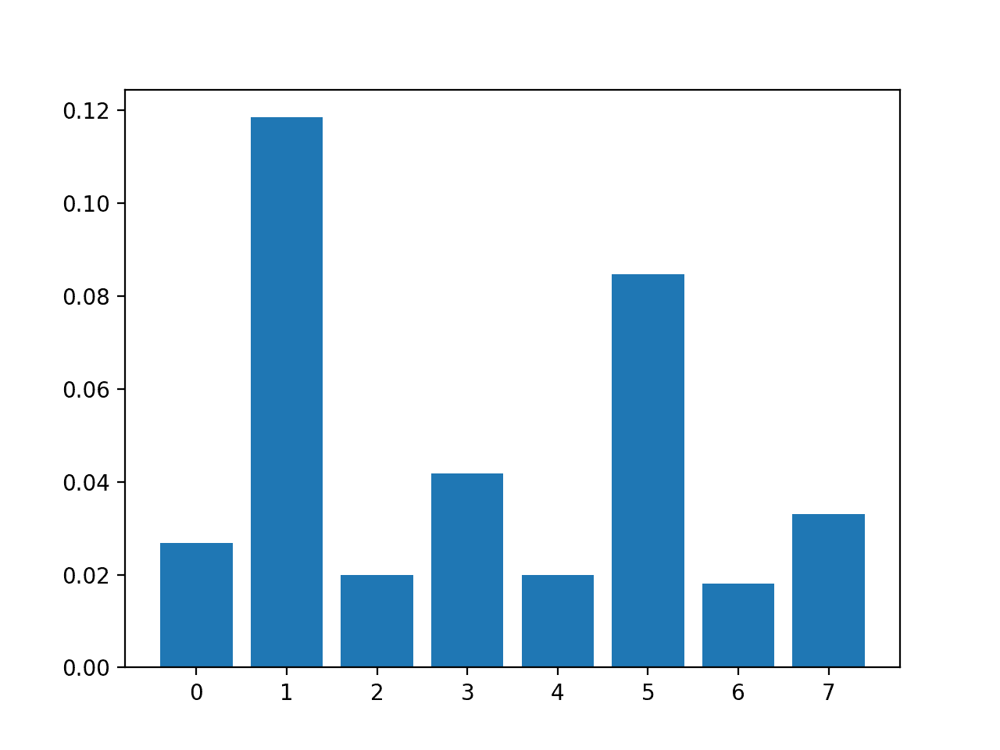
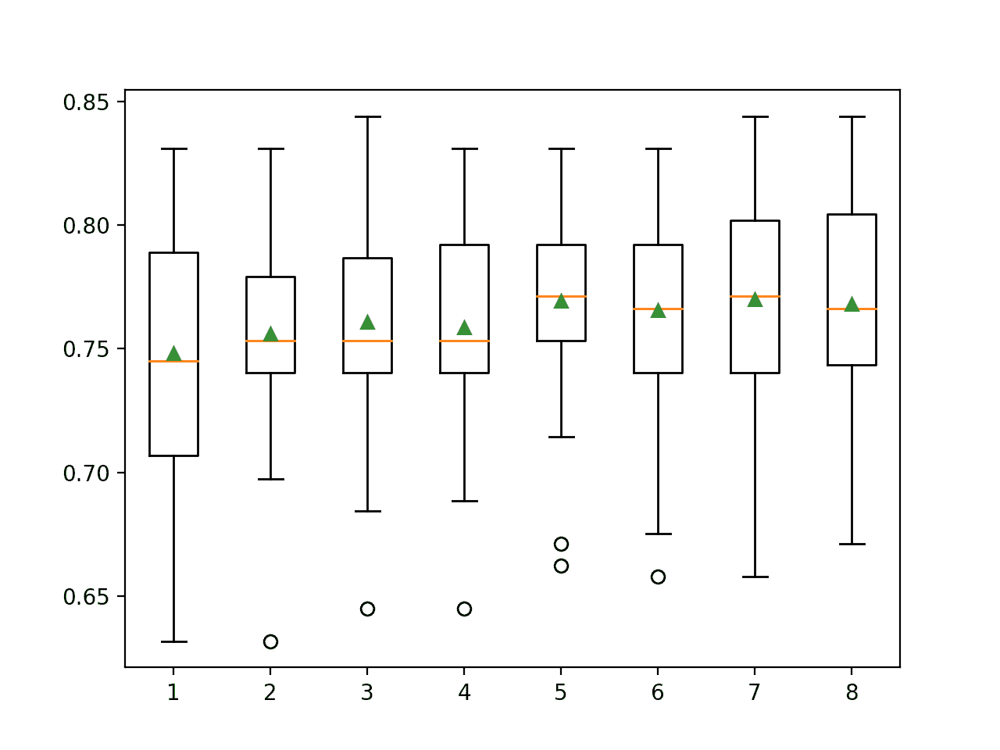

# 如何对数值输入数据执行特征选择

> 原文：<https://machinelearningmastery.com/feature-selection-with-numerical-input-data/>

最后更新于 2020 年 8 月 18 日

特征选择是识别和选择与目标变量最相关的输入特征子集的过程。

在处理实值输入和输出数据时，例如使用皮尔逊相关系数，特征选择通常很简单，但在处理数值输入数据和分类目标变量时，特征选择可能很有挑战性。

当目标变量是分类的(例如分类预测建模)时，数值输入数据最常用的两种特征选择方法是方差分析 f 检验统计量和互信息统计量。

在本教程中，您将了解如何使用数字输入数据执行特征选择以进行分类。

完成本教程后，您将知道:

*   具有数值输入和二分类目标变量的糖尿病预测建模问题。
*   如何使用方差分析 f-检验和互信息统计评估数字特征的重要性。
*   在拟合和评估分类模型时，如何对数值数据进行特征选择。

**用我的新书[机器学习的数据准备](https://machinelearningmastery.com/data-preparation-for-machine-learning/)启动你的项目**，包括*分步教程*和所有示例的 *Python 源代码*文件。

我们开始吧。


如何使用数值输入数据进行特征选择
图片由[苏珊·尼尔森](https://flickr.com/photos/infomastern/16298651515/)提供，保留部分权利。

## 教程概述

本教程分为四个部分；它们是:

*   糖尿病数值数据集
*   数字特征选择
    *   方差分析 f 检验特征选择
    *   互信息特征选择
*   使用选定特征建模
    *   使用所有功能构建的模型
    *   使用方差分析 f 检验特征建立的模型
    *   利用互信息特征建立的模型
*   调整选定特征的数量

## 糖尿病数值数据集

作为本教程的基础，我们将使用自 1990 年以来作为机器学习数据集被广泛研究的所谓的“*糖尿病*”数据集。

该数据集将患者数据分为五年内糖尿病发作和非糖尿病发作。共有 768 个例子和 8 个输入变量。这是一个二分类问题。

一个简单的模型在这个数据集上可以达到大约 65%的准确率。好的分数大约是 77%+/-5%。我们将针对该地区，但请注意，本教程中的模型没有优化；它们旨在演示特征选择方案。

可以下载数据集，将文件保存为当前工作目录下的“[pima-Indians-diabetes . CSV](https://raw.githubusercontent.com/jbrownlee/Datasets/master/pima-indians-diabetes.csv)”。

*   [糖尿病数据集(pima-印度人-diabetes.csv)](https://raw.githubusercontent.com/jbrownlee/Datasets/master/pima-indians-diabetes.csv)
*   [糖尿病数据集描述(pima-印度人-糖尿病.名称)](https://raw.githubusercontent.com/jbrownlee/Datasets/master/pima-indians-diabetes.names)

查看数据，我们可以看到所有九个输入变量都是数值。

```py
6,148,72,35,0,33.6,0.627,50,1
1,85,66,29,0,26.6,0.351,31,0
8,183,64,0,0,23.3,0.672,32,1
1,89,66,23,94,28.1,0.167,21,0
0,137,40,35,168,43.1,2.288,33,1
...
```

我们可以使用熊猫库将这个数据集加载到内存中。

```py
...
# load the dataset as a pandas DataFrame
data = read_csv(filename, header=None)
# retrieve numpy array
dataset = data.values
```

加载后，我们可以将列拆分为输入(X)和输出(y)进行建模。

```py
...
# split into input (X) and output (y) variables
X = dataset[:, :-1]
y = dataset[:,-1]
```

我们可以将所有这些结合到一个有用的函数中，以便以后重用。

```py
# load the dataset
def load_dataset(filename):
	# load the dataset as a pandas DataFrame
	data = read_csv(filename, header=None)
	# retrieve numpy array
	dataset = data.values
	# split into input (X) and output (y) variables
	X = dataset[:, :-1]
	y = dataset[:,-1]
	return X, y
```

加载后，我们可以将数据分成训练集和测试集，这样我们就可以拟合和评估学习模型。

我们将使用 [train_test_split()函数](https://Sklearn.org/stable/modules/generated/sklearn.model_selection.train_test_split.html)形成 Sklearn，并将 67%的数据用于训练，33%的数据用于测试。

```py
...
# load the dataset
X, y = load_dataset('pima-indians-diabetes.csv')
# split into train and test sets
X_train, X_test, y_train, y_test = train_test_split(X, y, test_size=0.33, random_state=1)
```

将所有这些元素结合在一起，下面列出了加载、拆分和汇总原始类别数据集的完整示例。

```py
# load and summarize the dataset
from pandas import read_csv
from sklearn.model_selection import train_test_split

# load the dataset
def load_dataset(filename):
	# load the dataset as a pandas DataFrame
	data = read_csv(filename, header=None)
	# retrieve numpy array
	dataset = data.values
	# split into input (X) and output (y) variables
	X = dataset[:, :-1]
	y = dataset[:,-1]
	return X, y

# load the dataset
X, y = load_dataset('pima-indians-diabetes.csv')
# split into train and test sets
X_train, X_test, y_train, y_test = train_test_split(X, y, test_size=0.33, random_state=1)
# summarize
print('Train', X_train.shape, y_train.shape)
print('Test', X_test.shape, y_test.shape)
```

运行该示例会报告训练集和测试集的输入和输出元素的大小。

我们可以看到，我们有 514 个示例用于培训，254 个示例用于测试。

```py
Train (514, 8) (514, 1)
Test (254, 8) (254, 1)
```

现在我们已经加载并准备了糖尿病数据集，我们可以探索特征选择。

## 数字特征选择

有两种流行的特征选择技术可用于数字输入数据和分类(类)目标变量。

它们是:

*   方差分析-f 统计量。
*   相互信息统计。

让我们依次仔细看看每一个。

### 方差分析 f 检验特征选择

方差分析是方差分析的首字母缩略词，是一种参数统计假设检验，用于确定两个或更多数据样本(通常是三个或更多)的平均值是否来自同一分布。

一个 [F 统计](https://en.wikipedia.org/wiki/F-test)，或 f 检验，是一类统计检验，计算方差值之间的比率，如两个不同样本的方差或通过统计检验解释和解释的方差，如方差分析。方差分析方法是一种 f 统计，这里称为方差分析 f 检验。

重要的是，当一个变量是数字的，一个是分类的，如数字输入变量和分类任务中的分类目标变量时，使用方差分析。

该测试的结果可用于特征选择，其中那些独立于目标变量的特征可从数据集中移除。

> 当结果是数字的，并且[…]预测因子有两个以上的水平时，可以计算传统的方差分析 f 统计量。

—第 242 页，[特征工程与选择](https://amzn.to/2Yvcupn)，2019。

Sklearn 机器库提供了 [f_classif()函数](https://Sklearn.org/stable/modules/generated/sklearn.feature_selection.f_classif.html)中方差分析 f-检验的实现。该功能可用于特征选择策略，例如通过[选择最相关的特征(最大值)选择最相关的 *k* 类](https://Sklearn.org/stable/modules/generated/sklearn.feature_selection.SelectKBest.html)。

例如，我们可以定义 *SelectKBest* 类来使用 *f_classif()* 功能并选择所有特征，然后转换列车和测试集。

```py
...
# configure to select all features
fs = SelectKBest(score_func=f_classif, k='all')
# learn relationship from training data
fs.fit(X_train, y_train)
# transform train input data
X_train_fs = fs.transform(X_train)
# transform test input data
X_test_fs = fs.transform(X_test)
```

然后，我们可以打印每个变量的分数(越大越好)，并将每个变量的分数绘制成条形图，以了解我们应该选择多少特征。

```py
...
# what are scores for the features
for i in range(len(fs.scores_)):
	print('Feature %d: %f' % (i, fs.scores_[i]))
# plot the scores
pyplot.bar([i for i in range(len(fs.scores_))], fs.scores_)
pyplot.show()
```

将此与上一节中糖尿病数据集的数据准备结合起来，下面列出了完整的示例。

```py
# example of anova f-test feature selection for numerical data
from pandas import read_csv
from sklearn.model_selection import train_test_split
from sklearn.feature_selection import SelectKBest
from sklearn.feature_selection import f_classif
from matplotlib import pyplot

# load the dataset
def load_dataset(filename):
	# load the dataset as a pandas DataFrame
	data = read_csv(filename, header=None)
	# retrieve numpy array
	dataset = data.values
	# split into input (X) and output (y) variables
	X = dataset[:, :-1]
	y = dataset[:,-1]
	return X, y

# feature selection
def select_features(X_train, y_train, X_test):
	# configure to select all features
	fs = SelectKBest(score_func=f_classif, k='all')
	# learn relationship from training data
	fs.fit(X_train, y_train)
	# transform train input data
	X_train_fs = fs.transform(X_train)
	# transform test input data
	X_test_fs = fs.transform(X_test)
	return X_train_fs, X_test_fs, fs

# load the dataset
X, y = load_dataset('pima-indians-diabetes.csv')
# split into train and test sets
X_train, X_test, y_train, y_test = train_test_split(X, y, test_size=0.33, random_state=1)
# feature selection
X_train_fs, X_test_fs, fs = select_features(X_train, y_train, X_test)
# what are scores for the features
for i in range(len(fs.scores_)):
	print('Feature %d: %f' % (i, fs.scores_[i]))
# plot the scores
pyplot.bar([i for i in range(len(fs.scores_))], fs.scores_)
pyplot.show()
```

运行该示例首先打印为每个输入要素和目标变量计算的分数。

**注**:考虑到算法或评估程序的随机性，或数值准确率的差异，您的[结果可能会有所不同](https://machinelearningmastery.com/different-results-each-time-in-machine-learning/)。考虑运行该示例几次，并比较平均结果。

在这种情况下，我们可以看到一些特性可能比其他特性更相关，具有更大的测试统计值。

也许特性 1、5 和 7 最相关。

```py
Feature 0: 16.527385
Feature 1: 131.325562
Feature 2: 0.042371
Feature 3: 1.415216
Feature 4: 12.778966
Feature 5: 49.209523
Feature 6: 13.377142
Feature 7: 25.126440
```

创建每个输入要素的要素重要性得分的条形图。

这清楚地表明，特征 1 可能是最相关的(根据测试)，八个输入特征中可能有六个更相关。

我们可以在配置*选择测试*时设置 k=6 来选择这四个最重要的特性。



输入特征条形图(x)与方差分析 f 检验特征重要性(y)

### 互信息特征选择

信息论领域的互信息是信息增益(通常用于构造决策树)在特征选择中的应用。

计算两个变量之间的互信息，并在已知另一个变量的值的情况下，测量一个变量不确定性的减少。

您可以在下面的教程中了解更多关于相互信息的信息。

*   [什么是机器学习的信息增益和互信息](https://machinelearningmastery.com/information-gain-and-mutual-information)

当考虑两个离散(分类或序数)变量的分布时，如分类输入和分类输出数据，互信息是直接的。然而，它可以适用于数字输入和分类输出。

有关如何实现这一点的技术细节，请参见 2014 年发表的题为“离散数据集和连续数据集之间的相互信息”的论文

Sklearn 机器学习库通过 *mutual_info_classif()* 函数，为特征选择提供了数字输入和分类输出变量的互信息实现。

和 *f_classif()* 一样，可以在 *SelectKBest* 特征选择策略(和其他策略)中使用。

```py
...
# configure to select all features
fs = SelectKBest(score_func=mutual_info_classif, k='all')
# learn relationship from training data
fs.fit(X_train, y_train)
# transform train input data
X_train_fs = fs.transform(X_train)
# transform test input data
X_test_fs = fs.transform(X_test)
```

我们可以使用糖尿病数据集的互信息进行特征选择，并打印和绘制分数(越大越好)，就像我们在上一节中所做的那样。

下面列出了使用互信息进行数字特征选择的完整示例。

```py
# example of mutual information feature selection for numerical input data
from pandas import read_csv
from sklearn.model_selection import train_test_split
from sklearn.feature_selection import SelectKBest
from sklearn.feature_selection import mutual_info_classif
from matplotlib import pyplot

# load the dataset
def load_dataset(filename):
	# load the dataset as a pandas DataFrame
	data = read_csv(filename, header=None)
	# retrieve numpy array
	dataset = data.values
	# split into input (X) and output (y) variables
	X = dataset[:, :-1]
	y = dataset[:,-1]
	return X, y

# feature selection
def select_features(X_train, y_train, X_test):
	# configure to select all features
	fs = SelectKBest(score_func=mutual_info_classif, k='all')
	# learn relationship from training data
	fs.fit(X_train, y_train)
	# transform train input data
	X_train_fs = fs.transform(X_train)
	# transform test input data
	X_test_fs = fs.transform(X_test)
	return X_train_fs, X_test_fs, fs

# load the dataset
X, y = load_dataset('pima-indians-diabetes.csv')
# split into train and test sets
X_train, X_test, y_train, y_test = train_test_split(X, y, test_size=0.33, random_state=1)
# feature selection
X_train_fs, X_test_fs, fs = select_features(X_train, y_train, X_test)
# what are scores for the features
for i in range(len(fs.scores_)):
	print('Feature %d: %f' % (i, fs.scores_[i]))
# plot the scores
pyplot.bar([i for i in range(len(fs.scores_))], fs.scores_)
pyplot.show()
```

运行该示例首先打印为每个输入要素和目标变量计算的分数。

**注**:考虑到算法或评估程序的随机性，或数值准确率的差异，您的[结果可能会有所不同](https://machinelearningmastery.com/different-results-each-time-in-machine-learning/)。考虑运行该示例几次，并比较平均结果。

在这种情况下，我们可以看到一些功能的得分较低，这表明它们可能可以被删除。

也许特性 1 和 5 最相关。

```py
Feature 1: 0.118431
Feature 2: 0.019966
Feature 3: 0.041791
Feature 4: 0.019858
Feature 5: 0.084719
Feature 6: 0.018079
Feature 7: 0.033098
```

创建每个输入要素的要素重要性得分的条形图。

重要的是，促进了不同功能的混合。



输入特征条形图(x)与互信息特征重要性条形图(y)

既然我们知道了如何对分类预测建模问题的数值输入数据执行特征选择，我们可以尝试使用所选特征开发模型并比较结果。

## 使用选定特征建模

有许多不同的技术用于对特征进行评分和基于评分选择特征；你怎么知道用哪个？

一种稳健的方法是使用不同的特征选择方法(和特征数量)来评估模型，并选择产生具有最佳表现的模型的方法。

在本节中，我们将评估一个逻辑回归模型，将所有特征与通过方差分析 f 检验选择的特征和通过互信息选择的特征构建的模型进行比较。

逻辑回归是测试特征选择方法的一个很好的模型，因为如果从模型中去除不相关的特征，它可以表现得更好。

### 使用所有功能构建的模型

作为第一步，我们将使用所有可用的特性来评估一个[物流配送模型](https://Sklearn.org/stable/modules/generated/sklearn.linear_model.LogisticRegression.html)。

该模型适合训练数据集，并在测试数据集上进行评估。

下面列出了完整的示例。

```py
# evaluation of a model using all input features
from pandas import read_csv
from sklearn.model_selection import train_test_split
from sklearn.linear_model import LogisticRegression
from sklearn.metrics import accuracy_score

# load the dataset
def load_dataset(filename):
	# load the dataset as a pandas DataFrame
	data = read_csv(filename, header=None)
	# retrieve numpy array
	dataset = data.values
	# split into input (X) and output (y) variables
	X = dataset[:, :-1]
	y = dataset[:,-1]
	return X, y

# load the dataset
X, y = load_dataset('pima-indians-diabetes.csv')
# split into train and test sets
X_train, X_test, y_train, y_test = train_test_split(X, y, test_size=0.33, random_state=1)
# fit the model
model = LogisticRegression(solver='liblinear')
model.fit(X_train, y_train)
# evaluate the model
yhat = model.predict(X_test)
# evaluate predictions
accuracy = accuracy_score(y_test, yhat)
print('Accuracy: %.2f' % (accuracy*100))
```

运行该示例将打印训练数据集中模型的准确性。

**注**:考虑到算法或评估程序的随机性，或数值准确率的差异，您的[结果可能会有所不同](https://machinelearningmastery.com/different-results-each-time-in-machine-learning/)。考虑运行该示例几次，并比较平均结果。

在这种情况下，我们可以看到该模型实现了大约 77%的分类准确率。

我们更喜欢使用达到与此相同或更好的分类准确率的特征子集。

```py
Accuracy: 77.56
```

### 使用方差分析 f 检验特征建立的模型

我们可以使用方差分析 f-检验对特征进行评分，并选择四个最相关的特征。

为此，更新了下面的 select_features()函数。

```py
# feature selection
def select_features(X_train, y_train, X_test):
	# configure to select a subset of features
	fs = SelectKBest(score_func=f_classif, k=4)
	# learn relationship from training data
	fs.fit(X_train, y_train)
	# transform train input data
	X_train_fs = fs.transform(X_train)
	# transform test input data
	X_test_fs = fs.transform(X_test)
	return X_train_fs, X_test_fs, fs
```

下面列出了使用此特征选择方法评估逻辑回归模型拟合和评估数据的完整示例。

```py
# evaluation of a model using 4 features chosen with anova f-test
from pandas import read_csv
from sklearn.model_selection import train_test_split
from sklearn.feature_selection import SelectKBest
from sklearn.feature_selection import f_classif
from sklearn.linear_model import LogisticRegression
from sklearn.metrics import accuracy_score

# load the dataset
def load_dataset(filename):
	# load the dataset as a pandas DataFrame
	data = read_csv(filename, header=None)
	# retrieve numpy array
	dataset = data.values
	# split into input (X) and output (y) variables
	X = dataset[:, :-1]
	y = dataset[:,-1]
	return X, y

# feature selection
def select_features(X_train, y_train, X_test):
	# configure to select a subset of features
	fs = SelectKBest(score_func=f_classif, k=4)
	# learn relationship from training data
	fs.fit(X_train, y_train)
	# transform train input data
	X_train_fs = fs.transform(X_train)
	# transform test input data
	X_test_fs = fs.transform(X_test)
	return X_train_fs, X_test_fs, fs

# load the dataset
X, y = load_dataset('pima-indians-diabetes.csv')
# split into train and test sets
X_train, X_test, y_train, y_test = train_test_split(X, y, test_size=0.33, random_state=1)
# feature selection
X_train_fs, X_test_fs, fs = select_features(X_train, y_train, X_test)
# fit the model
model = LogisticRegression(solver='liblinear')
model.fit(X_train_fs, y_train)
# evaluate the model
yhat = model.predict(X_test_fs)
# evaluate predictions
accuracy = accuracy_score(y_test, yhat)
print('Accuracy: %.2f' % (accuracy*100))
```

运行该示例报告了模型在使用方差分析 f-检验统计选择的八个输入特征中的四个特征上的表现。

**注**:考虑到算法或评估程序的随机性，或数值准确率的差异，您的[结果可能会有所不同](https://machinelearningmastery.com/different-results-each-time-in-machine-learning/)。考虑运行该示例几次，并比较平均结果。

在这种情况下，我们看到模型达到了大约 78.74%的准确率，与达到 77.56%的基线相比，表现有所提升。

```py
Accuracy: 78.74
```

### 利用互信息特征建立的模型

我们可以重复实验，并使用互信息统计选择前四个特征。

下面列出了实现此功能的 *select_features()* 功能的更新版本。

```py
# feature selection
def select_features(X_train, y_train, X_test):
	# configure to select a subset of features
	fs = SelectKBest(score_func=mutual_info_classif, k=4)
	# learn relationship from training data
	fs.fit(X_train, y_train)
	# transform train input data
	X_train_fs = fs.transform(X_train)
	# transform test input data
	X_test_fs = fs.transform(X_test)
	return X_train_fs, X_test_fs, fs
```

下面列出了使用互信息进行特征选择以拟合逻辑回归模型的完整示例。

```py
# evaluation of a model using 4 features chosen with mutual information
from pandas import read_csv
from sklearn.model_selection import train_test_split
from sklearn.feature_selection import SelectKBest
from sklearn.feature_selection import mutual_info_classif
from sklearn.linear_model import LogisticRegression
from sklearn.metrics import accuracy_score

# load the dataset
def load_dataset(filename):
	# load the dataset as a pandas DataFrame
	data = read_csv(filename, header=None)
	# retrieve numpy array
	dataset = data.values
	# split into input (X) and output (y) variables
	X = dataset[:, :-1]
	y = dataset[:,-1]
	return X, y

# feature selection
def select_features(X_train, y_train, X_test):
	# configure to select a subset of features
	fs = SelectKBest(score_func=mutual_info_classif, k=4)
	# learn relationship from training data
	fs.fit(X_train, y_train)
	# transform train input data
	X_train_fs = fs.transform(X_train)
	# transform test input data
	X_test_fs = fs.transform(X_test)
	return X_train_fs, X_test_fs, fs

# load the dataset
X, y = load_dataset('pima-indians-diabetes.csv')
# split into train and test sets
X_train, X_test, y_train, y_test = train_test_split(X, y, test_size=0.33, random_state=1)
# feature selection
X_train_fs, X_test_fs, fs = select_features(X_train, y_train, X_test)
# fit the model
model = LogisticRegression(solver='liblinear')
model.fit(X_train_fs, y_train)
# evaluate the model
yhat = model.predict(X_test_fs)
# evaluate predictions
accuracy = accuracy_score(y_test, yhat)
print('Accuracy: %.2f' % (accuracy*100))
```

运行该示例使模型适合使用互信息选择的四个顶级选定要素。

**注**:考虑到算法或评估程序的随机性，或数值准确率的差异，您的[结果可能会有所不同](https://machinelearningmastery.com/different-results-each-time-in-machine-learning/)。考虑运行该示例几次，并比较平均结果。

在这种情况下，与基线模型相比，我们没有什么不同。这很有趣，因为我们知道该方法与之前的方法相比选择了不同的四个特征。

```py
Accuracy: 77.56
```

## 调整选定特征的数量

在前面的例子中，我们选择了四个特征，但是我们如何知道选择哪个特征是好的或者最好的数量呢？

代替猜测，我们可以系统地测试一系列不同数量的所选特征，并发现哪一个导致最佳表现的模型。这被称为网格搜索，其中可以调整 *SelectKBest* 类的 *k* 参数。

使用[重复分层 K 折交叉验证](https://machinelearningmastery.com/k-fold-cross-validation/)来评估分类任务的模型配置是一种良好的做法。我们将通过[repeated stratifiedfold 类](https://Sklearn.org/stable/modules/generated/sklearn.model_selection.RepeatedStratifiedKFold.html)使用三次重复的 10 倍交叉验证。

```py
...
# define the evaluation method
cv = RepeatedStratifiedKFold(n_splits=10, n_repeats=3, random_state=1)
```

我们可以定义一个[管道](https://Sklearn.org/stable/modules/generated/sklearn.pipeline.Pipeline.html)，它可以在训练集上正确准备特征选择变换，并将其应用于交叉验证的每个折叠的训练集和测试集。

在这种情况下，我们将使用方差分析 f-检验统计方法来选择特征。

```py
...
# define the pipeline to evaluate
model = LogisticRegression(solver='liblinear')
fs = SelectKBest(score_func=f_classif)
pipeline = Pipeline(steps=[('anova',fs), ('lr', model)])
```

然后，我们可以将评估值的网格定义为 1 到 8。

请注意，网格是一个参数到要搜索的值的字典，假设我们使用的是一个*管道*，我们可以通过我们给它起的名字来访问 *SelectKBest* 对象，' *anova* '，然后是参数名' *k* '，用两个下划线分隔，或' *anova__k* '。

```py
...
# define the grid
grid = dict()
grid['anova__k'] = [i+1 for i in range(X.shape[1])]
```

然后，我们可以定义并运行搜索。

```py
...
# define the grid search
search = GridSearchCV(pipeline, grid, scoring='accuracy', n_jobs=-1, cv=cv)
# perform the search
results = search.fit(X, y)
```

将这些联系在一起，完整的示例如下所示。

```py
# compare different numbers of features selected using anova f-test
from pandas import read_csv
from sklearn.model_selection import RepeatedStratifiedKFold
from sklearn.feature_selection import SelectKBest
from sklearn.feature_selection import f_classif
from sklearn.linear_model import LogisticRegression
from sklearn.pipeline import Pipeline
from sklearn.model_selection import GridSearchCV
from matplotlib import pyplot

# load the dataset
def load_dataset(filename):
	# load the dataset as a pandas DataFrame
	data = read_csv(filename, header=None)
	# retrieve numpy array
	dataset = data.values
	# split into input (X) and output (y) variables
	X = dataset[:, :-1]
	y = dataset[:,-1]
	return X, y

# define dataset
X, y = load_dataset('pima-indians-diabetes.csv')
# define the evaluation method
cv = RepeatedStratifiedKFold(n_splits=10, n_repeats=3, random_state=1)
# define the pipeline to evaluate
model = LogisticRegression(solver='liblinear')
fs = SelectKBest(score_func=f_classif)
pipeline = Pipeline(steps=[('anova',fs), ('lr', model)])
# define the grid
grid = dict()
grid['anova__k'] = [i+1 for i in range(X.shape[1])]
# define the grid search
search = GridSearchCV(pipeline, grid, scoring='accuracy', n_jobs=-1, cv=cv)
# perform the search
results = search.fit(X, y)
# summarize best
print('Best Mean Accuracy: %.3f' % results.best_score_)
print('Best Config: %s' % results.best_params_)
```

运行示例网格使用 ANOVA f-test 搜索不同数量的选定要素，其中使用重复交叉验证评估每个建模管道。

**注**:考虑到算法或评估程序的随机性，或数值准确率的差异，您的[结果可能会有所不同](https://machinelearningmastery.com/different-results-each-time-in-machine-learning/)。考虑运行该示例几次，并比较平均结果。

在这种情况下，我们可以看到所选特征的最佳数量是七个；达到了 77%的准确率。

```py
Best Mean Accuracy: 0.770
Best Config: {'anova__k': 7}
```

我们可能希望看到所选特征的数量和分类准确率之间的关系。在这种关系中，我们可能期望更多的特性在某种程度上导致更好的表现。

这种关系可以通过从 1 到 8 手动评估*选择测试*的 *k* 的每个配置，收集准确度分数的样本，并使用方框图和触须图并排绘制结果来探索。这些箱线图的分布和平均值预计将显示所选要素的数量和管道分类准确率之间的任何有趣关系。

下面列出了实现这一点的完整示例。

```py
# compare different numbers of features selected using anova f-test
from numpy import mean
from numpy import std
from pandas import read_csv
from sklearn.model_selection import cross_val_score
from sklearn.model_selection import RepeatedStratifiedKFold
from sklearn.feature_selection import SelectKBest
from sklearn.feature_selection import f_classif
from sklearn.linear_model import LogisticRegression
from sklearn.pipeline import Pipeline
from matplotlib import pyplot

# load the dataset
def load_dataset(filename):
	# load the dataset as a pandas DataFrame
	data = read_csv(filename, header=None)
	# retrieve numpy array
	dataset = data.values
	# split into input (X) and output (y) variables
	X = dataset[:, :-1]
	y = dataset[:,-1]
	return X, y

# evaluate a give model using cross-validation
def evaluate_model(model, X, y):
	cv = RepeatedStratifiedKFold(n_splits=10, n_repeats=3, random_state=1)
	scores = cross_val_score(model, X, y, scoring='accuracy', cv=cv, n_jobs=-1, error_score='raise')
	return scores

# define dataset
X, y = load_dataset('pima-indians-diabetes.csv')
# define number of features to evaluate
num_features = [i+1 for i in range(X.shape[1])]
# enumerate each number of features
results = list()
for k in num_features:
	# create pipeline
	model = LogisticRegression(solver='liblinear')
	fs = SelectKBest(score_func=f_classif, k=k)
	pipeline = Pipeline(steps=[('anova',fs), ('lr', model)])
	# evaluate the model
	scores = evaluate_model(pipeline, X, y)
	results.append(scores)
	# summarize the results
	print('>%d %.3f (%.3f)' % (k, mean(scores), std(scores)))
# plot model performance for comparison
pyplot.boxplot(results, labels=num_features, showmeans=True)
pyplot.show()
```

运行该示例首先报告每个选定特征数量的平均值和标准偏差准确率。

**注**:考虑到算法或评估程序的随机性，或数值准确率的差异，您的[结果可能会有所不同](https://machinelearningmastery.com/different-results-each-time-in-machine-learning/)。考虑运行该示例几次，并比较平均结果。

在这种情况下，选择五个和七个要素的准确度大致相同。

```py
>1 0.748 (0.048)
>2 0.756 (0.042)
>3 0.761 (0.044)
>4 0.759 (0.042)
>5 0.770 (0.041)
>6 0.766 (0.042)
>7 0.770 (0.042)
>8 0.768 (0.040)
```

并排创建方框图和触须图，显示平均准确率随着所选要素的数量增加到五个要素而增加的趋势，之后可能会变得不太稳定。

在这种情况下，选择五个功能可能是合适的配置。



使用方差分析 f-检验对每个选定特征数的分类准确度的方框图和须图

## 进一步阅读

如果您想更深入地了解这个主题，本节将提供更多资源。

### 教程

*   [如何选择机器学习的特征选择方法](https://machinelearningmastery.com/feature-selection-with-real-and-categorical-data/)
*   [如何用类别数据进行特征选择](https://machinelearningmastery.com/feature-selection-with-categorical-data/)
*   [什么是机器学习的信息增益和互信息](https://machinelearningmastery.com/information-gain-and-mutual-information)

### 书

*   [特征工程与选择](https://amzn.to/2Yvcupn)，2019。

### 报纸

*   [离散和连续数据集之间的互信息](https://www.ncbi.nlm.nih.gov/pmc/articles/PMC3929353/)，2014。

### 蜜蜂

*   [功能选择，sci kit-学习用户指南](https://Sklearn.org/stable/modules/feature_selection.html)。
*   [硬化. feature _ selection . f _ classic API](https://Sklearn.org/stable/modules/generated/sklearn.feature_selection.f_classif.html)。
*   [sklearn . feature _ selection . mutual _ info _ class if API](https://Sklearn.org/stable/modules/generated/sklearn.feature_selection.mutual_info_classif.html)。
*   [硬化. feature_selection。SelectKBest API](https://Sklearn.org/stable/modules/generated/sklearn.feature_selection.SelectKBest.html) 。

### 文章

*   [f-测试，维基百科](https://en.wikipedia.org/wiki/F-test)。
*   [单向方差分析，维基百科](https://en.wikipedia.org/wiki/One-way_analysis_of_variance)。

### 资料组

*   [糖尿病数据集(pima-印度人-diabetes.csv)](https://raw.githubusercontent.com/jbrownlee/Datasets/master/pima-indians-diabetes.csv)
*   [糖尿病数据集描述(pima-印度人-糖尿病.名称)](https://raw.githubusercontent.com/jbrownlee/Datasets/master/pima-indians-diabetes.names)

## 摘要

在本教程中，您发现了如何使用用于分类的数字输入数据执行要素选择。

具体来说，您了解到:

*   具有数值输入和二分类目标变量的糖尿病预测建模问题。
*   如何使用方差分析 f-检验和互信息统计评估数字特征的重要性。
*   在拟合和评估分类模型时，如何对数值数据进行特征选择。

**你有什么问题吗？**
在下面的评论中提问，我会尽力回答。