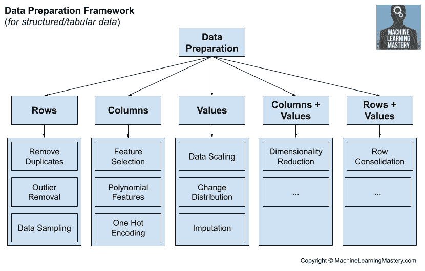

# 机器学习中数据准备技术的框架

> 原文：<https://machinelearningmastery.com/framework-for-data-preparation-for-machine-learning/>

最后更新于 2020 年 7 月 17 日

有大量不同类型的**数据准备技术**可用于预测建模项目。

在某些情况下，数据的分布或机器学习模型的要求可能暗示了所需的数据准备，尽管考虑到数据的复杂性和高维性、不断增加的新机器学习算法以及从业者有限的(尽管是人为的)限制，这种情况很少发生。

相反，数据准备可以被视为另一个超参数，作为建模管道的一部分进行调整。这就提出了一个问题，如何知道在搜索中要考虑哪些数据准备方法，这可能会让专家和初学者都感到不知所措。

解决方案是以结构化的方式思考数据准备的广阔领域，并根据数据准备技术对原始数据的影响系统地评估数据准备技术。

在本教程中，您将发现一个框架，该框架为使用结构化数据进行预测建模的数据准备技术的思考和分组提供了一种结构化的方法。

完成本教程后，您将知道:

*   框架数据准备的挑战和压倒性进展是机器学习建模管道中另一个需要调整的超参数。
*   定义了五组要考虑的数据准备技术的框架。
*   属于每个组的数据准备技术的示例，可以在您的预测建模项目中进行评估。

**用我的新书[机器学习的数据准备](https://machinelearningmastery.com/data-preparation-for-machine-learning/)启动你的项目**，包括*分步教程*和所有示例的 *Python 源代码*文件。

我们开始吧。

机器学习中的数据准备技术框架
图片由[菲尔杜比](https://www.flickr.com/photos/126654539@N08/20630612513/)提供，保留部分权利。

## 教程概述

本教程分为三个部分；它们是:

1.  数据准备的挑战
2.  数据准备框架
3.  数据准备技术

## 数据准备的挑战

数据准备是指将原始数据转换成更适合预测建模的形式。

这可能是必需的，因为数据本身包含错误。这也可能是因为所选择的算法对数据的类型和分布有所期望。

为了使数据准备的任务更具挑战性，从预测模型中获得最佳表现所需的数据准备可能并不明显，并且可能会偏离或违反正在使用的模型的预期，这也是很常见的。

因此，通常将应用于原始数据的数据准备的选择和配置视为要调整的建模管道的另一个超参数。

这种数据准备框架在实践中非常有效，因为它允许您使用自动搜索技术(如网格搜索和随机搜索)来发现非直观的数据准备步骤，从而产生熟练的预测模型。

鉴于数据准备技术的数量和种类繁多，这种数据准备框架对初学者来说也是势不可挡的。

解决这个问题的办法是系统地思考数据准备技术。

## 数据准备框架

有效的数据准备要求以结构化和系统的方式组织和考虑可用的数据准备技术。

这允许您确保为数据集探索方法技术，并且不会跳过或忽略潜在的有效技术。

这可以通过使用一个框架来组织数据准备技术来实现，这些技术考虑了它们对原始数据集的影响。

例如，结构化的机器学习数据，例如我们可能存储在 CSV 文件中用于分类和回归的数据，由行、列和值组成。我们可以考虑在这些级别上运行的数据准备技术。

*   行的数据准备
*   列的数据准备
*   价值观的数据准备

行的数据准备可以是从数据集中添加或移除数据行的技术。类似地，列的数据准备可以是从数据集中添加或移除列(要素或变量)的技术。而值的数据准备可能是改变数据集中的值的技术，通常是针对给定的列。

还有一种类型的数据准备不适合这种结构，那就是降维技术。这些技术同时改变列和值，例如，将数据投影到低维空间。

*   列+值的数据准备

这就提出了可能同时应用于行和值的技术问题。这可能包括以某种方式合并数据行的数据准备。

*   行+值的数据准备

我们可以在下图中总结这个框架和一些高级别的数据准备方法。

机器学习数据准备框架

现在，我们已经有了一个基于数据对数据的影响来思考数据准备的框架，让我们来看看适合每个组的技术示例。

## 数据准备技术

本节探讨了前一节中定义的五组高级别数据准备技术，并提出了可能属于每组的具体技术。

**我错过了你最喜欢或最喜欢的数据准备技巧之一吗？**
在下面的评论里告诉我。

### 行的数据准备

该组用于添加或删除数据行的数据准备技术。

在机器学习中，行通常被称为样本、示例或实例。

这些技术通常用于扩充有限的训练数据集或消除数据集中的错误或歧义。

想到的主要技术类别是经常用于不平衡分类的数据准备技术。

这包括为表示不足的类创建合成训练数据行的 SMOTE 等技术，以及为表示过多的类移除示例的随机欠采样。

有关 SMOTE 数据采样的更多信息，请参见教程:

*   [使用 Python 进行不平衡分类的 SMOTE】](https://machinelearningmastery.com/smote-oversampling-for-imbalanced-classification/)

它还包括更高级的组合过采样和欠采样技术，这些技术试图沿着分类问题的决策边界识别和移除不明确的示例，并移除它们或改变它们的类标签。

有关这些类型的数据准备的更多信息，请参见教程:

*   [如何结合过采样和欠采样进行不平衡分类](https://machinelearningmastery.com/combine-oversampling-and-undersampling-for-imbalanced-classification/)

这类数据准备技术还包括从数据中识别和移除异常值的算法。这些数据行可能远离数据集中的概率质量中心，因此可能不代表域中的数据。

有关异常值检测和移除方法的更多信息，请参见教程:

*   [如何去除机器学习的异常值](https://machinelearningmastery.com/how-to-use-statistics-to-identify-outliers-in-data/)

### 列的数据准备

该组用于添加或删除数据列的数据准备技术。

在机器学习中，列通常被称为变量或特征。

通常需要这些技术来降低预测问题的复杂性(维度)，或者解包复合输入变量或特征之间的复杂交互。

想到的主要技术是特征选择技术。

这包括使用统计数据根据每个变量的数据类型对输入变量与目标变量的相关性进行评分的技术。

有关这些类型的数据准备技术的更多信息，请参见教程:

*   [如何选择机器学习的特征选择方法](https://machinelearningmastery.com/feature-selection-with-real-and-categorical-data/)

这也包括系统地测试输入变量的不同组合对机器学习模型的预测技能的影响的特征选择技术。

有关这些类型方法的更多信息，请参见教程:

*   [Python 中特征选择的递归特征消除(RFE)](https://machinelearningmastery.com/rfe-feature-selection-in-python/)

相关的是使用模型基于预测模型对输入特征的使用来对输入特征的重要性进行评分的技术，称为特征重要性方法。这些方法通常用于数据解释，尽管它们也可以用于特征选择。

有关这些类型方法的更多信息，请参见教程:

*   [如何用 Python 计算特征重要性](https://machinelearningmastery.com/calculate-feature-importance-with-python/)

这组方法还带来了创建或导出新的数据列和新特性的技术。这些通常被称为特征工程，尽管有时整个数据准备领域被称为特征工程。

例如，可以创建表示提升到指数的值的新要素或要素的乘法组合，并将其作为新列添加到数据集中。

有关这些类型的数据准备技术的更多信息，请参见教程:

*   [如何使用多项式特征变换进行机器学习](https://machinelearningmastery.com/polynomial-features-transforms-for-machine-learning/)

这可能还包括改变变量类型的数据转换，例如为分类变量创建虚拟变量，通常称为一次性编码。

有关这些类型的数据准备技术的更多信息，请参见教程:

*   [类别数据的顺序编码和单热编码](https://machinelearningmastery.com/one-hot-encoding-for-categorical-data/)

### 价值观的数据准备

该组用于改变数据中原始值的数据准备技术。

这些技术通常需要满足特定机器学习算法的期望或要求。

想到的主要技术类别是改变输入变量的规模或分布的数据转换。

例如[标准化、归一化](https://machinelearningmastery.com/standardscaler-and-minmaxscaler-transforms-in-python/)等数据变换，改变数值输入变量的尺度。像序数编码这样的数据转换改变了分类输入变量的类型。

还有许多用于改变输入变量分布的数据转换。

例如，离散化或宁滨将数字输入变量的分布改变为具有序数排序的分类变量。

有关此类数据转换的更多信息，请参见教程:

*   [如何使用离散化变换进行机器学习](https://machinelearningmastery.com/discretization-transforms-for-machine-learning/)

功率变换可用于改变数据的分布，以消除偏斜，并使分布更加正态(高斯)。

有关此方法的更多信息，请参见教程:

*   [如何使用幂变换进行机器学习](https://machinelearningmastery.com/power-transforms-with-Sklearn/)

分位数转换是一种灵活的数据准备技术，可以将数字输入变量映射到不同类型的分布，如正态分布或高斯分布。

您可以在此处了解有关这种数据准备技术的更多信息:

*   [如何使用分位数变换进行机器学习](https://machinelearningmastery.com/quantile-transforms-for-machine-learning/)

属于这一组的另一种数据准备技术是系统地改变数据集中的值的方法。

这包括识别和替换缺失值的技术，通常称为缺失值插补。这可以使用统计方法或更先进的基于模型的方法来实现。

有关这些方法的更多信息，请参见教程:

*   [机器学习中缺失值的统计插补](https://machinelearningmastery.com/statistical-imputation-for-missing-values-in-machine-learning/)

如果转换的结果作为新的列被附加到原始数据，则所讨论的所有方法也可以被认为是特征工程方法(例如，适合于之前讨论的数据准备方法组)。

### 列+值的数据准备

该组用于更改数据中的列数和值的数据准备技术。

这让我想到的主要技术类别是降维技术，它专门减少列的数量以及数字输入变量的规模和分布。

这包括线性代数中使用的矩阵分解方法以及高维统计中使用的流形学习算法。

有关这些技术的更多信息，请参见教程:

*   [机器学习降维介绍](https://machinelearningmastery.com/dimensionality-reduction-for-machine-learning/)

虽然这些技术是为了在低维空间中创建行的投影而设计的，但这可能也为反过来的技术打开了大门。也就是说，使用输入变量的全部或一个子集来创建到更高维空间的投影，可能会分解复杂的非线性关系。

也许用多项式变换代替原始数据集的结果适合这类数据准备方法。

**你知道适合这个群体的其他方法吗？**
在下面的评论里告诉我。

### 行+值的数据准备

该组用于更改数据行数和值的数据准备技术。

我以前没有明确考虑过这种类型的数据转换，但是它超出了定义的框架。

想到的一组方法是聚类算法，其中数据集中的所有数据行或数据行的子集在聚类中心被替换为数据样本，称为聚类中心。

相关的可能是用取自特定机器学习算法的样本(行的集合)替换行，例如来自支持向量机的支持向量，或者来自学习向量量化的码本向量。

自然，这些聚合行只是简单地添加到数据集中，而不是替换行，然后它们自然会适合上述“*行的数据准备*”组。

**你知道适合这个群体的其他方法吗？**
在下面的评论里告诉我。

## 进一步阅读

如果您想更深入地了解这个主题，本节将提供更多资源。

### 书

*   [特征工程与选择](https://amzn.to/3aydNGf)，2019。
*   [机器学习的特征工程](https://amzn.to/2XZJNR2)，2018。

## 摘要

在本教程中，您发现了一个框架，用于根据数据准备技术对原始数据的影响对数据准备技术进行系统分组。

具体来说，您了解到:

*   框架数据准备的挑战和压倒性进展是机器学习建模管道中另一个需要调整的超参数。
*   定义了五组要考虑的数据准备技术的框架。
*   属于每个组的数据准备技术的示例，可以在您的预测建模项目中进行评估。

**你有什么问题吗？**
在下面的评论中提问，我会尽力回答。