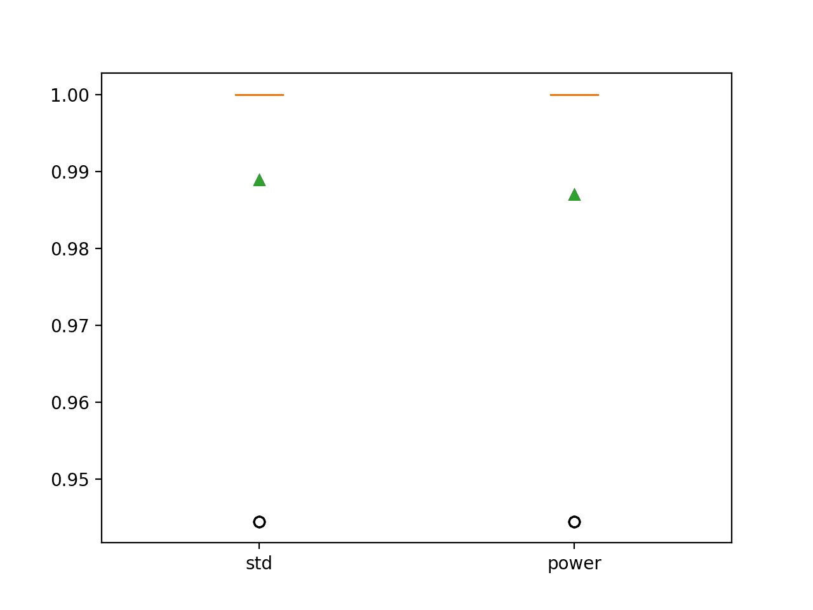

# 如何网格搜索数据准备技术

> 原文：<https://machinelearningmastery.com/grid-search-data-preparation-techniques/>

最后更新于 2020 年 8 月 17 日

机器学习预测建模表现只和你的数据一样好，你的数据只和你准备建模的方式一样好。

最常见的数据准备方法是研究数据集并回顾机器学习算法的期望，然后仔细选择最合适的数据准备技术来转换原始数据，以最好地满足算法的期望。这是缓慢的，昂贵的，需要大量的专业知识。

数据准备的另一种方法是对原始数据进行网格搜索，这是一套常见且常用的数据准备技术。这是数据准备的另一种理念，即**将数据转换视为要搜索和调整的建模管道的另一个超参数**。

与传统的手动数据准备方法相比，这种方法需要更少的专业知识，尽管计算成本很高。好处是，它可以帮助发现非直观的数据准备解决方案，这些解决方案可以为给定的预测建模问题实现良好或最佳的表现。

在本教程中，您将发现如何使用网格搜索方法来准备表格数据。

完成本教程后，您将知道:

*   网格搜索为表格数据的数据准备提供了一种替代方法，其中变换被尝试作为建模管道的超参数。
*   如何使用网格搜索方法进行数据准备，以提高标准类别数据集的模型表现。
*   如何网格搜索序列的数据准备方法，进一步提高模型表现。

**用我的新书[机器学习的数据准备](https://machinelearningmastery.com/data-preparation-for-machine-learning/)启动你的项目**，包括*分步教程*和所有示例的 *Python 源代码*文件。

我们开始吧。


如何网格搜索数据准备技术
图片由[墙船](https://www.flickr.com/photos/wallboat/37224599356/)提供，保留部分权利。

## 教程概述

本教程分为三个部分；它们是:

1.  用于数据准备的网格搜索技术
2.  数据集和表现基线
    1.  葡萄酒类别数据集
    2.  基线模型表现
3.  数据准备的网格搜索方法

## 用于数据准备的网格搜索技术

数据准备可能具有挑战性。

最常规定和遵循的方法是分析数据集，审查算法的要求，并转换原始数据以最好地满足算法的期望。

这可能是有效的，但也很慢，可能需要数据分析和机器学习算法方面的深厚专业知识。

另一种方法是将输入变量的准备视为建模管道的超参数，并随着算法和算法配置的选择对其进行调整。

这可能是一个数据转换，“*不应该工作”*”或“*不应该适合算法*”但结果良好或伟大的表现。或者，对于被认为是“绝对必要的”*的输入变量，可能缺少数据转换，但仍会产生良好或出色的表现。*

 *这可以通过设计数据准备技术的**网格搜索和/或流水线中的数据准备技术序列来实现。这可能涉及在单个选择的机器学习算法或一套机器学习算法上评估每一个。**

这种方法的好处是，它总是会产生建模管道的建议，从而给出良好的相对结果。最重要的是，它可以为从业者挖掘不明显和不直观的解决方案，而不需要深厚的专业知识。

我们可以通过一个工作示例来探索这种数据准备方法。

在深入研究一个工作示例之前，让我们首先选择一个标准数据集，并开发一个表现基线。

## 数据集和表现基线

在本节中，我们将首先选择一个标准的机器学习数据集，并在该数据集上建立表现基线。这将为下一节探索数据准备的网格搜索方法提供背景。

### 葡萄酒类别数据集

我们将使用葡萄酒类别数据集。

该数据集有 13 个输入变量，用于描述葡萄酒样品的化学成分，并要求将葡萄酒分为三种类型。

您可以在此了解有关数据集的更多信息:

*   [葡萄酒数据集(wine.csv)](https://raw.githubusercontent.com/jbrownlee/Datasets/master/wine.csv)
*   [葡萄酒数据集描述(葡萄酒名称)](https://raw.githubusercontent.com/jbrownlee/Datasets/master/wine.names)

不需要下载数据集，因为我们将自动下载它作为我们工作示例的一部分。

打开数据集并查看原始数据。下面列出了前几行数据。

我们可以看到，这是一个带有数值输入变量的多类分类预测建模问题，每个变量都有不同的尺度。

```py
14.23,1.71,2.43,15.6,127,2.8,3.06,.28,2.29,5.64,1.04,3.92,1065,1
13.2,1.78,2.14,11.2,100,2.65,2.76,.26,1.28,4.38,1.05,3.4,1050,1
13.16,2.36,2.67,18.6,101,2.8,3.24,.3,2.81,5.68,1.03,3.17,1185,1
14.37,1.95,2.5,16.8,113,3.85,3.49,.24,2.18,7.8,.86,3.45,1480,1
13.24,2.59,2.87,21,118,2.8,2.69,.39,1.82,4.32,1.04,2.93,735,1
...
```

下面的示例加载数据集并将其拆分为输入和输出列，然后汇总数据数组。

```py
# example of loading and summarizing the wine dataset
from pandas import read_csv
# define the location of the dataset
url = 'https://raw.githubusercontent.com/jbrownlee/Datasets/master/wine.csv'
# load the dataset as a data frame
df = read_csv(url, header=None)
# retrieve the numpy array
data = df.values
# split the columns into input and output variables
X, y = data[:, :-1], data[:, -1]
# summarize the shape of the loaded data
print(X.shape, y.shape)
```

运行该示例，我们可以看到数据集被正确加载，并且有 179 行数据，包含 13 个输入变量和一个目标变量。

```py
(178, 13) (178,)
```

接下来，让我们在这个数据集上评估一个模型，并建立一个表现基线。

### 基线模型表现

我们可以通过评估原始输入数据的模型来建立葡萄酒分类任务的表现基线。

在这种情况下，我们将评估逻辑回归模型。

首先，我们可以定义一个函数来加载数据集，并执行一些最小的数据准备，以确保输入是数字的，目标是标签编码的。

```py
# prepare the dataset
def load_dataset():
	# load the dataset
	url = 'https://raw.githubusercontent.com/jbrownlee/Datasets/master/wine.csv'
	df = read_csv(url, header=None)
	data = df.values
	X, y = data[:, :-1], data[:, -1]
	# minimally prepare dataset
	X = X.astype('float')
	y = LabelEncoder().fit_transform(y.astype('str'))
	return X, y
```

我们将使用重复分层 [k 倍交叉验证](https://machinelearningmastery.com/k-fold-cross-validation/)的金标准对模型进行评估，重复 10 次，重复 3 次。

```py
# evaluate a model
def evaluate_model(X, y, model):
	# define the cross-validation procedure
	cv = RepeatedStratifiedKFold(n_splits=10, n_repeats=3, random_state=1)
	# evaluate model
	scores = cross_val_score(model, X, y, scoring='accuracy', cv=cv, n_jobs=-1)
	return scores
```

然后，我们可以调用函数来加载数据集，定义我们的模型，然后对其进行评估，报告平均值和标准偏差准确率。

```py
...
# get the dataset
X, y = load_dataset()
# define the model
model = LogisticRegression(solver='liblinear')
# evaluate the model
scores = evaluate_model(X, y, model)
# report performance
print('Accuracy: %.3f (%.3f)' % (mean(scores), std(scores)))
```

将这些联系在一起，下面列出了在原酒类别数据集上评估逻辑回归模型的完整示例。

```py
# baseline model performance on the wine dataset
from numpy import mean
from numpy import std
from pandas import read_csv
from sklearn.preprocessing import LabelEncoder
from sklearn.model_selection import RepeatedStratifiedKFold
from sklearn.model_selection import cross_val_score
from sklearn.linear_model import LogisticRegression

# prepare the dataset
def load_dataset():
	# load the dataset
	url = 'https://raw.githubusercontent.com/jbrownlee/Datasets/master/wine.csv'
	df = read_csv(url, header=None)
	data = df.values
	X, y = data[:, :-1], data[:, -1]
	# minimally prepare dataset
	X = X.astype('float')
	y = LabelEncoder().fit_transform(y.astype('str'))
	return X, y

# evaluate a model
def evaluate_model(X, y, model):
	# define the cross-validation procedure
	cv = RepeatedStratifiedKFold(n_splits=10, n_repeats=3, random_state=1)
	# evaluate model
	scores = cross_val_score(model, X, y, scoring='accuracy', cv=cv, n_jobs=-1)
	return scores

# get the dataset
X, y = load_dataset()
# define the model
model = LogisticRegression(solver='liblinear')
# evaluate the model
scores = evaluate_model(X, y, model)
# report performance
print('Accuracy: %.3f (%.3f)' % (mean(scores), std(scores)))
```

运行该示例评估模型表现，并报告平均和标准偏差分类准确率。

**注**:考虑到算法或评估程序的随机性，或数值准确率的差异，您的[结果可能会有所不同](https://machinelearningmastery.com/different-results-each-time-in-machine-learning/)。考虑运行该示例几次，并比较平均结果。

在这种情况下，我们可以看到，适合原始输入数据的逻辑回归模型实现了大约 95.3%的平均分类准确率，提供了表现基线。

```py
Accuracy: 0.953 (0.048)
```

接下来，让我们探索是否可以使用基于网格搜索的数据准备方法来提高表现。

## 数据准备的网格搜索方法

在本节中，我们可以探索是否可以使用网格搜索方法来提高数据准备的表现。

第一步是定义一系列要评估的建模管道，其中每个管道定义一种(或多种)数据准备技术，并以将转换后的数据作为输入的模型结束。

我们将定义一个函数，将这些管道创建为元组列表，其中每个元组定义管道和管道本身的简称。我们将评估一系列不同的数据缩放方法(例如[最小最大缩放器和标准缩放器](https://machinelearningmastery.com/standardscaler-and-minmaxscaler-transforms-in-python/))、分布变换([量化变换器](https://machinelearningmastery.com/quantile-transforms-for-machine-learning/)和[kbins 离散化器](https://machinelearningmastery.com/discretization-transforms-for-machine-learning/))以及降维变换( [PCA](https://machinelearningmastery.com/principal-components-analysis-for-dimensionality-reduction-in-python/) 和 [SVD](https://machinelearningmastery.com/singular-value-decomposition-for-dimensionality-reduction-in-python/) )。

```py
# get modeling pipelines to evaluate
def get_pipelines(model):
	pipelines = list()
	# normalize
	p = Pipeline([('s',MinMaxScaler()), ('m',model)])
	pipelines.append(('norm', p))
	# standardize
	p = Pipeline([('s',StandardScaler()), ('m',model)])
	pipelines.append(('std', p))
	# quantile
	p = Pipeline([('s',QuantileTransformer(n_quantiles=100, output_distribution='normal')), ('m',model)])
	pipelines.append(('quan', p))
	# discretize
	p = Pipeline([('s',KBinsDiscretizer(n_bins=10, encode='ordinal', strategy='uniform')), ('m',model)])
	pipelines.append(('kbins', p))
	# pca
	p = Pipeline([('s',PCA(n_components=7)), ('m',model)])
	pipelines.append(('pca', p))
	# svd
	p = Pipeline([('s',TruncatedSVD(n_components=7)), ('m',model)])
	pipelines.append(('svd', p))
	return pipelines
```

然后，我们可以调用这个函数来获取转换列表，然后枚举每个转换，对其进行评估并报告一路上的表现。

```py
...
# get the modeling pipelines
pipelines = get_pipelines(model)
# evaluate each pipeline
results, names = list(), list()
for name, pipeline in pipelines:
	# evaluate
	scores = evaluate_model(X, y, pipeline)
	# summarize
	print('>%s: %.3f (%.3f)' % (name, mean(scores), std(scores)))
	# store
	results.append(scores)
	names.append(name)
```

在运行结束时，我们可以为每组分数创建一个方框和触须图，并直观地比较结果的分布。

```py
...
# plot the result
pyplot.boxplot(results, labels=names, showmeans=True)
pyplot.show()
```

将这些联系在一起，下面列出了葡萄酒类别数据集中网格搜索数据准备技术的完整示例。

```py
# compare data preparation methods for the wine classification dataset
from numpy import mean
from numpy import std
from pandas import read_csv
from sklearn.model_selection import RepeatedStratifiedKFold
from sklearn.model_selection import cross_val_score
from sklearn.linear_model import LogisticRegression
from sklearn.pipeline import Pipeline
from sklearn.preprocessing import LabelEncoder
from sklearn.preprocessing import MinMaxScaler
from sklearn.preprocessing import StandardScaler
from sklearn.preprocessing import QuantileTransformer
from sklearn.preprocessing import KBinsDiscretizer
from sklearn.decomposition import PCA
from sklearn.decomposition import TruncatedSVD
from matplotlib import pyplot

# prepare the dataset
def load_dataset():
	# load the dataset
	url = 'https://raw.githubusercontent.com/jbrownlee/Datasets/master/wine.csv'
	df = read_csv(url, header=None)
	data = df.values
	X, y = data[:, :-1], data[:, -1]
	# minimally prepare dataset
	X = X.astype('float')
	y = LabelEncoder().fit_transform(y.astype('str'))
	return X, y

# evaluate a model
def evaluate_model(X, y, model):
	# define the cross-validation procedure
	cv = RepeatedStratifiedKFold(n_splits=10, n_repeats=3, random_state=1)
	# evaluate model
	scores = cross_val_score(model, X, y, scoring='accuracy', cv=cv, n_jobs=-1)
	return scores

# get modeling pipelines to evaluate
def get_pipelines(model):
	pipelines = list()
	# normalize
	p = Pipeline([('s',MinMaxScaler()), ('m',model)])
	pipelines.append(('norm', p))
	# standardize
	p = Pipeline([('s',StandardScaler()), ('m',model)])
	pipelines.append(('std', p))
	# quantile
	p = Pipeline([('s',QuantileTransformer(n_quantiles=100, output_distribution='normal')), ('m',model)])
	pipelines.append(('quan', p))
	# discretize
	p = Pipeline([('s',KBinsDiscretizer(n_bins=10, encode='ordinal', strategy='uniform')), ('m',model)])
	pipelines.append(('kbins', p))
	# pca
	p = Pipeline([('s',PCA(n_components=7)), ('m',model)])
	pipelines.append(('pca', p))
	# svd
	p = Pipeline([('s',TruncatedSVD(n_components=7)), ('m',model)])
	pipelines.append(('svd', p))
	return pipelines

# get the dataset
X, y = load_dataset()
# define the model
model = LogisticRegression(solver='liblinear')
# get the modeling pipelines
pipelines = get_pipelines(model)
# evaluate each pipeline
results, names = list(), list()
for name, pipeline in pipelines:
	# evaluate
	scores = evaluate_model(X, y, pipeline)
	# summarize
	print('>%s: %.3f (%.3f)' % (name, mean(scores), std(scores)))
	# store
	results.append(scores)
	names.append(name)
# plot the result
pyplot.boxplot(results, labels=names, showmeans=True)
pyplot.show()
```

运行该示例会评估每个管道的表现，并报告平均和标准偏差分类准确率。

**注**:考虑到算法或评估程序的随机性，或数值准确率的差异，您的[结果可能会有所不同](https://machinelearningmastery.com/different-results-each-time-in-machine-learning/)。考虑运行该示例几次，并比较平均结果。

在这种情况下，我们可以看到标准化输入变量和使用分位数变换都获得了最佳结果，分类准确率约为 98.7%，比没有数据准备的基线提高了 95.3%。

您可以将自己的建模管道添加到 *get_pipelines()* 函数中，并比较它们的结果。

**能不能取得更好的表现？**
在下面的评论里告诉我。

```py
>norm: 0.976 (0.031)
>std: 0.987 (0.023)
>quan: 0.987 (0.023)
>kbins: 0.968 (0.045)
>pca: 0.963 (0.039)
>svd: 0.953 (0.048)
```

创建了一个图形，显示了方框图和须图，总结了每种数据准备技术的分类准确度分数的分布。我们可以看到标准化和分位数转换的分数分布是紧凑的，非常相似，并且具有异常值。我们可以看到，其他变换的分数分布更大，并且向下倾斜。

结果可能表明，标准化数据集可能是数据准备和相关转换(如分位数转换)中的一个重要步骤，如果通过使一个或多个输入变量更高斯化而与标准化相结合，甚至幂转换也可能带来好处。


葡萄酒类别数据集上不同数据转换的分类准确度的盒须图

我们还可以探索变换序列，看看它们是否能提升表现。

例如，我们可能希望在标准化变换后应用 [RFE 特征选择](https://machinelearningmastery.com/rfe-feature-selection-in-python/)，以查看是否可以用更少的输入变量(例如，更少的复杂性)使用相同或更好的结果。

我们可能还想看看在数据缩放变换之前的[幂变换](https://machinelearningmastery.com/power-transforms-with-Sklearn/)是否能在数据集上获得良好的表现，因为我们认为如果分位数变换成功的话，它可以。

下面提供了更新后的 *get_pipelines()* 函数的变换序列。

```py
# get modeling pipelines to evaluate
def get_pipelines(model):
	pipelines = list()
	# standardize
	p = Pipeline([('s',StandardScaler()), ('r', RFE(estimator=LogisticRegression(solver='liblinear'), n_features_to_select=10)), ('m',model)])
	pipelines.append(('std', p))
	# scale and power
	p = Pipeline([('s',MinMaxScaler((1,2))), ('p', PowerTransformer()), ('m',model)])
	pipelines.append(('power', p))
	return pipelines
```

将这些联系在一起，完整的示例如下所示。

```py
# compare sequences of data preparation methods for the wine classification dataset
from numpy import mean
from numpy import std
from pandas import read_csv
from sklearn.model_selection import RepeatedStratifiedKFold
from sklearn.model_selection import cross_val_score
from sklearn.linear_model import LogisticRegression
from sklearn.pipeline import Pipeline
from sklearn.preprocessing import LabelEncoder
from sklearn.preprocessing import MinMaxScaler
from sklearn.preprocessing import StandardScaler
from sklearn.preprocessing import QuantileTransformer
from sklearn.preprocessing import PowerTransformer
from sklearn.preprocessing import KBinsDiscretizer
from sklearn.decomposition import PCA
from sklearn.decomposition import TruncatedSVD
from sklearn.feature_selection import RFE
from matplotlib import pyplot

# prepare the dataset
def load_dataset():
	# load the dataset
	url = 'https://raw.githubusercontent.com/jbrownlee/Datasets/master/wine.csv'
	df = read_csv(url, header=None)
	data = df.values
	X, y = data[:, :-1], data[:, -1]
	# minimally prepare dataset
	X = X.astype('float')
	y = LabelEncoder().fit_transform(y.astype('str'))
	return X, y

# evaluate a model
def evaluate_model(X, y, model):
	# define the cross-validation procedure
	cv = RepeatedStratifiedKFold(n_splits=10, n_repeats=3, random_state=1)
	# evaluate model
	scores = cross_val_score(model, X, y, scoring='accuracy', cv=cv, n_jobs=-1)
	return scores

# get modeling pipelines to evaluate
def get_pipelines(model):
	pipelines = list()
	# standardize
	p = Pipeline([('s',StandardScaler()), ('r', RFE(estimator=LogisticRegression(solver='liblinear'), n_features_to_select=10)), ('m',model)])
	pipelines.append(('std', p))
	# scale and power
	p = Pipeline([('s',MinMaxScaler((1,2))), ('p', PowerTransformer()), ('m',model)])
	pipelines.append(('power', p))
	return pipelines

# get the dataset
X, y = load_dataset()
# define the model
model = LogisticRegression(solver='liblinear')
# get the modeling pipelines
pipelines = get_pipelines(model)
# evaluate each pipeline
results, names = list(), list()
for name, pipeline in pipelines:
	# evaluate
	scores = evaluate_model(X, y, pipeline)
	# summarize
	print('>%s: %.3f (%.3f)' % (name, mean(scores), std(scores)))
	# store
	results.append(scores)
	names.append(name)
# plot the result
pyplot.boxplot(results, labels=names, showmeans=True)
pyplot.show()
```

运行该示例会评估每个管道的表现，并报告平均和标准偏差分类准确率。

**注**:考虑到算法或评估程序的随机性，或数值准确率的差异，您的[结果可能会有所不同](https://machinelearningmastery.com/different-results-each-time-in-machine-learning/)。考虑运行该示例几次，并比较平均结果。

在这种情况下，我们可以看到，具有特征选择的标准化提供了从 98.7%到 98.9%的额外准确率提升，尽管数据缩放和功率变换没有提供任何超过分位数变换的额外好处。

```py
>std: 0.989 (0.022)
>power: 0.987 (0.023)
```

创建了一个图形，显示了方框图和须图，总结了每种数据准备技术的分类准确度分数的分布。

我们可以看到，两个变换管道的结果分布是紧凑的，除了异常值之外，几乎没有扩展。



葡萄酒类别数据集中不同数据转换序列分类准确率的盒须图

## 进一步阅读

如果您想更深入地了解这个主题，本节将提供更多资源。

### 书

*   [特征工程与选择](https://amzn.to/3aydNGf)，2019。
*   [机器学习的特征工程](https://amzn.to/2XZJNR2)，2018。

### 蜜蜂

*   [sklearn . pipeline . pipeline API](https://Sklearn.org/stable/modules/generated/sklearn.pipeline.Pipeline.html)。

## 摘要

在本教程中，您发现了如何使用网格搜索方法来准备表格数据。

具体来说，您了解到:

*   网格搜索为表格数据的数据准备提供了一种替代方法，其中变换被尝试作为建模管道的超参数。
*   如何使用网格搜索方法进行数据准备，以提高标准类别数据集的模型表现。
*   如何网格搜索序列的数据准备方法，进一步提高模型表现。

**你有什么问题吗？**
在下面的评论中提问，我会尽力回答。*