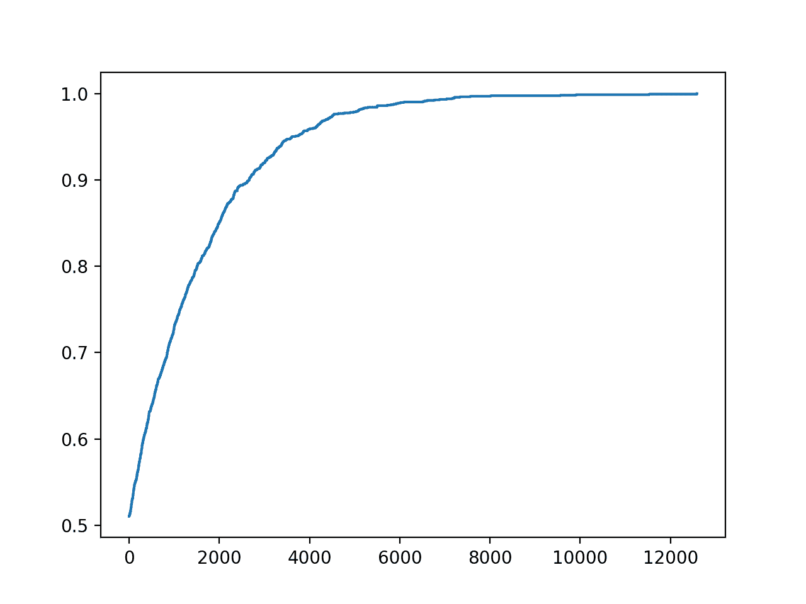
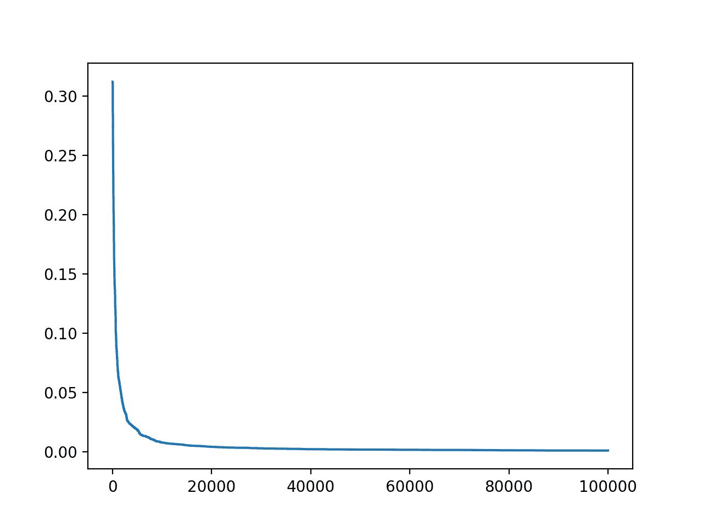

# 如何爬坡机器学习测试集

> 原文：<https://machinelearningmastery.com/hill-climb-the-test-set-for-machine-learning/>

最后更新于 2020 年 9 月 27 日

**爬坡测试集**是一种在机器学习比赛中实现良好或完美预测的方法，无需接触训练集，甚至无需开发预测模型。

作为一种机器学习竞赛的方法，它理所当然地遭到了反对，大多数竞赛平台都施加了限制来阻止它，这很重要。

然而，爬坡测试集是一个机器学习实践者在参加比赛时偶然做的事情。通过开发一个显式的实现来爬上测试集，它有助于更好地理解过度使用测试数据集来评估建模管道是多么容易。

在本教程中，您将发现如何爬坡机器学习的测试集。

完成本教程后，您将知道:

*   通过爬坡测试集，甚至不用看训练数据集，就可以做出完美的预测。
*   如何爬坡分类和回归任务的测试集？
*   当我们过度使用测试集来评估我们的建模管道时，我们隐式地爬坡测试集。

**用我的新书[机器学习的数据准备](https://machinelearningmastery.com/data-preparation-for-machine-learning/)启动你的项目**，包括*分步教程*和所有示例的 *Python 源代码*文件。

我们开始吧。


如何爬坡机器学习测试集
图片由[斯蒂格·尼加德](https://www.flickr.com/photos/stignygaard/41335312700/)提供，版权所有。

## 教程概述

本教程分为五个部分；它们是:

1.  爬坡测试装置
2.  爬坡算法
3.  如何实现爬坡
4.  爬坡糖尿病类别数据集
5.  爬坡住房回归数据集

## 爬坡测试装置

像 Kaggle 上的机器学习竞赛一样，机器学习竞赛提供了完整的训练数据集以及测试集的输入。

给定竞赛的目标是预测目标值，例如测试集的标签或数值。根据隐藏的测试集目标值评估解决方案，并适当评分。对测试集得分最高的提交作品将赢得比赛。

机器学习竞赛的挑战可以被定义为一个优化问题。传统上，竞赛参与者充当优化算法，探索导致不同预测集的不同建模管道，对预测进行评分，然后对管道进行更改，预计会提高评分。

这个过程也可以直接用优化算法建模，在优化算法中，候选预测被生成和评估，而不需要看训练集。

一般这被称为[爬坡](https://en.wikipedia.org/wiki/Hill_climbing)这个测试集，作为解决这个问题最简单的优化算法之一要实现的就是爬坡算法。

虽然**爬坡测试集在实际的机器学习比赛中理所当然地遭到了**的反对，但是为了了解该方法的局限性和过拟合测试集的危险，实现该方法可能是一个有趣的练习。此外，测试集可以在不接触训练数据集的情况下被完美预测，这一事实经常让许多机器学习初学者感到震惊。

最重要的是，当我们重复评估不同的建模管道时，我们隐式地爬上测试集。风险在于，在测试集上得分的提高是以泛化误差的增加为代价的，即在更广泛的问题上表现更差。

运行机器学习竞赛的人很清楚这个问题，并对预测评估施加限制来对抗它，例如每天将评估限制在一个或几个，并报告测试集的隐藏子集而不是整个测试集的分数。有关这方面的更多信息，请参阅后续阅读部分列出的论文。

接下来，让我们看看如何实现爬坡算法来优化测试集的预测。

## 爬坡算法

**爬坡算法**是一个非常简单的优化算法。

它包括生成候选解决方案并对其进行评估。这是一个起点，然后逐步改进，直到无法实现进一步的改进，或者我们没有时间、资源或兴趣。

从现有候选解决方案生成新的候选解决方案。通常，这包括对候选解决方案进行单次更改，对其进行评估，如果候选解决方案与先前的当前解决方案一样好或更好，则接受该候选解决方案作为新的“*当前*”解决方案。否则，将被丢弃。

我们可能认为只接受分数较高的候选人是个好主意。对于许多简单的问题来说，这是一种合理的方法，尽管在更复杂的问题上，为了帮助搜索过程缩放特征空间中的平坦区域(平台)，需要接受具有相同分数的不同候选。

爬坡测试集时，候选解是一个预测列表。对于二进制分类任务，这是两个类的 0 和 1 值的列表。对于回归任务，这是目标变量范围内的数字列表。

对用于分类的候选解决方案的修改是选择一个预测，并将其从 0 翻转到 1 或从 1 翻转到 0。对回归的候选解决方案的修改是向列表中的一个值添加高斯噪声，或者用新值替换列表中的一个值。

解决方案的评分包括计算评分标准，例如分类任务的分类准确率或回归任务的平均绝对误差。

现在我们已经熟悉了算法，让我们实现它。

## 如何实现爬坡

我们将在综合分类任务上开发我们的爬坡算法。

首先，让我们创建一个包含许多输入变量和 5000 行示例的二进制分类任务。然后，我们可以将数据集分成训练集和测试集。

下面列出了完整的示例。

```py
# example of a synthetic dataset.
from sklearn.datasets import make_classification
from sklearn.model_selection import train_test_split
# define dataset
X, y = make_classification(n_samples=5000, n_features=20, n_informative=15, n_redundant=5, random_state=1)
print(X.shape, y.shape)
# split dataset
X_train, X_test, y_train, y_test = train_test_split(X, y, test_size=0.33, random_state=1)
print(X_train.shape, X_test.shape, y_train.shape, y_test.shape)
```

运行该示例首先报告创建的数据集的形状，显示 5，000 行和 20 个输入变量。

然后将数据集分成训练集和测试集，约 3300 个用于训练，约 1600 个用于测试。

```py
(5000, 20) (5000,)
(3350, 20) (1650, 20) (3350,) (1650,)
```

现在我们可以培养一名登山者。

首先，我们可以创建一个函数来加载，或者在这种情况下，定义数据集。我们可以在以后想要更改数据集时更新这个函数。

```py
# load or prepare the classification dataset
def load_dataset():
	return make_classification(n_samples=5000, n_features=20, n_informative=15, n_redundant=5, random_state=1)
```

接下来，我们需要一个函数来评估候选解决方案——也就是预测列表。

我们将使用分类准确率，其中对于最差的可能解决方案，得分在 0 到 1 之间，对于一组完美的预测。

```py
# evaluate a set of predictions
def evaluate_predictions(y_test, yhat):
	return accuracy_score(y_test, yhat)
```

接下来，我们需要一个函数来创建一个初始候选解决方案。

这是 0 和 1 类标签的预测列表，足够长以匹配测试集中的示例数，在本例中为 1650 个。

我们可以使用 [randint()函数](https://docs.python.org/3/library/random.html#random.randint)生成 0 和 1 的随机值。

```py
# create a random set of predictions
def random_predictions(n_examples):
	return [randint(0, 1) for _ in range(n_examples)]
```

接下来，我们需要一个函数来创建候选解决方案的修改版本。

在这种情况下，这包括在解决方案中选择一个值，并将其从 0 翻转到 1 或从 1 翻转到 0。

通常，在爬坡过程中，我们会对每个新的候选解决方案进行一次更改，但是我已经对该函数进行了参数化，因此如果您愿意，您可以尝试进行多次更改。

```py
# modify the current set of predictions
def modify_predictions(current, n_changes=1):
	# copy current solution
	updated = current.copy()
	for i in range(n_changes):
		# select a point to change
		ix = randint(0, len(updated)-1)
		# flip the class label
		updated[ix] = 1 - updated[ix]
	return updated
```

目前为止，一切顺利。

接下来，我们可以开发执行搜索的功能。

首先，通过调用 *random_predictions()* 函数，然后调用 *evaluate_predictions()* 函数来创建和评估初始解。

然后我们循环固定次数的迭代，通过调用 *modify_predictions()* 生成一个新的候选，对其进行评估，如果得分和当前解一样好或者比当前解更好，则进行替换。

当我们完成预设的迭代次数(任意选择)或获得满分时，循环结束，在这种情况下，我们知道的是 1.0(100%)的准确率。

下面的函数*hill _ climp _ testset()*实现了这一点，将测试集作为输入，并返回在爬坡过程中找到的最佳预测集。

```py
# run a hill climb for a set of predictions
def hill_climb_testset(X_test, y_test, max_iterations):
	scores = list()
	# generate the initial solution
	solution = random_predictions(X_test.shape[0])
	# evaluate the initial solution
	score = evaluate_predictions(y_test, solution)
	scores.append(score)
	# hill climb to a solution
	for i in range(max_iterations):
		# record scores
		scores.append(score)
		# stop once we achieve the best score
		if score == 1.0:
			break
		# generate new candidate
		candidate = modify_predictions(solution)
		# evaluate candidate
		value = evaluate_predictions(y_test, candidate)
		# check if it is as good or better
		if value >= score:
			solution, score = candidate, value
			print('>%d, score=%.3f' % (i, score))
	return solution, scores
```

么事儿啦在那里。

下面列出了爬坡测试集的完整示例。

```py
# example of hill climbing the test set for a classification task
from random import randint
from sklearn.datasets import make_classification
from sklearn.model_selection import train_test_split
from sklearn.metrics import accuracy_score
from matplotlib import pyplot

# load or prepare the classification dataset
def load_dataset():
	return make_classification(n_samples=5000, n_features=20, n_informative=15, n_redundant=5, random_state=1)

# evaluate a set of predictions
def evaluate_predictions(y_test, yhat):
	return accuracy_score(y_test, yhat)

# create a random set of predictions
def random_predictions(n_examples):
	return [randint(0, 1) for _ in range(n_examples)]

# modify the current set of predictions
def modify_predictions(current, n_changes=1):
	# copy current solution
	updated = current.copy()
	for i in range(n_changes):
		# select a point to change
		ix = randint(0, len(updated)-1)
		# flip the class label
		updated[ix] = 1 - updated[ix]
	return updated

# run a hill climb for a set of predictions
def hill_climb_testset(X_test, y_test, max_iterations):
	scores = list()
	# generate the initial solution
	solution = random_predictions(X_test.shape[0])
	# evaluate the initial solution
	score = evaluate_predictions(y_test, solution)
	scores.append(score)
	# hill climb to a solution
	for i in range(max_iterations):
		# record scores
		scores.append(score)
		# stop once we achieve the best score
		if score == 1.0:
			break
		# generate new candidate
		candidate = modify_predictions(solution)
		# evaluate candidate
		value = evaluate_predictions(y_test, candidate)
		# check if it is as good or better
		if value >= score:
			solution, score = candidate, value
			print('>%d, score=%.3f' % (i, score))
	return solution, scores

# load the dataset
X, y = load_dataset()
print(X.shape, y.shape)
# split dataset into train and test sets
X_train, X_test, y_train, y_test = train_test_split(X, y, test_size=0.33, random_state=1)
print(X_train.shape, X_test.shape, y_train.shape, y_test.shape)
# run hill climb
yhat, scores = hill_climb_testset(X_test, y_test, 20000)
# plot the scores vs iterations
pyplot.plot(scores)
pyplot.show()
```

运行该示例将运行 20，000 次迭代的搜索，如果达到完美的准确率，则停止搜索。

**注**:考虑到算法或评估程序的随机性，或数值准确率的差异，您的[结果可能会有所不同](https://machinelearningmastery.com/different-results-each-time-in-machine-learning/)。考虑运行该示例几次，并比较平均结果。

在这种情况下，我们在大约 12，900 次迭代中为测试集找到了一组完美的预测。

回想一下，这是在不接触训练数据集和不通过查看测试集目标值作弊的情况下实现的。相反，我们只是优化了一组数字。

这里的教训是，针对测试集重复评估建模管道会做同样的事情，使用你作为爬坡优化算法。解决方案将会被测试集覆盖。

```py
...
>8092, score=0.996
>8886, score=0.997
>9202, score=0.998
>9322, score=0.998
>9521, score=0.999
>11046, score=0.999
>12932, score=1.000
```

还会创建一个优化进度图。

这有助于了解优化算法的变化如何影响搜索的收敛性，例如选择要改变什么以及在爬坡过程中如何改变。



分类任务的准确率与爬坡优化迭代的线图

现在我们已经熟悉了爬坡测试集，让我们在真实数据集上尝试这种方法。

## 爬坡糖尿病类别数据集

我们将使用糖尿病数据集作为基础来探索爬坡分类问题的测试集。

每份记录都描述了女性的医疗细节，预测是未来五年内糖尿病的发作。

*   [数据集详细信息:皮马-印第安人-糖尿病.名称](https://raw.githubusercontent.com/jbrownlee/Datasets/master/pima-indians-diabetes.names)
*   [数据集:pima-印度人-diabetes.csv](https://raw.githubusercontent.com/jbrownlee/Datasets/master/pima-indians-diabetes.csv)

数据集有 8 个输入变量和 768 行数据；输入变量都是数字，目标有两个类标签，例如，它是一个二进制分类任务。

下面提供了数据集前五行的示例。

```py
6,148,72,35,0,33.6,0.627,50,1
1,85,66,29,0,26.6,0.351,31,0
8,183,64,0,0,23.3,0.672,32,1
1,89,66,23,94,28.1,0.167,21,0
0,137,40,35,168,43.1,2.288,33,1
...
```

我们可以直接使用 Pandas 加载数据集，如下所示。

```py
# load or prepare the classification dataset
def load_dataset():
	url = 'https://raw.githubusercontent.com/jbrownlee/Datasets/master/pima-indians-diabetes.csv'
	df = read_csv(url, header=None)
	data = df.values
	return data[:, :-1], data[:, -1]
```

代码的其余部分保持不变。

这是这样创建的，以便您可以加入自己的二进制分类任务并尝试它。

下面列出了完整的示例。

```py
# example of hill climbing the test set for the diabetes dataset
from random import randint
from pandas import read_csv
from sklearn.model_selection import train_test_split
from sklearn.metrics import accuracy_score
from matplotlib import pyplot

# load or prepare the classification dataset
def load_dataset():
	url = 'https://raw.githubusercontent.com/jbrownlee/Datasets/master/pima-indians-diabetes.csv'
	df = read_csv(url, header=None)
	data = df.values
	return data[:, :-1], data[:, -1]

# evaluate a set of predictions
def evaluate_predictions(y_test, yhat):
	return accuracy_score(y_test, yhat)

# create a random set of predictions
def random_predictions(n_examples):
	return [randint(0, 1) for _ in range(n_examples)]

# modify the current set of predictions
def modify_predictions(current, n_changes=1):
	# copy current solution
	updated = current.copy()
	for i in range(n_changes):
		# select a point to change
		ix = randint(0, len(updated)-1)
		# flip the class label
		updated[ix] = 1 - updated[ix]
	return updated

# run a hill climb for a set of predictions
def hill_climb_testset(X_test, y_test, max_iterations):
	scores = list()
	# generate the initial solution
	solution = random_predictions(X_test.shape[0])
	# evaluate the initial solution
	score = evaluate_predictions(y_test, solution)
	scores.append(score)
	# hill climb to a solution
	for i in range(max_iterations):
		# record scores
		scores.append(score)
		# stop once we achieve the best score
		if score == 1.0:
			break
		# generate new candidate
		candidate = modify_predictions(solution)
		# evaluate candidate
		value = evaluate_predictions(y_test, candidate)
		# check if it is as good or better
		if value >= score:
			solution, score = candidate, value
			print('>%d, score=%.3f' % (i, score))
	return solution, scores

# load the dataset
X, y = load_dataset()
print(X.shape, y.shape)
# split dataset into train and test sets
X_train, X_test, y_train, y_test = train_test_split(X, y, test_size=0.33, random_state=1)
print(X_train.shape, X_test.shape, y_train.shape, y_test.shape)
# run hill climb
yhat, scores = hill_climb_testset(X_test, y_test, 5000)
# plot the scores vs iterations
pyplot.plot(scores)
pyplot.show()
```

每次在搜索过程中看到改进时，运行该示例都会报告迭代次数和准确性。

在这种情况下，我们使用更少的迭代，因为这是一个更简单的优化问题，因为我们要做的预测更少。

**注**:考虑到算法或评估程序的随机性，或数值准确率的差异，您的[结果可能会有所不同](https://machinelearningmastery.com/different-results-each-time-in-machine-learning/)。考虑运行该示例几次，并比较平均结果。

在这种情况下，我们可以看到我们在大约 1500 次迭代中达到了完美的准确率。

```py
...
>617, score=0.961
>627, score=0.965
>650, score=0.969
>683, score=0.972
>743, score=0.976
>803, score=0.980
>817, score=0.984
>945, score=0.988
>1350, score=0.992
>1387, score=0.996
>1565, score=1.000
```

还创建了搜索进度的线图，显示收敛速度很快。


糖尿病数据集的准确率线图与爬坡优化迭代

## 爬坡住房回归数据集

我们将使用房屋数据集作为基础来探索爬坡测试集回归问题。

房屋数据集涉及房屋及其附近地区的详细信息，以千美元为单位预测房价。

*   [数据集详细信息:房屋名称](https://raw.githubusercontent.com/jbrownlee/Datasets/master/housing.names)
*   [数据集:housing.csv](https://raw.githubusercontent.com/jbrownlee/Datasets/master/housing.csv)

这是一个回归问题，意味着我们预测的是一个数值。有 506 个观测值，有 13 个输入变量和一个输出变量。

下面列出了前五行的示例。

```py
0.00632,18.00,2.310,0,0.5380,6.5750,65.20,4.0900,1,296.0,15.30,396.90,4.98,24.00
0.02731,0.00,7.070,0,0.4690,6.4210,78.90,4.9671,2,242.0,17.80,396.90,9.14,21.60
0.02729,0.00,7.070,0,0.4690,7.1850,61.10,4.9671,2,242.0,17.80,392.83,4.03,34.70
0.03237,0.00,2.180,0,0.4580,6.9980,45.80,6.0622,3,222.0,18.70,394.63,2.94,33.40
0.06905,0.00,2.180,0,0.4580,7.1470,54.20,6.0622,3,222.0,18.70,396.90,5.33,36.20
...
```

首先，我们可以更新 *load_dataset()* 函数来加载房屋数据集。

作为加载数据集的一部分，我们将标准化目标值。这将使爬坡预测更简单，因为我们可以将浮点值限制在 0 到 1 的范围内。

这通常不是必需的，只是这里为简化搜索算法而采取的方法。

```py
# load or prepare the classification dataset
def load_dataset():
	url = 'https://raw.githubusercontent.com/jbrownlee/Datasets/master/housing.csv'
	df = read_csv(url, header=None)
	data = df.values
	X, y = data[:, :-1], data[:, -1]
	# normalize the target
	scaler = MinMaxScaler()
	y = y.reshape((len(y), 1))
	y = scaler.fit_transform(y)
	return X, y
```

接下来，我们可以更新评分函数，以使用期望值和预测值之间的平均绝对误差。

```py
# evaluate a set of predictions
def evaluate_predictions(y_test, yhat):
	return mean_absolute_error(y_test, yhat)
```

我们还必须将解决方案的表示从 0 和 1 标签更新为 0 和 1 之间的浮点值。

必须更改初始候选解的生成，以创建随机浮动列表。

```py
# create a random set of predictions
def random_predictions(n_examples):
	return [random() for _ in range(n_examples)]
```

在这种情况下，为了创建新的候选解决方案，对解决方案所做的单个更改只需要用新的随机浮点数替换列表中随机选择的预测。

我选择这个是因为它很简单。

```py
# modify the current set of predictions
def modify_predictions(current, n_changes=1):
	# copy current solution
	updated = current.copy()
	for i in range(n_changes):
		# select a point to change
		ix = randint(0, len(updated)-1)
		# flip the class label
		updated[ix] = random()
	return updated
```

更好的方法是将高斯噪声添加到现有值中，我将此作为扩展留给您。如果你尝试了，请在下面的评论中告诉我。

例如:

```py
...
# add gaussian noise
updated[ix] += gauss(0, 0.1)
```

最后，搜索必须更新。

最佳值现在是 0.0，用于在找到时停止搜索。

```py
...
# stop once we achieve the best score
if score == 0.0:
	break
```

我们还需要将搜索从最大化分数改为现在最小化分数。

```py
...
# check if it is as good or better
if value <= score:
	solution, score = candidate, value
	print('>%d, score=%.3f' % (i, score))
```

下面列出了这两项更改的更新搜索功能。

```py
# run a hill climb for a set of predictions
def hill_climb_testset(X_test, y_test, max_iterations):
	scores = list()
	# generate the initial solution
	solution = random_predictions(X_test.shape[0])
	# evaluate the initial solution
	score = evaluate_predictions(y_test, solution)
	print('>%.3f' % score)
	# hill climb to a solution
	for i in range(max_iterations):
		# record scores
		scores.append(score)
		# stop once we achieve the best score
		if score == 0.0:
			break
		# generate new candidate
		candidate = modify_predictions(solution)
		# evaluate candidate
		value = evaluate_predictions(y_test, candidate)
		# check if it is as good or better
		if value <= score:
			solution, score = candidate, value
			print('>%d, score=%.3f' % (i, score))
	return solution, scores
```

将这些联系在一起，下面列出了爬坡回归任务测试集的完整示例。

```py
# example of hill climbing the test set for the housing dataset
from random import random
from random import randint
from pandas import read_csv
from sklearn.model_selection import train_test_split
from sklearn.metrics import mean_absolute_error
from sklearn.preprocessing import MinMaxScaler
from matplotlib import pyplot

# load or prepare the classification dataset
def load_dataset():
	url = 'https://raw.githubusercontent.com/jbrownlee/Datasets/master/housing.csv'
	df = read_csv(url, header=None)
	data = df.values
	X, y = data[:, :-1], data[:, -1]
	# normalize the target
	scaler = MinMaxScaler()
	y = y.reshape((len(y), 1))
	y = scaler.fit_transform(y)
	return X, y

# evaluate a set of predictions
def evaluate_predictions(y_test, yhat):
	return mean_absolute_error(y_test, yhat)

# create a random set of predictions
def random_predictions(n_examples):
	return [random() for _ in range(n_examples)]

# modify the current set of predictions
def modify_predictions(current, n_changes=1):
	# copy current solution
	updated = current.copy()
	for i in range(n_changes):
		# select a point to change
		ix = randint(0, len(updated)-1)
		# flip the class label
		updated[ix] = random()
	return updated

# run a hill climb for a set of predictions
def hill_climb_testset(X_test, y_test, max_iterations):
	scores = list()
	# generate the initial solution
	solution = random_predictions(X_test.shape[0])
	# evaluate the initial solution
	score = evaluate_predictions(y_test, solution)
	print('>%.3f' % score)
	# hill climb to a solution
	for i in range(max_iterations):
		# record scores
		scores.append(score)
		# stop once we achieve the best score
		if score == 0.0:
			break
		# generate new candidate
		candidate = modify_predictions(solution)
		# evaluate candidate
		value = evaluate_predictions(y_test, candidate)
		# check if it is as good or better
		if value <= score:
			solution, score = candidate, value
			print('>%d, score=%.3f' % (i, score))
	return solution, scores

# load the dataset
X, y = load_dataset()
print(X.shape, y.shape)
# split dataset into train and test sets
X_train, X_test, y_train, y_test = train_test_split(X, y, test_size=0.33, random_state=1)
print(X_train.shape, X_test.shape, y_train.shape, y_test.shape)
# run hill climb
yhat, scores = hill_climb_testset(X_test, y_test, 100000)
# plot the scores vs iterations
pyplot.plot(scores)
pyplot.show()
```

运行该示例会报告每次在搜索过程中看到改进时的迭代次数和 MAE。

在这种情况下，我们使用更多的迭代，因为这是一个更复杂的优化问题。所选择的创建候选解决方案的方法也使它变得更慢，并且我们不太可能实现完美的错误。

事实上，我们不会实现完美的错误；相反，如果错误达到低于最小值的值，如 1e-7 或对目标域有意义的值，则最好停止。这也是留给读者的练习。

例如:

```py
...
# stop once we achieve a good enough
if score <= 1e-7:
	break
```

**注**:考虑到算法或评估程序的随机性，或数值准确率的差异，您的[结果可能会有所不同](https://machinelearningmastery.com/different-results-each-time-in-machine-learning/)。考虑运行该示例几次，并比较平均结果。

在这种情况下，我们可以看到，在运行结束时，我们实现了一个很好的错误。

```py
...
>95991, score=0.001
>96011, score=0.001
>96295, score=0.001
>96366, score=0.001
>96585, score=0.001
>97575, score=0.001
>98828, score=0.001
>98947, score=0.001
>99712, score=0.001
>99913, score=0.001
```

还创建了搜索进度的线图，显示收敛速度很快，并且在大多数迭代中保持平稳。



房屋数据集的准确率线图与爬坡优化迭代

## 进一步阅读

如果您想更深入地了解这个主题，本节将提供更多资源。

### 报纸

*   [利用日志丢失神谕攀登卡格尔排行榜](https://www.aaai.org/ocs/index.php/WS/AAAIW18/paper/viewPaper/16161)，2018。
*   [走向更好理解排行榜](https://arxiv.org/abs/1510.03349)，2017 年。
*   [阶梯:机器学习竞赛的可靠排行榜](https://arxiv.org/abs/1502.04585)，2015。

### 文章

*   [爬坡，维基百科](https://en.wikipedia.org/wiki/Hill_climbing)。

## 摘要

在本教程中，您发现了如何爬上机器学习的测试集。

具体来说，您了解到:

*   通过爬坡测试集，甚至不用看训练数据集，就可以做出完美的预测。
*   如何爬坡分类和回归任务的测试集？
*   当我们过度使用测试集来评估我们的建模管道时，我们隐式地爬坡测试集。

**你有什么问题吗？**
在下面的评论中提问，我会尽力回答。