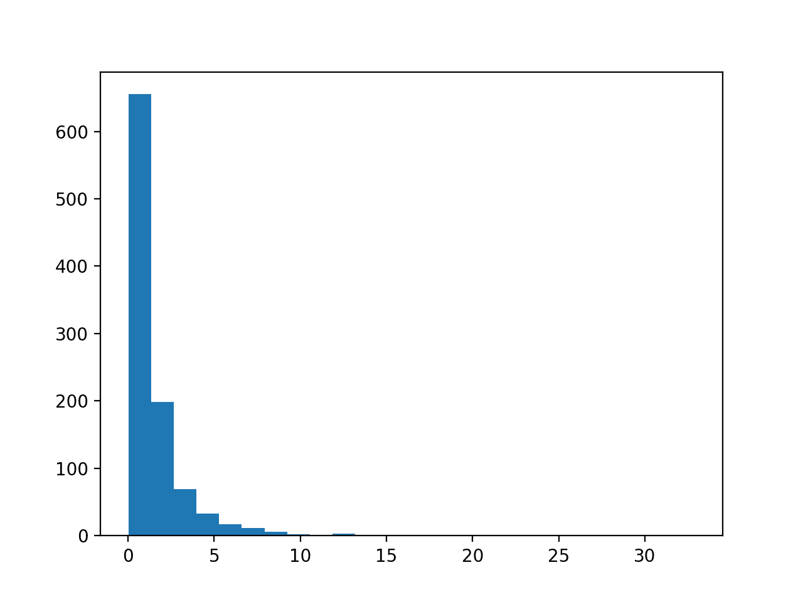
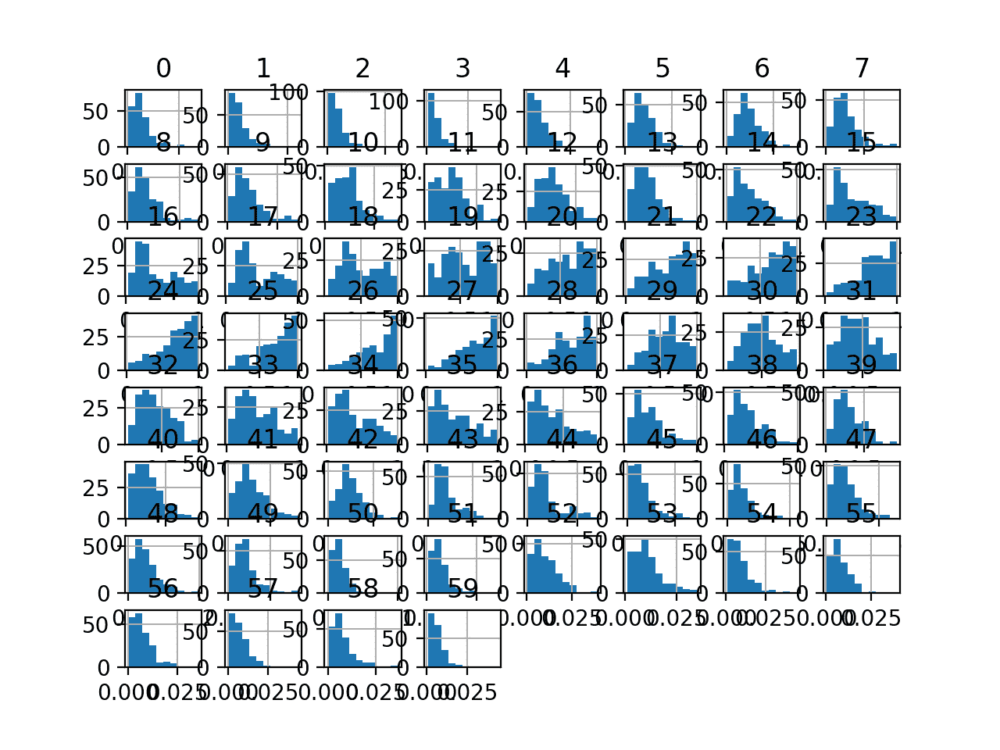
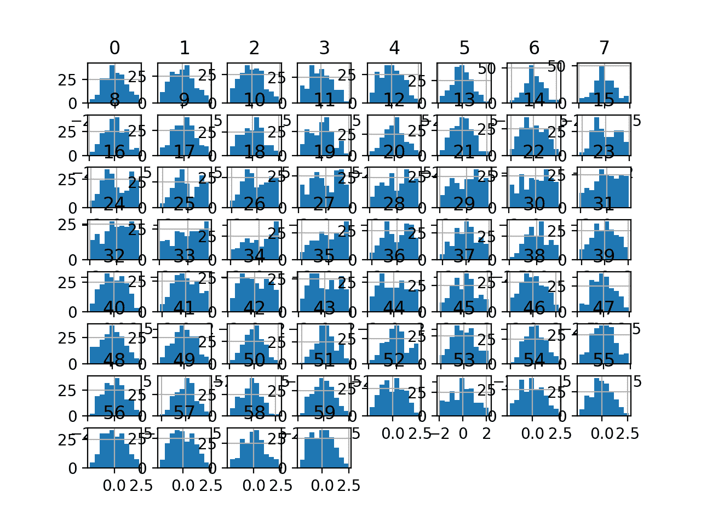

# 如何为机器学习使用幂变换

> 原文：<https://machinelearningmastery.com/power-transforms-with-Sklearn/>

最后更新于 2020 年 8 月 28 日

像[线性回归](https://machinelearningmastery.com/linear-regression-with-maximum-likelihood-estimation/)和[高斯朴素贝叶斯](https://machinelearningmastery.com/classification-as-conditional-probability-and-the-naive-bayes-algorithm/)这样的机器学习算法假设数值变量具有高斯概率分布。

您的数据可能没有[高斯分布](https://machinelearningmastery.com/continuous-probability-distributions-for-machine-learning/)，而是可能有类似高斯的分布(例如接近高斯但有异常值或偏斜)或完全不同的分布(例如指数分布)。

因此，通过将输入和/或输出变量转换为高斯或多高斯分布，您可能能够在各种机器学习算法上获得更好的表现。像 Box-Cox 变换和 Yeo-Johnson 变换这样的幂变换提供了一种对数据执行这些变换的自动方法，并且在 Sklearn Python 机器学习库中提供。

在本教程中，您将发现如何在 scikit 中使用幂变换-学习如何使变量更高斯化以进行建模。

完成本教程后，您将知道:

*   当数值变量具有高斯概率分布时，许多机器学习算法更喜欢或表现得更好。
*   幂变换是一种将数值输入或输出变量变换为高斯或更似高斯的概率分布的技术。
*   如何在 scikit 中使用 PowerTransform 学习在为预测建模准备数据时使用 Box-Cox 和 Yeo-Johnson 转换。

**用我的新书[机器学习的数据准备](https://machinelearningmastery.com/data-preparation-for-machine-learning/)启动你的项目**，包括*分步教程*和所有示例的 *Python 源代码*文件。

我们开始吧。


如何使用 scikit 进行电源转换-学习
图片由[伊恩·d·基廷](https://flickr.com/photos/ian-arlett/30436658200/)提供，版权所有。

## 教程概述

本教程分为五个部分；它们是:

1.  让数据更高斯化
2.  动力转换
3.  声纳数据集
4.  Box-Cox 变换
5.  约-约翰逊变换

## 让数据更高斯化

当变量分布为高斯分布时，许多机器学习算法的表现更好。

回想一下，每个变量的观测值可能被认为是从概率分布中得出的。高斯分布是常见的钟形分布。常见到经常被称为“*正态*分布。

有关高斯概率分布的更多信息，请参见教程:

*   [机器学习的连续概率分布](https://machinelearningmastery.com/continuous-probability-distributions-for-machine-learning/)

一些算法，如线性回归和逻辑回归，明确假设实值变量具有高斯分布。其他非线性算法可能没有这种假设，但当变量具有高斯分布时，往往表现更好。

这既适用于分类和回归任务中的实值输入变量，也适用于回归任务中的实值目标变量。

有一些数据准备技术可以用来转换每个变量，使分布为高斯分布，或者如果不是高斯分布，则更像高斯分布。

当数据分布开始时几乎是高斯分布，并且受到偏斜或异常值的影响时，这些变换最有效。

> 转换的另一个常见原因是消除分布偏斜度。非偏斜分布是一种大致对称的分布。这意味着落在分布均值两侧的概率大致相等

—第 31 页，[应用预测建模](https://amzn.to/3b2LHTL)，2013 年。

幂变换指的是一类使用幂函数(如对数或指数)来使变量的概率分布为高斯或类高斯分布的技术。

有关使变量高斯化的更多信息，请参见教程:

*   [如何转换数据以更好地拟合正态分布](https://machinelearningmastery.com/how-to-transform-data-to-fit-the-normal-distribution/)

## 动力转换

一个[幂变换](https://en.wikipedia.org/wiki/Power_transform)会让一个变量的概率分布更高斯。

这通常被描述为消除分布中的偏斜，尽管更一般地被描述为稳定分布的方差。

> 对数变换是称为幂变换的变换族的一个具体例子。用统计学术语来说，这些是稳定方差的变换。

—第 23 页，[机器学习的特征工程](https://amzn.to/2zZOQXN)，2018。

我们可以通过计算变量的对数或平方根来直接应用幂变换，尽管这可能是也可能不是给定变量的最佳幂变换。

> 用对数、平方根或倒数替换数据可能有助于消除偏差。

—第 31 页，[应用预测建模](https://amzn.to/3b2LHTL)，2013 年。

相反，我们可以使用广义版本的变换，它找到一个参数( *lambda* )来最好地将变量变换为高斯概率分布。

这种自动功率变换有两种流行的方法；它们是:

*   Box-Cox 变换
*   约-约翰逊变换

然后，转换后的训练数据集可以被馈送到机器学习模型，以学习预测建模任务。

超参数，通常称为λ，用于控制变换的性质。

> …统计方法可用于根据经验确定适当的转换。Box 和 Cox (1964)提出了一系列由参数索引的转换，表示为 lambda

—第 32 页，[应用预测建模](https://amzn.to/3b2LHTL)，2013 年。

以下是一些常见的λ值

*   *λ*=-1。是一种相互转换。
*   *λ*=-0.5 是倒数平方根变换。
*   *λ*= 0.0 是对数变换。
*   *λ*= 0.5 是平方根变换。
*   *λ*= 1.0 为无变换。

在每个变量的转换中使用的这个超参数的最优值可以被存储和重用，以便将来以相同的方式转换新数据，例如测试数据集或将来的新数据。

这些电源转换可通过[电源转换器类](https://Sklearn.org/stable/modules/generated/sklearn.preprocessing.PowerTransformer.html)在 Sklearn Python 机器学习库中获得。

该类采用名为“*方法*的参数，该参数可以设置为“*约-约翰逊*或“ *box-cox* ”作为首选方法。它还将在转换后自动标准化数据，这意味着每个变量都将具有零均值和单位方差。这可以通过将“*标准化*”参数设置为*假*来关闭。

我们可以用一个小的工作示例来演示*电力变压器*。我们可以生成[随机高斯数](https://machinelearningmastery.com/how-to-generate-random-numbers-in-python/)的样本，并通过计算指数对分布施加偏斜。然后，电力变压器可用于自动消除数据偏差。

下面列出了完整的示例。

```py
# demonstration of the power transform on data with a skew
from numpy import exp
from numpy.random import randn
from sklearn.preprocessing import PowerTransformer
from matplotlib import pyplot
# generate gaussian data sample
data = randn(1000)
# add a skew to the data distribution
data = exp(data)
# histogram of the raw data with a skew
pyplot.hist(data, bins=25)
pyplot.show()
# reshape data to have rows and columns
data = data.reshape((len(data),1))
# power transform the raw data
power = PowerTransformer(method='yeo-johnson', standardize=True)
data_trans = power.fit_transform(data)
# histogram of the transformed data
pyplot.hist(data_trans, bins=25)
pyplot.show()
```

运行该示例首先创建一个 1，000 个随机高斯值的样本，并向数据集添加一个倾斜。

从倾斜的数据集中创建直方图，并清楚地显示被推到最左边的分布。



偏斜高斯分布直方图

然后使用*电力变压器*使数据分布更具高斯性，并将结果标准化，以平均值 0 和标准偏差 1.0 为中心。

创建变换数据的直方图，显示更高斯形状的数据分布。


幂变换后偏斜高斯数据的直方图

在接下来的几节中，我们将详细了解如何在真实数据集上使用这两种幂变换。

接下来，让我们介绍数据集。

## 声纳数据集

声纳数据集是用于二进制分类的标准机器学习数据集。

它包括 60 个实值输入和一个 2 类目标变量。数据集中有 208 个示例，类别相当均衡。

使用重复的分层 10 倍交叉验证，基线分类算法可以达到大约 53.4%的分类准确率。[使用重复的分层 10 倍交叉验证，该数据集的最高表现](https://machinelearningmastery.com/results-for-standard-classification-and-regression-machine-learning-datasets/)约为 88%。

该数据集描述了岩石或模拟地雷的雷达回波。

您可以从这里了解有关数据集的更多信息:

*   [声纳数据集](https://raw.githubusercontent.com/jbrownlee/Datasets/master/sonar.csv)
*   [声纳数据集描述](https://raw.githubusercontent.com/jbrownlee/Datasets/master/sonar.names)

不需要下载数据集；我们将从我们的工作示例中自动下载它。

首先，让我们加载并总结数据集。下面列出了完整的示例。

```py
# load and summarize the sonar dataset
from pandas import read_csv
from pandas.plotting import scatter_matrix
from matplotlib import pyplot
# Load dataset
url = "https://raw.githubusercontent.com/jbrownlee/Datasets/master/sonar.csv"
dataset = read_csv(url, header=None)
# summarize the shape of the dataset
print(dataset.shape)
# summarize each variable
print(dataset.describe())
# histograms of the variables
dataset.hist()
pyplot.show()
```

运行该示例首先总结加载数据集的形状。

这确认了 60 个输入变量、一个输出变量和 208 行数据。

提供了输入变量的统计摘要，显示值是数值，范围大约从 0 到 1。

```py
(208, 61)
               0           1           2   ...          57          58          59
count  208.000000  208.000000  208.000000  ...  208.000000  208.000000  208.000000
mean     0.029164    0.038437    0.043832  ...    0.007949    0.007941    0.006507
std      0.022991    0.032960    0.038428  ...    0.006470    0.006181    0.005031
min      0.001500    0.000600    0.001500  ...    0.000300    0.000100    0.000600
25%      0.013350    0.016450    0.018950  ...    0.003600    0.003675    0.003100
50%      0.022800    0.030800    0.034300  ...    0.005800    0.006400    0.005300
75%      0.035550    0.047950    0.057950  ...    0.010350    0.010325    0.008525
max      0.137100    0.233900    0.305900  ...    0.044000    0.036400    0.043900

[8 rows x 60 columns]
```

最后，为每个输入变量创建一个直方图。

如果我们忽略图中杂乱的东西，专注于直方图本身，我们可以看到许多变量都有一个偏斜的分布。

数据集为使用幂变换使变量更具高斯性提供了一个很好的候选对象。



声纳二进制类别数据集输入变量的直方图

接下来，让我们在原始数据集上拟合和评估一个机器学习模型。

我们将使用带有默认超参数的 [k 最近邻算法](https://machinelearningmastery.com/tutorial-to-implement-k-nearest-neighbors-in-python-from-scratch/)，并使用重复的分层 K 折交叉验证对其进行评估。下面列出了完整的示例。

```py
# evaluate knn on the raw sonar dataset
from numpy import mean
from numpy import std
from pandas import read_csv
from sklearn.model_selection import cross_val_score
from sklearn.model_selection import RepeatedStratifiedKFold
from sklearn.neighbors import KNeighborsClassifier
from sklearn.preprocessing import LabelEncoder
from matplotlib import pyplot
# load dataset
url = "https://raw.githubusercontent.com/jbrownlee/Datasets/master/sonar.csv"
dataset = read_csv(url, header=None)
data = dataset.values
# separate into input and output columns
X, y = data[:, :-1], data[:, -1]
# ensure inputs are floats and output is an integer label
X = X.astype('float32')
y = LabelEncoder().fit_transform(y.astype('str'))
# define and configure the model
model = KNeighborsClassifier()
# evaluate the model
cv = RepeatedStratifiedKFold(n_splits=10, n_repeats=3, random_state=1)
n_scores = cross_val_score(model, X, y, scoring='accuracy', cv=cv, n_jobs=-1, error_score='raise')
# report model performance
print('Accuracy: %.3f (%.3f)' % (mean(n_scores), std(n_scores)))
```

运行该示例会评估原始声纳数据集上的 KNN 模型。

**注**:考虑到算法或评估程序的随机性，或数值准确率的差异，您的[结果可能会有所不同](https://machinelearningmastery.com/different-results-each-time-in-machine-learning/)。考虑运行该示例几次，并比较平均结果。

我们可以看到，该模型实现了大约 79.7%的平均分类准确率，表明它具有技巧性(优于 53.4%)，并且处于良好表现的球园区(88%)。

```py
Accuracy: 0.797 (0.073)
```

接下来，让我们探索数据集的 Box-Cox 幂变换。

## Box-Cox 变换

Box-Cox 变换以该方法的两位作者的名字命名。

这是一种幂变换，假设它所应用的输入变量的值为**严格正**。这意味着不支持 0 和负值。

> 需要注意的是，Box-Cox 程序只能应用于严格正的数据。

—第 123 页，[特征工程与选择](https://amzn.to/2Yvcupn)，2019。

我们可以使用 *PowerTransformer* 类应用 Box-Cox 变换，并将“*方法*参数设置为“ *box-cox* ”。一旦定义，我们就可以调用 *fit_transform()* 函数，并将其传递给我们的数据集，以创建数据集的 Box-Cox 转换版本。

```py
...
pt = PowerTransformer(method='box-cox')
data = pt.fit_transform(data)
```

我们的数据集没有负值，但可能有零值。这可能会导致问题。

我们还是试试吧。

下面列出了创建声纳数据集的 Box-Cox 变换并绘制结果直方图的完整示例。

```py
# visualize a box-cox transform of the sonar dataset
from pandas import read_csv
from pandas import DataFrame
from pandas.plotting import scatter_matrix
from sklearn.preprocessing import PowerTransformer
from matplotlib import pyplot
# Load dataset
url = "https://raw.githubusercontent.com/jbrownlee/Datasets/master/sonar.csv"
dataset = read_csv(url, header=None)
# retrieve just the numeric input values
data = dataset.values[:, :-1]
# perform a box-cox transform of the dataset
pt = PowerTransformer(method='box-cox')
data = pt.fit_transform(data)
# convert the array back to a dataframe
dataset = DataFrame(data)
# histograms of the variables
dataset.hist()
pyplot.show()
```

运行该示例会导致如下错误:

```py
ValueError: The Box-Cox transformation can only be applied to strictly positive data
```

不出所料，我们无法对原始数据使用转换，因为它不是严格正的。

解决这个问题的一种方法是使用 [MixMaxScaler 变换](https://Sklearn.org/stable/modules/generated/sklearn.preprocessing.MinMaxScaler.html)首先将数据缩放到正值，然后应用该变换。

我们可以使用[管道对象](https://Sklearn.org/stable/modules/generated/sklearn.pipeline.Pipeline.html)依次应用两种变换；例如:

```py
...
# perform a box-cox transform of the dataset
scaler = MinMaxScaler(feature_range=(1, 2))
power = PowerTransformer(method='box-cox')
pipeline = Pipeline(steps=[('s', scaler),('p', power)])
data = pipeline.fit_transform(data)
```

下面列出了将 Box-Cox 变换应用于缩放数据集的更新版本。

```py
# visualize a box-cox transform of the scaled sonar dataset
from pandas import read_csv
from pandas import DataFrame
from pandas.plotting import scatter_matrix
from sklearn.preprocessing import PowerTransformer
from sklearn.preprocessing import MinMaxScaler
from sklearn.pipeline import Pipeline
from matplotlib import pyplot
# Load dataset
url = "https://raw.githubusercontent.com/jbrownlee/Datasets/master/sonar.csv"
dataset = read_csv(url, header=None)
# retrieve just the numeric input values
data = dataset.values[:, :-1]
# perform a box-cox transform of the dataset
scaler = MinMaxScaler(feature_range=(1, 2))
power = PowerTransformer(method='box-cox')
pipeline = Pipeline(steps=[('s', scaler),('p', power)])
data = pipeline.fit_transform(data)
# convert the array back to a dataframe
dataset = DataFrame(data)
# histograms of the variables
dataset.hist()
pyplot.show()
```

运行该示例会转换数据集并绘制每个输入变量的直方图。

我们可以看到，每个变量的直方图形状看起来比原始数据更高斯。



声纳数据集的 Box-Cox 变换输入变量直方图

接下来，让我们评估与上一节相同的 KNN 模型，但是在这种情况下是在缩放数据集的 Box-Cox 变换上。

下面列出了完整的示例。

```py
# evaluate knn on the box-cox sonar dataset
from numpy import mean
from numpy import std
from pandas import read_csv
from sklearn.model_selection import cross_val_score
from sklearn.model_selection import RepeatedStratifiedKFold
from sklearn.neighbors import KNeighborsClassifier
from sklearn.preprocessing import LabelEncoder
from sklearn.preprocessing import PowerTransformer
from sklearn.preprocessing import MinMaxScaler
from sklearn.pipeline import Pipeline
from matplotlib import pyplot
# load dataset
url = "https://raw.githubusercontent.com/jbrownlee/Datasets/master/sonar.csv"
dataset = read_csv(url, header=None)
data = dataset.values
# separate into input and output columns
X, y = data[:, :-1], data[:, -1]
# ensure inputs are floats and output is an integer label
X = X.astype('float32')
y = LabelEncoder().fit_transform(y.astype('str'))
# define the pipeline
scaler = MinMaxScaler(feature_range=(1, 2))
power = PowerTransformer(method='box-cox')
model = KNeighborsClassifier()
pipeline = Pipeline(steps=[('s', scaler),('p', power), ('m', model)])
# evaluate the pipeline
cv = RepeatedStratifiedKFold(n_splits=10, n_repeats=3, random_state=1)
n_scores = cross_val_score(pipeline, X, y, scoring='accuracy', cv=cv, n_jobs=-1, error_score='raise')
# report pipeline performance
print('Accuracy: %.3f (%.3f)' % (mean(n_scores), std(n_scores)))
```

**注**:考虑到算法或评估程序的随机性，或数值准确率的差异，您的[结果可能会有所不同](https://machinelearningmastery.com/different-results-each-time-in-machine-learning/)。考虑运行该示例几次，并比较平均结果。

运行该示例，我们可以看到 Box-Cox 变换将表现从没有变换时的 79.7%提升到有变换时的 81.1%。

```py
Accuracy: 0.811 (0.085)
```

接下来，让我们仔细看看杨-约翰逊变换。

## 约-约翰逊变换

杨-约翰逊变换也以作者的名字命名。

与 Box-Cox 变换不同，它不要求每个输入变量的值严格为正。它支持零值和负值。这意味着我们可以将其应用于数据集，而无需先对其进行缩放。

我们可以通过定义一个 *PowerTransform* 对象并将“*方法*”参数设置为“ *yeo-johnson* ”(默认值)来应用转换。

```py
...
# perform a yeo-johnson transform of the dataset
pt = PowerTransformer(method='yeo-johnson')
data = pt.fit_transform(data)
```

下面的示例应用了约-约翰逊变换，并创建了每个变换变量的直方图。

```py
# visualize a yeo-johnson transform of the sonar dataset
from pandas import read_csv
from pandas import DataFrame
from pandas.plotting import scatter_matrix
from sklearn.preprocessing import PowerTransformer
from matplotlib import pyplot
# Load dataset
url = "https://raw.githubusercontent.com/jbrownlee/Datasets/master/sonar.csv"
dataset = read_csv(url, header=None)
# retrieve just the numeric input values
data = dataset.values[:, :-1]
# perform a yeo-johnson transform of the dataset
pt = PowerTransformer(method='yeo-johnson')
data = pt.fit_transform(data)
# convert the array back to a dataframe
dataset = DataFrame(data)
# histograms of the variables
dataset.hist()
pyplot.show()
```

运行该示例会转换数据集并绘制每个输入变量的直方图。

我们可以看到，每个变量的直方图形状看起来比原始数据更高斯，很像 box-cox 变换。


声纳数据集的约-约翰逊变换输入变量直方图

接下来，让我们评估与上一节相同的 KNN 模型，但在本例中是对原始数据集的 Yeo-Johnson 变换。

下面列出了完整的示例。

```py
# evaluate knn on the yeo-johnson sonar dataset
from numpy import mean
from numpy import std
from pandas import read_csv
from sklearn.model_selection import cross_val_score
from sklearn.model_selection import RepeatedStratifiedKFold
from sklearn.neighbors import KNeighborsClassifier
from sklearn.preprocessing import LabelEncoder
from sklearn.preprocessing import PowerTransformer
from sklearn.preprocessing import MinMaxScaler
from sklearn.pipeline import Pipeline
from matplotlib import pyplot
# load dataset
url = "https://raw.githubusercontent.com/jbrownlee/Datasets/master/sonar.csv"
dataset = read_csv(url, header=None)
data = dataset.values
# separate into input and output columns
X, y = data[:, :-1], data[:, -1]
# ensure inputs are floats and output is an integer label
X = X.astype('float32')
y = LabelEncoder().fit_transform(y.astype('str'))
# define the pipeline
power = PowerTransformer(method='yeo-johnson')
model = KNeighborsClassifier()
pipeline = Pipeline(steps=[('p', power), ('m', model)])
# evaluate the pipeline
cv = RepeatedStratifiedKFold(n_splits=10, n_repeats=3, random_state=1)
n_scores = cross_val_score(pipeline, X, y, scoring='accuracy', cv=cv, n_jobs=-1, error_score='raise')
# report pipeline performance
print('Accuracy: %.3f (%.3f)' % (mean(n_scores), std(n_scores)))
```

**注**:考虑到算法或评估程序的随机性，或数值准确率的差异，您的[结果可能会有所不同](https://machinelearningmastery.com/different-results-each-time-in-machine-learning/)。考虑运行该示例几次，并比较平均结果。

运行该示例，我们可以看到 Yeo-Johnson 变换将表现从没有变换时的 79.7%提升到有变换时的约 80.8%，低于达到约 81.1%的 Box-Cox 变换。

```py
Accuracy: 0.808 (0.082)
```

有时，通过在执行约-约翰逊变换之前首先标准化原始数据集，可以提高表现。

我们可以通过添加一个[标准缩放器](https://Sklearn.org/stable/modules/generated/sklearn.preprocessing.StandardScaler.html)来探索这一点，作为管道的第一步。

下面列出了完整的示例。

```py
# evaluate knn on the yeo-johnson standardized sonar dataset
from numpy import mean
from numpy import std
from pandas import read_csv
from sklearn.model_selection import cross_val_score
from sklearn.model_selection import RepeatedStratifiedKFold
from sklearn.neighbors import KNeighborsClassifier
from sklearn.preprocessing import LabelEncoder
from sklearn.preprocessing import PowerTransformer
from sklearn.preprocessing import StandardScaler
from sklearn.pipeline import Pipeline
from matplotlib import pyplot
# load dataset
url = "https://raw.githubusercontent.com/jbrownlee/Datasets/master/sonar.csv"
dataset = read_csv(url, header=None)
data = dataset.values
# separate into input and output columns
X, y = data[:, :-1], data[:, -1]
# ensure inputs are floats and output is an integer label
X = X.astype('float32')
y = LabelEncoder().fit_transform(y.astype('str'))
# define the pipeline
scaler = StandardScaler()
power = PowerTransformer(method='yeo-johnson')
model = KNeighborsClassifier()
pipeline = Pipeline(steps=[('s', scaler), ('p', power), ('m', model)])
# evaluate the pipeline
cv = RepeatedStratifiedKFold(n_splits=10, n_repeats=3, random_state=1)
n_scores = cross_val_score(pipeline, X, y, scoring='accuracy', cv=cv, n_jobs=-1, error_score='raise')
# report pipeline performance
print('Accuracy: %.3f (%.3f)' % (mean(n_scores), std(n_scores)))
```

**注**:考虑到算法或评估程序的随机性，或数值准确率的差异，您的[结果可能会有所不同](https://machinelearningmastery.com/different-results-each-time-in-machine-learning/)。考虑运行该示例几次，并比较平均结果。

运行该示例，我们可以看到，在 Yeo-Johnson 转换之前对数据进行标准化导致表现从约 80.8%小幅提升至约 81.6%，比 Box-Cox 转换的结果略有提升。

```py
Accuracy: 0.816 (0.077)
```

## 进一步阅读

如果您想更深入地了解这个主题，本节将提供更多资源。

### 教程

*   [机器学习的连续概率分布](https://machinelearningmastery.com/continuous-probability-distributions-for-machine-learning/)
*   [如何用 Python 对时间序列预测数据进行幂变换](https://machinelearningmastery.com/power-transform-time-series-forecast-data-python/)
*   [如何用 Scikit 转换回归的目标变量-学习](https://machinelearningmastery.com/how-to-transform-target-variables-for-regression-with-Sklearn/)
*   [如何转换数据以更好地拟合正态分布](https://machinelearningmastery.com/how-to-transform-data-to-fit-the-normal-distribution/)
*   [4 时间序列预测的常用机器学习数据转换](https://machinelearningmastery.com/machine-learning-data-transforms-for-time-series-forecasting/)

### 书

*   [机器学习的特征工程](https://amzn.to/2zZOQXN)，2018。
*   [应用预测建模](https://amzn.to/3b2LHTL)，2013。
*   [特征工程与选择](https://amzn.to/2Yvcupn)，2019。

### 资料组

*   [声纳数据集](https://raw.githubusercontent.com/jbrownlee/Datasets/master/sonar.csv)
*   [声纳数据集描述](https://raw.githubusercontent.com/jbrownlee/Datasets/master/sonar.names)

### 蜜蜂

*   [非线性变换，sci kit-学习指南](https://Sklearn.org/stable/modules/preprocessing.html#preprocessing-transformer)。
*   [硬化。预处理。PowerTransformer API](https://Sklearn.org/stable/modules/generated/sklearn.preprocessing.PowerTransformer.html) 。

### 文章

*   [电力变换，维基百科](https://en.wikipedia.org/wiki/Power_transform)。

## 摘要

在本教程中，您发现了如何在 scikit 中使用幂变换-学习使变量更高斯化以进行建模。

具体来说，您了解到:

*   当数值变量具有高斯概率分布时，许多机器学习算法更喜欢或表现得更好。
*   幂变换是一种将数值输入或输出变量变换为高斯或更似高斯的概率分布的技术。
*   如何在 scikit 中使用 PowerTransform 学习在为预测建模准备数据时使用 Box-Cox 和 Yeo-Johnson 转换。

**你有什么问题吗？**
在下面的评论中提问，我会尽力回答。