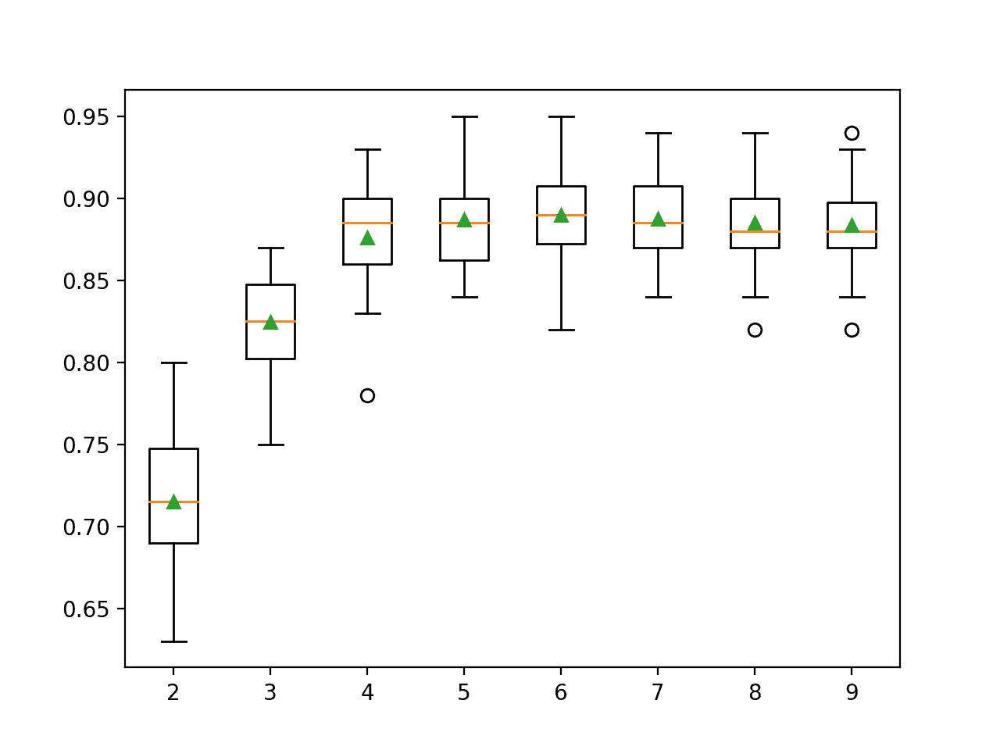
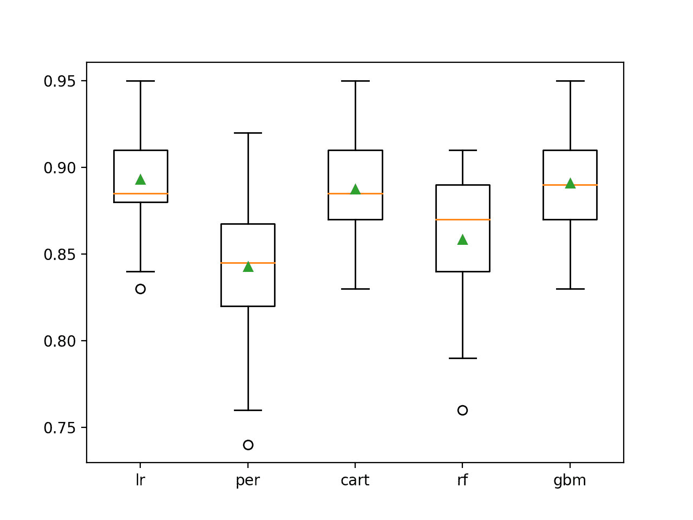

# Python 中用于特征选择的递归特征消除（RFE）

> 原文：<https://machinelearningmastery.com/rfe-feature-selection-in-python/>

最后更新于 2020 年 8 月 28 日

**递归特征消除**，简称 RFE，是一种流行的特征选择算法。

RFE 之所以受欢迎，是因为它易于配置和使用，并且可以有效地选择训练数据集中与预测目标变量更相关或最相关的特征(列)。

使用 RFE 时，有两个重要的配置选项:选择要选择的特征数量和选择用于帮助选择特征的算法。这两个超参数都可以探索，尽管该方法的表现并不强烈依赖于这些超参数的良好配置。

在本教程中，您将发现如何在 Python 中使用递归特征消除(RFE)进行特征选择。

完成本教程后，您将知道:

*   RFE 是一种从训练数据集中消除特征以进行特征选择的有效方法。
*   如何使用 RFE 进行分类和回归预测建模问题的特征选择。
*   如何探索 RFE 程序使用的选定特征和包装算法的数量。

**用我的新书[机器学习的数据准备](https://machinelearningmastery.com/data-preparation-for-machine-learning/)启动你的项目**，包括*分步教程*和所有示例的 *Python 源代码*文件。

我们开始吧。


Python
中特征选择的递归特征消除(RFE)摄于[djandywdocom](https://flickr.com/photos/djandywdotcom/39181712580/)，保留部分权利。

## 教程概述

本教程分为三个部分；它们是:

1.  递归特征消除
2.  RFE 与科学知识——学习
    1.  RFE 分类协会
    2.  回归的 RFE
3.  RFE 超参数
    1.  探索功能数量
    2.  自动选择特征数量
    3.  选择了哪些功能
    4.  探索基础算法

## 递归特征消除

递归特征消除，简称 RFE，是一种特征选择算法。

用于分类或回归的机器学习数据集由行和列组成，就像 excel 电子表格一样。行通常被称为样本，列被称为特征，例如问题域中的观察特征。

要素选择是指为数据集选择最相关要素(列)子集的技术。更少的特性可以让机器学习算法更高效地运行(更少的空间或时间复杂度)并且更有效。一些机器学习算法会被不相关的输入特征误导，导致预测表现变差。

有关一般特征选择的更多信息，请参见教程:

*   [Python 中机器学习的特征选择](https://machinelearningmastery.com/feature-selection-machine-learning-python/)

RFE 是一种包装类型的特征选择算法。这意味着在该方法的核心中给出并使用了不同的机器学习算法，该算法由 RFE 包装，并用于帮助选择特征。这与基于过滤器的特征选择形成对比，基于过滤器的特征选择对每个特征进行评分，并选择那些得分最大(或最小)的特征。

从技术上讲，RFE 是一种包装器风格的特征选择算法，它也在内部使用基于过滤器的特征选择。

RFE 的工作原理是从训练数据集中的所有要素开始搜索要素子集，并成功移除要素，直到剩余所需数量。

这是通过拟合模型核心中使用的给定机器学习算法、按重要性排列特征、丢弃最不重要的特征以及重新拟合模型来实现的。重复此过程，直到保留指定数量的特征。

> 当完整的模型被创建时，可变重要性的度量被计算，其将预测器从最重要到最不重要排序。[……]在搜索的每个阶段，在重建模型之前，迭代地消除最不重要的预测因子。

—第 494-495 页，[应用预测建模](https://amzn.to/2Sx5bJ1)，2013。

使用所提供的机器学习模型(例如，像决策树这样的一些算法提供重要性分数)或使用统计方法对特征进行评分。

> 重要性计算可以基于模型(例如，随机森林重要性标准)或者使用独立于完整模型的更一般的方法。

—第 494 页，[应用预测建模](https://amzn.to/2Sx5bJ1)，2013 年。

现在我们已经熟悉了 RFE 程序，让我们回顾一下如何在我们的项目中使用它。

## RFE 与科学知识——学习

RFE 可以从零开始实现，尽管对初学者来说很有挑战性。

Sklearn Python 机器学习库为机器学习提供了 RFE 的实现。

它有现代版本的图书馆。

首先，通过运行以下脚本来确认您使用的是现代版本的库:

```py
# check Sklearn version
import sklearn
print(sklearn.__version__)
```

运行脚本将打印您的 Sklearn 版本。

您的版本应该相同或更高。如果没有，您必须升级 Sklearn 库的版本。

```py
0.22.1
```

RFE 方法可通过 Sklearn 中的 [RFE 课程](https://Sklearn.org/stable/modules/generated/sklearn.feature_selection.RFE.html)获得。

RFE 是一个转变。要使用它，首先用通过“*估计器*参数指定的选择算法和通过“ *n_features_to_select* 参数选择的特征数量来配置类。

该算法必须提供一种计算重要分数的方法，例如决策树。在 RFE 使用的算法不必是适合所选特征的算法；可以使用不同的算法。

配置后，该类必须适合训练数据集，以便通过调用 *fit()* 函数来选择特征。类拟合后，输入变量的选择可以通过“ *support_* ”属性看到，该属性为每个输入变量提供一个*真*或*假*。

然后可以通过调用*变换()*函数将其应用于训练和测试数据集。

```py
...
# define the method
rfe = RFE(estimator=DecisionTreeClassifier(), n_features_to_select=3)
# fit the model
rfe.fit(X, y)
# transform the data
X, y = rfe.transform(X, y)
```

通常使用 [k 倍交叉验证](https://machinelearningmastery.com/k-fold-cross-validation/)来评估数据集上的机器学习算法。当使用交叉验证时，最好像 RFE 一样执行数据转换，作为[管道](https://Sklearn.org/stable/modules/generated/sklearn.pipeline.Pipeline.html)的一部分，以避免数据泄漏。

现在我们已经熟悉了 RFE API，让我们看看如何为分类和回归开发一个 RFE。

### RFE 分类协会

在这一节中，我们将研究使用 RFE 进行分类的问题。

首先，我们可以使用 [make_classification()函数](https://Sklearn.org/stable/modules/generated/sklearn.datasets.make_classification.html)创建一个包含 1000 个示例和 10 个输入特征的合成二进制分类问题，其中 5 个是重要的，5 个是冗余的。

下面列出了完整的示例。

```py
# test classification dataset
from sklearn.datasets import make_classification
# define dataset
X, y = make_classification(n_samples=1000, n_features=10, n_informative=5, n_redundant=5, random_state=1)
# summarize the dataset
print(X.shape, y.shape)
```

运行该示例将创建数据集并总结输入和输出组件的形状。

```py
(1000, 10) (1000,)
```

接下来，我们可以在这个数据集上评估 RFE 特征选择算法。我们将使用[决策树分类器](https://Sklearn.org/stable/modules/generated/sklearn.tree.DecisionTreeClassifier.html)来选择特征，并将特征数量设置为 5。然后，我们将在所选特征上安装一个新的*决策树分类器*模型。

我们将使用重复的分层 k 折叠交叉验证来评估模型，重复 3 次，折叠 10 次。我们将报告所有重复和折叠的模型准确率的平均值和标准偏差。

下面列出了完整的示例。

```py
# evaluate RFE for classification
from numpy import mean
from numpy import std
from sklearn.datasets import make_classification
from sklearn.model_selection import cross_val_score
from sklearn.model_selection import RepeatedStratifiedKFold
from sklearn.feature_selection import RFE
from sklearn.tree import DecisionTreeClassifier
from sklearn.pipeline import Pipeline
# define dataset
X, y = make_classification(n_samples=1000, n_features=10, n_informative=5, n_redundant=5, random_state=1)
# create pipeline
rfe = RFE(estimator=DecisionTreeClassifier(), n_features_to_select=5)
model = DecisionTreeClassifier()
pipeline = Pipeline(steps=[('s',rfe),('m',model)])
# evaluate model
cv = RepeatedStratifiedKFold(n_splits=10, n_repeats=3, random_state=1)
n_scores = cross_val_score(pipeline, X, y, scoring='accuracy', cv=cv, n_jobs=-1, error_score='raise')
# report performance
print('Accuracy: %.3f (%.3f)' % (mean(n_scores), std(n_scores)))
```

运行该示例会报告模型的均值和标准差准确率。

**注**:考虑到算法或评估程序的随机性，或数值准确率的差异，您的[结果可能会有所不同](https://machinelearningmastery.com/different-results-each-time-in-machine-learning/)。考虑运行该示例几次，并比较平均结果。

在这种情况下，我们可以看到使用决策树并选择五个特征，然后将决策树拟合到所选特征上的 RFE 分类准确率约为 88.6%。

```py
Accuracy: 0.886 (0.030)
```

我们还可以使用 RFE 模型管道作为最终模型，并对分类进行预测。

首先，RFE 和模型适用于所有可用数据，然后可以调用 *predict()* 函数对新数据进行预测。

下面的示例在我们的二进制类别数据集上演示了这一点。

```py
# make a prediction with an RFE pipeline
from numpy import mean
from numpy import std
from sklearn.datasets import make_classification
from sklearn.feature_selection import RFE
from sklearn.tree import DecisionTreeClassifier
from sklearn.pipeline import Pipeline
# define dataset
X, y = make_classification(n_samples=1000, n_features=10, n_informative=5, n_redundant=5, random_state=1)
# create pipeline
rfe = RFE(estimator=DecisionTreeClassifier(), n_features_to_select=5)
model = DecisionTreeClassifier()
pipeline = Pipeline(steps=[('s',rfe),('m',model)])
# fit the model on all available data
pipeline.fit(X, y)
# make a prediction for one example
data = [[2.56999479,-0.13019997,3.16075093,-4.35936352,-1.61271951,-1.39352057,-2.48924933,-1.93094078,3.26130366,2.05692145]]
yhat = pipeline.predict(data)
print('Predicted Class: %d' % (yhat))
```

运行该示例使 RFE 管道适用于整个数据集，然后用于对新的数据行进行预测，就像我们在应用程序中使用模型时可能做的那样。

```py
Predicted Class: 1
```

现在我们已经熟悉了使用 RFE 进行分类，让我们看看回归的 API。

### 回归的 RFE

在这一节中，我们将研究使用 RFE 来解决回归问题。

首先，我们可以使用[make _ revolution()函数](https://Sklearn.org/stable/modules/generated/sklearn.datasets.make_regression.html)创建一个包含 1000 个示例和 10 个输入特征的合成回归问题，其中 5 个是重要的，5 个是冗余的。

下面列出了完整的示例。

```py
# test regression dataset
from sklearn.datasets import make_regression
# define dataset
X, y = make_regression(n_samples=1000, n_features=10, n_informative=5, random_state=1)
# summarize the dataset
print(X.shape, y.shape)
```

运行该示例将创建数据集并总结输入和输出组件的形状。

```py
(1000, 10) (1000,)
```

接下来，我们可以在这个数据集上评估 REFE 算法。

正如我们在上一节中所做的那样，我们将使用决策树来评估管道，使用重复的 k-fold 交叉验证，重复 3 次，重复 10 次。

我们将报告所有重复和折叠模型的平均绝对误差(MAE)。Sklearn 库使 MAE 为负，因此它被最大化而不是最小化。这意味着负 MAE 越大越好，完美模型的 MAE 为 0。

下面列出了完整的示例。

```py
# evaluate RFE for regression
from numpy import mean
from numpy import std
from sklearn.datasets import make_regression
from sklearn.model_selection import cross_val_score
from sklearn.model_selection import RepeatedKFold
from sklearn.feature_selection import RFE
from sklearn.tree import DecisionTreeRegressor
from sklearn.pipeline import Pipeline
# define dataset
X, y = make_regression(n_samples=1000, n_features=10, n_informative=5, random_state=1)
# create pipeline
rfe = RFE(estimator=DecisionTreeRegressor(), n_features_to_select=5)
model = DecisionTreeRegressor()
pipeline = Pipeline(steps=[('s',rfe),('m',model)])
# evaluate model
cv = RepeatedKFold(n_splits=10, n_repeats=3, random_state=1)
n_scores = cross_val_score(pipeline, X, y, scoring='neg_mean_absolute_error', cv=cv, n_jobs=-1, error_score='raise')
# report performance
print('MAE: %.3f (%.3f)' % (mean(n_scores), std(n_scores)))
```

运行该示例会报告模型的均值和标准差准确率。

**注**:考虑到算法或评估程序的随机性，或数值准确率的差异，您的[结果可能会有所不同](https://machinelearningmastery.com/different-results-each-time-in-machine-learning/)。考虑运行该示例几次，并比较平均结果。

在这种情况下，我们可以看到具有决策树模型的 RFE 管道实现了大约 26 的 MAE。

```py
MAE: -26.853 (2.696)
```

我们也可以使用 c 作为最终模型，并对回归进行预测。

首先，管道适合所有可用数据，然后可以调用 *predict()* 函数对新数据进行预测。

下面的例子在我们的回归数据集上演示了这一点。

```py
# make a regression prediction with an RFE pipeline
from numpy import mean
from numpy import std
from sklearn.datasets import make_regression
from sklearn.feature_selection import RFE
from sklearn.tree import DecisionTreeRegressor
from sklearn.pipeline import Pipeline
# define dataset
X, y = make_regression(n_samples=1000, n_features=10, n_informative=5, random_state=1)
# create pipeline
rfe = RFE(estimator=DecisionTreeRegressor(), n_features_to_select=5)
model = DecisionTreeRegressor()
pipeline = Pipeline(steps=[('s',rfe),('m',model)])
# fit the model on all available data
pipeline.fit(X, y)
# make a prediction for one example
data = [[-2.02220122,0.31563495,0.82797464,-0.30620401,0.16003707,-1.44411381,0.87616892,-0.50446586,0.23009474,0.76201118]]
yhat = pipeline.predict(data)
print('Predicted: %.3f' % (yhat))
```

运行该示例使 RFE 管道适用于整个数据集，然后用于对新的数据行进行预测，就像我们在应用程序中使用模型时可能做的那样。

```py
Predicted: -84.288
```

既然我们已经熟悉了使用 Sklearn API 来评估和使用 RFE 进行特征选择，那么让我们来看看如何配置模型。

## RFE 超参数

在本节中，我们将仔细研究一些超参数，您应该考虑针对特征选择的 RFE 方法进行调整，以及它们对模型表现的影响。

### 探索功能数量

RFE 算法的一个重要超参数是要选择的特征数量。

在前一节中，我们使用了任意数量的选定要素，即五个，这与合成数据集中的信息要素数量相匹配。在实践中，我们无法知道选择 RFE 的最佳特征数量；相反，测试不同的值是很好的做法。

下面的示例演示了在合成二进制类别数据集上选择 2 到 10 个不同数量的要素。

```py
# explore the number of selected features for RFE
from numpy import mean
from numpy import std
from sklearn.datasets import make_classification
from sklearn.model_selection import cross_val_score
from sklearn.model_selection import RepeatedStratifiedKFold
from sklearn.feature_selection import RFE
from sklearn.tree import DecisionTreeClassifier
from sklearn.pipeline import Pipeline
from matplotlib import pyplot

# get the dataset
def get_dataset():
	X, y = make_classification(n_samples=1000, n_features=10, n_informative=5, n_redundant=5, random_state=1)
	return X, y

# get a list of models to evaluate
def get_models():
	models = dict()
	for i in range(2, 10):
		rfe = RFE(estimator=DecisionTreeClassifier(), n_features_to_select=i)
		model = DecisionTreeClassifier()
		models[str(i)] = Pipeline(steps=[('s',rfe),('m',model)])
	return models

# evaluate a give model using cross-validation
def evaluate_model(model, X, y):
	cv = RepeatedStratifiedKFold(n_splits=10, n_repeats=3, random_state=1)
	scores = cross_val_score(model, X, y, scoring='accuracy', cv=cv, n_jobs=-1, error_score='raise')
	return scores

# define dataset
X, y = get_dataset()
# get the models to evaluate
models = get_models()
# evaluate the models and store results
results, names = list(), list()
for name, model in models.items():
	scores = evaluate_model(model, X, y)
	results.append(scores)
	names.append(name)
	print('>%s %.3f (%.3f)' % (name, mean(scores), std(scores)))
# plot model performance for comparison
pyplot.boxplot(results, labels=names, showmeans=True)
pyplot.show()
```

运行该示例首先报告每个配置数量的输入要素的平均准确率。

**注**:考虑到算法或评估程序的随机性，或数值准确率的差异，您的[结果可能会有所不同](https://machinelearningmastery.com/different-results-each-time-in-machine-learning/)。考虑运行该示例几次，并比较平均结果。

在这种情况下，我们可以看到表现随着特征数量的增加而提高，并且可能在 4-7 左右达到峰值，正如我们可能预期的那样，假设只有五个特征与目标变量相关。

```py
>2 0.715 (0.044)
>3 0.825 (0.031)
>4 0.876 (0.033)
>5 0.887 (0.030)
>6 0.890 (0.031)
>7 0.888 (0.025)
>8 0.885 (0.028)
>9 0.884 (0.025)
```

为每个配置数量的特征的准确率分数分布创建一个方框和须图。



选定要素的 RFE 数与分类准确率的箱线图

### 自动选择特征数量

也可以自动选择 RFE 选择的特征数量。

这可以通过对不同数量的特征进行交叉验证评估来实现，就像我们在上一节中所做的那样，并自动选择获得最佳平均得分的特征数量。

[RFECV 类](https://Sklearn.org/stable/modules/generated/sklearn.feature_selection.RFECV.html)为我们实现了这一点。

*RFECV* 的配置就像 RFE 类一样，涉及到所包装算法的选择。此外，可以通过“ *min_features_to_select* ”参数(默认为 1)指定要考虑的最小特征数量，我们还可以通过“ *cv* ”(默认为 5)和“*评分*”参数(使用准确性进行分类)指定要使用的交叉验证和评分类型。

```py
...
# automatically choose the number of features
rfe = RFECV(estimator=DecisionTreeClassifier())
```

我们可以在我们的合成二进制分类问题上演示这一点，并在我们的管道中使用 RFECV 而不是 RFE 来自动选择所选特征的数量。

下面列出了完整的示例。

```py
# automatically select the number of features for RFE
from numpy import mean
from numpy import std
from sklearn.datasets import make_classification
from sklearn.model_selection import cross_val_score
from sklearn.model_selection import RepeatedStratifiedKFold
from sklearn.feature_selection import RFECV
from sklearn.tree import DecisionTreeClassifier
from sklearn.pipeline import Pipeline
# define dataset
X, y = make_classification(n_samples=1000, n_features=10, n_informative=5, n_redundant=5, random_state=1)
# create pipeline
rfe = RFECV(estimator=DecisionTreeClassifier())
model = DecisionTreeClassifier()
pipeline = Pipeline(steps=[('s',rfe),('m',model)])
# evaluate model
cv = RepeatedStratifiedKFold(n_splits=10, n_repeats=3, random_state=1)
n_scores = cross_val_score(pipeline, X, y, scoring='accuracy', cv=cv, n_jobs=-1, error_score='raise')
# report performance
print('Accuracy: %.3f (%.3f)' % (mean(n_scores), std(n_scores)))
```

运行该示例会报告模型的均值和标准差准确率。

**注**:考虑到算法或评估程序的随机性，或数值准确率的差异，您的[结果可能会有所不同](https://machinelearningmastery.com/different-results-each-time-in-machine-learning/)。考虑运行该示例几次，并比较平均结果。

在这种情况下，我们可以看到使用决策树并自动选择多个特征，然后将决策树拟合到所选特征上的 RFE 分类准确率约为 88.6%。

```py
Accuracy: 0.886 (0.026)
```

### 选择了哪些功能

使用 RFE 时，我们可能有兴趣知道哪些功能被选中，哪些被删除。

这可以通过查看拟合 RFE 对象(或拟合 RFECV 对象)的属性来实现。“ *support_* ”属性报告按照列索引的顺序包含哪些要素的真或假，而“ *ranking_* ”属性报告按照相同顺序要素的相对排名。

下面的示例在整个数据集上拟合一个 RFE 模型并选择五个要素，然后报告每个要素列索引(0 到 9)、是否被选择(*真*或*假*)以及相对要素排名。

```py
# report which features were selected by RFE
from sklearn.datasets import make_classification
from sklearn.feature_selection import RFE
from sklearn.tree import DecisionTreeClassifier
# define dataset
X, y = make_classification(n_samples=1000, n_features=10, n_informative=5, n_redundant=5, random_state=1)
# define RFE
rfe = RFE(estimator=DecisionTreeClassifier(), n_features_to_select=5)
# fit RFE
rfe.fit(X, y)
# summarize all features
for i in range(X.shape[1]):
	print('Column: %d, Selected %s, Rank: %.3f' % (i, rfe.support_[i], rfe.ranking_[i]))
```

**注**:考虑到算法或评估程序的随机性，或数值准确率的差异，您的[结果可能会有所不同](https://machinelearningmastery.com/different-results-each-time-in-machine-learning/)。考虑运行该示例几次，并比较平均结果。

运行 10 个输入特征的示例列表，以及它们是否被选中以及它们的相对重要性排名。

```py
Column: 0, Selected False, Rank: 5.000
Column: 1, Selected False, Rank: 4.000
Column: 2, Selected True, Rank: 1.000
Column: 3, Selected True, Rank: 1.000
Column: 4, Selected True, Rank: 1.000
Column: 5, Selected False, Rank: 6.000
Column: 6, Selected True, Rank: 1.000
Column: 7, Selected False, Rank: 3.000
Column: 8, Selected True, Rank: 1.000
Column: 9, Selected False, Rank: 2.000
```

### 探索基础算法

有许多算法可以在核心 RFE 中使用，只要它们提供一些可变重要性的指示。

大多数决策树算法可能会报告相同的特征重要性的一般趋势，但这并不能保证。探索 RFE 包装的不同算法的使用可能会有所帮助。

下面的示例演示了如何探索这个配置选项。

```py
# explore the algorithm wrapped by RFE
from numpy import mean
from numpy import std
from sklearn.datasets import make_classification
from sklearn.model_selection import cross_val_score
from sklearn.model_selection import RepeatedStratifiedKFold
from sklearn.feature_selection import RFE
from sklearn.linear_model import LogisticRegression
from sklearn.linear_model import Perceptron
from sklearn.tree import DecisionTreeClassifier
from sklearn.ensemble import RandomForestClassifier
from sklearn.ensemble import GradientBoostingClassifier
from sklearn.pipeline import Pipeline
from matplotlib import pyplot

# get the dataset
def get_dataset():
	X, y = make_classification(n_samples=1000, n_features=10, n_informative=5, n_redundant=5, random_state=1)
	return X, y

# get a list of models to evaluate
def get_models():
	models = dict()
	# lr
	rfe = RFE(estimator=LogisticRegression(), n_features_to_select=5)
	model = DecisionTreeClassifier()
	models['lr'] = Pipeline(steps=[('s',rfe),('m',model)])
	# perceptron
	rfe = RFE(estimator=Perceptron(), n_features_to_select=5)
	model = DecisionTreeClassifier()
	models['per'] = Pipeline(steps=[('s',rfe),('m',model)])
	# cart
	rfe = RFE(estimator=DecisionTreeClassifier(), n_features_to_select=5)
	model = DecisionTreeClassifier()
	models['cart'] = Pipeline(steps=[('s',rfe),('m',model)])
	# rf
	rfe = RFE(estimator=RandomForestClassifier(), n_features_to_select=5)
	model = DecisionTreeClassifier()
	models['rf'] = Pipeline(steps=[('s',rfe),('m',model)])
	# gbm
	rfe = RFE(estimator=GradientBoostingClassifier(), n_features_to_select=5)
	model = DecisionTreeClassifier()
	models['gbm'] = Pipeline(steps=[('s',rfe),('m',model)])
	return models

# evaluate a give model using cross-validation
def evaluate_model(model, X, y):
	cv = RepeatedStratifiedKFold(n_splits=10, n_repeats=3, random_state=1)
	scores = cross_val_score(model, X, y, scoring='accuracy', cv=cv, n_jobs=-1)
	return scores

# define dataset
X, y = get_dataset()
# get the models to evaluate
models = get_models()
# evaluate the models and store results
results, names = list(), list()
for name, model in models.items():
	scores = evaluate_model(model, X, y)
	results.append(scores)
	names.append(name)
	print('>%s %.3f (%.3f)' % (name, mean(scores), std(scores)))
# plot model performance for comparison
pyplot.boxplot(results, labels=names, showmeans=True)
pyplot.show()
```

运行该示例首先报告每个包装算法的平均准确率。

**注**:考虑到算法或评估程序的随机性，或数值准确率的差异，您的[结果可能会有所不同](https://machinelearningmastery.com/different-results-each-time-in-machine-learning/)。考虑运行该示例几次，并比较平均结果。

在这种情况下，结果表明，像逻辑回归这样的线性算法可能比所选择的决策树和决策树算法的集成更可靠地选择更好的特征。

```py
>lr 0.893 (0.030)
>per 0.843 (0.040)
>cart 0.887 (0.033)
>rf 0.858 (0.038)
>gbm 0.891 (0.030)
```

为每个配置的包装算法的准确度分数的分布创建一个方框和须图。

我们可以通过逻辑回归、CART，或许还有 GBM，看到表现良好的大趋势。这突出表明，即使用于拟合所选特征的实际模型在每种情况下都是相同的，但在 RFE 使用的模型可以对所选特征产生重要影响，进而影响预测问题的表现。



RFE 包裹算法的箱线图与分类准确率

## 进一步阅读

如果您想更深入地了解这个主题，本节将提供更多资源。

### 教程

*   [特征选择介绍](https://machinelearningmastery.com/an-introduction-to-feature-selection/)
*   [Python 中机器学习的特征选择](https://machinelearningmastery.com/feature-selection-machine-learning-python/)

### 书

*   [应用预测建模](https://amzn.to/2Sx5bJ1)，2013。

### 报纸

*   [使用支持向量机进行癌症分类的基因选择](https://link.springer.com/article/10.1023/A:1012487302797)，2002。

### 蜜蜂

*   [递归特征消除，sci kit-学习文档](https://Sklearn.org/stable/modules/feature_selection.html#rfe)。
*   [sklearn.feature_selection。RFE 原料药](https://Sklearn.org/stable/modules/generated/sklearn.feature_selection.RFE.html)。
*   [sklearn.feature_selection。RFECV API](https://Sklearn.org/stable/modules/generated/sklearn.feature_selection.RFECV.html) 。

### 文章

*   [特征选择，维基百科](https://en.wikipedia.org/wiki/Feature_selection)。

## 摘要

在本教程中，您发现了如何在 Python 中使用递归特征消除(RFE)进行特征选择。

具体来说，您了解到:

*   RFE 是一种从训练数据集中消除特征以进行特征选择的有效方法。
*   如何使用 RFE 进行分类和回归预测建模问题的特征选择。
*   如何探索 RFE 程序使用的选定特征和包装算法的数量。

**你有什么问题吗？**
在下面的评论中提问，我会尽力回答。