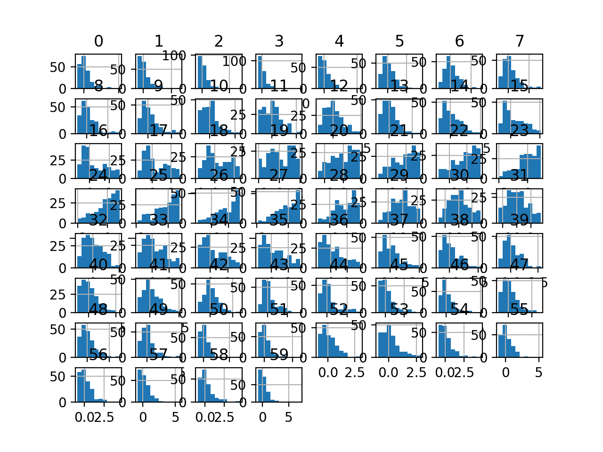

# 如何为机器学习缩放带有异常值的数据

> 原文：<https://machinelearningmastery.com/robust-scaler-transforms-for-machine-learning/>

最后更新于 2020 年 8 月 28 日

当数值输入变量被缩放到标准范围时，许多机器学习算法表现更好。

这包括使用输入加权和的算法，如线性回归，以及使用距离度量的算法，如 k 近邻。

标准化是一种流行的缩放技术，它从值中减去平均值，除以标准偏差，将输入变量的概率分布转换为标准高斯分布(零平均值和单位方差)。如果输入变量包含异常值，标准化会变得偏斜或有偏差。

为了克服这一点，在标准化数字输入变量时，可以使用中位数和四分位数范围，通常称为稳健缩放。

在本教程中，您将发现如何使用健壮的定标器变换来标准化用于分类和回归的数字输入变量。

完成本教程后，您将知道:

*   当数值输入变量被缩放时，许多机器学习算法更喜欢或表现得更好。
*   使用百分位数的稳健缩放技术可用于缩放包含异常值的数值输入变量。
*   如何使用稳健缩放器使用中位数和四分位数范围来缩放数字输入变量。

**用我的新书[机器学习的数据准备](https://machinelearningmastery.com/data-preparation-for-machine-learning/)启动你的项目**，包括*分步教程*和所有示例的 *Python 源代码*文件。

我们开始吧。


如何使用鲁棒的缩放器变换进行机器学习
图片由[雷在马尼拉](https://flickr.com/photos/rayinmanila/43941746162/)拍摄，版权所有。

## 教程概述

本教程分为五个部分；它们是:

1.  缩放数据
2.  鲁棒缩放器变换
3.  声纳数据集
4.  IQR 鲁棒定标器变换
5.  探索强大的定标器系列

## 稳健的缩放数据

在拟合机器学习模型之前缩放数据是很常见的。

这是因为数据通常由许多不同的输入变量或特征(列)组成，每个变量或特征可能有不同的值或度量单位范围，如英尺、英里、公斤、美元等。

如果存在相对于其他输入变量具有非常大值的输入变量，这些大值会支配或偏斜一些机器学习算法。结果是算法把大部分注意力放在大值上，而忽略了小值的变量。

这包括使用线性回归、逻辑回归和人工神经网络等输入加权和的算法，以及使用示例间距离度量的算法，如 k 近邻和支持向量机。

因此，在拟合模型之前，作为一种数据准备技术，将输入变量缩放到一个公共范围是正常的。

数据缩放的一种方法包括计算每个变量的平均值和标准偏差，并使用这些值来缩放这些值，使其平均值为零，标准偏差为 1，这就是所谓的“T0”标准正态概率分布。这个过程被称为标准化，当输入变量具有高斯概率分布时最有用。

标准化是通过减去平均值并除以标准偏差来计算的。

*   值=(值–平均值)/ stdev

有时一个输入变量可能有[个异常值](https://machinelearningmastery.com/how-to-use-statistics-to-identify-outliers-in-data/)。这些值处于分布的边缘，出现的概率可能很低，但由于某种原因，它们的出现率过高。异常值会偏斜概率分布，并使使用标准化进行数据缩放变得困难，因为异常值的存在会偏斜计算的平均值和标准偏差。

存在异常值时标准化输入变量的一种方法是忽略平均值和标准偏差计算中的异常值，然后使用计算值来缩放变量。

这被称为稳健标准化或**稳健数据缩放**。

这可以通过计算中位数(第 50 个百分点)以及第 25 个和第 75 个百分点来实现。然后减去每个变量的中值，除以第 75 个和第 25 个百分点之间的差值[四分位数区间](https://en.wikipedia.org/wiki/Interquartile_range) (IQR)。

*   值=(值–中间值)/(p75–p25)

所得变量的平均值和中值为零，标准偏差为 1，尽管没有被异常值偏斜，并且异常值仍然以与其他值相同的相对关系存在。

## 鲁棒缩放器变换

通过[鲁棒缩放器类](https://Sklearn.org/stable/modules/generated/sklearn.preprocessing.RobustScaler.html)，在 Sklearn Python 机器学习库中可以获得鲁棒缩放器转换。

带中心的“*”参数控制值是否以零为中心(减去中间值)，默认为*真*。*

 *“ *with_scaling* ”参数控制值是否缩放到 IQR(标准偏差设置为 1)并默认为 *True* 。

有趣的是，缩放范围的定义可以通过“*分位数 _ 范围*”参数来指定。它采用 0 到 100 之间的两个整数的元组，默认为 IQR 的百分位值，具体为(25，75)。改变这一点将改变异常值的定义和缩放的范围。

我们将仔细研究如何在真实数据集上使用健壮的定标器变换。

首先，让我们介绍一个真实的数据集。

## 声纳数据集

声纳数据集是用于二进制分类的标准机器学习数据集。

它涉及 60 个实值输入和一个两类目标变量。数据集中有 208 个示例，类别相当均衡。

使用重复的分层 10 倍交叉验证，基线分类算法可以达到大约 53.4%的分类准确率。[使用重复的分层 10 倍交叉验证，该数据集的最高表现](https://machinelearningmastery.com/results-for-standard-classification-and-regression-machine-learning-datasets/)约为 88%。

该数据集描述了岩石或模拟地雷的雷达回波。

您可以从这里了解有关数据集的更多信息:

*   [声纳数据集](https://raw.githubusercontent.com/jbrownlee/Datasets/master/sonar.csv)
*   [声纳数据集描述](https://raw.githubusercontent.com/jbrownlee/Datasets/master/sonar.names)

不需要下载数据集；我们将从我们的工作示例中自动下载它。

首先，让我们加载并总结数据集。下面列出了完整的示例。

```py
# load and summarize the sonar dataset
from pandas import read_csv
from pandas.plotting import scatter_matrix
from matplotlib import pyplot
# Load dataset
url = "https://raw.githubusercontent.com/jbrownlee/Datasets/master/sonar.csv"
dataset = read_csv(url, header=None)
# summarize the shape of the dataset
print(dataset.shape)
# summarize each variable
print(dataset.describe())
# histograms of the variables
dataset.hist()
pyplot.show()
```

运行该示例首先总结加载数据集的形状。

这确认了 60 个输入变量、一个输出变量和 208 行数据。

提供了输入变量的统计摘要，显示值是数值，范围大约从 0 到 1。

```py
(208, 61)
               0           1           2   ...          57          58          59
count  208.000000  208.000000  208.000000  ...  208.000000  208.000000  208.000000
mean     0.029164    0.038437    0.043832  ...    0.007949    0.007941    0.006507
std      0.022991    0.032960    0.038428  ...    0.006470    0.006181    0.005031
min      0.001500    0.000600    0.001500  ...    0.000300    0.000100    0.000600
25%      0.013350    0.016450    0.018950  ...    0.003600    0.003675    0.003100
50%      0.022800    0.030800    0.034300  ...    0.005800    0.006400    0.005300
75%      0.035550    0.047950    0.057950  ...    0.010350    0.010325    0.008525
max      0.137100    0.233900    0.305900  ...    0.044000    0.036400    0.043900

[8 rows x 60 columns]
```

最后，为每个输入变量创建一个直方图。

如果我们忽略图中杂乱的东西，专注于直方图本身，我们可以看到许多变量都有一个偏斜的分布。

数据集为在存在偏斜分布和异常值的情况下使用稳健的定标器变换来标准化数据提供了一个很好的候选。


声纳二进制类别数据集输入变量的直方图

接下来，让我们在原始数据集上拟合和评估一个机器学习模型。

我们将使用带有默认超参数的 k 近邻算法，并使用[重复分层 K 折交叉验证](https://machinelearningmastery.com/k-fold-cross-validation/)对其进行评估。下面列出了完整的示例。

```py
# evaluate knn on the raw sonar dataset
from numpy import mean
from numpy import std
from pandas import read_csv
from sklearn.model_selection import cross_val_score
from sklearn.model_selection import RepeatedStratifiedKFold
from sklearn.neighbors import KNeighborsClassifier
from sklearn.preprocessing import LabelEncoder
from matplotlib import pyplot
# load dataset
url = "https://raw.githubusercontent.com/jbrownlee/Datasets/master/sonar.csv"
dataset = read_csv(url, header=None)
data = dataset.values
# separate into input and output columns
X, y = data[:, :-1], data[:, -1]
# ensure inputs are floats and output is an integer label
X = X.astype('float32')
y = LabelEncoder().fit_transform(y.astype('str'))
# define and configure the model
model = KNeighborsClassifier()
# evaluate the model
cv = RepeatedStratifiedKFold(n_splits=10, n_repeats=3, random_state=1)
n_scores = cross_val_score(model, X, y, scoring='accuracy', cv=cv, n_jobs=-1, error_score='raise')
# report model performance
print('Accuracy: %.3f (%.3f)' % (mean(n_scores), std(n_scores)))
```

运行该示例会评估原始声纳数据集上的 KNN 模型。

我们可以看到，该模型实现了大约 79.7%的平均分类准确率，表明它具有技巧性(优于 53.4%)，并且处于良好表现的球园区(88%)。

```py
Accuracy: 0.797 (0.073)
```

接下来，让我们探索数据集的稳健缩放变换。

## IQR 鲁棒定标器变换

我们可以将稳健的定标器直接应用于声纳数据集。

我们将使用默认配置并将值缩放到 IQR。首先，用默认超参数定义一个鲁棒定标器实例。一旦定义，我们就可以调用 *fit_transform()* 函数，并将其传递给我们的数据集，以创建数据集的分位数转换版本。

```py
...
# perform a robust scaler transform of the dataset
trans = RobustScaler()
data = trans.fit_transform(data)
```

让我们在声纳数据集上试试。

下面列出了创建声纳数据集的鲁棒定标器变换和绘制结果直方图的完整示例。

```py
# visualize a robust scaler transform of the sonar dataset
from pandas import read_csv
from pandas import DataFrame
from pandas.plotting import scatter_matrix
from sklearn.preprocessing import RobustScaler
from matplotlib import pyplot
# load dataset
url = "https://raw.githubusercontent.com/jbrownlee/Datasets/master/sonar.csv"
dataset = read_csv(url, header=None)
# retrieve just the numeric input values
data = dataset.values[:, :-1]
# perform a robust scaler transform of the dataset
trans = RobustScaler()
data = trans.fit_transform(data)
# convert the array back to a dataframe
dataset = DataFrame(data)
# summarize
print(dataset.describe())
# histograms of the variables
dataset.hist()
pyplot.show()
```

运行该示例首先报告每个输入变量的摘要。

我们可以看到分布已经调整。中值现在为零，标准偏差值现在接近 1.0。

```py
               0           1   ...            58          59
count  208.000000  208.000000  ...  2.080000e+02  208.000000
mean     0.286664    0.242430  ...  2.317814e-01    0.222527
std      1.035627    1.046347  ...  9.295312e-01    0.927381
min     -0.959459   -0.958730  ... -9.473684e-01   -0.866359
25%     -0.425676   -0.455556  ... -4.097744e-01   -0.405530
50%      0.000000    0.000000  ...  6.591949e-17    0.000000
75%      0.574324    0.544444  ...  5.902256e-01    0.594470
max      5.148649    6.447619  ...  4.511278e+00    7.115207

[8 rows x 60 columns]
```

创建了变量的直方图，尽管这些分布看起来与上一节中看到的原始分布没有太大不同。



声纳数据集的鲁棒定标器变换输入变量的直方图

接下来，让我们评估与上一节相同的 KNN 模型，但在这种情况下，是基于数据集的鲁棒定标器变换。

下面列出了完整的示例。

```py
# evaluate knn on the sonar dataset with robust scaler transform
from numpy import mean
from numpy import std
from pandas import read_csv
from sklearn.model_selection import cross_val_score
from sklearn.model_selection import RepeatedStratifiedKFold
from sklearn.neighbors import KNeighborsClassifier
from sklearn.preprocessing import LabelEncoder
from sklearn.preprocessing import RobustScaler
from sklearn.pipeline import Pipeline
from matplotlib import pyplot
# load dataset
url = "https://raw.githubusercontent.com/jbrownlee/Datasets/master/sonar.csv"
dataset = read_csv(url, header=None)
data = dataset.values
# separate into input and output columns
X, y = data[:, :-1], data[:, -1]
# ensure inputs are floats and output is an integer label
X = X.astype('float32')
y = LabelEncoder().fit_transform(y.astype('str'))
# define the pipeline
trans = RobustScaler(with_centering=False, with_scaling=True)
model = KNeighborsClassifier()
pipeline = Pipeline(steps=[('t', trans), ('m', model)])
# evaluate the pipeline
cv = RepeatedStratifiedKFold(n_splits=10, n_repeats=3, random_state=1)
n_scores = cross_val_score(pipeline, X, y, scoring='accuracy', cv=cv, n_jobs=-1, error_score='raise')
# report pipeline performance
print('Accuracy: %.3f (%.3f)' % (mean(n_scores), std(n_scores)))
```

**注**:考虑到算法或评估程序的随机性，或数值准确率的差异，您的[结果可能会有所不同](https://machinelearningmastery.com/different-results-each-time-in-machine-learning/)。考虑运行该示例几次，并比较平均结果。

运行该示例，我们可以看到稳健的定标器变换将表现从无变换时的 79.7%提升到有变换时的约 81.9%。

```py
Accuracy: 0.819 (0.076)
```

接下来，让我们探索不同缩放范围的效果。

## 探索强大的定标器系列

默认情况下，用于缩放每个变量的范围是选定的，因为 IQR 以第 25 个和第 75 个百分点为界。

这由作为元组的“*分位数 _ 范围*”参数指定。

可以指定其他值，这些值可能会提高模型的表现，例如更宽的范围允许更少的值被视为异常值，或者更窄的范围允许更多的值被视为异常值。

下面的例子探讨了从第 1 到第 99 个百分点到第 30 到第 70 个百分点范围的不同定义的影响。

下面列出了完整的示例。

```py
# explore the scaling range of the robust scaler transform
from numpy import mean
from numpy import std
from pandas import read_csv
from sklearn.model_selection import cross_val_score
from sklearn.model_selection import RepeatedStratifiedKFold
from sklearn.neighbors import KNeighborsClassifier
from sklearn.preprocessing import RobustScaler
from sklearn.preprocessing import LabelEncoder
from sklearn.pipeline import Pipeline
from matplotlib import pyplot

# get the dataset
def get_dataset():
	# load dataset
	url = "https://raw.githubusercontent.com/jbrownlee/Datasets/master/sonar.csv"
	dataset = read_csv(url, header=None)
	data = dataset.values
	# separate into input and output columns
	X, y = data[:, :-1], data[:, -1]
	# ensure inputs are floats and output is an integer label
	X = X.astype('float32')
	y = LabelEncoder().fit_transform(y.astype('str'))
	return X, y

# get a list of models to evaluate
def get_models():
	models = dict()
	for value in [1, 5, 10, 15, 20, 25, 30]:
		# define the pipeline
		trans = RobustScaler(quantile_range=(value, 100-value))
		model = KNeighborsClassifier()
		models[str(value)] = Pipeline(steps=[('t', trans), ('m', model)])
	return models

# evaluate a give model using cross-validation
def evaluate_model(model, X, y):
	cv = RepeatedStratifiedKFold(n_splits=10, n_repeats=3, random_state=1)
	scores = cross_val_score(model, X, y, scoring='accuracy', cv=cv, n_jobs=-1, error_score='raise')
	return scores

# define dataset
X, y = get_dataset()
# get the models to evaluate
models = get_models()
# evaluate the models and store results
results, names = list(), list()
for name, model in models.items():
	scores = evaluate_model(model, X, y)
	results.append(scores)
	names.append(name)
	print('>%s %.3f (%.3f)' % (name, mean(scores), std(scores)))
# plot model performance for comparison
pyplot.boxplot(results, labels=names, showmeans=True)
pyplot.show()
```

运行该示例会报告每个值定义的 IQR 范围的平均分类准确率。

**注**:考虑到算法或评估程序的随机性，或数值准确率的差异，您的[结果可能会有所不同](https://machinelearningmastery.com/different-results-each-time-in-machine-learning/)。考虑运行该示例几次，并比较平均结果。

我们可以看到，默认的第 25 到第 75 百分位达到了最好的结果，尽管 20-80 和 30-70 的值达到了非常相似的结果。

```py
>1 0.818 (0.069)
>5 0.813 (0.085)
>10 0.812 (0.076)
>15 0.811 (0.081)
>20 0.811 (0.080)
>25 0.819 (0.076)
>30 0.816 (0.072)
```

创建方框图和触须图来总结每个 IQR 范围的分类准确度分数。

在 25-75%和 30-70%的较大范围内，我们可以看到分布和平均准确率的显著差异。


声呐数据集上鲁棒定标器 IQR 距离与 KNN 分类准确率的箱线图

## 进一步阅读

如果您想更深入地了解这个主题，本节将提供更多资源。

### 教程

*   [如何利用统计识别数据中的异常值](https://machinelearningmastery.com/how-to-use-statistics-to-identify-outliers-in-data/)

### 蜜蜂

*   [标准化，或均值去除和方差缩放，Sklearn](https://Sklearn.org/stable/modules/preprocessing.html#preprocessing-scaler) 。
*   [sklearn . preferencing . robustscaler API](https://Sklearn.org/stable/modules/generated/sklearn.preprocessing.RobustScaler.html)。

### 文章

*   四分之一区间，维基百科。

## 摘要

在本教程中，您发现了如何使用健壮的定标器变换来标准化用于分类和回归的数字输入变量。

具体来说，您了解到:

*   当数值输入变量被缩放时，许多机器学习算法更喜欢或表现得更好。
*   使用百分位数的稳健缩放技术可用于缩放包含异常值的数值输入变量。
*   如何使用稳健缩放器使用中位数和四分位数范围来缩放数字输入变量。

**你有什么问题吗？**
在下面的评论中提问，我会尽力回答。*