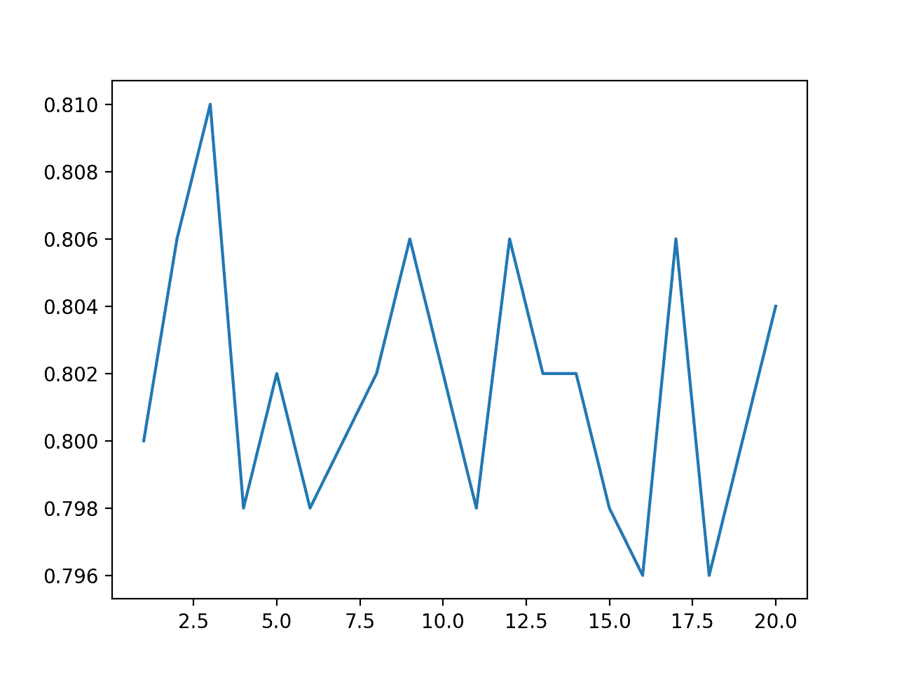
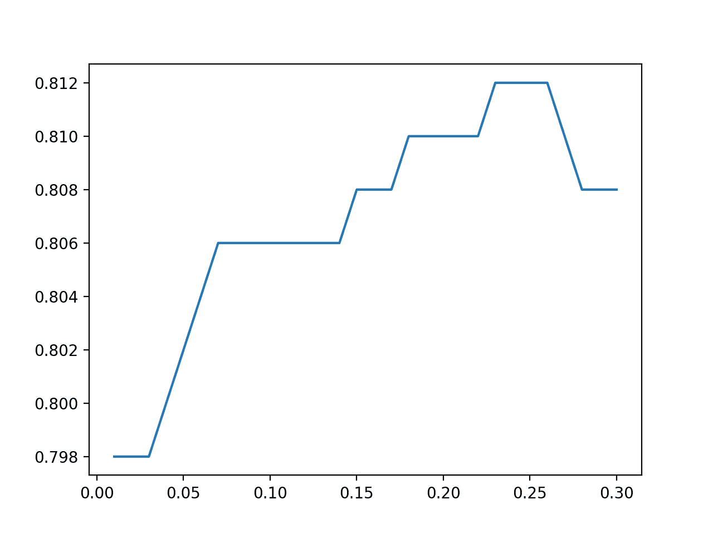

# 使用 Sklearn 的表格数据测试时间增强

> 原文：<https://machinelearningmastery.com/test-time-augmentation-with-Sklearn/>

最后更新于 2020 年 8 月 18 日

测试时间扩充，简称 TTA，是一种提高预测模型技能的技术。

它通常用于提高深度学习模型在图像数据集上的预测表现，其中预测在测试数据集中每个图像的多个增强版本之间进行平均。

尽管在图像数据集和神经网络模型中很受欢迎，但是测试时间扩充可以与表格数据集上的任何机器学习算法一起使用，例如在回归和分类预测建模问题中经常看到的算法。

在本教程中，您将发现如何在 Sklearn 中对表格数据使用测试时间扩充。

完成本教程后，您将知道:

*   测试时间扩充是一种提高模型表现的技术，通常用于图像数据集上的深度学习模型。
*   如何用 Sklearn 在 Python 中实现回归和分类表格数据集的测试时间扩充。
*   如何调整测试时间扩充中使用的合成样本数量和统计噪声量？

**用我的新书[机器学习的数据准备](https://machinelearningmastery.com/data-preparation-for-machine-learning/)启动你的项目**，包括*分步教程*和所有示例的 *Python 源代码*文件。

我们开始吧。


用 Scikit 增加测试时间-学习
图片由 [barnimages](https://flickr.com/photos/barnimages/21187172316/) 提供，保留部分权利。

## 教程概述

本教程分为三个部分；它们是:

1.  测试时间扩充
2.  标准模型评估
3.  测试时间扩充示例

## 测试时间扩充

测试时间扩充，简称 TTA，是一种提高预测模型技能的技术。

这是在使用拟合模型进行预测时实现的过程，例如在测试数据集或新数据上。该过程包括为数据集中的每个示例创建多个稍加修改的副本。对每个修改的示例进行预测，并且对预测进行平均，以给出对原始示例的更准确的预测。

TTA 常用于图像分类，其中图像数据扩充用于创建每个图像的多个修改版本，例如裁剪、缩放、旋转和其他特定于图像的修改。因此，该技术提高了图像分类算法在标准数据集上的表现。

在他们 2015 年发表的题为“用于大规模图像识别的非常深卷积网络”的论文中，作者使用了水平翻转测试时间扩充:

> 我们还通过水平翻转图像来增加测试集；原始图像和翻转图像的软最大类后验值被平均以获得图像的最终分数。

——[用于大规模图像识别的超深度卷积网络](https://arxiv.org/abs/1409.1556)，2015。

有关使用图像数据进行测试时增强的更多信息，请参见教程:

*   [如何使用测试时间扩充进行更好的预测](https://machinelearningmastery.com/how-to-use-test-time-augmentation-to-improve-model-performance-for-image-classification/)

虽然经常用于图像数据，但是测试时间扩充也可以用于其他数据类型，例如表格数据(例如数字的行和列)。

有许多方法可以将 TTA 用于表格数据。一种简单的方法是创建添加了小高斯噪声的数据行的副本。然后可以对来自复制行的预测进行平均，以产生用于回归或分类的改进预测。

我们将探索如何使用 Sklearn Python 机器学习库来实现这一点。

首先，让我们定义一个评估模型的标准方法。

## 标准模型评估

在这一节中，我们将在下一节介绍测试时间扩充之前，探索评估机器学习模型的典型方法。

首先，让我们定义一个综合类别数据集。

我们将使用 [make_classification()函数](https://Sklearn.org/stable/modules/generated/sklearn.datasets.make_classification.html)创建一个包含 100 个示例的数据集，每个示例有 20 个输入变量。

该示例创建并汇总数据集。

```py
# test classification dataset
from sklearn.datasets import make_classification
# define dataset
X, y = make_classification(n_samples=100, n_features=20, n_informative=15, n_redundant=5, random_state=1)
# summarize the dataset
print(X.shape, y.shape)
```

运行该示例将创建数据集，并确认数据集的行数和列数。

```py
(100, 20) (100,)
```

这是一个二分类任务，我们将拟合和评估一个线性模型，特别是逻辑回归模型。

在评估机器学习模型时，一个好的实践是使用重复的 k-fold 交叉验证。当数据集存在分类问题时，确保使用 k-fold 交叉验证的分层版本非常重要。因此，我们将使用 10 倍和 5 倍重复的重复分层 k 倍交叉验证。

```py
...
# prepare the cross-validation procedure
cv = RepeatedStratifiedKFold(n_splits=10, n_repeats=5, random_state=1)
```

我们将手动枚举折叠和重复，以便稍后我们可以执行测试时增强。

每个循环，我们必须定义和拟合模型，然后使用拟合模型进行预测，评估预测，并存储结果。

```py
...
scores = list()
for train_ix, test_ix in cv.split(X, y):
	# split the data
	X_train, X_test = X[train_ix], X[test_ix]
	y_train, y_test = y[train_ix], y[test_ix]
	# fit model
	model = LogisticRegression()
	model.fit(X_train, y_train)
	# evaluate model
	y_hat = model.predict(X_test)
	acc = accuracy_score(y_test, y_hat)
	scores.append(acc)
```

最后，我们可以报告所有折叠和重复的平均分类准确率。

```py
...
# report performance
print('Accuracy: %.3f (%.3f)' % (mean(scores), std(scores)))
```

将这些联系在一起，下面列出了在综合二元类别数据集上评估逻辑回归模型的完整示例。

```py
# evaluate logistic regression using repeated stratified k-fold cross-validation
from numpy import mean
from numpy import std
from sklearn.datasets import make_classification
from sklearn.model_selection import RepeatedStratifiedKFold
from sklearn.model_selection import cross_val_score
from sklearn.linear_model import LogisticRegression
from sklearn.metrics import accuracy_score
# create dataset
X, y = make_classification(n_samples=100, n_features=20, n_informative=15, n_redundant=5, random_state=1)
# prepare the cross-validation procedure
cv = RepeatedStratifiedKFold(n_splits=10, n_repeats=5, random_state=1)
scores = list()
for train_ix, test_ix in cv.split(X, y):
	# split the data
	X_train, X_test = X[train_ix], X[test_ix]
	y_train, y_test = y[train_ix], y[test_ix]
	# fit model
	model = LogisticRegression()
	model.fit(X_train, y_train)
	# evaluate model
	y_hat = model.predict(X_test)
	acc = accuracy_score(y_test, y_hat)
	scores.append(acc)
# report performance
print('Accuracy: %.3f (%.3f)' % (mean(scores), std(scores)))
```

运行该示例使用重复的分层 k 倍交叉验证来评估逻辑回归。

**注**:考虑到算法或评估程序的随机性，或数值准确率的差异，您的[结果可能会有所不同](https://machinelearningmastery.com/different-results-each-time-in-machine-learning/)。考虑运行该示例几次，并比较平均结果。

在这种情况下，我们可以看到该模型实现了 79.8%的平均分类准确率。

```py
Accuracy: 0.798 (0.110)
```

接下来，让我们探索如何更新这个例子来使用测试时间扩充。

## 测试时间扩充示例

实现测试时间扩充包括两个步骤。

第一步是选择一种方法来创建测试集中每一行的修改版本。

在本教程中，我们将为每个特征添加高斯随机噪声。另一种方法可能是添加均匀的随机噪声，甚至从测试数据集中的示例中复制特征值。

[normal() NumPy 函数](https://docs.scipy.org/doc/numpy-1.15.0/reference/generated/numpy.random.normal.html)将用于创建均值为零、标准差较小的随机高斯值向量。标准偏差应该与训练数据集中每个变量的分布成比例。在这种情况下，我们将保持示例简单，并使用 0.02 的值。

```py
...
# create vector of random gaussians
gauss = normal(loc=0.0, scale=feature_scale, size=len(row))
# add to test case
new_row = row + gauss
```

给定测试集中的一行数据，我们可以创建给定数量的修改副本。使用奇数个副本是一个好主意，例如 3、5 或 7 个副本，因为当我们稍后平均分配给每个副本的标签时，我们希望自动断开联系。

下面的 *create_test_set()* 函数实现了这一点；给定一行数据，它将返回包含该行以及“ *n_cases* ”修改副本的测试集，默认为 3(因此测试集大小为 4)。

```py
# create a test set for a row of real data with an unknown label
def create_test_set(row, n_cases=3, feature_scale=0.2):
	test_set = list()
	test_set.append(row)
	# make copies of row
	for _ in range(n_cases):
		# create vector of random gaussians
		gauss = normal(loc=0.0, scale=feature_scale, size=len(row))
		# add to test case
		new_row = row + gauss
		# store in test set
		test_set.append(new_row)
	return test_set
```

这种方法的一个改进是对每个循环的训练和测试数据集进行标准化或规范化，然后使用标准偏差 [normal()](https://docs.scipy.org/doc/numpy-1.15.0/reference/generated/numpy.random.normal.html) ，该标准偏差在对标准 normal 有意义的特征之间是一致的。这是留给读者的练习。

第二种设置是对测试集中的每个示例使用 *create_test_set()* ，对构建的测试集进行预测，并使用预测中的汇总统计记录预测的标签。假设预测是绝对的，通过[模式()scipy 函数](https://docs.scipy.org/doc/scipy/reference/generated/scipy.stats.mode.html)，统计模式将是合适的。如果数据集是回归的，或者我们在预测概率，那么平均值或中值会更合适。

```py
...
# create the test set
test_set = create_test_set(row)
# make a prediction for all examples in the test set
labels = model.predict(test_set)
# select the label as the mode of the distribution
label, _ = mode(labels)
```

下面的*test _ time _ employment()*函数实现了这一点；给定一个模型和一个测试集，它返回一个预测数组，其中每个预测都是使用测试时间扩充进行的。

```py
# make predictions using test-time augmentation
def test_time_augmentation(model, X_test):
	# evaluate model
	y_hat = list()
	for i in range(X_test.shape[0]):
		# retrieve the row
		row = X_test[i]
		# create the test set
		test_set = create_test_set(row)
		# make a prediction for all examples in the test set
		labels = model.predict(test_set)
		# select the label as the mode of the distribution
		label, _ = mode(labels)
		# store the prediction
		y_hat.append(label)
	return y_hat
```

将所有这些联系在一起，下面列出了使用测试时间扩充在数据集上评估逻辑回归模型的完整示例。

```py
# evaluate logistic regression using test-time augmentation
from numpy.random import seed
from numpy.random import normal
from numpy import mean
from numpy import std
from scipy.stats import mode
from sklearn.datasets import make_classification
from sklearn.model_selection import RepeatedStratifiedKFold
from sklearn.model_selection import cross_val_score
from sklearn.linear_model import LogisticRegression
from sklearn.metrics import accuracy_score

# create a test set for a row of real data with an unknown label
def create_test_set(row, n_cases=3, feature_scale=0.2):
	test_set = list()
	test_set.append(row)
	# make copies of row
	for _ in range(n_cases):
		# create vector of random gaussians
		gauss = normal(loc=0.0, scale=feature_scale, size=len(row))
		# add to test case
		new_row = row + gauss
		# store in test set
		test_set.append(new_row)
	return test_set

# make predictions using test-time augmentation
def test_time_augmentation(model, X_test):
	# evaluate model
	y_hat = list()
	for i in range(X_test.shape[0]):
		# retrieve the row
		row = X_test[i]
		# create the test set
		test_set = create_test_set(row)
		# make a prediction for all examples in the test set
		labels = model.predict(test_set)
		# select the label as the mode of the distribution
		label, _ = mode(labels)
		# store the prediction
		y_hat.append(label)
	return y_hat

# initialize numpy random number generator
seed(1)
# create dataset
X, y = make_classification(n_samples=100, n_features=20, n_informative=15, n_redundant=5, random_state=1)
# prepare the cross-validation procedure
cv = RepeatedStratifiedKFold(n_splits=10, n_repeats=5, random_state=1)
scores = list()
for train_ix, test_ix in cv.split(X, y):
	# split the data
	X_train, X_test = X[train_ix], X[test_ix]
	y_train, y_test = y[train_ix], y[test_ix]
	# fit model
	model = LogisticRegression()
	model.fit(X_train, y_train)
	# make predictions using test-time augmentation
	y_hat = test_time_augmentation(model, X_test)
	# calculate the accuracy for this iteration
	acc = accuracy_score(y_test, y_hat)
	# store the result
	scores.append(acc)
# report performance
print('Accuracy: %.3f (%.3f)' % (mean(scores), std(scores)))
```

运行该示例使用重复的分层 k 倍交叉验证和测试时间扩充来评估逻辑回归。

**注**:考虑到算法或评估程序的随机性，或数值准确率的差异，您的[结果可能会有所不同](https://machinelearningmastery.com/different-results-each-time-in-machine-learning/)。考虑运行该示例几次，并比较平均结果。

在这种情况下，我们可以看到该模型实现了 81.0%的平均分类准确率，这优于没有使用测试时间扩充的测试工具，后者实现了 79.8%的准确率。

```py
Accuracy: 0.810 (0.114)
```

网格搜索每次在测试时间扩充期间进行预测时创建的合成示例的数量可能会很有趣。

下面的示例探索 1 到 20 之间的值，并绘制结果。

```py
# compare the number of synthetic examples created during the test-time augmentation
from numpy.random import seed
from numpy.random import normal
from numpy import mean
from numpy import std
from scipy.stats import mode
from sklearn.datasets import make_classification
from sklearn.model_selection import RepeatedStratifiedKFold
from sklearn.model_selection import cross_val_score
from sklearn.linear_model import LogisticRegression
from sklearn.metrics import accuracy_score
from matplotlib import pyplot

# create a test set for a row of real data with an unknown label
def create_test_set(row, n_cases=3, feature_scale=0.2):
	test_set = list()
	test_set.append(row)
	# make copies of row
	for _ in range(n_cases):
		# create vector of random gaussians
		gauss = normal(loc=0.0, scale=feature_scale, size=len(row))
		# add to test case
		new_row = row + gauss
		# store in test set
		test_set.append(new_row)
	return test_set

# make predictions using test-time augmentation
def test_time_augmentation(model, X_test, cases):
	# evaluate model
	y_hat = list()
	for i in range(X_test.shape[0]):
		# retrieve the row
		row = X_test[i]
		# create the test set
		test_set = create_test_set(row, n_cases=cases)
		# make a prediction for all examples in the test set
		labels = model.predict(test_set)
		# select the label as the mode of the distribution
		label, _ = mode(labels)
		# store the prediction
		y_hat.append(label)
	return y_hat

# evaluate different number of synthetic examples created at test time
examples = range(1, 21)
results = list()
for e in examples:
	# initialize numpy random number generator
	seed(1)
	# create dataset
	X, y = make_classification(n_samples=100, n_features=20, n_informative=15, n_redundant=5, random_state=1)
	# prepare the cross-validation procedure
	cv = RepeatedStratifiedKFold(n_splits=10, n_repeats=5, random_state=1)
	scores = list()
	for train_ix, test_ix in cv.split(X, y):
		# split the data
		X_train, X_test = X[train_ix], X[test_ix]
		y_train, y_test = y[train_ix], y[test_ix]
		# fit model
		model = LogisticRegression()
		model.fit(X_train, y_train)
		# make predictions using test-time augmentation
		y_hat = test_time_augmentation(model, X_test, e)
		# calculate the accuracy for this iteration
		acc = accuracy_score(y_test, y_hat)
		# store the result
		scores.append(acc)
	# report performance
	print('>%d, acc: %.3f (%.3f)' % (e, mean(scores), std(scores)))
	results.append(mean(scores))
# plot the results
pyplot.plot(examples, results)
pyplot.show()
```

运行该示例报告了在测试时间扩充期间创建的不同数量的合成示例的准确性。

**注**:考虑到算法或评估程序的随机性，或数值准确率的差异，您的[结果可能会有所不同](https://machinelearningmastery.com/different-results-each-time-in-machine-learning/)。考虑运行该示例几次，并比较平均结果。

回想一下，我们在前面的例子中使用了三个例子。

在这种情况下，看起来值 3 可能是这个测试工具的最佳值，因为所有其他值似乎都会导致较低的表现。

```py
>1, acc: 0.800 (0.118)
>2, acc: 0.806 (0.114)
>3, acc: 0.810 (0.114)
>4, acc: 0.798 (0.105)
>5, acc: 0.802 (0.109)
>6, acc: 0.798 (0.107)
>7, acc: 0.800 (0.111)
>8, acc: 0.802 (0.110)
>9, acc: 0.806 (0.105)
>10, acc: 0.802 (0.110)
>11, acc: 0.798 (0.112)
>12, acc: 0.806 (0.110)
>13, acc: 0.802 (0.110)
>14, acc: 0.802 (0.109)
>15, acc: 0.798 (0.110)
>16, acc: 0.796 (0.111)
>17, acc: 0.806 (0.112)
>18, acc: 0.796 (0.111)
>19, acc: 0.800 (0.113)
>20, acc: 0.804 (0.109)
```

创建了示例数量与分类准确率的线图，显示奇数个示例通常比偶数个示例具有更好的表现。

这可能是意料之中的，因为他们在使用预测模式时有能力打破联系。



TTA 合成样本数与分类准确率的线图

在测试时间扩充期间，我们也可以用添加到测试集中的示例中的随机噪声量来执行相同的灵敏度分析。

下面的示例演示了这一点，噪声值介于 0.01 和 0.3 之间，网格为 0.01。

```py
# compare amount of noise added to examples created during the test-time augmentation
from numpy.random import seed
from numpy.random import normal
from numpy import arange
from numpy import mean
from numpy import std
from scipy.stats import mode
from sklearn.datasets import make_classification
from sklearn.model_selection import RepeatedStratifiedKFold
from sklearn.model_selection import cross_val_score
from sklearn.linear_model import LogisticRegression
from sklearn.metrics import accuracy_score
from matplotlib import pyplot

# create a test set for a row of real data with an unknown label
def create_test_set(row, n_cases=3, feature_scale=0.2):
	test_set = list()
	test_set.append(row)
	# make copies of row
	for _ in range(n_cases):
		# create vector of random gaussians
		gauss = normal(loc=0.0, scale=feature_scale, size=len(row))
		# add to test case
		new_row = row + gauss
		# store in test set
		test_set.append(new_row)
	return test_set

# make predictions using test-time augmentation
def test_time_augmentation(model, X_test, noise):
	# evaluate model
	y_hat = list()
	for i in range(X_test.shape[0]):
		# retrieve the row
		row = X_test[i]
		# create the test set
		test_set = create_test_set(row, feature_scale=noise)
		# make a prediction for all examples in the test set
		labels = model.predict(test_set)
		# select the label as the mode of the distribution
		label, _ = mode(labels)
		# store the prediction
		y_hat.append(label)
	return y_hat

# evaluate different number of synthetic examples created at test time
noise = arange(0.01, 0.31, 0.01)
results = list()
for n in noise:
	# initialize numpy random number generator
	seed(1)
	# create dataset
	X, y = make_classification(n_samples=100, n_features=20, n_informative=15, n_redundant=5, random_state=1)
	# prepare the cross-validation procedure
	cv = RepeatedStratifiedKFold(n_splits=10, n_repeats=5, random_state=1)
	scores = list()
	for train_ix, test_ix in cv.split(X, y):
		# split the data
		X_train, X_test = X[train_ix], X[test_ix]
		y_train, y_test = y[train_ix], y[test_ix]
		# fit model
		model = LogisticRegression()
		model.fit(X_train, y_train)
		# make predictions using test-time augmentation
		y_hat = test_time_augmentation(model, X_test, n)
		# calculate the accuracy for this iteration
		acc = accuracy_score(y_test, y_hat)
		# store the result
		scores.append(acc)
	# report performance
	print('>noise=%.3f, acc: %.3f (%.3f)' % (n, mean(scores), std(scores)))
	results.append(mean(scores))
# plot the results
pyplot.plot(noise, results)
pyplot.show()
```

运行该示例报告了在测试时间扩充期间添加到创建的示例中的不同统计噪声量的准确性。

**注**:考虑到算法或评估程序的随机性，或数值准确率的差异，您的[结果可能会有所不同](https://machinelearningmastery.com/different-results-each-time-in-machine-learning/)。考虑运行该示例几次，并比较平均结果。

回想一下，我们在第一个示例中使用了 0.02 的标准偏差。

在这种情况下，看起来大约 0.230 的值可能是该测试线束的最佳值，导致 81.2%的稍高准确率。

```py
>noise=0.010, acc: 0.798 (0.110)
>noise=0.020, acc: 0.798 (0.110)
>noise=0.030, acc: 0.798 (0.110)
>noise=0.040, acc: 0.800 (0.113)
>noise=0.050, acc: 0.802 (0.112)
>noise=0.060, acc: 0.804 (0.111)
>noise=0.070, acc: 0.806 (0.108)
>noise=0.080, acc: 0.806 (0.108)
>noise=0.090, acc: 0.806 (0.108)
>noise=0.100, acc: 0.806 (0.108)
>noise=0.110, acc: 0.806 (0.108)
>noise=0.120, acc: 0.806 (0.108)
>noise=0.130, acc: 0.806 (0.108)
>noise=0.140, acc: 0.806 (0.108)
>noise=0.150, acc: 0.808 (0.111)
>noise=0.160, acc: 0.808 (0.111)
>noise=0.170, acc: 0.808 (0.111)
>noise=0.180, acc: 0.810 (0.114)
>noise=0.190, acc: 0.810 (0.114)
>noise=0.200, acc: 0.810 (0.114)
>noise=0.210, acc: 0.810 (0.114)
>noise=0.220, acc: 0.810 (0.114)
>noise=0.230, acc: 0.812 (0.114)
>noise=0.240, acc: 0.812 (0.114)
>noise=0.250, acc: 0.812 (0.114)
>noise=0.260, acc: 0.812 (0.114)
>noise=0.270, acc: 0.810 (0.114)
>noise=0.280, acc: 0.808 (0.116)
>noise=0.290, acc: 0.808 (0.116)
>noise=0.300, acc: 0.808 (0.116)
```

创建了添加到示例中的噪声量与分类准确率之间的线图，显示了在标准偏差为 0.250 左右的小范围噪声可能是该测试线束的最佳值。



添加到 TTA 示例中的统计噪声的线图与分类准确率的关系

### **为什么不用 SMOTE 这样的过采样方法？**

[SMOTE](https://machinelearningmastery.com/smote-oversampling-for-imbalanced-classification/) 是一种流行的过采样方法，用于重新平衡训练数据集中每个类别的观测值。它可以创建合成的例子，但是需要类标签的知识，这使得它不容易在测试时间扩充中使用。

一种方法可能是举一个需要预测的给定例子，并假设它属于一个给定的类。然后使用新示例作为合成的焦点，从训练数据集中生成合成样本，并对它们进行分类。然后对每个类别标签重复这一过程。可以统计每个班级组的总的或平均的分类反应(可能是概率)，反应最大的组可以作为预测。

这只是即兴创作，我实际上并没有尝试过这种方法。试一试，让我知道它是否有效。

## 进一步阅读

如果您想更深入地了解这个主题，本节将提供更多资源。

### 教程

*   [如何使用测试时间扩充进行更好的预测](https://machinelearningmastery.com/how-to-use-test-time-augmentation-to-improve-model-performance-for-image-classification/)
*   [如何在 Python 中生成随机数](https://machinelearningmastery.com/how-to-generate-random-numbers-in-python/)

### 蜜蜂

*   [sklearn . datasets . make _ classification API](https://Sklearn.org/stable/modules/generated/sklearn.datasets.make_classification.html)。
*   [sklearn.model_selection。重复的策略应用编程接口](https://Sklearn.org/stable/modules/generated/sklearn.model_selection.RepeatedStratifiedKFold.html)。
*   [numpy.random.normal API](https://docs.scipy.org/doc/numpy-1.15.0/reference/generated/numpy.random.normal.html) 。
*   [scipy . stat . mode API](https://docs.scipy.org/doc/scipy/reference/generated/scipy.stats.mode.html)的缩写形式。

## 摘要

在本教程中，您发现了如何在 Sklearn 中对表格数据使用测试时间扩充。

具体来说，您了解到:

*   测试时间扩充是一种提高模型表现的技术，通常用于图像数据集上的深度学习模型。
*   如何用 Sklearn 在 Python 中实现回归和分类表格数据集的测试时间扩充。
*   如何调整测试时间扩充中使用的合成样本数量和统计噪声量？

**你有什么问题吗？**
在下面的评论中提问，我会尽力回答。