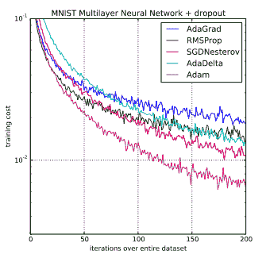

# 深度学习 Adam 优化算法的温和介绍

> 原文：<https://machinelearningmastery.com/adam-optimization-algorithm-for-deep-learning/>

最后更新于 2021 年 1 月 13 日

为您的深度学习模型选择优化算法可能意味着几分钟、几小时和几天内的良好结果之间的差异。

**亚当优化算法**是随机梯度下降的扩展，最近在计算机视觉和自然语言处理的深度学习应用中得到了更广泛的采用。

在这篇文章中，你将得到一个温和的介绍，亚当优化算法用于深度学习。

看完这篇文章，你会知道:

*   亚当算法是什么，以及使用该方法优化模型的一些好处。
*   Adam 算法是如何工作的，它与 AdaGrad 和 RMSProp 的相关方法有何不同。
*   如何配置 Adam 算法以及常用的配置参数。

**用我的新书[更好的深度学习](https://machinelearningmastery.com/better-deep-learning/)启动你的项目**，包括*分步教程*和所有示例的 *Python 源代码*文件。

我们开始吧。

## 什么是 Adam 优化算法？

Adam 是一种优化算法，可以用来代替经典的随机梯度下降过程，根据训练数据迭代更新网络权重。

亚当是由来自 OpenAI 的 [Diederik Kingma](http://dpkingma.com/) 和来自多伦多大学的 [Jimmy Ba](https://jimmylba.github.io/) 在他们 2015 年的 [ICLR](http://www.iclr.cc/doku.php?id=iclr2015:main) 论文(海报)中提出的，论文标题为“ [Adam:一种随机优化的方法](https://arxiv.org/abs/1412.6980)”。除非另有说明，我将在这篇文章中大量引用他们的论文。

这个算法叫做亚当。它不是首字母缩略词，也不是写成“ADAM”。

> Adam 这个名字来源于自适应矩估计。

在介绍该算法时，作者列出了在非凸优化问题上使用 Adam 的诱人好处，如下所示:

*   实现起来很简单。
*   计算效率高。
*   对内存要求不高。
*   对梯度的对角线重新缩放不变。
*   非常适合数据和/或参数庞大的问题。
*   适用于非固定目标。
*   适用于具有非常嘈杂/稀疏梯度的问题。
*   超参数有直观的解释，通常几乎不需要调整。

## 亚当是如何工作的？

Adam 不同于经典的随机梯度下降。

随机梯度下降为所有权重更新保持单一[学习率](https://machinelearningmastery.com/learning-rate-for-deep-learning-neural-networks/)(称为α)，并且学习率在训练期间不变。

为每个网络权重(参数)保持一个学习率，并随着学习的展开而单独调整。

> 该方法根据梯度的第一和第二矩的估计来计算不同参数的个体自适应学习率。

作者将亚当描述为结合了随机梯度下降的另外两个扩展的优点。具体来说:

*   **自适应梯度算法** (AdaGrad)，保持每个参数的学习率，提高稀疏梯度问题(如自然语言和计算机视觉问题)的表现。
*   **均方根传播** (RMSProp)，也保持基于权重梯度最近幅度的平均值(例如，其变化有多快)进行调整的每个参数的学习率。这意味着该算法在在线和非平稳问题(如噪声)上表现良好。

Adam 意识到了 AdaGrad 和 RMSProp 的好处。

不像 RMSProp 那样基于平均第一矩(均值)来调整参数学习率，Adam 还利用了梯度的第二矩的平均值(无间隔方差)。

具体而言，该算法计算梯度和平方梯度的指数移动平均值，参数β1 和β2 控制这些移动平均值的衰减率。

移动平均线的初始值以及接近 1.0 的β1 和β2 值(推荐值)会导致力矩估计值偏向零。这种偏差是通过首先计算有偏差的估计，然后计算偏差校正的估计来克服的。

这篇论文可读性很强，如果您对具体的实现细节感兴趣，我鼓励您阅读它。

如果您想学习如何在 Python 中从零开始编写 Adam 代码，请参见教程:

*   [从零开始编码亚当梯度下降优化](https://machinelearningmastery.com/adam-optimization-from-scratch/)

## 亚当是有效的

Adam 是深度学习领域的一种流行算法，因为它能快速获得好的结果。

> 实证结果表明，Adam 在实践中运行良好，优于其他随机优化方法。

在最初的论文中，亚当通过实证证明了收敛性符合理论分析的预期。Adam 应用于 [MNIST 数字识别](https://machinelearningmastery.com/how-to-develop-a-convolutional-neural-network-from-scratch-for-mnist-handwritten-digit-classification/)和 IMDB 情感分析数据集上的逻辑回归算法、MNIST 数据集上的多层感知器算法和 [CIFAR-10 图像识别数据集](https://machinelearningmastery.com/how-to-develop-a-cnn-from-scratch-for-cifar-10-photo-classification/)上的卷积神经网络。他们得出结论:

> 通过使用大型模型和数据集，我们证明了 Adam 可以高效地解决实际的深度学习问题。

Adam 与其他优化算法的比较训练多层感知器
摘自 Adam:随机优化方法，2015。

[Sebastian Ruder](http://sebastianruder.com/) 对现代梯度下降优化算法进行了全面的回顾，标题为“[梯度下降优化算法概述](https://arxiv.org/abs/1609.04747)”首先作为[的博文](http://sebastianruder.com/optimizing-gradient-descent/index.html)发布，然后在 2016 年发布了一份技术报告。

这篇论文基本上是对现代方法的考察。在他的标题为“*的部分中，使用哪个优化器？*”，他建议使用亚当。

> 就目前而言，RMSprop、Adadelta 和 Adam 是非常相似的算法，在相似的环境中表现良好。[……]随着梯度变得越来越稀疏，它的偏差校正帮助 Adam 在优化接近尾声时略微优于 RMSprop。就目前而言，亚当可能是最好的选择。

在 Andrej Karpathy 等人开发的名为“ [CS231n:用于视觉识别的卷积神经网络](https://cs231n.github.io/)”的斯坦福计算机视觉深度学习课程中，Adam 算法再次被[建议作为深度学习应用的默认优化方法](https://cs231n.github.io/neural-networks-3/)。

> 实际上，目前推荐使用 Adam 作为默认算法，并且通常比 RMSProp 稍好一些。然而，通常也值得尝试 SGD+Nesterov 动力作为替代方案。

后来更明白地说:

> 推荐使用的两个更新是 SGD+Nesterov 动量或亚当。

Adam 正被改编成深度学习论文中的基准。

例如，在关于图像字幕中的注意力的论文“[展示、出席和讲述:具有视觉注意力的神经图像字幕生成”](https://arxiv.org/abs/1502.03044)和关于图像生成的论文“[绘制:用于图像生成的递归神经网络”](https://arxiv.org/abs/1502.04623)中使用了它。

你知道亚当的其他例子吗？评论里告诉我。

## 亚当配置参数

*   **α**。也称为学习率或步长。权重更新的比例(例如 0.001)。较大的值(例如 0.3)导致在更新速率之前更快的初始学习。较小的值(例如 1.0E-5)会在训练过程中降低学习速度
*   **β1**。第一时刻估计值的指数衰减率(如 0.9)。
*   **β2**。二阶矩估计的指数衰减率(如 0.999)。对于具有稀疏梯度的问题(例如自然语言处理和计算机视觉问题)，该值应设置为接近 1.0。
*   **ε**。是一个非常小的数字，以防止在实现中被零除(例如 10E-8)。

此外，学习率衰减也可以用于亚当。本文使用每个时期(t)更新的衰减率α=α/sqrt(t)进行逻辑回归论证。

亚当的论文建议:

> 测试的机器学习问题的良好默认设置是α= 0.001，β1 = 0.9，β2 = 0.999 和ε= 108

张量流文档建议对ε进行一些调整:

> ε的默认值 1e-8 通常可能不是一个好的默认值。例如，在 ImageNet 上训练一个 Inception 网络时，当前一个好的选择是 1.0 或 0.1。

我们可以看到，流行的深度学习库一般使用论文推荐的默认参数。

*   [TensorFlow](https://www.tensorflow.org/api_docs/python/tf/train/AdamOptimizer):learning _ rate = 0.001，beta1=0.9，beta2=0.999，ε= 1e-08。
    T3】Keras:lr =0.001，beta_1=0.9，beta_2=0.999，ε= 1e-08，衰变= 0.0。
*   [块](https://blocks.readthedocs.io/en/latest/api/algorithms.html) : learning_rate=0.002，beta1=0.9，beta2=0.999，ε= 1e-08，decay _ factor = 1。
*   [千层面](https://lasagne.readthedocs.io/en/latest/modules/updates.html) : learning_rate=0.001，beta1=0.9，beta2=0.999，ε= 1e-08
*   [Caffe](http://caffe.berkeleyvision.org/tutorial/solver.html):learning _ rate = 0.001，beta1=0.9，beta2=0.999，ε= 1e-08
*   [MxNet](http://mxnet.io/api/python/optimization.html):learning _ rate = 0.001，beta1=0.9，beta2=0.999，ε= 1e-8
*   [火炬](https://github.com/torch/optim/blob/master/adam.lua) : learning_rate=0.001，beta1=0.9，beta2=0.999，ε= 1e-8

你知道亚当的其他标准配置吗？评论里告诉我。

## 进一步阅读

本节列出了了解有关 Adam 优化算法的更多信息的资源。

*   [亚当:一种随机优化的方法](https://arxiv.org/abs/1412.6980)，2015。
*   [维基百科上的随机梯度下降](https://en.wikipedia.org/wiki/Stochastic_gradient_descent)
*   [梯度下降优化算法概述](https://arxiv.org/abs/1609.04747)，2016。
*   [ADAM:一种随机优化的方法](https://theberkeleyview.wordpress.com/2015/11/19/berkeleyview-for-adam-a-method-for-stochastic-optimization/)(综述)
*   [深度网络优化](https://www.cs.cmu.edu/~imisra/data/Optimization_2015_11_11.pdf)(幻灯片)
*   [亚当:一种随机优化的方法](https://moodle2.cs.huji.ac.il/nu15/pluginfile.php/316969/mod_resource/content/1/adam_pres.pdf)(幻灯片)。
*   [从零开始编码亚当梯度下降优化](https://machinelearningmastery.com/adam-optimization-from-scratch/)

你知道亚当还有什么好的资源吗？评论里告诉我。

## 摘要

在这篇文章中，你发现了深度学习的亚当优化算法。

具体来说，您了解到:

*   Adam 是一种用于训练深度学习模型的随机梯度下降的替代优化算法。
*   Adam 结合了 AdaGrad 和 RMSProp 算法的最佳属性，提供了一种优化算法，可以处理噪声问题上的稀疏梯度。
*   Adam 相对容易配置，默认配置参数在大多数问题上表现良好。

**你有什么问题吗？**
在下面的评论中提问，我会尽力回答。