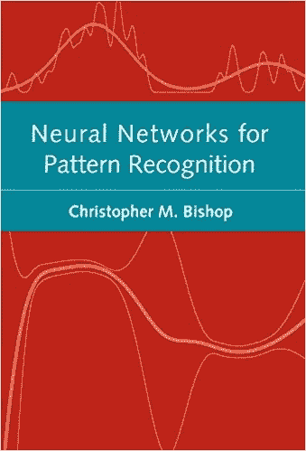
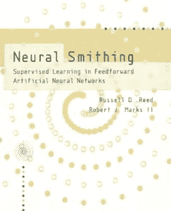
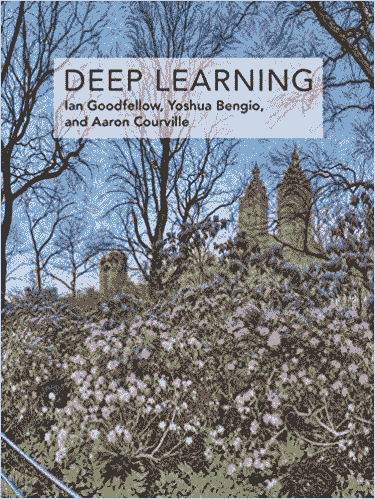

# 3 本深度学习实践者必备书籍

> 原文：<https://machinelearningmastery.com/books-for-deep-learning-practitioners/>

最后更新于 2019 年 8 月 6 日

开发神经网络通常被称为一门黑暗的艺术。

其原因是，熟练开发神经网络模型来自经验。没有可靠的方法来分析计算如何为您的特定数据集设计“好”或“最好”的模型。你必须从经验和实验中吸取教训，才能发现解决问题的方法。

很多这样的经验可以来自于实际开发测试问题的神经网络。

尽管如此，许多人以前来过，并记录了他们的发现、最佳实践和首选技术。关于如何设计和配置神经网络，你可以从这个主题的一些最佳书籍中了解到很多。

在这篇文章中，你将发现我推荐阅读的三本书，在为你的数据集开发神经网络时，它们就在你身边。

**用我的新书[更好的深度学习](https://machinelearningmastery.com/better-deep-learning/)启动你的项目**，包括*分步教程*和所有示例的 *Python 源代码*文件。

我们开始吧。

## 神经网络三本推荐书籍

如果你是神经网络从业者，我认为你必须拥有三本书的*物理副本*。

它们是:

1.  [用于模式识别的神经网络](https://amzn.to/2CMttJI)，1995。
2.  [神经锻造:前馈人工神经网络中的监督学习](https://amzn.to/2pW6hjI)，1999。
3.  [深度学习](https://amzn.to/2CjIBgH)，2016 年。

这些书是参考资料，不是教程。

在项目之前和项目期间，你一次又一次地使用它们，以确保你能从你的数据和模型中得到你能得到的一切。

这些是我一直在读和参考的书。如果你在开发神经网络模型时有推荐的书籍，请在下面的评论中告诉我。

现在，让我们依次仔细看看每本书。

## 模式识别的神经网络

[模式识别神经网络](https://amzn.to/2CMttJI)由[克里斯托弗·毕肖普](https://en.wikipedia.org/wiki/Christopher_Bishop)于 1995 年发布。

模式识别的神经网络

大约十年后，这本伟大的书被仍然经典的教科书[模式识别和机器学习](https://amzn.to/2Elsy4k)(亲切地称为 PRML)所继承。克里斯托弗·毕晓普既是爱丁堡大学的教授，也是微软剑桥研究实验室(T3)的主任。

这本书是神经网络领域的经典之作。这是一本手册，轻松地抓住了当时的理论状态，以及近 25 年后的今天仍然适用的技术。

尽管从头到尾阅读这本书会为你提供一个坚实的基础，但我还是鼓励你把它作为一个参考，让你的神经网络模型发挥最大的作用。

我建议根据需要浏览以下章节:

*   第 7 章:参数优化算法
*   第八章:预处理和特征提取
*   第九章:学习与概括。

光是这本书的第 9 章就值这个价了，给出了一系列你应该测试的正则化方法和集成方法的描述。

我推荐这本书，因为几乎每天都有新方法的描述，实践者经常会忘记那些尝试过的真正的基础知识。

我想这本书已经不印刷了，但是你可以在网上到处找到二手的和国际版的。

## 神经锻造:前馈人工神经网络中的监督学习

[神经锻造:前向人工神经网络中的监督学习](https://amzn.to/2pW6hjI)由罗素·里德和[罗伯特·马克斯](https://robertmarks.org/)于 1999 年发布。

神经锻造:前馈人工神经网络中的监督学习

我很喜欢这本书。

它发布后不久，我就购买了它，并将其用作我自己在整个 21 世纪实现神经网络算法的参考。

这本书有两点我最喜欢:

*   密码
*   情节

这本书使用数学和描述来解释概念，但重要的是，它们还使用伪代码或 ANSI C 的片段来展示事物是如何工作的。这在你第一次编写错误或激活函数的反向传播代码时是非常宝贵的。

这本书还使用了决策面模型的图。这对于理解模型在不同学习算法下的训练过程中正在做什么/看到什么，以及正则化之类的东西如何影响模型是非常宝贵的。

考虑到作者对该领域的兴趣，也许过度关注修剪方法；尽管如此，我还是建议在开发自己的模型时阅读以下章节:

*   第 14 章:影响概括的因素
*   第 15 章:概括预测和评估
*   第 16 章:提高概括能力的启发法
*   第 17 章:带噪声输入的训练效果

虽然我建议买下这本书，放在你身边(永远如此)，但罗伯特·马克斯在他的网站上有这本书的转载，格式为 HTML:

*   [神经锻造–前馈人工神经网络中的监督学习](https://robertmarks.org/REPRINTS/NS/NS-html/NSindex.htm)

## 深度学习

[由伊恩·古德费勒、约斯华·本吉奥和亚伦·库维尔合作的《深度学习》](https://amzn.to/2CjIBgH)于 2016 年上映。

深度学习

这是 90 年代经典书籍与现代深度学习之间缺失的桥梁。

重要的是，引入神经网络时仔细提到了使该领域成为今天这样的创新和里程碑。具体来说*第 6 章:深度前馈网络*和*第 6.6 节历史笔记*。

有三章是神经网络从业者必读；它们是:

*   第 7 章:深度学习的正则化
*   第 8 章:深度模型训练的优化
*   第 11 章:实践方法论

第 11 章尤其重要，因为它将具体的方法以及如何和何时在实践中使用它们联系在一起。光是这本书的买价就值这么多。

这是必须有的。你需要这本书的实体拷贝。尽管如此，全文可在图书网站上找到:

*   [深度学习图书网站](https://www.deeplearningbook.org/)

## 进一步阅读

如果您想更深入地了解这个主题，本节将提供更多资源。

### 书

*   [用于模式识别的神经网络](https://amzn.to/2CMttJI)，1995。
*   [神经锻造:前馈人工神经网络中的监督学习](https://amzn.to/2pW6hjI)，1999。
*   [深度学习](https://amzn.to/2CjIBgH)，2016 年。

### 附加书籍

*   [模式识别与机器学习](https://amzn.to/2Elsy4k)，2006。

### 其他链接

*   [神经锻造转载](https://robertmarks.org/REPRINTS/NS/NS-html/NSindex.htm)
*   [深度学习图书网站](https://www.deeplearningbook.org/)

## 摘要

在这篇文章中，你发现了我认为每个神经网络从业者都必须拥有的三本参考书。

你自己使用这些书中的一本或多本吗？
你大量引用哪些章节？

还有其他你经常参考的书吗？
下面让我知道。