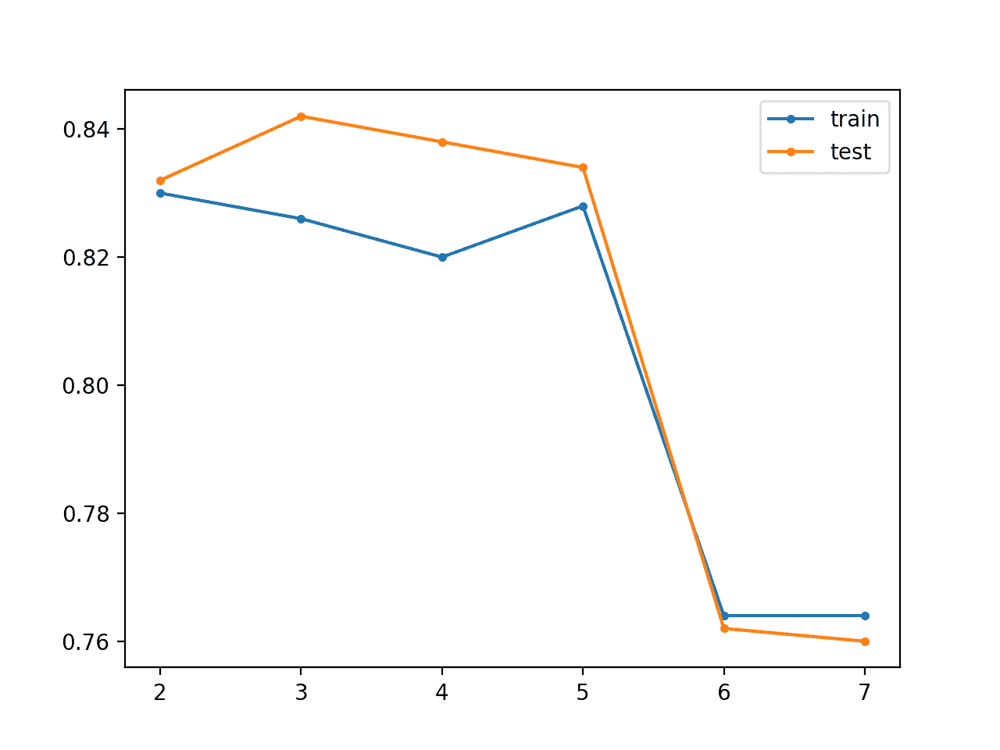

# 如何在深度学习神经网络中使用贪婪逐层预训练

> 原文：<https://machinelearningmastery.com/greedy-layer-wise-pretraining-tutorial/>

最后更新于 2020 年 8 月 25 日

训练深度神经网络在传统上是具有挑战性的，因为梯度消失意味着接近输入层的层中的权重不会响应于在训练数据集上计算的误差而更新。

深度学习领域的一个创新和重要里程碑是贪婪逐层预训练，它允许非常深的神经网络被成功地训练，实现当时最先进的表现。

在本教程中，您将发现贪婪逐层预处理是一种开发深层多层神经网络模型的技术。

完成本教程后，您将知道:

*   贪婪逐层预处理提供了一种开发深层多层神经网络的方法，同时只训练浅层网络。
*   预处理可用于迭代深化监督模型或可重新用作监督模型的非监督模型。
*   对于带有少量标记数据和大量未标记数据的问题，预处理可能很有用。

**用我的新书[更好的深度学习](https://machinelearningmastery.com/better-deep-learning/)启动你的项目**，包括*分步教程*和所有示例的 *Python 源代码*文件。

我们开始吧。

*   **2019 年 9 月更新**:修正了将按键转换为列表的剧情(感谢马库斯)
*   **2019 年 10 月更新**:针对 Keras 2.3 和 TensorFlow 2.0 更新。
*   **2020 年 1 月更新**:针对 Sklearn v0.22 API 的变化进行了更新。


如何使用贪婪逐层预处理开发深度神经网络，版权所有。

## 教程概述

本教程分为四个部分；它们是:

1.  贪婪逐层预处理
2.  多类分类问题
3.  监督贪婪逐层预处理
4.  无监督贪婪逐层预处理

## 贪婪逐层预处理

传统上，训练多层深度神经网络具有挑战性。

随着隐藏层数量的增加，传播回更早层的错误信息量会显著减少。这意味着靠近输出层的隐藏层中的权重被正常更新，而靠近输入层的隐藏层中的权重被最低限度地更新或者根本不更新。一般来说，这个问题阻碍了非常深的神经网络的训练，被称为 [*梯度消失问题*](https://machinelearningmastery.com/how-to-fix-vanishing-gradients-using-the-rectified-linear-activation-function/) 。

神经网络复兴的一个重要里程碑，最初允许开发更深层次的神经网络模型，是贪婪的逐层预训练技术，通常简称为“*预训练*”

> 2006 年的深度学习复兴始于发现这种贪婪的学习过程可以用来为所有层上的联合学习过程找到良好的初始化，并且这种方法可以用来成功地训练甚至完全连接的架构。

—第 528 页，[深度学习](https://amzn.to/2NJW3gE)，2016。

预处理包括向模型中连续添加新的隐藏层并重新调整，允许新添加的模型从现有的隐藏层中学习输入，通常同时保持现有隐藏层的权重固定。由于模型是一次训练一层的，因此这种技术被命名为“T0”层。

这种技术被称为“贪婪的”*，因为分段或分层的方法解决了训练深层网络的难题。作为一个优化过程，将训练过程分成一系列逐层的训练过程被视为贪婪的捷径，可能导致局部最优解的聚集，这是一个足够好的全局解的捷径。*

 *> 贪婪算法将一个问题分解成许多部分，然后孤立地求解每个部分的最优版本。不幸的是，组合单独的最优组件不能保证产生最优的完整解决方案。

—第 323 页，[深度学习](https://amzn.to/2NJW3gE)，2016。

预训练基于这样的假设，即训练浅网络比训练深网络更容易，并设计了一个分层训练过程，我们总是只适合浅模型。

> ……建立在训练浅层网络比训练深层网络更容易的前提之上，这一点似乎已经在多个环境中得到了验证。

—第 529 页，[深度学习](https://amzn.to/2NJW3gE)，2016。

预处理的主要好处是:

*   简化培训流程。
*   促进更深层次网络的发展。
*   用作权重初始化方案。
*   也许是更低的泛化误差。

> 总的来说，预处理对优化和推广都有帮助。

—第 325 页，[深度学习](https://amzn.to/2NJW3gE)，2016。

有两种主要的预处理方法；它们是:

*   监督贪婪逐层预处理。
*   无监督贪婪逐层预处理。

广义而言，监督预处理包括向在监督学习任务上训练的模型连续添加隐藏层。无监督预训练包括使用贪婪逐层过程来建立无监督自动编码器模型，随后向该模型添加有监督的输出层。

> 通常使用“预训练”一词不仅指预训练阶段本身，还指结合了预训练阶段和监督学习阶段的整个两阶段协议。监督学习阶段可以包括在预训练阶段学习的特征的基础上训练简单的分类器，或者可以包括在预训练阶段学习的整个网络的监督微调。

—第 529 页，[深度学习](https://amzn.to/2NJW3gE)，2016。

当您有大量未标记的示例可用于初始化模型时，非监督预处理可能是合适的，然后再使用数量少得多的示例来微调监督任务的模型权重。

> ….当标记的例子数量很少时，我们可以预期无监督的预处理是最有帮助的。因为无监督预处理增加的信息源是未标记的数据，所以当未标记的例子数量非常大时，我们也可以期望无监督预处理表现最好。

—第 532 页，[深度学习](https://amzn.to/2NJW3gE)，2016。

尽管先前层中的权重保持不变，但在添加最终层后，通常会对网络末端的所有权重进行微调。因此，这允许预处理被认为是一种权重初始化方法。

> ……它利用了这样一种思想，即深度神经网络初始参数的选择可以对模型产生显著的正则化效果(在较小程度上，它可以改善优化)。

—第 530-531 页，[深度学习](https://amzn.to/2NJW3gE)，2016。

贪婪逐层预训练是深度学习历史上的一个重要里程碑，它允许早期开发比以前可能的具有更多隐藏层的网络。这种方法在某些问题上是有用的；例如，最佳实践是对文本数据使用无监督的预处理，以便通过 [word2vec](https://machinelearningmastery.com/what-are-word-embeddings/) 提供更丰富的单词及其相互关系的分布式表示。

> 如今，除了在自然语言处理领域之外，无监督的预处理已经基本上被放弃了[……]预处理的优点是，人们可以在一个巨大的未标记集(例如，使用包含数十亿个单词的语料库)上预处理一次，学习一个良好的表示(通常是单词的表示，但也包括句子的表示)，然后使用该表示或对其进行微调，用于训练集包含的示例少得多的监督任务。

—第 535 页，[深度学习](https://amzn.to/2NJW3gE)，2016。

然而，使用现代方法，例如更好的激活函数、权重初始化、梯度下降的变体和正则化方法，可能会获得更好的表现。

> 如今，我们知道训练完全连接的深度架构不需要贪婪逐层预训练，但是无监督预训练方法是第一个成功的方法。

—第 528 页，[深度学习](https://amzn.to/2NJW3gE)，2016。

## 多类分类问题

我们将使用一个小的多类分类问题作为基础来演示贪婪逐层预处理对模型表现的影响。

Sklearn 类提供了 [make_blobs()函数](http://Sklearn.org/stable/modules/generated/sklearn.datasets.make_blobs.html)，该函数可用于创建具有规定数量的样本、输入变量、类和类内样本方差的多类分类问题。

该问题将配置两个输入变量(代表点的 *x* 和 *y* 坐标)和每组内点的标准偏差 2.0。我们将使用相同的随机状态(伪随机数发生器的种子)来确保我们总是获得相同的数据点。

```py
# generate 2d classification dataset
X, y = make_blobs(n_samples=1000, centers=3, n_features=2, cluster_std=2, random_state=2)
```

结果是我们可以建模的数据集的输入和输出元素。

为了了解问题的复杂性，我们可以在二维散点图上绘制每个点，并按类值给每个点着色。

下面列出了完整的示例。

```py
# scatter plot of blobs dataset
from sklearn.datasets import make_blobs
from matplotlib import pyplot
from numpy import where
# generate 2d classification dataset
X, y = make_blobs(n_samples=1000, centers=3, n_features=2, cluster_std=2, random_state=2)
# scatter plot for each class value
for class_value in range(3):
	# select indices of points with the class label
	row_ix = where(y == class_value)
	# scatter plot for points with a different color
	pyplot.scatter(X[row_ix, 0], X[row_ix, 1])
# show plot
pyplot.show()
```

运行该示例会创建整个数据集的散点图。我们可以看到，2.0 的标准差意味着类不是线性可分的(用一条线可分)，造成了很多模棱两可的点。

这是可取的，因为这意味着问题不是微不足道的，并将允许神经网络模型找到许多不同的“足够好”的候选解决方案。


具有三个类和按类值着色的点的斑点数据集的散点图

## 监督贪婪逐层预处理

在本节中，我们将使用贪婪逐层监督学习来为斑点监督学习多类分类问题建立一个深度多层感知器(MLP)模型。

解决这个简单的预测建模问题不需要预处理。相反，这是一个如何执行有监督的贪婪逐层预训练的演示，可用作更大和更具挑战性的有监督学习问题的模板。

作为第一步，我们可以开发一个函数，从问题中创建 1000 个样本，并将它们平均分成训练和测试数据集。下面的 *prepare_data()* 函数实现了这一点，并根据输入和输出组件返回训练和测试集。

```py
# prepare the dataset
def prepare_data():
	# generate 2d classification dataset
	X, y = make_blobs(n_samples=1000, centers=3, n_features=2, cluster_std=2, random_state=2)
	# one hot encode output variable
	y = to_categorical(y)
	# split into train and test
	n_train = 500
	trainX, testX = X[:n_train, :], X[n_train:, :]
	trainy, testy = y[:n_train], y[n_train:]
	return trainX, testX, trainy, testy
```

我们可以调用这个函数来准备数据。

```py
# prepare data
trainX, testX, trainy, testy = prepare_data()
```

接下来，我们可以训练和拟合一个基本模型。

这将是一个 MLP，期望数据集中的两个输入变量有两个输入，并且有一个包含 10 个节点的隐藏层，并使用校正的线性激活函数。输出层有三个节点，以便预测三个类别中每个类别的概率，并使用 softmax 激活函数。

```py
# define model
model = Sequential()
model.add(Dense(10, input_dim=2, activation='relu', kernel_initializer='he_uniform'))
model.add(Dense(3, activation='softmax'))
```

该模型使用随机梯度下降进行拟合，合理默认学习率为 0.01，高动量值为 0.9。利用交叉熵损失对模型进行优化。

```py
# compile model
opt = SGD(lr=0.01, momentum=0.9)
model.compile(loss='categorical_crossentropy', optimizer=opt, metrics=['accuracy'])
```

然后，该模型适用于 100 个时期的训练数据集，默认批次大小为 32 个示例。

```py
# fit model
model.fit(trainX, trainy, epochs=100, verbose=0)
```

下面的 *get_base_model()* 函数将这些元素联系在一起，将训练数据集作为参数并返回拟合基线模型。

```py
# define and fit the base model
def get_base_model(trainX, trainy):
	# define model
	model = Sequential()
	model.add(Dense(10, input_dim=2, activation='relu', kernel_initializer='he_uniform'))
	model.add(Dense(3, activation='softmax'))
	# compile model
	opt = SGD(lr=0.01, momentum=0.9)
	model.compile(loss='categorical_crossentropy', optimizer=opt, metrics=['accuracy'])
	# fit model
	model.fit(trainX, trainy, epochs=100, verbose=0)
	return model
```

我们可以调用这个函数来准备基础模型，之后我们可以一次向其中添加一个层。

```py
# get the base model
model = get_base_model(trainX, trainy)
```

我们需要能够轻松评估模型在列车和测试集上的表现。

下面的 *evaluate_model()* 函数将训练集和测试集作为参数和模型，并返回两个数据集的准确率。

```py
# evaluate a fit model
def evaluate_model(model, trainX, testX, trainy, testy):
	_, train_acc = model.evaluate(trainX, trainy, verbose=0)
	_, test_acc = model.evaluate(testX, testy, verbose=0)
	return train_acc, test_acc
```

我们可以调用这个函数来计算和报告基础模型的准确性，并将分数与模型中的层数(目前是两层，一个隐藏层和一个输出层)存储在字典中，这样我们以后就可以绘制层和准确性之间的关系。

```py
# evaluate the base model
scores = dict()
train_acc, test_acc = evaluate_model(model, trainX, testX, trainy, testy)
print('> layers=%d, train=%.3f, test=%.3f' % (len(model.layers), train_acc, test_acc))
```

我们现在可以概述贪婪逐层预处理的过程。

需要一个函数，可以添加新的隐藏层并重新训练模型，但只能更新新添加的层和输出层中的权重。

这需要首先存储当前输出层，包括其配置和当前权重集。

```py
# remember the current output layer
output_layer = model.layers[-1]
```

然后从模型的层堆栈中移除输出层。

```py
# remove the output layer
model.pop()
```

然后，模型中的所有剩余层都可以标记为不可训练，这意味着当再次调用 *fit()* 函数时，它们的权重不能更新。

```py
# mark all remaining layers as non-trainable
for layer in model.layers:
	layer.trainable = False
```

然后，我们可以添加一个新的隐藏层，在这种情况下，其配置与基础模型中添加的第一个隐藏层相同。

```py
# add a new hidden layer
model.add(Dense(10, activation='relu', kernel_initializer='he_uniform'))
```

最后，可以将输出层添加回来，并在训练数据集上重新调整模型。

```py
# re-add the output layer
model.add(output_layer)
# fit model
model.fit(trainX, trainy, epochs=100, verbose=0)
```

我们可以将所有这些元素绑定到一个名为 *add_layer()* 的函数中，该函数将模型和训练数据集作为参数。

```py
# add one new layer and re-train only the new layer
def add_layer(model, trainX, trainy):
	# remember the current output layer
	output_layer = model.layers[-1]
	# remove the output layer
	model.pop()
	# mark all remaining layers as non-trainable
	for layer in model.layers:
		layer.trainable = False
	# add a new hidden layer
	model.add(Dense(10, activation='relu', kernel_initializer='he_uniform'))
	# re-add the output layer
	model.add(output_layer)
	# fit model
	model.fit(trainX, trainy, epochs=100, verbose=0)
```

然后可以根据我们希望添加到模型中的层数重复调用这个函数。

在这种情况下，我们将添加 10 层，一次添加一层，并在添加每一层后评估模型的表现，以了解它如何影响表现。

训练和测试准确度分数根据模型中的层数存储在字典中。

```py
# add layers and evaluate the updated model
n_layers = 10
for i in range(n_layers):
	# add layer
	add_layer(model, trainX, trainy)
	# evaluate model
	train_acc, test_acc = evaluate_model(model, trainX, testX, trainy, testy)
	print('> layers=%d, train=%.3f, test=%.3f' % (len(model.layers), train_acc, test_acc))
	# store scores for plotting
	scores[len(model.layers)] = (train_acc, test_acc)
```

在运行结束时，会创建一个线图，显示模型中的层数(x 轴)与列车和测试数据集上的模型准确率数的比较。

我们希望增加层可以提高模型在训练数据集上甚至测试数据集上的表现。

```py
# plot number of added layers vs accuracy
pyplot.plot(list(scores.keys()), [scores[k][0] for k in scores.keys()], label='train', marker='.')
pyplot.plot(list(scores.keys()), [scores[k][1] for k in scores.keys()], label='test', marker='.')
pyplot.legend()
pyplot.show()
```

将所有这些元素结合在一起，下面列出了完整的示例。

```py
# supervised greedy layer-wise pretraining for blobs classification problem
from sklearn.datasets import make_blobs
from keras.layers import Dense
from keras.models import Sequential
from keras.optimizers import SGD
from keras.utils import to_categorical
from matplotlib import pyplot

# prepare the dataset
def prepare_data():
	# generate 2d classification dataset
	X, y = make_blobs(n_samples=1000, centers=3, n_features=2, cluster_std=2, random_state=2)
	# one hot encode output variable
	y = to_categorical(y)
	# split into train and test
	n_train = 500
	trainX, testX = X[:n_train, :], X[n_train:, :]
	trainy, testy = y[:n_train], y[n_train:]
	return trainX, testX, trainy, testy

# define and fit the base model
def get_base_model(trainX, trainy):
	# define model
	model = Sequential()
	model.add(Dense(10, input_dim=2, activation='relu', kernel_initializer='he_uniform'))
	model.add(Dense(3, activation='softmax'))
	# compile model
	opt = SGD(lr=0.01, momentum=0.9)
	model.compile(loss='categorical_crossentropy', optimizer=opt, metrics=['accuracy'])
	# fit model
	model.fit(trainX, trainy, epochs=100, verbose=0)
	return model

# evaluate a fit model
def evaluate_model(model, trainX, testX, trainy, testy):
	_, train_acc = model.evaluate(trainX, trainy, verbose=0)
	_, test_acc = model.evaluate(testX, testy, verbose=0)
	return train_acc, test_acc

# add one new layer and re-train only the new layer
def add_layer(model, trainX, trainy):
	# remember the current output layer
	output_layer = model.layers[-1]
	# remove the output layer
	model.pop()
	# mark all remaining layers as non-trainable
	for layer in model.layers:
		layer.trainable = False
	# add a new hidden layer
	model.add(Dense(10, activation='relu', kernel_initializer='he_uniform'))
	# re-add the output layer
	model.add(output_layer)
	# fit model
	model.fit(trainX, trainy, epochs=100, verbose=0)

# prepare data
trainX, testX, trainy, testy = prepare_data()
# get the base model
model = get_base_model(trainX, trainy)
# evaluate the base model
scores = dict()
train_acc, test_acc = evaluate_model(model, trainX, testX, trainy, testy)
print('> layers=%d, train=%.3f, test=%.3f' % (len(model.layers), train_acc, test_acc))
scores[len(model.layers)] = (train_acc, test_acc)
# add layers and evaluate the updated model
n_layers = 10
for i in range(n_layers):
	# add layer
	add_layer(model, trainX, trainy)
	# evaluate model
	train_acc, test_acc = evaluate_model(model, trainX, testX, trainy, testy)
	print('> layers=%d, train=%.3f, test=%.3f' % (len(model.layers), train_acc, test_acc))
	# store scores for plotting
	scores[len(model.layers)] = (train_acc, test_acc)
# plot number of added layers vs accuracy
pyplot.plot(list(scores.keys()), [scores[k][0] for k in scores.keys()], label='train', marker='.')
pyplot.plot(list(scores.keys()), [scores[k][1] for k in scores.keys()], label='test', marker='.')
pyplot.legend()
pyplot.show()
```

运行该示例会报告基本模型(两层)在列车和测试集上的分类准确率，然后添加每个附加层(从 3 层到 12 层)。

**注**:考虑到算法或评估程序的随机性，或数值准确率的差异，您的[结果可能会有所不同](https://machinelearningmastery.com/different-results-each-time-in-machine-learning/)。考虑运行该示例几次，并比较平均结果。

在这种情况下，我们可以看到基线模型在这个问题上做得相当好。随着层的增加，我们可以大致看到模型在训练数据集上的准确性有所提高，这可能是因为它开始过度填充数据。我们在测试数据集上看到分类准确率的粗略下降，可能是因为过拟合。

```py
> layers=2, train=0.816, test=0.830
> layers=3, train=0.834, test=0.830
> layers=4, train=0.836, test=0.824
> layers=5, train=0.830, test=0.824
> layers=6, train=0.848, test=0.820
> layers=7, train=0.830, test=0.826
> layers=8, train=0.850, test=0.824
> layers=9, train=0.840, test=0.838
> layers=10, train=0.842, test=0.830
> layers=11, train=0.850, test=0.830
> layers=12, train=0.850, test=0.826
```

还会创建一个线图，显示每个附加层添加到模型时的列车(蓝色)和测试集(橙色)准确率。

在这种情况下，该图表明训练数据集略有过拟合，但在添加七个层后，测试集表现可能会更好。


有监督贪婪逐层预处理的线图显示模型层与训练和测试集在斑点分类问题上的分类准确率

这个例子的一个有趣的扩展是允许对模型中的所有权重进行微调，对于大量的训练时期使用较小的学习率，看看这是否能进一步减少泛化误差。

## 无监督贪婪逐层预处理

在这一节中，我们将探索在无监督模型中使用贪婪逐层预处理。

具体来说，我们将开发一个自动编码器模型，该模型将被训练来重建输入数据。为了使用这种无监督模型进行分类，我们将移除输出层，添加并拟合一个新的输出层进行分类。

这比之前有监督的贪婪逐层预训练稍微复杂一些，但是我们可以重用前面部分中的许多相同的想法和代码。

第一步是定义、拟合和评估自动编码器模型。我们将使用与上一节相同的两层基本模型，除了修改它以预测作为输出的输入，并使用均方误差来评估模型在重建给定输入样本方面的表现。

下面的 *base_autoencoder()* 函数实现了这一点，以训练集和测试集为自变量，然后定义、拟合和评估基本无监督自动编码器模型，在训练集和测试集上打印重构误差并返回模型。

```py
# define, fit and evaluate the base autoencoder
def base_autoencoder(trainX, testX):
	# define model
	model = Sequential()
	model.add(Dense(10, input_dim=2, activation='relu', kernel_initializer='he_uniform'))
	model.add(Dense(2, activation='linear'))
	# compile model
	model.compile(loss='mse', optimizer=SGD(lr=0.01, momentum=0.9))
	# fit model
	model.fit(trainX, trainX, epochs=100, verbose=0)
	# evaluate reconstruction loss
	train_mse = model.evaluate(trainX, trainX, verbose=0)
	test_mse = model.evaluate(testX, testX, verbose=0)
	print('> reconstruction error train=%.3f, test=%.3f' % (train_mse, test_mse))
	return model
```

我们可以调用这个函数来准备我们的基本自动编码器，我们可以添加并贪婪地训练层。

```py
# get the base autoencoder
model = base_autoencoder(trainX, testX)
```

评估 blobs 多类分类问题的自动编码器模型需要几个步骤。

隐藏层将被用作分类器的基础，该分类器具有新的输出层，该输出层必须经过训练，然后用于在添加回原始输出层之前进行预测，以便我们可以继续向自动编码器添加层。

第一步是引用，然后移除自动编码器模型的输出层。

```py
# remember the current output layer
output_layer = model.layers[-1]
# remove the output layer
model.pop()
```

自动编码器中所有剩余的隐藏层必须标记为不可训练，以便在我们训练新的输出层时权重不会改变。

```py
# mark all remaining layers as non-trainable
for layer in model.layers:
layer.trainable = False
```

我们现在可以添加一个新的输出层，它预测一个示例属于三个类的可能性。还必须使用适用于多类分类的新损失函数重新编译模型。

```py
# add new output layer
model.add(Dense(3, activation='softmax'))
# compile model
model.compile(loss='categorical_crossentropy', optimizer=SGD(lr=0.01, momentum=0.9), metrics=['accuracy'])
```

然后，可以在训练数据集上重新拟合模型，特别是训练输出层如何使用从自动编码器学习的特征作为输入来进行类预测。

然后可以在训练和测试数据集上评估拟合模型的分类准确率。

```py
# fit model
model.fit(trainX, trainy, epochs=100, verbose=0)
# evaluate model
_, train_acc = model.evaluate(trainX, trainy, verbose=0)
_, test_acc = model.evaluate(testX, testy, verbose=0)
```

最后，我们可以将自动编码器放回一起，但移除分类输出层，将原始自动编码器输出层添加回来，并使用适当的损失函数重新编译模型以进行重建。

```py
# put the model back together
model.pop()
model.add(output_layer)
model.compile(loss='mse', optimizer=SGD(lr=0.01, momentum=0.9))
```

我们可以将它绑定到一个*evaluate _ auto encoder _ as _ classifier()*函数中，该函数获取模型以及训练集和测试集，然后返回训练集和测试集的分类准确率。

```py
# evaluate the autoencoder as a classifier
def evaluate_autoencoder_as_classifier(model, trainX, trainy, testX, testy):
	# remember the current output layer
	output_layer = model.layers[-1]
	# remove the output layer
	model.pop()
	# mark all remaining layers as non-trainable
	for layer in model.layers:
		layer.trainable = False
	# add new output layer
	model.add(Dense(3, activation='softmax'))
	# compile model
	model.compile(loss='categorical_crossentropy', optimizer=SGD(lr=0.01, momentum=0.9), metrics=['accuracy'])
	# fit model
	model.fit(trainX, trainy, epochs=100, verbose=0)
	# evaluate model
	_, train_acc = model.evaluate(trainX, trainy, verbose=0)
	_, test_acc = model.evaluate(testX, testy, verbose=0)
	# put the model back together
	model.pop()
	model.add(output_layer)
	model.compile(loss='mse', optimizer=SGD(lr=0.01, momentum=0.9))
	return train_acc, test_acc
```

可以调用该函数来评估基线自动编码器模型，然后根据模型中的层数(在本例中为两层)将准确率分数存储在字典中。

```py
# evaluate the base model
scores = dict()
train_acc, test_acc = evaluate_autoencoder_as_classifier(model, trainX, trainy, testX, testy)
print('> classifier accuracy layers=%d, train=%.3f, test=%.3f' % (len(model.layers), train_acc, test_acc))
scores[len(model.layers)] = (train_acc, test_acc)
```

我们现在准备定义向模型添加和预处理层的过程。

添加层的过程与上一节中的监督情况非常相似，只是我们优化的是重建损失，而不是新层的分类准确率。

下面的*add _ layer _ to _ autoencoder()*函数向 auto encoder 模型中添加一个新的隐藏层，更新新层和隐藏层的权重，然后报告列车上的重建错误并测试输入数据的集合。该函数确实将所有先前的层重新标记为不可训练的，这是多余的，因为我们已经在*evaluate _ auto encoder _ as _ classifier()*函数中这样做了，但我将其留在了中，以防您决定在自己的项目中重用该函数。

```py
# add one new layer and re-train only the new layer
def add_layer_to_autoencoder(model, trainX, testX):
	# remember the current output layer
	output_layer = model.layers[-1]
	# remove the output layer
	model.pop()
	# mark all remaining layers as non-trainable
	for layer in model.layers:
		layer.trainable = False
	# add a new hidden layer
	model.add(Dense(10, activation='relu', kernel_initializer='he_uniform'))
	# re-add the output layer
	model.add(output_layer)
	# fit model
	model.fit(trainX, trainX, epochs=100, verbose=0)
	# evaluate reconstruction loss
	train_mse = model.evaluate(trainX, trainX, verbose=0)
	test_mse = model.evaluate(testX, testX, verbose=0)
	print('> reconstruction error train=%.3f, test=%.3f' % (train_mse, test_mse))
```

我们现在可以重复调用这个函数，添加层，并通过使用自动编码器作为评估新分类器的基础来评估效果。

```py
# add layers and evaluate the updated model
n_layers = 5
for _ in range(n_layers):
	# add layer
	add_layer_to_autoencoder(model, trainX, testX)
	# evaluate model
	train_acc, test_acc = evaluate_autoencoder_as_classifier(model, trainX, trainy, testX, testy)
	print('> classifier accuracy layers=%d, train=%.3f, test=%.3f' % (len(model.layers), train_acc, test_acc))
	# store scores for plotting
	scores[len(model.layers)] = (train_acc, test_acc)
```

像以前一样，收集所有的准确性分数，我们可以使用它们来创建模型层数与训练和测试集准确性的折线图。

```py
# plot number of added layers vs accuracy
keys = list(scores.keys())
pyplot.plot(keys, [scores[k][0] for k in keys], label='train', marker='.')
pyplot.plot(keys, [scores[k][1] for k in keys], label='test', marker='.')
pyplot.legend()
pyplot.show()
```

将所有这些结合在一起，下面列出了针对斑点多类分类问题的无监督贪婪逐层预处理的完整示例。

```py
# unsupervised greedy layer-wise pretraining for blobs classification problem
from sklearn.datasets import make_blobs
from keras.layers import Dense
from keras.models import Sequential
from keras.optimizers import SGD
from keras.utils import to_categorical
from matplotlib import pyplot

# prepare the dataset
def prepare_data():
	# generate 2d classification dataset
	X, y = make_blobs(n_samples=1000, centers=3, n_features=2, cluster_std=2, random_state=2)
	# one hot encode output variable
	y = to_categorical(y)
	# split into train and test
	n_train = 500
	trainX, testX = X[:n_train, :], X[n_train:, :]
	trainy, testy = y[:n_train], y[n_train:]
	return trainX, testX, trainy, testy

# define, fit and evaluate the base autoencoder
def base_autoencoder(trainX, testX):
	# define model
	model = Sequential()
	model.add(Dense(10, input_dim=2, activation='relu', kernel_initializer='he_uniform'))
	model.add(Dense(2, activation='linear'))
	# compile model
	model.compile(loss='mse', optimizer=SGD(lr=0.01, momentum=0.9))
	# fit model
	model.fit(trainX, trainX, epochs=100, verbose=0)
	# evaluate reconstruction loss
	train_mse = model.evaluate(trainX, trainX, verbose=0)
	test_mse = model.evaluate(testX, testX, verbose=0)
	print('> reconstruction error train=%.3f, test=%.3f' % (train_mse, test_mse))
	return model

# evaluate the autoencoder as a classifier
def evaluate_autoencoder_as_classifier(model, trainX, trainy, testX, testy):
	# remember the current output layer
	output_layer = model.layers[-1]
	# remove the output layer
	model.pop()
	# mark all remaining layers as non-trainable
	for layer in model.layers:
		layer.trainable = False
	# add new output layer
	model.add(Dense(3, activation='softmax'))
	# compile model
	model.compile(loss='categorical_crossentropy', optimizer=SGD(lr=0.01, momentum=0.9), metrics=['accuracy'])
	# fit model
	model.fit(trainX, trainy, epochs=100, verbose=0)
	# evaluate model
	_, train_acc = model.evaluate(trainX, trainy, verbose=0)
	_, test_acc = model.evaluate(testX, testy, verbose=0)
	# put the model back together
	model.pop()
	model.add(output_layer)
	model.compile(loss='mse', optimizer=SGD(lr=0.01, momentum=0.9))
	return train_acc, test_acc

# add one new layer and re-train only the new layer
def add_layer_to_autoencoder(model, trainX, testX):
	# remember the current output layer
	output_layer = model.layers[-1]
	# remove the output layer
	model.pop()
	# mark all remaining layers as non-trainable
	for layer in model.layers:
		layer.trainable = False
	# add a new hidden layer
	model.add(Dense(10, activation='relu', kernel_initializer='he_uniform'))
	# re-add the output layer
	model.add(output_layer)
	# fit model
	model.fit(trainX, trainX, epochs=100, verbose=0)
	# evaluate reconstruction loss
	train_mse = model.evaluate(trainX, trainX, verbose=0)
	test_mse = model.evaluate(testX, testX, verbose=0)
	print('> reconstruction error train=%.3f, test=%.3f' % (train_mse, test_mse))

# prepare data
trainX, testX, trainy, testy = prepare_data()
# get the base autoencoder
model = base_autoencoder(trainX, testX)
# evaluate the base model
scores = dict()
train_acc, test_acc = evaluate_autoencoder_as_classifier(model, trainX, trainy, testX, testy)
print('> classifier accuracy layers=%d, train=%.3f, test=%.3f' % (len(model.layers), train_acc, test_acc))
scores[len(model.layers)] = (train_acc, test_acc)
# add layers and evaluate the updated model
n_layers = 5
for _ in range(n_layers):
	# add layer
	add_layer_to_autoencoder(model, trainX, testX)
	# evaluate model
	train_acc, test_acc = evaluate_autoencoder_as_classifier(model, trainX, trainy, testX, testy)
	print('> classifier accuracy layers=%d, train=%.3f, test=%.3f' % (len(model.layers), train_acc, test_acc))
	# store scores for plotting
	scores[len(model.layers)] = (train_acc, test_acc)
# plot number of added layers vs accuracy
keys = list(scores.keys())
pyplot.plot(keys, [scores[k][0] for k in keys], label='train', marker='.')
pyplot.plot(keys, [scores[k][1] for k in keys], label='test', marker='.')
pyplot.legend()
pyplot.show()
```

运行该示例会报告基本模型(两层)的训练集和测试集的重建误差和分类准确率，然后添加每个附加层(从三层到十二层)。

**注**:考虑到算法或评估程序的随机性，或数值准确率的差异，您的[结果可能会有所不同](https://machinelearningmastery.com/different-results-each-time-in-machine-learning/)。考虑运行该示例几次，并比较平均结果。

在这种情况下，我们可以看到重建误差从低开始，实际上接近完美，然后在训练过程中慢慢增加。随着层被添加到编码器中，训练数据集上的准确率似乎会降低，尽管准确率测试似乎会随着层的添加而提高，至少在模型有五层之前是这样，之后表现似乎会崩溃。

```py
> reconstruction error train=0.000, test=0.000
> classifier accuracy layers=2, train=0.830, test=0.832
> reconstruction error train=0.001, test=0.002
> classifier accuracy layers=3, train=0.826, test=0.842
> reconstruction error train=0.002, test=0.002
> classifier accuracy layers=4, train=0.820, test=0.838
> reconstruction error train=0.016, test=0.028
> classifier accuracy layers=5, train=0.828, test=0.834
> reconstruction error train=2.311, test=2.694
> classifier accuracy layers=6, train=0.764, test=0.762
> reconstruction error train=2.192, test=2.526
> classifier accuracy layers=7, train=0.764, test=0.760
```

还会创建一个线图，显示每个附加层添加到模型时的列车(蓝色)和测试集(橙色)准确率。

在这种情况下，该图表明，无监督的贪婪逐层预训练可能有一些小的好处，但也许超过五层，模型变得不稳定。



无监督贪婪逐层预处理的线图显示模型层与训练和测试集在斑点分类问题上的分类准确率

一个有趣的扩展是探索在拟合分类器输出层之前或之后微调模型中的所有权重是否会提高表现。

## 进一步阅读

如果您想更深入地了解这个主题，本节将提供更多资源。

### 报纸

*   [深度网络的贪婪逐层训练](https://papers.nips.cc/paper/3048-greedy-layer-wise-training-of-deep-networks)，2007。
*   [为什么无监督预训练有助于深度学习](http://www.jmlr.org/papers/v11/erhan10a.html)，2010。

### 书

*   第 8.7.4 节监督预审，[深度学习](https://amzn.to/2NJW3gE)，2016。
*   第 15.1 节贪婪逐层无监督预处理，[深度学习](https://amzn.to/2NJW3gE)，2016。

## 摘要

在本教程中，您发现贪婪逐层预处理是一种开发深层多层神经网络模型的技术。

具体来说，您了解到:

*   贪婪逐层预处理提供了一种开发深层多层神经网络的方法，同时只训练浅层网络。
*   预处理可用于迭代深化监督模型或可重新用作监督模型的非监督模型。
*   对于带有少量标记数据和大量未标记数据的问题，预处理可能很有用。

你有什么问题吗？
在下面的评论中提问，我会尽力回答。*