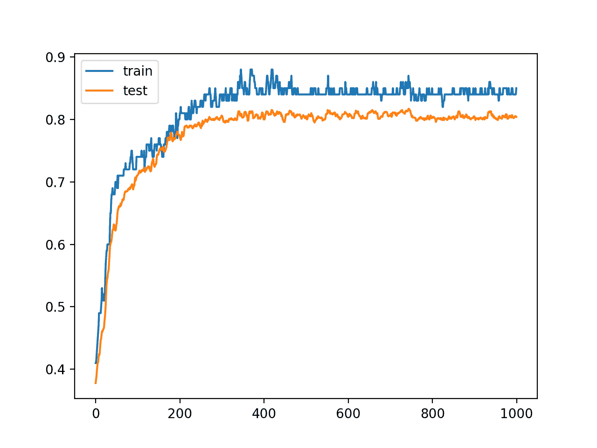

# 如何开发水平投票深度学习集成来减少方差

> 原文：<https://machinelearningmastery.com/horizontal-voting-ensemble/>

最后更新于 2020 年 8 月 25 日

相对于未标记示例的数量，训练数据集较小的预测建模问题具有挑战性。

神经网络可以在这些类型的问题上表现良好，尽管它们在训练或保持验证数据集上测量的模型表现会有很大差异。这使得选择哪种模型作为最终模型存在风险，因为在训练结束时，没有明确的信号表明哪种模型比另一种模型更好。

水平投票集成是解决这个问题的一种简单方法，在接近训练运行结束的连续[训练时期](https://machinelearningmastery.com/difference-between-a-batch-and-an-epoch/)上保存的模型集合被保存并用作[集成](https://machinelearningmastery.com/ensemble-methods-for-deep-learning-neural-networks/)，这比随机选择单个最终模型产生更稳定和更好的平均表现。

在本教程中，您将发现如何使用水平投票集成来降低最终深度学习神经网络模型的方差。

完成本教程后，您将知道:

*   选择在训练数据集上具有高方差的最终神经网络模型是具有挑战性的。
*   水平投票集成为使用单次训练运行的高方差模型提供了一种减少方差和提高平均模型表现的方法。
*   如何使用 Keras 在 Python 中开发水平投票集成，以提高最终多层感知器模型的表现，从而进行多类分类。

**用我的新书[更好的深度学习](https://machinelearningmastery.com/better-deep-learning/)启动你的项目**，包括*分步教程*和所有示例的 *Python 源代码*文件。

我们开始吧。

*   **更新 2019 年 2 月**:删除了对完整代码示例中未使用的验证数据集的引用。
*   **2019 年 10 月更新**:针对 Keras 2.3 和 TensorFlow 2.0 更新。
*   **2020 年 1 月更新**:针对 Sklearn v0.22 API 的变化进行了更新。


如何通过水平投票集成减少最终深度学习模型中的差异[法蒂玛·弗洛雷斯](https://www.flickr.com/photos/fatifloresita/4998505013/)摄，保留部分权利。

## 教程概述

本教程分为五个部分；它们是:

1.  水平投票组合
2.  多类分类问题
3.  多层感知器模型
4.  保存水平模型
5.  进行水平集合预测

## 水平投票组合

集成学习结合了来自多个模型的预测。

当使用深度学习方法时，使用集成学习的一个挑战是，给定使用非常大的数据集和大模型，给定的训练运行可能需要几天、几周甚至几个月。训练多个模型可能不可行。

可能有助于集合的模型的另一个来源是训练期间不同点的单个模型的状态。

水平投票是谢晶晶等人在 2013 年的论文《[深度表示分类的水平和垂直集成》](https://arxiv.org/abs/1306.2759)中提出的集成方法

该方法包括在集成训练结束之前，使用来自连续时期块末端的多个模型进行预测。

该方法是专门为那些预测建模问题开发的，在这些问题中，与模型所需的预测数量相比，训练数据集相对较小。这导致模型在训练期间具有高的表现差异。在这种情况下，考虑到表现的差异，在训练过程的最后使用最终模型或任何给定的模型都是有风险的。

> ……随着训练周期的增长，分类错误率会先下降，然后趋于稳定。但是，当标记训练集的规模太小时，错误率会振荡[…]，因此很难选择一个“神奇”的时期来获得可靠的输出。

——[深度表征分类的水平和垂直集合](https://arxiv.org/abs/1306.2759)，2013。

相反，作者建议在训练过程中使用一个集合中来自一个连续时期块的所有模型，例如来自最近 200 个时期的模型。结果是集合的预测与集合中的任何单个模型一样好或更好。

> 为了减少不稳定性，我们提出了一种称为水平投票的方法。首先，选择为相对稳定的历元范围训练的网络。每个标签概率的预测由具有所选时期的顶层表示的标准分类器产生，然后被平均。

——[深度表征分类的水平和垂直集合](https://arxiv.org/abs/1306.2759)，2013。

因此，水平投票集成方法为给定模型需要大量计算资源来训练的情况和/或由于使用相对较小的训练数据集而导致训练的高方差而使得最终模型选择具有挑战性的情况提供了理想的方法。

既然我们已经熟悉了横向投票，我们就可以实现这个程序了。

## 多类分类问题

我们将使用一个小的多类分类问题作为基础来演示水平投票集成。

Sklearn 类提供了 [make_blobs()函数](http://Sklearn.org/stable/modules/generated/sklearn.datasets.make_blobs.html)，该函数可用于创建具有规定数量的样本、输入变量、类和类内样本方差的多类分类问题。

该问题有两个输入变量(表示点的 x 和 y 坐标)，每个组中的点的标准偏差为 2.0。我们将使用相同的随机状态(伪随机数发生器的种子)来确保我们总是获得相同的数据点。

```py
# generate 2d classification dataset
X, y = make_blobs(n_samples=1000, centers=3, n_features=2, cluster_std=2, random_state=2)
```

结果是我们可以建模的数据集的输入和输出元素。

为了了解问题的复杂性，我们可以在二维散点图上绘制每个点，并按类值给每个点着色。

下面列出了完整的示例。

```py
# scatter plot of blobs dataset
from sklearn.datasets import make_blobs
from matplotlib import pyplot
from pandas import DataFrame
# generate 2d classification dataset
X, y = make_blobs(n_samples=1000, centers=3, n_features=2, cluster_std=2, random_state=2)
# scatter plot, dots colored by class value
df = DataFrame(dict(x=X[:,0], y=X[:,1], label=y))
colors = {0:'red', 1:'blue', 2:'green'}
fig, ax = pyplot.subplots()
grouped = df.groupby('label')
for key, group in grouped:
    group.plot(ax=ax, kind='scatter', x='x', y='y', label=key, color=colors[key])
pyplot.show()
```

运行该示例会创建整个数据集的散点图。我们可以看到，2.0 的标准差意味着类不是线性可分的(可以用一条线分开)，导致很多不明确的点。

这是可取的，因为这意味着问题不是微不足道的，并将允许神经网络模型找到许多不同的“足够好”的候选解决方案，从而导致高方差。


具有三个类和按类值着色的点的斑点数据集的散点图

## 多层感知器模型

在我们定义一个模型之前，我们需要设计一个适合水平投票集合的问题。

在我们的问题中，训练数据集相对较小。具体来说，训练数据集中的示例与保持数据集中的示例的比例为 10:1。这模拟了一种情况，即我们可能有大量未标记的示例和少量已标记的示例来训练模型。

我们将从斑点问题中创建 1100 个数据点。模型将在前 100 个点上进行训练，剩余的 1000 个点将保留在测试数据集中，模型无法使用。

```py
# generate 2d classification dataset
X, y = make_blobs(n_samples=1100, centers=3, n_features=2, cluster_std=2, random_state=2)
# split into train and test
n_train = 100
trainX, testX = X[:n_train, :], X[n_train:, :]
trainy, testy = y[:n_train], y[n_train:]
print(trainX.shape, testX.shape)
```

该问题是一个多类分类问题，我们将在输出层使用 softmax 激活函数对其进行建模。

这意味着模型将以样本属于三类中每一类的概率来预测具有三个元素的向量。因此，我们必须对类值进行热编码，最好是在我们将行分割成训练、测试和验证数据集之前，这样它就是一个函数调用。

```py
y = to_categorical(y)
```

接下来，我们可以定义并组合模型。

该模型将预期具有两个输入变量的样本。然后，该模型有一个具有 25 个节点的单个隐藏层和一个校正的线性激活函数，然后有一个具有三个节点的输出层来预测三个类中每一个的概率，还有一个 softmax 激活函数。

由于问题是多类的，我们将使用分类交叉熵损失函数来优化模型和有效的 [Adam](https://machinelearningmastery.com/adam-optimization-algorithm-for-deep-learning/) 味道的随机梯度下降。

```py
# define model
model = Sequential()
model.add(Dense(25, input_dim=2, activation='relu'))
model.add(Dense(3, activation='softmax'))
model.compile(loss='categorical_crossentropy', optimizer='adam', metrics=['accuracy'])
```

该模型适用于 1，000 个训练时期，我们将使用测试集作为验证集来评估训练集中每个时期的模型。

```py
# fit model
history = model.fit(trainX, trainy, validation_data=(testX, testy), epochs=1000, verbose=0)
```

在运行结束时，我们将评估模型在列车和测试集上的表现。

```py
# evaluate the model
_, train_acc = model.evaluate(trainX, trainy, verbose=0)
_, test_acc = model.evaluate(testX, testy, verbose=0)
print('Train: %.3f, Test: %.3f' % (train_acc, test_acc))
```

最后，我们将在训练和验证数据集上绘制每个训练时期的模型准确率的学习曲线。

```py
# learning curves of model accuracy
pyplot.plot(history.history['accuracy'], label='train')
pyplot.plot(history.history['val_accuracy'], label='test')
pyplot.legend()
pyplot.show()
```

将所有这些结合在一起，下面列出了完整的示例。

```py
# develop an mlp for blobs dataset
from sklearn.datasets import make_blobs
from keras.utils import to_categorical
from keras.models import Sequential
from keras.layers import Dense
from matplotlib import pyplot
# generate 2d classification dataset
X, y = make_blobs(n_samples=1100, centers=3, n_features=2, cluster_std=2, random_state=2)
# one hot encode output variable
y = to_categorical(y)
# split into train and test
n_train = 100
trainX, testX = X[:n_train, :], X[n_train:, :]
trainy, testy = y[:n_train], y[n_train:]
print(trainX.shape, testX.shape)
# define model
model = Sequential()
model.add(Dense(25, input_dim=2, activation='relu'))
model.add(Dense(3, activation='softmax'))
model.compile(loss='categorical_crossentropy', optimizer='adam', metrics=['accuracy'])
# fit model
history = model.fit(trainX, trainy, validation_data=(testX, testy), epochs=1000, verbose=0)
# evaluate the model
_, train_acc = model.evaluate(trainX, trainy, verbose=0)
_, test_acc = model.evaluate(testX, testy, verbose=0)
print('Train: %.3f, Test: %.3f' % (train_acc, test_acc))
# learning curves of model accuracy
pyplot.plot(history.history['accuracy'], label='train')
pyplot.plot(history.history['val_accuracy'], label='test')
pyplot.legend()
pyplot.show()
```

运行该示例首先打印每个数据集的形状以供确认，然后打印最终模型在训练和测试数据集上的表现。

**注**:考虑到算法或评估程序的随机性，或数值准确率的差异，您的[结果可能会有所不同](https://machinelearningmastery.com/different-results-each-time-in-machine-learning/)。考虑运行该示例几次，并比较平均结果。

在这种情况下，我们可以看到，该模型在我们知道是乐观的训练数据集上达到了大约 85%的准确率，在测试数据集上达到了大约 80%，我们预计这将更加真实。

```py
(100, 2) (1000, 2)
Train: 0.850, Test: 0.804
```

还创建了一个线图，显示了在每个训练周期内，训练和测试集上模型准确率的学习曲线。

我们可以看到，在整个跑步过程中，训练的准确性更加乐观，我们也注意到了最终得分。我们可以看到，与测试集相比，模型的准确性在训练数据集上具有较高的方差，这是我们所期望的。

模型中的差异突出了这样一个事实，即在运行结束时选择模型或从大约纪元 800 开始的任何模型都是具有挑战性的，因为训练数据集上的准确率具有很高的差异。我们还在测试数据集上看到了方差的静音版本。



每个训练时期训练和测试数据集上模型准确率的线图学习曲线

既然我们已经确定该模型是横向投票集成的良好候选，我们就可以开始实现该技术了。

## 保存水平模型

可能有许多方法来实现水平投票集合。

也许最简单的方法是手动驱动训练过程，一次一个纪元，然后在纪元结束时保存模型，如果我们已经超过了纪元数量的上限。

例如，对于我们的测试问题，我们将针对 1，000 个纪元训练模型，并且可能保存从纪元 950 开始的模型(例如，在纪元 950 和 999 之间并且包括纪元 950 和 999)。

```py
# fit model
n_epochs, n_save_after = 1000, 950
for i in range(n_epochs):
	# fit model for a single epoch
	model.fit(trainX, trainy, epochs=1, verbose=0)
	# check if we should save the model
	if i >= n_save_after:
		model.save('models/model_' + str(i) + '.h5')
```

使用模型上的 *save()* 功能并指定包含纪元号的文件名，可以将模型保存到文件中。

为了避免与我们的源文件混淆，我们将所有模型保存在当前工作目录中新的“ *models/* ”文件夹下。

```py
# create directory for models
makedirs('models')
```

注意，在 Keras 中保存和加载神经网络模型需要安装 h5py 库。

您可以使用 pip 安装此库，如下所示:

```py
pip install h5py
```

将所有这些结合在一起，下面列出了在训练数据集上拟合模型并保存最近 50 个时代的所有模型的完整示例。

```py
# save horizontal voting ensemble members during training
from sklearn.datasets import make_blobs
from keras.utils import to_categorical
from keras.models import Sequential
from keras.layers import Dense
from matplotlib import pyplot
from os import makedirs
# generate 2d classification dataset
X, y = make_blobs(n_samples=1100, centers=3, n_features=2, cluster_std=2, random_state=2)
# one hot encode output variable
y = to_categorical(y)
# split into train and test
n_train = 100
trainX, testX = X[:n_train, :], X[n_train:, :]
trainy, testy = y[:n_train], y[n_train:]
print(trainX.shape, testX.shape)
# define model
model = Sequential()
model.add(Dense(25, input_dim=2, activation='relu'))
model.add(Dense(3, activation='softmax'))
model.compile(loss='categorical_crossentropy', optimizer='adam', metrics=['accuracy'])
# create directory for models
makedirs('models')
# fit model
n_epochs, n_save_after = 1000, 950
for i in range(n_epochs):
	# fit model for a single epoch
	model.fit(trainX, trainy, epochs=1, verbose=0)
	# check if we should save the model
	if i >= n_save_after:
		model.save('models/model_' + str(i) + '.h5')
```

运行该示例会创建“*模型/* ”文件夹，并将 50 个模型保存到目录中。

注意，要重新运行这个示例，您必须删除“ *models/* ”目录，以便脚本可以重新创建它。

## 进行水平集合预测

现在我们已经创建了模型，我们可以在水平投票集合中使用它们。

首先，我们需要将模型加载到内存中。这是合理的，因为模型很小。如果您试图开发一个具有非常大的模型的水平投票集成，可能更容易一次加载一个模型，进行预测，然后加载下一个模型并重复该过程。

下面的功能 *load_all_models()* 将从“ *models/* 目录加载模型。它以开始和结束时代作为参数，这样您就可以试验在连续时代中保存的不同组的模型。

```py
# load models from file
def load_all_models(n_start, n_end):
	all_models = list()
	for epoch in range(n_start, n_end):
		# define filename for this ensemble
		filename = 'models/model_' + str(epoch) + '.h5'
		# load model from file
		model = load_model(filename)
		# add to list of members
		all_models.append(model)
		print('>loaded %s' % filename)
	return all_models
```

我们可以调用函数来加载所有的模型。

然后，我们可以反转模型列表，以便运行结束时的模型位于列表的开头。这将有助于我们以后测试不同大小的投票集合，包括从跑步结束后向后到训练时期的模型，以防最好的模型真的在跑步结束时。

```py
# load models in order
members = load_all_models(950, 1000)
print('Loaded %d models' % len(members))
# reverse loaded models so we build the ensemble with the last models first
members = list(reversed(members))
```

接下来，我们可以评估测试数据集中每个保存的模型，以及来自训练的最后 n 个连续模型的投票集合。

我们想知道每个模型在测试数据集上的实际表现如何，更重要的是，模型表现在测试数据集上的分布，这样我们就知道从运行结束时选择的平均模型在实践中的表现如何(或差)。

我们不知道横向投票组合中包括多少成员。因此，我们可以测试不同数量的连续成员，从最终模型向后工作。

首先，我们需要一个函数来用集合成员的列表进行预测。每个成员预测三个输出类的概率。将概率相加，我们使用 argmax 来选择支持度最高的类。下面的*集成预测()*函数实现了这种基于投票的预测方案。

```py
# make an ensemble prediction for multi-class classification
def ensemble_predictions(members, testX):
	# make predictions
	yhats = [model.predict(testX) for model in members]
	yhats = array(yhats)
	# sum across ensemble members
	summed = numpy.sum(yhats, axis=0)
	# argmax across classes
	result = argmax(summed, axis=1)
	return result
```

接下来，我们需要一个函数来评估给定大小的集合成员的子集。

需要选择子集，做出预测，并通过将预测与期望值进行比较来估计集合的表现。下面的 *evaluate_n_members()* 函数实现了这个集合大小的评估。

```py
# evaluate a specific number of members in an ensemble
def evaluate_n_members(members, n_members, testX, testy):
	# select a subset of members
	subset = members[:n_members]
	# make prediction
	yhat = ensemble_predictions(subset, testX)
	# calculate accuracy
	return accuracy_score(testy, yhat)
```

我们现在可以列举从 1 到 50 的不同大小的横向投票组合。每个成员都单独评估，然后评估该规模的整体，并记录分数。

```py
# evaluate different numbers of ensembles on hold out set
single_scores, ensemble_scores = list(), list()
for i in range(1, len(members)+1):
	# evaluate model with i members
	ensemble_score = evaluate_n_members(members, i, testX, testy)
	# evaluate the i'th model standalone
	testy_enc = to_categorical(testy)
	_, single_score = members[i-1].evaluate(testX, testy_enc, verbose=0)
	# summarize this step
	print('> %d: single=%.3f, ensemble=%.3f' % (i, single_score, ensemble_score))
	ensemble_scores.append(ensemble_score)
	single_scores.append(single_score)
```

在评估结束时，我们报告测试数据集中单个模型的分数分布。如果我们选择任何一个保存的模型作为最终模型，平均分数就是我们平均期望的分数。

```py
# summarize average accuracy of a single final model
print('Accuracy %.3f (%.3f)' % (mean(single_scores), std(single_scores)))
```

最后，我们可以绘制分数。每个独立模型的分数都绘制为蓝点，并为每个连续模型的集合(橙色)创建线图。

```py
# plot score vs number of ensemble members
x_axis = [i for i in range(1, len(members)+1)]
pyplot.plot(x_axis, single_scores, marker='o', linestyle='None')
pyplot.plot(x_axis, ensemble_scores, marker='o')
pyplot.show()
```

我们的预期是，一个合理规模的集合将优于随机选择的模型，并且在选择集合规模时存在收益递减点。

下面列出了完整的示例。

```py
# load models and make predictions using a horizontal voting ensemble
from sklearn.datasets import make_blobs
from sklearn.metrics import accuracy_score
from keras.utils import to_categorical
from keras.models import load_model
from keras.models import Sequential
from keras.layers import Dense
from matplotlib import pyplot
from numpy import mean
from numpy import std
import numpy
from numpy import array
from numpy import argmax

# load models from file
def load_all_models(n_start, n_end):
	all_models = list()
	for epoch in range(n_start, n_end):
		# define filename for this ensemble
		filename = 'models/model_' + str(epoch) + '.h5'
		# load model from file
		model = load_model(filename)
		# add to list of members
		all_models.append(model)
		print('>loaded %s' % filename)
	return all_models

# make an ensemble prediction for multi-class classification
def ensemble_predictions(members, testX):
	# make predictions
	yhats = [model.predict(testX) for model in members]
	yhats = array(yhats)
	# sum across ensemble members
	summed = numpy.sum(yhats, axis=0)
	# argmax across classes
	result = argmax(summed, axis=1)
	return result

# evaluate a specific number of members in an ensemble
def evaluate_n_members(members, n_members, testX, testy):
	# select a subset of members
	subset = members[:n_members]
	# make prediction
	yhat = ensemble_predictions(subset, testX)
	# calculate accuracy
	return accuracy_score(testy, yhat)

# generate 2d classification dataset
X, y = make_blobs(n_samples=1100, centers=3, n_features=2, cluster_std=2, random_state=2)
# split into train and test
n_train = 100
trainX, testX = X[:n_train, :], X[n_train:, :]
trainy, testy = y[:n_train], y[n_train:]
print(trainX.shape, testX.shape)
# load models in order
members = load_all_models(950, 1000)
print('Loaded %d models' % len(members))
# reverse loaded models so we build the ensemble with the last models first
members = list(reversed(members))
# evaluate different numbers of ensembles on hold out set
single_scores, ensemble_scores = list(), list()
for i in range(1, len(members)+1):
	# evaluate model with i members
	ensemble_score = evaluate_n_members(members, i, testX, testy)
	# evaluate the i'th model standalone
	testy_enc = to_categorical(testy)
	_, single_score = members[i-1].evaluate(testX, testy_enc, verbose=0)
	# summarize this step
	print('> %d: single=%.3f, ensemble=%.3f' % (i, single_score, ensemble_score))
	ensemble_scores.append(ensemble_score)
	single_scores.append(single_score)
# summarize average accuracy of a single final model
print('Accuracy %.3f (%.3f)' % (mean(single_scores), std(single_scores)))
# plot score vs number of ensemble members
x_axis = [i for i in range(1, len(members)+1)]
pyplot.plot(x_axis, single_scores, marker='o', linestyle='None')
pyplot.plot(x_axis, ensemble_scores, marker='o')
pyplot.show()
```

首先，将 50 个保存的模型加载到内存中。

```py
...
>loaded models/model_990.h5
>loaded models/model_991.h5
>loaded models/model_992.h5
>loaded models/model_993.h5
>loaded models/model_994.h5
>loaded models/model_995.h5
>loaded models/model_996.h5
>loaded models/model_997.h5
>loaded models/model_998.h5
>loaded models/model_999.h5
```

接下来，在保持测试数据集和该大小的集合(1、2、3 等)上评估每个单个模型的表现。)在保持测试数据集上创建和评估。

```py
> 1: single=0.814, ensemble=0.814
> 2: single=0.816, ensemble=0.816
> 3: single=0.812, ensemble=0.816
> 4: single=0.812, ensemble=0.815
> 5: single=0.811, ensemble=0.815
> 6: single=0.812, ensemble=0.812
> 7: single=0.812, ensemble=0.813
> 8: single=0.817, ensemble=0.814
> 9: single=0.819, ensemble=0.814
> 10: single=0.822, ensemble=0.816
> 11: single=0.822, ensemble=0.817
> 12: single=0.821, ensemble=0.818
> 13: single=0.822, ensemble=0.821
> 14: single=0.820, ensemble=0.821
> 15: single=0.817, ensemble=0.820
> 16: single=0.819, ensemble=0.820
> 17: single=0.816, ensemble=0.819
> 18: single=0.815, ensemble=0.819
> 19: single=0.813, ensemble=0.819
> 20: single=0.812, ensemble=0.818
> 21: single=0.812, ensemble=0.818
> 22: single=0.810, ensemble=0.818
> 23: single=0.812, ensemble=0.819
> 24: single=0.815, ensemble=0.819
> 25: single=0.816, ensemble=0.819
> 26: single=0.817, ensemble=0.819
> 27: single=0.819, ensemble=0.819
> 28: single=0.816, ensemble=0.819
> 29: single=0.817, ensemble=0.819
> 30: single=0.819, ensemble=0.820
> 31: single=0.817, ensemble=0.820
> 32: single=0.819, ensemble=0.820
> 33: single=0.817, ensemble=0.819
> 34: single=0.816, ensemble=0.819
> 35: single=0.815, ensemble=0.818
> 36: single=0.816, ensemble=0.818
> 37: single=0.816, ensemble=0.818
> 38: single=0.819, ensemble=0.818
> 39: single=0.817, ensemble=0.817
> 40: single=0.816, ensemble=0.816
> 41: single=0.816, ensemble=0.816
> 42: single=0.816, ensemble=0.817
> 43: single=0.817, ensemble=0.817
> 44: single=0.816, ensemble=0.817
> 45: single=0.816, ensemble=0.818
> 46: single=0.817, ensemble=0.818
> 47: single=0.812, ensemble=0.818
> 48: single=0.811, ensemble=0.818
> 49: single=0.810, ensemble=0.818
> 50: single=0.811, ensemble=0.818
```

大致上，我们可以看到，该集成似乎优于大多数单一模型，始终达到 81.8%左右的准确率。

接下来，报告单个模型的准确率分布。我们可以看到，随机选择任何一个保存的模型都会得到一个平均准确率为 81.6%的模型，其相对严格的标准偏差为 0.3%。

**注**:考虑到算法或评估程序的随机性，或数值准确率的差异，您的[结果可能会有所不同](https://machinelearningmastery.com/different-results-each-time-in-machine-learning/)。考虑运行该示例几次，并比较平均结果。

为了有用，我们需要水平集成超过这个平均值。

```py
Accuracy 0.816 (0.003)
```

最后，创建一个图表，总结每个单个模型(蓝点)的表现，以及从 1 到 50 个成员的每个大小的集合。

我们可以从蓝点看出，各个时期的模型没有结构，例如，如果训练期间的最后一个模型更好，那么从左到右的准确性将呈下降趋势。

我们可以看到，随着我们添加更多的集成成员，橙色线中的水平投票集成的表现越好。我们可以看到，在这个问题上的表现可能在 23 至 33 个时代之间趋于平缓；那可能是个不错的选择。


显示单个模型准确率(蓝点)与水平投票集合中不同大小集合的准确率的线图

## 扩展ˌ扩张

本节列出了一些您可能希望探索的扩展教程的想法。

*   **数据集大小**。使用较小或较大的数据集重复实验，训练与测试示例的比率相似。
*   **更大的集成**。用数百个最终模型重新运行该示例，并报告大规模集成对测试集准确性的影响。
*   **随机采样模型**。重新运行该示例，将相同大小的集成的表现与连续时期保存的模型和随机选择的保存模型进行比较。

如果你探索这些扩展，我很想知道。

## 进一步阅读

如果您想更深入地了解这个主题，本节将提供更多资源。

### 报纸

*   [深度表征分类的水平和垂直集合](https://arxiv.org/abs/1306.2759)，2013。

### 应用程序接口

*   [开始使用 Keras 顺序模型](https://keras.io/getting-started/sequential-model-guide/)
*   [硬核层 API](https://keras.io/layers/core/)
*   [scipy . stat . mode API](https://docs.scipy.org/doc/scipy/reference/generated/scipy.stats.mode.html)的缩写形式
*   num py . argmax API
*   [sklearn . dataset . make _ blobs API](http://Sklearn.org/stable/modules/generated/sklearn.datasets.make_blobs.html)
*   [如何保存一个 Keras 模型？](https://keras.io/getting-started/faq/#how-can-i-save-a-keras-model)
*   [硬回调接口](https://keras.io/callbacks)

## 摘要

在本教程中，您发现了如何使用水平投票集成来降低最终深度学习神经网络模型的方差。

具体来说，您了解到:

*   选择在训练数据集上具有高方差的最终神经网络模型是具有挑战性的。
*   水平投票集成为使用单次训练运行的高方差模型提供了一种减少方差和提高平均模型表现的方法。
*   如何使用 Keras 在 Python 中开发水平投票集成，以提高最终多层感知器模型的表现，从而进行多类分类。

你有什么问题吗？
在下面的评论中提问，我会尽力回答。