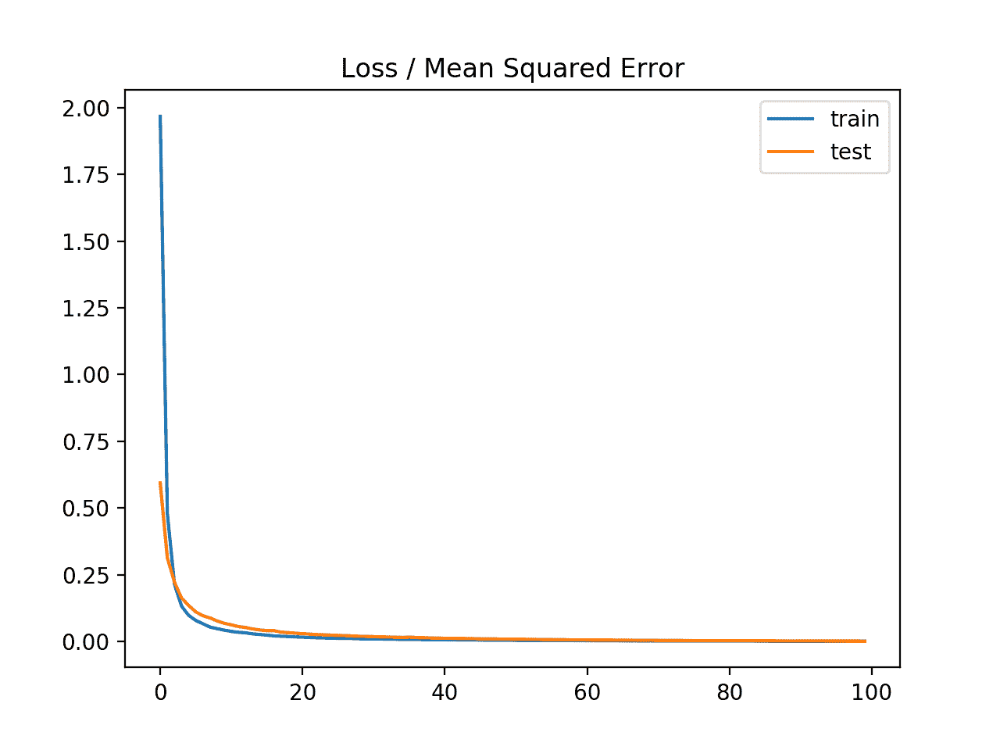
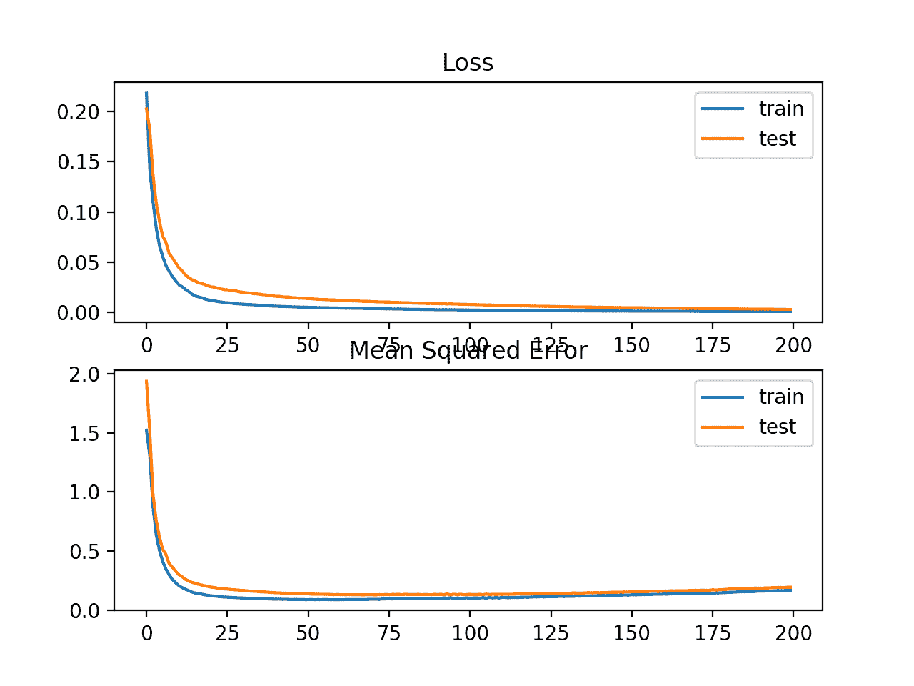
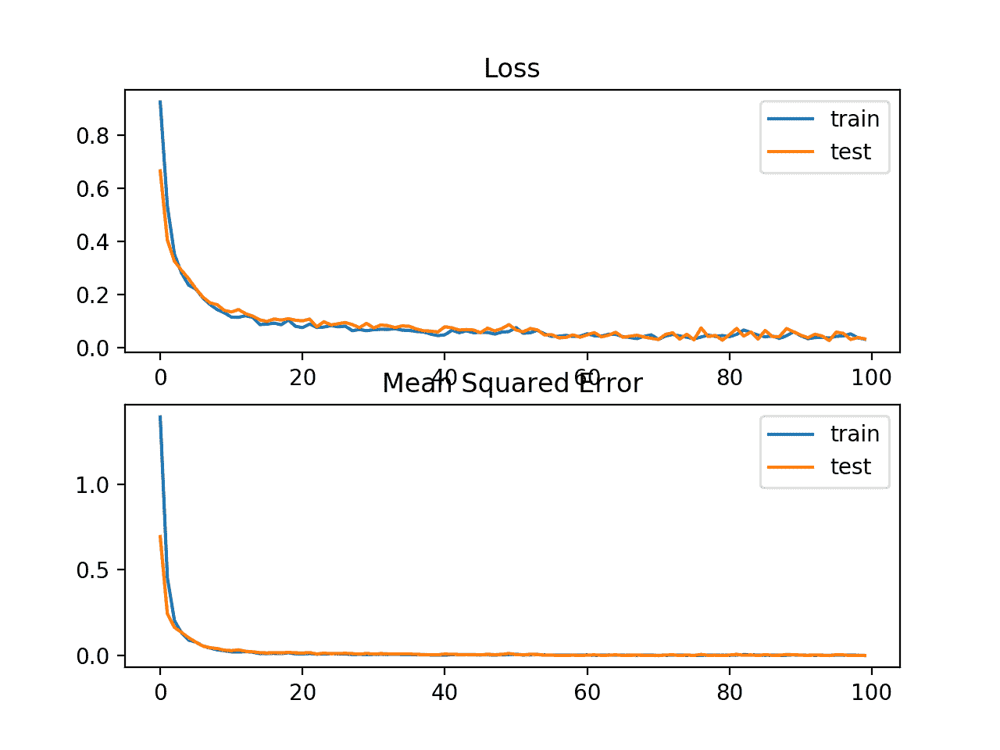
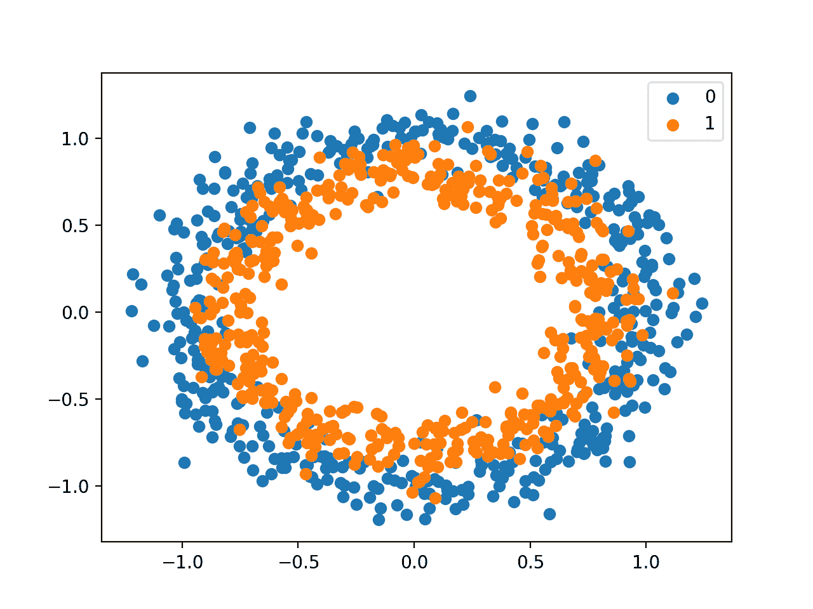
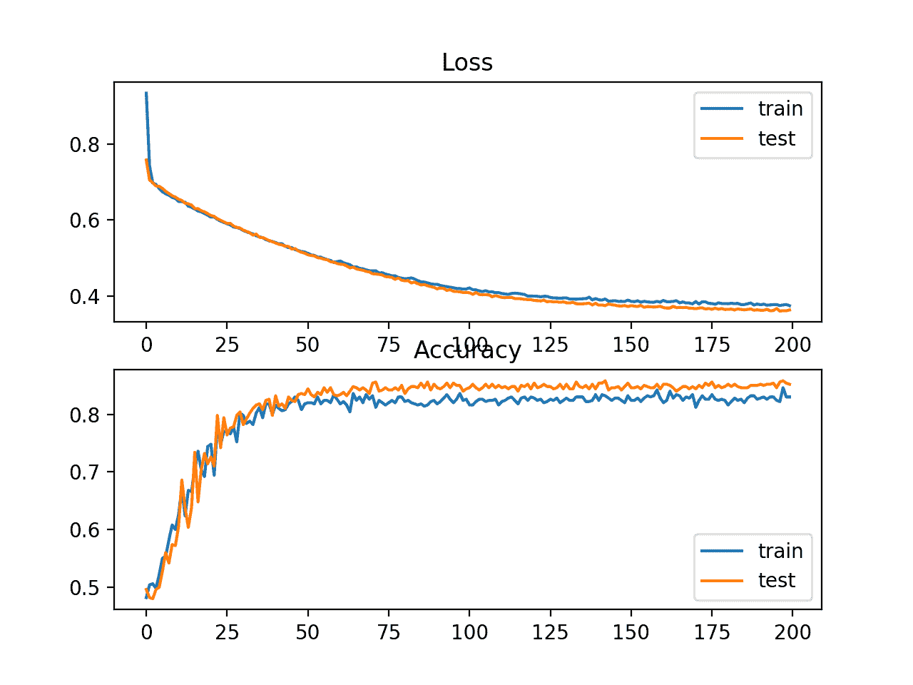
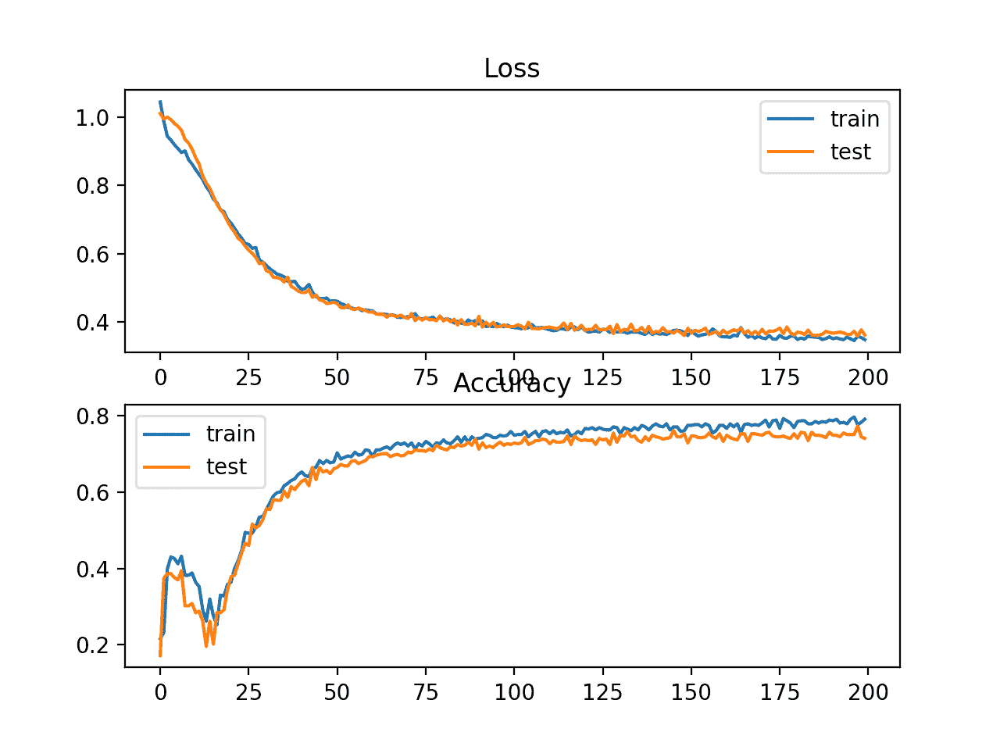
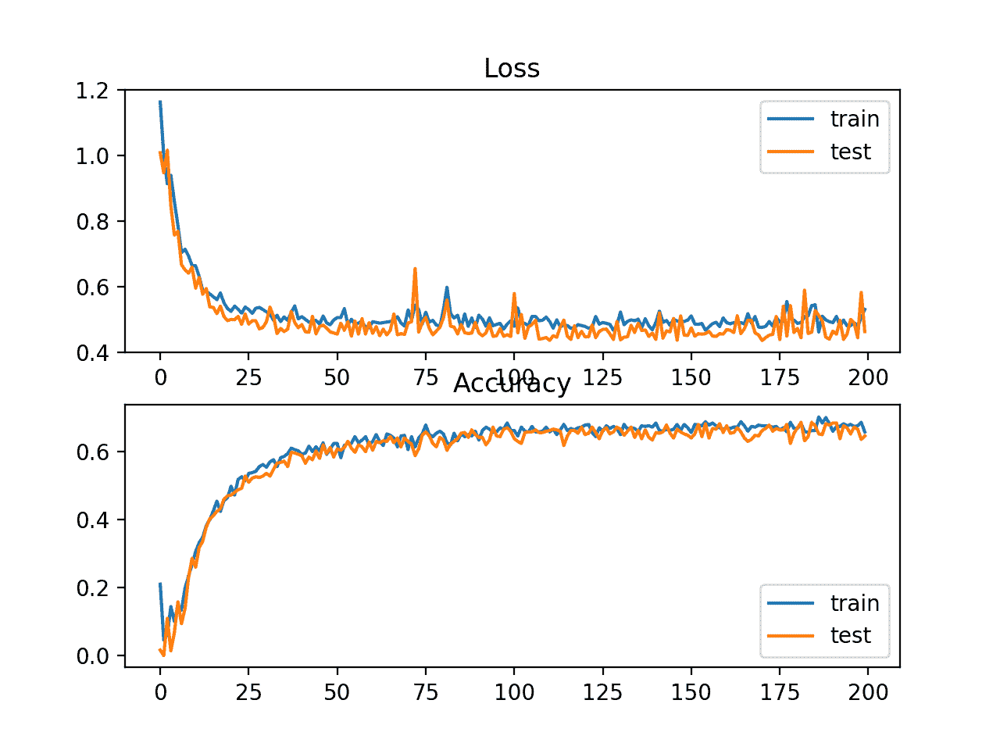
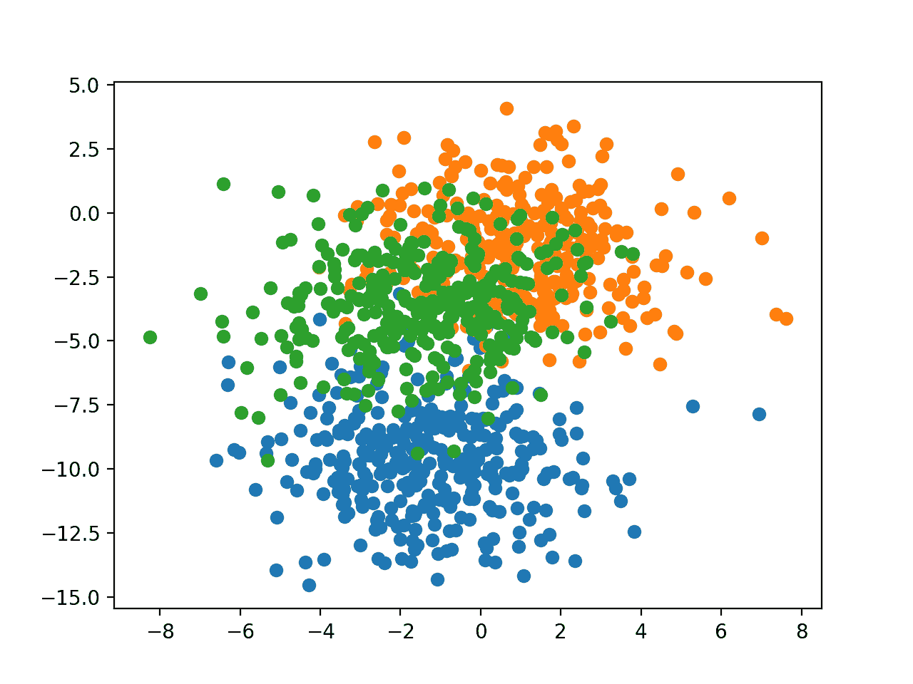
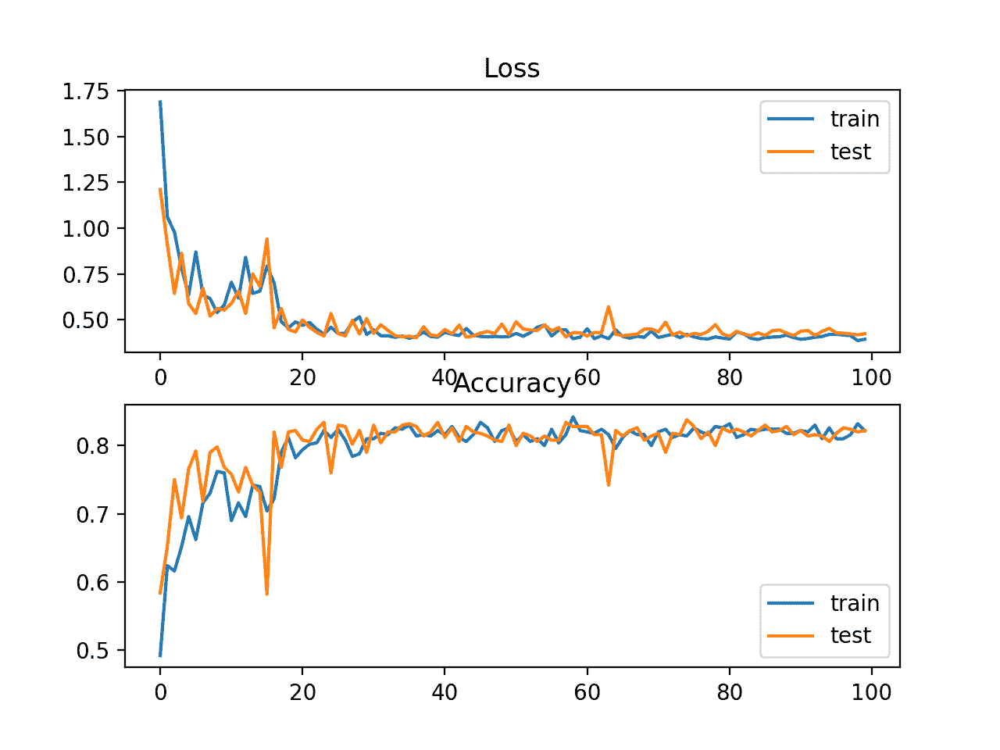
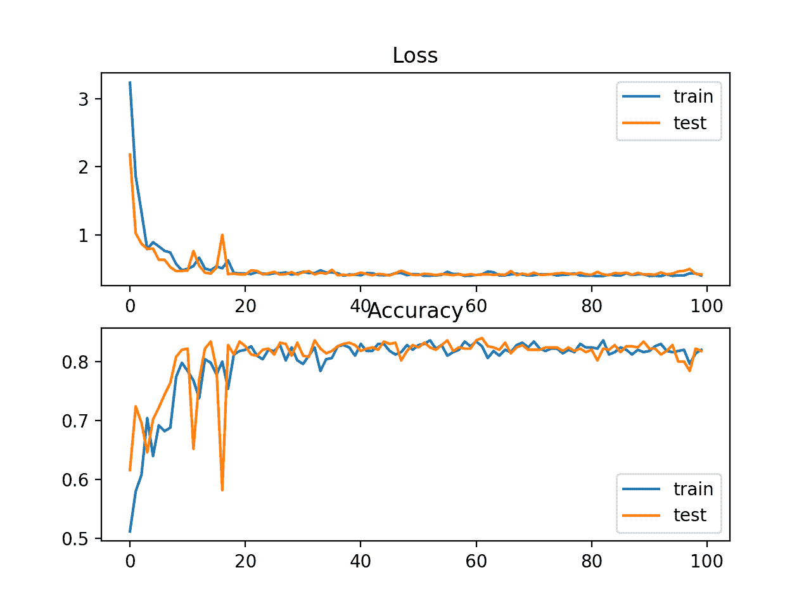

# 训练深度学习神经网络时如何选择损失函数

> 原文：<https://machinelearningmastery.com/how-to-choose-loss-functions-when-training-deep-learning-neural-networks/>

最后更新于 2020 年 8 月 25 日

**使用随机梯度下降优化算法训练深度学习神经网络**。

作为优化算法的一部分，必须重复估计模型当前状态的误差。这需要选择一个误差函数，通常称为**损失函数**，该函数可用于估计模型的损失，以便更新权重来减少下一次评估的损失。

神经网络模型从示例中学习从输入到输出的映射，损失函数的选择必须与特定预测建模问题的框架相匹配，例如分类或回归。此外，输出层的配置也必须适合所选的损耗函数。

在本教程中，您将发现如何为给定预测建模问题的深度学习神经网络选择损失函数。

完成本教程后，您将知道:

*   如何配置回归问题的均方误差和变量模型？
*   如何为二分类配置交叉熵和铰链损失函数模型。
*   如何为多类分类配置交叉熵和 KL 散度损失函数模型。

**用我的新书[更好的深度学习](https://machinelearningmastery.com/better-deep-learning/)启动你的项目**，包括*分步教程*和所有示例的 *Python 源代码*文件。

我们开始吧。

*   **2019 年 10 月更新**:针对 Keras 2.3 和 TensorFlow 2.0 更新。
*   **2020 年 1 月更新**:针对 Sklearn v0.22 API 的变化进行了更新


训练深度学习神经网络时如何选择损失函数
图片由[glacierenps](https://www.flickr.com/photos/glaciernps/5346153055/)提供，保留部分权利。

## 教程概述

本教程分为三个部分；它们是:

1.  回归损失函数
    1.  均方误差损失
    2.  均方对数误差损失
    3.  平均绝对误差损失
2.  二分类损失函数
    1.  二元交叉熵
    2.  铰链损失
    3.  方形铰链损失
3.  多类分类损失函数
    1.  多类交叉熵损失
    2.  稀疏多类交叉熵损失
    3.  库尔巴克·莱布勒发散损失

我们将重点讨论如何选择和实现不同的损失函数。

有关损失函数的更多理论，请参见文章:

*   [用于训练深度学习神经网络的损失和损失函数](https://machinelearningmastery.com/loss-and-loss-functions-for-training-deep-learning-neural-networks/)

## 回归损失函数

回归预测建模问题涉及预测实值量。

在本节中，我们将研究适用于回归预测建模问题的损失函数。

作为本次调查的背景，我们将使用由 Sklearn 库在[make _ revolution()函数](http://Sklearn.org/stable/modules/generated/sklearn.datasets.make_regression.html)中提供的标准回归问题生成器。该函数将从具有给定数量的输入变量、统计噪声和其他属性的简单回归问题中生成示例。

我们将使用这个函数来定义一个有 20 个输入特征的问题；其中 10 个功能将是有意义的，10 个将不相关。总共将随机生成 1000 个示例。伪随机数发生器将是固定的，以确保我们每次运行代码时都会得到相同的 1000 个例子。

```py
# generate regression dataset
X, y = make_regression(n_samples=1000, n_features=20, noise=0.1, random_state=1)
```

当实值输入和输出变量被缩放到合理的范围时，神经网络通常表现得更好。对于这个问题，每个输入变量和目标变量都具有高斯分布；因此，在这种情况下标准化数据是可取的。

我们可以使用 Sklearn 库中的[标准转换器](http://Sklearn.org/stable/modules/generated/sklearn.preprocessing.StandardScaler.html)类来实现这一点。在一个实际问题上，我们将在训练数据集上准备定标器，并将其应用于训练集和测试集，但是为了简单起见，我们将在分割成训练集和测试集之前将所有数据一起定标。

```py
# standardize dataset
X = StandardScaler().fit_transform(X)
y = StandardScaler().fit_transform(y.reshape(len(y),1))[:,0]
```

一旦缩放，数据将被平均分成训练集和测试集。

```py
# split into train and test
n_train = 500
trainX, testX = X[:n_train, :], X[n_train:, :]
trainy, testy = y[:n_train], y[n_train:]
```

将定义一个小型多层感知器(MLP)模型来解决这个问题，并为探索不同的损失函数提供基础。

该模型将预期 20 个特征作为问题定义的输入。该模型将有一个包含 25 个节点的隐藏层，并将使用[校正线性激活函数(ReLU)](https://machinelearningmastery.com/rectified-linear-activation-function-for-deep-learning-neural-networks/) 。给定一个要预测的真实值，输出层将有 1 个节点，并将使用线性激活函数。

```py
# define model
model = Sequential()
model.add(Dense(25, input_dim=20, activation='relu', kernel_initializer='he_uniform'))
model.add(Dense(1, activation='linear'))
```

该模型将适合随机梯度下降，学习率为 0.01，动量为 0.9，两者都是合理的默认值。

训练将进行 100 个时期，测试集将在每个时期结束时进行评估，以便我们可以在运行结束时[绘制学习曲线](https://machinelearningmastery.com/how-to-control-neural-network-model-capacity-with-nodes-and-layers/)。

```py
opt = SGD(lr=0.01, momentum=0.9)
model.compile(loss='...', optimizer=opt)
# fit model
history = model.fit(trainX, trainy, validation_data=(testX, testy), epochs=100, verbose=0)
```

现在我们已经有了问题和模型的基础，我们可以看一下评估三个适用于回归预测建模问题的常见损失函数。

虽然在这些例子中使用了 MLP，但是当训练 CNN 和 RNN 模型进行回归时，可以使用相同的损失函数。

### 均方误差损失

均方误差损失是用于回归问题的默认损失。

数学上，如果目标变量的分布是高斯分布，则是最大似然推理框架下的优选损失函数。首先要评估的是损失函数，只有在你有充分理由的情况下才能改变。

均方误差计算为预测值和实际值之间的平方差的平均值。无论预测值和实际值的符号如何，结果总是正的，理想值为 0.0。平方意味着较大的错误比较小的错误导致更多的错误，这意味着模型因犯较大的错误而受到惩罚。

在 Keras 中，均方误差损失函数可以通过在编译模型时指定“ *mse* 或“*均方误差*作为损失函数来使用。

```py
model.compile(loss='mean_squared_error')
```

建议输出层有一个目标变量节点，并使用线性激活函数。

```py
model.add(Dense(1, activation='linear'))
```

下面列出了在所描述的回归问题上演示 MLP 的完整示例。

```py
# mlp for regression with mse loss function
from sklearn.datasets import make_regression
from sklearn.preprocessing import StandardScaler
from keras.models import Sequential
from keras.layers import Dense
from keras.optimizers import SGD
from matplotlib import pyplot
# generate regression dataset
X, y = make_regression(n_samples=1000, n_features=20, noise=0.1, random_state=1)
# standardize dataset
X = StandardScaler().fit_transform(X)
y = StandardScaler().fit_transform(y.reshape(len(y),1))[:,0]
# split into train and test
n_train = 500
trainX, testX = X[:n_train, :], X[n_train:, :]
trainy, testy = y[:n_train], y[n_train:]
# define model
model = Sequential()
model.add(Dense(25, input_dim=20, activation='relu', kernel_initializer='he_uniform'))
model.add(Dense(1, activation='linear'))
opt = SGD(lr=0.01, momentum=0.9)
model.compile(loss='mean_squared_error', optimizer=opt)
# fit model
history = model.fit(trainX, trainy, validation_data=(testX, testy), epochs=100, verbose=0)
# evaluate the model
train_mse = model.evaluate(trainX, trainy, verbose=0)
test_mse = model.evaluate(testX, testy, verbose=0)
print('Train: %.3f, Test: %.3f' % (train_mse, test_mse))
# plot loss during training
pyplot.title('Loss / Mean Squared Error')
pyplot.plot(history.history['loss'], label='train')
pyplot.plot(history.history['val_loss'], label='test')
pyplot.legend()
pyplot.show()
```

运行该示例首先在训练和测试数据集上打印模型的均方误差。

**注**:考虑到算法或评估程序的随机性，或数值准确率的差异，您的[结果可能会有所不同](https://machinelearningmastery.com/different-results-each-time-in-machine-learning/)。考虑运行该示例几次，并比较平均结果。

在这种情况下，我们可以看到模型学会了实现零误差的问题，至少达到小数点后三位。

```py
Train: 0.000, Test: 0.001
```

还创建了一个线图，显示了训练集(蓝色)和测试集(橙色)在训练时期的均方误差损失。

我们可以看到，模型收敛得相当快，训练和测试表现保持相当。模型的表现和收敛行为表明均方误差是学习该问题的神经网络的良好匹配。



优化均方误差损失函数时训练时段的均方误差损失线图

### 均方对数误差损失

可能存在回归问题，其中目标值有一个值的范围，当预测一个大值时，您可能不想像均方误差那样严重地惩罚模型。

相反，您可以首先计算每个预测值的自然对数，然后计算均方误差。这被称为对数均方误差损失，简称 MSLE。

它具有放松大预测值中的大差异的惩罚效果的效果。

作为一种损失度量，当模型直接预测未缩放的数量时，它可能更合适。然而，我们可以用简单的回归问题来证明这个损失函数。

模型可以更新为使用“*均方对数误差*损失函数，并保持输出层的相同配置。在拟合模型时，我们还将跟踪均方误差作为一个指标，以便我们可以将其用作表现的衡量标准，并绘制学习曲线。

```py
model.compile(loss='mean_squared_logarithmic_error', optimizer=opt, metrics=['mse'])
```

下面列出了使用 MSLE 损失函数的完整示例。

```py
# mlp for regression with msle loss function
from sklearn.datasets import make_regression
from sklearn.preprocessing import StandardScaler
from keras.models import Sequential
from keras.layers import Dense
from keras.optimizers import SGD
from matplotlib import pyplot
# generate regression dataset
X, y = make_regression(n_samples=1000, n_features=20, noise=0.1, random_state=1)
# standardize dataset
X = StandardScaler().fit_transform(X)
y = StandardScaler().fit_transform(y.reshape(len(y),1))[:,0]
# split into train and test
n_train = 500
trainX, testX = X[:n_train, :], X[n_train:, :]
trainy, testy = y[:n_train], y[n_train:]
# define model
model = Sequential()
model.add(Dense(25, input_dim=20, activation='relu', kernel_initializer='he_uniform'))
model.add(Dense(1, activation='linear'))
opt = SGD(lr=0.01, momentum=0.9)
model.compile(loss='mean_squared_logarithmic_error', optimizer=opt, metrics=['mse'])
# fit model
history = model.fit(trainX, trainy, validation_data=(testX, testy), epochs=100, verbose=0)
# evaluate the model
_, train_mse = model.evaluate(trainX, trainy, verbose=0)
_, test_mse = model.evaluate(testX, testy, verbose=0)
print('Train: %.3f, Test: %.3f' % (train_mse, test_mse))
# plot loss during training
pyplot.subplot(211)
pyplot.title('Loss')
pyplot.plot(history.history['loss'], label='train')
pyplot.plot(history.history['val_loss'], label='test')
pyplot.legend()
# plot mse during training
pyplot.subplot(212)
pyplot.title('Mean Squared Error')
pyplot.plot(history.history['mean_squared_error'], label='train')
pyplot.plot(history.history['val_mean_squared_error'], label='test')
pyplot.legend()
pyplot.show()
```

运行该示例首先打印训练和测试数据集中模型的均方误差。

**注**:考虑到算法或评估程序的随机性，或数值准确率的差异，您的[结果可能会有所不同](https://machinelearningmastery.com/different-results-each-time-in-machine-learning/)。考虑运行该示例几次，并比较平均结果。

在这种情况下，我们可以看到该模型在训练和测试数据集上都导致了稍差的均方误差。因为目标变量的分布是标准的高斯分布，所以它可能不太适合这个问题。

```py
Train: 0.165, Test: 0.184
```

还创建了一个线图，显示了训练(蓝色)和测试(橙色)集合(顶部)在训练时期的对数误差的均方损失，以及一个类似的均方误差图(底部)。

我们可以看到，在 100 个时代的算法中，MSLE 收敛得很好；从 20 世纪开始，MSE 似乎显示出过度适应问题的迹象，快速下降并开始上升。



训练时期的均方对数误差损失和均方误差的线图

### 平均绝对误差损失

在一些回归问题中，目标变量的分布可能大部分是高斯分布，但是可能有异常值，例如远离平均值的大值或小值。

在这种情况下，平均绝对误差损失是一个合适的损失函数，因为它对异常值更稳健。它被计算为实际值和预测值之间的绝对差值的平均值。

模型可以更新为使用“ *mean_absolute_error* ”损失函数，并为输出层保持相同的配置。

```py
model.compile(loss='mean_absolute_error', optimizer=opt, metrics=['mse'])
```

下面列出了使用平均绝对误差作为回归测试问题损失函数的完整示例。

```py
# mlp for regression with mae loss function
from sklearn.datasets import make_regression
from sklearn.preprocessing import StandardScaler
from keras.models import Sequential
from keras.layers import Dense
from keras.optimizers import SGD
from matplotlib import pyplot
# generate regression dataset
X, y = make_regression(n_samples=1000, n_features=20, noise=0.1, random_state=1)
# standardize dataset
X = StandardScaler().fit_transform(X)
y = StandardScaler().fit_transform(y.reshape(len(y),1))[:,0]
# split into train and test
n_train = 500
trainX, testX = X[:n_train, :], X[n_train:, :]
trainy, testy = y[:n_train], y[n_train:]
# define model
model = Sequential()
model.add(Dense(25, input_dim=20, activation='relu', kernel_initializer='he_uniform'))
model.add(Dense(1, activation='linear'))
opt = SGD(lr=0.01, momentum=0.9)
model.compile(loss='mean_absolute_error', optimizer=opt, metrics=['mse'])
# fit model
history = model.fit(trainX, trainy, validation_data=(testX, testy), epochs=100, verbose=0)
# evaluate the model
_, train_mse = model.evaluate(trainX, trainy, verbose=0)
_, test_mse = model.evaluate(testX, testy, verbose=0)
print('Train: %.3f, Test: %.3f' % (train_mse, test_mse))
# plot loss during training
pyplot.subplot(211)
pyplot.title('Loss')
pyplot.plot(history.history['loss'], label='train')
pyplot.plot(history.history['val_loss'], label='test')
pyplot.legend()
# plot mse during training
pyplot.subplot(212)
pyplot.title('Mean Squared Error')
pyplot.plot(history.history['mean_squared_error'], label='train')
pyplot.plot(history.history['val_mean_squared_error'], label='test')
pyplot.legend()
pyplot.show()
```

运行该示例首先打印训练和测试数据集中模型的均方误差。

**注**:考虑到算法或评估程序的随机性，或数值准确率的差异，您的[结果可能会有所不同](https://machinelearningmastery.com/different-results-each-time-in-machine-learning/)。考虑运行该示例几次，并比较平均结果。

在这种情况下，我们可以看到模型学会了这个问题，实现了接近零的误差，至少到小数点后三位。

```py
Train: 0.002, Test: 0.002
```

还创建了一个线形图，显示了训练时段中训练集(蓝色)和测试集(橙色)的平均绝对误差损失(上图)，以及一个类似的均方误差图(下图)。

在这种情况下，我们可以看到 MAE 确实收敛了，但显示出一个颠簸的过程，尽管 MSE 的动力学似乎没有受到很大影响。我们知道目标变量是标准高斯，没有大的异常值，所以在这种情况下，MAE 不是一个很好的拟合。

如果我们不先缩放目标变量，可能会更适合这个问题。



训练时期平均绝对误差损失和均方误差的线图

## 二分类损失函数

二进制分类是那些预测建模问题，其中例子被分配两个标签中的一个。

该问题通常被设计为预测第一类或第二类的值 0 或 1，并且通常被实现为预测该示例属于类值 1 的概率。

在本节中，我们将研究适用于二分类预测建模问题的损失函数。

我们将从 Sklearn 中的循环测试问题中生成示例，作为本次调查的基础。[圆问题](https://Sklearn.org/stable/modules/generated/sklearn.datasets.make_circles.html)涉及从二维平面上的两个同心圆中抽取的样本，其中外圆上的点属于 0 类，内圆上的点属于 1 类。统计噪声被添加到样本中，以增加模糊性，并使问题更难学习。

我们将生成 1000 个示例，并添加 10%的统计噪声。伪随机数发生器将被植入相同的值，以确保我们总是得到相同的 1000 个例子。

```py
# generate circles
X, y = make_circles(n_samples=1000, noise=0.1, random_state=1)
```

我们可以创建数据集的散点图来了解我们正在建模的问题。下面列出了完整的示例。

```py
# scatter plot of the circles dataset with points colored by class
from sklearn.datasets import make_circles
from numpy import where
from matplotlib import pyplot
# generate circles
X, y = make_circles(n_samples=1000, noise=0.1, random_state=1)
# select indices of points with each class label
for i in range(2):
	samples_ix = where(y == i)
	pyplot.scatter(X[samples_ix, 0], X[samples_ix, 1], label=str(i))
pyplot.legend()
pyplot.show()
```

运行该示例会创建示例的散点图，其中输入变量定义点的位置，类值定义颜色，类 0 为蓝色，类 1 为橙色。



圆形二分类问题的数据集散点图

这些点已经合理地缩放到 0 左右，几乎在[-1，1]中。在这种情况下，我们不会重新缩放它们。

对于训练集和测试集，数据集被平均分割。

```py
# split into train and test
n_train = 500
trainX, testX = X[:n_train, :], X[n_train:, :]
trainy, testy = y[:n_train], y[n_train:]
```

可以定义一个简单的 MLP 模型来解决这个问题，该模型要求数据集中的两个要素有两个输入，一个具有 50 个节点的隐藏层，一个经过校正的线性激活函数，以及一个需要针对损失函数的选择进行配置的输出层。

```py
# define model
model = Sequential()
model.add(Dense(50, input_dim=2, activation='relu', kernel_initializer='he_uniform'))
model.add(Dense(1, activation='...'))
```

模型将使用随机梯度下降进行拟合，合理默认学习率为 0.01，动量为 0.9。

```py
opt = SGD(lr=0.01, momentum=0.9)
model.compile(loss='...', optimizer=opt, metrics=['accuracy'])
```

我们将为 200 个训练时期拟合模型，并针对每个时期结束时的损失和准确性评估模型的表现，以便绘制学习曲线。

```py
# fit model
history = model.fit(trainX, trainy, validation_data=(testX, testy), epochs=200, verbose=0)
```

现在我们已经有了问题和模型的基础，我们可以看一下评估三个适用于二分类预测建模问题的常见损失函数。

虽然在这些例子中使用了 MLP，但是当训练 CNN 和 RNN 模型进行二进制分类时，可以使用相同的损失函数。

### 二元交叉熵损失

[交叉熵](https://machinelearningmastery.com/cross-entropy-for-machine-learning/)是用于二进制分类问题的默认损失函数。

它适用于目标值在集合{0，1}中的二进制分类。

数学上，它是最大似然推理框架下的优选损失函数。首先要评估的是损失函数，只有在你有充分理由的情况下才能改变。

交叉熵将计算一个分数，该分数总结了预测类别 1 的实际和预测概率分布之间的平均差异。分数被最小化，完美的交叉熵值为 0。

通过在编译模型时指定“*binary _ cross 熵*”，可以将交叉熵指定为 Keras 中的损失函数。

```py
model.compile(loss='binary_crossentropy', optimizer=opt, metrics=['accuracy'])
```

该函数要求输出层配置单个节点和一个“ *sigmoid* ”激活，以便预测类别 1 的概率。

```py
model.add(Dense(1, activation='sigmoid'))
```

下面列出了两个圆的二分类问题的交叉熵损失 MLP 的完整例子。

```py
# mlp for the circles problem with cross entropy loss
from sklearn.datasets import make_circles
from keras.models import Sequential
from keras.layers import Dense
from keras.optimizers import SGD
from matplotlib import pyplot
# generate 2d classification dataset
X, y = make_circles(n_samples=1000, noise=0.1, random_state=1)
# split into train and test
n_train = 500
trainX, testX = X[:n_train, :], X[n_train:, :]
trainy, testy = y[:n_train], y[n_train:]
# define model
model = Sequential()
model.add(Dense(50, input_dim=2, activation='relu', kernel_initializer='he_uniform'))
model.add(Dense(1, activation='sigmoid'))
opt = SGD(lr=0.01, momentum=0.9)
model.compile(loss='binary_crossentropy', optimizer=opt, metrics=['accuracy'])
# fit model
history = model.fit(trainX, trainy, validation_data=(testX, testy), epochs=200, verbose=0)
# evaluate the model
_, train_acc = model.evaluate(trainX, trainy, verbose=0)
_, test_acc = model.evaluate(testX, testy, verbose=0)
print('Train: %.3f, Test: %.3f' % (train_acc, test_acc))
# plot loss during training
pyplot.subplot(211)
pyplot.title('Loss')
pyplot.plot(history.history['loss'], label='train')
pyplot.plot(history.history['val_loss'], label='test')
pyplot.legend()
# plot accuracy during training
pyplot.subplot(212)
pyplot.title('Accuracy')
pyplot.plot(history.history['accuracy'], label='train')
pyplot.plot(history.history['val_accuracy'], label='test')
pyplot.legend()
pyplot.show()
```

运行该示例首先打印模型在训练和测试数据集上的分类准确率。

**注**:考虑到算法或评估程序的随机性，或数值准确率的差异，您的[结果可能会有所不同](https://machinelearningmastery.com/different-results-each-time-in-machine-learning/)。考虑运行该示例几次，并比较平均结果。

在这种情况下，我们可以看到模型相当好地学习了问题，在训练数据集上达到了大约 83%的准确率，在测试数据集上达到了大约 85%。分数相当接近，表明该模型可能没有结束或不足。

```py
Train: 0.836, Test: 0.852
```

还创建了一个图形，显示了两条线图，顶部显示了列车(蓝色)和测试(橙色)数据集在不同时期的交叉熵损失，底部显示了不同时期的分类准确率。

该图显示训练过程收敛良好。给定概率分布之间误差的连续性质，损失的曲线是平滑的，而准确率的直线曲线显示颠簸，在列车和测试集中给出的例子最终只能被预测为正确或不正确，从而对表现提供不太精细的反馈。



两圆二分类问题的交叉熵损失和训练时段分类准确率的线图

### 铰链损失

二分类问题中交叉熵的另一种选择是[铰链损失函数](https://en.wikipedia.org/wiki/Hinge_loss)，主要是为支持向量机(SVM)模型开发的。

它适用于目标值在集合{-1，1}中的二进制分类。

铰链损失函数鼓励示例使用正确的符号，当实际类别值和预测类别值之间的符号存在差异时，会分配更多的误差。

铰链损失的表现报告是混合的，有时在二分类问题上产生比交叉熵更好的表现。

首先，目标变量必须修改为具有集合{-1，1}中的值。

```py
# change y from {0,1} to {-1,1}
y[where(y == 0)] = -1
```

然后，可以在编译函数中将铰链损失函数指定为“*铰链*”。

```py
model.compile(loss='hinge', optimizer=opt, metrics=['accuracy'])
```

最后，网络的输出层必须配置为具有单个节点，该节点具有双曲正切激活函数，能够输出[-1，1]范围内的单个值。

```py
model.add(Dense(1, activation='tanh'))
```

下面列出了两个圆的二分类问题的具有铰链损失函数的 MLP 的完整例子。

```py
# mlp for the circles problem with hinge loss
from sklearn.datasets import make_circles
from keras.models import Sequential
from keras.layers import Dense
from keras.optimizers import SGD
from matplotlib import pyplot
from numpy import where
# generate 2d classification dataset
X, y = make_circles(n_samples=1000, noise=0.1, random_state=1)
# change y from {0,1} to {-1,1}
y[where(y == 0)] = -1
# split into train and test
n_train = 500
trainX, testX = X[:n_train, :], X[n_train:, :]
trainy, testy = y[:n_train], y[n_train:]
# define model
model = Sequential()
model.add(Dense(50, input_dim=2, activation='relu', kernel_initializer='he_uniform'))
model.add(Dense(1, activation='tanh'))
opt = SGD(lr=0.01, momentum=0.9)
model.compile(loss='hinge', optimizer=opt, metrics=['accuracy'])
# fit model
history = model.fit(trainX, trainy, validation_data=(testX, testy), epochs=200, verbose=0)
# evaluate the model
_, train_acc = model.evaluate(trainX, trainy, verbose=0)
_, test_acc = model.evaluate(testX, testy, verbose=0)
print('Train: %.3f, Test: %.3f' % (train_acc, test_acc))
# plot loss during training
pyplot.subplot(211)
pyplot.title('Loss')
pyplot.plot(history.history['loss'], label='train')
pyplot.plot(history.history['val_loss'], label='test')
pyplot.legend()
# plot accuracy during training
pyplot.subplot(212)
pyplot.title('Accuracy')
pyplot.plot(history.history['accuracy'], label='train')
pyplot.plot(history.history['val_accuracy'], label='test')
pyplot.legend()
pyplot.show()
```

运行该示例首先打印模型在训练和测试数据集上的分类准确率。

**注**:考虑到算法或评估程序的随机性，或数值准确率的差异，您的[结果可能会有所不同](https://machinelearningmastery.com/different-results-each-time-in-machine-learning/)。考虑运行该示例几次，并比较平均结果。

在这种情况下，我们可以看到比使用交叉熵稍差的表现，所选择的模型配置在列车和测试集上的准确率低于 80%。

```py
Train: 0.792, Test: 0.740
```

还创建了一个图形，显示了两条线图，顶部显示了列车(蓝色)和测试(橙色)数据集在不同时期的铰链损耗，底部显示了不同时期的分类准确率。

铰链损失图表明模型已经收敛，并且在两个数据集上都有合理的损失。分类准确率图也显示了趋同的迹象，尽管在这个问题上，技术水平可能低于理想水平。



两圆二分类问题的铰链损失和训练时期分类准确率的线图

### 方形铰链损失

铰链损失函数有许多扩展，通常是 SVM 模型的研究对象。

一种流行的扩展称为平方铰链损失，它简单地计算分数铰链损失的平方。它具有平滑误差函数表面的效果，并使其在数值上更容易处理。

如果在给定的二分类问题上使用铰链损失确实导致更好的表现，那么平方铰链损失可能是合适的。

与使用铰链损失函数一样，必须修改目标变量，使其值在集合{-1，1}中。

```py
# change y from {0,1} to {-1,1}
y[where(y == 0)] = -1
```

在定义模型时，平方铰链损失可以在*编译()*函数中指定为“*平方铰链*”。

```py
model.compile(loss='squared_hinge', optimizer=opt, metrics=['accuracy'])
```

最后，输出层必须使用具有双曲正切激活函数的单个节点，该函数能够输出[-1，1]范围内的连续值。

```py
model.add(Dense(1, activation='tanh'))
```

下面列出了在两个圆的二分类问题上具有平方铰链损失函数的 MLP 的完整例子。

```py
# mlp for the circles problem with squared hinge loss
from sklearn.datasets import make_circles
from keras.models import Sequential
from keras.layers import Dense
from keras.optimizers import SGD
from matplotlib import pyplot
from numpy import where
# generate 2d classification dataset
X, y = make_circles(n_samples=1000, noise=0.1, random_state=1)
# change y from {0,1} to {-1,1}
y[where(y == 0)] = -1
# split into train and test
n_train = 500
trainX, testX = X[:n_train, :], X[n_train:, :]
trainy, testy = y[:n_train], y[n_train:]
# define model
model = Sequential()
model.add(Dense(50, input_dim=2, activation='relu', kernel_initializer='he_uniform'))
model.add(Dense(1, activation='tanh'))
opt = SGD(lr=0.01, momentum=0.9)
model.compile(loss='squared_hinge', optimizer=opt, metrics=['accuracy'])
# fit model
history = model.fit(trainX, trainy, validation_data=(testX, testy), epochs=200, verbose=0)
# evaluate the model
_, train_acc = model.evaluate(trainX, trainy, verbose=0)
_, test_acc = model.evaluate(testX, testy, verbose=0)
print('Train: %.3f, Test: %.3f' % (train_acc, test_acc))
# plot loss during training
pyplot.subplot(211)
pyplot.title('Loss')
pyplot.plot(history.history['loss'], label='train')
pyplot.plot(history.history['val_loss'], label='test')
pyplot.legend()
# plot accuracy during training
pyplot.subplot(212)
pyplot.title('Accuracy')
pyplot.plot(history.history['accuracy'], label='train')
pyplot.plot(history.history['val_accuracy'], label='test')
pyplot.legend()
pyplot.show()
```

运行该示例首先在训练和测试数据集上打印模型的分类准确率。

**注**:考虑到算法或评估程序的随机性，或数值准确率的差异，您的[结果可能会有所不同](https://machinelearningmastery.com/different-results-each-time-in-machine-learning/)。考虑运行该示例几次，并比较平均结果。

在这种情况下，我们可以看到，对于这个问题和所选的模型配置，铰链平方损失可能不合适，导致列车和测试集上的分类准确率低于 70%。

```py
Train: 0.682, Test: 0.646
```

还创建了一个图形，显示了两条线图，顶部显示了列车(蓝色)和测试(橙色)数据集在各个时期的平方铰链损耗，底部显示了各个时期的分类准确率。

损失图显示，确实，模型收敛了，但是误差表面的形状不像其他损失函数那样平滑，在其他损失函数中，权重的微小变化导致损失的巨大变化。



两圆二分类问题的平方铰链损失和训练时期分类准确率的线图

## 多类分类损失函数

多类分类是那些预测建模问题，其中例子被分配到两个以上的类之一。

这个问题通常被描述为预测一个整数值，其中每个类被分配一个从 0 到(*num _ class–1*)的唯一整数值。该问题通常被实现为预测该示例属于每个已知类的概率。

在本节中，我们将研究适用于多类分类预测建模问题的损失函数。

我们将使用斑点问题作为调查的基础。Sklearn 提供的 [make_blobs()函数](http://Sklearn.org/stable/modules/generated/sklearn.datasets.make_blobs.html)提供了一种在给定指定数量的类和输入特征的情况下生成示例的方法。我们将使用这个函数为一个有 2 个输入变量的 3 类分类问题生成 1000 个例子。伪随机数发生器将被一致地播种，以便每次运行代码时生成相同的 1000 个例子。

```py
# generate dataset
X, y = make_blobs(n_samples=1000, centers=3, n_features=2, cluster_std=2, random_state=2)
```

两个输入变量可以作为二维平面上点的 *x* 和 *y* 坐标。

下面的示例按照类别成员关系创建了整个数据集着色点的散点图。

```py
# scatter plot of blobs dataset
from sklearn.datasets import make_blobs
from numpy import where
from matplotlib import pyplot
# generate dataset
X, y = make_blobs(n_samples=1000, centers=3, n_features=2, cluster_std=2, random_state=2)
# select indices of points with each class label
for i in range(3):
	samples_ix = where(y == i)
	pyplot.scatter(X[samples_ix, 0], X[samples_ix, 1])
pyplot.show()
```

运行该示例会创建一个散点图，显示数据集中的 1，000 个示例，这些示例分别属于 0、1 和 2 类颜色蓝色、橙色和绿色。



由斑点多类分类问题生成的示例散点图

输入特征是高斯型的，可以从标准化中受益；尽管如此，为了简洁起见，我们将在本例中保持这些值不变。

数据集将在训练集和测试集之间平均分割。

```py
# split into train and test
n_train = 500
trainX, testX = X[:n_train, :], X[n_train:, :]
trainy, testy = y[:n_train], y[n_train:]
```

一个小的 MLP 模型将被用作探索损失函数的基础。

该模型需要两个输入变量，在隐藏层和校正线性激活函数中有 50 个节点，输出层必须根据损失函数的选择进行定制。

```py
# define model
model = Sequential()
model.add(Dense(50, input_dim=2, activation='relu', kernel_initializer='he_uniform'))
model.add(Dense(..., activation='...'))
```

该模型使用随机梯度下降进行拟合，合理的默认学习率为 0.01，动量为 0.9。

```py
# compile model
opt = SGD(lr=0.01, momentum=0.9)
model.compile(loss='...', optimizer=opt, metrics=['accuracy'])
```

该模型将适用于训练数据集上的 100 个时期，测试数据集将用作验证数据集，允许我们在每个训练时期结束时评估训练集和测试集的损失和分类准确率，并绘制学习曲线。

```py
# fit model
history = model.fit(trainX, trainy, validation_data=(testX, testy), epochs=100, verbose=0)
```

现在我们已经有了问题和模型的基础，我们可以看一下评估三个适用于多类分类预测建模问题的常见损失函数。

虽然在这些例子中使用了 MLP，但是当训练 CNN 和 RNN 模型进行多类分类时，可以使用相同的损失函数。

### 多类交叉熵损失

[交叉熵](https://en.wikipedia.org/wiki/Cross_entropy)是用于多类分类问题的默认损失函数。

在这种情况下，它旨在用于多类分类，其中目标值在集合{0，1，3，…，n}中，每个类都被分配一个唯一的整数值。

数学上，它是最大似然推理框架下的优选损失函数。首先要评估的是损失函数，只有在你有充分理由的情况下才能改变。

交叉熵将计算一个分数，该分数总结了问题中所有类别的实际和预测概率分布之间的平均差异。分数被最小化，完美的交叉熵值为 0。

在编译模型时，通过指定“*分类 _ 交叉熵*”，可以将交叉熵指定为 Keras 中的损失函数。

```py
model.compile(loss='categorical_crossentropy', optimizer=opt, metrics=['accuracy'])
```

该功能要求输出层配置有一个 *n* 节点(每个类一个)，在这种情况下为三个节点，以及一个“ *softmax* 激活，以便预测每个类的概率。

```py
model.add(Dense(3, activation='softmax'))
```

反过来，这意味着目标变量必须是一个热编码的。

这是为了确保每个示例的实际类值的预期概率为 1.0，所有其他类值的预期概率为 0.0。这可以使用[到 _ classic()Keras 函数](https://keras.io/utils/#to_categorical)来实现。

```py
# one hot encode output variable
y = to_categorical(y)
```

下面列出了用于多类斑点分类问题的具有交叉熵损失的 MLP 的完整例子。

```py
# mlp for the blobs multi-class classification problem with cross-entropy loss
from sklearn.datasets import make_blobs
from keras.layers import Dense
from keras.models import Sequential
from keras.optimizers import SGD
from keras.utils import to_categorical
from matplotlib import pyplot
# generate 2d classification dataset
X, y = make_blobs(n_samples=1000, centers=3, n_features=2, cluster_std=2, random_state=2)
# one hot encode output variable
y = to_categorical(y)
# split into train and test
n_train = 500
trainX, testX = X[:n_train, :], X[n_train:, :]
trainy, testy = y[:n_train], y[n_train:]
# define model
model = Sequential()
model.add(Dense(50, input_dim=2, activation='relu', kernel_initializer='he_uniform'))
model.add(Dense(3, activation='softmax'))
# compile model
opt = SGD(lr=0.01, momentum=0.9)
model.compile(loss='categorical_crossentropy', optimizer=opt, metrics=['accuracy'])
# fit model
history = model.fit(trainX, trainy, validation_data=(testX, testy), epochs=100, verbose=0)
# evaluate the model
_, train_acc = model.evaluate(trainX, trainy, verbose=0)
_, test_acc = model.evaluate(testX, testy, verbose=0)
print('Train: %.3f, Test: %.3f' % (train_acc, test_acc))
# plot loss during training
pyplot.subplot(211)
pyplot.title('Loss')
pyplot.plot(history.history['loss'], label='train')
pyplot.plot(history.history['val_loss'], label='test')
pyplot.legend()
# plot accuracy during training
pyplot.subplot(212)
pyplot.title('Accuracy')
pyplot.plot(history.history['accuracy'], label='train')
pyplot.plot(history.history['val_accuracy'], label='test')
pyplot.legend()
pyplot.show()
```

运行该示例首先打印模型在训练和测试数据集上的分类准确率。

**注**:考虑到算法或评估程序的随机性，或数值准确率的差异，您的[结果可能会有所不同](https://machinelearningmastery.com/different-results-each-time-in-machine-learning/)。考虑运行该示例几次，并比较平均结果。

在这种情况下，我们可以看到模型表现良好，在训练数据集上实现了大约 84%的分类准确率，在测试数据集上实现了大约 82%的分类准确率。

```py
Train: 0.840, Test: 0.822
```

还创建了一个图形，显示了两条线图，顶部显示了列车(蓝色)和测试(橙色)数据集在不同时期的交叉熵损失，底部显示了不同时期的分类准确率。

在这种情况下，图表显示模型似乎已经收敛。交叉熵和准确度的线图都显示了良好的收敛行为，尽管有些颠簸。如果没有过拟合或拟合不足的迹象，模型可能配置良好。在这种情况下，可以调整学习率或批处理大小来平衡收敛的平滑度。



斑点多类分类问题的交叉熵损失和训练时段分类准确率的线图

### 稀疏多类交叉熵损失

当对具有大量标签的分类问题使用交叉熵时，令人沮丧的一个可能原因是一个热门的编码过程。

例如，预测词汇中的单词可能有数万或数十万个类别，每个标签对应一个类别。这可能意味着每个训练示例的目标元素可能需要一个具有数万或数十万个零值的热编码向量，这需要大量内存。

稀疏交叉熵通过对误差执行相同的交叉熵计算来解决这个问题，而不需要目标变量在训练之前被热编码。

调用*编译()*函数时，使用“*稀疏 _ 分类 _ 交叉熵*，可以在 keras 中使用稀疏交叉熵进行多类分类。

```py
model.compile(loss='sparse_categorical_crossentropy', optimizer=opt, metrics=['accuracy'])
```

该功能要求输出层配置有一个 *n* 节点(每个类一个)，在这种情况下为三个节点，以及一个“ *softmax* 激活，以便预测每个类的概率。

```py
model.add(Dense(3, activation='softmax'))
```

不需要对目标变量进行热编码，这是损失函数的一个好处。

下面列出了在斑点多类分类问题上用稀疏交叉熵训练 MLP 的完整例子。

```py
# mlp for the blobs multi-class classification problem with sparse cross-entropy loss
from sklearn.datasets import make_blobs
from keras.layers import Dense
from keras.models import Sequential
from keras.optimizers import SGD
from matplotlib import pyplot
# generate 2d classification dataset
X, y = make_blobs(n_samples=1000, centers=3, n_features=2, cluster_std=2, random_state=2)
# split into train and test
n_train = 500
trainX, testX = X[:n_train, :], X[n_train:, :]
trainy, testy = y[:n_train], y[n_train:]
# define model
model = Sequential()
model.add(Dense(50, input_dim=2, activation='relu', kernel_initializer='he_uniform'))
model.add(Dense(3, activation='softmax'))
# compile model
opt = SGD(lr=0.01, momentum=0.9)
model.compile(loss='sparse_categorical_crossentropy', optimizer=opt, metrics=['accuracy'])
# fit model
history = model.fit(trainX, trainy, validation_data=(testX, testy), epochs=100, verbose=0)
# evaluate the model
_, train_acc = model.evaluate(trainX, trainy, verbose=0)
_, test_acc = model.evaluate(testX, testy, verbose=0)
print('Train: %.3f, Test: %.3f' % (train_acc, test_acc))
# plot loss during training
pyplot.subplot(211)
pyplot.title('Loss')
pyplot.plot(history.history['loss'], label='train')
pyplot.plot(history.history['val_loss'], label='test')
pyplot.legend()
# plot accuracy during training
pyplot.subplot(212)
pyplot.title('Accuracy')
pyplot.plot(history.history['accuracy'], label='train')
pyplot.plot(history.history['val_accuracy'], label='test')
pyplot.legend()
pyplot.show()
```

运行该示例首先打印模型在训练和测试数据集上的分类准确率。

**注**:考虑到算法或评估程序的随机性，或数值准确率的差异，您的[结果可能会有所不同](https://machinelearningmastery.com/different-results-each-time-in-machine-learning/)。考虑运行该示例几次，并比较平均结果。

在这种情况下，我们可以看到模型在问题上取得了良好的表现。事实上，如果多次重复实验，稀疏和非稀疏交叉熵的平均表现应该是相当的。

```py
Train: 0.832, Test: 0.818
```

还创建了一个图形，显示了两条线图，顶部显示了列车(蓝色)和测试(橙色)数据集在不同时期的稀疏交叉熵损失，底部显示了不同时期的分类准确率。

在这种情况下，该图显示了模型在损失和分类准确率方面相对于训练的良好收敛性。



斑点多类分类问题的稀疏交叉熵损失线图和训练时期的分类准确率

### 库尔巴克·莱布勒发散损失

[库尔巴克·莱布勒散度](https://en.wikipedia.org/wiki/Kullback%E2%80%93Leibler_divergence)，简称 KL 散度，是一个概率分布与基线分布差异的度量。

KL 散度损失为 0 表明分布是相同的。实际上，KL 散度的行为与交叉熵非常相似。如果使用预测的概率分布来近似期望的目标概率分布，它会计算丢失了多少信息(以比特为单位)。

因此，当使用学习逼近比简单的多类分类更复杂的函数的模型时，例如在用于在必须重建原始输入的模型下学习密集特征表示的自动编码器的情况下，KL 发散损失函数更常用。在这种情况下，KL 发散损失将是优选的。然而，它可以用于多类分类，在这种情况下，它在功能上等同于多类交叉熵。

通过在*编译()*函数中指定“*kull back _ leibler _ diffusion*”可以在 Keras 中使用 KL 散度损失。

```py
model.compile(loss='kullback_leibler_divergence', optimizer=opt, metrics=['accuracy'])
```

与交叉熵一样，输出层配置有一个 *n* 节点(每个类一个)，在这种情况下是三个节点，以及一个“ *softmax* 激活，以便预测每个类的概率。

此外，与分类交叉熵一样，我们必须对目标变量进行热编码，以使类值的预期概率为 1.0，所有其他类值的预期概率为 0.0。

```py
# one hot encode output variable
y = to_categorical(y)
```

下面列出了为 blobs 多类分类问题训练具有 KL 散度损失的 MLP 的完整例子。

```py
# mlp for the blobs multi-class classification problem with kl divergence loss
from sklearn.datasets import make_blobs
from keras.layers import Dense
from keras.models import Sequential
from keras.optimizers import SGD
from keras.utils import to_categorical
from matplotlib import pyplot
# generate 2d classification dataset
X, y = make_blobs(n_samples=1000, centers=3, n_features=2, cluster_std=2, random_state=2)
# one hot encode output variable
y = to_categorical(y)
# split into train and test
n_train = 500
trainX, testX = X[:n_train, :], X[n_train:, :]
trainy, testy = y[:n_train], y[n_train:]
# define model
model = Sequential()
model.add(Dense(50, input_dim=2, activation='relu', kernel_initializer='he_uniform'))
model.add(Dense(3, activation='softmax'))
# compile model
opt = SGD(lr=0.01, momentum=0.9)
model.compile(loss='kullback_leibler_divergence', optimizer=opt, metrics=['accuracy'])
# fit model
history = model.fit(trainX, trainy, validation_data=(testX, testy), epochs=100, verbose=0)
# evaluate the model
_, train_acc = model.evaluate(trainX, trainy, verbose=0)
_, test_acc = model.evaluate(testX, testy, verbose=0)
print('Train: %.3f, Test: %.3f' % (train_acc, test_acc))
# plot loss during training
pyplot.subplot(211)
pyplot.title('Loss')
pyplot.plot(history.history['loss'], label='train')
pyplot.plot(history.history['val_loss'], label='test')
pyplot.legend()
# plot accuracy during training
pyplot.subplot(212)
pyplot.title('Accuracy')
pyplot.plot(history.history['accuracy'], label='train')
pyplot.plot(history.history['val_accuracy'], label='test')
pyplot.legend()
pyplot.show()
```

运行该示例首先打印模型在训练和测试数据集上的分类准确率。

**注**:考虑到算法或评估程序的随机性，或数值准确率的差异，您的[结果可能会有所不同](https://machinelearningmastery.com/different-results-each-time-in-machine-learning/)。考虑运行该示例几次，并比较平均结果。

在这种情况下，我们看到的表现类似于交叉熵损失的结果，在这种情况下，训练和测试数据集的准确率约为 82%。

```py
Train: 0.822, Test: 0.822
```

还创建了一个图形，显示了两条线图，顶部显示了列车(蓝色)和测试(橙色)数据集在不同时期的 KL 散度损失，底部显示了不同时期的分类准确率。

在这种情况下，该图显示了损失和分类准确率的良好收敛行为。考虑到度量的相似性，交叉熵的评估很可能导致几乎相同的行为。


斑点多类分类问题的 KL 散度损失和训练时期分类准确率的线图

## 进一步阅读

如果您想更深入地了解这个主题，本节将提供更多资源。

### 邮件

*   [用于训练深度学习神经网络的损失和损失函数](https://machinelearningmastery.com/loss-and-loss-functions-for-training-deep-learning-neural-networks/)

### 报纸

*   [关于分类中深度神经网络的损失函数](https://arxiv.org/abs/1702.05659)，2017。

### 应用程序接口

*   [Keras 损失函数应用编程接口](https://keras.io/losses/)
*   [Keras 激活功能应用编程接口](https://keras.io/activations/)
*   [硬化。预处理。标准锅炉 API](http://Sklearn.org/stable/modules/generated/sklearn.preprocessing.StandardScaler.html)
*   [sklearn . dataset . make _ revolution API](http://Sklearn.org/stable/modules/generated/sklearn.datasets.make_regression.html)
*   [sklearn . dataset . make _ circles API](http://Sklearn.org/stable/modules/generated/sklearn.datasets.make_circles.html)
*   [sklearn . dataset . make _ blobs API](http://Sklearn.org/stable/modules/generated/sklearn.datasets.make_blobs.html)

### 文章

*   [均方误差，维基百科](https://en.wikipedia.org/wiki/Mean_squared_error)。
*   [平均绝对误差，维基百科](https://en.wikipedia.org/wiki/Mean_absolute_error)。
*   [交叉熵，维基百科](https://en.wikipedia.org/wiki/Cross_entropy)。
*   [铰链丢失，维基百科](https://en.wikipedia.org/wiki/Hinge_loss)。
*   [kul lback–leiber 分歧，维基百科](https://en.wikipedia.org/wiki/Kullback%E2%80%93Leibler_divergence)。
*   [神经网络中的损失函数](https://isaacchanghau.github.io/post/loss_functions/)，2017。

## 摘要

在本教程中，您发现了如何为给定预测建模问题的深度学习神经网络选择损失函数。

具体来说，您了解到:

*   如何配置回归问题的均方误差和变量模型？
*   如何为二分类配置交叉熵和铰链损失函数模型。
*   如何为多类分类配置交叉熵和 KL 散度损失函数模型。

**你有什么问题吗？**
在下面的评论中提问，我会尽力回答。