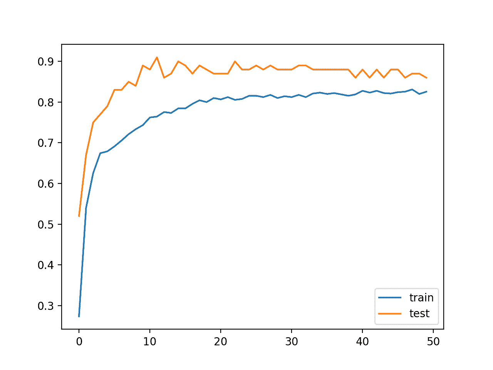
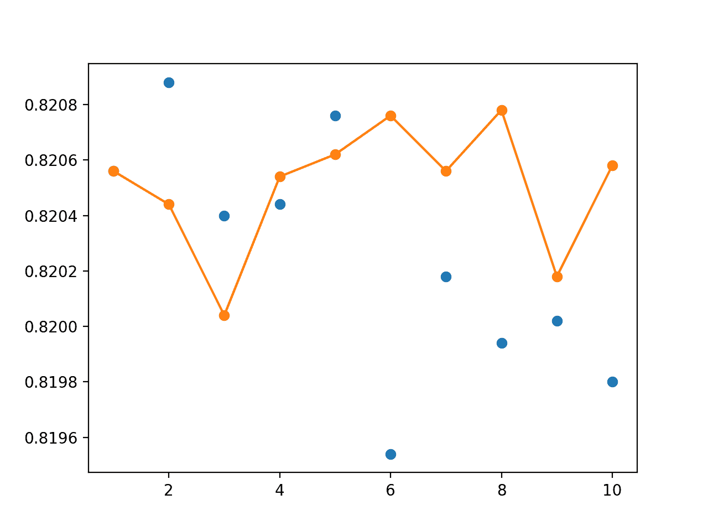

# 如何在 Keras 中创建深度学习模型的装袋集成

> 原文：<https://machinelearningmastery.com/how-to-create-a-random-split-cross-validation-and-bagging-ensemble-for-deep-learning-in-keras/>

最后更新于 2020 年 8 月 25 日

集成学习是组合来自多个模型的预测的方法。

在[集成学习](https://machinelearningmastery.com/ensemble-methods-for-deep-learning-neural-networks/)中，重要的是组成集成的模型是好的，从而产生不同的预测误差。在不同方面都很好的预测可以产生比任何单个成员模型的预测更稳定且通常更好的预测。

实现模型之间差异的一种方法是在可用训练数据的不同子集上训练每个模型。通过使用重采样方法，例如交叉验证和自举，在训练数据的不同子集上自然地训练模型，该重采样方法被设计来估计模型在通常看不见的数据上的平均表现。在该估计过程中使用的模型可以被组合在所谓的基于重采样的集成中，例如交叉验证集成或自举聚合(或装袋)集成。

在本教程中，您将发现如何为深度学习神经网络模型开发一套不同的基于重采样的集成。

完成本教程后，您将知道:

*   如何使用随机拆分来评估模型表现，并根据模型开发一个集成。
*   如何使用 10 倍交叉验证来评估表现，并开发交叉验证集成。
*   如何使用 bootstrap 估计表现，并使用 bagging 集成组合模型。

**用我的新书[更好的深度学习](https://machinelearningmastery.com/better-deep-learning/)启动你的项目**，包括*分步教程*和所有示例的 *Python 源代码*文件。

我们开始吧。

*   **2019 年 10 月更新**:针对 Keras 2.3 和 TensorFlow 2.0 更新。
*   **2020 年 1 月更新**:针对 Sklearn v0.22 API 的变化进行了更新。


如何在 Keras 创建用于深度学习的随机拆分、交叉验证和装袋集成
吉安·卢卡·庞蒂摄，版权所有。

## 教程概述

本教程分为六个部分；它们是:

1.  数据重采样集合
2.  多类分类问题
3.  单层多层感知器模型
4.  随机拆分集合
5.  交叉验证一起
6.  装袋集成团

## 数据重采样集合

组合来自多个模型的预测可以产生更稳定的预测，并且在某些情况下，预测具有比任何贡献模型更好的表现。

有效的集成需要意见不同的成员。每个成员都必须有技能(例如，表现比随机机会更好)，但理想情况下，在不同的方面表现良好。从技术上讲，我们可以说，我们更喜欢集成成员的预测具有低相关性，或者预测误差。

鼓励集成之间差异的一种方法是在不同的训练数据集上使用相同的学习算法。这可以通过重复对训练数据集进行重采样来实现，该数据集又用于训练新模型。使用训练数据上稍微不同的视角来拟合多个模型，并且反过来，当组合时，产生不同的误差并且通常更稳定和更好的预测。

我们可以将这些方法统称为数据重采样集合。

这种方法的一个好处是，可以使用不利用训练数据集中所有示例的重采样方法。任何未用于拟合模型的示例都可以用作测试数据集，以估计所选模型配置的泛化误差。

我们可以使用三种流行的重采样方法来创建重采样集合；它们是:

*   **随机拆分**。数据集被重复采样，数据被随机分成训练集和测试集。
*   **k 倍交叉验证**。数据集被分割成 k 个大小相等的折叠，k 个模型被训练，每个折叠都有机会被用作保持集，其中模型在所有剩余的折叠上被训练。
*   **引导聚合**。随机样本通过替换收集，给定样本中未包含的样本用作测试集。

也许最广泛使用的重采样集成方法是[自举聚合](https://machinelearningmastery.com/implement-bagging-scratch-python/)，更通常被称为装袋。带有替换的重采样允许训练数据集中有更多的差异，从而偏置模型，进而导致所得模型的预测之间有更多的差异。

重新采样集成模型会对您的项目做出一些特定的假设:

*   需要对未知数据的模型表现进行稳健估计；如果没有，则可以使用单个训练/测试分割。
*   使用模型集合有可能提升表现；如果没有，则可以使用适合所有可用数据的单一模型。
*   在训练数据集的样本上拟合一个以上的神经网络模型的计算成本并不令人望而却步；如果没有，所有的资源都应该放在一个模型上。

神经网络模型非常灵活，因此由重采样集成提供的表现提升并不总是可能的，因为基于所有可用数据训练的单个模型可以表现得很好。

因此，使用重采样集合的最佳点是这样的情况，其中需要表现的稳健估计，并且可以拟合多个模型来计算该估计，但是还需要在表现估计期间创建的一个(或多个)模型用作最终模型(例如，新的最终模型不能拟合所有可用的训练数据)。

现在我们已经熟悉了重采样集成方法，我们可以通过一个依次应用每种方法的示例来进行工作。

## 多类分类问题

我们将使用一个小的多类分类问题作为基础来演示模型重采样集成。

Sklearn 类提供了 [make_blobs()函数](http://Sklearn.org/stable/modules/generated/sklearn.datasets.make_blobs.html)，该函数可用于创建具有规定数量的样本、输入变量、类和类内样本方差的多类分类问题。

我们用 1000 个例子来说明这个问题，输入变量(代表点的 x 和 y 坐标)和每个组内点的标准偏差为 2.0。我们将使用相同的随机状态(用于[伪随机数发生器](https://machinelearningmastery.com/how-to-generate-random-numbers-in-python/)的种子)来确保我们总是获得相同的 1000 分。

```py
# generate 2d classification dataset
X, y = make_blobs(n_samples=1000, centers=3, n_features=2, cluster_std=2, random_state=2)
```

结果是我们可以建模的数据集的输入和输出元素。

为了了解问题的复杂性，我们可以在二维散点图上绘制每个点，并按类值给每个点着色。

下面列出了完整的示例。

```py
# scatter plot of blobs dataset
from sklearn.datasets import make_blobs
from matplotlib import pyplot
from pandas import DataFrame
# generate 2d classification dataset
X, y = make_blobs(n_samples=1000, centers=3, n_features=2, cluster_std=2, random_state=2)
# scatter plot, dots colored by class value
df = DataFrame(dict(x=X[:,0], y=X[:,1], label=y))
colors = {0:'red', 1:'blue', 2:'green'}
fig, ax = pyplot.subplots()
grouped = df.groupby('label')
for key, group in grouped:
    group.plot(ax=ax, kind='scatter', x='x', y='y', label=key, color=colors[key])
pyplot.show()
```

运行该示例会创建整个数据集的散点图。我们可以看到，2.0 的标准偏差意味着类不是线性可分的(用一条线可分的)，导致了很多不明确的点。

这是可取的，因为这意味着问题不是微不足道的，并且将允许神经网络模型找到许多不同的“T0”足够好的“T1”候选解，从而导致高方差。


具有三个类和按类值着色的点的斑点数据集的散点图

## 单层多层感知器模型

我们将定义一个多层感知器神经网络，或 MLP，它学习问题相当好。

该问题是一个多类分类问题，我们将在输出层使用 softmax 激活函数对其进行建模。这意味着该模型将以样本属于 3 类中每一类的概率来预测具有 3 个元素的向量。因此，第一步是[对类值进行一次热编码](https://machinelearningmastery.com/why-one-hot-encode-data-in-machine-learning/)。

```py
y = to_categorical(y)
```

接下来，我们必须将数据集分成训练集和测试集。我们将使用测试集来评估模型的表现，并使用学习曲线绘制训练期间的表现。我们将使用 90%的数据进行训练，10%用于测试集。

我们选择大分割是因为这是一个有噪声的问题，表现良好的模型需要尽可能多的数据来学习复杂的分类函数。

```py
# split into train and test
n_train = int(0.9 * X.shape[0])
trainX, testX = X[:n_train, :], X[n_train:, :]
trainy, testy = y[:n_train], y[n_train:]
```

接下来，我们可以定义并组合模型。

该模型将预期具有两个输入变量的样本。然后，该模型有一个具有 50 个节点的单个隐藏层和一个校正的线性激活函数，然后有一个具有 3 个节点的输出层来预测 3 个类中每个类的概率，以及一个 softmax 激活函数。

由于问题是多类的，我们将使用分类交叉熵损失函数来优化模型和随机梯度下降的有效[亚当味](https://machinelearningmastery.com/adam-optimization-algorithm-for-deep-learning/)。

```py
# define model
model = Sequential()
model.add(Dense(50, input_dim=2, activation='relu'))
model.add(Dense(3, activation='softmax'))
model.compile(loss='categorical_crossentropy', optimizer='adam', metrics=['accuracy'])
```

该模型适合 50 个训练时期，我们将在测试集上评估每个时期的模型，使用测试集作为验证集。

```py
# fit model
history = model.fit(trainX, trainy, validation_data=(testX, testy), epochs=50, verbose=0)
```

在运行结束时，我们将评估模型在列车和测试集上的表现。

```py
# evaluate the model
_, train_acc = model.evaluate(trainX, trainy, verbose=0)
_, test_acc = model.evaluate(testX, testy, verbose=0)
print('Train: %.3f, Test: %.3f' % (train_acc, test_acc))
```

最后，我们将在训练和测试数据集上绘制每个训练时期的模型准确率的学习曲线。

```py
# plot history
pyplot.plot(history.history['accuracy'], label='train')
pyplot.plot(history.history['val_accuracy'], label='test')
pyplot.legend()
pyplot.show()
```

下面列出了完整的示例。

```py
# develop an mlp for blobs dataset
from sklearn.datasets import make_blobs
from keras.utils import to_categorical
from keras.models import Sequential
from keras.layers import Dense
from matplotlib import pyplot
# generate 2d classification dataset
X, y = make_blobs(n_samples=1000, centers=3, n_features=2, cluster_std=2, random_state=2)
# one hot encode output variable
y = to_categorical(y)
# split into train and test
n_train = int(0.9 * X.shape[0])
trainX, testX = X[:n_train, :], X[n_train:, :]
trainy, testy = y[:n_train], y[n_train:]
# define model
model = Sequential()
model.add(Dense(50, input_dim=2, activation='relu'))
model.add(Dense(3, activation='softmax'))
model.compile(loss='categorical_crossentropy', optimizer='adam', metrics=['accuracy'])
# fit model
history = model.fit(trainX, trainy, validation_data=(testX, testy), epochs=50, verbose=0)
# evaluate the model
_, train_acc = model.evaluate(trainX, trainy, verbose=0)
_, test_acc = model.evaluate(testX, testy, verbose=0)
print('Train: %.3f, Test: %.3f' % (train_acc, test_acc))
# learning curves of model accuracy
pyplot.plot(history.history['accuracy'], label='train')
pyplot.plot(history.history['val_accuracy'], label='test')
pyplot.legend()
pyplot.show()
```

运行该示例首先打印最终模型在列车和测试数据集上的表现。

**注**:考虑到算法或评估程序的随机性，或数值准确率的差异，您的[结果可能会有所不同](https://machinelearningmastery.com/different-results-each-time-in-machine-learning/)。考虑运行该示例几次，并比较平均结果。

在这种情况下，我们可以看到模型在训练数据集上达到了大约 83%的准确率，在测试数据集上达到了大约 86%的准确率。

选择将数据集分成训练集和测试集意味着测试集很小，不能代表更广泛的问题。反过来，测试集上的表现不代表模型；在这种情况下，它是乐观的偏见。

```py
Train: 0.830, Test: 0.860
```

还创建了一个线图，显示了在每个训练周期内，训练和测试集上模型准确率的学习曲线。

我们可以看到模型有一个相当稳定的拟合。



每个训练时期训练和测试数据集上模型准确率的线图学习曲线

## 随机拆分集合

模型的不稳定性和小的测试数据集意味着我们不知道这个模型在新数据上的表现。

我们可以尝试一种简单的重采样方法，在训练集和测试集中重复生成新的数据集随机分割，并拟合新的模型。计算模型在每个分割中的平均表现将给出模型泛化误差的更好估计。

然后，我们可以组合在随机分裂上训练的多个模型，期望集成的表现可能比平均单个模型更稳定和更好。

我们将从问题域生成 10 倍多的样本点，并将它们作为一个看不见的数据集保留下来。在这个大得多的数据集上对模型的评估将被用作这个问题的模型的泛化误差的代理或更精确的估计。

这个额外的数据集不是测试数据集。从技术上讲，这是为了演示的目的，但我们假装在模型训练时无法获得这些数据。

```py
# generate 2d classification dataset
dataX, datay = make_blobs(n_samples=55000, centers=3, n_features=2, cluster_std=2, random_state=2)
X, newX = dataX[:5000, :], dataX[5000:, :]
y, newy = datay[:5000], datay[5000:]
```

所以现在我们有 5000 个例子来训练我们的模型并估计它的一般表现。我们还有 50，000 个例子，可以用来更好地逼近单个模型或集合的真实总体表现。

接下来，我们需要一个函数来拟合和评估训练数据集上的单个模型，并返回拟合模型在测试数据集上的表现。我们还需要合适的模型，这样我们就可以把它作为一个整体的一部分。下面的 evaluate_model()函数实现了这种行为。

```py
# evaluate a single mlp model
def evaluate_model(trainX, trainy, testX, testy):
	# encode targets
	trainy_enc = to_categorical(trainy)
	testy_enc = to_categorical(testy)
	# define model
	model = Sequential()
	model.add(Dense(50, input_dim=2, activation='relu'))
	model.add(Dense(3, activation='softmax'))
	model.compile(loss='categorical_crossentropy', optimizer='adam', metrics=['accuracy'])
	# fit model
	model.fit(trainX, trainy_enc, epochs=50, verbose=0)
	# evaluate the model
	_, test_acc = model.evaluate(testX, testy_enc, verbose=0)
	return model, test_acc
```

接下来，我们可以创建训练数据集的随机分割，并在每个分割上拟合和评估模型。

我们可以使用 Sklearn 库中的 [train_test_split()函数](http://Sklearn.org/stable/modules/generated/sklearn.model_selection.train_test_split.html)将数据集随机分割成训练集和测试集。它以 X 和 y 数组作为参数，并且“ *test_size* ”以百分比的形式指定测试数据集的大小。我们将使用 5000 个例子中的 10%作为测试。

然后，我们可以调用 evaluate_model()来拟合和评估模型。然后可以将返回的准确率和模型添加到列表中供以后使用。

在本例中，我们将限制拆分的数量，并依次将拟合模型的数量限制为 10 个。

```py
# multiple train-test splits
n_splits = 10
scores, members = list(), list()
for _ in range(n_splits):
	# split data
	trainX, testX, trainy, testy = train_test_split(X, y, test_size=0.10)
	# evaluate model
	model, test_acc = evaluate_model(trainX, trainy, testX, testy)
	print('>%.3f' % test_acc)
	scores.append(test_acc)
	members.append(model)
```

在拟合和评估模型之后，我们可以使用为域选择的配置来估计给定模型的预期表现。

```py
# summarize expected performance
print('Estimated Accuracy %.3f (%.3f)' % (mean(scores), std(scores)))
```

我们不知道有多少模型会在集合中有用。很可能会有一个收益递减点，在此之后，更多成员的加入不再改变集成的表现。

然而，我们可以评估从 1 到 10 的不同集合大小，并在看不见的保持数据集上绘制它们的表现。

我们还可以评估保持数据集上的每个模型，并计算这些分数的平均值，以更好地近似所选模型在预测问题上的真实表现。

```py
# evaluate different numbers of ensembles on hold out set
single_scores, ensemble_scores = list(), list()
for i in range(1, n_splits+1):
	ensemble_score = evaluate_n_members(members, i, newX, newy)
	newy_enc = to_categorical(newy)
	_, single_score = members[i-1].evaluate(newX, newy_enc, verbose=0)
	print('> %d: single=%.3f, ensemble=%.3f' % (i, single_score, ensemble_score))
	ensemble_scores.append(ensemble_score)
	single_scores.append(single_score)
```

最后，我们可以比较和计算平均模型在预测问题上的总体表现的更稳健的估计，然后在保持数据集上绘制集成大小对准确率的表现。

```py
# plot score vs number of ensemble members
print('Accuracy %.3f (%.3f)' % (mean(single_scores), std(single_scores)))
x_axis = [i for i in range(1, n_splits+1)]
pyplot.plot(x_axis, single_scores, marker='o', linestyle='None')
pyplot.plot(x_axis, ensemble_scores, marker='o')
pyplot.show()
```

将所有这些结合在一起，下面列出了完整的示例。

```py
# random-splits mlp ensemble on blobs dataset
from sklearn.datasets import make_blobs
from sklearn.model_selection import train_test_split
from sklearn.metrics import accuracy_score
from keras.utils import to_categorical
from keras.models import Sequential
from keras.layers import Dense
from matplotlib import pyplot
from numpy import mean
from numpy import std
import numpy
from numpy import array
from numpy import argmax

# evaluate a single mlp model
def evaluate_model(trainX, trainy, testX, testy):
	# encode targets
	trainy_enc = to_categorical(trainy)
	testy_enc = to_categorical(testy)
	# define model
	model = Sequential()
	model.add(Dense(50, input_dim=2, activation='relu'))
	model.add(Dense(3, activation='softmax'))
	model.compile(loss='categorical_crossentropy', optimizer='adam', metrics=['accuracy'])
	# fit model
	model.fit(trainX, trainy_enc, epochs=50, verbose=0)
	# evaluate the model
	_, test_acc = model.evaluate(testX, testy_enc, verbose=0)
	return model, test_acc

# make an ensemble prediction for multi-class classification
def ensemble_predictions(members, testX):
	# make predictions
	yhats = [model.predict(testX) for model in members]
	yhats = array(yhats)
	# sum across ensemble members
	summed = numpy.sum(yhats, axis=0)
	# argmax across classes
	result = argmax(summed, axis=1)
	return result

# evaluate a specific number of members in an ensemble
def evaluate_n_members(members, n_members, testX, testy):
	# select a subset of members
	subset = members[:n_members]
	# make prediction
	yhat = ensemble_predictions(subset, testX)
	# calculate accuracy
	return accuracy_score(testy, yhat)

# generate 2d classification dataset
dataX, datay = make_blobs(n_samples=55000, centers=3, n_features=2, cluster_std=2, random_state=2)
X, newX = dataX[:5000, :], dataX[5000:, :]
y, newy = datay[:5000], datay[5000:]
# multiple train-test splits
n_splits = 10
scores, members = list(), list()
for _ in range(n_splits):
	# split data
	trainX, testX, trainy, testy = train_test_split(X, y, test_size=0.10)
	# evaluate model
	model, test_acc = evaluate_model(trainX, trainy, testX, testy)
	print('>%.3f' % test_acc)
	scores.append(test_acc)
	members.append(model)
# summarize expected performance
print('Estimated Accuracy %.3f (%.3f)' % (mean(scores), std(scores)))
# evaluate different numbers of ensembles on hold out set
single_scores, ensemble_scores = list(), list()
for i in range(1, n_splits+1):
	ensemble_score = evaluate_n_members(members, i, newX, newy)
	newy_enc = to_categorical(newy)
	_, single_score = members[i-1].evaluate(newX, newy_enc, verbose=0)
	print('> %d: single=%.3f, ensemble=%.3f' % (i, single_score, ensemble_score))
	ensemble_scores.append(ensemble_score)
	single_scores.append(single_score)
# plot score vs number of ensemble members
print('Accuracy %.3f (%.3f)' % (mean(single_scores), std(single_scores)))
x_axis = [i for i in range(1, n_splits+1)]
pyplot.plot(x_axis, single_scores, marker='o', linestyle='None')
pyplot.plot(x_axis, ensemble_scores, marker='o')
pyplot.show()
```

运行该示例首先在 10 个不同的数据集随机分割成训练集和测试集上拟合和评估 10 个模型。

根据这些分数，我们估计数据集上的平均模型拟合将达到约 83%的准确率，标准偏差约为 1.9%。

```py
>0.816
>0.836
>0.818
>0.806
>0.814
>0.824
>0.830
>0.848
>0.868
>0.858
Estimated Accuracy 0.832 (0.019)
```

然后，我们在未看到的数据集上评估每个模型的表现，以及从 1 到 10 个模型的模型集合的表现。

**注**:考虑到算法或评估程序的随机性，或数值准确率的差异，您的[结果可能会有所不同](https://machinelearningmastery.com/different-results-each-time-in-machine-learning/)。考虑运行该示例几次，并比较平均结果。

从这些分数中，我们可以看出，平均模型在这个问题上的表现的更准确估计约为 82%，并且估计的表现是乐观的。

```py
> 1: single=0.821, ensemble=0.821
> 2: single=0.821, ensemble=0.820
> 3: single=0.820, ensemble=0.820
> 4: single=0.820, ensemble=0.821
> 5: single=0.821, ensemble=0.821
> 6: single=0.820, ensemble=0.821
> 7: single=0.820, ensemble=0.821
> 8: single=0.820, ensemble=0.821
> 9: single=0.820, ensemble=0.820
> 10: single=0.820, ensemble=0.821
Accuracy 0.820 (0.000)
```

准确度分数之间的很大差异是以百分比的分数出现的。

创建了一个图表，将未看到的保持数据集上每个单独模型的准确率显示为蓝点，将给定数量的成员(从 1 到 10)的集合的表现显示为橙色线和点。

我们可以看到，至少在这种情况下，使用 4 到 8 个成员的集合会产生比大多数单独运行更好的准确率(橙色线在许多蓝点上方)。



显示随机分割重采样的单一模型准确率(蓝点)与不同大小集合准确率的线图

该图确实显示了一些单个模型可以比一组模型表现得更好(橙色线上方的蓝点)，但是我们无法选择这些模型。这里，我们证明了在没有额外数据(例如，样本外数据集)的情况下，4 到 8 个成员的集合将比随机选择的训练测试模型给出更好的平均表现。

更多的重复(例如 30 或 100)可以导致更稳定的集成表现。

## 交叉验证一起

作为估计模型平均表现的重采样方法，重复随机分割的一个问题是它是乐观的。

一种被设计得不太乐观并因此被广泛使用的方法是 [k 倍交叉验证法](https://machinelearningmastery.com/k-fold-cross-validation/)。

该方法偏差较小，因为数据集中的每个示例在测试数据集中仅使用一次来估计模型表现，这与随机训练测试分割不同，在随机训练测试分割中，给定的示例可能被多次用于评估模型。

该过程有一个名为 k 的参数，它表示给定数据样本要分成的组数。每个模型得分的平均值提供了对模型表现的偏差较小的估计。k 的典型值是 10。

因为神经网络模型的训练在计算上非常昂贵，所以通常在交叉验证期间使用表现最好的模型作为最终模型。

或者，来自交叉验证过程的结果模型可以被组合以提供交叉验证集合，该集合可能比给定的单个模型平均具有更好的表现。

我们可以使用 scikit 中的 [KFold 类](http://Sklearn.org/stable/modules/generated/sklearn.model_selection.KFold.html)-学会将数据集拆分成 k 个折叠。它将拆分的次数、是否对样本进行混洗以及混洗前使用的伪随机数发生器的种子作为参数。

```py
# prepare the k-fold cross-validation configuration
n_folds = 10
kfold = KFold(n_folds, True, 1)
```

一旦类被实例化，它就可以被枚举，以将索引的每个分割部分放入训练集和测试集的数据集中。

```py
# cross validation estimation of performance
scores, members = list(), list()
for train_ix, test_ix in kfold.split(X):
	# select samples
	trainX, trainy = X[train_ix], y[train_ix]
	testX, testy = X[test_ix], y[test_ix]
	# evaluate model
	model, test_acc = evaluate_model(trainX, trainy, testX, testy)
	print('>%.3f' % test_acc)
	scores.append(test_acc)
	members.append(model)
```

一旦计算出每个折叠的得分，得分的平均值就可以用来报告该方法的预期表现。

```py
# summarize expected performance
print('Estimated Accuracy %.3f (%.3f)' % (mean(scores), std(scores)))
```

现在我们已经收集了在 10 个折叠上评估的 10 个模型，我们可以使用它们来创建一个交叉验证集合。在集成中使用所有 10 个模型似乎是直观的，然而，我们可以像上一节一样，从 1 到 10 个成员来评估集成的每个子集的准确性。

下面列出了分析交叉验证集成的完整示例。

```py
# cross-validation mlp ensemble on blobs dataset
from sklearn.datasets import make_blobs
from sklearn.model_selection import KFold
from sklearn.metrics import accuracy_score
from keras.utils import to_categorical
from keras.models import Sequential
from keras.layers import Dense
from matplotlib import pyplot
from numpy import mean
from numpy import std
import numpy
from numpy import array
from numpy import argmax

# evaluate a single mlp model
def evaluate_model(trainX, trainy, testX, testy):
	# encode targets
	trainy_enc = to_categorical(trainy)
	testy_enc = to_categorical(testy)
	# define model
	model = Sequential()
	model.add(Dense(50, input_dim=2, activation='relu'))
	model.add(Dense(3, activation='softmax'))
	model.compile(loss='categorical_crossentropy', optimizer='adam', metrics=['accuracy'])
	# fit model
	model.fit(trainX, trainy_enc, epochs=50, verbose=0)
	# evaluate the model
	_, test_acc = model.evaluate(testX, testy_enc, verbose=0)
	return model, test_acc

# make an ensemble prediction for multi-class classification
def ensemble_predictions(members, testX):
	# make predictions
	yhats = [model.predict(testX) for model in members]
	yhats = array(yhats)
	# sum across ensemble members
	summed = numpy.sum(yhats, axis=0)
	# argmax across classes
	result = argmax(summed, axis=1)
	return result

# evaluate a specific number of members in an ensemble
def evaluate_n_members(members, n_members, testX, testy):
	# select a subset of members
	subset = members[:n_members]
	# make prediction
	yhat = ensemble_predictions(subset, testX)
	# calculate accuracy
	return accuracy_score(testy, yhat)

# generate 2d classification dataset
dataX, datay = make_blobs(n_samples=55000, centers=3, n_features=2, cluster_std=2, random_state=2)
X, newX = dataX[:5000, :], dataX[5000:, :]
y, newy = datay[:5000], datay[5000:]
# prepare the k-fold cross-validation configuration
n_folds = 10
kfold = KFold(n_folds, True, 1)
# cross validation estimation of performance
scores, members = list(), list()
for train_ix, test_ix in kfold.split(X):
	# select samples
	trainX, trainy = X[train_ix], y[train_ix]
	testX, testy = X[test_ix], y[test_ix]
	# evaluate model
	model, test_acc = evaluate_model(trainX, trainy, testX, testy)
	print('>%.3f' % test_acc)
	scores.append(test_acc)
	members.append(model)
# summarize expected performance
print('Estimated Accuracy %.3f (%.3f)' % (mean(scores), std(scores)))
# evaluate different numbers of ensembles on hold out set
single_scores, ensemble_scores = list(), list()
for i in range(1, n_folds+1):
	ensemble_score = evaluate_n_members(members, i, newX, newy)
	newy_enc = to_categorical(newy)
	_, single_score = members[i-1].evaluate(newX, newy_enc, verbose=0)
	print('> %d: single=%.3f, ensemble=%.3f' % (i, single_score, ensemble_score))
	ensemble_scores.append(ensemble_score)
	single_scores.append(single_score)
# plot score vs number of ensemble members
print('Accuracy %.3f (%.3f)' % (mean(single_scores), std(single_scores)))
x_axis = [i for i in range(1, n_folds+1)]
pyplot.plot(x_axis, single_scores, marker='o', linestyle='None')
pyplot.plot(x_axis, ensemble_scores, marker='o')
pyplot.show()
```

运行该示例首先打印 10 个模型在交叉验证的每个折叠上的表现。

**注**:考虑到算法或评估程序的随机性，或数值准确率的差异，您的[结果可能会有所不同](https://machinelearningmastery.com/different-results-each-time-in-machine-learning/)。考虑运行该示例几次，并比较平均结果。

据报道，这些模型的平均表现约为 82%，这似乎不如前一节中使用的随机拆分方法乐观。

```py
>0.834
>0.870
>0.818
>0.806
>0.836
>0.804
>0.820
>0.830
>0.828
>0.822
Estimated Accuracy 0.827 (0.018)
```

接下来，在看不见的保持集上评估每个保存的模型。

这些分数的平均值也约为 82%，这突出表明，至少在这种情况下，对模型总体表现的交叉验证估计是合理的。

```py
> 1: single=0.819, ensemble=0.819
> 2: single=0.820, ensemble=0.820
> 3: single=0.820, ensemble=0.820
> 4: single=0.821, ensemble=0.821
> 5: single=0.820, ensemble=0.821
> 6: single=0.821, ensemble=0.821
> 7: single=0.820, ensemble=0.820
> 8: single=0.819, ensemble=0.821
> 9: single=0.820, ensemble=0.821
> 10: single=0.820, ensemble=0.821
Accuracy 0.820 (0.001)
```

创建单个模型准确率(蓝点)和集合大小与准确率(橙色线)的关系图。

与前面的示例一样，模型表现之间的真正差异在于模型准确率的几分之一。

橙色线表明，随着成员数量的增加，集合的准确性会增加到收益递减的程度。

我们可以看到，至少在这种情况下，在一个集成中使用四个或更多的模型进行交叉验证比几乎所有的单个模型都具有更好的表现。

我们还可以看到，使用集合中所有模型的默认策略将是有效的。


显示交叉验证重采样的单一模型准确率(蓝点)与不同大小集合准确率的线图

## 装袋集成

从集成学习的角度来看，随机分裂和 k-fold 交叉验证的一个限制是模型非常相似。

[自举法](https://machinelearningmastery.com/a-gentle-introduction-to-the-bootstrap-method/)是一种统计技术，用于通过对多个小数据样本的估计进行平均来估计一个群体的数量。

重要的是，样本是通过一次从一个大的数据样本中提取观察值，并在选择后将其返回给数据样本来构建的。这使得一个给定的观察可以不止一次地包含在一个给定的小样本中。这种采样方法称为替换采样。

该方法可用于估计神经网络模型的表现。给定样本中未选择的示例可以用作测试集来估计模型的表现。

自举是一种用于估计模型表现的稳健方法。它确实受到乐观偏见的影响，但在实践中通常几乎和 k 倍交叉验证一样准确。

集成学习的好处是，每个模型的每个数据样本都有偏差，允许给定的示例在样本中出现多次。反过来，这意味着在这些样本上训练的模型会有偏差，重要的是方式不同。结果可能是更准确的集合预测。

通常，在集成学习中使用自举方法被称为[自举聚合或装袋](https://machinelearningmastery.com/implement-bagging-scratch-python/)。

我们可以使用 scikit 的[重采样()功能](http://Sklearn.org/stable/modules/generated/sklearn.utils.resample.html)-学习选择一个有替换的子样本。该函数采用一个数组进行二次采样，再采样的大小作为参数。我们将在行索引中执行选择，我们可以依次使用行索引来选择 *X* 和 *y* 数组中的行。

样本的大小将为 4，500，即 90%的数据，尽管在使用重采样的情况下，测试集可能大于 10%，但可能有 500 多个示例未被选择。

```py
# multiple train-test splits
n_splits = 10
scores, members = list(), list()
for _ in range(n_splits):
	# select indexes
	ix = [i for i in range(len(X))]
	train_ix = resample(ix, replace=True, n_samples=4500)
	test_ix = [x for x in ix if x not in train_ix]
	# select data
	trainX, trainy = X[train_ix], y[train_ix]
	testX, testy = X[test_ix], y[test_ix]
	# evaluate model
	model, test_acc = evaluate_model(trainX, trainy, testX, testy)
	print('>%.3f' % test_acc)
	scores.append(test_acc)
	members.append(model)
```

当使用 bagging 集成学习策略时，通常使用简单的 overfit 模型，如未运行的决策树。

过度约束和过度训练的神经网络可以获得更好的表现。然而，在这个例子中，我们将使用前面章节中相同的 MLP。

此外，通常在装袋中继续添加集成成员，直到集成表现稳定下来，因为装袋不会过度填充数据集。我们将再次像前面的例子一样将成员人数限制在 10 人。

下面列出了使用多层感知器评估模型表现和集成学习的自举聚合的完整示例。

```py
# bagging mlp ensemble on blobs dataset
from sklearn.datasets import make_blobs
from sklearn.utils import resample
from sklearn.metrics import accuracy_score
from keras.utils import to_categorical
from keras.models import Sequential
from keras.layers import Dense
from matplotlib import pyplot
from numpy import mean
from numpy import std
import numpy
from numpy import array
from numpy import argmax

# evaluate a single mlp model
def evaluate_model(trainX, trainy, testX, testy):
	# encode targets
	trainy_enc = to_categorical(trainy)
	testy_enc = to_categorical(testy)
	# define model
	model = Sequential()
	model.add(Dense(50, input_dim=2, activation='relu'))
	model.add(Dense(3, activation='softmax'))
	model.compile(loss='categorical_crossentropy', optimizer='adam', metrics=['accuracy'])
	# fit model
	model.fit(trainX, trainy_enc, epochs=50, verbose=0)
	# evaluate the model
	_, test_acc = model.evaluate(testX, testy_enc, verbose=0)
	return model, test_acc

# make an ensemble prediction for multi-class classification
def ensemble_predictions(members, testX):
	# make predictions
	yhats = [model.predict(testX) for model in members]
	yhats = array(yhats)
	# sum across ensemble members
	summed = numpy.sum(yhats, axis=0)
	# argmax across classes
	result = argmax(summed, axis=1)
	return result

# evaluate a specific number of members in an ensemble
def evaluate_n_members(members, n_members, testX, testy):
	# select a subset of members
	subset = members[:n_members]
	# make prediction
	yhat = ensemble_predictions(subset, testX)
	# calculate accuracy
	return accuracy_score(testy, yhat)

# generate 2d classification dataset
dataX, datay = make_blobs(n_samples=55000, centers=3, n_features=2, cluster_std=2, random_state=2)
X, newX = dataX[:5000, :], dataX[5000:, :]
y, newy = datay[:5000], datay[5000:]
# multiple train-test splits
n_splits = 10
scores, members = list(), list()
for _ in range(n_splits):
	# select indexes
	ix = [i for i in range(len(X))]
	train_ix = resample(ix, replace=True, n_samples=4500)
	test_ix = [x for x in ix if x not in train_ix]
	# select data
	trainX, trainy = X[train_ix], y[train_ix]
	testX, testy = X[test_ix], y[test_ix]
	# evaluate model
	model, test_acc = evaluate_model(trainX, trainy, testX, testy)
	print('>%.3f' % test_acc)
	scores.append(test_acc)
	members.append(model)
# summarize expected performance
print('Estimated Accuracy %.3f (%.3f)' % (mean(scores), std(scores)))
# evaluate different numbers of ensembles on hold out set
single_scores, ensemble_scores = list(), list()
for i in range(1, n_splits+1):
	ensemble_score = evaluate_n_members(members, i, newX, newy)
	newy_enc = to_categorical(newy)
	_, single_score = members[i-1].evaluate(newX, newy_enc, verbose=0)
	print('> %d: single=%.3f, ensemble=%.3f' % (i, single_score, ensemble_score))
	ensemble_scores.append(ensemble_score)
	single_scores.append(single_score)
# plot score vs number of ensemble members
print('Accuracy %.3f (%.3f)' % (mean(single_scores), std(single_scores)))
x_axis = [i for i in range(1, n_splits+1)]
pyplot.plot(x_axis, single_scores, marker='o', linestyle='None')
pyplot.plot(x_axis, ensemble_scores, marker='o')
pyplot.show()
```

运行该示例将打印每个引导示例的未使用示例的模型表现。

**注**:考虑到算法或评估程序的随机性，或数值准确率的差异，您的[结果可能会有所不同](https://machinelearningmastery.com/different-results-each-time-in-machine-learning/)。考虑运行该示例几次，并比较平均结果。

我们可以看到，在这种情况下，模型的预期表现不如随机训练测试分割乐观，可能与 k 倍交叉验证的发现非常相似。

```py
>0.829
>0.820
>0.830
>0.821
>0.831
>0.820
>0.834
>0.815
>0.829
>0.827
Estimated Accuracy 0.825 (0.006)
```

也许是由于引导采样过程，我们看到每个模型的实际表现在更大的看不见的保持数据集上稍差一些。

考虑到用自举代替采样引入的偏差，这是可以预期的。

```py
> 1: single=0.819, ensemble=0.819
> 2: single=0.818, ensemble=0.820
> 3: single=0.820, ensemble=0.820
> 4: single=0.818, ensemble=0.821
> 5: single=0.819, ensemble=0.820
> 6: single=0.820, ensemble=0.820
> 7: single=0.820, ensemble=0.820
> 8: single=0.819, ensemble=0.820
> 9: single=0.820, ensemble=0.820
> 10: single=0.819, ensemble=0.820
Accuracy 0.819 (0.001)
```

创造的情节令人鼓舞。

我们看到，在大约四个成员之后，袋装集成在保持数据集上取得了比任何单个模型更好的表现。毫无疑问，鉴于个别车型的平均表现略低。


显示单个模型准确率(蓝点)与不同装袋尺寸的集成准确率的线图

## 扩展ˌ扩张

本节列出了一些您可能希望探索的扩展教程的想法。

*   **单车型**。将每个集合的表现与基于所有可用数据训练的一个模型进行比较。
*   **CV 集合大小**。为交叉验证集成试验更大和更小的集成大小，并比较它们的表现。
*   **装袋集合限额**。增加装袋团队的成员数量，找到收益递减点。

如果你探索这些扩展，我很想知道。

## 进一步阅读

如果您想更深入地了解这个主题，本节将提供更多资源。

### 邮件

*   [k 倍交叉验证的温和介绍](https://machinelearningmastery.com/k-fold-cross-validation/)
*   [引导法的简单介绍](https://machinelearningmastery.com/a-gentle-introduction-to-the-bootstrap-method/)
*   [如何用 Python 实现从零开始装袋](https://machinelearningmastery.com/implement-bagging-scratch-python/)

### 报纸

*   [神经网络集成、交叉验证和主动学习](http://papers.nips.cc/paper/1001-neural-network-ensembles-cross-validation-and-active-learning.pdf)，1995。

### 应用程序接口

*   [开始使用 Keras 顺序模型](https://keras.io/getting-started/sequential-model-guide/)
*   [硬核层 API](https://keras.io/layers/core/)
*   [scipy . stat . mode API](https://docs.scipy.org/doc/scipy/reference/generated/scipy.stats.mode.html)
*   num py . argmax API
*   [sklearn . dataset . make _ blobs API](http://Sklearn.org/stable/modules/generated/sklearn.datasets.make_blobs.html)
*   [sklearn . model _ selection . train _ test _ split API](http://Sklearn.org/stable/modules/generated/sklearn.model_selection.train_test_split.html)
*   [sklearn.model_selection。KFold 原料药](http://Sklearn.org/stable/modules/generated/sklearn.model_selection.KFold.html)
*   [硬化实用程序。重新压缩 API](http://Sklearn.org/stable/modules/generated/sklearn.utils.resample.html)

## 摘要

在本教程中，您发现了如何为深度学习神经网络模型开发一套不同的基于重采样的集成。

具体来说，您了解到:

*   如何使用随机拆分来评估模型表现，并根据模型开发一个集成。
*   如何使用 10 倍交叉验证来评估表现，并开发交叉验证集成。
*   如何使用 bootstrap 估计表现，并使用 bagging 集成组合模型。

你有什么问题吗？
在下面的评论中提问，我会尽力回答。