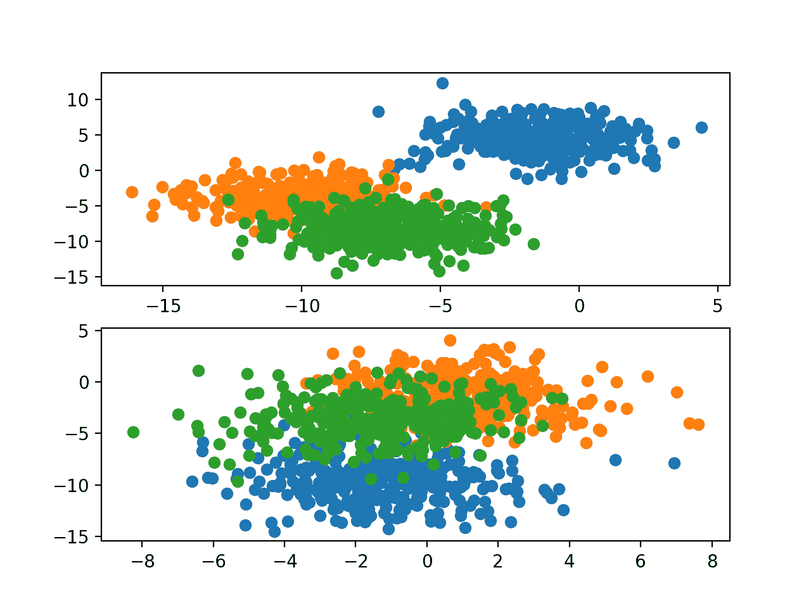
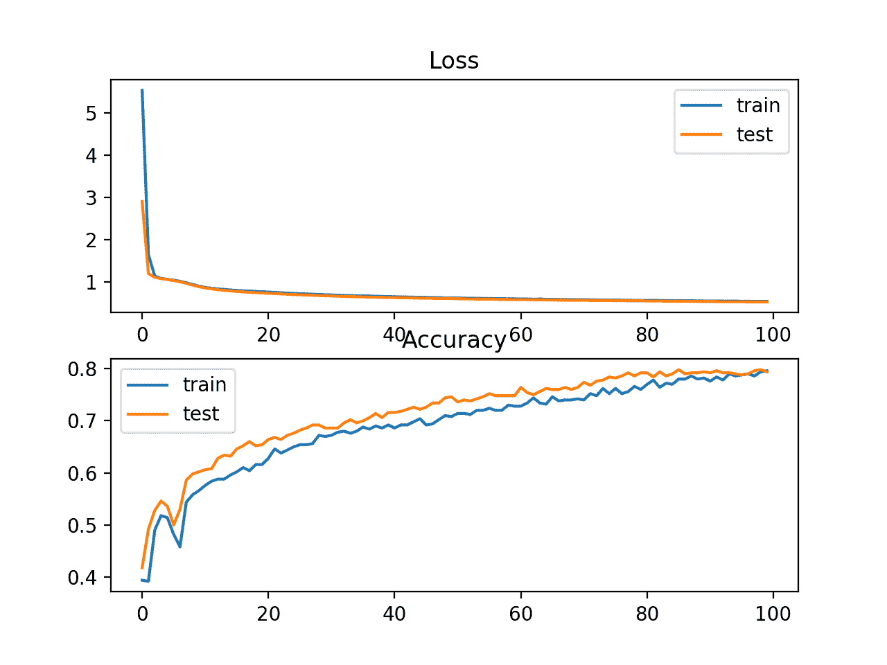
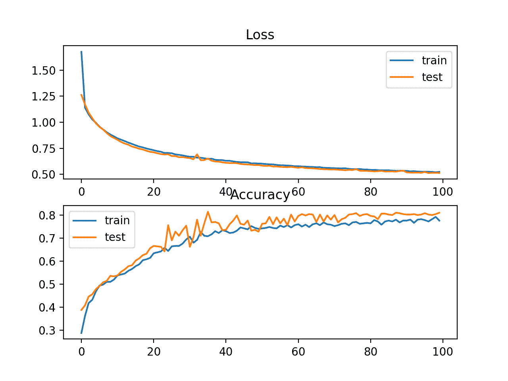
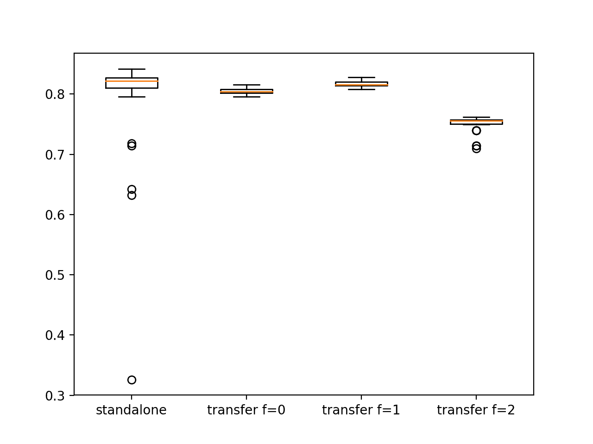

# 如何利用迁移学习来提高深度学习神经网络的表现

> 原文：<https://machinelearningmastery.com/how-to-improve-performance-with-transfer-learning-for-deep-learning-neural-networks/>

最后更新于 2020 年 8 月 25 日

深度学习神经网络的一个有趣的好处是，它们可以在相关问题上重用。

[迁移学习](https://machinelearningmastery.com/transfer-learning-for-deep-learning/)指的是一种针对不同但某种程度上相似的问题进行预测建模的技术，然后可以部分或全部重用该技术，以加速训练并提高模型在感兴趣问题上的表现。

在深度学习中，这意味着在新模型中重用预训练网络模型的一个或多个层中的权重，或者保持权重固定，对其进行微调，或者在训练模型时完全调整权重。

在本教程中，您将发现如何使用迁移学习来提高带有 Keras 的 Python 中深度学习神经网络的表现。

完成本教程后，您将知道:

*   转移学习是一种重用在相关预测建模问题上训练的模型的方法。
*   作为一种权重初始化方案或特征提取方法，转移学习可以用来加速神经网络的训练。
*   如何利用迁移学习提高多类分类问题的 MLP 表现？

**用我的新书[更好的深度学习](https://machinelearningmastery.com/better-deep-learning/)启动你的项目**，包括*分步教程*和所有示例的 *Python 源代码*文件。

我们开始吧。

*   **2019 年 10 月更新**:针对 Keras 2.3 和 TensorFlow 2.0 更新。
*   **2020 年 1 月更新**:针对 Sklearn v0.22 API 的变化进行了更新。


如何通过深度学习神经网络的迁移学习来提高表现[达米安·加达尔](https://www.flickr.com/photos/23024164@N06/13885404633/)摄，版权所有。

## 教程概述

本教程分为六个部分；它们是:

1.  什么是迁移学习？
2.  斑点多类分类问题
3.  问题 1 的多层感知器模型
4.  问题 2 的独立 MLP 模型
5.  问题 2 的迁移学习 MLP
6.  问题 2 的模型比较

## 什么是迁移学习？

迁移学习通常指的是在一个问题上训练的模型以某种方式用于第二个相关问题的过程。

> 迁移学习和领域适应指的是这样一种情况，即在一种环境(即 P1 分布)中所学的知识被用来提高在另一种环境(如 P2 分布)中的泛化能力。

—第 536 页，[深度学习](https://amzn.to/2NJW3gE)，2016。

在深度学习中，迁移学习是一种技术，通过这种技术，神经网络模型首先在与正在解决的问题相似的问题上进行训练。来自训练模型的一个或多个层随后被用于在感兴趣的问题上训练的新模型中。

> 这通常在监督学习环境中理解，其中输入是相同的，但是目标可能是不同的性质。例如，我们可能在第一个设置中了解一组视觉类别，如猫和狗，然后在第二个设置中了解一组不同的视觉类别，如蚂蚁和黄蜂。

—第 536 页，[深度学习](https://amzn.to/2NJW3gE)，2016。

迁移学习具有减少神经网络模型的训练时间并导致较低的泛化误差的优点。

实现迁移学习有两种主要方法；它们是:

*   重量初始化。
*   特征提取。

重用层中的权重可以用作训练过程的起点，并根据新问题进行调整。这种用法将迁移学习视为一种权重初始化方案。当第一个相关问题比感兴趣的问题有更多的标记数据时，这可能是有用的，并且问题结构的相似性可能在两种情况下都有用。

> ……目标是利用第一个设置中的数据来提取信息，这些信息可能在学习时有用，甚至在第二个设置中直接进行预测时有用。

—第 538 页，[深度学习](https://amzn.to/2NJW3gE)，2016。

或者，网络的权重可能不适应新的问题，只有在重用层之后的新层可以被训练来解释它们的输出。这种用法将迁移学习视为一种特征提取方案。这种方法的一个例子是在开发[照片字幕模型](https://machinelearningmastery.com/develop-a-deep-learning-caption-generation-model-in-python/)时，将为照片分类训练的深度卷积神经网络模型重新用作特征提取器。

这些用法的变化可能不涉及最初在新问题上训练模型的权重，而是稍后用[小学习率](https://machinelearningmastery.com/learning-rate-for-deep-learning-neural-networks/)微调学习模型的所有权重。

## 斑点多类分类问题

我们将使用一个小的多类分类问题作为基础来演示迁移学习。

Sklearn 类提供了 [make_blobs()函数](http://Sklearn.org/stable/modules/generated/sklearn.datasets.make_blobs.html)，该函数可用于创建具有规定数量的样本、输入变量、类和类内样本方差的多类分类问题。

我们可以将问题配置为具有两个输入变量(表示点的 *x* 和 *y* 坐标)和每组内点的标准偏差 2.0。我们将使用相同的随机状态(伪随机数发生器的种子)来确保我们总是获得相同的数据点。

```py
# generate 2d classification dataset
X, y = make_blobs(n_samples=1000, centers=3, n_features=2, cluster_std=2, random_state=1)
```

结果是我们可以建模的数据集的输入和输出元素。

“ *random_state* ”参数可以变化，以给出问题的不同版本(不同的聚类中心)。我们可以用它从两个不同的问题中生成样本:在一个问题上训练一个模型，并重新使用权重来更好地学习第二个问题的模型。

具体来说，我们将 *random_state=1* 称为问题 1， *random_state=2* 称为问题 2。

*   **问题 1** 。带有两个输入变量和三个类的 Blobs 问题，其中 *random_state* 参数设置为 1。
*   **问题 2** 。带有两个输入变量和三个类的 Blobs 问题，其中 *random_state* 参数设置为 2。

为了了解问题的复杂性，我们可以在二维散点图上绘制每个点，并按类值给每个点着色。

下面列出了完整的示例。

```py
# plot of blobs multiclass classification problems 1 and 2
from sklearn.datasets import make_blobs
from numpy import where
from matplotlib import pyplot

# generate samples for blobs problem with a given random seed
def samples_for_seed(seed):
	# generate samples
	X, y = make_blobs(n_samples=1000, centers=3, n_features=2, cluster_std=2, random_state=seed)
	return X, y

# create a scatter plot of points colored by class value
def plot_samples(X, y, classes=3):
	# plot points for each class
	for i in range(classes):
		# select indices of points with each class label
		samples_ix = where(y == i)
		# plot points for this class with a given color
		pyplot.scatter(X[samples_ix, 0], X[samples_ix, 1])

# generate multiple problems
n_problems = 2
for i in range(1, n_problems+1):
	# specify subplot
	pyplot.subplot(210 + i)
	# generate samples
	X, y = samples_for_seed(i)
	# scatter plot of samples
	plot_samples(X, y)
# plot figure
pyplot.show()
```

运行该示例会为问题 1 和问题 2 生成一个包含 1，000 个示例的示例，并为每个示例创建一个散点图，根据数据点的类值对其进行着色。



问题 1 和问题 2 的斑点数据集散点图，具有三个类和按类值着色的点

这为迁移学习提供了良好的基础，因为问题的每个版本都有相似的输入数据，具有相似的规模，尽管目标信息不同(例如，聚类中心)。

我们期望模型的某些方面适合于一个版本的斑点问题(例如问题 1)，当模型适合于一个新版本的斑点问题(例如问题 2)时，这些方面是有用的。

## 问题 1 的多层感知器模型

在本节中，我们将为问题 1 开发一个多层感知器模型(MLP)，并将该模型保存到文件中，以便我们以后可以重用权重。

首先，我们将开发一个函数来为建模准备数据集。在用给定的随机种子调用 make_blobs()函数之后(例如，在这个例子中，问题 1 是一个)，目标变量必须是一个热编码的，这样我们就可以开发一个模型来预测给定样本属于每个目标类的概率。

然后可以将准备好的样本分成两半，训练数据集和测试数据集各有 500 个示例。下面的 *samples_for_seed()* 函数实现了这一点，为给定的随机数种子准备数据集，并重新调整分割成输入和输出组件的训练和测试集。

```py
# prepare a blobs examples with a given random seed
def samples_for_seed(seed):
	# generate samples
	X, y = make_blobs(n_samples=1000, centers=3, n_features=2, cluster_std=2, random_state=seed)
	# one hot encode output variable
	y = to_categorical(y)
	# split into train and test
	n_train = 500
	trainX, testX = X[:n_train, :], X[n_train:, :]
	trainy, testy = y[:n_train], y[n_train:]
	return trainX, trainy, testX, testy
```

我们可以调用这个函数为问题 1 准备一个数据集，如下所示。

```py
# prepare data
trainX, trainy, testX, testy = samples_for_seed(1)
```

接下来，我们可以在训练数据集上定义和拟合一个模型。

模型预期数据中的两个变量有两个输入。该模型将有两个隐藏层，每个隐藏层有五个节点，以及经过校正的线性激活函数。这个函数可能不需要两层，尽管我们对模型学习一些深层结构感兴趣，我们可以跨这个问题的实例重用这些结构。输出层有三个节点，目标变量和 softmax 激活函数中的每个类一个节点。

```py
# define model
model = Sequential()
model.add(Dense(5, input_dim=2, activation='relu', kernel_initializer='he_uniform'))
model.add(Dense(5, activation='relu', kernel_initializer='he_uniform'))
model.add(Dense(3, activation='softmax'))
```

假设问题是一个多类分类问题，分类交叉熵损失函数被最小化，具有默认学习率和无动量的随机梯度下降被用来学习问题。

```py
# compile model
model.compile(loss='categorical_crossentropy', optimizer='sgd', metrics=['accuracy'])
```

该模型适用于训练数据集上的 100 个时期，测试集在训练期间用作验证数据集，在每个时期结束时评估两个数据集上的表现，以便我们可以[绘制学习曲线](https://machinelearningmastery.com/how-to-control-neural-network-model-capacity-with-nodes-and-layers/)。

```py
history = model.fit(trainX, trainy, validation_data=(testX, testy), epochs=100, verbose=0)
```

*fit_model()* 函数将这些元素联系在一起，将训练和测试数据集作为参数，并返回 fit 模型和训练历史。

```py
# define and fit model on a training dataset
def fit_model(trainX, trainy, testX, testy):
	# define model
	model = Sequential()
	model.add(Dense(5, input_dim=2, activation='relu', kernel_initializer='he_uniform'))
	model.add(Dense(5, activation='relu', kernel_initializer='he_uniform'))
	model.add(Dense(3, activation='softmax'))
	# compile model
	model.compile(loss='categorical_crossentropy', optimizer='sgd', metrics=['accuracy'])
	# fit model
	history = model.fit(trainX, trainy, validation_data=(testX, testy), epochs=100, verbose=0)
	return model, history
```

我们可以用准备好的数据集调用这个函数来获得一个拟合模型和在训练过程中收集的历史。

```py
# fit model on train dataset
model, history = fit_model(trainX, trainy, testX, testy)
```

最后，我们可以总结模型的表现。

可以评估模型在列车和测试集上的分类准确率。

```py
# evaluate the model
_, train_acc = model.evaluate(trainX, trainy, verbose=0)
_, test_acc = model.evaluate(testX, testy, verbose=0)
print('Train: %.3f, Test: %.3f' % (train_acc, test_acc))
```

在训练期间收集的历史可以用于创建线图，该线图显示了在每个训练时期模型和测试集的损失和分类准确率，提供了学习曲线。

```py
# plot loss during training
pyplot.subplot(211)
pyplot.title('Loss')
pyplot.plot(history.history['loss'], label='train')
pyplot.plot(history.history['val_loss'], label='test')
pyplot.legend()
# plot accuracy during training
pyplot.subplot(212)
pyplot.title('Accuracy')
pyplot.plot(history.history['accuracy'], label='train')
pyplot.plot(history.history['val_accuracy'], label='test')
pyplot.legend()
pyplot.show()
```

下面的*summary _ model()*函数实现了这一点，将拟合模型、训练历史和数据集作为参数，打印模型表现，并创建模型学习曲线图。

```py
# summarize the performance of the fit model
def summarize_model(model, history, trainX, trainy, testX, testy):
	# evaluate the model
	_, train_acc = model.evaluate(trainX, trainy, verbose=0)
	_, test_acc = model.evaluate(testX, testy, verbose=0)
	print('Train: %.3f, Test: %.3f' % (train_acc, test_acc))
	# plot loss during training
	pyplot.subplot(211)
	pyplot.title('Loss')
	pyplot.plot(history.history['loss'], label='train')
	pyplot.plot(history.history['val_loss'], label='test')
	pyplot.legend()
	# plot accuracy during training
	pyplot.subplot(212)
	pyplot.title('Accuracy')
	pyplot.plot(history.history['accuracy'], label='train')
	pyplot.plot(history.history['val_accuracy'], label='test')
	pyplot.legend()
	pyplot.show()
```

我们可以用拟合模型和准备好的数据调用这个函数。

```py
# evaluate model behavior
summarize_model(model, history, trainX, trainy, testX, testy)
```

在运行结束时，我们可以将模型保存到文件中，以便以后加载它，并将其用作一些迁移学习实验的基础。

请注意，将模型保存到文件需要安装 *h5py* 库。该库可以通过 *pip* 安装，如下所示:

```py
sudo pip install h5py
```

通过调用模型上的 *save()* 函数，可以保存拟合模型。

```py
# save model to file
model.save('model.h5')
```

将这些元素结合在一起，下面列出了在问题 1 中拟合 MLP、总结模型表现并将模型保存到文件中的完整示例。

```py
# fit mlp model on problem 1 and save model to file
from sklearn.datasets import make_blobs
from keras.layers import Dense
from keras.models import Sequential
from keras.optimizers import SGD
from keras.utils import to_categorical
from matplotlib import pyplot

# prepare a blobs examples with a given random seed
def samples_for_seed(seed):
	# generate samples
	X, y = make_blobs(n_samples=1000, centers=3, n_features=2, cluster_std=2, random_state=seed)
	# one hot encode output variable
	y = to_categorical(y)
	# split into train and test
	n_train = 500
	trainX, testX = X[:n_train, :], X[n_train:, :]
	trainy, testy = y[:n_train], y[n_train:]
	return trainX, trainy, testX, testy

# define and fit model on a training dataset
def fit_model(trainX, trainy, testX, testy):
	# define model
	model = Sequential()
	model.add(Dense(5, input_dim=2, activation='relu', kernel_initializer='he_uniform'))
	model.add(Dense(5, activation='relu', kernel_initializer='he_uniform'))
	model.add(Dense(3, activation='softmax'))
	# compile model
	model.compile(loss='categorical_crossentropy', optimizer='sgd', metrics=['accuracy'])
	# fit model
	history = model.fit(trainX, trainy, validation_data=(testX, testy), epochs=100, verbose=0)
	return model, history

# summarize the performance of the fit model
def summarize_model(model, history, trainX, trainy, testX, testy):
	# evaluate the model
	_, train_acc = model.evaluate(trainX, trainy, verbose=0)
	_, test_acc = model.evaluate(testX, testy, verbose=0)
	print('Train: %.3f, Test: %.3f' % (train_acc, test_acc))
	# plot loss during training
	pyplot.subplot(211)
	pyplot.title('Loss')
	pyplot.plot(history.history['loss'], label='train')
	pyplot.plot(history.history['val_loss'], label='test')
	pyplot.legend()
	# plot accuracy during training
	pyplot.subplot(212)
	pyplot.title('Accuracy')
	pyplot.plot(history.history['accuracy'], label='train')
	pyplot.plot(history.history['val_accuracy'], label='test')
	pyplot.legend()
	pyplot.show()

# prepare data
trainX, trainy, testX, testy = samples_for_seed(1)
# fit model on train dataset
model, history = fit_model(trainX, trainy, testX, testy)
# evaluate model behavior
summarize_model(model, history, trainX, trainy, testX, testy)
# save model to file
model.save('model.h5')
```

运行该示例适合并评估模型的表现，在列车和测试集上打印分类准确率。

**注**:考虑到算法或评估程序的随机性，或数值准确率的差异，您的[结果可能会有所不同](https://machinelearningmastery.com/different-results-each-time-in-machine-learning/)。考虑运行该示例几次，并比较平均结果。

在这种情况下，我们可以看到该模型在问题 1 上表现良好，在训练和测试数据集上都达到了大约 92%的分类准确率。

```py
Train: 0.916, Test: 0.920
```

还创建了一个图形，总结了模型的学习曲线，显示了在每个训练时期结束时训练(蓝色)和测试(橙色)数据集上模型的损失(顶部)和准确率(底部)。

你的情节可能看起来不一样，但预计会表现出相同的一般行为。如果没有，尝试运行该示例几次。

在这种情况下，我们可以看到，该模型相当快地很好地学习了这个问题，可能在大约 40 个时代收敛，并在两个数据集上保持相当稳定。


问题 1 中 MLP 的训练和测试集的损失和准确率学习曲线

现在我们已经看到了如何为 blobs 问题 1 开发一个独立的 MLP，我们可以看看如何为问题 2 做同样的事情，它可以作为一个基线。

## 问题 2 的独立 MLP 模型

可以更新上一节中的示例，使 MLP 模型适合问题 2。

首先了解独立模型在问题 2 上的表现和学习动态非常重要，因为这将提供一个表现基线，可用于与使用迁移学习解决同一问题的模型进行比较。

需要进行一次更改，将对 *samples_for_seed()* 的调用更改为使用两个而不是一个的伪随机数发生器种子。

```py
# prepare data
trainX, trainy, testX, testy = samples_for_seed(2)
```

为完整起见，下面列出了此更改的完整示例。

```py
# fit mlp model on problem 2 and save model to file
from sklearn.datasets import make_blobs
from keras.layers import Dense
from keras.models import Sequential
from keras.optimizers import SGD
from keras.utils import to_categorical
from matplotlib import pyplot

# prepare a blobs examples with a given random seed
def samples_for_seed(seed):
	# generate samples
	X, y = make_blobs(n_samples=1000, centers=3, n_features=2, cluster_std=2, random_state=seed)
	# one hot encode output variable
	y = to_categorical(y)
	# split into train and test
	n_train = 500
	trainX, testX = X[:n_train, :], X[n_train:, :]
	trainy, testy = y[:n_train], y[n_train:]
	return trainX, trainy, testX, testy

# define and fit model on a training dataset
def fit_model(trainX, trainy, testX, testy):
	# define model
	model = Sequential()
	model.add(Dense(5, input_dim=2, activation='relu', kernel_initializer='he_uniform'))
	model.add(Dense(5, activation='relu', kernel_initializer='he_uniform'))
	model.add(Dense(3, activation='softmax'))
	# compile model
	model.compile(loss='categorical_crossentropy', optimizer='sgd', metrics=['accuracy'])
	# fit model
	history = model.fit(trainX, trainy, validation_data=(testX, testy), epochs=100, verbose=0)
	return model, history

# summarize the performance of the fit model
def summarize_model(model, history, trainX, trainy, testX, testy):
	# evaluate the model
	_, train_acc = model.evaluate(trainX, trainy, verbose=0)
	_, test_acc = model.evaluate(testX, testy, verbose=0)
	print('Train: %.3f, Test: %.3f' % (train_acc, test_acc))
	# plot loss during training
	pyplot.subplot(211)
	pyplot.title('Loss')
	pyplot.plot(history.history['loss'], label='train')
	pyplot.plot(history.history['val_loss'], label='test')
	pyplot.legend()
	# plot accuracy during training
	pyplot.subplot(212)
	pyplot.title('Accuracy')
	pyplot.plot(history.history['accuracy'], label='train')
	pyplot.plot(history.history['val_accuracy'], label='test')
	pyplot.legend()
	pyplot.show()

# prepare data
trainX, trainy, testX, testy = samples_for_seed(2)
# fit model on train dataset
model, history = fit_model(trainX, trainy, testX, testy)
# evaluate model behavior
summarize_model(model, history, trainX, trainy, testX, testy)
```

运行该示例适合并评估模型的表现，在列车和测试集上打印分类准确率。

**注**:考虑到算法或评估程序的随机性，或数值准确率的差异，您的[结果可能会有所不同](https://machinelearningmastery.com/different-results-each-time-in-machine-learning/)。考虑运行该示例几次，并比较平均结果。

在这种情况下，我们可以看到模型在问题 2 上表现良好，但不如在问题 1 上表现得好，在训练数据集和测试数据集上都达到了大约 79%的分类准确率。

```py
Train: 0.794, Test: 0.794
```

还创建了一个图形来总结模型的学习曲线。你的情节可能看起来不一样，但预计会表现出相同的一般行为。如果没有，尝试运行该示例几次。

在这种情况下，我们可以看到模型收敛的速度比我们在上一节中看到的问题 1 要慢。这表明这个版本的问题可能会稍微更具挑战性，至少对于所选的型号配置来说是如此。



问题 2 中 MLP 的训练和测试集的损失和准确率学习曲线

现在我们已经有了 MLP 在问题 2 上的表现和学习动态的基线，我们可以看到在这个问题上转移学习的增加是如何影响 MLP 的。

## 问题 2 的迁移学习 MLP

可以加载适合问题 1 的模型，权重可以用作适合问题 2 的模型的初始权重。

这是一种转移学习，其中对不同但相关的问题的学习被用作一种权重初始化方案。

这需要更新 *fit_model()* 函数来加载模型，并将其重新调整到问题 2 的示例中。

保存在“model.h5”中的模型可以使用 *load_model()* Keras 函数加载。

```py
# load model
model = load_model('model.h5')
```

一旦加载，模型就可以按照常规进行编译和拟合。

更新后的 *fit_model()* 有此变化，如下所示。

```py
# load and re-fit model on a training dataset
def fit_model(trainX, trainy, testX, testy):
	# load model
	model = load_model('model.h5')
	# compile model
	model.compile(loss='categorical_crossentropy', optimizer='sgd', metrics=['accuracy'])
	# re-fit model
	history = model.fit(trainX, trainy, validation_data=(testX, testy), epochs=100, verbose=0)
	return model, history
```

我们预期，使用来自模型的权重的模型适合于不同但相关的问题，以学习问题，可能在学习曲线方面更快，并且可能导致更低的泛化误差，尽管这些方面将取决于问题和模型的选择。

为完整起见，下面列出了此更改的完整示例。

```py
# transfer learning with mlp model on problem 2
from sklearn.datasets import make_blobs
from keras.layers import Dense
from keras.models import Sequential
from keras.optimizers import SGD
from keras.utils import to_categorical
from keras.models import load_model
from matplotlib import pyplot

# prepare a blobs examples with a given random seed
def samples_for_seed(seed):
	# generate samples
	X, y = make_blobs(n_samples=1000, centers=3, n_features=2, cluster_std=2, random_state=seed)
	# one hot encode output variable
	y = to_categorical(y)
	# split into train and test
	n_train = 500
	trainX, testX = X[:n_train, :], X[n_train:, :]
	trainy, testy = y[:n_train], y[n_train:]
	return trainX, trainy, testX, testy

# load and re-fit model on a training dataset
def fit_model(trainX, trainy, testX, testy):
	# load model
	model = load_model('model.h5')
	# compile model
	model.compile(loss='categorical_crossentropy', optimizer='sgd', metrics=['accuracy'])
	# re-fit model
	history = model.fit(trainX, trainy, validation_data=(testX, testy), epochs=100, verbose=0)
	return model, history

# summarize the performance of the fit model
def summarize_model(model, history, trainX, trainy, testX, testy):
	# evaluate the model
	_, train_acc = model.evaluate(trainX, trainy, verbose=0)
	_, test_acc = model.evaluate(testX, testy, verbose=0)
	print('Train: %.3f, Test: %.3f' % (train_acc, test_acc))
	# plot loss during training
	pyplot.subplot(211)
	pyplot.title('Loss')
	pyplot.plot(history.history['loss'], label='train')
	pyplot.plot(history.history['val_loss'], label='test')
	pyplot.legend()
	# plot accuracy during training
	pyplot.subplot(212)
	pyplot.title('Accuracy')
	pyplot.plot(history.history['accuracy'], label='train')
	pyplot.plot(history.history['val_accuracy'], label='test')
	pyplot.legend()
	pyplot.show()

# prepare data
trainX, trainy, testX, testy = samples_for_seed(2)
# fit model on train dataset
model, history = fit_model(trainX, trainy, testX, testy)
# evaluate model behavior
summarize_model(model, history, trainX, trainy, testX, testy)
```

运行该示例适合并评估模型的表现，在列车和测试集上打印分类准确率。

**注**:考虑到算法或评估程序的随机性，或数值准确率的差异，您的[结果可能会有所不同](https://machinelearningmastery.com/different-results-each-time-in-machine-learning/)。考虑运行该示例几次，并比较平均结果。

在这种情况下，我们可以看到模型实现了较低的泛化误差，在问题 2 的测试数据集上实现了约 81%的准确率，而独立模型实现了约 79%的准确率。

```py
Train: 0.786, Test: 0.810
```

还创建了一个图形来总结模型的学习曲线。你的情节可能看起来不一样，但预计会表现出相同的一般行为。如果没有，尝试运行该示例几次。

在这种情况下，我们可以看到模型看起来确实有类似的学习曲线，尽管我们确实看到测试集(橙色线)的学习曲线有明显的改进，无论是在更早(纪元 20 之前)的更好表现方面，还是在模型在训练集的表现之上。



问题 2 中具有迁移学习的 MLP 的训练和测试集上的损失和准确率学习曲线

我们只研究了一个独立的 MLP 模式和一个有转移学习的 MLP。

神经网络算法是随机的，因此需要多次运行的平均表现来查看观察到的行为是真实的还是统计上的偶然。

## 问题 2 的模型比较

为了确定将迁移学习用于斑点多类分类问题是否具有实际效果，我们必须多次重复每个实验，并分析重复之间的平均表现。

我们将比较在问题 2 上训练的独立模型和使用转移学习的模型的表现，平均重复 30 次。

此外，我们将研究保持某些层中的权重固定是否会提高模型表现。

在问题 1 上训练的模型有两个隐藏层。通过保持第一或第一和第二隐藏层固定，具有不变权重的层将充当特征提取器，并且可以提供使得学习问题 2 更容易的特征，从而影响学习的速度和/或测试集上模型的准确性。

作为第一步，我们将简化 *fit_model()* 函数来拟合模型，并丢弃任何训练历史，这样我们就可以专注于训练模型的最终准确率。

```py
# define and fit model on a training dataset
def fit_model(trainX, trainy):
	# define model
	model = Sequential()
	model.add(Dense(5, input_dim=2, activation='relu', kernel_initializer='he_uniform'))
	model.add(Dense(5, activation='relu', kernel_initializer='he_uniform'))
	model.add(Dense(3, activation='softmax'))
	# compile model
	model.compile(loss='categorical_crossentropy', optimizer='sgd', metrics=['accuracy'])
	# fit model
	model.fit(trainX, trainy, epochs=100, verbose=0)
	return model
```

接下来，我们可以开发一个函数，该函数将在训练数据集上重复拟合问题 2 的新独立模型，并在测试集上评估准确性。

下面的 *eval_standalone_model()* 函数实现了这一点，将训练集和测试集作为参数以及重复次数，并返回测试数据集中模型的准确度分数列表。

```py
# repeated evaluation of a standalone model
def eval_standalone_model(trainX, trainy, testX, testy, n_repeats):
	scores = list()
	for _ in range(n_repeats):
		# define and fit a new model on the train dataset
		model = fit_model(trainX, trainy)
		# evaluate model on test dataset
		_, test_acc = model.evaluate(testX, testy, verbose=0)
		scores.append(test_acc)
	return scores
```

总结从该函数返回的准确度分数的分布将给出所选独立模型在问题 2 上表现如何的想法。

```py
# repeated evaluation of standalone model
standalone_scores = eval_standalone_model(trainX, trainy, testX, testy, n_repeats)
print('Standalone %.3f (%.3f)' % (mean(standalone_scores), std(standalone_scores)))
```

接下来，我们需要一个等价函数来评估使用迁移学习的模型。

在每个循环中，在问题 1 上训练的模型必须从文件中加载，适合问题 2 的训练数据集，然后在问题 2 的测试集上评估。

此外，我们将在加载的模型中配置 0、1 或 2 个隐藏层以保持固定。保持 0 个隐藏层固定意味着当学习问题 2 时，模型中的所有权重将被调整，使用转移学习作为权重初始化方案。然而，保持隐藏层的两个(2)固定意味着在训练期间仅模型的输出层将被调整，使用转移学习作为特征提取方法。

下面的 *eval_transfer_model()* 函数实现了这一点，将问题 2 的训练和测试数据集作为参数，加载的模型中隐藏层的数量保持不变，重复实验的次数也保持不变。

该函数返回一个测试准确性分数列表，总结这个分布将给出一个合理的想法，即具有所选类型的迁移学习的模型在问题 2 上的表现如何。

```py
# repeated evaluation of a model with transfer learning
def eval_transfer_model(trainX, trainy, testX, testy, n_fixed, n_repeats):
	scores = list()
	for _ in range(n_repeats):
		# load model
		model = load_model('model.h5')
		# mark layer weights as fixed or not trainable
		for i in range(n_fixed):
			model.layers[i].trainable = False
		# re-compile model
		model.compile(loss='categorical_crossentropy', optimizer='sgd', metrics=['accuracy'])
		# fit model on train dataset
		model.fit(trainX, trainy, epochs=100, verbose=0)
		# evaluate model on test dataset
		_, test_acc = model.evaluate(testX, testy, verbose=0)
		scores.append(test_acc)
	return scores
```

我们可以重复调用这个函数，在一个循环中将 n_fixed 设置为 0、1、2，并在进行的同时总结表现；例如:

```py
# repeated evaluation of transfer learning model, vary fixed layers
n_fixed = 3
for i in range(n_fixed):
	scores = eval_transfer_model(trainX, trainy, testX, testy, i, n_repeats)
	print('Transfer (fixed=%d) %.3f (%.3f)' % (i, mean(scores), std(scores)))
```

除了报告每个模型的平均值和标准差之外，我们还可以收集所有的分数，并创建一个方框和晶须图来总结和比较模型分数的分布。

将所有这些元素结合在一起，下面列出了完整的示例。

```py
# compare standalone mlp model performance to transfer learning
from sklearn.datasets import make_blobs
from keras.layers import Dense
from keras.models import Sequential
from keras.optimizers import SGD
from keras.utils import to_categorical
from keras.models import load_model
from matplotlib import pyplot
from numpy import mean
from numpy import std

# prepare a blobs examples with a given random seed
def samples_for_seed(seed):
	# generate samples
	X, y = make_blobs(n_samples=1000, centers=3, n_features=2, cluster_std=2, random_state=seed)
	# one hot encode output variable
	y = to_categorical(y)
	# split into train and test
	n_train = 500
	trainX, testX = X[:n_train, :], X[n_train:, :]
	trainy, testy = y[:n_train], y[n_train:]
	return trainX, trainy, testX, testy

# define and fit model on a training dataset
def fit_model(trainX, trainy):
	# define model
	model = Sequential()
	model.add(Dense(5, input_dim=2, activation='relu', kernel_initializer='he_uniform'))
	model.add(Dense(5, activation='relu', kernel_initializer='he_uniform'))
	model.add(Dense(3, activation='softmax'))
	# compile model
	model.compile(loss='categorical_crossentropy', optimizer='sgd', metrics=['accuracy'])
	# fit model
	model.fit(trainX, trainy, epochs=100, verbose=0)
	return model

# repeated evaluation of a standalone model
def eval_standalone_model(trainX, trainy, testX, testy, n_repeats):
	scores = list()
	for _ in range(n_repeats):
		# define and fit a new model on the train dataset
		model = fit_model(trainX, trainy)
		# evaluate model on test dataset
		_, test_acc = model.evaluate(testX, testy, verbose=0)
		scores.append(test_acc)
	return scores

# repeated evaluation of a model with transfer learning
def eval_transfer_model(trainX, trainy, testX, testy, n_fixed, n_repeats):
	scores = list()
	for _ in range(n_repeats):
		# load model
		model = load_model('model.h5')
		# mark layer weights as fixed or not trainable
		for i in range(n_fixed):
			model.layers[i].trainable = False
		# re-compile model
		model.compile(loss='categorical_crossentropy', optimizer='sgd', metrics=['accuracy'])
		# fit model on train dataset
		model.fit(trainX, trainy, epochs=100, verbose=0)
		# evaluate model on test dataset
		_, test_acc = model.evaluate(testX, testy, verbose=0)
		scores.append(test_acc)
	return scores

# prepare data for problem 2
trainX, trainy, testX, testy = samples_for_seed(2)
n_repeats = 30
dists, dist_labels = list(), list()

# repeated evaluation of standalone model
standalone_scores = eval_standalone_model(trainX, trainy, testX, testy, n_repeats)
print('Standalone %.3f (%.3f)' % (mean(standalone_scores), std(standalone_scores)))
dists.append(standalone_scores)
dist_labels.append('standalone')

# repeated evaluation of transfer learning model, vary fixed layers
n_fixed = 3
for i in range(n_fixed):
	scores = eval_transfer_model(trainX, trainy, testX, testy, i, n_repeats)
	print('Transfer (fixed=%d) %.3f (%.3f)' % (i, mean(scores), std(scores)))
	dists.append(scores)
	dist_labels.append('transfer f='+str(i))

# box and whisker plot of score distributions
pyplot.boxplot(dists, labels=dist_labels)
pyplot.show()
```

运行该示例首先报告每个模型的测试数据集中分类准确率的平均值和标准偏差。

**注**:考虑到算法或评估程序的随机性，或数值准确率的差异，您的[结果可能会有所不同](https://machinelearningmastery.com/different-results-each-time-in-machine-learning/)。考虑运行该示例几次，并比较平均结果。

在这种情况下，我们可以看到独立模型在问题 2 上达到了大约 78%的准确率，并且有 10%的大标准偏差。相比之下，我们可以看到所有迁移学习模型的传播范围要小得多，从大约 0.05%到 1.5%不等。

测试准确度分数的标准偏差的差异显示了转移学习可以给模型带来的稳定性，减少了通过随机学习算法引入的最终模型的表现差异。

比较模型的平均测试准确率，我们可以看到，使用模型作为权重初始化方案(固定=0)的转移学习比独立模型的表现更好，准确率约为 80%。

保持所有隐藏层固定(固定=2)并将其用作特征提取方案，平均而言会导致比独立模型更差的表现。这表明这种方法在这种情况下限制太多。

有趣的是，当第一个隐藏层保持固定(固定=1)并且第二个隐藏层以大约 81%的测试分类准确率适应问题时，我们看到了最佳表现。这表明，在这种情况下，问题受益于迁移学习的特征提取和权重初始化属性。

看到最后一种方法的结果如何与第二个隐藏层(可能还有输出层)的权重用随机数重新初始化的相同模型进行比较可能会很有趣。这种比较将证明单独的转移学习的特征提取属性或者特征提取和权重初始化属性都是有益的。

```py
Standalone 0.787 (0.101)
Transfer (fixed=0) 0.805 (0.004)
Transfer (fixed=1) 0.817 (0.005)
Transfer (fixed=2) 0.750 (0.014)
```

创建了一个图形，显示了四个方框图和触须图。方框显示每个数据分布的中间 50%，橙色线显示中间值，圆点显示异常值。

独立模型的箱线图显示了许多异常值，表明平均而言，模型表现良好，但也有可能表现非常差。

相反，我们看到具有迁移学习的模型的行为更稳定，表现出更紧密的表现分布。



Blobs 多类分类问题中通过测试集准确率比较独立和迁移学习模型的盒须图

## 扩展ˌ扩张

本节列出了一些您可能希望探索的扩展教程的想法。

*   **反向实验**。为问题 2 训练并保存一个模型，看看当它用于问题 1 的迁移学习时是否有帮助。
*   **添加隐藏层**。更新示例以保持两个隐藏层都固定，但是在输出层之前的固定层之后添加一个新的隐藏层，该隐藏层具有随机初始化的权重，并比较表现。
*   **随机初始化层**。更新示例，随机初始化第二个隐藏层和输出层的权重，并比较表现。

如果你探索这些扩展，我很想知道。

## 进一步阅读

如果您想更深入地了解这个主题，本节将提供更多资源。

### 邮件

*   [深度学习迁移学习入门](https://machinelearningmastery.com/transfer-learning-for-deep-learning/)
*   [如何从头开发深度学习图片标题生成器](https://machinelearningmastery.com/develop-a-deep-learning-caption-generation-model-in-python/)

### 报纸

*   [无监督和迁移学习表征的深度学习](http://proceedings.mlr.press/v27/bengio12a.html)，2011。
*   [大规模情感分类的领域适应:深度学习方法](https://dl.acm.org/citation.cfm?id=3104547)，2011。
*   [学习第 n 件事比学习第一件事容易吗？](http://papers.nips.cc/paper/1034-is-learning-the-n-th-thing-any-easier-than-learning-the-first.pdf)，1996 年。

### 书

*   第 15.2 节迁移学习和领域适应，[深度学习](https://amzn.to/2NJW3gE)，2016。

### 文章

*   [迁移学习，维基百科](https://en.wikipedia.org/wiki/Transfer_learning)

## 摘要

在本教程中，您发现了如何使用迁移学习来提高带有 Keras 的 Python 中深度学习神经网络的表现。

具体来说，您了解到:

*   转移学习是一种重用在相关预测建模问题上训练的模型的方法。
*   作为一种权重初始化方案或特征提取方法，转移学习可以用来加速神经网络的训练。
*   如何利用迁移学习提高多类分类问题的 MLP 表现？

你有什么问题吗？
在下面的评论中提问，我会尽力回答。