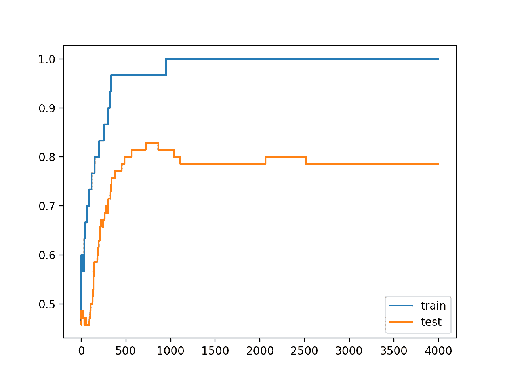
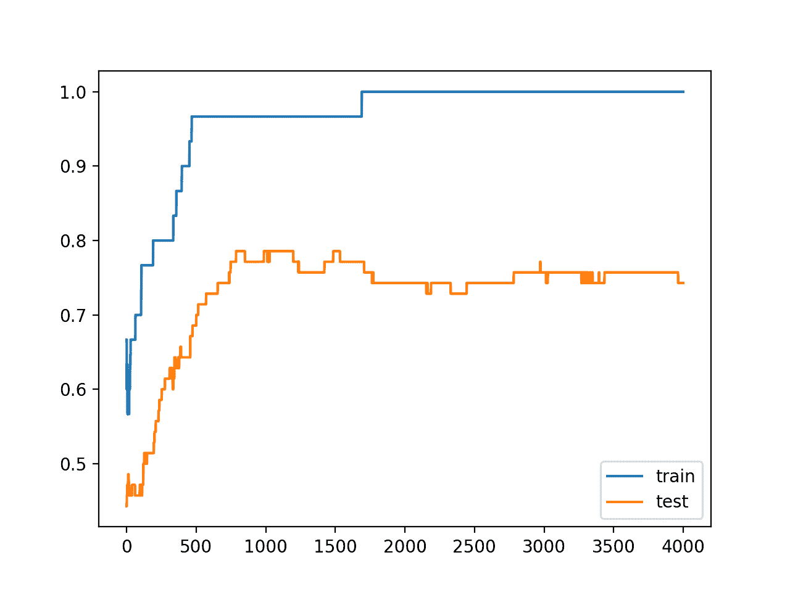

# 如何利用 Keras 中的活动正则化减少泛化误差

> 原文：<https://machinelearningmastery.com/how-to-reduce-generalization-error-in-deep-neural-networks-with-activity-regularization-in-keras/>

最后更新于 2020 年 8 月 25 日

活动正则化提供了一种方法来鼓励神经网络学习原始观察的稀疏特征或内部表示。

在自动编码器(称为稀疏自动编码器)和编码器-解码器模型中寻找稀疏的学习表示是很常见的，尽管这种方法通常也可以用于[减少过拟合并提高模型将](https://machinelearningmastery.com/introduction-to-regularization-to-reduce-overfitting-and-improve-generalization-error/)推广到新观测值的能力。

在本教程中，您将发现用于向深度学习神经网络模型添加活动正则化的 Keras API。

完成本教程后，您将知道:

*   如何使用 Keras API 创建向量范数正则化。
*   如何使用 Keras API 为 MLP、CNN 和 RNN 层添加活动正则化。
*   如何通过向现有模型添加活动正则化来减少过拟合？

**用我的新书[更好的深度学习](https://machinelearningmastery.com/better-deep-learning/)启动你的项目**，包括*分步教程*和所有示例的 *Python 源代码*文件。

我们开始吧。

*   **2019 年 10 月更新**:针对 Keras 2.3 和 TensorFlow 2.0 更新。


如何利用 Keras 中的活动正则化减少深度神经网络中的泛化误差。

## 教程概述

本教程分为三个部分；它们是:

1.  Keras 的活动正则化
2.  层上的活动正则化
3.  活动正规化案例研究

## Keras 的活动正则化

Keras 支持活动正规化。

支持三种不同的正则化技术，每种技术在*keras . regulators*模块中作为一个类提供:

*   **l1** :活跃度计算为绝对值之和。
*   **l2** :活跃度计算为平方值之和。
*   **l1_l2** :活跃度计算为绝对值之和与平方值之和。

每一个 *l1* 和 *l2* 正则化器都使用一个超参数来控制每个活动对总和的贡献量。 *l1_l2* 正则化器获取两个超参数，l1 和 l2 方法各一个。

正则化类必须被导入，然后被实例化；例如:

```py
# import regularizer
from keras.regularizers import l1
# instantiate regularizer
reg = l1(0.001)
```

## 层上的活动正则化

活动正则化是在 Keras 中的一个层上指定的。

这可以通过将层上的*activity _ regulator*参数设置为实例化和配置的正则化类来实现。

正则化应用于层的输出，但是您可以控制层的“*输出*”的实际含义。具体来说，您可以灵活选择层输出是指在激活*功能之前还是之后应用正则化。*

例如，可以在层上指定函数和正则化，在这种情况下，激活正则化应用于激活函数的输出，在这种情况下，[校正线性激活函数或 ReLU](https://machinelearningmastery.com/rectified-linear-activation-function-for-deep-learning-neural-networks/) 。

```py
...
model.add(Dense(32, activation='relu', activity_regularizer=l1(0.001)))
...
```

或者，您可以指定线性激活函数(默认值，不执行任何转换)，这意味着激活正则化应用于原始输出，然后，激活函数可以作为后续层添加。

```py
...
model.add(Dense(32, activation='linear', activity_regularizer=l1(0.001)))
model.add(Activation('relu'))
...
```

后者可能是激活正则化的首选用法，如“[深度稀疏整流神经网络](http://proceedings.mlr.press/v15/glorot11a.html)”中所述，以便允许模型结合整流线性激活函数学习将激活取为真零值。然而，激活正则化的两种可能的用途可能会被探索，以便发现什么最适合您的特定模型和数据集。

让我们来看看活动正则化如何与一些常见的层类型一起使用。

### MLP 活动正规化

下面的示例在稠密全连通层上设置 l1 范数活动正则化。

```py
# example of l1 norm on activity from a dense layer
from keras.layers import Dense
from keras.regularizers import l1
...
model.add(Dense(32, activity_regularizer=l1(0.001)))
...
```

### 美国有线电视新闻网活动正规化

以下示例在 Conv2D 卷积层上设置 l1 范数活动正则化。

```py
# example of l1 norm on activity from a cnn layer
from keras.layers import Conv2D
from keras.regularizers import l1
...
model.add(Conv2D(32, (3,3), activity_regularizer=l1(0.001)))
...
```

### RNN 活动正规化

以下示例在 LSTM 递归层上设置 l1 范数活动正则化。

```py
# example of l1 norm on activity from an lstm layer
from keras.layers import LSTM
from keras.regularizers import l1
...
model.add(LSTM(32, activity_regularizer=l1(0.001)))
...
```

现在我们知道如何使用活动正则化应用编程接口，让我们看一个工作示例。

## 活动正规化案例研究

在本节中，我们将演示如何使用活动正则化来减少简单二分类问题上 MLP 的过拟合。

虽然活动正则化最常用于鼓励自动编码器和编码器-解码器模型中的稀疏学习表示，但它也可以直接在普通神经网络中使用，以实现相同的效果并提高模型的泛化能力。

此示例提供了一个模板，用于将活动正则化应用于您自己的神经网络，以解决分类和回归问题。

### 二分类问题

我们将使用一个标准的二分类问题，它定义了两个观察值的二维同心圆，每个类一个圆。

每个观察都有两个相同规模的输入变量和一个 0 或 1 的类输出值。该数据集被称为“*圆*”数据集，这是因为绘制时每个类中观测值的形状。

我们可以使用 [make_circles()函数](http://Sklearn.org/stable/modules/generated/sklearn.datasets.make_circles.html)从这个问题中生成观察值。我们将向数据中添加噪声，并为随机数生成器播种，这样每次运行代码时都会生成相同的样本。

```py
# generate 2d classification dataset
X, y = make_circles(n_samples=100, noise=0.1, random_state=1)
```

我们可以绘制数据集，其中两个变量作为图形上的 x 和 y 坐标，类值作为观察的颜色。

下面列出了生成数据集并绘制它的完整示例。

```py
# generate two circles dataset
from sklearn.datasets import make_circles
from matplotlib import pyplot
from pandas import DataFrame
# generate 2d classification dataset
X, y = make_circles(n_samples=100, noise=0.1, random_state=1)
# scatter plot, dots colored by class value
df = DataFrame(dict(x=X[:,0], y=X[:,1], label=y))
colors = {0:'red', 1:'blue'}
fig, ax = pyplot.subplots()
grouped = df.groupby('label')
for key, group in grouped:
    group.plot(ax=ax, kind='scatter', x='x', y='y', label=key, color=colors[key])
pyplot.show()
```

运行该示例会创建一个散点图，显示每个类中观察值的同心圆形状。

我们可以看到点扩散的噪音使得圆圈不那么明显。


带有显示每个样本类别值的颜色的圆形数据集散点图

这是一个很好的测试问题，因为类不能用一条线分开，例如不能线性分开，需要一个非线性的方法，如神经网络来解决。

我们只生成了 100 个样本，这对于神经网络来说是很小的，这提供了对训练数据集进行过度训练的机会，并且在测试数据集上具有更高的误差:这是使用正则化的一个很好的例子。

此外，样本有噪声，这使得模型有机会学习样本中不一般化的方面。

### 过采样多层感知器

我们可以开发一个 MLP 模型来解决这个二分类问题。

该模型将有一个隐藏层，其中可能需要更多的节点来解决这个问题，从而提供了一个过度填充的机会。我们还将对模型进行比要求更长时间的训练，以确保模型溢出。

在定义模型之前，我们将把数据集分成训练集和测试集，用 30 个例子训练模型，用 70 个例子评估拟合模型的表现。

```py
# generate 2d classification dataset
X, y = make_circles(n_samples=100, noise=0.1, random_state=1)
# split into train and test
n_train = 30
trainX, testX = X[:n_train, :], X[n_train:, :]
trainy, testy = y[:n_train], y[n_train:]
```

接下来，我们可以定义模型。

隐藏层使用 500 个节点和校正的线性激活函数。输出层使用 sigmoid 激活函数来预测类值 0 或 1。

该模型采用二元交叉熵损失函数进行优化，适用于二分类问题和高效的 [Adam 版本梯度下降](https://machinelearningmastery.com/adam-optimization-algorithm-for-deep-learning/)。

```py
# define model
model = Sequential()
model.add(Dense(500, input_dim=2, activation='relu'))
model.add(Dense(1, activation='sigmoid'))
model.compile(loss='binary_crossentropy', optimizer='adam', metrics=['accuracy'])
```

然后，定义的模型适用于 4000 个时期的训练数据，默认批量为 32。

我们还将使用测试数据集作为验证数据集。

```py
# fit model
history = model.fit(trainX, trainy, validation_data=(testX, testy), epochs=4000, verbose=0)
```

我们可以在测试数据集上评估模型的表现并报告结果。

```py
# evaluate the model
_, train_acc = model.evaluate(trainX, trainy, verbose=0)
_, test_acc = model.evaluate(testX, testy, verbose=0)
print('Train: %.3f, Test: %.3f' % (train_acc, test_acc))
```

最后，我们将绘制模型在每个时期的列车和测试集上的表现。

如果模型确实过度训练了训练数据集，那么随着模型学习训练数据集中的统计噪声，我们将期望训练集上的准确率线图继续增加，并且测试集上升，然后再次下降。

```py
# plot history
pyplot.plot(history.history['accuracy'], label='train')
pyplot.plot(history.history['val_accuracy'], label='test')
pyplot.legend()
pyplot.show()
```

我们可以将所有这些部分绑在一起，完整的例子如下。

```py
# mlp overfit on the two circles dataset
from sklearn.datasets import make_circles
from keras.layers import Dense
from keras.models import Sequential
from matplotlib import pyplot
# generate 2d classification dataset
X, y = make_circles(n_samples=100, noise=0.1, random_state=1)
# split into train and test
n_train = 30
trainX, testX = X[:n_train, :], X[n_train:, :]
trainy, testy = y[:n_train], y[n_train:]
# define model
model = Sequential()
model.add(Dense(500, input_dim=2, activation='relu'))
model.add(Dense(1, activation='sigmoid'))
model.compile(loss='binary_crossentropy', optimizer='adam', metrics=['accuracy'])
# fit model
history = model.fit(trainX, trainy, validation_data=(testX, testy), epochs=4000, verbose=0)
# evaluate the model
_, train_acc = model.evaluate(trainX, trainy, verbose=0)
_, test_acc = model.evaluate(testX, testy, verbose=0)
print('Train: %.3f, Test: %.3f' % (train_acc, test_acc))
# plot history
pyplot.plot(history.history['accuracy'], label='train')
pyplot.plot(history.history['val_accuracy'], label='test')
pyplot.legend()
pyplot.show()
```

运行该示例会报告列车和测试数据集上的模型表现。

我们可以看到，该模型在训练数据集上的表现优于测试数据集，这可能是过拟合的一个迹象。

**注**:考虑到算法或评估程序的随机性，或数值准确率的差异，您的[结果可能会有所不同](https://machinelearningmastery.com/different-results-each-time-in-machine-learning/)。考虑运行该示例几次，并比较平均结果。

因为模型被严重过拟合，我们通常不会期望模型在同一数据集上重复运行时的准确率有太大差异。

```py
Train: 1.000, Test: 0.786
```

创建一个图形，显示列车和测试集上模型准确率的线图。

我们可以看到 overfit 模型的预期形状，其中测试准确率增加到一个点，然后开始再次降低。



训练时训练和测试数据集上的准确率线图显示出过拟合

### 激活正则化的过采样 MLP

我们可以更新示例以使用激活正则化。

有几种不同的正则化方法可供选择，但使用最常见的可能是个好主意，这就是 [L1 向量范数](https://machinelearningmastery.com/vector-norms-machine-learning/)。

该正则化具有鼓励稀疏表示(大量零)的效果，这由允许真零值的校正线性激活函数支持。

我们可以通过使用 keras 中的 *keras .正则化子. l1* 类来做到这一点。

我们将配置层使用线性激活函数，以便我们可以正则化原始输出，然后在层的正则化输出后添加 relu 激活层。我们将正则化超参数设置为 1E-4 或 0.0001，稍微试错一下就发现了。

```py
model.add(Dense(500, input_dim=2, activation='linear', activity_regularizer=l1(0.0001)))
model.add(Activation('relu'))
```

下面列出了具有 L1 范数约束的完整更新示例:

```py
# mlp overfit on the two circles dataset with activation regularization
from sklearn.datasets import make_circles
from keras.layers import Dense
from keras.models import Sequential
from keras.regularizers import l1
from keras.layers import Activation
from matplotlib import pyplot
# generate 2d classification dataset
X, y = make_circles(n_samples=100, noise=0.1, random_state=1)
# split into train and test
n_train = 30
trainX, testX = X[:n_train, :], X[n_train:, :]
trainy, testy = y[:n_train], y[n_train:]
# define model
model = Sequential()
model.add(Dense(500, input_dim=2, activation='linear', activity_regularizer=l1(0.0001)))
model.add(Activation('relu'))
model.add(Dense(1, activation='sigmoid'))
model.compile(loss='binary_crossentropy', optimizer='adam', metrics=['accuracy'])
# fit model
history = model.fit(trainX, trainy, validation_data=(testX, testy), epochs=4000, verbose=0)
# evaluate the model
_, train_acc = model.evaluate(trainX, trainy, verbose=0)
_, test_acc = model.evaluate(testX, testy, verbose=0)
print('Train: %.3f, Test: %.3f' % (train_acc, test_acc))
# plot history
pyplot.plot(history.history['accuracy'], label='train')
pyplot.plot(history.history['val_accuracy'], label='test')
pyplot.legend()
pyplot.show()
```

运行该示例会报告列车和测试数据集上的模型表现。

**注**:考虑到算法或评估程序的随机性，或数值准确率的差异，您的[结果可能会有所不同](https://machinelearningmastery.com/different-results-each-time-in-machine-learning/)。考虑运行该示例几次，并比较平均结果。

我们可以看到，活动正则化导致训练数据集的准确率从 100%下降到 96%，测试集的准确率从 78%提升到 82%。

```py
Train: 0.967, Test: 0.829
```

回顾训练和测试准确率的线图，我们可以看到模型似乎不再过拟合训练数据集。

列车和测试集上的模型准确率继续增加到平稳状态。


活动正则化训练时训练和测试数据集上的准确率线图

为了完整起见，我们可以将结果与模型的一个版本进行比较，其中在 relu 激活函数之后应用了活动正则化。

```py
model.add(Dense(500, input_dim=2, activation='relu', activity_regularizer=l1(0.0001)))
```

下面列出了完整的示例。

```py
# mlp overfit on the two circles dataset with activation regularization
from sklearn.datasets import make_circles
from keras.layers import Dense
from keras.models import Sequential
from keras.regularizers import l1
from matplotlib import pyplot
# generate 2d classification dataset
X, y = make_circles(n_samples=100, noise=0.1, random_state=1)
# split into train and test
n_train = 30
trainX, testX = X[:n_train, :], X[n_train:, :]
trainy, testy = y[:n_train], y[n_train:]
# define model
model = Sequential()
model.add(Dense(500, input_dim=2, activation='relu', activity_regularizer=l1(0.0001)))
model.add(Dense(1, activation='sigmoid'))
model.compile(loss='binary_crossentropy', optimizer='adam', metrics=['accuracy'])
# fit model
history = model.fit(trainX, trainy, validation_data=(testX, testy), epochs=4000, verbose=0)
# evaluate the model
_, train_acc = model.evaluate(trainX, trainy, verbose=0)
_, test_acc = model.evaluate(testX, testy, verbose=0)
print('Train: %.3f, Test: %.3f' % (train_acc, test_acc))
# plot history
pyplot.plot(history.history['accuracy'], label='train')
pyplot.plot(history.history['val_accuracy'], label='test')
pyplot.legend()
pyplot.show()
```

运行该示例会报告列车和测试数据集上的模型表现。

**注**:考虑到算法或评估程序的随机性，或数值准确率的差异，您的[结果可能会有所不同](https://machinelearningmastery.com/different-results-each-time-in-machine-learning/)。考虑运行该示例几次，并比较平均结果。

我们可以看到，至少在这个问题上以及用这个模型，激活函数后的激活正则化并没有改善泛化误差；事实上，这让事情变得更糟。

```py
Train: 1.000, Test: 0.743
```

回顾训练和测试准确率的线图，我们可以看到模型确实仍然显示出过度训练数据集的迹象。



训练和测试数据集上的准确率线图，同时使用活动正则化进行训练，仍然过度训练

这表明，用您自己的数据集实现活动正则化的两种方法都值得尝试，以确认您充分利用了这种方法。

## 扩展ˌ扩张

本节列出了一些您可能希望探索的扩展教程的想法。

*   **报告激活平均值**。更新示例以计算正则层的平均激活，并确认激活确实变得更加稀疏。
*   **网格搜索**。更新示例以网格搜索正则化超参数的不同值。
*   **替代定额**。更新示例以评估 L2 或 layer 向量范数，从而调整隐藏层输出。
*   **重复评估**。更新示例以多次拟合和评估模型，并报告模型表现的平均值和标准差。

如果你探索这些扩展，我很想知道。

## 进一步阅读

如果您想更深入地了解这个主题，本节将提供更多资源。

### 邮件

*   [机器学习中向量规范的温和介绍](https://machinelearningmastery.com/vector-norms-machine-learning/)
*   [在 Keras 建立自动编码器](https://blog.keras.io/building-autoencoders-in-keras.html)

### 应用程序接口

*   [硬正则器 API](https://keras.io/regularizers/)
*   [硬核层 API](https://keras.io/layers/core/)
*   [Keras 卷积层应用编程接口](https://keras.io/layers/convolutional/)
*   [Keras 循环层原料药](https://keras.io/layers/recurrent/)
*   [sklearn . dataset . make _ circles](http://Sklearn.org/stable/modules/generated/sklearn.datasets.make_circles.html)

## 摘要

在本教程中，您发现了用于向深度学习神经网络模型添加活动正则化的 Keras API。

具体来说，您了解到:

*   如何使用 Keras API 创建向量范数正则化。
*   如何使用 Keras API 为 MLP、CNN 和 RNN 层添加活动正则化。
*   如何通过向现有模型添加活动正则化来减少过拟合？

你有什么问题吗？
在下面的评论中提问，我会尽力回答。