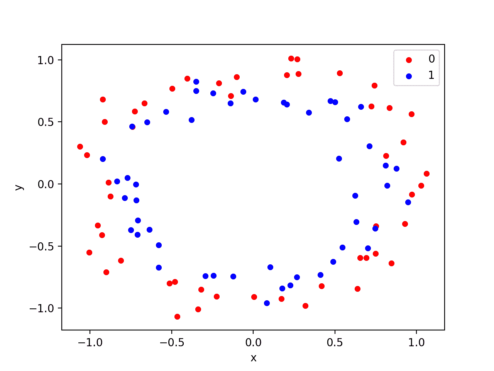
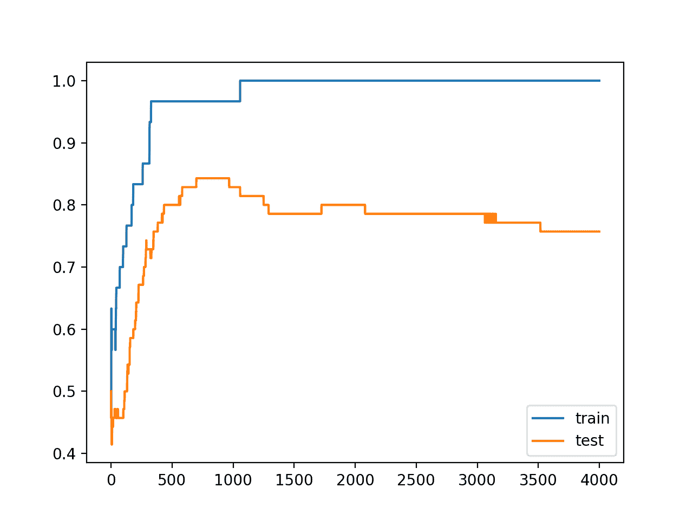
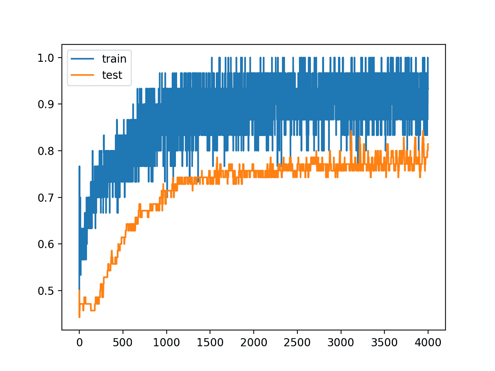

# 如何在 Keras 中利用丢弃正则化减少过拟合

> 原文：<https://machinelearningmastery.com/how-to-reduce-overfitting-with-dropout-regularization-in-keras/>

最后更新于 2020 年 8 月 25 日

[脱落正则化](https://machinelearningmastery.com/dropout-for-regularizing-deep-neural-networks/)是一种计算量小的正则化深度神经网络的方法。

Dropout 的工作原理是从概率上删除或“退出”一个层的输入，这些输入可能是数据样本中的输入变量，也可能是上一层的激活。它具有模拟大量具有非常不同的网络结构的网络的效果，并且反过来使得网络中的节点通常对输入更加鲁棒。

在本教程中，您将发现用于向深度学习神经网络模型添加丢弃正则化的 Keras API。

完成本教程后，您将知道:

*   如何使用 Keras API 创建一个脱落层。
*   如何使用 Keras API 为 MLP、CNN 和 RNN 层添加丢弃正则化。
*   如何通过在现有模型中增加一个丢失正则化来减少过拟合？

**用我的新书[更好的深度学习](https://machinelearningmastery.com/better-deep-learning/)启动你的项目**，包括*分步教程*和所有示例的 *Python 源代码*文件。

我们开始吧。

*   **2019 年 10 月更新**:针对 Keras 2.3 和 TensorFlow 2.0 更新。


如何减少过拟合与丢弃正规化在 Keras
图片由[项目拉刀疤](https://www.flickr.com/photos/jlascar/19198105290)，一些权利保留。

## 教程概述

本教程分为三个部分；它们是:

1.  Keras 的丢弃正规化
2.  层上的缺失正则化
3.  丢弃正规化案例研究

## Keras 的丢弃正规化

Keras 支持丢弃正规化。

Keras 中最简单的丢弃形式是由丢弃核心层提供的。

创建后，可以将层的丢弃率指定为将层的每个输入设置为零的概率。这与论文中丢弃率的定义不同，丢弃率指的是保留输入的概率。

因此，当论文中建议丢弃率为 0.8(保留 80%)时，实际上丢弃率为 0.2(将 20%的输入设置为零)。

下面是一个创建脱落层的示例，50%的概率将输入设置为零。

```py
layer = Dropout(0.5)
```

## 层上的缺失正则化

丢弃层被添加到现有层之间的模型中，并应用于前一层的输出，该输出被馈送到后一层。

例如，给定两个致密层:

```py
...
model.append(Dense(32))
model.append(Dense(32))
...
```

我们可以在它们之间插入一个脱离层，在这种情况下，第一层的输出或激活应用了脱离，然后作为下一层的输入。

这是第二层，现在已经应用了脱落。

```py
...
model.append(Dense(32))
model.append(Dropout(0.5))
model.append(Dense(32))
...
```

丢失也可以应用于可见层，例如网络的输入。

这要求您将 Dropout 层定义为第一个层，并将 *input_shape* 参数添加到该层，以指定输入样本的预期形状。

```py
...
model.add(Dropout(0.5, input_shape=(2,)))
...
```

让我们来看看如何将丢弃正规化用于一些常见的网络类型。

### MLP 丢弃正规化

下面的例子增加了两个密集的全连接层之间的压差。

```py
# example of dropout between fully connected layers
from keras.layers import Dense
from keras.layers import Dropout
...
model.add(Dense(32))
model.add(Dropout(0.5))
model.add(Dense(1))
...
```

### 美国有线电视新闻网丢弃正规化

丢弃可以在卷积层(如 Conv2D)之后和池化层(如 MaxPooling2D)之后使用。

通常，仅在[池化层](https://machinelearningmastery.com/pooling-layers-for-convolutional-neural-networks/)后才使用退出，但这只是一个粗略的启发。

```py
# example of dropout for a CNN
from keras.layers import Dense
from keras.layers import Conv2D
from keras.layers import MaxPooling2D
from keras.layers import Dropout
...
model.add(Conv2D(32, (3,3)))
model.add(Conv2D(32, (3,3)))
model.add(MaxPooling2D())
model.add(Dropout(0.5))
model.add(Dense(1))
...
```

在这种情况下，删除将应用于要素图中的每个元素或单元。

卷积神经网络使用丢弃的另一种方法是从卷积层中丢弃整个特征图，然后在池化期间不使用这些特征图。这被称为空间脱落(或“*空间脱落*”)。

> 相反，我们制定了一个新的退出方法，我们称之为空间退出。对于给定的卷积特征张量[…][我们]在整个特征映射中扩展缺失值。

——[使用卷积网络的高效目标定位](https://arxiv.org/abs/1411.4280)，2015。

空间丢失在 Keras 通过空间丢失 2D 层(以及 1D 和 3D 版本)提供。

```py
# example of spatial dropout for a CNN
from keras.layers import Dense
from keras.layers import Conv2D
from keras.layers import MaxPooling2D
from keras.layers import SpatialDropout2D
...
model.add(Conv2D(32, (3,3)))
model.add(Conv2D(32, (3,3)))
model.add(SpatialDropout2D(0.5))
model.add(MaxPooling2D())
model.add(Dense(1))
...
```

### RNN 丢弃正规化

下面的例子增加了两层之间的脱落:LSTM 循环层和密集的全连接层。

```py
# example of dropout between LSTM and fully connected layers
from keras.layers import Dense
from keras.layers import LSTM
from keras.layers import Dropout
...
model.add(LSTM(32))
model.add(Dropout(0.5))
model.add(Dense(1))
...
```

本例将压差应用于 LSTM 层的 32 个输出，作为密集层的输入。

或者，LSTM 的输入可能会丢失。在这种情况下，在提交给 LSTM 的每个样本中的每个时间步长应用不同的丢失掩码。

```py
# example of dropout before LSTM layer
from keras.layers import Dense
from keras.layers import LSTM
from keras.layers import Dropout
...
model.add(Dropout(0.5, input_shape=(...)))
model.add(LSTM(32))
model.add(Dense(1))
...
```

有一种替代方法可以使用像 LSTM 这样的反复层的脱落。LSTM 可以对样本内的所有输入使用相同的丢失屏蔽。相同的方法可以用于样本时间步长上的重复输入连接。这种带有递归模型的丢弃方法被称为变分 RNN。

> 所提出的技术(变分 RNN【…】)在每个时间步使用相同的丢失掩码，包括循环层。[……]实现我们的近似推理与在 rnn 中实现丢弃是一样的，在每个时间步长丢弃相同的网络单元，随机丢弃输入、输出和循环连接。这与现有技术形成对比，在现有技术中，不同的网络单元将在不同的时间步长被丢弃，并且不会将丢弃应用于重复的连接

——[递归神经网络中脱落的理论基础应用](https://arxiv.org/abs/1512.05287)，2016。

Keras 通过递归层上的两个参数，即输入的“*drop*”和递归输入的“*recurrent _ drop*”，支持可变 rnn(即输入和递归输入样本时间步长上的一致 drop)。

```py
# example of variational LSTM dropout
from keras.layers import Dense
from keras.layers import LSTM
from keras.layers import Dropout
...
model.add(LSTM(32, dropout=0.5, recurrent_dropout=0.5))
model.add(Dense(1))
...
```

## 丢弃正规化案例研究

在这一节中，我们将演示如何在一个简单的二进制分类问题上使用丢弃正则化来减少 MLP 的过拟合。

此示例提供了一个模板，用于将丢失正则化应用到您自己的神经网络中，以解决分类和回归问题。

### 二分类问题

我们将使用一个标准的二分类问题，它定义了两个观察值的二维同心圆，每个类一个圆。

每个观察都有两个相同规模的输入变量和一个 0 或 1 的类输出值。该数据集被称为“*圆*”数据集，这是因为绘制时每个类中观测值的形状。

我们可以使用 [make_circles()函数](http://Sklearn.org/stable/modules/generated/sklearn.datasets.make_circles.html)从这个问题中生成观察值。我们将向数据中添加噪声，并为随机数生成器播种，这样每次运行代码时都会生成相同的样本。

```py
# generate 2d classification dataset
X, y = make_circles(n_samples=100, noise=0.1, random_state=1)
```

我们可以绘制数据集，其中两个变量作为图形上的 x 和 y 坐标，类值作为观察的颜色。

下面列出了生成数据集并绘制它的完整示例。

```py
# generate two circles dataset
from sklearn.datasets import make_circles
from matplotlib import pyplot
from pandas import DataFrame
# generate 2d classification dataset
X, y = make_circles(n_samples=100, noise=0.1, random_state=1)
# scatter plot, dots colored by class value
df = DataFrame(dict(x=X[:,0], y=X[:,1], label=y))
colors = {0:'red', 1:'blue'}
fig, ax = pyplot.subplots()
grouped = df.groupby('label')
for key, group in grouped:
    group.plot(ax=ax, kind='scatter', x='x', y='y', label=key, color=colors[key])
pyplot.show()
```

运行该示例会创建一个散点图，显示每个类中观察值的同心圆形状。我们可以看到点扩散的噪音使得圆圈不那么明显。



带有显示每个样本类别值的颜色的圆形数据集散点图

这是一个很好的测试问题，因为类不能用一条线分开，例如不能线性分开，需要一个非线性的方法，如神经网络来解决。

我们只生成了 100 个样本，这对于神经网络来说是很小的，这提供了对训练数据集进行过度训练的机会，并且在测试数据集上具有更高的误差:这是使用正则化的一个很好的例子。此外，样本有噪声，这使得模型有机会学习样本中不一般化的方面。

### 过采样多层感知器

我们可以开发一个 MLP 模型来解决这个二分类问题。

该模型将有一个隐藏层，该隐藏层的节点可能比解决该问题所需的节点更多，这为过度填充提供了机会。我们还将对模型进行比要求更长时间的训练，以确保模型溢出。

在定义模型之前，我们将把数据集分成训练集和测试集，用 30 个例子训练模型，用 70 个例子评估拟合模型的表现。

```py
# generate 2d classification dataset
X, y = make_circles(n_samples=100, noise=0.1, random_state=1)
# split into train and test
n_train = 30
trainX, testX = X[:n_train, :], X[n_train:, :]
trainy, testy = y[:n_train], y[n_train:]
```

接下来，我们可以定义模型。

隐藏层使用隐藏层中的 500 个节点和校正的线性激活函数。输出层使用 sigmoid 激活函数来预测类值 0 或 1。

该模型使用二元交叉熵损失函数进行优化，适用于二分类问题和高效的 Adam 版本梯度下降。

```py
# define model
model = Sequential()
model.add(Dense(500, input_dim=2, activation='relu'))
model.add(Dense(1, activation='sigmoid'))
model.compile(loss='binary_crossentropy', optimizer='adam', metrics=['accuracy'])
```

然后，定义的模型适用于 4000 个时期的训练数据，默认批量为 32。

我们还将使用测试数据集作为验证数据集。

```py
# fit model
history = model.fit(trainX, trainy, validation_data=(testX, testy), epochs=4000, verbose=0)
```

我们可以在测试数据集上评估模型的表现并报告结果。

```py
# evaluate the model
_, train_acc = model.evaluate(trainX, trainy, verbose=0)
_, test_acc = model.evaluate(testX, testy, verbose=0)
print('Train: %.3f, Test: %.3f' % (train_acc, test_acc))
```

最后，我们将绘制模型在每个时期的列车和测试集上的表现。

如果模型确实过度训练了训练数据集，那么随着模型学习训练数据集中的统计噪声，我们将期望训练集上的准确率线图继续增加，并且测试集上升，然后再次下降。

```py
# plot history
pyplot.plot(history.history['accuracy'], label='train')
pyplot.plot(history.history['val_accuracy'], label='test')
pyplot.legend()
pyplot.show()
```

我们可以把所有这些部分绑在一起；下面列出了完整的示例。

```py
# mlp overfit on the two circles dataset
from sklearn.datasets import make_circles
from keras.layers import Dense
from keras.models import Sequential
from matplotlib import pyplot
# generate 2d classification dataset
X, y = make_circles(n_samples=100, noise=0.1, random_state=1)
# split into train and test
n_train = 30
trainX, testX = X[:n_train, :], X[n_train:, :]
trainy, testy = y[:n_train], y[n_train:]
# define model
model = Sequential()
model.add(Dense(500, input_dim=2, activation='relu'))
model.add(Dense(1, activation='sigmoid'))
model.compile(loss='binary_crossentropy', optimizer='adam', metrics=['accuracy'])
# fit model
history = model.fit(trainX, trainy, validation_data=(testX, testy), epochs=4000, verbose=0)
# evaluate the model
_, train_acc = model.evaluate(trainX, trainy, verbose=0)
_, test_acc = model.evaluate(testX, testy, verbose=0)
print('Train: %.3f, Test: %.3f' % (train_acc, test_acc))
# plot history
pyplot.plot(history.history['accuracy'], label='train')
pyplot.plot(history.history['val_accuracy'], label='test')
pyplot.legend()
pyplot.show()
```

运行该示例会报告列车和测试数据集上的模型表现。

我们可以看到，该模型在训练数据集上的表现优于测试数据集，这可能是过拟合的一个迹象。

**注**:考虑到算法或评估程序的随机性，或数值准确率的差异，您的[结果可能会有所不同](https://machinelearningmastery.com/different-results-each-time-in-machine-learning/)。考虑运行该示例几次，并比较平均结果。

因为模型被严重过拟合，我们通常不会期望模型在同一数据集上重复运行时的准确率有太大差异。

```py
Train: 1.000, Test: 0.757
```

创建一个图形，显示列车和测试集上模型准确率的线图。

我们可以看到过拟合模型的预期形状，其中测试准确率增加到一个点，然后开始再次降低。



训练时训练和测试数据集上的准确率线图显示出过拟合

### 丢弃正规化的过度 MLP

我们可以更新这个例子来使用脱落正则化。

我们只需在隐藏层和输出层之间插入一个新的 Dropout 层就可以做到这一点。在这种情况下，我们将丢弃率(将隐藏层的输出设置为零的概率)指定为 40%或 0.4。

```py
# define model
model = Sequential()
model.add(Dense(500, input_dim=2, activation='relu'))
model.add(Dropout(0.4))
model.add(Dense(1, activation='sigmoid'))
model.compile(loss='binary_crossentropy', optimizer='adam', metrics=['accuracy'])
```

下面列出了隐藏层后添加了脱落的完整更新示例:

```py
# mlp with dropout on the two circles dataset
from sklearn.datasets import make_circles
from keras.models import Sequential
from keras.layers import Dense
from keras.layers import Dropout
from matplotlib import pyplot
# generate 2d classification dataset
X, y = make_circles(n_samples=100, noise=0.1, random_state=1)
# split into train and test
n_train = 30
trainX, testX = X[:n_train, :], X[n_train:, :]
trainy, testy = y[:n_train], y[n_train:]
# define model
model = Sequential()
model.add(Dense(500, input_dim=2, activation='relu'))
model.add(Dropout(0.4))
model.add(Dense(1, activation='sigmoid'))
model.compile(loss='binary_crossentropy', optimizer='adam', metrics=['accuracy'])
# fit model
history = model.fit(trainX, trainy, validation_data=(testX, testy), epochs=4000, verbose=0)
# evaluate the model
_, train_acc = model.evaluate(trainX, trainy, verbose=0)
_, test_acc = model.evaluate(testX, testy, verbose=0)
print('Train: %.3f, Test: %.3f' % (train_acc, test_acc))
# plot history
pyplot.plot(history.history['accuracy'], label='train')
pyplot.plot(history.history['val_accuracy'], label='test')
pyplot.legend()
pyplot.show()
```

运行该示例会报告列车和测试数据集上的模型表现。

**注**:考虑到算法或评估程序的随机性，或数值准确率的差异，您的[结果可能会有所不同](https://machinelearningmastery.com/different-results-each-time-in-machine-learning/)。考虑运行该示例几次，并比较平均结果。

在这个特定的例子中，我们可以看到，丢失导致训练数据集的准确率略有下降，从 100%下降到 96%，测试集的准确率从 75%上升到 81%。

```py
Train: 0.967, Test: 0.814
```

回顾训练期间的训练和测试准确率的线图，我们可以看到模型似乎不再过度训练训练数据集。

列车和测试集上的模型准确率继续增加到平稳状态，尽管由于在训练过程中使用了脱扣器，噪声很大。



使用缺失正则化进行训练时，训练和测试数据集上的准确率线图

## 扩展ˌ扩张

本节列出了一些您可能希望探索的扩展教程的想法。

*   **输入丢失**。更新示例，对输入变量使用 drop 并比较结果。
*   **重量约束**。更新示例，将最大范数权重约束添加到隐藏层并比较结果。
*   **重复评估**。更新该示例，以重复对 overfit 和 dropout 模型的评估，并总结和比较平均结果。
*   **网格搜索率**。开发丢弃概率的网格搜索，并报告丢弃率和测试集准确性之间的关系。

如果你探索这些扩展，我很想知道。

## 进一步阅读

如果您想更深入地了解这个主题，本节将提供更多资源。

### 报纸

*   [利用卷积网络的高效目标定位](https://arxiv.org/abs/1411.4280)，2015。
*   [递归神经网络中脱落的理论基础应用](https://arxiv.org/abs/1512.05287)，2016。

### 邮件

*   [基于 Keras 的深度学习模型中的丢弃正则化](https://machinelearningmastery.com/dropout-regularization-deep-learning-models-keras/)
*   [如何利用 LSTM 网络的丢包进行时间序列预测](https://machinelearningmastery.com/use-dropout-lstm-networks-time-series-forecasting/)

### 应用程序接口

*   [硬正则器 API](https://keras.io/regularizers/)
*   [硬核层 API](https://keras.io/layers/core/)
*   [Keras 卷积层应用编程接口](https://keras.io/layers/convolutional/)
*   [Keras 循环层原料药](https://keras.io/layers/recurrent/)
*   [sklearn . dataset . make _ circles API](http://Sklearn.org/stable/modules/generated/sklearn.datasets.make_circles.html)

## 摘要

在本教程中，您发现了用于向深度学习神经网络模型添加丢弃正则化的 Keras API。

具体来说，您了解到:

*   如何使用 Keras API 创建一个脱落层。
*   如何使用 Keras API 为 MLP、CNN 和 RNN 层添加丢弃正则化。
*   如何通过在现有模型中增加一个丢失正则化来减少过拟合？

你有什么问题吗？
在下面的评论中提问，我会尽力回答。