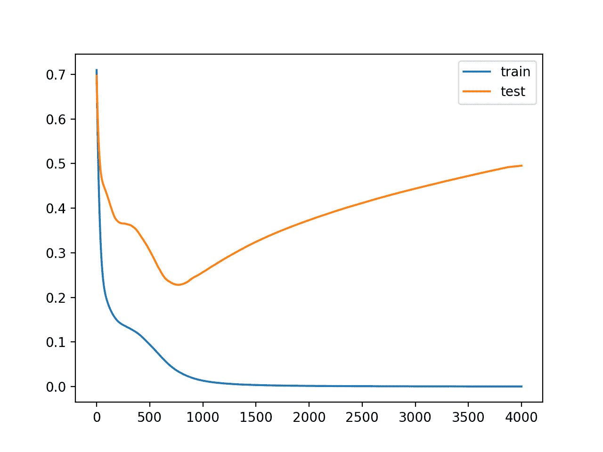
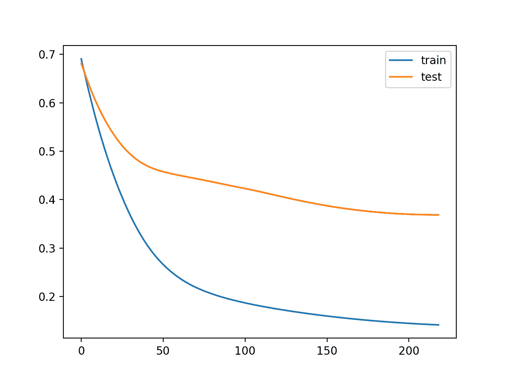
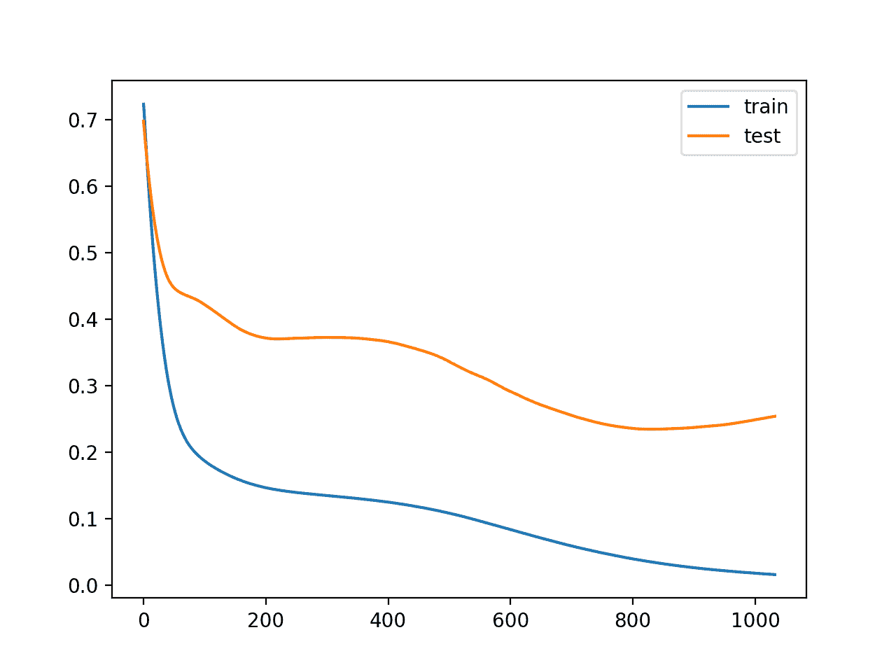

# 适时使用提前停止来停止神经网络的训练

> 原文：<https://machinelearningmastery.com/how-to-stop-training-deep-neural-networks-at-the-right-time-using-early-stopping/>

最后更新于 2020 年 8 月 25 日

训练神经网络的一个问题是选择要使用的训练时期的数量。

过多的时期会导致训练数据集的过拟合，而过少的时期会导致模型的欠拟合。提前停止是一种方法，它允许您指定任意数量的训练时期，并在模型表现停止在等待验证数据集上改善时停止训练。

在本教程中，您将发现 Keras API，用于将早期停止添加到过度深度学习神经网络模型中。

完成本教程后，您将知道:

*   如何使用 Keras API 在训练过程中监控模型的表现。
*   如何使用 Keras API 创建和配置早期停止和模型检查点回调。
*   如何通过在现有模型中增加提前停止来减少过拟合？

**用我的新书[更好的深度学习](https://machinelearningmastery.com/better-deep-learning/)启动你的项目**，包括*分步教程*和所有示例的 *Python 源代码*文件。

我们开始吧。

*   **2019 年 10 月更新**:针对 Keras 2.3 和 TensorFlow 2.0 更新。


如何在正确的时间停止训练深层神经网络使用提前停止
图片由[伊恩·d·基廷](https://www.flickr.com/photos/ian-arlett/29166578334/)提供，保留部分权利。

## 教程概述

本教程分为六个部分；它们是:

1.  在 Keras 中使用回调
2.  评估验证数据集
3.  监控模型表现
4.  在 Keras 的早期停留
5.  Keras 的检查点
6.  早期停止案例研究

## 在 Keras 中使用回调

回调提供了一种自动执行代码和与训练模型过程交互的方法。

回调可以通过“*回调*参数提供给 *fit()* 函数。

首先，回调必须被实例化。

```py
...
cb = Callback(...)
```

然后，您打算使用的一个或多个回调必须添加到 Python 列表中。

```py
...
cb_list = [cb, ...]
```

最后，在拟合模型时，回调列表被提供给回调参数。

```py
...
model.fit(..., callbacks=cb_list)
```

## 在 Keras 中评估验证数据集

提前停止要求在训练期间评估验证数据集。

这可以通过在训练模型时将验证数据集指定给 fit()函数来实现。

这样做有两种方法。

第一种方法是将训练数据手动拆分成训练和验证数据集，并通过 *validation_data* 参数将验证数据集指定给 *fit()* 函数。例如:

```py
...
model.fit(train_X, train_y, validation_data=(val_x, val_y))
```

或者， *fit()* 函数可以根据通过 *validation_split* 参数指定的分割百分比，自动将训练数据集分割成训练集和验证集。

*validation_split* 是一个介于 0 和 1 之间的值，定义了用于验证数据集的训练数据集的百分比量。例如:

```py
...
model.fit(train_X, train_y, validation_split=0.3)
```

在这两种情况下，模型都不是在验证数据集上训练的。相反，在每个训练时期结束时，在验证数据集上评估模型。

## 监控模型表现

为您的模型选择优化的[损失函数](https://machinelearningmastery.com/how-to-choose-loss-functions-when-training-deep-learning-neural-networks/)在每个时期结束时计算。

对于回调，这可以通过名称“ *loss* 获得。”

如果通过 *validation_data* 或 *validation_split* 参数将验证数据集指定给 *fit()* 函数，则验证数据集上的损失将通过名称“ *val_loss* 提供

在模型的训练过程中，可以监控额外的度量。

它们可以在编译模型时通过编译函数的“*度量*”参数来指定。该参数采用已知度量函数的 Python 列表，例如均方误差为“ *mse* ，准确率为“*准确率*”。例如:

```py
...
model.compile(..., metrics=['accuracy'])
```

如果在训练过程中监控了额外的指标，它们也可以通过相同的名称用于回调，例如训练数据集中的准确率为“*准确率*”，验证数据集中的准确率为“ *val_accuracy* ”。或者，训练数据集中的均方误差为“ *mse* ”，验证数据集中的 val_mse 。

## 在 Keras 的早期停留

Keras 支持通过名为*提前停止*的回调提前停止训练。

该回调允许您指定要监视的表现度量、触发器，一旦触发，它将停止训练过程。

通过参数实例化时，配置*预警*回调。

“*监视器*”允许您指定要监视的表现度量，以便结束培训。回想一下上一节，验证数据集上的度量计算将具有“ *val_* 前缀，例如验证数据集上的损失的“ *val_loss* ”。

```py
es = EarlyStopping(monitor='val_loss')
```

根据绩效衡量标准的选择，需要指定“*模式*”参数，即所选指标的目标是增加(最大化或“*最大值*”)还是减少(最小化或“*最小值*”)。

例如，我们将寻求验证损失的最小值和验证均方误差的最小值，而我们将寻求验证准确度的最大值。

```py
es = EarlyStopping(monitor='val_loss', mode='min')
```

默认情况下，模式设置为“*自动*”，并且知道您想要最小化损失或最大化准确率。

这就是最简单的提前停止所需要的。当所选的绩效指标停止改善时，培训将停止。要发现停止训练的训练时期，可以将“ *verbose* ”参数设置为 1。一旦停止，回调将打印纪元号。

```py
es = EarlyStopping(monitor='val_loss', mode='min', verbose=1)
```

通常，没有进一步改善的第一个迹象可能不是停止训练的最佳时机。这是因为模型可能会滑入一个没有改进的平台，甚至在变得更好之前变得稍微差一点。

我们可以通过在我们不希望看到改进的时期数量方面增加触发器的延迟来说明这一点。这可以通过设置“*耐心*”参数来完成。

```py
es = EarlyStopping(monitor='val_loss', mode='min', verbose=1, patience=50)
```

确切的耐心程度会因模型和问题而异。查看表现度量图对于了解数据模型的优化过程可能有多嘈杂非常有用。

默认情况下，绩效指标的任何变化，无论多小，都将被视为改进。您可能需要考虑特定增量的改进，例如均方误差为 1 个单位，准确率为 1%。这可以通过“ *min_delta* ”参数来指定。

```py
es = EarlyStopping(monitor='val_accuracy', mode='max', min_delta=1)
```

最后，可能希望只有在表现保持在给定阈值或基线之上或之下时才停止训练。例如，如果您熟悉模型的训练(例如学习曲线)，并且知道一旦达到给定值的验证损失，继续训练就没有意义。这可以通过设置“*基线*”参数来指定。

这在微调模型时可能更有用，因为在训练新模型的早期阶段所看到的表现度量的初始剧烈波动已经过去。

```py
es = EarlyStopping(monitor='val_loss', mode='min', baseline=0.4)
```

## Keras 的检查点

*预警*回调一旦触发将停止训练，但训练结束时的模型可能不是验证数据集上表现最好的模型。

需要一个额外的回调，以保存在培训期间观察到的最佳模型，供以后使用。这是*模型检查点*回调。

*模型检查点*回调的使用方式很灵活，但在这种情况下，我们将只使用它来保存训练期间观察到的最佳模型，该模型由验证数据集上选择的表现度量来定义。

保存和加载模型需要在您的工作站上安装 HDF5 支持。例如，使用 *pip* Python 安装程序，这可以通过以下方式实现:

```py
sudo pip install h5py
```

您可以从 [h5py 安装文档](http://docs.h5py.org/en/latest/build.html)了解更多信息。

回调将模型保存到文件中，这需要通过第一个参数指定路径和文件名。

```py
mc = ModelCheckpoint('best_model.h5')
```

可以通过 monitor 参数指定要监控的首选损失函数，方式与*早期暂停*回调相同。例如，验证数据集丢失(默认值)。

```py
mc = ModelCheckpoint('best_model.h5', monitor='val_loss')
```

此外，与*早期预测*回调一样，我们必须将“*模式*指定为最小化或最大化表现度量。同样，默认为“*汽车*”，它知道标准的表现指标。

```py
mc = ModelCheckpoint('best_model.h5', monitor='val_loss', mode='min')
```

最后，我们只对训练期间观察到的最佳模型感兴趣，而不是与前一个时期相比的最佳模型，如果训练是嘈杂的，这可能不是最佳的整体模型。这可以通过将“ *save_best_only* ”参数设置为 *True* 来实现。

```py
mc = ModelCheckpoint('best_model.h5', monitor='val_loss', mode='min', save_best_only=True)
```

这是所有需要的，以确保当使用早期停止时，或一般情况下，具有最佳表现的模型被保存。

了解表现度量的价值以及模型是在哪个时期保存的可能会很有趣。通过将“ *verbose* ”参数设置为“ *1* ，回调就可以打印出来。

```py
mc = ModelCheckpoint('best_model.h5', monitor='val_loss', mode='min', verbose=1)
```

然后，通过调用 *load_model()* 函数，可以随时加载和评估保存的模型。

```py
# load a saved model
from keras.models import load_model
saved_model = load_model('best_model.h5')
```

既然我们知道了如何使用早期停止和模型检查点 API，让我们来看一个成功的例子。

## 早期停止案例研究

在本节中，我们将演示如何在简单的二分类问题上使用提前停止来减少 MLP 的过拟合。

此示例提供了一个模板，用于将提前停止应用到自己的神经网络中，以解决分类和回归问题。

### 二分类问题

我们将使用一个标准的二进制分类问题，它定义了两个半圆的观测值，每个类一个半圆。

每个观察都有两个相同规模的输入变量和一个 0 或 1 的类输出值。这个数据集被称为“*卫星*”数据集，因为绘制时每个类别中观测值的形状。

我们可以使用 [make_moons()函数](http://Sklearn.org/stable/modules/generated/sklearn.datasets.make_moons.html)从这个问题中生成观测值。我们将向数据中添加噪声，并为随机数生成器播种，这样每次运行代码时都会生成相同的样本。

```py
# generate 2d classification dataset
X, y = make_moons(n_samples=100, noise=0.2, random_state=1)
```

我们可以绘制数据集，其中两个变量作为图形上的 x 和 y 坐标，类值作为观察的颜色。

下面列出了生成数据集并绘制它的完整示例。

```py
# generate two moons dataset
from sklearn.datasets import make_moons
from matplotlib import pyplot
from pandas import DataFrame
# generate 2d classification dataset
X, y = make_moons(n_samples=100, noise=0.2, random_state=1)
# scatter plot, dots colored by class value
df = DataFrame(dict(x=X[:,0], y=X[:,1], label=y))
colors = {0:'red', 1:'blue'}
fig, ax = pyplot.subplots()
grouped = df.groupby('label')
for key, group in grouped:
    group.plot(ax=ax, kind='scatter', x='x', y='y', label=key, color=colors[key])
pyplot.show()
```

运行该示例会创建一个散点图，显示每个类别中观测值的半圆或月亮形状。我们可以看到点扩散的噪音使得卫星不那么明显。


卫星数据集散点图，带有显示每个样本类别值的颜色

这是一个很好的测试问题，因为类不能用一条线分开，例如不能线性分开，需要一个非线性的方法，如神经网络来解决。

我们只生成了 100 个样本，这对于神经网络来说是很小的，这提供了对训练数据集进行过度训练的机会，并且在测试数据集上具有更高的误差:这是使用正则化的一个很好的例子。此外，样本有噪声，这使得模型有机会学习样本中不一般化的方面。

### 过采样多层感知器

我们可以开发一个 MLP 模型来解决这个二分类问题。

该模型将有一个隐藏层，该隐藏层的节点可能比解决该问题所需的节点更多，这为过度填充提供了机会。我们还将对模型进行比要求更长时间的训练，以确保模型溢出。

在定义模型之前，我们将把数据集分成训练集和测试集，用 30 个例子训练模型，用 70 个例子评估拟合模型的表现。

```py
# generate 2d classification dataset
X, y = make_moons(n_samples=100, noise=0.2, random_state=1)
# split into train and test
n_train = 30
trainX, testX = X[:n_train, :], X[n_train:, :]
trainy, testy = y[:n_train], y[n_train:]
```

接下来，我们可以定义模型。

隐藏层使用 500 个节点和校正的线性激活函数。输出层使用 sigmoid 激活函数来预测类值 0 或 1。该模型采用二元交叉熵损失函数进行优化，适用于二分类问题和高效的 [Adam 版本梯度下降](https://machinelearningmastery.com/adam-optimization-algorithm-for-deep-learning/)。

```py
# define model
model = Sequential()
model.add(Dense(500, input_dim=2, activation='relu'))
model.add(Dense(1, activation='sigmoid'))
model.compile(loss='binary_crossentropy', optimizer='adam', metrics=['accuracy'])
```

然后，定义的模型适用于 4000 个时期的训练数据，默认批量为 32。

我们还将使用测试数据集作为验证数据集。这只是这个例子的简化。实际上，您可以将训练集分为训练集和验证集，并保留一个测试集用于最终的模型评估。

```py
# fit model
history = model.fit(trainX, trainy, validation_data=(testX, testy), epochs=4000, verbose=0)
```

我们可以在测试数据集上评估模型的表现并报告结果。

```py
# evaluate the model
_, train_acc = model.evaluate(trainX, trainy, verbose=0)
_, test_acc = model.evaluate(testX, testy, verbose=0)
print('Train: %.3f, Test: %.3f' % (train_acc, test_acc))
```

最后，我们将绘制每个时期模型在列车和测试集上的损失。

如果模型确实过度训练了训练数据集，那么随着模型学习训练数据集中的统计噪声，我们将期望训练集上的损失(和准确率)的线图继续增加，并且测试集上升，然后再次下降。

```py
# plot training history
pyplot.plot(history.history['loss'], label='train')
pyplot.plot(history.history['val_loss'], label='test')
pyplot.legend()
pyplot.show()
```

我们可以把所有这些部分绑在一起；下面列出了完整的示例。

```py
# mlp overfit on the moons dataset
from sklearn.datasets import make_moons
from keras.layers import Dense
from keras.models import Sequential
from matplotlib import pyplot
# generate 2d classification dataset
X, y = make_moons(n_samples=100, noise=0.2, random_state=1)
# split into train and test
n_train = 30
trainX, testX = X[:n_train, :], X[n_train:, :]
trainy, testy = y[:n_train], y[n_train:]
# define model
model = Sequential()
model.add(Dense(500, input_dim=2, activation='relu'))
model.add(Dense(1, activation='sigmoid'))
model.compile(loss='binary_crossentropy', optimizer='adam', metrics=['accuracy'])
# fit model
history = model.fit(trainX, trainy, validation_data=(testX, testy), epochs=4000, verbose=0)
# evaluate the model
_, train_acc = model.evaluate(trainX, trainy, verbose=0)
_, test_acc = model.evaluate(testX, testy, verbose=0)
print('Train: %.3f, Test: %.3f' % (train_acc, test_acc))
# plot training history
pyplot.plot(history.history['loss'], label='train')
pyplot.plot(history.history['val_loss'], label='test')
pyplot.legend()
pyplot.show()
```

运行该示例会报告列车和测试数据集上的模型表现。

我们可以看到，该模型在训练数据集上的表现优于测试数据集，这可能是过拟合的一个迹象。

**注**:考虑到算法或评估程序的随机性，或数值准确率的差异，您的[结果可能会有所不同](https://machinelearningmastery.com/different-results-each-time-in-machine-learning/)。考虑运行该示例几次，并比较平均结果。

因为模型被严重过拟合，我们通常不会期望模型在同一数据集上重复运行时的准确率有太大差异。

```py
Train: 1.000, Test: 0.914
```

创建一个图形，显示列车和测试集上模型损失的线图。

我们可以看到过拟合模型的预期形状，其中测试准确率增加到一个点，然后开始再次降低。

回顾图，我们还可以看到验证损失起伏中的平点。任何提前停止都必须考虑到这些行为。我们还预计，停止训练的好时机可能是在 800 年前后。



训练时训练和测试数据集上的损失线图显示过拟合模型

### 提前停止过度捕捞 MLP

我们可以更新示例并添加非常简单的提前停止。

一旦模型在测试数据集上的损失开始增加，我们将停止训练。

首先，我们可以定义提前停止回调。

```py
# simple early stopping
es = EarlyStopping(monitor='val_loss', mode='min', verbose=1)
```

然后，我们可以更新对 *fit()* 函数的调用，并通过“*回调*参数指定回调列表。

```py
# fit model
history = model.fit(trainX, trainy, validation_data=(testX, testy), epochs=4000, verbose=0, callbacks=[es])
```

下面列出了添加简单提前停止的完整示例。

```py
# mlp overfit on the moons dataset with simple early stopping
from sklearn.datasets import make_moons
from keras.models import Sequential
from keras.layers import Dense
from keras.callbacks import EarlyStopping
from matplotlib import pyplot
# generate 2d classification dataset
X, y = make_moons(n_samples=100, noise=0.2, random_state=1)
# split into train and test
n_train = 30
trainX, testX = X[:n_train, :], X[n_train:, :]
trainy, testy = y[:n_train], y[n_train:]
# define model
model = Sequential()
model.add(Dense(500, input_dim=2, activation='relu'))
model.add(Dense(1, activation='sigmoid'))
model.compile(loss='binary_crossentropy', optimizer='adam', metrics=['accuracy'])
# simple early stopping
es = EarlyStopping(monitor='val_loss', mode='min', verbose=1)
# fit model
history = model.fit(trainX, trainy, validation_data=(testX, testy), epochs=4000, verbose=0, callbacks=[es])
# evaluate the model
_, train_acc = model.evaluate(trainX, trainy, verbose=0)
_, test_acc = model.evaluate(testX, testy, verbose=0)
print('Train: %.3f, Test: %.3f' % (train_acc, test_acc))
# plot training history
pyplot.plot(history.history['loss'], label='train')
pyplot.plot(history.history['val_loss'], label='test')
pyplot.legend()
pyplot.show()
```

运行该示例会报告列车和测试数据集上的模型表现。

**注**:考虑到算法或评估程序的随机性，或数值准确率的差异，您的[结果可能会有所不同](https://machinelearningmastery.com/different-results-each-time-in-machine-learning/)。考虑运行该示例几次，并比较平均结果。

我们还可以看到回调在 epoch 200 停止了训练。这还为时过早，因为我们预计早停会在 800 年前后。列车和测试集上的分类准确率也凸显了这一点，这比不提前停止更糟糕。

```py
Epoch 00219: early stopping
Train: 0.967, Test: 0.814
```

回顾训练和测试损失的线图，我们确实可以看到，在验证损失第一次开始平稳时，训练停止了。



简单提前停止训练中列车和试验损失的线图

我们可以通过在停止前等待一段时间来提高提前停止的触发条件。

这可以通过设置“*耐心*”参数来实现。

在这种情况下，我们将等待 200 个纪元，然后停止训练。具体来说，这意味着在验证损失开始下降后，我们将允许培训再持续 200 个时期，从而使培训过程有机会跨越平坦点或发现一些额外的改进。

```py
# patient early stopping
es = EarlyStopping(monitor='val_loss', mode='min', verbose=1, patience=200)
```

下面列出了此更改的完整示例。

```py
# mlp overfit on the moons dataset with patient early stopping
from sklearn.datasets import make_moons
from keras.models import Sequential
from keras.layers import Dense
from keras.callbacks import EarlyStopping
from matplotlib import pyplot
# generate 2d classification dataset
X, y = make_moons(n_samples=100, noise=0.2, random_state=1)
# split into train and test
n_train = 30
trainX, testX = X[:n_train, :], X[n_train:, :]
trainy, testy = y[:n_train], y[n_train:]
# define model
model = Sequential()
model.add(Dense(500, input_dim=2, activation='relu'))
model.add(Dense(1, activation='sigmoid'))
model.compile(loss='binary_crossentropy', optimizer='adam', metrics=['accuracy'])
# patient early stopping
es = EarlyStopping(monitor='val_loss', mode='min', verbose=1, patience=200)
# fit model
history = model.fit(trainX, trainy, validation_data=(testX, testy), epochs=4000, verbose=0, callbacks=[es])
# evaluate the model
_, train_acc = model.evaluate(trainX, trainy, verbose=0)
_, test_acc = model.evaluate(testX, testy, verbose=0)
print('Train: %.3f, Test: %.3f' % (train_acc, test_acc))
# plot training history
pyplot.plot(history.history['loss'], label='train')
pyplot.plot(history.history['val_loss'], label='test')
pyplot.legend()
pyplot.show()
```

运行该示例，我们可以看到训练停止得很晚，在本例中是在纪元 1000 之后。

**注**:考虑到算法或评估程序的随机性，或数值准确率的差异，您的[结果可能会有所不同](https://machinelearningmastery.com/different-results-each-time-in-machine-learning/)。考虑运行该示例几次，并比较平均结果。

我们还可以看到，测试数据集上的表现比不使用任何提前停止要好。

```py
Epoch 01033: early stopping
Train: 1.000, Test: 0.943
```

回顾一下训练中的损失线图，我们可以看到耐心让训练越过了一些小平面和坏点。



患者提前停止时训练和测试损失的线图

我们还可以看到，在过去大约 100 个时代，测试损失开始再次增加。

这意味着尽管模型的表现有所提高，但在训练结束时，我们可能没有表现最好或最稳定的模型。我们可以通过使用*modelchecckppoint*回调来解决这个问题。

在这种情况下，我们有兴趣在测试数据集上以最佳准确率保存模型。我们也可以在测试数据集中寻找具有最佳损失的模型，但是这可能对应于也可能不对应于具有最佳准确率的模型。

这突出了模型选择中的一个重要概念。当使用不同的绩效衡量标准进行评估时，培训期间“*最佳*”模型的概念可能会发生冲突。试着根据在领域中评估和呈现模型的标准来选择模型。在平衡二进制分类问题中，这很可能是分类准确率。因此，我们将在*模型检查点*回调中使用准确性进行验证，以保存训练期间观察到的最佳模型。

```py
mc = ModelCheckpoint('best_model.h5', monitor='val_accuracy', mode='max', verbose=1, save_best_only=True)
```

在训练过程中，只有当整个训练过程中验证数据集的准确性整体提高时，整个模型才会保存到文件“ *best_model.h5* ”中。每次将模型保存到同一个文件中(例如，覆盖)时，详细的输出还会通知我们时间和准确率值。

当调用 *fit()* 函数时，这个新的附加回调可以被添加到回调列表中。

```py
history = model.fit(trainX, trainy, validation_data=(testX, testy), epochs=4000, verbose=0, callbacks=[es, mc])
```

我们不再对训练时的损失线图感兴趣；它将与前一次运行大致相同。

相反，我们希望[从文件](https://machinelearningmastery.com/save-load-keras-deep-learning-models/)中加载保存的模型，并在测试数据集上评估其表现。

```py
# load the saved model
saved_model = load_model('best_model.h5')
# evaluate the model
_, train_acc = saved_model.evaluate(trainX, trainy, verbose=0)
_, test_acc = saved_model.evaluate(testX, testy, verbose=0)
print('Train: %.3f, Test: %.3f' % (train_acc, test_acc))
```

下面列出了这些更改的完整示例。

```py
# mlp overfit on the moons dataset with patient early stopping and model checkpointing
from sklearn.datasets import make_moons
from keras.models import Sequential
from keras.layers import Dense
from keras.callbacks import EarlyStopping
from keras.callbacks import ModelCheckpoint
from matplotlib import pyplot
from keras.models import load_model
# generate 2d classification dataset
X, y = make_moons(n_samples=100, noise=0.2, random_state=1)
# split into train and test
n_train = 30
trainX, testX = X[:n_train, :], X[n_train:, :]
trainy, testy = y[:n_train], y[n_train:]
# define model
model = Sequential()
model.add(Dense(500, input_dim=2, activation='relu'))
model.add(Dense(1, activation='sigmoid'))
model.compile(loss='binary_crossentropy', optimizer='adam', metrics=['accuracy'])
# simple early stopping
es = EarlyStopping(monitor='val_loss', mode='min', verbose=1, patience=200)
mc = ModelCheckpoint('best_model.h5', monitor='val_accuracy', mode='max', verbose=1, save_best_only=True)
# fit model
history = model.fit(trainX, trainy, validation_data=(testX, testy), epochs=4000, verbose=0, callbacks=[es, mc])
# load the saved model
saved_model = load_model('best_model.h5')
# evaluate the model
_, train_acc = saved_model.evaluate(trainX, trainy, verbose=0)
_, test_acc = saved_model.evaluate(testX, testy, verbose=0)
print('Train: %.3f, Test: %.3f' % (train_acc, test_acc))
```

运行这个例子，我们可以看到来自*模型检查点*回调的详细输出，包括保存新的最佳模型和没有观察到改进。

我们可以看到，在这次运行中，最好的模型出现在纪元 879。

**注**:考虑到算法或评估程序的随机性，或数值准确率的差异，您的[结果可能会有所不同](https://machinelearningmastery.com/different-results-each-time-in-machine-learning/)。考虑运行该示例几次，并比较平均结果。

同样，我们可以看到早期停止耐心地持续到纪元 1000 年之后。注意历元 880 +耐心 200 不是历元 1044。回想一下，早期停止是监控验证数据集的损失，模型检查点是基于准确性保存模型。因此，早停的耐心始于 880 年以外的时代。

```py
...
Epoch 00878: val_acc did not improve from 0.92857
Epoch 00879: val_acc improved from 0.92857 to 0.94286, saving model to best_model.h5
Epoch 00880: val_acc did not improve from 0.94286
...
Epoch 01042: val_acc did not improve from 0.94286
Epoch 01043: val_acc did not improve from 0.94286
Epoch 01044: val_acc did not improve from 0.94286
Epoch 01044: early stopping
Train: 1.000, Test: 0.943
```

在这种情况下，我们在测试数据集上看不到模型准确率有任何进一步的提高。然而，我们遵循了一个良好的做法。

为什么不监控验证准确性以提前停止？

这是一个好问题。主要原因是准确性是训练期间模型表现的粗略度量，当使用早期停止处理分类问题时，损失提供了更多的细微差别。在回归的情况下，相同的度量可以用于早期停止和模型检查点，例如均方误差。

## 扩展ˌ扩张

本节列出了一些您可能希望探索的扩展教程的想法。

*   **使用准确率**。更新示例以监控测试数据集的准确性，而不是损失，并绘制显示准确性的学习曲线。
*   **使用真实验证集**。更新示例，将训练集分成训练集和验证集，然后在测试数据集上评估模型。
*   **回归示例**。创建一个使用提前停止来解决简单回归问题上的过拟合和监控均方误差的新示例。

如果你探索这些扩展，我很想知道。

## 进一步阅读

如果您想更深入地了解这个主题，本节将提供更多资源。

### 邮件

*   [通过 Python 中的 XGBoost 提前停止来避免过拟合](https://machinelearningmastery.com/avoid-overfitting-by-early-stopping-with-xgboost-in-python/)
*   [如何在 Keras 中检查点深度学习模型](https://machinelearningmastery.com/check-point-deep-learning-models-keras/)

### 应用程序接口

*   [H5Py 安装文件](http://docs.h5py.org/en/latest/build.html)
*   [硬正则器 API](https://keras.io/regularizers/)
*   [硬核层 API](https://keras.io/layers/core/)
*   [Keras 卷积层应用编程接口](https://keras.io/layers/convolutional/)
*   [Keras 循环层原料药](https://keras.io/layers/recurrent/)
*   [硬回调接口](https://keras.io/callbacks/)
*   [sklearn . dataset . make _ moons API](http://Sklearn.org/stable/modules/generated/sklearn.datasets.make_moons.html)

## 摘要

在本教程中，您发现了 Keras API，用于将早期停止添加到过度深度学习神经网络模型中。

具体来说，您了解到:

*   如何使用 Keras API 在训练过程中监控模型的表现。
*   如何使用 Keras API 创建和配置早期停止和模型检查点回调。
*   如何通过在现有模型中增加提前停止来减少过拟合？

你有什么问题吗？
在下面的评论中提问，我会尽力回答。