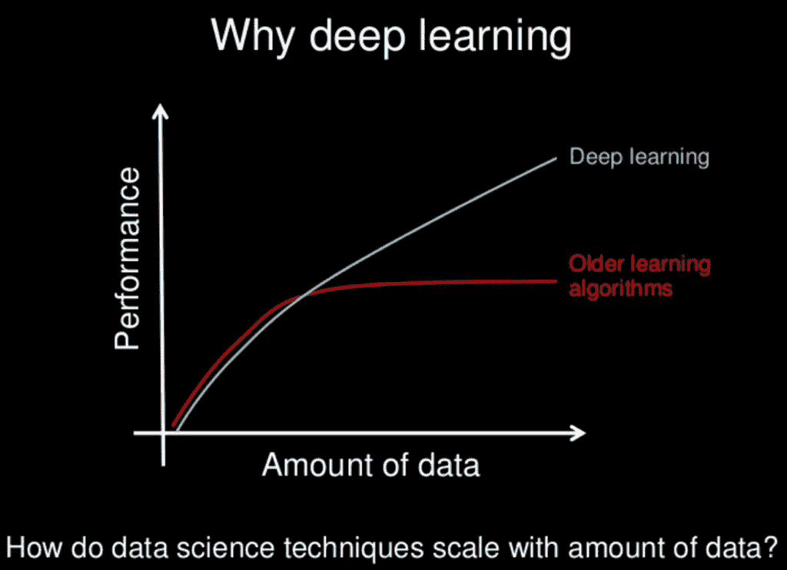
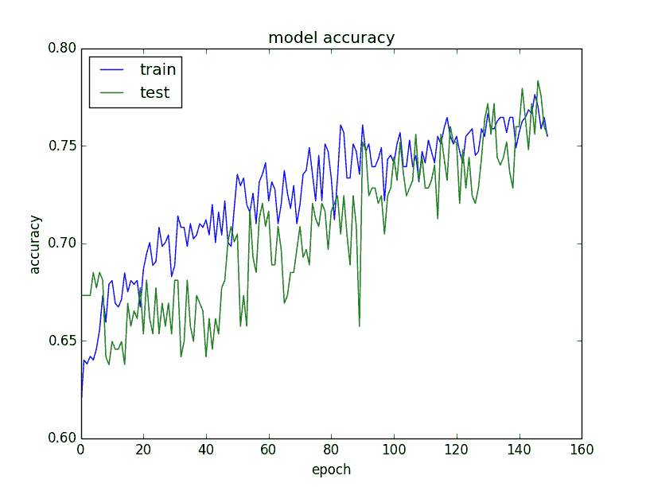

# 如何提高深度学习表现

> 原文：<https://machinelearningmastery.com/improve-deep-learning-performance/>

最后更新于 2019 年 8 月 6 日

### *20 个技巧、窍门和技巧，你可以用来
对抗过度训练，获得更好的概括*

如何从深度学习模式中获得更好的表现？

这是我被问到的最常见的问题之一。

可以这样问:

> 如何提高准确率？

…也可以反过来说:

> 神经网络表现不好怎么办？

我经常用“*回复，不太清楚，但是有很多想法。*”

然后我会列出我能想到的所有可能提升表现的想法。

我决定把我所有的想法都写在这篇文章里，而不是再写一遍那个列表。

这些想法不仅能帮助你进行深度学习，还能真正帮助任何机器学习算法。

**用我的新书[更好的深度学习](https://machinelearningmastery.com/better-deep-learning/)启动你的项目**，包括*分步教程*和所有示例的 *Python 源代码*文件。

这是一个很大的帖子，你可能想把它做成书签。

如何提高深度学习表现
佩德罗·里贝罗·西莫斯摄，版权所有。

## 提高算法表现的思路

这个想法列表并不完整，但它是一个很好的开始。

我的目标是给你很多想法去尝试，希望是一两个你没有想到的想法。

你通常只需要一个好主意就能成功。

如果你从其中一个想法中得到结果，请在评论中告诉我。
我很想听听！

如果你还有一个想法或其中一个想法的延伸，让我知道，我和所有读者都会受益！这可能只是帮助其他人获得突破的一个想法。

我将列表分为 4 个子主题:

1.  ***用数据提升表现。**T3】*
2.  ***通过算法提高表现。**T3】*
3.  ***通过算法调整提高表现。**T3】*
4.  ***通过集成提高表现。**T3】*

收益往往越低越小。例如，一个新的问题框架或更多的数据通常会给你更多的回报，而不是调整你的最佳算法的参数。不一定，但总的来说。

我在博客中加入了许多教程的链接，相关网站的问题以及经典的[神经网络常见问题解答](ftp://ftp.sas.com/pub/neural/FAQ.html)上的问题。

有些想法是针对人工神经网络的，但许多是非常笼统的。足够一般，你可以用它们来激发用其他技术提高你的表现的想法。

让我们开始吧。

## 1.利用数据提高表现

通过更改您的培训数据和问题定义，您可以获得巨大的成功。也许即使是最大的赢家。

以下是我们将要介绍的内容的简短列表:

1.  获取更多数据。
2.  发明更多数据。
3.  重新缩放您的数据。
4.  转换您的数据。
5.  特征选择。

### 1)获取更多数据

你能得到更多的训练数据吗？

模型的质量通常受到训练数据质量的限制。你想要你能为你的问题得到的最好的数据。

你也想要很多。

深度学习和其他现代非线性机器学习技术随着数据的增加而变得更好。特别是深度学习。这是让深度学习如此令人兴奋的要点之一。

看看下面这幅漫画:

为什么是深度学习？
幻灯片由吴恩达制作，版权所有。

更多的数据并不总是有帮助，但它可以。如果给我选择的机会，我将获得更多关于它提供的可选性的数据。

相关:

*   [算法上的数据集](https://www.edge.org/response-detail/26587)

### 2)发明更多数据

深度学习算法通常在有更多数据的情况下表现更好。

我们在最后一节提到了这一点。

如果你不能合理地获得更多的数据，你可以发明更多的数据。

*   如果你的数据是数字向量，创建现有向量的随机修改版本。
*   如果您的数据是图像，请创建现有图像的随机修改版本。
*   如果你的数据是文本，你就明白了…

这通常被称为[数据扩充](https://machinelearningmastery.com/how-to-configure-image-data-augmentation-when-training-deep-learning-neural-networks/)或数据生成。

您可以使用生成模型。你也可以使用简单的技巧。

例如，使用照片图像数据，您可以通过随机移动和旋转现有图像来获得巨大的收益。如果在新数据中预期会有这种转换，那么它将提高模型对数据中这种转换的泛化能力。

这也与添加噪声有关，我们过去称之为添加抖动。它可以像正则化方法一样抑制训练数据集的过拟合。

相关:

*   [利用 Keras 进行深度学习的图像扩充](https://machinelearningmastery.com/image-augmentation-deep-learning-keras/)
*   [什么是抖动？(带噪音训练)](ftp://ftp.sas.com/pub/neural/FAQ3.html#A_jitter)

### 3)重新缩放您的数据

这是速战速决。

使用神经网络时，传统的经验法则是:

将您的数据重新缩放到激活函数的范围内。

如果您正在使用 sigmoid 激活函数，请将您的数据重新缩放到 0 到-1 之间的值。如果使用双曲正切(tanh)，请重新缩放至-1 到 1 之间的值。

这适用于输入(x)和输出(y)。例如，如果输出层上有一个 sigmoid 来预测二进制值，则将 y 值规范化为二进制。如果你正在使用 softmax，你仍然可以从 y 值正常化中获益。

这仍然是一个很好的经验法则，但我会更进一步。

我建议您创建几个不同版本的训练数据集，如下所示:

*   归一化为 0 到 1。
*   重新调整为-1 比 1。
*   标准化。

然后评估你的模型在每个方面的表现。挑一个，然后加倍。

如果你改变激活功能，重复这个小实验。

在你的网络中积累的大价值并不好。此外，还有其他方法可以让网络中的数字保持较小，例如标准化激活和权重，但我们将在稍后查看这些技术。

相关:

*   [我应该标准化输入变量(列向量)吗？](ftp://ftp.sas.com/pub/neural/FAQ2.html#A_std)
*   [如何用 Sklearn 为 Python 机器学习准备数据](https://machinelearningmastery.com/prepare-data-machine-learning-python-Sklearn/)

### 4)转换您的数据

与上面建议的重新缩放相关，但工作更多。

你必须真正了解你的数据。想象一下。寻找异常值。

猜测每列的单变量分布。

*   如果一个列看起来像一个偏斜的高斯，考虑用 Box-Cox 变换来调整偏斜。
*   一列看起来像指数分布吗，考虑一个对数变换。
*   一个专栏看起来有一些特色吗，但是它们被一些明显的东西打败了，试着平方，或者平方根。
*   你能使一个特征离散或以某种方式装仓以更好地强调某个特征吗？

依靠你的直觉。尝试一下。

*   你能用像 PCA 这样的投影方法对数据进行预处理吗？
*   可以将多个属性聚合成一个值吗？
*   你能用一个新的布尔标志揭示这个问题的一些有趣的方面吗？
*   你能以其他方式探索时间或其他结构吗？

神经网络执行特征学习。他们可以做这些事情。

但是，如果你能更好地将问题的结构暴露给网络学习，他们也会更快地学习一个问题。

抽查数据或特定属性的许多不同转换，看看哪些有效，哪些无效。

相关:

*   [如何定义你的机器学习问题](https://machinelearningmastery.com/how-to-define-your-machine-learning-problem/)
*   [发现特征工程，如何工程化特征以及如何擅长](https://machinelearningmastery.com/discover-feature-engineering-how-to-engineer-features-and-how-to-get-good-at-it/)
*   [如何用 Sklearn 为 Python 机器学习准备数据](https://machinelearningmastery.com/prepare-data-machine-learning-python-Sklearn/)

### 5)特征选择

神经网络通常对不相关的数据具有鲁棒性。

他们将使用一个接近于零的权重，将非预测属性的贡献排除在外。

尽管如此，数据、权重和训练周期并不需要用来做出好的预测。

您能从数据中删除一些属性吗？

有很多特征选择方法和特征重要性方法可以让你知道要保留的特征和要引导的特征。

尝尝。全部试试。想法就是得到想法。

同样，如果你有时间，我会建议你用相同的网络评估几个不同的“观点”，看看它们是如何表现的。

*   也许你可以用更少的功能做得同样好或更好。耶，快点！
*   也许所有的特征选择方法都引导相同的特定特征子集。耶，关于无用功能的共识。
*   也许一个选定的子集给了你一些关于你可以执行的进一步特征工程的想法。耶，更多的想法。

相关:

*   [特征选择介绍](https://machinelearningmastery.com/an-introduction-to-feature-selection/)
*   [Python 中机器学习的特征选择](https://machinelearningmastery.com/feature-selection-machine-learning-python/)

### 6)重构你的问题

远离你的问题。

你收集的观察结果是你提出问题的唯一方法吗？

也许还有别的办法。也许这个问题的其他框架能够更好地向学习器展示你的问题结构。

我真的很喜欢这个练习，因为它迫使你敞开心扉。这很难。尤其是如果你被投资了(自负！！！，时间，金钱)。

即使你只是列出 3 到 5 个备选框架并对它们进行折扣，至少你正在建立对所选方法的信心。

*   也许你可以在一个窗口或者一个允许时间步长的方法中加入时间元素。
*   也许你的分类问题可以变成回归问题，或者反过来。
*   也许你的二进制输出可以变成 softmax 输出？
*   也许你可以用一个子问题来代替。

在拿起工具之前仔细考虑问题是一个好主意，也是可能的，因为你对解决方案的投资较少。

然而，如果你被卡住了，这一个简单的练习可以提供一个思路。

此外，你不必扔掉你以前的任何作品。稍后参见集成部分。

相关:

*   [如何定义你的机器学习问题](https://machinelearningmastery.com/how-to-define-your-machine-learning-problem/)

## 2.通过算法提高表现

机器学习是关于算法的。

所有的理论和数学描述了从数据中学习决策过程的不同方法(如果我们把自己局限于预测建模的话)。

你为你的问题选择了深度学习。这真的是你能选择的最好的技术吗？

在这一节中，我们将在下一步深入探讨如何从您选择的深度学习方法中获得最大收益之前，仅涉及一些关于算法选择的想法。

这是一份简短的清单

1.  抽查算法。
2.  从文学中窃取。
3.  重采样方法。

我们开始吧。

### 1)抽查算法

振作起来。

你不能事先知道哪种算法在你的问题上表现最好。

如果你知道，你可能不需要机器学习。

你收集了什么证据证明你选择的方法是一个好的选择？

让我们把这个难题翻过来。

当对所有可能的问题进行平均时，没有任何一种算法的表现比其他算法更好。所有算法都是平等的。这是对[无免费午餐定理](https://en.wikipedia.org/wiki/No_free_lunch_theorem)的发现的总结。

**可能你选择的算法对你的问题不是最好的。**

现在，我们并没有试图解决所有可能的问题，但是算法领域的新热点可能不是您特定数据集上的最佳选择。

我的建议是收集证据。想象有其他好的算法，并给他们一个公平的机会来解决你的问题。

抽查一套最好的方法，看看哪个好，哪个不好。

*   评估一些线性方法，如逻辑回归和线性判别分析。
*   评估一些树的方法，如 CART，随机森林和梯度提升。
*   评估一些实例方法，如 SVM 和 kNN。
*   评估其他一些神经网络方法，如 LVQ、MLP、美国有线电视新闻网、LSTM、混血儿等。

加倍关注表现最好的人，并通过进一步调整或数据准备来提高他们的机会。

根据您选择的深度学习方法对结果进行排名，它们如何比较？

也许你可以放弃深度学习模式，用简单得多、速度快得多的东西去训练，甚至是容易理解的东西。

相关:

*   [数据驱动的机器学习方法](https://machinelearningmastery.com/a-data-driven-approach-to-machine-learning/)
*   [为什么你应该在你的机器学习问题上抽查算法](https://machinelearningmastery.com/why-you-should-be-spot-checking-algorithms-on-your-machine-learning-problems/)
*   [用 Sklearn 抽查 Python 中的分类机器学习算法](https://machinelearningmastery.com/spot-check-classification-machine-learning-algorithms-python-Sklearn/)

### 2)从文学中窃取

挑选好方法的一个很好的捷径，就是从文学中窃取思想。

还有谁研究过像你这样的问题，他们用了什么方法。

查看论文、书籍、博客文章、问答网站、教程，谷歌扔给你的所有东西。

写下所有的想法，然后一路走来。

这不是关于复制研究，而是关于你没有想到的可能提升你表现的新想法。

**发表的研究高度优化**。

有很多聪明人写了很多有趣的东西。为你需要的掘金挖掘这个伟大的图书馆。

相关:

*   [如何研究机器学习算法](https://machinelearningmastery.com/how-to-research-a-machine-learning-algorithm/)
*   [谷歌学术](http://scholar.google.com)

### 3)重采样方法

你必须知道你的模型有多好。

你对模型表现的估计可靠吗？

深度学习方法训练缓慢。

这通常意味着我们不能使用黄金标准方法来估计模型的表现，例如 k 倍交叉验证。

*   也许你正在使用一个简单的训练/测试分割，这是非常常见的。如果是这样，您需要确保分割代表问题。单变量统计和可视化是一个好的开始。
*   也许你可以利用硬件来提高估计值。例如，如果您有一个集群或亚马逊网络服务帐户，我们可以并行训练*n*-模型，然后取结果的平均值和标准差，以获得更稳健的估计。
*   也许您可以使用一个验证等待集来了解模型训练时的表现(对于提前停止很有用，请参见后面的内容)。
*   也许您可以保留一个完全盲目的验证集，只有在执行了模型选择之后才使用它。

反过来，也许你可以缩小数据集，使用更强的重采样方法。

*   与在整个数据集上训练的模型相比，在训练数据集的样本上训练的模型的表现可能有很强的相关性。也许您可以使用较小的数据集来执行模型选择和优化，然后在最后将最终技术扩展到整个数据集。
*   也许你可以约束数据集，获取一个样本，并将其用于所有的模型开发。

**你必须对你的模型的表现评估有完全的信心。**

相关:

*   [评估 Keras 中深度学习模型的表现](https://machinelearningmastery.com/evaluate-performance-deep-learning-models-keras/)
*   [使用重采样评估 Python 中机器学习算法的表现](https://machinelearningmastery.com/evaluate-performance-machine-learning-algorithms-python-using-resampling/)

## 3.通过算法调整提高表现

肉在这里。

您通常可以通过抽查快速发现一两个表现良好的算法。从这些算法中获得最大收益可能需要几天、几周或几个月的时间。

这里有一些关于调整你的神经网络算法的想法，以便从中获得更多。

1.  诊断。
2.  重量初始化。
3.  学习率。
4.  激活功能。
5.  网络拓扑。
6.  批次和时代。
7.  正规化。
8.  优化和损失。
9.  提前停止。

您可能需要多次(3-10 次或更多次)训练网络的给定“配置”，以获得对配置表现的良好估计。这可能适用于本节中您可以调整的所有方面。

关于超参数优化的好文章，请参阅:

*   [如何用 Keras 在 Python 中网格搜索深度学习模型的超参数](https://machinelearningmastery.com/grid-search-hyperparameters-deep-learning-models-python-keras/)

### 1)诊断

如果你知道为什么表现不再提高，你会得到更好的表现。

你的模型是适配过度还是适配不足？

**永远记住这个问题。一直都是。**

它会做这样或那样的事情，只是程度不同。

深入了解模型学习行为的一个快速方法是在每个[时期](https://machinelearningmastery.com/difference-between-a-batch-and-an-epoch/)的训练和验证数据集上对其进行评估，并绘制结果。

训练和验证数据集上的模型准确率图

*   如果训练比验证集好得多，那么你可能是过拟合了，你可以使用正则化之类的技术。
*   如果训练和验证都很低，你可能是适应不足，你可能会增加你的网络容量，训练更多或更长时间。
*   如果当训练超过验证时出现拐点，你可以使用提前停止。

经常创建这些图，并研究它们，以便深入了解可以用来提高表现的不同技术。

**这些图可能是你能创建的最有价值的诊断。**

另一个有用的诊断是研究网络对与错的观察。

在一些问题上，这可以给你一些尝试的想法。

*   也许你需要更多或更多的难以训练的例子。
*   也许您可以移除训练数据集中易于建模的大样本。
*   也许你可以使用专门的模型，专注于输入空间的不同清晰区域。

有关系的

*   [在 Keras 中显示深度学习模型训练历史](https://machinelearningmastery.com/display-deep-learning-model-training-history-in-keras/)
*   [用机器学习算法进行过拟合和欠拟合](https://machinelearningmastery.com/overfitting-and-underfitting-with-machine-learning-algorithms/)

### 2)权重初始化

经验法则曾经是:

> 使用小随机数初始化。

实际上，这可能还是足够好的。但是这对你的网络来说是最好的吗？

对于不同的激活函数也有启发式，但我不记得在实践中看到过多少不同。

保持网络固定，尝试每种初始化方案。

请记住，权重是您试图找到的模型的实际参数。有许多组权重可以提供良好的表现，但是您想要更好的表现。

*   尝试所有不同的初始化方法，看看在所有其他方法保持不变的情况下，一种方法是否更好。
*   尝试使用自动编码器等无监督方法进行预学习。
*   试着采用一个现有的模型，为你的问题重新训练一个新的输入输出层([转移学习](https://machinelearningmastery.com/how-to-use-transfer-learning-when-developing-convolutional-neural-network-models/))。

请记住，改变权重初始化方法与激活函数甚至优化函数密切相关。

有关系的

*   [深度网络初始化](http://deepdish.io/2015/02/24/network-initialization/)

### 3)学习率

调整[学习率](https://machinelearningmastery.com/learning-rate-for-deep-learning-neural-networks/)通常是有回报的。

以下是一些值得探索的想法:

*   用非常大和非常小的学习率进行实验。
*   网格从文献中搜索常见的学习率值，看看你能把网络推多远。
*   尝试一种随着时代而降低的学习速度。
*   尝试一种学习率，将每个固定数量的时代降低一个百分比。
*   尝试添加动量项，然后将网格搜索学习率和动量结合起来。

更大的网络需要更多的训练，反之亦然。如果你增加更多的神经元或更多的层，增加你的学习率。

学习率与训练时期的数量、[批量](https://machinelearningmastery.com/difference-between-a-batch-and-an-epoch/)和优化方法相耦合。

相关:

*   [用 Keras 在 Python 中为深度学习模型使用学习率计划](https://machinelearningmastery.com/using-learning-rate-schedules-deep-learning-models-python-keras/)
*   [反向钻取应该使用什么学习率？](ftp://ftp.sas.com/pub/neural/FAQ2.html#A_learn_rate)

### 4)激活功能

你可能应该使用整流器激活功能。

他们只是工作得更好。

在此之前，它是 sigmoid 和 tanh，然后是输出层的 softmax、linear 或 sigmoid。除非你知道自己在做什么，否则我不建议你尝试更多。

尝试这三种方法，重新调整数据以满足函数的限制。

显然，您希望为输出形式选择正确的传递函数，但请考虑探索不同的表示形式。

例如，对于回归问题，将二分类的 sigmoid 切换为线性，然后对输出进行后处理。这可能还需要将损失函数更改为更合适的值。有关这些方面的更多想法，请参见数据转换部分。
相关:

*   [为什么要使用激活功能？](ftp://ftp.sas.com/pub/neural/FAQ2.html#A_act)

### 5)网络拓扑

网络结构的改变会有回报。

你需要多少层和多少个神经元？

没人知道。没有人。别问了。

你必须为你的问题找到一个好的配置。实验。

*   尝试一个有很多神经元的隐藏层(宽)。
*   尝试每层神经元很少的深层网络(深层)。
*   尝试以上的组合。
*   尝试最近关于类似问题的论文中的架构。
*   从书籍和论文中尝试拓扑模式(先扇出后进入)和经验法则(见下面的链接)。

这很难。更大的网络有更强的代表性，也许你需要它。

更多的层为从数据中学习到的抽象特征的分层重组提供了更多的机会。也许你需要这个。

后来的网络需要更多的训练，无论是在时代还是在学习速度上。相应调整。
相关:

这些链接会给你很多尝试的想法，它们确实适合我。

*   [我应该使用多少隐藏层？](ftp://ftp.sas.com/pub/neural/FAQ3.html#A_hl)
*   [我应该使用多少隐藏单位？](ftp://ftp.sas.com/pub/neural/FAQ3.html#A_hu)

### 6)批次和时代

批次大小定义了梯度和更新权重的频率。[一个纪元就是将整个训练数据](https://machinelearningmastery.com/difference-between-a-batch-and-an-epoch/)逐批暴露给网络。

你试验过不同的[批量和时代数量](https://machinelearningmastery.com/difference-between-a-batch-and-an-epoch/)吗？

以上，我们已经评论了学习率、网络规模和时代之间的关系。

在现代深度学习实现中，具有大时期大小和大量训练时期的小批量是常见的。

这可能会也可能不会解决你的问题。收集证据看看。

*   尝试批处理大小等于训练数据大小，内存取决于(批处理学习)。
*   尝试一个批量(在线学习)。
*   尝试不同小批量(8、16、32、…)的网格搜索。
*   试着为几个时代和很多个时代进行训练。

考虑几乎无限数量的时期和设置检查点，以获取迄今为止表现最好的模型，请进一步查看。

一些网络体系结构比其他网络体系结构对批量更敏感。我认为多层感知器通常对批量很敏感，而 LSTM 和 CNN 相当敏感，但这只是传闻。

有关系的

*   [什么是批量、增量、在线…学习？](ftp://ftp.sas.com/pub/neural/FAQ2.html#A_styles)
*   [直观来看，小批量如何影响(随机)梯度下降的表现？](https://www.quora.com/Intuitively-how-does-mini-batch-size-affect-the-performance-of-stochastic-gradient-descent)

### 7)正规化

正则化是抑制训练数据过拟合的一个很好的方法。

热门的新正则化技术是[辍](https://machinelearningmastery.com/dropout-for-regularizing-deep-neural-networks/)，你试过吗？

drop 在训练过程中随机跳过神经元，迫使层中的其他人捡起松弛部分。简单有效。从丢弃开始。

*   网格搜索不同的丢弃率。
*   实验输入层、隐藏层和输出层的压降。

丢弃的想法也有延伸，你也可以玩像[下降连接](http://cs.nyu.edu/~wanli/dropc/)。

还要考虑其他更传统的神经网络正则化技术，例如:

*   重量衰减惩罚大重量。
*   激活约束，惩罚大量激活。

尝试可以处罚的不同方面和可以适用的不同类型的处罚(L1、L2，两者都有)。

相关:

*   [基于 Keras 的深度学习模型中的丢弃正则化](https://machinelearningmastery.com/dropout-regularization-deep-learning-models-keras/)
*   [什么是重量衰减？](ftp://ftp.sas.com/pub/neural/FAQ3.html#A_decay)

### 8)优化和损失

以前是随机梯度下降，现在有很多优化器。

你试验过不同的优化程序吗？

默认为随机梯度下降。先充分利用它，有不同的学习率、动力和学习率时间表。

许多更高级的优化方法提供了更多的参数、更多的复杂性和更快的收敛速度。这是好是坏，取决于你的问题。

为了最大限度地利用给定的方法，您确实需要深入了解每个参数的含义，然后网格搜索不同的值来解决您的问题。辛苦了。耗时。可能会有回报。

我发现较新/流行的方法可以更快地收敛，并快速了解给定网络拓扑的功能，例如:

*   [亚当](https://arxiv.org/abs/1412.6980)
*   RMSprop

您还可以探索其他优化算法，例如更传统的(Levenberg-Marquardt)和不太传统的(遗传算法)。其他方法可以为 SGD 和朋友提供很好的提炼起点。

要优化的损失函数可能与您试图解决的问题密切相关。

尽管如此，你经常有一些回旋余地(MSE 和 MAE 用于回归等)。)你可能会因为换出问题上的损失函数而受到小小的冲击。这也可能与您的输入数据的规模和正在使用的激活功能有关。

相关:

*   [梯度下降优化算法概述](http://sebastianruder.com/optimizing-gradient-descent/)
*   [什么是共轭梯度，Levenberg-Marquardt 等。？](ftp://ftp.sas.com/pub/neural/FAQ2.html#A_numanal)
*   [论深度学习的优化方法](http://ai.stanford.edu/~ang/papers/icml11-OptimizationForDeepLearning.pdf)，2011 [PDF]

### 9)提前停止

一旦表现开始下降，您就可以停止学习。

这可以节省大量时间，甚至可以让您使用更复杂的重采样方法来评估模型的表现。

提前停止是一种抑制训练数据过拟合的正则化类型，要求您在每个时期监控模型在训练和持有的验证数据集上的表现。

一旦验证数据集的表现开始下降，就可以停止训练。

如果满足此条件(测量准确率损失)，您也可以设置检查点来保存模型，并允许模型继续学习。

Checkpointing 允许你在不停止的情况下提前停止，让你在跑步结束时有几个模型可以选择。

相关:

*   [如何在 Keras 中检查点深度学习模型](https://machinelearningmastery.com/check-point-deep-learning-models-keras/)
*   [什么是早停？](ftp://ftp.sas.com/pub/neural/FAQ3.html#A_stop)

## 4.使用集成提高表现

您可以组合来自多个模型的预测。

算法调优后，这是下一个大的改进领域。

事实上，您通常可以通过组合来自多个“足够好”的模型的预测来获得良好的表现，而不是来自多个高度调优(和脆弱)的模型。

我们将介绍三个您可能需要考虑的总体领域:

1.  组合模型。
2.  组合视图。
3.  堆叠。

### 1)组合模型

不要选择一个模型，把它们结合起来。

如果您有多个不同的深度学习模型，每个模型在问题上都表现良好，请通过取平均值来组合它们的预测。

型号越不同越好。例如，您可以使用非常不同的网络拓扑或不同的技术。

如果每个模型都很有技巧，但方式不同，集成预测将更加稳健。

或者，你可以尝试相反的姿势。

每次训练网络时，用不同的权重初始化它，它就会收敛到一组不同的最终权重。多次重复这个过程来创建许多网络，然后组合这些网络的预测。

他们的预测将高度相关，但它可能会让你对那些更难预测的模式有一个小小的冲击。

相关:

*   [用 Sklearn 集成 Python 中的机器学习算法](https://machinelearningmastery.com/ensemble-machine-learning-algorithms-python-Sklearn/)
*   [如何提高机器学习效果](https://machinelearningmastery.com/how-to-improve-machine-learning-results/)

### 2)组合视图

如上所述，但是针对您的问题的不同观点或框架来训练每个网络。

同样，目标是要有技巧性的模型，但方式不同(例如，不相关的预测)。

您可以依靠上面数据部分中列出的非常不同的缩放和转换技术来获得想法。

用于训练不同模型的问题的变换和框架越不同，你的结果就越有可能得到改善。

使用简单的预测手段将是一个良好的开端。

### 3)堆叠

您还可以学习如何最好地组合来自多个模型的预测。

这就是所谓的堆叠概括或简称堆叠。

通常，使用简单的线性方法，比如学习如何加权不同模型的预测的正则化回归，可以得到比平均预测更好的结果。

基线重用使用子模型预测的平均值，但使用模型的已知权重提升表现。

*   [堆叠概括(堆叠)](https://machinelearningmastery.com/stacking-ensemble-for-deep-learning-neural-networks/)

## 结论

你成功了。

### 额外资源

有很多好的资源，但很少有人把所有的想法联系在一起。

我将列出一些资源和相关的帖子，如果你想更深入地探讨，你可能会觉得有趣。

*   [神经网络常见问题](ftp://ftp.sas.com/pub/neural/FAQ.html)
*   [如何用 Keras 在 Python 中网格搜索深度学习模型的超参数](https://machinelearningmastery.com/grid-search-hyperparameters-deep-learning-models-python-keras/)
*   [必须知道深层神经网络的技巧/诀窍](http://lamda.nju.edu.cn/weixs/project/CNNTricks/CNNTricks.html)
*   [如何用深度神经网络提高验证准确率？](https://stackoverflow.com/questions/37020754/how-to-increase-validation-accuracy-with-deep-neural-net)

知道好的资源吗？让我知道，留下评论。

### 处理压倒性优势

这是一个很大的帖子，我们已经覆盖了很多领域。

你不需要做所有的事情。你只需要一个好主意就能提升表现。

下面是如何处理压倒性的:

1.  选择一组
    1.  数据。
    2.  算法。
    3.  调谐。
    4.  全体
2.  从组中选择一种方法。
3.  从选择的方法中选择一个来尝试。
4.  比较结果，如果有改进就保留。
5.  重复一遍。

### 分享你的成果

你觉得这个帖子有用吗？

你有没有想到一个有所不同的想法或方法？

让我知道，留言评论！我很想听听这件事。