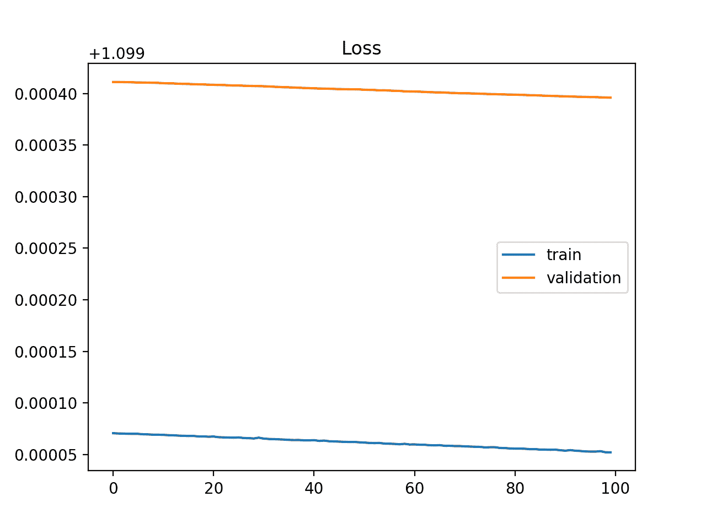
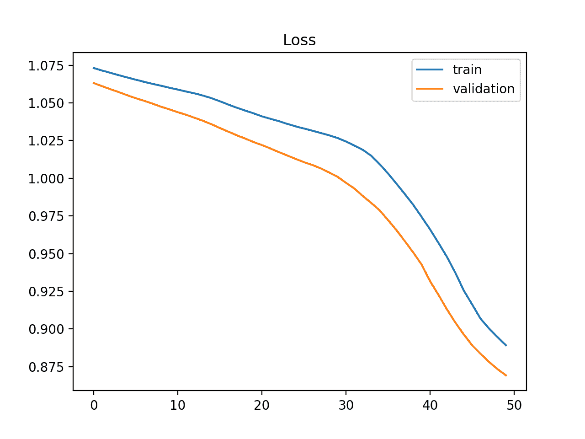
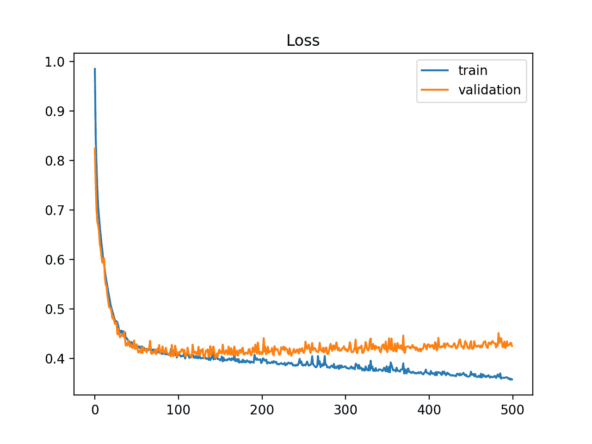
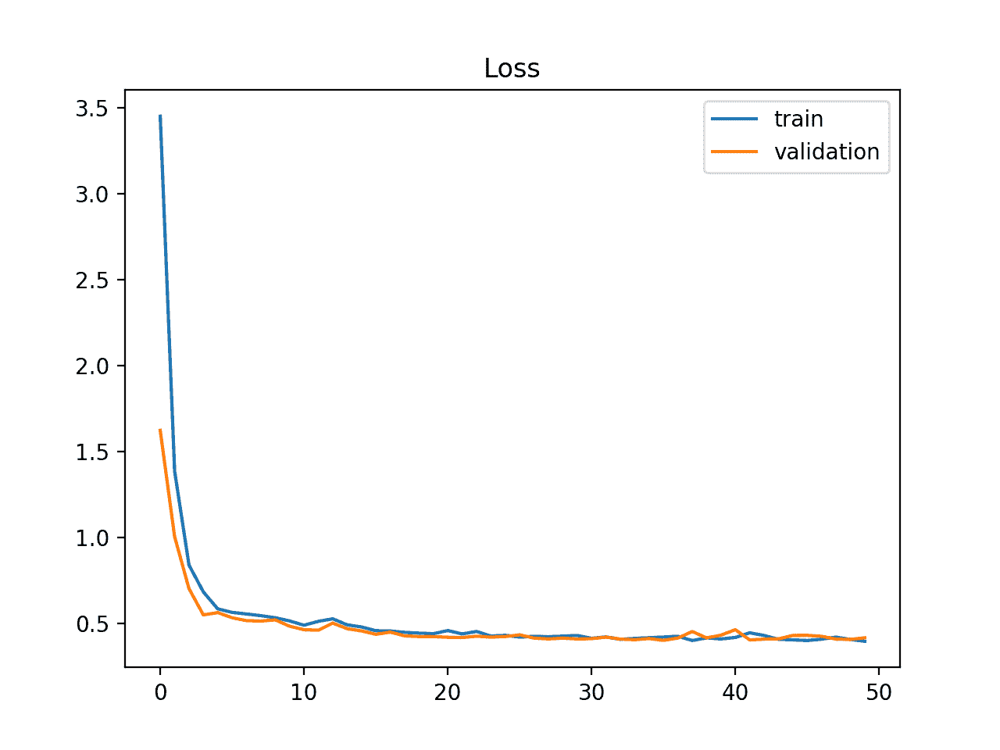
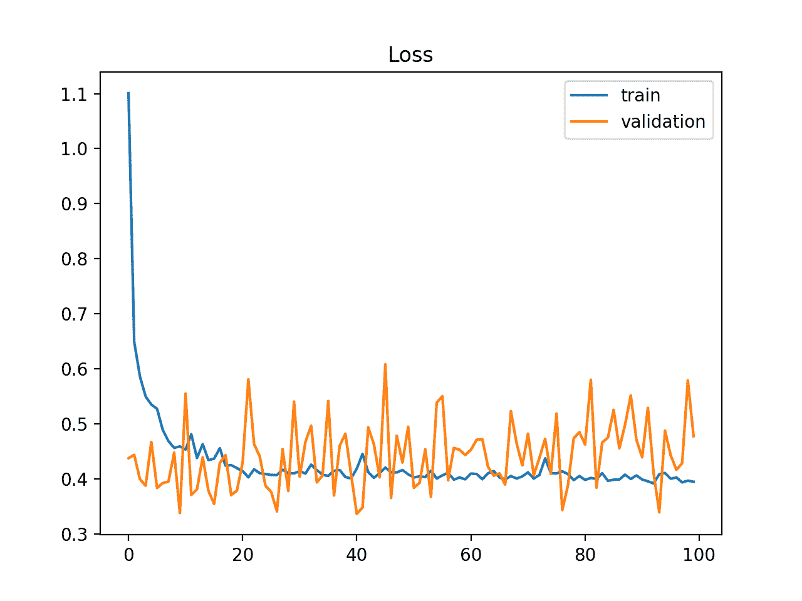
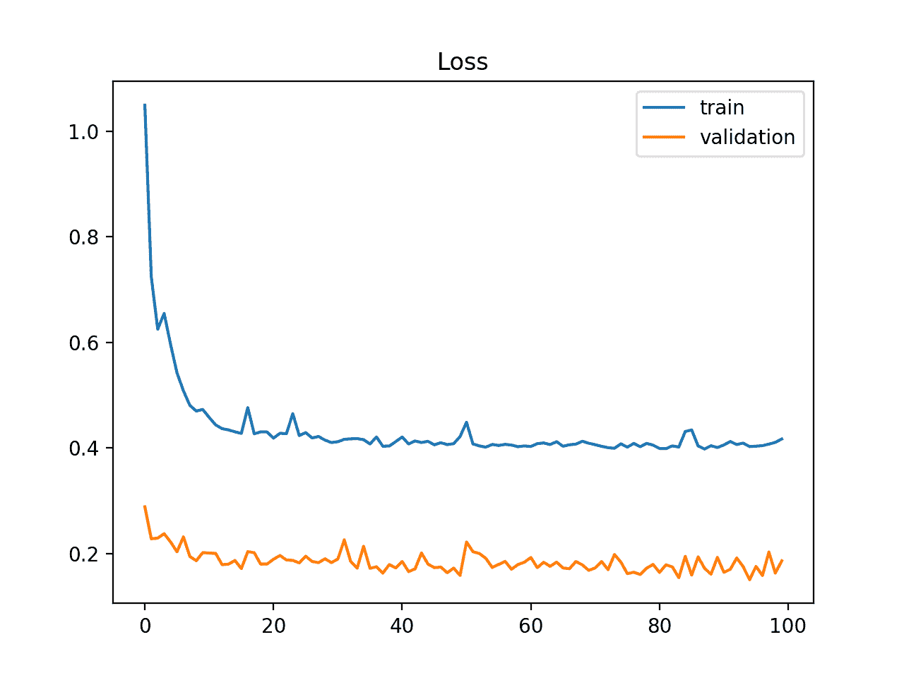

# 如何利用学习曲线诊断机器学习模型表现

> 原文：<https://machinelearningmastery.com/learning-curves-for-diagnosing-machine-learning-model-performance/>

最后更新于 2019 年 8 月 6 日

学习曲线是模型学习表现随经验或时间的变化图。

学习曲线是机器学习中广泛使用的诊断工具，用于从训练数据集增量学习的算法。在训练期间每次更新之后，可以在训练数据集和等待验证数据集上评估模型，并且可以创建测量表现的图来显示学习曲线。

在训练期间检查模型的学习曲线可以用于诊断学习问题，例如欠训练或过训练模型，以及训练和验证数据集是否具有适当的代表性。

在这篇文章中，你将发现学习曲线，以及它们如何用于诊断机器学习模型的学习和泛化行为，示例图显示了常见的学习问题。

看完这篇文章，你会知道:

*   学习曲线是根据经验显示学习表现随时间变化的图表。
*   训练和验证数据集中模型表现的学习曲线可用于诊断欠拟合、过拟合或拟合良好的模型。
*   模型表现的学习曲线可用于诊断训练或验证数据集是否相对不代表问题领域。

**用我的新书[更好的深度学习](https://machinelearningmastery.com/better-deep-learning/)启动你的项目**，包括*分步教程*和所有示例的 *Python 源代码*文件。

我们开始吧。

用于诊断深度学习模型表现的学习曲线的温和介绍
图片由[迈克·萨瑟兰](https://www.flickr.com/photos/156015048@N08/35232886531/)提供，保留部分权利。

## 概观

本教程分为三个部分；它们是:

1.  学习曲线
2.  诊断模型行为
3.  诊断不具代表性的数据集

## 机器学习中的学习曲线

一般来说，学习曲线是在 x 轴上显示时间或经验，在 y 轴上显示学习或进步的曲线。

> 学习曲线(LCs)被认为是监测接触新任务的工人表现的有效工具。LCs 提供了随着任务重复发生而发生的学习过程的数学表示。

——[学习曲线模型及应用:文献综述及研究方向](https://www.sciencedirect.com/science/article/abs/pii/S016981411100062X)，2011。

例如，如果你正在学习一种乐器，你在乐器上的技能可以被评估，并在一年内每周分配一个数字分数。这 52 周的分数图是一条学习曲线，显示了你对乐器的学习是如何随着时间的推移而变化的。

*   **学习曲线**:学习(y 轴)对经验(x 轴)的线图。

学习曲线在机器学习中被广泛用于随时间递增学习(优化其内部参数)的算法，例如深度学习神经网络。

用于评估学习的指标可能是最大化，这意味着更好的分数(更大的数字)表明更多的学习。分类准确性就是一个例子。

更常见的是使用最小化的分数，例如损失或错误，由此更好的分数(更小的数字)表示更多的学习，值 0.0 表示训练数据集被完美地学习并且没有出错。

在机器学习模型的训练期间，可以评估在训练算法的每个步骤中模型的当前状态。可以在训练数据集上对其进行评估，以给出模型学习*有多好的想法也可以在不属于训练数据集的保留验证数据集上对其进行评估。对验证数据集的评估给出了该模型概括的“T2”程度的概念*

 **   **训练学习曲线**:从训练数据集中计算出的学习曲线，给出模型学习效果的概念。
*   **验证学习曲线**:学习曲线是从一个搁置的验证数据集计算出来的，该数据集给出了模型推广程度的概念。

在训练和验证数据集的训练过程中，为机器学习模型创建双重学习曲线是很常见的。

在某些情况下，为多个度量创建学习曲线也是常见的，例如在分类预测建模问题的情况下，其中模型可以根据交叉熵损失进行优化，并且使用分类准确率来评估模型表现。在这种情况下，会创建两个图，一个用于每个指标的学习曲线，每个图可以显示两条学习曲线，一条用于每个训练和验证数据集。

*   **优化学习曲线**:根据模型参数优化的度量计算的学习曲线，例如损耗。
*   **表现学习曲线**:根据评估和选择模型的指标计算的学习曲线，例如准确率。

现在我们已经熟悉了学习曲线在机器学习中的使用，让我们看看在学习曲线图中观察到的一些常见形状。

## 诊断模型行为

学习曲线的形状和动态可以用于诊断机器学习模型的行为，并且反过来可能建议可以进行的配置改变的类型，以改进学习和/或表现。

在学习曲线中，你可能会观察到三种常见的动态；它们是:

*   在它下面。
*   吃多了。
*   很合身。

我们将通过示例仔细研究每一个。这些例子将假设我们看到的是一个最小化指标，这意味着 y 轴上较小的相对分数表示更多或更好的学习。

### 信息技术下学习曲线

欠拟合指的是无法学习训练数据集的模型。

> 当模型不能在训练集上获得足够低的误差值时，就会发生拟合不足。

—第 111 页，[深度学习](https://amzn.to/2SmfnCA)，2016。

只能从训练损失的学习曲线中识别欠信息技术模型。

它可能显示一条平坦的线或相对较高损失的噪声值，表明模型根本无法学习训练数据集。

下面提供了一个这样的例子，当模型不具备适合数据集复杂性的能力时，这种例子很常见。

显示容量不足模型的训练学习曲线示例

信息技术不足模型也可以通过训练损失来识别，训练损失正在减少，并在图的末尾继续减少。

这表明该模型能够进一步学习和可能的进一步改进，并且培训过程过早停止。

显示需要进一步培训的 it 不足模型的培训学习曲线示例

在以下情况下，学习曲线会显示拟合不足:

*   无论是否训练，训练损失都保持不变。
*   训练损失持续减少，直到训练结束。

### 过度学习曲线

过拟合是指模型对训练数据集的学习太好，包括训练数据集中的统计噪声或随机波动。

> …拟合更灵活的模型需要估计更多的参数。这些更复杂的模型可能会导致一种被称为过拟合数据的现象，这本质上意味着它们过于紧密地跟随误差或噪声。

—第 22 页，[统计学习导论:在 R](https://amzn.to/2SkKXAy) 中的应用，2013。

过拟合的问题是，模型对训练数据越专门化，它对新数据的泛化能力就越差，导致泛化误差增加。泛化误差的增加可以通过模型在验证数据集上的表现来衡量。

> 这是一个过拟合数据的例子，[……]。这是一种不理想的情况，因为所获得的拟合不会产生对不属于原始训练数据集的新观测值的响应的准确估计。

—第 24 页，[统计学习导论:在 R](https://amzn.to/2SkKXAy) 中的应用，2013。

如果模型的容量超过了问题所需的容量，这种情况经常发生，反过来，这种情况又会带来太多的灵活性。如果模型训练时间过长，也会出现这种情况。

在以下情况下，学习曲线会显示过拟合:

*   随着经验的积累，训练损失的情节会继续减少。
*   验证损失的曲线下降到一个点，然后又开始增加。

验证损失的拐点可能是训练可能停止的点，因为经验表明，在这个点之后会出现过拟合的动态。

下面的示例图演示了过拟合的情况。

显示过拟合模型的训练和验证学习曲线示例

### 良好拟合学习曲线

良好的拟合是学习算法的目标，存在于过拟合和欠拟合模型之间。

通过训练和验证损失确定良好的拟合，该损失降低到稳定点，两个最终损失值之间的差距最小。

在训练数据集上，模型的损失几乎总是低于验证数据集。这意味着我们应该预期训练和验证损失学习曲线之间会有一些差距。这种差距被称为“泛化差距”

在以下情况下，学习曲线图显示了良好的拟合:

*   训练损失的曲线下降到稳定点。
*   验证损失图下降到一个稳定点，与训练损失有一个小的差距。

持续的良好体能训练可能会导致过度训练。

下面的示例图展示了一个很好的例子。

显示良好拟合的训练和验证学习曲线示例

## 诊断不具代表性的数据集

学习曲线也可以用于诊断数据集的属性以及它是否相对有代表性。

不具有代表性的数据集是指可能无法捕获与来自同一领域的另一个数据集相关的统计特征的数据集，例如在训练数据集和验证数据集之间。相对于另一个数据集，如果一个数据集中的样本数量太少，通常会出现这种情况。

有两种常见情况可以观察到；它们是:

*   训练数据集相对不具有代表性。
*   验证数据集相对不具有代表性。

### 非代表性训练数据集

不具代表性的训练数据集意味着，相对于用于评估问题的验证数据集，训练数据集没有提供足够的信息来了解问题。

如果与验证数据集相比，训练数据集的示例太少，可能会出现这种情况。

这种情况可以通过显示改进的训练损失的学习曲线和显示改进的验证损失的学习曲线来识别，但是两条曲线之间仍然存在很大的差距。

训练和验证学习曲线示例显示了相对于验证数据集可能太小的训练数据集

### 非代表性验证数据集

不具代表性的验证数据集意味着验证数据集不能提供足够的信息来评估模型的泛化能力。

如果与训练数据集相比，验证数据集的示例太少，可能会出现这种情况。

这种情况可以通过看起来很适合(或其他适合)的训练损失的学习曲线和显示训练损失周围的噪声运动的验证损失的学习曲线来识别。

训练和验证学习曲线示例，显示了相对于训练数据集可能太小的验证数据集

也可以通过低于培训损失的验证损失来识别。在这种情况下，它表明验证数据集可能比训练数据集更易于模型预测。

显示比训练数据集更容易预测的验证数据集的训练和验证学习曲线示例

## 进一步阅读

如果您想更深入地了解这个主题，本节将提供更多资源。

### 书

*   [深度学习](https://amzn.to/2SmfnCA)，2016 年。
*   [统计学习导论:在 R](https://amzn.to/2SkKXAy) 中的应用，2013。

### 报纸

*   [学习曲线模型及应用:文献综述及研究方向](https://www.sciencedirect.com/science/article/abs/pii/S016981411100062X)，2011。

### 邮件

*   [如何诊断 LSTM 模型的过拟合和欠拟合](https://machinelearningmastery.com/diagnose-overfitting-underfitting-lstm-models/)
*   [用机器学习算法进行过拟合和欠拟合](https://machinelearningmastery.com/overfitting-and-underfitting-with-machine-learning-algorithms/)

### 文章

*   [学习曲线，维基百科](https://en.wikipedia.org/wiki/Learning_curve)。
*   [过拟合，维基百科](https://en.wikipedia.org/wiki/Overfitting)。

## 摘要

在这篇文章中，你发现了学习曲线，以及它们如何用于诊断机器学习模型的学习和泛化行为。

具体来说，您了解到:

*   学习曲线是根据经验显示学习表现随时间变化的图表。
*   训练和验证数据集中模型表现的学习曲线可用于诊断欠拟合、过拟合或拟合良好的模型。
*   模型表现的学习曲线可用于诊断训练或验证数据集是否相对不代表问题领域。

你有什么问题吗？
在下面的评论中提问，我会尽力回答。*