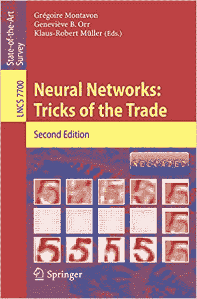

# 神经网络诀窍（书评）

> 原文：<https://machinelearningmastery.com/neural-networks-tricks-of-the-trade-review/>

最后更新于 2019 年 8 月 6 日

深度学习神经网络的配置和训练具有挑战性。

在数百篇研究论文、源代码以及学术界和从业者的头脑中，流传着几十年的技巧和诀窍。

《神经网络:交易技巧》一书最初于 1998 年出版，2012 年在深度学习复兴的风口浪尖上更新，将不同的技巧和诀窍结合成一册。它包括所有深度学习神经网络从业者必读的建议。

在这篇文章中，你会发现《神经网络:交易技巧》一书，该书为神经网络学者和从业者提供了如何最大限度地利用模型的建议。

看完这篇文章，你会知道:

*   为什么写这本书的动机。
*   第一版和第二版章节和主题的分类。
*   每个神经网络从业者必读章节的列表和摘要。

**用我的新书[更好的深度学习](https://machinelearningmastery.com/better-deep-learning/)启动你的项目**，包括*分步教程*和所有示例的 *Python 源代码*文件。

我们开始吧。

神经网络——交易技巧

## 概观

神经网络:交易技巧是关于从神经网络模型中获得更好表现的技术的论文集合。

[第一版](https://amzn.to/2SRyBBa)于 1998 年出版，由五部分 17 章组成。[第二版](https://amzn.to/2zwUmNM)是在 2012 年新的深度学习复兴的风口浪尖上出版的，包括另外三个部分和 13 个新章节。

如果你是一个深度学习的实践者，那么这是一本必读的书。

我拥有并参考了这两个版本。

## 动机

这本书的动机是整理经验和理论基础的提示、技巧和最佳实践，用于在实践中从神经网络模型中获得最佳表现。

作者担心的是，许多有用的提示和技巧是该领域的隐性知识，被困在人们的头脑、代码库或会议论文的末尾，该领域的初学者应该意识到它们。

> 我们相信，研究人员和从业者通过经验和口口相传获得了帮助他们成功地将神经网络应用于困难的现实世界问题的技术和启发。[……]它们通常隐藏在人们的脑海中，或者在篇幅有限的会议文件的封底。

这本书是在 1996 年同名 NIPS 会议的一个研讨会取得成功后，试图将这些技巧组合在一起的一种努力。

> 这本书是 1996 年 NIPS 研讨会的产物，该研讨会名为贸易技巧，其目标是开始收集和记录这些技巧的过程。研讨会引起的兴趣促使我们扩大我们的收藏，并将其汇编成这本书。

—第 1 页，[神经网络:交易的诀窍](https://amzn.to/2zwUmNM)，第二版，2012 年。

## 第一版细目

该书的第一版由吉纳维芙·奥尔和克劳斯·罗伯特·穆勒共同编辑，由五个部分和 17 章组成，于 20 年前的 1998 年出版。

每个部分都包括一个有用的序言，总结了在接下来的章节中会发生什么，并且每个章节都是由该领域的一个或多个学者撰写的。

第一版的细目如下:

### 第 1 部分:加速学习

*   第 1 章:高效的反向路由

### 第 2 部分:提高泛化能力的正则化技术

*   第二章:提前停止——但是什么时候？
*   第三章:估计重量衰减参数的简单技巧
*   第四章:基于麦凯贝叶斯神经网络框架的超参数搜索控制
*   第五章:神经网络建模中的自适应正则化
*   第 6 章:大集合平均

### 第 3 部分:改进网络模型和算法技巧

*   第 7 章:方形单位增强的、彻底扩展的多层感知器
*   第八章:多任务学习的十几个技巧
*   第九章:解决神经网络学习的病态
*   第 10 章:集中神经网络梯度因子
*   第 11 章:避免导数反向传播中的舍入误差

### 第 4 部分:神经网络训练中先验知识的表示和合并

*   第 12 章:模式识别中的变换不变性——切线距离和切线传播
*   第 13 章:结合神经网络和上下文驱动搜索的牛顿在线印刷体手写识别
*   第 14 章:神经网络分类和先验概率
*   第 15 章:将分治法应用于大规模模式识别任务

### 第 5 部分:时间序列的技巧

*   第 16 章:用神经网络预测经济:挑战和解决方案综述
*   第 17 章:如何训练神经网络

这是一本昂贵的书，如果你能买到这第一版的廉价二手书，那么我强烈推荐它。

## 第二版的增补

这本书的[第二版](https://amzn.to/2zwUmNM)发布于 2012 年，似乎就在成为“深度学习”的大推送开始时因此，这本书抓住了当时的新技术，如[分层预处理](https://machinelearningmastery.com/greedy-layer-wise-pretraining-tutorial/)和受限玻尔兹曼机器。

现在关注 ReLU、带有 CNNs 的 ImageNet 和大型 LSTMs 的使用还为时过早。

尽管如此，第二版包括三个新部分和 13 个新章节。

第二版增加的内容细分如下:

### 第 6 部分:深度神经网络中的大学习

*   第 18 章:随机梯度下降技巧
*   第 19 章:基于梯度的深度架构培训的实用建议
*   第 20 章:用无黑森优化训练深度和递归网络
*   第 21 章:高效实现神经网络

### 第 7 部分:更好的表示:不变、不纠缠和可重用

*   第 22 章:用 K-均值学习特征表示
*   第 23 章:用于数字识别的深度大多层感知器
*   第 24 章:训练受限玻尔兹曼机器的实用指南
*   第 25 章:深玻尔兹曼机器和定心技巧
*   第 26 章:通过半监督嵌入的深度学习

### 第 8 部分:识别用于预测和控制的动力系统

*   第 27 章:应用回声状态网络的实用指南
*   第 28 章:用递归神经网络预测:12 个技巧
*   第 29 章:用递归神经网络解决部分可观察强化学习问题
*   第 30 章:设置神经强化控制器的 10 个步骤和一些技巧

## 必读章节

整本书都是很好的读物，尽管如果你正在寻找可以立即使用的快速有用的技巧，我不建议把它全部读完。

这是因为许多章节集中在作家的宠物项目，或高度专业化的方法。相反，我建议阅读四个具体章节，第一版两个，第二版两个。

仅这四章书[第二版](https://amzn.to/2zwUmNM)就值得购买，我强烈建议为你自己、你的团队或你的办公室拿一本。

幸运的是，这些章节的预印本可以在网上免费获得。

推荐的章节有:

*   **第一章** : [高效背板](http://yann.lecun.com/exdb/publis/pdf/lecun-98b.pdf)，Yann LeCun 等著。
*   **第二章** : [提前停止——但是什么时候？](https://page.mi.fu-berlin.de/prechelt/Biblio/stop_tricks1997.pdf)，作者:Lutz Prechelt。
*   **第 18 章** : [随机梯度下降招数](https://cilvr.cs.nyu.edu/diglib/lsml/bottou-sgd-tricks-2012.pdf)，里昂·博图。
*   **第 19 章** : [基于梯度的深层建筑训练实用建议](https://arxiv.org/abs/1206.5533)，由 Yoshua Bengio 撰写。

让我们依次仔细看看这些章节。

### 高效背板

本章重点提供非常具体的提示，以充分利用随机梯度下降优化算法和反向传播权重更新算法。

> 许多不良的反钻行为可以通过技巧来避免，这些技巧在严肃的技术出版物中很少被揭露。本文给出了其中的一些技巧，并解释了它们的工作原理。

—第 9 页，[神经网络:交易的诀窍](https://amzn.to/2SRyBBa)，第一版，1998 年。

本章继续提供一个密集的、理论上支持的提示列表，用于配置算法、准备输入数据等。

这一章太密集了，很难总结，尽管结尾的“*讨论和结论*”部分提供了一个很好的建议列表，引用自下面的书:

> –打乱示例
> –通过减去平均值
> 使输入变量居中–将输入变量标准化为 1
> 的标准偏差–如果可能，将输入变量去相关。
> –选择具有图 1.4 所示 sigmoid 功能的网络
> –在 sigmoid 范围内设置目标值，通常为+1 和-1。
> –按照 1.16 的规定，将权重初始化为随机值。
> 
> 训练网络的首选方法应选择如下:
> –如果训练集很大(超过几百个样本)并且冗余，并且如果任务是分类，请使用经过仔细调整的随机梯度，或者使用随机对角 Levenberg Marquardt 方法。
> –如果训练集不太大，或者任务是回归，使用共轭梯度。

—第 47-48 页，[神经网络:交易技巧](https://amzn.to/2SRyBBa)，第一版，1998 年。

自发表以来的 20 年里，应用神经网络领域已经取得了长足的进步(例如，关于 sigmoid 激活函数的评论不再相关)，但基础并没有改变。

本章是所有深度学习实践者的必读。

### 提前停止-但是什么时候？

本章描述了一种简单而强大的正则化方法，称为提前停止，当模型在等待验证数据集上的表现开始下降时，该方法将停止神经网络的训练。

> 验证可用于检测在神经网络的监督训练期间何时开始过拟合；然后在收敛之前停止训练，以避免过拟合(“提前停止”)

—第 55 页，[神经网络:交易的诀窍](https://amzn.to/2SRyBBa)，第一版，1998 年。

提前停止的挑战在于用于停止训练过程的触发器的选择和配置，提前停止的系统配置是本章的重点。

一般提前停止标准描述如下:

*   **GL** :泛化损失一超过规定阈值就停止。
*   **PQ** :泛化损失和进度的商一超过阈值就停止。
*   **UP** :当条块中的泛化误差增加时停止。

提供了三个建议，例如“T0”技巧:

> 1.使用快速停止标准，除非网络表现的微小改善(例如 4%)值得大量增加训练时间(例如因素 4)。
> 2。为了最大化找到“好”解决方案的概率(相对于最大化解决方案的平均质量)，使用 GL 标准。
> 3。为了最大限度地提高解决方案的平均质量，如果网络仅超负荷很少，则使用 PQ 标准，否则使用 UP 标准。

—第 60 页，[神经网络:交易的诀窍](https://amzn.to/2SRyBBa)，第一版，1998 年。

这些规则通过大量的训练和测试问题进行经验分析。这一发现的关键在于，对早期停止标准更有耐心会以额外的计算复杂性为代价，导致更好的保持表现。

> 我的结论是，较慢的停止标准允许泛化能力有小幅提高(这里:平均约 4%)，但需要更多的训练时间(这里:平均约长 4 倍)。

—第 55 页，[神经网络:交易的诀窍](https://amzn.to/2SRyBBa)，第一版，1998 年。

### 随机梯度下降技巧

本章重点详细回顾了随机梯度下降优化算法和技巧，以帮助获得最大的收益。

> 本章提供了背景材料，解释了为什么在训练集很大的情况下，SGD 是一个好的学习算法，并提供了有用的建议。

—第 421 页，[神经网络:交易的诀窍](https://amzn.to/2zwUmNM)，第二版，2012 年。

与*第 1 章:高效背板*有很多重叠，虽然这一章用方框调出了一路上的提示，但有用的提示列表并没有在这一章的结尾进行总结。

然而，它是所有神经网络从业者的必修读物。

以下是我自己对本章中各种提示的总结，大部分直接引用了第二版:

*   当训练时间是瓶颈时，使用随机梯度下降(batch=1)。
*   随机打乱训练示例。
*   使用预记录技术。
*   监控培训成本和验证错误。
*   使用有限差分检查梯度。
*   用训练集的一个小样本来试验学习率。
*   利用训练示例的稀疏性。
*   使用衰减的学习率。
*   尝试平均随机梯度(即算法的特定变体)。

其中一些提示简洁，没有上下文；我建议读这一章。

### 基于梯度的深层建筑训练实用建议

本章重点介绍神经网络和早期深度学习模型的有效训练。

它将第 1 章和第 29 章的经典建议联系在一起，但增加了对(当时)最近深度学习发展的评论，如贪婪逐层预训练、像图形处理器这样的现代硬件、像 BLAS 这样的现代高效代码库，以及来自调整模型训练的真实项目的建议，如训练超参数的顺序。

> 本章旨在作为一个实用指南，为一些最常用的超参数提供建议，特别是在基于反向传播梯度和基于梯度的优化的学习算法的背景下。

—第 437 页，[神经网络:交易的诀窍](https://amzn.to/2zwUmNM)，第二版，2012 年。

它也很长，分为六个主要部分:

*   **深度学习创新**。包括贪婪逐层预处理、去噪自动编码器和在线学习。
*   **梯度**。包括小批量梯度下降和自动微分。
*   **超参数**。包括学习率、小批量、时期、动量、节点、权重正则化、[活动正则化](https://machinelearningmastery.com/how-to-reduce-generalization-error-in-deep-neural-networks-with-activity-regularization-in-keras/)、超参数搜索和推荐。
*   **调试**和分析。包括监控过拟合的损失、可视化和统计。
*   **其他建议**。包括 GPU 硬件和使用高效的线性代数库，如 BLAS。
*   **开放式问题**。包括训练深度模型的难度和自适应学习率。

我总结的太多了；这一章充满了配置和调整神经网络模型的有用建议。

毫无疑问，这是必读，并为后来在 2016 年的书[深度学习](https://amzn.to/2F6AUgz)中描述的推荐提供了种子，其中 Yoshua Bengio 是三位作者之一。

这一章以强烈、乐观的基调结束。

> 这里总结的实践，加上可用计算能力的提高，现在允许研究人员在远远超出本书第一版时可能的规模上训练神经网络，帮助我们更接近人工智能。

—第 473 页，[神经网络:交易的诀窍](https://amzn.to/2zwUmNM)，第二版，2012 年。

## 进一步阅读

### 在亚马逊上得到这本书

*   [神经网络:交易技巧](https://amzn.to/2SRyBBa)，第一版，1998 年。
*   [神经网络:交易的诀窍](https://amzn.to/2zwUmNM)，第二版，2012 年。

### 其他书籍页面

*   [神经网络:交易的诀窍](https://link.springer.com/book/10.1007%2F978-3-642-35289-8)，第二版，2012 年。斯普林格主页。
*   [神经网络:交易的诀窍](https://books.google.com.au/books?id=M5O6BQAAQBAJ)，第二版，2012 年。谷歌图书

### 推荐章节的预印本

*   [高效背板](http://yann.lecun.com/exdb/publis/pdf/lecun-98b.pdf)，1998。
*   [提前停止–但是什么时候？](https://page.mi.fu-berlin.de/prechelt/Biblio/stop_tricks1997.pdf)，1998 年。
*   [随机梯度下降技巧](https://cilvr.cs.nyu.edu/diglib/lsml/bottou-sgd-tricks-2012.pdf)，2012。
*   [深度架构基于梯度的训练实用建议](https://arxiv.org/abs/1206.5533)，2012。

## 摘要

在这篇文章中，你发现了《神经网络:交易技巧》一书，该书提供了神经网络学者和从业者关于如何最大限度地利用你的模型的建议。

你读过这本书的一部分或全部吗？你看呢?
在下面的评论里告诉我。