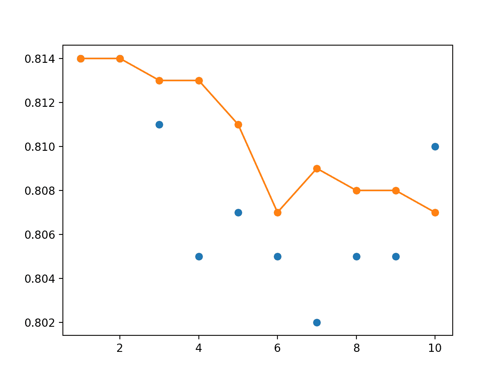
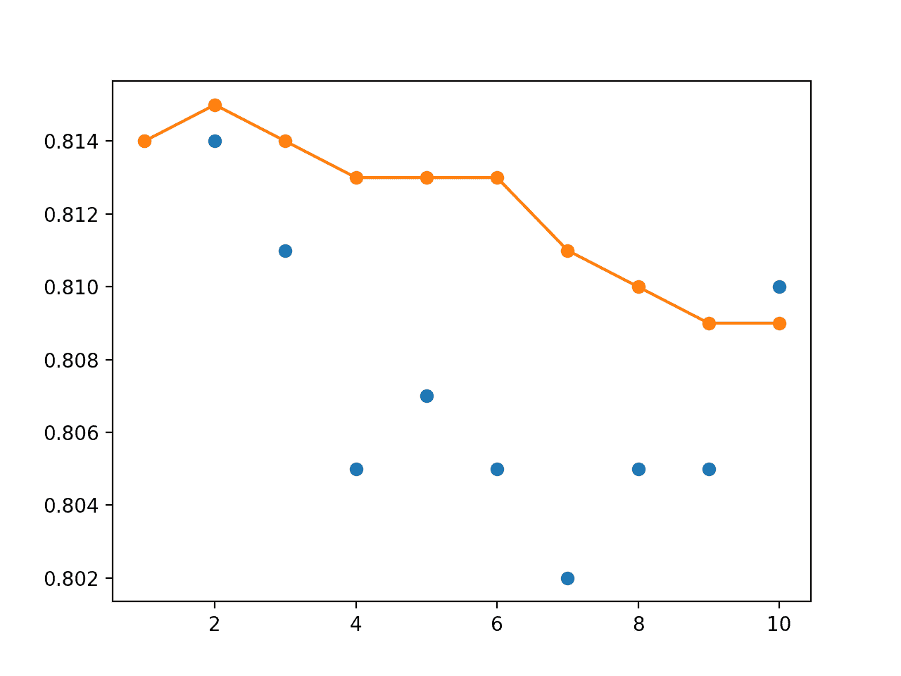

# 在 Keras 中集成神经网络模型权重（Polyak 平均）

> 原文：<https://machinelearningmastery.com/polyak-neural-network-model-weight-ensemble/>

最后更新于 2020 年 8 月 28 日

神经网络的训练过程是一个具有挑战性的优化过程，常常无法收敛。

这可能意味着训练结束时的模型可能不是用作最终模型的稳定或表现最佳的权重集。

解决这个问题的一种方法是在训练结束时使用多个模型的平均权重。这被称为 Polyak-Ruppert 平均，并且可以通过使用模型权重的线性或指数递减加权平均值来进一步改进。除了产生更稳定的模型之外，平均模型权重的表现也可以产生更好的表现。

在本教程中，您将发现如何将多个不同模型的权重组合到一个模型中进行预测。

完成本教程后，您将知道:

*   训练神经网络的随机性和挑战性意味着优化过程不会收敛。
*   使用训练结束时观察到的模型的平均权重来创建模型，可以产生更稳定、有时表现更好的解决方案。
*   如何从多个已保存的模型中开发用模型参数的相等、线性和指数加权平均值创建的最终模型。

**用我的新书[更好的深度学习](https://machinelearningmastery.com/better-deep-learning/)启动你的项目**，包括*分步教程*和所有示例的 *Python 源代码*文件。

我们开始吧。

*   **2019 年 10 月更新**:针对 Keras 2.3 和 TensorFlow 2.0 更新。
*   **2020 年 1 月更新**:针对 Sklearn v0.22 API 的变化进行了更新。


如何在 Keras
中创建神经网络模型权重的相等、线性和指数加权平均值。

## 教程概述

本教程分为七个部分；它们是:

1.  平均模型权重集合
2.  多类分类问题
3.  多层感知器模型
4.  将多个模型保存到文件
5.  具有平均模型权重的新模型
6.  用平均模型权重集合进行预测
7.  线性和指数递减加权平均

## 平均模型权重集合

学习深度神经网络模型的权重需要解决高维非凸优化问题。

解决这个优化问题的一个挑战是有很多“*好的*”解，学习算法可能会反弹，无法在一个解上稳定下来。在随机优化领域，这被称为优化算法在解上收敛的问题，其中解由一组特定的权重值定义。

如果您的模型收敛有问题，您可能会看到的一个症状是训练和/或测试损失值显示出高于预期的方差，例如，它在训练时期上下跳动。

解决这个问题的一种方法是在训练过程结束时合并收集的权重。一般来说，这可能被称为时间平均，被称为 Polyak 平均或 Polyak-Ruppert 平均，以该方法的最初开发者命名。

> Polyak 平均包括通过优化算法访问的参数空间对轨迹中的几个点进行平均。

—第 322 页，[深度学习](https://amzn.to/2A1vOOd)，2016。

在学习过程中平均多个有噪声的权重集听起来可能不如优化过程本身那么理想，但可能被证明是一个理想的解决方案，尤其是对于可能需要几天、几周甚至几个月来训练的非常大的神经网络。

> 本质上的进步是基于一个自相矛盾的想法:必须对一个收敛速度低于最优的缓慢算法进行平均。

——[通过平均进行随机近似的加速](https://epubs.siam.org/doi/abs/10.1137/0330046)，1992。

对来自单次训练运行的多个模型的权重进行平均具有平息噪声优化过程的效果，该噪声优化过程可能由于学习超参数(例如，学习率)的选择或正在学习的映射函数的形状而变得有噪声。结果是最终的模型或一组权重，可能会提供更稳定，也许更准确的结果。

> 基本思想是，优化算法可能会在山谷中来回跳跃几次，而不会访问靠近山谷底部的点。然而，两边所有位置的平均值应该接近谷底。

—第 322 页，[深度学习](https://amzn.to/2A1vOOd)，2016。

Polyak-Ruppert 平均的最简单实现包括计算最近几个训练时期模型权重的平均值。

这可以通过计算加权平均值来改善，在加权平均值中，更多的权重被应用于更近的模型，该权重通过之前的时期线性降低。另一种更广泛使用的方法是在加权平均中使用指数衰减。

> Polyak-Ruppert 平均法已被证明可以提高标准 SGD 的收敛性【…】。或者，可以使用参数的指数移动平均值，对最近的参数值赋予更高的权重。

——[亚当:一种随机优化的方法](https://arxiv.org/abs/1412.6980)，2014。

在最终模型中使用模型权重的平均值或加权平均值是实践中确保从训练运行中获得最佳结果的常用技术。该方法是用于照片分类的谷歌初始 V2 和 V3 深度卷积神经网络模型中的许多“T0”技巧之一，是深度学习领域的里程碑。

> 使用随时间计算的参数的运行平均值进行模型评估。

——[重新思考计算机视觉的初始架构](https://arxiv.org/abs/1512.00567)，2015 年。

## 多类分类问题

我们将使用一个小的多类分类问题作为基础来演示模型权重集成。

Sklearn 类提供了 [make_blobs()函数](http://Sklearn.org/stable/modules/generated/sklearn.datasets.make_blobs.html)，该函数可用于创建具有规定数量的样本、输入变量、类和类内样本方差的多类分类问题。

该问题有两个输入变量(表示点的 *x* 和 *y* 坐标)和每组内点的标准偏差 2.0。我们将使用相同的随机状态(伪随机数发生器的种子)来确保我们总是获得相同的数据点。

```py
# generate 2d classification dataset
X, y = make_blobs(n_samples=1000, centers=3, n_features=2, cluster_std=2, random_state=2)
```

结果是我们可以建模的数据集的输入和输出元素。

为了了解问题的复杂性，我们可以在二维散点图上绘制每个点，并按类值给每个点着色。

下面列出了完整的示例。

```py
# scatter plot of blobs dataset
from sklearn.datasets import make_blobs
from matplotlib import pyplot
from numpy import where
# generate 2d classification dataset
X, y = make_blobs(n_samples=1000, centers=3, n_features=2, cluster_std=2, random_state=2)
# scatter plot for each class value
for class_value in range(3):
	# select indices of points with the class label
	row_ix = where(y == class_value)
	# scatter plot for points with a different color
	pyplot.scatter(X[row_ix, 0], X[row_ix, 1])
# show plot
pyplot.show()
```

运行该示例会创建整个数据集的散点图。我们可以看到，2.0 的标准偏差意味着类不是线性可分的(用一条线可分的)，导致很多不明确的点。

这是可取的，因为这意味着问题不是微不足道的，并将允许神经网络模型找到许多不同的“足够好”的候选解决方案，从而导致高方差。


具有三个类和按类值着色的点的斑点数据集的散点图

## 多层感知器模型

在我们定义一个模型之前，我们需要设计一个适合整体的问题。

在我们的问题中，训练数据集相对较小。具体来说，训练数据集中的示例与保持数据集中的示例的比例为 10:1。这模拟了一种情况，即我们可能有大量未标记的示例和少量已标记的示例来训练模型。

我们将从斑点问题中创建 1100 个数据点。模型将在前 100 个点上进行训练，剩余的 1000 个点将保留在测试数据集中，模型无法使用。

该问题是一个多类分类问题，我们将在输出层使用 softmax 激活函数对其进行建模。这意味着模型将以样本属于三类中每一类的概率来预测具有三个元素的向量。因此，在将行分割成训练和测试数据集之前，我们必须对类值进行热编码。我们可以使用 Keras *到 _ classic()*函数来实现这一点。

```py
# generate 2d classification dataset
X, y = make_blobs(n_samples=1100, centers=3, n_features=2, cluster_std=2, random_state=2)
# one hot encode output variable
y = to_categorical(y)
# split into train and test
n_train = 100
trainX, testX = X[:n_train, :], X[n_train:, :]
trainy, testy = y[:n_train], y[n_train:]
```

接下来，我们可以定义和编译模型。

该模型将预期具有两个输入变量的样本。然后，该模型有一个具有 25 个节点的单个隐藏层和一个校正的线性激活函数，然后有一个具有三个节点的输出层来预测三个类中每一个的概率，还有一个 softmax 激活函数。

由于问题是多类的，我们将使用分类交叉熵损失函数来优化模型和具有小学习率和动量的[随机梯度下降](https://keras.io/optimizers/#sgd)。

```py
# define model
model = Sequential()
model.add(Dense(25, input_dim=2, activation='relu'))
model.add(Dense(3, activation='softmax'))
opt = SGD(lr=0.01, momentum=0.9)
model.compile(loss='categorical_crossentropy', optimizer=opt, metrics=['accuracy'])
```

该模型适用于 500 个训练时期，我们将使用测试集作为验证集，在测试集上评估每个时期的模型。

```py
# fit model
history = model.fit(trainX, trainy, validation_data=(testX, testy), epochs=500, verbose=0)
```

在运行结束时，我们将评估模型在列车和测试集上的表现。

```py
# evaluate the model
_, train_acc = model.evaluate(trainX, trainy, verbose=0)
_, test_acc = model.evaluate(testX, testy, verbose=0)
print('Train: %.3f, Test: %.3f' % (train_acc, test_acc))
```

最后，我们将在训练和验证数据集上绘制每个训练时期的模型准确率的学习曲线。

```py
# learning curves of model accuracy
pyplot.plot(history.history['accuracy'], label='train')
pyplot.plot(history.history['val_accuracy'], label='test')
pyplot.legend()
pyplot.show()
```

将所有这些结合在一起，下面列出了完整的示例。

```py
# develop an mlp for blobs dataset
from sklearn.datasets import make_blobs
from keras.utils import to_categorical
from keras.models import Sequential
from keras.layers import Dense
from keras.optimizers import SGD
from matplotlib import pyplot
# generate 2d classification dataset
X, y = make_blobs(n_samples=1100, centers=3, n_features=2, cluster_std=2, random_state=2)
# one hot encode output variable
y = to_categorical(y)
# split into train and test
n_train = 100
trainX, testX = X[:n_train, :], X[n_train:, :]
trainy, testy = y[:n_train], y[n_train:]
# define model
model = Sequential()
model.add(Dense(25, input_dim=2, activation='relu'))
model.add(Dense(3, activation='softmax'))
opt = SGD(lr=0.01, momentum=0.9)
model.compile(loss='categorical_crossentropy', optimizer=opt, metrics=['accuracy'])
# fit model
history = model.fit(trainX, trainy, validation_data=(testX, testy), epochs=500, verbose=0)
# evaluate the model
_, train_acc = model.evaluate(trainX, trainy, verbose=0)
_, test_acc = model.evaluate(testX, testy, verbose=0)
print('Train: %.3f, Test: %.3f' % (train_acc, test_acc))
# learning curves of model accuracy
pyplot.plot(history.history['accuracy'], label='train')
pyplot.plot(history.history['val_accuracy'], label='test')
pyplot.legend()
pyplot.show()
```

运行该示例将打印最终模型在列车和测试数据集上的表现。

**注**:考虑到算法或评估程序的随机性，或数值准确率的差异，您的[结果可能会有所不同](https://machinelearningmastery.com/different-results-each-time-in-machine-learning/)。考虑运行该示例几次，并比较平均结果。

在这种情况下，我们可以看到该模型在训练数据集上获得了大约 86%的准确率，我们知道这是乐观的，在测试数据集上获得了大约 81%的准确率，我们预计这将更加真实。

```py
Train: 0.860, Test: 0.812
```

还创建了一个线图，显示了在每个训练周期内，训练和测试集上模型准确率的学习曲线。

我们可以看到，在大部分跑步过程中，训练的准确性更加乐观，我们也注意到了最终得分。重要的是，我们确实在训练和测试数据集上的训练期间看到了合理数量的准确性差异，这可能为使用模型权重平均提供了良好的基础。


每个训练时期训练和测试数据集上模型准确率的线图学习曲线

## 将多个模型保存到文件

模型权重集成的一种方法是在内存中保存模型权重的运行平均值。

这种方法有三个缺点:

*   它要求您事先知道模型权重的组合方式；也许你想尝试不同的方法。
*   它要求你知道用于训练的纪元数量；也许你想使用提前停止。
*   它要求您在内存中至少保留一份整个网络的副本；对于大型模型来说，这可能非常昂贵，如果训练过程崩溃或死亡，这可能会很脆弱。

另一种方法是，作为第一步，在训练期间将模型权重保存到文件中，然后将保存的模型中的权重进行组合，以制作最终模型。

也许实现这一点最简单的方法是手动驱动训练过程，一次一个纪元，然后在纪元结束时保存模型，如果我们已经超过了纪元数量的上限。

例如，对于我们的测试问题，我们将为 500 个时期训练模型，并且可能保存从时期 490 开始的模型(例如，在时期 490 和 499 之间并且包括时期 490 和 499)。

```py
# fit model
n_epochs, n_save_after = 500, 490
for i in range(n_epochs):
	# fit model for a single epoch
	model.fit(trainX, trainy, epochs=1, verbose=0)
	# check if we should save the model
	if i >= n_save_after:
		model.save('model_' + str(i) + '.h5')
```

使用模型上的 *save()* 功能并指定包含纪元号的文件名，可以将模型保存到文件中。

注意，在 Keras 中保存和加载神经网络模型需要安装 h5py 库。您可以使用 pip 安装此库，如下所示:

```py
pip install h5py
```

将所有这些结合在一起，下面列出了在训练数据集上拟合模型并保存最近 10 个时代的所有模型的完整示例。

```py
# save models to file toward the end of a training run
from sklearn.datasets import make_blobs
from keras.utils import to_categorical
from keras.models import Sequential
from keras.layers import Dense
# generate 2d classification dataset
X, y = make_blobs(n_samples=1100, centers=3, n_features=2, cluster_std=2, random_state=2)
# one hot encode output variable
y = to_categorical(y)
# split into train and test
n_train = 100
trainX, testX = X[:n_train, :], X[n_train:, :]
trainy, testy = y[:n_train], y[n_train:]
# define model
model = Sequential()
model.add(Dense(25, input_dim=2, activation='relu'))
model.add(Dense(3, activation='softmax'))
model.compile(loss='categorical_crossentropy', optimizer='adam', metrics=['accuracy'])
# fit model
n_epochs, n_save_after = 500, 490
for i in range(n_epochs):
	# fit model for a single epoch
	model.fit(trainX, trainy, epochs=1, verbose=0)
	# check if we should save the model
	if i >= n_save_after:
		model.save('model_' + str(i) + '.h5')
```

运行该示例会将 10 个模型保存到当前工作目录中。

## 具有平均模型权重的新模型

我们可以从多个具有相同架构的现有模型中创建一个新模型。

首先，我们需要将模型加载到内存中。这是合理的，因为模型很小。如果您正在处理非常大的模型，那么一次加载一个模型并在内存中平均权重可能会更容易。

[*load_model()* Keras 函数](https://machinelearningmastery.com/save-load-keras-deep-learning-models/)可用于从文件加载已保存的模型。下面的功能 *load_all_models()* 将从当前工作目录加载模型。它以开始和结束时代作为参数，这样您就可以试验在连续时代中保存的不同组的模型。

```py
# load models from file
def load_all_models(n_start, n_end):
	all_models = list()
	for epoch in range(n_start, n_end):
		# define filename for this ensemble
		filename = 'model_' + str(epoch) + '.h5'
		# load model from file
		model = load_model(filename)
		# add to list of members
		all_models.append(model)
		print('>loaded %s' % filename)
	return all_models
```

我们可以调用函数来加载所有的模型。

```py
# load models in order
members = load_all_models(490, 500)
print('Loaded %d models' % len(members))
```

加载后，我们可以用模型权重的加权平均值创建一个新模型。

每个模型都有一个 *get_weights()* 函数，该函数返回一个数组列表，模型中的每个层都有一个数组。我们可以枚举模型中的每一层，从每个模型中检索相同的层，并计算加权平均值。这会给我们一套砝码。

然后，我们可以使用 *clone_model()* Keras 函数来创建架构的克隆，并调用 *set_weights()* 函数来使用我们准备的平均权重。下面的*模型 _ 权重 _ 集合()*函数实现了这一点。

```py
# create a model from the weights of multiple models
def model_weight_ensemble(members, weights):
	# determine how many layers need to be averaged
	n_layers = len(members[0].get_weights())
	# create an set of average model weights
	avg_model_weights = list()
	for layer in range(n_layers):
		# collect this layer from each model
		layer_weights = array([model.get_weights()[layer] for model in members])
		# weighted average of weights for this layer
		avg_layer_weights = average(layer_weights, axis=0, weights=weights)
		# store average layer weights
		avg_model_weights.append(avg_layer_weights)
	# create a new model with the same structure
	model = clone_model(members[0])
	# set the weights in the new
	model.set_weights(avg_model_weights)
	model.compile(loss='categorical_crossentropy', optimizer='adam', metrics=['accuracy'])
	return model
```

将这些元素结合在一起，我们可以加载 10 个模型，并计算模型权重的平均加权平均值(算术平均值)。完整列表如下。

```py
# average the weights of multiple loaded models
from keras.models import load_model
from keras.models import clone_model
from numpy import average
from numpy import array

# load models from file
def load_all_models(n_start, n_end):
	all_models = list()
	for epoch in range(n_start, n_end):
		# define filename for this ensemble
		filename = 'model_' + str(epoch) + '.h5'
		# load model from file
		model = load_model(filename)
		# add to list of members
		all_models.append(model)
		print('>loaded %s' % filename)
	return all_models

# create a model from the weights of multiple models
def model_weight_ensemble(members, weights):
	# determine how many layers need to be averaged
	n_layers = len(members[0].get_weights())
	# create an set of average model weights
	avg_model_weights = list()
	for layer in range(n_layers):
		# collect this layer from each model
		layer_weights = array([model.get_weights()[layer] for model in members])
		# weighted average of weights for this layer
		avg_layer_weights = average(layer_weights, axis=0, weights=weights)
		# store average layer weights
		avg_model_weights.append(avg_layer_weights)
	# create a new model with the same structure
	model = clone_model(members[0])
	# set the weights in the new
	model.set_weights(avg_model_weights)
	model.compile(loss='categorical_crossentropy', optimizer='adam', metrics=['accuracy'])
	return model

# load all models into memory
members = load_all_models(490, 500)
print('Loaded %d models' % len(members))
# prepare an array of equal weights
n_models = len(members)
weights = [1/n_models for i in range(1, n_models+1)]
# create a new model with the weighted average of all model weights
model = model_weight_ensemble(members, weights)
# summarize the created model
model.summary()
```

运行该示例首先从文件中加载 10 个模型。

```py
>loaded model_490.h5
>loaded model_491.h5
>loaded model_492.h5
>loaded model_493.h5
>loaded model_494.h5
>loaded model_495.h5
>loaded model_496.h5
>loaded model_497.h5
>loaded model_498.h5
>loaded model_499.h5
Loaded 10 models
```

从这 10 个模型中创建一个模型权重集合，给予每个模型相等的权重，并报告模型结构的概要。

```py
_________________________________________________________________
Layer (type)                 Output Shape              Param #
=================================================================
dense_1 (Dense)              (None, 25)                75
_________________________________________________________________
dense_2 (Dense)              (None, 3)                 78
=================================================================
Total params: 153
Trainable params: 153
Non-trainable params: 0
_________________________________________________________________
```

## 用平均模型权重集合进行预测

既然我们知道了如何计算模型权重的加权平均值，我们就可以用得到的模型来评估预测。

一个问题是，我们不知道有多少模型适合组合以获得良好的表现。我们可以通过用最后的 *n* 个模型评估模型加权平均集成来解决这个问题，并改变 *n* 个模型来查看有多少模型产生了良好的表现。

下面的 *evaluate_n_members()* 函数将根据给定数量的加载模型创建一个新模型。每个模型在对最终模型的贡献中被赋予相同的权重，然后调用*模型 _ 权重 _ 集成()*函数来创建最终模型，然后在测试数据集上对其进行评估。

```py
# evaluate a specific number of members in an ensemble
def evaluate_n_members(members, n_members, testX, testy):
	# reverse loaded models so we build the ensemble with the last models first
	members = list(reversed(members))
	# select a subset of members
	subset = members[:n_members]
	# prepare an array of equal weights
	weights = [1.0/n_members for i in range(1, n_members+1)]
	# create a new model with the weighted average of all model weights
	model = model_weight_ensemble(subset, weights)
	# make predictions and evaluate accuracy
	_, test_acc = model.evaluate(testX, testy, verbose=0)
	return test_acc
```

重要的是，首先颠倒加载模型的列表，以确保使用训练运行中最后的 *n* 个模型，我们假设这些模型的平均表现可能更好。

```py
# reverse loaded models so we build the ensemble with the last models first
members = list(reversed(members))
```

然后，我们可以评估从最后 1 个模型到最后 10 个模型的训练运行中保存的最后 *n* 个模型的不同数量所创建的模型。除了评估组合的最终模型，我们还可以评估测试数据集中每个保存的独立模型，以比较表现。

```py
# evaluate different numbers of ensembles on hold out set
single_scores, ensemble_scores = list(), list()
for i in range(1, len(members)+1):
	# evaluate model with i members
	ensemble_score = evaluate_n_members(members, i, testX, testy)
	# evaluate the i'th model standalone
	_, single_score = members[i-1].evaluate(testX, testy, verbose=0)
	# summarize this step
	print('> %d: single=%.3f, ensemble=%.3f' % (i, single_score, ensemble_score))
	ensemble_scores.append(ensemble_score)
	single_scores.append(single_score)
```

可以绘制收集的分数，蓝色圆点代表单个保存模型的准确性，橙色线条代表组合了最后 *n* 个模型的权重的模型的测试准确性。

```py
# plot score vs number of ensemble members
x_axis = [i for i in range(1, len(members)+1)]
pyplot.plot(x_axis, single_scores, marker='o', linestyle='None')
pyplot.plot(x_axis, ensemble_scores, marker='o')
pyplot.show()
```

将所有这些结合在一起，下面列出了完整的示例。

```py
# average of model weights on blobs problem
from sklearn.datasets import make_blobs
from sklearn.metrics import accuracy_score
from keras.utils import to_categorical
from keras.models import load_model
from keras.models import clone_model
from keras.models import Sequential
from keras.layers import Dense
from matplotlib import pyplot
from numpy import average
from numpy import array

# load models from file
def load_all_models(n_start, n_end):
	all_models = list()
	for epoch in range(n_start, n_end):
		# define filename for this ensemble
		filename = 'model_' + str(epoch) + '.h5'
		# load model from file
		model = load_model(filename)
		# add to list of members
		all_models.append(model)
		print('>loaded %s' % filename)
	return all_models

# # create a model from the weights of multiple models
def model_weight_ensemble(members, weights):
	# determine how many layers need to be averaged
	n_layers = len(members[0].get_weights())
	# create an set of average model weights
	avg_model_weights = list()
	for layer in range(n_layers):
		# collect this layer from each model
		layer_weights = array([model.get_weights()[layer] for model in members])
		# weighted average of weights for this layer
		avg_layer_weights = average(layer_weights, axis=0, weights=weights)
		# store average layer weights
		avg_model_weights.append(avg_layer_weights)
	# create a new model with the same structure
	model = clone_model(members[0])
	# set the weights in the new
	model.set_weights(avg_model_weights)
	model.compile(loss='categorical_crossentropy', optimizer='adam', metrics=['accuracy'])
	return model

# evaluate a specific number of members in an ensemble
def evaluate_n_members(members, n_members, testX, testy):
	# select a subset of members
	subset = members[:n_members]
	# prepare an array of equal weights
	weights = [1.0/n_members for i in range(1, n_members+1)]
	# create a new model with the weighted average of all model weights
	model = model_weight_ensemble(subset, weights)
	# make predictions and evaluate accuracy
	_, test_acc = model.evaluate(testX, testy, verbose=0)
	return test_acc

# generate 2d classification dataset
X, y = make_blobs(n_samples=1100, centers=3, n_features=2, cluster_std=2, random_state=2)
# one hot encode output variable
y = to_categorical(y)
# split into train and test
n_train = 100
trainX, testX = X[:n_train, :], X[n_train:, :]
trainy, testy = y[:n_train], y[n_train:]
# load models in order
members = load_all_models(490, 500)
print('Loaded %d models' % len(members))
# reverse loaded models so we build the ensemble with the last models first
members = list(reversed(members))
# evaluate different numbers of ensembles on hold out set
single_scores, ensemble_scores = list(), list()
for i in range(1, len(members)+1):
	# evaluate model with i members
	ensemble_score = evaluate_n_members(members, i, testX, testy)
	# evaluate the i'th model standalone
	_, single_score = members[i-1].evaluate(testX, testy, verbose=0)
	# summarize this step
	print('> %d: single=%.3f, ensemble=%.3f' % (i, single_score, ensemble_score))
	ensemble_scores.append(ensemble_score)
	single_scores.append(single_score)
# plot score vs number of ensemble members
x_axis = [i for i in range(1, len(members)+1)]
pyplot.plot(x_axis, single_scores, marker='o', linestyle='None')
pyplot.plot(x_axis, ensemble_scores, marker='o')
pyplot.show()
```

运行该示例首先加载 10 个保存的模型。

```py
>loaded model_490.h5
>loaded model_491.h5
>loaded model_492.h5
>loaded model_493.h5
>loaded model_494.h5
>loaded model_495.h5
>loaded model_496.h5
>loaded model_497.h5
>loaded model_498.h5
>loaded model_499.h5
Loaded 10 models
```

报告每个单独保存的模型的表现，以及一个集合模型，该集合模型具有从所有模型到每个模型(包括每个模型)的平均权重，从训练运行结束后向后工作。

**注**:考虑到算法或评估程序的随机性，或数值准确率的差异，您的[结果可能会有所不同](https://machinelearningmastery.com/different-results-each-time-in-machine-learning/)。考虑运行该示例几次，并比较平均结果。

结果表明，后两种模型的测试准确率最高可达 81.4%。我们可以看到，模型权重集成的测试准确率平衡了表现，并且表现良好。

```py
> 1: single=0.814, ensemble=0.814
> 2: single=0.814, ensemble=0.814
> 3: single=0.811, ensemble=0.813
> 4: single=0.805, ensemble=0.813
> 5: single=0.807, ensemble=0.811
> 6: single=0.805, ensemble=0.807
> 7: single=0.802, ensemble=0.809
> 8: single=0.805, ensemble=0.808
> 9: single=0.805, ensemble=0.808
> 10: single=0.810, ensemble=0.807
```

还会创建一个线图，显示每个单个模型的测试准确率(蓝点)和模型权重集合的表现(橙色线)。

我们可以看到，对模型权重进行平均确实会使最终模型的表现变得均衡，并且表现至少与运行的最终模型一样好。



单一模型测试表现(蓝点)和模型权重集合测试表现(橙色线)的线图

## 线性和指数递减加权平均

我们可以更新示例并评估集成中模型权重的线性递减权重。

权重可以按如下方式计算:

```py
# prepare an array of linearly decreasing weights
weights = [i/n_members for i in range(n_members, 0, -1)]
```

这可以用来代替 *evaluate_n_members()* 函数中的等权重。

下面列出了完整的示例。

```py
# linearly decreasing weighted average of models on blobs problem
from sklearn.datasets import make_blobs
from sklearn.metrics import accuracy_score
from keras.utils import to_categorical
from keras.models import load_model
from keras.models import clone_model
from keras.models import Sequential
from keras.layers import Dense
from matplotlib import pyplot
from numpy import average
from numpy import array

# load models from file
def load_all_models(n_start, n_end):
	all_models = list()
	for epoch in range(n_start, n_end):
		# define filename for this ensemble
		filename = 'model_' + str(epoch) + '.h5'
		# load model from file
		model = load_model(filename)
		# add to list of members
		all_models.append(model)
		print('>loaded %s' % filename)
	return all_models

# create a model from the weights of multiple models
def model_weight_ensemble(members, weights):
	# determine how many layers need to be averaged
	n_layers = len(members[0].get_weights())
	# create an set of average model weights
	avg_model_weights = list()
	for layer in range(n_layers):
		# collect this layer from each model
		layer_weights = array([model.get_weights()[layer] for model in members])
		# weighted average of weights for this layer
		avg_layer_weights = average(layer_weights, axis=0, weights=weights)
		# store average layer weights
		avg_model_weights.append(avg_layer_weights)
	# create a new model with the same structure
	model = clone_model(members[0])
	# set the weights in the new
	model.set_weights(avg_model_weights)
	model.compile(loss='categorical_crossentropy', optimizer='adam', metrics=['accuracy'])
	return model

# evaluate a specific number of members in an ensemble
def evaluate_n_members(members, n_members, testX, testy):
	# select a subset of members
	subset = members[:n_members]
	# prepare an array of linearly decreasing weights
	weights = [i/n_members for i in range(n_members, 0, -1)]
	# create a new model with the weighted average of all model weights
	model = model_weight_ensemble(subset, weights)
	# make predictions and evaluate accuracy
	_, test_acc = model.evaluate(testX, testy, verbose=0)
	return test_acc

# generate 2d classification dataset
X, y = make_blobs(n_samples=1100, centers=3, n_features=2, cluster_std=2, random_state=2)
# one hot encode output variable
y = to_categorical(y)
# split into train and test
n_train = 100
trainX, testX = X[:n_train, :], X[n_train:, :]
trainy, testy = y[:n_train], y[n_train:]
# load models in order
members = load_all_models(490, 500)
print('Loaded %d models' % len(members))
# reverse loaded models so we build the ensemble with the last models first
members = list(reversed(members))
# evaluate different numbers of ensembles on hold out set
single_scores, ensemble_scores = list(), list()
for i in range(1, len(members)+1):
	# evaluate model with i members
	ensemble_score = evaluate_n_members(members, i, testX, testy)
	# evaluate the i'th model standalone
	_, single_score = members[i-1].evaluate(testX, testy, verbose=0)
	# summarize this step
	print('> %d: single=%.3f, ensemble=%.3f' % (i, single_score, ensemble_score))
	ensemble_scores.append(ensemble_score)
	single_scores.append(single_score)
# plot score vs number of ensemble members
x_axis = [i for i in range(1, len(members)+1)]
pyplot.plot(x_axis, single_scores, marker='o', linestyle='None')
pyplot.plot(x_axis, ensemble_scores, marker='o')
pyplot.show()
```

运行该示例再次报告每个单个模型的表现，这一次测试每个平均模型权重集合的准确性，其中模型的贡献呈线性下降。

**注**:考虑到算法或评估程序的随机性，或数值准确率的差异，您的[结果可能会有所不同](https://machinelearningmastery.com/different-results-each-time-in-machine-learning/)。考虑运行该示例几次，并比较平均结果。

我们可以看到，至少在这种情况下，集成实现了比任何独立模型都小的表现提升，达到了大约 81.5%的准确率。

```py
...
> 1: single=0.814, ensemble=0.814
> 2: single=0.814, ensemble=0.815
> 3: single=0.811, ensemble=0.814
> 4: single=0.805, ensemble=0.813
> 5: single=0.807, ensemble=0.813
> 6: single=0.805, ensemble=0.813
> 7: single=0.802, ensemble=0.811
> 8: single=0.805, ensemble=0.810
> 9: single=0.805, ensemble=0.809
> 10: single=0.810, ensemble=0.809
```

折线图显示了表现的提升，并显示了与使用平均加权集成相比，在所创建的不同大小的集成上，测试准确率方面更稳定的表现。



线性衰减的单一模型测试表现(蓝点)和模型权重集合测试表现(橙色线)的线图

我们也可以试验模型贡献的指数衰减。这要求指定衰减率(α)。下面的示例为递减率为 2 的指数衰减创建权重。

```py
# prepare an array of exponentially decreasing weights
alpha = 2.0
weights = [exp(-i/alpha) for i in range(1, n_members+1)]
```

下面列出了模型对集合模型中平均权重的贡献呈指数衰减的完整示例。

```py
# exponentially decreasing weighted average of models on blobs problem
from sklearn.datasets import make_blobs
from sklearn.metrics import accuracy_score
from keras.utils import to_categorical
from keras.models import load_model
from keras.models import clone_model
from keras.models import Sequential
from keras.layers import Dense
from matplotlib import pyplot
from numpy import average
from numpy import array
from math import exp

# load models from file
def load_all_models(n_start, n_end):
	all_models = list()
	for epoch in range(n_start, n_end):
		# define filename for this ensemble
		filename = 'model_' + str(epoch) + '.h5'
		# load model from file
		model = load_model(filename)
		# add to list of members
		all_models.append(model)
		print('>loaded %s' % filename)
	return all_models

# create a model from the weights of multiple models
def model_weight_ensemble(members, weights):
	# determine how many layers need to be averaged
	n_layers = len(members[0].get_weights())
	# create an set of average model weights
	avg_model_weights = list()
	for layer in range(n_layers):
		# collect this layer from each model
		layer_weights = array([model.get_weights()[layer] for model in members])
		# weighted average of weights for this layer
		avg_layer_weights = average(layer_weights, axis=0, weights=weights)
		# store average layer weights
		avg_model_weights.append(avg_layer_weights)
	# create a new model with the same structure
	model = clone_model(members[0])
	# set the weights in the new
	model.set_weights(avg_model_weights)
	model.compile(loss='categorical_crossentropy', optimizer='adam', metrics=['accuracy'])
	return model

# evaluate a specific number of members in an ensemble
def evaluate_n_members(members, n_members, testX, testy):
	# select a subset of members
	subset = members[:n_members]
	# prepare an array of exponentially decreasing weights
	alpha = 2.0
	weights = [exp(-i/alpha) for i in range(1, n_members+1)]
	# create a new model with the weighted average of all model weights
	model = model_weight_ensemble(subset, weights)
	# make predictions and evaluate accuracy
	_, test_acc = model.evaluate(testX, testy, verbose=0)
	return test_acc

# generate 2d classification dataset
X, y = make_blobs(n_samples=1100, centers=3, n_features=2, cluster_std=2, random_state=2)
# one hot encode output variable
y = to_categorical(y)
# split into train and test
n_train = 100
trainX, testX = X[:n_train, :], X[n_train:, :]
trainy, testy = y[:n_train], y[n_train:]
# load models in order
members = load_all_models(490, 500)
print('Loaded %d models' % len(members))
# reverse loaded models so we build the ensemble with the last models first
members = list(reversed(members))
# evaluate different numbers of ensembles on hold out set
single_scores, ensemble_scores = list(), list()
for i in range(1, len(members)+1):
	# evaluate model with i members
	ensemble_score = evaluate_n_members(members, i, testX, testy)
	# evaluate the i'th model standalone
	_, single_score = members[i-1].evaluate(testX, testy, verbose=0)
	# summarize this step
	print('> %d: single=%.3f, ensemble=%.3f' % (i, single_score, ensemble_score))
	ensemble_scores.append(ensemble_score)
	single_scores.append(single_score)
# plot score vs number of ensemble members
x_axis = [i for i in range(1, len(members)+1)]
pyplot.plot(x_axis, single_scores, marker='o', linestyle='None')
pyplot.plot(x_axis, ensemble_scores, marker='o')
pyplot.show()
```

**注**:考虑到算法或评估程序的随机性，或数值准确率的差异，您的[结果可能会有所不同](https://machinelearningmastery.com/different-results-each-time-in-machine-learning/)。考虑运行该示例几次，并比较平均结果。

运行该示例显示了表现的小幅提升，就像使用已保存模型的加权平均值的线性衰减一样。

```py
> 1: single=0.814, ensemble=0.814
> 2: single=0.814, ensemble=0.815
> 3: single=0.811, ensemble=0.814
> 4: single=0.805, ensemble=0.814
> 5: single=0.807, ensemble=0.813
> 6: single=0.805, ensemble=0.813
> 7: single=0.802, ensemble=0.813
> 8: single=0.805, ensemble=0.813
> 9: single=0.805, ensemble=0.813
> 10: single=0.810, ensemble=0.813
```

测试准确度分数的线图显示了使用指数衰减代替模型的线性或等权重的更强的稳定效果。


具有指数衰减的单模型测试表现(蓝点)和模型权重集合测试表现(橙色线)的线图

## 扩展ˌ扩张

本节列出了一些您可能希望探索的扩展教程的想法。

*   **车型数量**。评估更多模型对最终模型贡献权重的效果。
*   **衰变率**。评估指数加权平均值使用不同衰减率对测试表现的影响。

如果你探索这些扩展，我很想知道。

## 进一步阅读

如果您想更深入地了解这个主题，本节将提供更多资源。

### 书

*   第 8.7.3 节 Polyak 平均，[深度学习](https://amzn.to/2A1vOOd)，2016。

### 报纸

*   [平均化随机近似的加速度](https://epubs.siam.org/doi/abs/10.1137/0330046)，1992。
*   缓慢收敛的罗宾斯-蒙罗过程的有效估计，1988。

### 应用程序接口

*   [开始使用 Keras 顺序模型](https://keras.io/getting-started/sequential-model-guide/)
*   [硬核层 API](https://keras.io/layers/core/)
*   [sklearn . dataset . make _ blobs API](http://Sklearn.org/stable/modules/generated/sklearn.datasets.make_blobs.html)
*   [平均空气污染指数](https://docs.scipy.org/doc/numpy/reference/generated/numpy.average.html)

### 文章

*   [keras 模型中的平均权重，StackOverflow。](https://stackoverflow.com/questions/48212110/average-weights-in-keras-models)
*   [用于视觉识别的模型集成，CS231n 卷积神经网络](https://cs231n.github.io/neural-networks-3/#ensemble)
*   [指数移动平均线，Keras 发行。](https://github.com/keras-team/keras/issues/3696)
*   [指数移动平均实现](https://gist.github.com/soheilb/c5bf0ba7197caa095acfcb69744df756)

## 摘要

在本教程中，您发现了如何将多个不同模型的权重组合到一个模型中进行预测。

具体来说，您了解到:

*   训练神经网络的随机性和挑战性意味着优化过程不会收敛。
*   使用训练结束时观察到的模型的平均权重来创建模型，可以产生更稳定、有时表现更好的解决方案。
*   如何从多个已保存的模型中开发用模型参数的相等、线性和指数加权平均值创建的最终模型。

你有什么问题吗？
在下面的评论中提问，我会尽力回答。