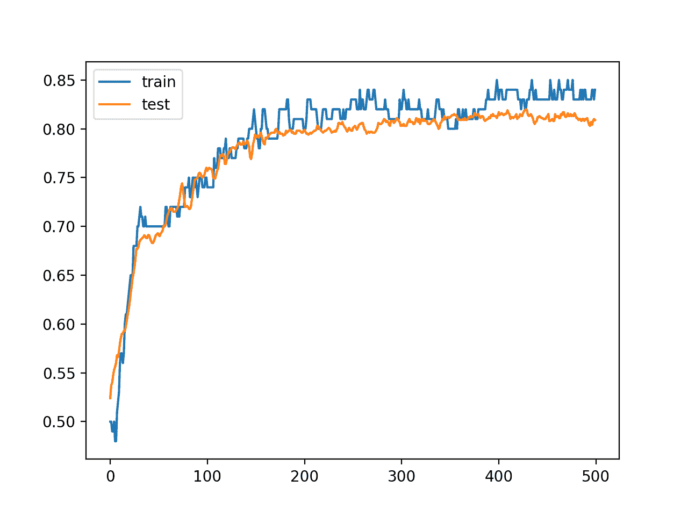

# Python 中深度学习神经网络的堆叠集成

> 原文：<https://machinelearningmastery.com/stacking-ensemble-for-deep-learning-neural-networks/>

最后更新于 2020 年 8 月 28 日

模型平均是一种[集成技术](https://machinelearningmastery.com/ensemble-methods-for-deep-learning-neural-networks/)，其中多个子模型对组合预测的贡献相等。

通过子模型的预期表现加权每个子模型对组合预测的贡献，可以改进模型平均。这可以通过训练一个全新的模型来学习如何最好地组合来自每个子模型的贡献来进一步扩展。这种方法被称为堆叠一般化，简称堆叠，可以比任何单一的贡献模型产生更好的预测表现。

在本教程中，您将发现如何为深度学习神经网络开发堆叠泛化集成。

完成本教程后，您将知道:

*   堆叠概括是一种集成方法，其中新模型学习如何最好地组合来自多个现有模型的预测。
*   如何使用神经网络作为子模型和 Sklearn 分类器作为元学习器开发堆叠模型？
*   如何开发一个叠加模型，将神经网络子模型嵌入到更大的叠加集成模型中进行训练和预测。

**用我的新书[更好的深度学习](https://machinelearningmastery.com/better-deep-learning/)启动你的项目**，包括*分步教程*和所有示例的 *Python 源代码*文件。

我们开始吧。

*   **2019 年 10 月更新**:针对 Keras 2.3 和 TensorFlow 2.0 更新。
*   **2020 年 1 月更新**:针对 Sklearn v0.22 API 的变化进行了更新。
*   **2020 年 8 月更新**:针对 Keras 2.4.3 和 TensorFlow 2.3 更新


如何用 Keras 开发 Python 中深度学习神经网络的堆叠集成。

## 教程概述

本教程分为六个部分；它们是:

1.  堆叠综合集成
2.  多类分类问题
3.  多层感知器模型
4.  训练和保存子模型
5.  独立堆叠模型
6.  集成堆叠模型

## 堆叠综合集成

模型平均集成组合了来自多个训练模型的预测。

这种方法的一个局限性是，无论模型表现如何，每个模型对集合预测的贡献都是相同的。这种方法的一种变体称为加权平均集成，通过模型在保持数据集上的信任或预期表现来衡量每个集成成员的贡献。这允许表现良好的模型贡献更多，表现不佳的模型贡献更少。加权平均集成提供了对模型平均集成的改进。

这种方法的进一步推广是用任何学习算法代替用于组合子模型预测的线性加权和(例如线性回归)模型。这种方法被称为堆叠概括，简称堆叠。

在堆叠中，算法将子模型的输出作为输入，并试图学习如何最好地组合输入预测，以做出更好的输出预测。

将堆叠过程视为具有两个级别可能会有所帮助:级别 0 和级别 1。

*   **0 级**:0 级数据是训练数据集输入，0 级模型学习根据该数据进行预测。
*   **1 级**:1 级数据以 0 级模型的输出为输入，单一的 1 级模型，即元学习器，从这个数据中学习做出预测。

> 堆叠泛化的工作原理是通过推导泛化器相对于所提供的学习集的偏差。这种推导是通过在第二个空间中进行归纳来进行的，当用学习集的一部分进行教学时，第二个空间的输入是(例如)原始归纳者的猜测，并试图猜测其余部分，第二个空间的输出是(例如)正确的猜测。

——[堆叠概括](https://www.sciencedirect.com/science/article/pii/S0893608005800231)，1992。

与加权平均集成不同，堆叠概括集成可以使用预测集作为上下文，并有条件地决定对输入预测进行不同的加权，从而潜在地获得更好的表现。

有趣的是，虽然堆叠被描述为具有两个或多个 0 级模型的集成学习方法，但是它可以用于只有单个 0 级模型的情况。在这种情况下，1 级或元学习器模型学习校正来自 0 级模型的预测。

> …尽管它也可以在只有一个概化器时使用，作为改进该概化器的一种技术

——[堆叠概括](https://www.sciencedirect.com/science/article/pii/S0893608005800231)，1992。

重要的是，元学习器在单独的数据集上被训练到用于训练 0 级模型的例子，以避免过拟合。

实现这一点的一个简单方法是将训练数据集拆分为训练集和验证集。然后在列车组上训练 0 级模型。然后使用验证集来训练 1 级模型，其中原始输入首先通过 0 级模型来获得用作 1 级模型输入的预测。

保留验证集方法训练堆叠模型的一个限制是 0 级和 1 级模型不是在完整的数据集上训练的。

训练堆叠模型的更复杂的方法包括使用 k-fold 交叉验证来开发元学习器模型的训练数据集。每一个 0 级模型都使用 k 倍交叉验证(甚至留一个出来交叉验证以获得最大效果)进行训练；然后模型被丢弃，但是预测被保留。这意味着，对于每个模型，都有未在这些示例上训练的模型版本做出的预测，例如，像保持示例，但在这种情况下是针对整个训练数据集。

这些预测然后被用作训练元学习器的输入。然后在整个训练数据集上训练 0 级模型，并且与元学习器一起，堆叠模型可以用于对新数据进行预测。

在实践中，通常使用不同的算法来准备每个 0 级模型，以提供不同的预测集。

> ……堆叠通常不用于组合相同类型的模型……它应用于由不同学习算法构建的模型。

——[实用机器学习工具与技术](https://amzn.to/2pBxIPN)，第二版，2005。

使用简单的线性模型来组合预测也很常见。因为线性模型的使用很常见，堆叠最近被称为“模型混合”或简称为“T2 混合”，尤其是在机器学习比赛中。

> ……应采用多响应最小二乘线性回归技术作为高级概括。该技术提供了一种组合 0 级模型置信度的方法

——[堆叠概括中的问题](https://www.jair.org/index.php/jair/article/view/10228)，1999。

可以为回归和分类问题开发一个堆叠的综合集成。在分类问题的情况下，当使用类概率的预测代替类标签作为元学习器的输入时，已经看到了更好的结果。

> ……应该使用类概率而不是单个预测类作为高级学习的输入属性。类别概率用作预测的置信度度量。

——[堆叠概括中的问题](https://www.jair.org/index.php/jair/article/view/10228)，1999。

现在我们已经熟悉了堆叠概括，我们可以通过一个开发堆叠深度学习模型的案例研究来工作。

## 多类分类问题

我们将使用一个小的多类分类问题作为基础来演示堆叠集成。

Sklearn 类提供了 [make_blobs()函数](http://Sklearn.org/stable/modules/generated/sklearn.datasets.make_blobs.html)，该函数可用于创建具有规定数量的样本、输入变量、类和类内样本方差的多类分类问题。

该问题有两个输入变量(表示点的 *x* 和 *y* 坐标)和每组内点的标准偏差 2.0。我们将使用相同的随机状态(用于[伪随机数发生器](https://machinelearningmastery.com/how-to-generate-random-numbers-in-python/)的种子)来确保我们总是获得相同的数据点。

```py
# generate 2d classification dataset
X, y = make_blobs(n_samples=1000, centers=3, n_features=2, cluster_std=2, random_state=2)
```

结果是我们可以建模的数据集的输入和输出元素。

为了了解问题的复杂性，我们可以在二维散点图上绘制每个点，并按类值给每个点着色。

下面列出了完整的示例。

```py
# scatter plot of blobs dataset
from sklearn.datasets import make_blobs
from matplotlib import pyplot
from pandas import DataFrame
# generate 2d classification dataset
X, y = make_blobs(n_samples=1000, centers=3, n_features=2, cluster_std=2, random_state=2)
# scatter plot, dots colored by class value
df = DataFrame(dict(x=X[:,0], y=X[:,1], label=y))
colors = {0:'red', 1:'blue', 2:'green'}
fig, ax = pyplot.subplots()
grouped = df.groupby('label')
for key, group in grouped:
    group.plot(ax=ax, kind='scatter', x='x', y='y', label=key, color=colors[key])
pyplot.show()
```

运行该示例会创建整个数据集的散点图。我们可以看到，2.0 的标准偏差意味着类不是线性可分的(用一条线可分的)，导致了很多不明确的点。

这是可取的，因为这意味着问题不是微不足道的，并将允许神经网络模型找到许多不同的“足够好”的候选解决方案，从而导致高方差。


具有三个类和按类值着色的点的斑点数据集的散点图

## 多层感知器模型

在我们定义模型之前，我们需要设计一个适合于堆叠集合的问题。

在我们的问题中，训练数据集相对较小。具体来说，训练数据集中的示例与保持数据集中的示例的比例为 10:1。这模拟了一种情况，即我们可能有大量未标记的示例和少量已标记的示例来训练模型。

我们将从斑点问题中创建 1100 个数据点。模型将在前 100 个点上进行训练，剩余的 1000 个点将保留在测试数据集中，模型无法使用。

该问题是一个多类分类问题，我们将在输出层使用 softmax 激活函数对其进行建模。这意味着模型将以样本属于三类中每一类的概率来预测具有三个元素的向量。因此，在将行分割成训练和测试数据集之前，我们必须对类值进行热编码。我们可以使用 Keras *到 _ classic()*函数来实现这一点。

```py
# generate 2d classification dataset
X, y = make_blobs(n_samples=1100, centers=3, n_features=2, cluster_std=2, random_state=2)
# one hot encode output variable
y = to_categorical(y)
# split into train and test
n_train = 100
trainX, testX = X[:n_train, :], X[n_train:, :]
trainy, testy = y[:n_train], y[n_train:]
print(trainX.shape, testX.shape)
```

接下来，我们可以定义并组合模型。

该模型将预期具有两个输入变量的样本。然后，该模型有一个具有 25 个节点的单个隐藏层和一个校正的线性激活函数，然后有一个具有三个节点的输出层来预测三个类中每一个的概率，还有一个 softmax 激活函数。

由于问题是多类的，我们将使用分类交叉熵损失函数来优化模型和随机梯度下降的有效[亚当味](https://machinelearningmastery.com/adam-optimization-algorithm-for-deep-learning/)。

```py
# define model
model = Sequential()
model.add(Dense(25, input_dim=2, activation='relu'))
model.add(Dense(3, activation='softmax'))
model.compile(loss='categorical_crossentropy', optimizer='adam', metrics=['accuracy'])
```

该模型适用于 500 个训练时期，我们将使用测试集作为验证集，在测试集上评估每个时期的模型。

```py
# fit model
history = model.fit(trainX, trainy, validation_data=(testX, testy), epochs=500, verbose=0)
```

在运行结束时，我们将评估模型在列车和测试集上的表现。

```py
# evaluate the model
_, train_acc = model.evaluate(trainX, trainy, verbose=0)
_, test_acc = model.evaluate(testX, testy, verbose=0)
print('Train: %.3f, Test: %.3f' % (train_acc, test_acc))
```

最后，我们将在训练和验证数据集上绘制每个训练时期的模型准确率的学习曲线。

```py
# learning curves of model accuracy
pyplot.plot(history.history['accuracy'], label='train')
pyplot.plot(history.history['val_accuracy'], label='test')
pyplot.legend()
pyplot.show()
```

将所有这些结合在一起，下面列出了完整的示例。

```py
# develop an mlp for blobs dataset
from sklearn.datasets import make_blobs
from keras.utils import to_categorical
from keras.models import Sequential
from keras.layers import Dense
from matplotlib import pyplot
# generate 2d classification dataset
X, y = make_blobs(n_samples=1100, centers=3, n_features=2, cluster_std=2, random_state=2)
# one hot encode output variable
y = to_categorical(y)
# split into train and test
n_train = 100
trainX, testX = X[:n_train, :], X[n_train:, :]
trainy, testy = y[:n_train], y[n_train:]
print(trainX.shape, testX.shape)
# define model
model = Sequential()
model.add(Dense(25, input_dim=2, activation='relu'))
model.add(Dense(3, activation='softmax'))
model.compile(loss='categorical_crossentropy', optimizer='adam', metrics=['accuracy'])
# fit model
history = model.fit(trainX, trainy, validation_data=(testX, testy), epochs=500, verbose=0)
# evaluate the model
_, train_acc = model.evaluate(trainX, trainy, verbose=0)
_, test_acc = model.evaluate(testX, testy, verbose=0)
print('Train: %.3f, Test: %.3f' % (train_acc, test_acc))
# learning curves of model accuracy
pyplot.plot(history.history['accuracy'], label='train')
pyplot.plot(history.history['val_accuracy'], label='test')
pyplot.legend()
pyplot.show()
```

运行该示例首先打印每个数据集的形状以供确认，然后打印最终模型在训练和测试数据集上的表现。

**注**:考虑到算法或评估程序的随机性，或数值准确率的差异，您的[结果可能会有所不同](https://machinelearningmastery.com/different-results-each-time-in-machine-learning/)。考虑运行该示例几次，并比较平均结果。

在这种情况下，我们可以看到该模型在训练数据集上实现了大约 85%的准确率，我们知道这是乐观的，在测试数据集上实现了大约 80%的准确率，我们预计这将更加真实。

```py
(100, 2) (1000, 2)
Train: 0.850, Test: 0.809
```

还创建了一个线图，显示了在每个训练周期内，训练和测试集上模型准确率的学习曲线。

我们可以看到，在大部分跑步过程中，训练的准确性更加乐观，我们也注意到了最终得分。



每个训练时期训练和测试数据集上模型准确率的线图学习曲线

我们现在可以将这个模型的实例作为堆叠集合的一部分。

## 训练和保存子模型

为了保持这个例子的简单，我们将使用同一个模型的多个实例作为堆叠集成中的 0 级或子模型。

我们还将使用保持验证数据集来训练集合中的第一级或元学习器。

更高级的例子可以使用不同类型的 MLP 模型(更深、更宽等)。)作为子模型，使用 [K 折交叉验证](https://machinelearningmastery.com/k-fold-cross-validation/)训练元学习器。

在本节中，我们将训练多个子模型，[将它们保存到文件中，以便以后在我们的堆叠集成中使用](https://machinelearningmastery.com/save-load-keras-deep-learning-models/)。

第一步是创建一个函数，该函数将在训练数据集上定义和拟合 MLP 模型。

```py
# fit model on dataset
def fit_model(trainX, trainy):
	# define model
	model = Sequential()
	model.add(Dense(25, input_dim=2, activation='relu'))
	model.add(Dense(3, activation='softmax'))
	model.compile(loss='categorical_crossentropy', optimizer='adam', metrics=['accuracy'])
	# fit model
	model.fit(trainX, trainy, epochs=500, verbose=0)
	return model
```

接下来，我们可以创建一个子目录来存储模型。

注意，如果目录已经存在，您可能必须在重新运行此代码时删除它。

```py
# create directory for models
makedirs('models')
```

最后，我们可以创建 MLP 的多个实例，并用唯一的文件名将每个实例保存到“*模型/* ”子目录中。

在这种情况下，我们将创建五个子模型，但是您可以用不同数量的模型进行实验，看看它如何影响模型表现。

```py
# fit and save models
n_members = 5
for i in range(n_members):
	# fit model
	model = fit_model(trainX, trainy)
	# save model
	filename = 'models/model_' + str(i + 1) + '.h5'
	model.save(filename)
	print('>Saved %s' % filename)
```

我们可以把所有这些元素联系在一起；下面列出了训练子模型并将它们保存到文件中的完整示例。

```py
# example of saving sub-models for later use in a stacking ensemble
from sklearn.datasets import make_blobs
from keras.utils import to_categorical
from keras.models import Sequential
from keras.layers import Dense
from matplotlib import pyplot
from os import makedirs

# fit model on dataset
def fit_model(trainX, trainy):
	# define model
	model = Sequential()
	model.add(Dense(25, input_dim=2, activation='relu'))
	model.add(Dense(3, activation='softmax'))
	model.compile(loss='categorical_crossentropy', optimizer='adam', metrics=['accuracy'])
	# fit model
	model.fit(trainX, trainy, epochs=500, verbose=0)
	return model

# generate 2d classification dataset
X, y = make_blobs(n_samples=1100, centers=3, n_features=2, cluster_std=2, random_state=2)
# one hot encode output variable
y = to_categorical(y)
# split into train and test
n_train = 100
trainX, testX = X[:n_train, :], X[n_train:, :]
trainy, testy = y[:n_train], y[n_train:]
print(trainX.shape, testX.shape)
# create directory for models
makedirs('models')
# fit and save models
n_members = 5
for i in range(n_members):
	# fit model
	model = fit_model(trainX, trainy)
	# save model
	filename = 'models/model_' + str(i + 1) + '.h5'
	model.save(filename)
	print('>Saved %s' % filename)
```

运行该示例会创建“*模型/* ”子文件夹，并用唯一的文件名保存五个训练好的模型。

```py
(100, 2) (1000, 2)
>Saved models/model_1.h5
>Saved models/model_2.h5
>Saved models/model_3.h5
>Saved models/model_4.h5
>Saved models/model_5.h5
```

接下来，我们可以考虑训练一个元学习器来最好地利用这些子模型的预测。

## 独立堆叠模型

我们现在可以训练一个元学习器，它将最好地组合来自子模型的预测，并且理想地比任何单个子模型表现得更好。

第一步是加载保存的模型。

我们可以使用 *load_model()* Keras 函数，创建一个 Python 加载模型列表。

```py
# load models from file
def load_all_models(n_models):
	all_models = list()
	for i in range(n_models):
		# define filename for this ensemble
		filename = 'models/model_' + str(i + 1) + '.h5'
		# load model from file
		model = load_model(filename)
		# add to list of members
		all_models.append(model)
		print('>loaded %s' % filename)
	return all_models
```

我们可以调用这个函数从“*模型/* ”子目录中加载我们保存的五个模型。

```py
# load all models
n_members = 5
members = load_all_models(n_members)
print('Loaded %d models' % len(members))
```

了解单个模型在测试数据集上的表现会很有用，因为我们希望堆叠模型表现得更好。

我们可以轻松评估训练数据集中的每个模型，并建立表现基线。

```py
# evaluate standalone models on test dataset
for model in members:
	testy_enc = to_categorical(testy)
	_, acc = model.evaluate(testX, testy_enc, verbose=0)
	print('Model Accuracy: %.3f' % acc)
```

接下来，我们可以训练我们的元学习器。这需要两个步骤:

*   为元学习器准备一个训练数据集。
*   使用准备好的训练数据集来适应元学习器模型。

我们将为元学习器准备一个训练数据集，将测试集中的例子提供给每个子模型，并收集预测。在这种情况下，每个模型将为每个示例输出三个预测，预测给定示例属于三个类别中的每一个的概率。因此，测试集中的 1000 个示例将产生五个形状为*【1000，3】*的数组。

我们可以使用 [dstack() NumPy 函数](https://docs.scipy.org/doc/numpy/reference/generated/numpy.dstack.html)将这些数组组合成一个三维数组，其形状为*【1000，5，3】*，该函数将堆叠每组新的预测。

作为一个新模型的输入，我们将需要 1000 个具有一些特征的例子。假设我们有五个模型，每个模型对每个示例进行三次预测，那么每个示例将有 15 (3 x 5)个特征提供给子模型。我们可以将子模型中*【1000，5，3】*形状的预测转换为*【1000，15】*形状的数组，用于使用[重塑()NumPy 函数](https://machinelearningmastery.com/index-slice-reshape-numpy-arrays-machine-learning-python/)训练元学习器，并展平最终的两个维度。 *stacked_dataset()* 函数实现这一步。

```py
# create stacked model input dataset as outputs from the ensemble
def stacked_dataset(members, inputX):
	stackX = None
	for model in members:
		# make prediction
		yhat = model.predict(inputX, verbose=0)
		# stack predictions into [rows, members, probabilities]
		if stackX is None:
			stackX = yhat
		else:
			stackX = dstack((stackX, yhat))
	# flatten predictions to [rows, members x probabilities]
	stackX = stackX.reshape((stackX.shape[0], stackX.shape[1]*stackX.shape[2]))
	return stackX
```

一旦准备好了，我们就可以使用这个输入数据集和输出，或者测试集的 *y* 部分，来训练一个新的元学习器。

在这种情况下，我们将从 Sklearn 库中训练一个简单的逻辑回归算法。

[逻辑回归](https://machinelearningmastery.com/logistic-regression-for-machine-learning/)只支持二进制分类，虽然[逻辑回归类](http://Sklearn.org/stable/modules/generated/sklearn.linear_model.LogisticRegression.html)在 Sklearn 中的逻辑回归的实现使用一对多的方案支持多类分类(两类以上)。下面的函数 *fit_stacked_model()* 将通过调用 *stacked_dataset()* 函数为元学习器准备训练数据集，然后拟合逻辑回归模型，然后返回。

```py
# fit a model based on the outputs from the ensemble members
def fit_stacked_model(members, inputX, inputy):
	# create dataset using ensemble
	stackedX = stacked_dataset(members, inputX)
	# fit standalone model
	model = LogisticRegression()
	model.fit(stackedX, inputy)
	return model
```

我们可以调用这个函数，并传入加载的模型列表和训练数据集。

```py
# fit stacked model using the ensemble
model = fit_stacked_model(members, testX, testy)
```

一旦适合，我们可以使用堆叠模型，包括成员和元学习器，对新数据进行预测。

这可以通过首先使用子模型为元学习器制作输入数据集来实现，例如通过调用*stagged _ dataset()*函数，然后与元学习器一起进行预测。下面的*堆叠预测()*函数实现了这一点。

```py
# make a prediction with the stacked model
def stacked_prediction(members, model, inputX):
	# create dataset using ensemble
	stackedX = stacked_dataset(members, inputX)
	# make a prediction
	yhat = model.predict(stackedX)
	return yhat
```

我们可以用这个函数对新数据进行预测；在这种情况下，我们可以通过对测试集进行预测来证明这一点。

```py
# evaluate model on test set
yhat = stacked_prediction(members, model, testX)
acc = accuracy_score(testy, yhat)
print('Stacked Test Accuracy: %.3f' % acc)
```

将所有这些元素结合在一起，下面列出了为 MLP 子模型的堆叠集合拟合线性元学习器的完整示例。

```py
# stacked generalization with linear meta model on blobs dataset
from sklearn.datasets import make_blobs
from sklearn.metrics import accuracy_score
from sklearn.linear_model import LogisticRegression
from keras.models import load_model
from keras.utils import to_categorical
from numpy import dstack

# load models from file
def load_all_models(n_models):
	all_models = list()
	for i in range(n_models):
		# define filename for this ensemble
		filename = 'models/model_' + str(i + 1) + '.h5'
		# load model from file
		model = load_model(filename)
		# add to list of members
		all_models.append(model)
		print('>loaded %s' % filename)
	return all_models

# create stacked model input dataset as outputs from the ensemble
def stacked_dataset(members, inputX):
	stackX = None
	for model in members:
		# make prediction
		yhat = model.predict(inputX, verbose=0)
		# stack predictions into [rows, members, probabilities]
		if stackX is None:
			stackX = yhat
		else:
			stackX = dstack((stackX, yhat))
	# flatten predictions to [rows, members x probabilities]
	stackX = stackX.reshape((stackX.shape[0], stackX.shape[1]*stackX.shape[2]))
	return stackX

# fit a model based on the outputs from the ensemble members
def fit_stacked_model(members, inputX, inputy):
	# create dataset using ensemble
	stackedX = stacked_dataset(members, inputX)
	# fit standalone model
	model = LogisticRegression()
	model.fit(stackedX, inputy)
	return model

# make a prediction with the stacked model
def stacked_prediction(members, model, inputX):
	# create dataset using ensemble
	stackedX = stacked_dataset(members, inputX)
	# make a prediction
	yhat = model.predict(stackedX)
	return yhat

# generate 2d classification dataset
X, y = make_blobs(n_samples=1100, centers=3, n_features=2, cluster_std=2, random_state=2)
# split into train and test
n_train = 100
trainX, testX = X[:n_train, :], X[n_train:, :]
trainy, testy = y[:n_train], y[n_train:]
print(trainX.shape, testX.shape)
# load all models
n_members = 5
members = load_all_models(n_members)
print('Loaded %d models' % len(members))
# evaluate standalone models on test dataset
for model in members:
	testy_enc = to_categorical(testy)
	_, acc = model.evaluate(testX, testy_enc, verbose=0)
	print('Model Accuracy: %.3f' % acc)
# fit stacked model using the ensemble
model = fit_stacked_model(members, testX, testy)
# evaluate model on test set
yhat = stacked_prediction(members, model, testX)
acc = accuracy_score(testy, yhat)
print('Stacked Test Accuracy: %.3f' % acc)
```

运行该示例首先将子模型加载到列表中，并评估每个子模型的表现。

**注**:考虑到算法或评估程序的随机性，或数值准确率的差异，您的[结果可能会有所不同](https://machinelearningmastery.com/different-results-each-time-in-machine-learning/)。考虑运行该示例几次，并比较平均结果。

我们可以看到，表现最好的模型是最终模型，准确率约为 81.3%。

```py
(100, 2) (1000, 2)
>loaded models/model_1.h5
>loaded models/model_2.h5
>loaded models/model_3.h5
>loaded models/model_4.h5
>loaded models/model_5.h5
Loaded 5 models
Model Accuracy: 0.805
Model Accuracy: 0.806
Model Accuracy: 0.804
Model Accuracy: 0.809
Model Accuracy: 0.813
```

接下来，逻辑回归元学习器基于来自测试集上每个子模型的预测概率进行训练，然后在测试集上评估整个堆叠模型。

我们可以看到，在这种情况下，元学习器在测试集上执行了每个子模型，达到了大约 82.4%的准确率。

```py
Stacked Test Accuracy: 0.824
```

## 集成堆叠模型

当使用神经网络作为子模型时，可能希望使用神经网络作为元学习器。

具体而言，子网络可以嵌入到更大的多头神经网络中，然后学习如何最好地组合来自每个输入子模型的预测。它允许堆叠集合被视为一个单一的大模型。

这种方法的好处是子模型的输出直接提供给元学习器。此外，如果需要，还可以结合元学习器模型来更新子模型的权重。

这可以使用开发模型的 [Keras 功能界面](https://machinelearningmastery.com/keras-functional-api-deep-learning/)来实现。

在模型作为列表加载之后，可以定义更大的堆叠集合模型，其中每个加载的模型被用作模型的独立输入头。这要求每个加载模型中的所有层都被标记为不可训练，以便在训练新的更大模型时权重不能被更新。Keras 还要求每个层都有一个唯一的名称，因此每个加载模型中每个层的名称都必须更新，以指示它们属于哪个集合成员。

```py
# update all layers in all models to not be trainable
for i in range(len(members)):
	model = members[i]
	for layer in model.layers:
		# make not trainable
		layer.trainable = False
		# rename to avoid 'unique layer name' issue
		layer._name = 'ensemble_' + str(i+1) + '_' + layer.name
```

一旦准备好子模型，我们就可以定义堆叠集成模型。

每个子模型的输入层将用作这个新模型的独立输入头。这意味着必须向模型提供任何输入数据的 *k* 副本，其中 *k* 是输入模型的数量，在本例中为 5。

然后可以合并每个模型的输出。在这种情况下，我们将使用一个简单的串联合并，其中将从 5 个模型中的每一个预测的三个类概率中创建一个 15 元素的向量。

然后，我们将定义一个隐藏层来解释元学习器的输入*，并定义一个输出层来进行自己的概率预测。下面的 *define_stacked_model()* 函数实现了这一点，并将返回一个给定训练子模型列表的堆叠泛化神经网络模型。*

```py
# define stacked model from multiple member input models
def define_stacked_model(members):
	# update all layers in all models to not be trainable
	for i in range(len(members)):
		model = members[i]
		for layer in model.layers:
			# make not trainable
			layer.trainable = False
			# rename to avoid 'unique layer name' issue
			layer._name = 'ensemble_' + str(i+1) + '_' + layer.name
	# define multi-headed input
	ensemble_visible = [model.input for model in members]
	# concatenate merge output from each model
	ensemble_outputs = [model.output for model in members]
	merge = concatenate(ensemble_outputs)
	hidden = Dense(10, activation='relu')(merge)
	output = Dense(3, activation='softmax')(hidden)
	model = Model(inputs=ensemble_visible, outputs=output)
	# plot graph of ensemble
	plot_model(model, show_shapes=True, to_file='model_graph.png')
	# compile
	model.compile(loss='categorical_crossentropy', optimizer='adam', metrics=['accuracy'])
	return model
```

当调用这个函数给出集合模型如何配合在一起的想法时，网络图的图被创建。

```py
# define ensemble model
stacked_model = define_stacked_model(members)
```

创建绘图需要安装 pygraphviz。

如果这在您的工作站上是一个挑战，您可以注释掉对 *plot_model()* 函数的调用。


神经网络模型层叠泛化集成的可视化

一旦定义了模型，就可以进行拟合。我们可以将其直接放在保持测试数据集上。

因为子模型是不可训练的，所以在训练过程中不会更新它们的权重，只会更新新隐藏层和输出层的权重。下面的 *fit_stacked_model()* 函数将在 300 个时期内拟合堆叠神经网络模型。

```py
# fit a stacked model
def fit_stacked_model(model, inputX, inputy):
	# prepare input data
	X = [inputX for _ in range(len(model.input))]
	# encode output data
	inputy_enc = to_categorical(inputy)
	# fit model
	model.fit(X, inputy_enc, epochs=300, verbose=0)
```

我们可以通过提供定义的堆叠模型和测试数据集来调用这个函数。

```py
# fit stacked model on test dataset
fit_stacked_model(stacked_model, testX, testy)
```

一旦拟合，我们可以使用新的堆叠模型对新数据进行预测。

这就像在模型上调用 *predict()* 函数一样简单。一个小的变化是，我们要求将列表中的输入数据的 *k* 副本提供给每个 *k* 子模型的模型。下面的 *predict_stacked_model()* 函数简化了使用堆叠模型进行预测的过程。

```py
# make a prediction with a stacked model
def predict_stacked_model(model, inputX):
	# prepare input data
	X = [inputX for _ in range(len(model.input))]
	# make prediction
	return model.predict(X, verbose=0)
```

我们可以调用这个函数对测试数据集进行预测，并报告准确性。

我们期望神经网络学习器的表现优于任何单独的子模型，并且可能与上一节中使用的线性元学习器相竞争。

```py
# make predictions and evaluate
yhat = predict_stacked_model(stacked_model, testX)
yhat = argmax(yhat, axis=1)
acc = accuracy_score(testy, yhat)
print('Stacked Test Accuracy: %.3f' % acc)
```

将所有这些元素结合在一起，下面列出了完整的示例。

```py
# stacked generalization with neural net meta model on blobs dataset
from sklearn.datasets import make_blobs
from sklearn.metrics import accuracy_score
from keras.models import load_model
from keras.utils import to_categorical
from keras.utils import plot_model
from keras.models import Model
from keras.layers import Input
from keras.layers import Dense
from keras.layers.merge import concatenate
from numpy import argmax

# load models from file
def load_all_models(n_models):
	all_models = list()
	for i in range(n_models):
		# define filename for this ensemble
		filename = 'models/model_' + str(i + 1) + '.h5'
		# load model from file
		model = load_model(filename)
		# add to list of members
		all_models.append(model)
		print('>loaded %s' % filename)
	return all_models

# define stacked model from multiple member input models
def define_stacked_model(members):
	# update all layers in all models to not be trainable
	for i in range(len(members)):
		model = members[i]
		for layer in model.layers:
			# make not trainable
			layer.trainable = False
			# rename to avoid 'unique layer name' issue
			layer._name = 'ensemble_' + str(i+1) + '_' + layer.name
	# define multi-headed input
	ensemble_visible = [model.input for model in members]
	# concatenate merge output from each model
	ensemble_outputs = [model.output for model in members]
	merge = concatenate(ensemble_outputs)
	hidden = Dense(10, activation='relu')(merge)
	output = Dense(3, activation='softmax')(hidden)
	model = Model(inputs=ensemble_visible, outputs=output)
	# plot graph of ensemble
	plot_model(model, show_shapes=True, to_file='model_graph.png')
	# compile
	model.compile(loss='categorical_crossentropy', optimizer='adam', metrics=['accuracy'])
	return model

# fit a stacked model
def fit_stacked_model(model, inputX, inputy):
	# prepare input data
	X = [inputX for _ in range(len(model.input))]
	# encode output data
	inputy_enc = to_categorical(inputy)
	# fit model
	model.fit(X, inputy_enc, epochs=300, verbose=0)

# make a prediction with a stacked model
def predict_stacked_model(model, inputX):
	# prepare input data
	X = [inputX for _ in range(len(model.input))]
	# make prediction
	return model.predict(X, verbose=0)

# generate 2d classification dataset
X, y = make_blobs(n_samples=1100, centers=3, n_features=2, cluster_std=2, random_state=2)
# split into train and test
n_train = 100
trainX, testX = X[:n_train, :], X[n_train:, :]
trainy, testy = y[:n_train], y[n_train:]
print(trainX.shape, testX.shape)
# load all models
n_members = 5
members = load_all_models(n_members)
print('Loaded %d models' % len(members))
# define ensemble model
stacked_model = define_stacked_model(members)
# fit stacked model on test dataset
fit_stacked_model(stacked_model, testX, testy)
# make predictions and evaluate
yhat = predict_stacked_model(stacked_model, testX)
yhat = argmax(yhat, axis=1)
acc = accuracy_score(testy, yhat)
print('Stacked Test Accuracy: %.3f' % acc)
```

运行该示例首先加载五个子模型。

**注**:考虑到算法或评估程序的随机性，或数值准确率的差异，您的[结果可能会有所不同](https://machinelearningmastery.com/different-results-each-time-in-machine-learning/)。考虑运行该示例几次，并比较平均结果。

定义了一个更大的叠加集成神经网络，并将其拟合到测试数据集上，然后利用新模型对测试数据集进行预测。我们可以看到，在这种情况下，模型达到了大约 83.3%的准确率，超过了前面部分的线性模型。

```py
(100, 2) (1000, 2)
>loaded models/model_1.h5
>loaded models/model_2.h5
>loaded models/model_3.h5
>loaded models/model_4.h5
>loaded models/model_5.h5
Loaded 5 models
Stacked Test Accuracy: 0.833
```

## 扩展ˌ扩张

本节列出了一些您可能希望探索的扩展教程的想法。

*   **交替元学习器**。更新示例，将替代元学习器分类器模型用于逻辑回归模型。
*   **单级 0 模型**。更新示例以使用单个 0 级模型并比较结果。
*   **改变 0 级模型**。开展一项研究，证明测试分类准确率和堆叠集成中使用的子模型数量之间的关系。
*   **交叉验证堆叠集合**。更新示例，使用 k-fold 交叉验证为元学习器模型准备训练数据集。
*   **在元学习器中使用原始输入**。更新示例，以便元学习器算法获取样本的原始输入数据以及子模型的输出，并比较表现。

如果你探索这些扩展，我很想知道。

## 进一步阅读

如果您想更深入地了解这个主题，本节将提供更多资源。

### 书

*   第 8.8 节模型平均和叠加，[统计学习的要素:数据挖掘、推理和预测](https://amzn.to/2DYeHAO)，第二版，2016。
*   第 7.5 节组合多个模型，[数据挖掘:实用机器学习工具和技术](https://amzn.to/2pBxIPN)，第二版，2005。
*   第 9.8.2 节堆叠概括，[模式识别的神经网络](https://amzn.to/2pAQAOR)，1995。

### 报纸

*   [堆叠概括](https://www.sciencedirect.com/science/article/pii/S0893608005800231)，1992。
*   [堆叠概括中的问题](https://www.jair.org/index.php/jair/article/view/10228)，1999。

### 应用程序接口

*   [开始使用 Keras 顺序模型](https://keras.io/getting-started/sequential-model-guide/)
*   [硬核层 API](https://keras.io/layers/core/)
*   num py . argmax API
*   [sklearn . dataset . make _ blobs API](http://Sklearn.org/stable/modules/generated/sklearn.datasets.make_blobs.html)
*   num py . dstack API
*   [sklearn.linear_model。物流配送应用编程接口](http://Sklearn.org/stable/modules/generated/sklearn.linear_model.LogisticRegression.html)

### 文章

*   [堆叠概括(堆叠)书目](http://machine-learning.martinsewell.com/ensembles/stacking/)。
*   一起学习，维基百科。

### 邮件

*   [如何用 Python 从零开始实现堆叠泛化](https://machinelearningmastery.com/implementing-stacking-scratch-python/)

## 摘要

在本教程中，您发现了如何为深度学习神经网络开发堆叠泛化集成。

具体来说，您了解到:

*   堆叠综合是一种集成方法，其中新模型学习如何最好地组合来自多个现有模型的预测。
*   如何使用神经网络作为子模型和 Sklearn 分类器作为元学习器开发堆叠模型？
*   如何开发一个叠加模型，将神经网络子模型嵌入到更大的叠加集成模型中进行训练和预测。

你有什么问题吗？
在下面的评论中提问，我会尽力回答。*