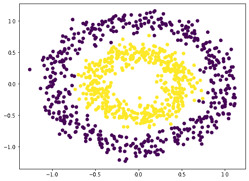
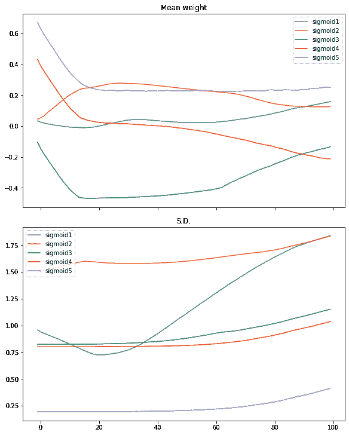
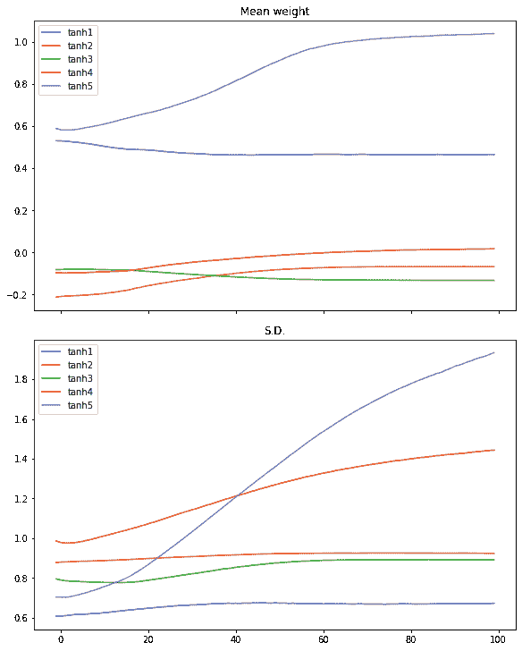
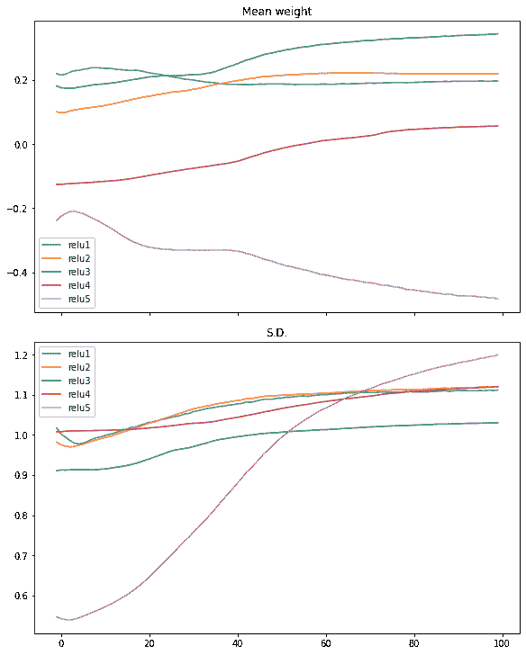
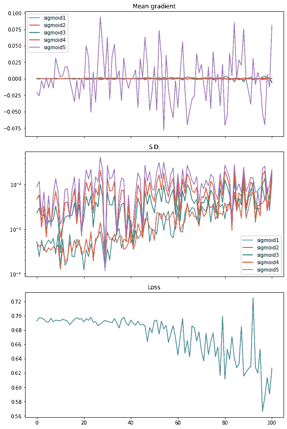
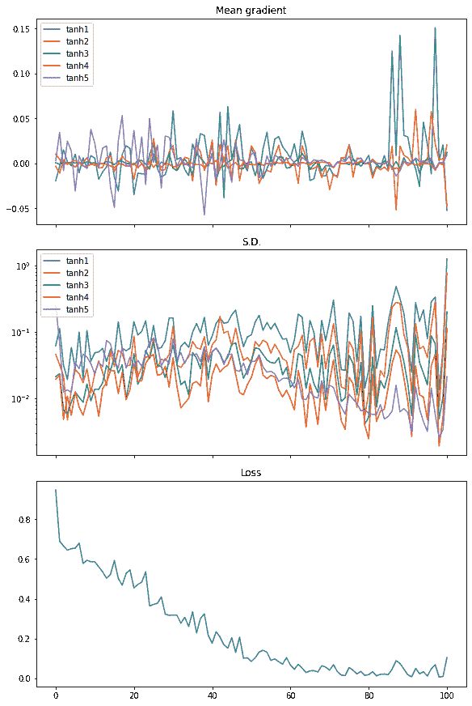
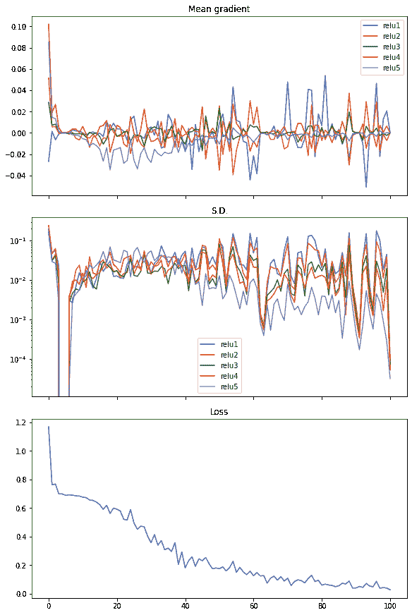

# 可视化梯度消失问题

> 原文：<https://machinelearningmastery.com/visualizing-the-vanishing-gradient-problem/>

最后更新于 2021 年 11 月 26 日

深度学习是最近的发明。部分原因是由于计算能力的提高，允许我们在神经网络中使用更多层的感知器。但与此同时，只有在我们知道如何解决梯度消失问题后，我们才能训练一个深度网络。

在本教程中，我们直观地考察了消失梯度问题存在的原因。

完成本教程后，您将知道

*   什么是消失的梯度
*   神经网络的哪种配置容易受到梯度消失的影响
*   如何在 Keras 中运行手动训练循环
*   如何从 Keras 模型中提取权重和梯度

我们开始吧


可视化消失梯度问题
图片由[亚里沙安东](https://unsplash.com/photos/Oy195xlTAMM)提供，保留部分权利。

## 教程概述

本教程分为 5 个部分；它们是:

1.  多层感知器模型的配置
2.  梯度消失问题示例
3.  看每一层的重量
4.  观察每一层的梯度
5.  格洛特初始化

## 多层感知器模型的配置

由于神经网络是通过梯度下降训练的，人们认为神经网络中需要一个可微函数作为激活函数。这导致我们习惯性地使用 sigmoid 函数或双曲正切函数作为激活。

对于二进制分类问题，如果我们想进行逻辑回归，使 0 和 1 是理想的输出，那么 sigmoid 函数是首选的，因为它在这个范围内:
$
\ sigma(x)= \frac{1}{1+e^{-x}}
$
如果我们需要在输出端激活 sigmoid，那么在神经网络的所有层中使用它是很自然的。此外，神经网络中的每一层都有一个权重参数。最初，权重必须是随机的，自然我们会使用一些简单的方法来实现，比如使用均匀随机或正态分布。

## 梯度消失问题示例

为了说明梯度消失的问题，我们来举个例子试试。神经网络是一种非线性函数。因此它最适合非线性数据集的分类。我们利用 Sklearn 的`make_circle()`函数生成一些数据:

```py
from sklearn.datasets import make_circles
import matplotlib.pyplot as plt

# Make data: Two circles on x-y plane as a classification problem
X, y = make_circles(n_samples=1000, factor=0.5, noise=0.1)

plt.figure(figsize=(8,6))
plt.scatter(X[:,0], X[:,1], c=y)
plt.show()
```



这不难分类。一种天真的方法是构建一个 3 层神经网络，它可以给出一个相当好的结果:

```py
from tensorflow.keras.layers import Dense, Input
from tensorflow.keras import Sequential

model = Sequential([
    Input(shape=(2,)),
    Dense(5, "relu"),
    Dense(1, "sigmoid")
])
model.compile(optimizer="adam", loss="binary_crossentropy", metrics=["acc"])
model.fit(X, y, batch_size=32, epochs=100, verbose=0)
print(model.evaluate(X,y))
```

```py
32/32 [==============================] - 0s 1ms/step - loss: 0.2404 - acc: 0.9730
[0.24042171239852905, 0.9729999899864197]
```

请注意，我们在上面的隐藏层中使用了整流线性单位(ReLU)。默认情况下，Keras 中的密集层将使用线性激活(即无激活)，这通常是无用的。我们通常在现代神经网络中使用 ReLU。但我们也可以像 20 年前的所有人一样，尝试传统的方式:

```py
model = Sequential([
    Input(shape=(2,)),
    Dense(5, "sigmoid"),
    Dense(1, "sigmoid")
])
model.compile(optimizer="adam", loss="binary_crossentropy", metrics=["acc"])
model.fit(X, y, batch_size=32, epochs=100, verbose=0)
print(model.evaluate(X,y))
```

```py
32/32 [==============================] - 0s 1ms/step - loss: 0.6927 - acc: 0.6540
[0.6926590800285339, 0.6539999842643738]
```

准确度差很多。事实证明，增加更多的层会更糟(至少在我的实验中是这样):

```py
model = Sequential([
    Input(shape=(2,)),
    Dense(5, "sigmoid"),
    Dense(5, "sigmoid"),
    Dense(5, "sigmoid"),
    Dense(1, "sigmoid")
])
model.compile(optimizer="adam", loss="binary_crossentropy", metrics=["acc"])
model.fit(X, y, batch_size=32, epochs=100, verbose=0)
print(model.evaluate(X,y))
```

```py
32/32 [==============================] - 0s 1ms/step - loss: 0.6922 - acc: 0.5330
[0.6921834349632263, 0.5329999923706055]
```

鉴于训练算法的随机性，您的结果可能会有所不同。你可能会看到 5 层乙状结肠网络的表现比 3 层差很多。但这里的想法是，你不能恢复高准确率，因为我们可以通过整流线性单位激活仅仅增加层。

## 看每一层的重量

难道我们不应该得到一个更强大、层次更多的神经网络吗？

是的，应该是。但事实证明，随着我们添加更多的层，我们触发了消失的梯度问题。为了说明发生了什么，让我们看看训练网络时权重是什么样子的。

在 Keras 中，我们可以在训练过程中插入一个回调函数。我们将创建自己的回调对象，以截取并记录每个时期结束时多层感知器(MLP)模型的每一层的权重。

```py
from tensorflow.keras.callbacks import Callback

class WeightCapture(Callback):
    "Capture the weights of each layer of the model"
    def __init__(self, model):
        super().__init__()
        self.model = model
        self.weights = []
        self.epochs = []

    def on_epoch_end(self, epoch, logs=None):
        self.epochs.append(epoch) # remember the epoch axis
        weight = {}
        for layer in model.layers:
            if not layer.weights:
                continue
            name = layer.weights[0].name.split("/")[0]
            weight[name] = layer.weights[0].numpy()
        self.weights.append(weight)
```

我们导出`Callback`类并定义`on_epoch_end()`函数。这个类需要创建的模型来初始化。在每个纪元结束时，它将读取每一层并将权重保存到 numpy 数组中。

为了方便实验创建 MLP 的不同方法，我们制作了一个辅助函数来建立神经网络模型:

```py
def make_mlp(activation, initializer, name):
    "Create a model with specified activation and initalizer"
    model = Sequential([
        Input(shape=(2,), name=name+"0"),
        Dense(5, activation=activation, kernel_initializer=initializer, name=name+"1"),
        Dense(5, activation=activation, kernel_initializer=initializer, name=name+"2"),
        Dense(5, activation=activation, kernel_initializer=initializer, name=name+"3"),
        Dense(5, activation=activation, kernel_initializer=initializer, name=name+"4"),
        Dense(1, activation="sigmoid", kernel_initializer=initializer, name=name+"5")
    ])
    return model
```

我们特意创建了一个具有 4 个隐藏层的神经网络，这样我们就可以看到每一层对训练的反应。我们将改变每个隐藏层的激活函数以及权重初始化。为了让事情更容易区分，我们将命名每个层，而不是让 Keras 指定一个名称。输入是 xy 平面上的坐标，因此输入形状是向量 2。输出是二进制分类。因此，我们使用 sigmoid 激活来使输出落在 0 至 1 的范围内。

然后我们可以`compile()`模型来提供评估指标，并在`fit()`调用中传递回调来训练模型:

```py
initializer = RandomNormal(mean=0.0, stddev=1.0)
batch_size = 32
n_epochs = 100

model = make_mlp("sigmoid", initializer, "sigmoid")
capture_cb = WeightCapture(model)
capture_cb.on_epoch_end(-1)
model.compile(optimizer="rmsprop", loss="binary_crossentropy", metrics=["acc"])
model.fit(X, y, batch_size=batch_size, epochs=n_epochs, callbacks=[capture_cb], verbose=1)
```

这里我们先通过调用`make_mlp()`来创建神经网络。然后我们设置回调对象。由于神经网络中每一层的权重都是在创建时初始化的，所以我们特意调用回调函数来记住它们被初始化为什么。然后我们像往常一样从模型中调用`compile()`和`fit()`，并提供回调对象。

拟合模型后，我们可以用整个数据集对其进行评估:

```py
...
print(model.evaluate(X,y))
```

```py
[0.6649572253227234, 0.5879999995231628]
```

这里，这意味着使用 sigmoid 激活的所有层的模型的对数损失为 0.665，准确率为 0.588。

我们可以进一步研究的是权重如何随着训练的迭代而变化。除了第一层和最后一层之外，所有层的权重都是 5×5 矩阵。我们可以检查权重的平均值和标准偏差，以了解权重的外观:

```py
def plotweight(capture_cb):
    "Plot the weights' mean and s.d. across epochs"
    fig, ax = plt.subplots(2, 1, sharex=True, constrained_layout=True, figsize=(8, 10))
    ax[0].set_title("Mean weight")
    for key in capture_cb.weights[0]:
        ax[0].plot(capture_cb.epochs, [w[key].mean() for w in capture_cb.weights], label=key)
    ax[0].legend()
    ax[1].set_title("S.D.")
    for key in capture_cb.weights[0]:
        ax[1].plot(capture_cb.epochs, [w[key].std() for w in capture_cb.weights], label=key)
    ax[1].legend()
    plt.show()

plotweight(capture_cb)
```

这导致如下图:

我们看到平均权重仅在前 10 次迭代左右快速移动。只有第一层的权重随着其标准差的上升而变得更加多样化。

我们可以在相同的过程中重新启动双曲正切(tanh)激活:

```py
# tanh activation, large variance gaussian initialization
model = make_mlp("tanh", initializer, "tanh")
capture_cb = WeightCapture(model)
capture_cb.on_epoch_end(-1)
model.compile(optimizer="rmsprop", loss="binary_crossentropy", metrics=["acc"])
model.fit(X, y, batch_size=batch_size, epochs=n_epochs, callbacks=[capture_cb], verbose=0)
print(model.evaluate(X,y))
plotweight(capture_cb)
```

```py
[0.012918001972138882, 0.9929999709129333]
```

对数损失和准确率都得到了提高。如果我们看一下图，我们看不到权重的平均值和标准差的突然变化，相反，所有层的平均值和标准差都在慢慢收敛。



在 ReLU 激活中可以看到类似的情况:

```py
# relu activation, large variance gaussian initialization
model = make_mlp("relu", initializer, "relu")
capture_cb = WeightCapture(model)
capture_cb.on_epoch_end(-1)
model.compile(optimizer="rmsprop", loss="binary_crossentropy", metrics=["acc"])
model.fit(X, y, batch_size=batch_size, epochs=n_epochs, callbacks=[capture_cb], verbose=0)
print(model.evaluate(X,y))
plotweight(capture_cb)
```

```py
[0.016895903274416924, 0.9940000176429749]
```



## 观察每一层的梯度

我们在上面看到了不同激活函数的效果。但事实上，重要的是坡度，因为我们在训练中跑得很好。Xavier Glorot 和 Yoshua Bengio 的论文《理解训练深度前馈神经网络的难度》建议在每次训练迭代中查看每一层的梯度以及它的标准差。

> 布拉德利(2009)发现，在初始化之后，当从输出层向输入层移动时，反向传播的梯度变小。他研究了每一层都有线性激活的网络，发现反向传播梯度的方差随着我们在网络中的后退而减小

——《理解深度前馈神经网络训练的难点》(2010)

为了理解激活函数如何与训练期间感知的梯度相关，我们需要手动运行训练循环。

在 Tensorflow-Keras 中，可以通过打开梯度带来运行训练循环，然后使神经网络模型产生输出，之后我们可以通过从梯度带自动微分来获得梯度。随后，我们可以根据梯度下降更新规则更新参数(权重和偏差)。

因为梯度很容易在这个循环中获得，所以我们可以复制它。以下是我们如何实现训练循环，同时保留梯度的副本:

```py
optimizer = tf.keras.optimizers.RMSprop()
loss_fn = tf.keras.losses.BinaryCrossentropy()

def train_model(X, y, model, n_epochs=n_epochs, batch_size=batch_size):
    "Run training loop manually"
    train_dataset = tf.data.Dataset.from_tensor_slices((X, y))
    train_dataset = train_dataset.shuffle(buffer_size=1024).batch(batch_size)

    gradhistory = []
    losshistory = []
    def recordweight():
        data = {}
        for g,w in zip(grads, model.trainable_weights):
            if '/kernel:' not in w.name:
                continue # skip bias
            name = w.name.split("/")[0]
            data[name] = g.numpy()
        gradhistory.append(data)
        losshistory.append(loss_value.numpy())
    for epoch in range(n_epochs):
        for step, (x_batch_train, y_batch_train) in enumerate(train_dataset):
            with tf.GradientTape() as tape:
                y_pred = model(x_batch_train, training=True)
                loss_value = loss_fn(y_batch_train, y_pred)

            grads = tape.gradient(loss_value, model.trainable_weights)
            optimizer.apply_gradients(zip(grads, model.trainable_weights))

            if step == 0:
                recordweight()
    # After all epochs, record again
    recordweight()
    return gradhistory, losshistory
```

上面函数中的键是嵌套的 for 循环。其中，我们启动`tf.GradientTape()`并向模型传递一批数据以获得预测，然后使用损失函数对其进行评估。然后，我们可以通过比较损失和模型中的可训练重量，从磁带中拉出梯度。接下来，我们使用优化器更新权重，优化器将隐式处理梯度下降算法中的学习权重和动量。

作为刷新，这里的梯度表示如下。对于计算的损失值$L$和权重为$W=[w_1，w_2，w_3，w_4，w_5]$(例如，在输出层上)的层，梯度就是矩阵

$
\ frac { \ partial L } { partial W } = \ Big[\ frac { \ partial L } { partial W _ 1 }，\ frac { \ partial L } { \ partial w _ 2 }，\ frac { \ partial L } { \ partial w _ 3 }，\ frac { \ partial L } { \ partial w _ 4 }，\ frac { \ partial L } { partial W _ 5 } \ Big]
$

但是在我们开始下一次迭代训练之前，我们有机会进一步操作梯度:我们将梯度与权重进行匹配，以获得每个权重的名称，然后将梯度的副本保存为 numpy 数组。我们每个时期只对权重和权重减轻进行一次采样，但您可以将其更改为更高频率的采样。

有了这些，我们可以绘制出不同时期的梯度。在下面，我们创建模型(但不调用`compile()`，因为我们以后不会调用`fit()`)并运行手动训练循环，然后绘制梯度以及梯度的标准差:

```py
from sklearn.metrics import accuracy_score

def plot_gradient(gradhistory, losshistory):
    "Plot gradient mean and sd across epochs"
    fig, ax = plt.subplots(3, 1, sharex=True, constrained_layout=True, figsize=(8, 12))
    ax[0].set_title("Mean gradient")
    for key in gradhistory[0]:
        ax[0].plot(range(len(gradhistory)), [w[key].mean() for w in gradhistory], label=key)
    ax[0].legend()
    ax[1].set_title("S.D.")
    for key in gradhistory[0]:
        ax[1].semilogy(range(len(gradhistory)), [w[key].std() for w in gradhistory], label=key)
    ax[1].legend()
    ax[2].set_title("Loss")
    ax[2].plot(range(len(losshistory)), losshistory)
    plt.show()

model = make_mlp("sigmoid", initializer, "sigmoid")
print("Before training: Accuracy", accuracy_score(y, (model(X) > 0.5)))
gradhistory, losshistory = train_model(X, y, model)
print("After training: Accuracy", accuracy_score(y, (model(X) > 0.5)))
plot_gradient(gradhistory, losshistory)
```

它报告了一个弱分类结果:

```py
Before training: Accuracy 0.5
After training: Accuracy 0.652
```

我们得到的图显示梯度消失:



从剧情来看，损失并没有明显减少。梯度的平均值(即梯度矩阵中所有元素的平均值)仅在最后一层具有显著的值，而所有其他层实际上为零。梯度的标准偏差大约在 0.01 和 0.001 之间。

使用 tanh 激活重复此操作，我们会看到不同的结果，这解释了为什么表现更好:

```py
model = make_mlp("tanh", initializer, "tanh")
print("Before training: Accuracy", accuracy_score(y, (model(X) > 0.5)))
gradhistory, losshistory = train_model(X, y, model)
print("After training: Accuracy", accuracy_score(y, (model(X) > 0.5)))
plot_gradient(gradhistory, losshistory)
```

```py
Before training: Accuracy 0.502
After training: Accuracy 0.994
```



从梯度平均值的图中，我们看到每一层的梯度都在均匀地摆动。梯度的标准偏差也比乙状结肠激活的情况大一个数量级，在 0.1 到 0.01 左右。

最后，我们还可以在整流线性单元(ReLU)激活中看到类似的情况。在这种情况下，损失迅速下降，因此我们将其视为神经网络中更有效的激活:

```py
model = make_mlp("relu", initializer, "relu")
print("Before training: Accuracy", accuracy_score(y, (model(X) > 0.5)))
gradhistory, losshistory = train_model(X, y, model)
print("After training: Accuracy", accuracy_score(y, (model(X) > 0.5)))
plot_gradient(gradhistory, losshistory)
```

```py
Before training: Accuracy 0.503
After training: Accuracy 0.995
```



以下是完整的代码:

```py
import numpy as np
import tensorflow as tf
from tensorflow.keras.callbacks import Callback
from tensorflow.keras.layers import Dense, Input
from tensorflow.keras import Sequential
from tensorflow.keras.initializers import RandomNormal
import matplotlib.pyplot as plt
from sklearn.datasets import make_circles
from sklearn.metrics import accuracy_score

tf.random.set_seed(42)
np.random.seed(42)

# Make data: Two circles on x-y plane as a classification problem
X, y = make_circles(n_samples=1000, factor=0.5, noise=0.1)
plt.figure(figsize=(8,6))
plt.scatter(X[:,0], X[:,1], c=y)
plt.show()

# Test performance with 3-layer binary classification network
model = Sequential([
    Input(shape=(2,)),
    Dense(5, "relu"),
    Dense(1, "sigmoid")
])
model.compile(optimizer="adam", loss="binary_crossentropy", metrics=["acc"])
model.fit(X, y, batch_size=32, epochs=100, verbose=0)
print(model.evaluate(X,y))

# Test performance with 3-layer network with sigmoid activation
model = Sequential([
    Input(shape=(2,)),
    Dense(5, "sigmoid"),
    Dense(1, "sigmoid")
])
model.compile(optimizer="adam", loss="binary_crossentropy", metrics=["acc"])
model.fit(X, y, batch_size=32, epochs=100, verbose=0)
print(model.evaluate(X,y))

# Test performance with 5-layer network with sigmoid activation
model = Sequential([
    Input(shape=(2,)),
    Dense(5, "sigmoid"),
    Dense(5, "sigmoid"),
    Dense(5, "sigmoid"),
    Dense(1, "sigmoid")
])
model.compile(optimizer="adam", loss="binary_crossentropy", metrics=["acc"])
model.fit(X, y, batch_size=32, epochs=100, verbose=0)
print(model.evaluate(X,y))

# Illustrate weights across epochs
class WeightCapture(Callback):
    "Capture the weights of each layer of the model"
    def __init__(self, model):
        super().__init__()
        self.model = model
        self.weights = []
        self.epochs = []

    def on_epoch_end(self, epoch, logs=None):
        self.epochs.append(epoch) # remember the epoch axis
        weight = {}
        for layer in model.layers:
            if not layer.weights:
                continue
            name = layer.weights[0].name.split("/")[0]
            weight[name] = layer.weights[0].numpy()
        self.weights.append(weight)

def make_mlp(activation, initializer, name):
    "Create a model with specified activation and initalizer"
    model = Sequential([
        Input(shape=(2,), name=name+"0"),
        Dense(5, activation=activation, kernel_initializer=initializer, name=name+"1"),
        Dense(5, activation=activation, kernel_initializer=initializer, name=name+"2"),
        Dense(5, activation=activation, kernel_initializer=initializer, name=name+"3"),
        Dense(5, activation=activation, kernel_initializer=initializer, name=name+"4"),
        Dense(1, activation="sigmoid", kernel_initializer=initializer, name=name+"5")
    ])
    return model

def plotweight(capture_cb):
    "Plot the weights' mean and s.d. across epochs"
    fig, ax = plt.subplots(2, 1, sharex=True, constrained_layout=True, figsize=(8, 10))
    ax[0].set_title("Mean weight")
    for key in capture_cb.weights[0]:
        ax[0].plot(capture_cb.epochs, [w[key].mean() for w in capture_cb.weights], label=key)
    ax[0].legend()
    ax[1].set_title("S.D.")
    for key in capture_cb.weights[0]:
        ax[1].plot(capture_cb.epochs, [w[key].std() for w in capture_cb.weights], label=key)
    ax[1].legend()
    plt.show()

initializer = RandomNormal(mean=0, stddev=1)
batch_size = 32
n_epochs = 100

# Sigmoid activation
model = make_mlp("sigmoid", initializer, "sigmoid")
capture_cb = WeightCapture(model)
capture_cb.on_epoch_end(-1)
model.compile(optimizer="rmsprop", loss="binary_crossentropy", metrics=["acc"])
print("Before training: Accuracy", accuracy_score(y, (model(X).numpy() > 0.5).astype(int)))
model.fit(X, y, batch_size=batch_size, epochs=n_epochs, callbacks=[capture_cb], verbose=0)
print("After training: Accuracy", accuracy_score(y, (model(X).numpy() > 0.5).astype(int)))
print(model.evaluate(X,y))
plotweight(capture_cb)

# tanh activation
model = make_mlp("tanh", initializer, "tanh")
capture_cb = WeightCapture(model)
capture_cb.on_epoch_end(-1)
model.compile(optimizer="rmsprop", loss="binary_crossentropy", metrics=["acc"])
print("Before training: Accuracy", accuracy_score(y, (model(X).numpy() > 0.5).astype(int)))
model.fit(X, y, batch_size=batch_size, epochs=n_epochs, callbacks=[capture_cb], verbose=0)
print("After training: Accuracy", accuracy_score(y, (model(X).numpy() > 0.5).astype(int)))
print(model.evaluate(X,y))
plotweight(capture_cb)

# relu activation
model = make_mlp("relu", initializer, "relu")
capture_cb = WeightCapture(model)
capture_cb.on_epoch_end(-1)
model.compile(optimizer="rmsprop", loss="binary_crossentropy", metrics=["acc"])
print("Before training: Accuracy", accuracy_score(y, (model(X).numpy() > 0.5).astype(int)))
model.fit(X, y, batch_size=batch_size, epochs=n_epochs, callbacks=[capture_cb], verbose=0)
print("After training: Accuracy", accuracy_score(y, (model(X).numpy() > 0.5).astype(int)))
print(model.evaluate(X,y))
plotweight(capture_cb)

# Show gradient across epochs
optimizer = tf.keras.optimizers.RMSprop()
loss_fn = tf.keras.losses.BinaryCrossentropy()

def train_model(X, y, model, n_epochs=n_epochs, batch_size=batch_size):
    "Run training loop manually"
    train_dataset = tf.data.Dataset.from_tensor_slices((X, y))
    train_dataset = train_dataset.shuffle(buffer_size=1024).batch(batch_size)

    gradhistory = []
    losshistory = []
    def recordweight():
        data = {}
        for g,w in zip(grads, model.trainable_weights):
            if '/kernel:' not in w.name:
                continue # skip bias
            name = w.name.split("/")[0]
            data[name] = g.numpy()
        gradhistory.append(data)
        losshistory.append(loss_value.numpy())
    for epoch in range(n_epochs):
        for step, (x_batch_train, y_batch_train) in enumerate(train_dataset):
            with tf.GradientTape() as tape:
                y_pred = model(x_batch_train, training=True)
                loss_value = loss_fn(y_batch_train, y_pred)

            grads = tape.gradient(loss_value, model.trainable_weights)
            optimizer.apply_gradients(zip(grads, model.trainable_weights))

            if step == 0:
                recordweight()
    # After all epochs, record again
    recordweight()
    return gradhistory, losshistory

def plot_gradient(gradhistory, losshistory):
    "Plot gradient mean and sd across epochs"
    fig, ax = plt.subplots(3, 1, sharex=True, constrained_layout=True, figsize=(8, 12))
    ax[0].set_title("Mean gradient")
    for key in gradhistory[0]:
        ax[0].plot(range(len(gradhistory)), [w[key].mean() for w in gradhistory], label=key)
    ax[0].legend()
    ax[1].set_title("S.D.")
    for key in gradhistory[0]:
        ax[1].semilogy(range(len(gradhistory)), [w[key].std() for w in gradhistory], label=key)
    ax[1].legend()
    ax[2].set_title("Loss")
    ax[2].plot(range(len(losshistory)), losshistory)
    plt.show()

model = make_mlp("sigmoid", initializer, "sigmoid")
print("Before training: Accuracy", accuracy_score(y, (model(X) > 0.5)))
gradhistory, losshistory = train_model(X, y, model)
print("After training: Accuracy", accuracy_score(y, (model(X) > 0.5)))
plot_gradient(gradhistory, losshistory)

model = make_mlp("tanh", initializer, "tanh")
print("Before training: Accuracy", accuracy_score(y, (model(X) > 0.5)))
gradhistory, losshistory = train_model(X, y, model)
print("After training: Accuracy", accuracy_score(y, (model(X) > 0.5)))
plot_gradient(gradhistory, losshistory)

model = make_mlp("relu", initializer, "relu")
print("Before training: Accuracy", accuracy_score(y, (model(X) > 0.5)))
gradhistory, losshistory = train_model(X, y, model)
print("After training: Accuracy", accuracy_score(y, (model(X) > 0.5)))
plot_gradient(gradhistory, losshistory)
```

## 格洛特初始化

我们没有在上面的代码中演示，但是 glrot 和 Bengio 的论文中最著名的结果是 glrot 初始化。其建议初始化具有均匀分布的神经网络的一层的权重:

> 因此，在初始化深层网络时，标准化因素可能很重要，因为通过各层会产生倍增效应，我们建议采用以下初始化程序来近似满足我们的目标，即在网络中上下移动时保持激活方差和反向传播梯度方差。我们称之为规范化初始化:
> $
> W \ sim U \ Big[-\ frac { 6 } } { \ sqrt { n _ j+n _ { j+1 } }、\ frac { 6 } } { \ sqrt { n _ j+n _ { j+1 } } \ Big]
> $

——《理解深度前馈神经网络训练的难点》(2010)

这源于线性激活，条件是梯度的标准偏差在各层之间保持一致。在 sigmoid 和 tanh 激活中，线性区域较窄。因此，我们可以理解为什么 ReLU 是解决梯度消失问题的关键。与替换激活函数相比，改变权重初始化在帮助解决梯度消失问题方面不太明显。但这可以是一个让你探索的练习，看看这如何有助于改善结果。

## 进一步阅读

格洛特和本吉奥的论文可在以下网站获得:

*   “理解训练深度前馈神经网络的难度”，Xavier Glorot 和 Yoshua Bengio 著，2010 年。
    ([https://proceedings.mlr.press/v9/glorot10a/glorot10a.pdf](https://proceedings.mlr.press/v9/glorot10a/glorot10a.pdf))

梯度消失问题在机器学习中是众所周知的，许多书都涉及到了它。例如，

*   *深度学习*，作者:伊恩·古德费勒，约斯华·本吉奥，亚伦·库维尔，2016。
    ([https://www.amazon.com/dp/0262035618](https://www.amazon.com/dp/0262035618))

之前我们有关于梯度消失和爆炸的帖子:

*   [如何使用校正后的线性激活函数](https://machinelearningmastery.com/how-to-fix-vanishing-gradients-using-the-rectified-linear-activation-function/)固定梯度消失
*   [神经网络中的梯度爆炸](https://machinelearningmastery.com/exploding-gradients-in-neural-networks/)

您可能还会发现以下文档有助于解释我们上面使用的一些语法:

*   Keras 中从零开始的训练循环:https://Keras . io/guides/writing _ a _ training _ loop _ from _ scratch/
*   在 Keras 写自己的回调:[https://keras.io/guides/writing_your_own_callbacks/](https://keras.io/guides/writing_your_own_callbacks/)

## 摘要

在本教程中，您直观地看到了经过校正的线性单位(ReLU)如何帮助解决消失的梯度问题。

具体来说，您了解到:

*   梯度消失问题如何影响神经网络的表现
*   为什么 ReLU 激活是梯度消失问题的解决方案
*   如何在 Keras 中使用自定义回调在训练循环中间提取数据
*   如何编写自定义训练循环
*   如何从神经网络的一个层读取权重和梯度