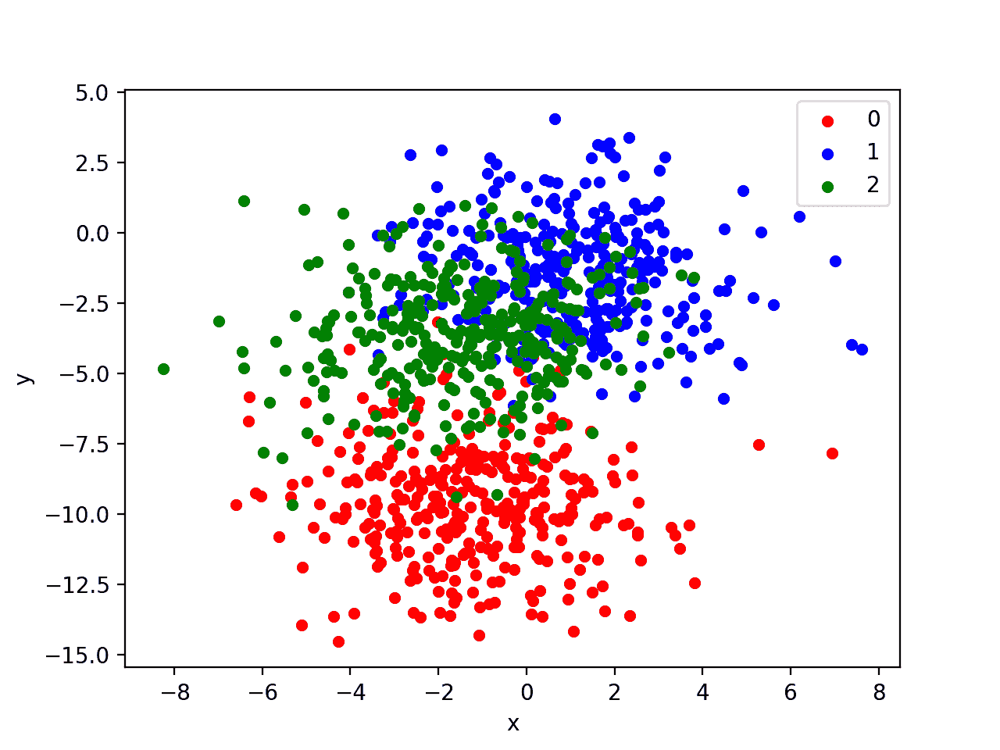
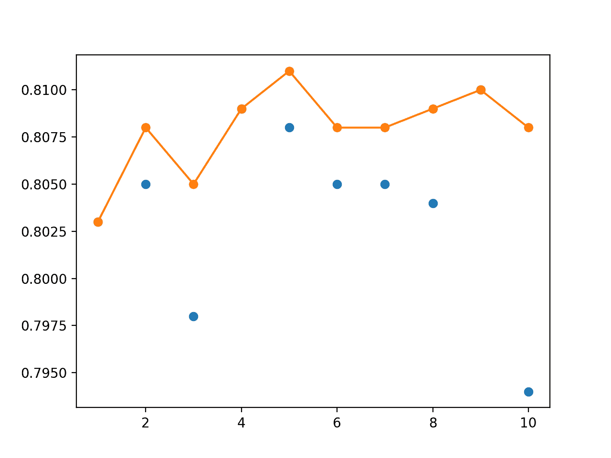

# 如何为深度学习神经网络开发加权平均集成

> 原文：<https://machinelearningmastery.com/weighted-average-ensemble-for-deep-learning-neural-networks/>

最后更新于 2020 年 8 月 25 日

建模平均集成平均地组合来自每个模型的预测，并且通常比给定的单个模型产生更好的平均表现。

有时候，有一些非常好的模型，我们希望对[集合预测](https://machinelearningmastery.com/ensemble-methods-for-deep-learning-neural-networks/)贡献更多，也可能有一些不太熟练的模型，它们可能有用，但应该对集合预测贡献更少。加权平均集成是一种方法，它允许多个模型按其信任度或估计表现的比例对预测做出贡献。

在本教程中，您将发现如何使用 Keras 在 Python 中开发深度学习神经网络模型的加权平均集成。

完成本教程后，您将知道:

*   模型平均集成是有限的，因为它们要求每个集成成员对预测的贡献相等。
*   加权平均集成允许每个集成成员对预测的贡献与成员在保持数据集上的信任或表现成比例加权。
*   如何在 Keras 中实现加权平均集成，并将结果与模型平均集成和独立模型进行比较。

**用我的新书[更好的深度学习](https://machinelearningmastery.com/better-deep-learning/)启动你的项目**，包括*分步教程*和所有示例的 *Python 源代码*文件。

我们开始吧。

*   **2019 年 10 月更新**:针对 Keras 2.3 和 TensorFlow 2.0 更新。
*   **2020 年 1 月更新**:针对 Sklearn v0.22 API 的变化进行了更新。


如何开发深度学习神经网络的加权平均集成
图片由[西蒙·马特辛格](https://www.flickr.com/photos/simonmatzinger/12016060454/)提供，版权所有。

## 教程概述

本教程分为六个部分；它们是:

1.  加权平均集成
2.  多类分类问题
3.  多层感知器模型
4.  模型平均集成
5.  网格搜索加权平均集成
6.  优化加权平均集成

## 加权平均集成

模型平均是一种集成学习方法，其中每个集成成员对最终预测的贡献相等。

在回归的情况下，集合预测被计算为成员预测的平均值。在预测类别标签的情况下，预测被计算为成员预测的模式。在预测类别概率的情况下，预测可以被计算为每个类别标签的总概率的 argmax。

这种方法的一个局限性是，每个模型对集合所做的最终预测有相同的贡献。有一个要求，所有的集成成员都有技能，而不是随机的机会，尽管一些模型被认为表现得比其他模型好得多或差得多。

加权集成是模型平均集成的扩展，其中每个成员对最终预测的贡献由模型的表现加权。

模型权重是小正值，所有权重之和等于 1，允许权重指示每个模型的信任百分比或预期表现。

> 我们可以把权重 Wk 看作是对预测因子 k 的信念，因此我们将权重限制为正，并求和为一。

——[用集成学习:过度适应有多有用](http://papers.nips.cc/paper/1044-learning-with-ensembles-how-overfitting-can-be-useful.pdf)，1996。

权重的统一值(例如 1/k，其中 k 是集成成员的数量)意味着加权集成充当简单的平均集成。没有找到权重的解析解(我们无法计算)；相反，可以使用训练数据集或保持验证数据集来估计权重值。

使用用于拟合集合成员的相同训练集来找到权重将可能导致过拟合模型。更稳健的方法是使用集合成员在训练期间看不到的保持验证数据集。

最简单，也许是最详尽的方法是网格搜索每个集成成员的 0 到 1 之间的权重值。或者，诸如线性解算器或梯度下降优化的优化过程可用于使用单位范数权重约束来估计权重，以确保权重向量和为 1。

除非保持验证数据集很大且具有代表性，否则与简单的平均集成相比，加权集成有机会过度填充。

在不计算显式权重系数的情况下，给定模型增加更多权重的一个简单替代方法是给定模型多次添加到集合中。尽管不太灵活，但它允许给定的表现良好的模型对集成做出的给定预测做出不止一次的贡献。

## 多类分类问题

我们将使用一个小的多类分类问题作为基础来演示加权平均集成。

Sklearn 类提供了 [make_blobs()函数](http://Sklearn.org/stable/modules/generated/sklearn.datasets.make_blobs.html)，该函数可用于创建具有规定数量的样本、输入变量、类和类内样本方差的多类分类问题。

该问题有两个输入变量(表示点的 *x* 和 *y* 坐标)和每组内点的标准偏差 2.0。我们将使用相同的随机状态(伪随机数发生器的种子)来确保我们总是获得相同的数据点。

```py
# generate 2d classification dataset
X, y = make_blobs(n_samples=1000, centers=3, n_features=2, cluster_std=2, random_state=2)
```

结果是我们可以建模的数据集的输入和输出元素。

为了了解问题的复杂性，我们可以在二维散点图上绘制每个点，并按类值给每个点着色。

下面列出了完整的示例。

```py
# scatter plot of blobs dataset
from sklearn.datasets import make_blobs
from matplotlib import pyplot
from pandas import DataFrame
# generate 2d classification dataset
X, y = make_blobs(n_samples=1000, centers=3, n_features=2, cluster_std=2, random_state=2)
# scatter plot, dots colored by class value
df = DataFrame(dict(x=X[:,0], y=X[:,1], label=y))
colors = {0:'red', 1:'blue', 2:'green'}
fig, ax = pyplot.subplots()
grouped = df.groupby('label')
for key, group in grouped:
    group.plot(ax=ax, kind='scatter', x='x', y='y', label=key, color=colors[key])
pyplot.show()
```

运行该示例会创建整个数据集的散点图。我们可以看到，2.0 的标准偏差意味着类不是线性可分的(用一条线可分的)，导致了很多不明确的点。

这是可取的，因为这意味着问题不是微不足道的，并将允许神经网络模型找到许多不同的“足够好”的候选解决方案，从而导致高方差。



具有三个类和按类值着色的点的斑点数据集的散点图

## 多层感知器模型

在我们定义模型之前，我们需要设计一个适合加权平均集成的问题。

在我们的问题中，训练数据集相对较小。具体来说，训练数据集中的示例与保持数据集中的示例的比例为 10:1。这模拟了一种情况，即我们可能有大量未标记的示例和少量已标记的示例来训练模型。

我们将从斑点问题中创建 1100 个数据点。模型将在前 100 个点上进行训练，剩余的 1000 个点将保留在测试数据集中，模型无法使用。

该问题是一个多类分类问题，我们将在输出层使用 softmax 激活函数对其进行建模。这意味着模型将以样本属于三类中每一类的概率来预测具有三个元素的向量。因此，在将行分割成训练和测试数据集之前，我们必须对类值进行热编码。我们可以使用 Keras to _ classic()函数来实现这一点。

```py
# generate 2d classification dataset
X, y = make_blobs(n_samples=1100, centers=3, n_features=2, cluster_std=2, random_state=2)
# one hot encode output variable
y = to_categorical(y)
# split into train and test
n_train = 100
trainX, testX = X[:n_train, :], X[n_train:, :]
trainy, testy = y[:n_train], y[n_train:]
print(trainX.shape, testX.shape)
```

接下来，我们可以定义和编译模型。

该模型将预期具有两个输入变量的样本。然后，该模型有一个具有 25 个节点的单个隐藏层和一个校正的线性激活函数，然后有一个具有三个节点的输出层来预测三个类中每一个的概率，还有一个 softmax 激活函数。

由于问题是多类的，我们将使用分类交叉熵损失函数来优化模型和随机梯度下降的有效[亚当味](https://machinelearningmastery.com/adam-optimization-algorithm-for-deep-learning/)。

```py
# define model
model = Sequential()
model.add(Dense(25, input_dim=2, activation='relu'))
model.add(Dense(3, activation='softmax'))
model.compile(loss='categorical_crossentropy', optimizer='adam', metrics=['accuracy'])
```

该模型适用于 500 个训练时期，我们将使用测试集作为验证集，在测试集上评估每个时期的模型。

```py
# fit model
history = model.fit(trainX, trainy, validation_data=(testX, testy), epochs=500, verbose=0)
```

在运行结束时，我们将评估模型在列车和测试集上的表现。

```py
# evaluate the model
_, train_acc = model.evaluate(trainX, trainy, verbose=0)
_, test_acc = model.evaluate(testX, testy, verbose=0)
print('Train: %.3f, Test: %.3f' % (train_acc, test_acc))
```

最后，我们将在训练和验证数据集上绘制每个训练时期的模型准确率的学习曲线。

```py
# learning curves of model accuracy
pyplot.plot(history.history['accuracy'], label='train')
pyplot.plot(history.history['val_accuracy'], label='test')
pyplot.legend()
pyplot.show()
```

将所有这些结合在一起，下面列出了完整的示例。

```py
# develop an mlp for blobs dataset
from sklearn.datasets import make_blobs
from keras.utils import to_categorical
from keras.models import Sequential
from keras.layers import Dense
from matplotlib import pyplot
# generate 2d classification dataset
X, y = make_blobs(n_samples=1100, centers=3, n_features=2, cluster_std=2, random_state=2)
# one hot encode output variable
y = to_categorical(y)
# split into train and test
n_train = 100
trainX, testX = X[:n_train, :], X[n_train:, :]
trainy, testy = y[:n_train], y[n_train:]
print(trainX.shape, testX.shape)
# define model
model = Sequential()
model.add(Dense(25, input_dim=2, activation='relu'))
model.add(Dense(3, activation='softmax'))
model.compile(loss='categorical_crossentropy', optimizer='adam', metrics=['accuracy'])
# fit model
history = model.fit(trainX, trainy, validation_data=(testX, testy), epochs=500, verbose=0)
# evaluate the model
_, train_acc = model.evaluate(trainX, trainy, verbose=0)
_, test_acc = model.evaluate(testX, testy, verbose=0)
print('Train: %.3f, Test: %.3f' % (train_acc, test_acc))
# learning curves of model accuracy
pyplot.plot(history.history['accuracy'], label='train')
pyplot.plot(history.history['val_accuracy'], label='test')
pyplot.legend()
pyplot.show()
```

运行该示例首先打印每个数据集的形状以供确认，然后打印最终模型在训练和测试数据集上的表现。

**注**:考虑到算法或评估程序的随机性，或数值准确率的差异，您的[结果可能会有所不同](https://machinelearningmastery.com/different-results-each-time-in-machine-learning/)。考虑运行该示例几次，并比较平均结果。

在这种情况下，我们可以看到该模型在训练数据集上获得了大约 87%的准确率，我们知道这是乐观的，在测试数据集上获得了大约 81%的准确率，我们预计这将更加真实。

```py
(100, 2) (1000, 2)
Train: 0.870, Test: 0.814
```

还创建了一个线图，显示了在每个训练周期内，训练和测试集上模型准确率的学习曲线。

我们可以看到，在大部分跑步过程中，训练的准确性更加乐观，我们也注意到了最终得分。


每个训练时期训练和测试数据集上模型准确率的线图学习曲线

既然我们已经确定该模型是开发集成的一个很好的候选对象，我们接下来可以考虑开发一个简单的模型平均集成。

## 模型平均集成

在考虑开发加权平均集成之前，我们可以开发一个简单的模型平均集成。

模型平均集成的结果可以用作比较点，因为我们期望配置良好的加权平均集成表现更好。

首先，我们需要拟合多个模型来开发一个集合。我们将定义一个名为 *fit_model()* 的函数，在训练数据集上创建和拟合一个单一的模型，我们可以重复调用这个函数来创建任意多个模型。

```py
# fit model on dataset
def fit_model(trainX, trainy):
	trainy_enc = to_categorical(trainy)
	# define model
	model = Sequential()
	model.add(Dense(25, input_dim=2, activation='relu'))
	model.add(Dense(3, activation='softmax'))
	model.compile(loss='categorical_crossentropy', optimizer='adam', metrics=['accuracy'])
	# fit model
	model.fit(trainX, trainy_enc, epochs=500, verbose=0)
	return model
```

我们可以调用这个函数来创建 10 个模型的池。

```py
# fit all models
n_members = 10
members = [fit_model(trainX, trainy) for _ in range(n_members)]
```

接下来，我们可以开发模型平均集成。

我们不知道有多少成员适合这个问题，所以我们可以创建从 1 到 10 个成员的不同大小的集成，并在测试集上评估每个成员的表现。

我们还可以在测试集的表现中评估每个独立模型的表现。这为模型平均集成提供了一个有用的比较点，因为我们预计该集成将平均胜过随机选择的单个模型。

每个模型预测每个类别标签的概率，例如，有三个输出。通过对预测概率使用 [argmax()函数](https://docs.scipy.org/doc/numpy/reference/generated/numpy.argmax.html)，可以将单个预测转换为类别标签，例如返回具有最大概率值的预测中的索引。我们可以通过对每个类别预测的概率求和并对结果使用 *argmax()* 来集成来自多个模型的预测。下面的*集成预测()*函数实现了这种行为。

```py
# make an ensemble prediction for multi-class classification
def ensemble_predictions(members, testX):
	# make predictions
	yhats = [model.predict(testX) for model in members]
	yhats = array(yhats)
	# sum across ensemble members
	summed = numpy.sum(yhats, axis=0)
	# argmax across classes
	result = argmax(summed, axis=1)
	return result
```

我们可以通过从所有模型列表中选择所需数量的模型，调用*integration _ predictions()*函数进行预测，然后通过将其与真实值进行比较来计算预测的准确性，从而估计给定大小的集成的表现。下面的 *evaluate_n_members()* 函数实现了这个行为。

```py
# evaluate a specific number of members in an ensemble
def evaluate_n_members(members, n_members, testX, testy):
	# select a subset of members
	subset = members[:n_members]
	# make prediction
	yhat = ensemble_predictions(subset, testX)
	# calculate accuracy
	return accuracy_score(testy, yhat)
```

每个尺寸的集成的分数可以被存储起来以供以后绘制，并且收集每个单独模型的分数并报告平均表现。

```py
# evaluate different numbers of ensembles on hold out set
single_scores, ensemble_scores = list(), list()
for i in range(1, len(members)+1):
	# evaluate model with i members
	ensemble_score = evaluate_n_members(members, i, testX, testy)
	# evaluate the i'th model standalone
	testy_enc = to_categorical(testy)
	_, single_score = members[i-1].evaluate(testX, testy_enc, verbose=0)
	# summarize this step
	print('> %d: single=%.3f, ensemble=%.3f' % (i, single_score, ensemble_score))
	ensemble_scores.append(ensemble_score)
	single_scores.append(single_score)
# summarize average accuracy of a single final model
print('Accuracy %.3f (%.3f)' % (mean(single_scores), std(single_scores)))
```

最后，我们创建了一个图表，显示了每个单独模型的准确性(蓝点)和模型平均集成的表现，因为成员数量从 1 个增加到 10 个(橙色线)。

将所有这些结合在一起，下面列出了完整的示例。

```py
# model averaging ensemble for the blobs dataset
from sklearn.datasets import make_blobs
from sklearn.metrics import accuracy_score
from keras.utils import to_categorical
from keras.models import Sequential
from keras.layers import Dense
from matplotlib import pyplot
from numpy import mean
from numpy import std
import numpy
from numpy import array
from numpy import argmax

# fit model on dataset
def fit_model(trainX, trainy):
	trainy_enc = to_categorical(trainy)
	# define model
	model = Sequential()
	model.add(Dense(25, input_dim=2, activation='relu'))
	model.add(Dense(3, activation='softmax'))
	model.compile(loss='categorical_crossentropy', optimizer='adam', metrics=['accuracy'])
	# fit model
	model.fit(trainX, trainy_enc, epochs=500, verbose=0)
	return model

# make an ensemble prediction for multi-class classification
def ensemble_predictions(members, testX):
	# make predictions
	yhats = [model.predict(testX) for model in members]
	yhats = array(yhats)
	# sum across ensemble members
	summed = numpy.sum(yhats, axis=0)
	# argmax across classes
	result = argmax(summed, axis=1)
	return result

# evaluate a specific number of members in an ensemble
def evaluate_n_members(members, n_members, testX, testy):
	# select a subset of members
	subset = members[:n_members]
	# make prediction
	yhat = ensemble_predictions(subset, testX)
	# calculate accuracy
	return accuracy_score(testy, yhat)

# generate 2d classification dataset
X, y = make_blobs(n_samples=1100, centers=3, n_features=2, cluster_std=2, random_state=2)
# split into train and test
n_train = 100
trainX, testX = X[:n_train, :], X[n_train:, :]
trainy, testy = y[:n_train], y[n_train:]
print(trainX.shape, testX.shape)
# fit all models
n_members = 10
members = [fit_model(trainX, trainy) for _ in range(n_members)]
# evaluate different numbers of ensembles on hold out set
single_scores, ensemble_scores = list(), list()
for i in range(1, len(members)+1):
	# evaluate model with i members
	ensemble_score = evaluate_n_members(members, i, testX, testy)
	# evaluate the i'th model standalone
	testy_enc = to_categorical(testy)
	_, single_score = members[i-1].evaluate(testX, testy_enc, verbose=0)
	# summarize this step
	print('> %d: single=%.3f, ensemble=%.3f' % (i, single_score, ensemble_score))
	ensemble_scores.append(ensemble_score)
	single_scores.append(single_score)
# summarize average accuracy of a single final model
print('Accuracy %.3f (%.3f)' % (mean(single_scores), std(single_scores)))
# plot score vs number of ensemble members
x_axis = [i for i in range(1, len(members)+1)]
pyplot.plot(x_axis, single_scores, marker='o', linestyle='None')
pyplot.plot(x_axis, ensemble_scores, marker='o')
pyplot.show()
```

运行该示例首先报告每个单个模型的表现，以及给定大小(1、2、3 等)的模型平均集合。成员。

**注**:考虑到算法或评估程序的随机性，或数值准确率的差异，您的[结果可能会有所不同](https://machinelearningmastery.com/different-results-each-time-in-machine-learning/)。考虑运行该示例几次，并比较平均结果。

在这次运行中，单个模型的平均表现约为 80.4%，我们可以看到一个由 5 到 9 名成员组成的集合将达到 80.8%到 81%的表现。正如预期的那样，中等规模模型平均集成的表现平均超过随机选择的单个模型的表现。

```py
(100, 2) (1000, 2)
> 1: single=0.803, ensemble=0.803
> 2: single=0.805, ensemble=0.808
> 3: single=0.798, ensemble=0.805
> 4: single=0.809, ensemble=0.809
> 5: single=0.808, ensemble=0.811
> 6: single=0.805, ensemble=0.808
> 7: single=0.805, ensemble=0.808
> 8: single=0.804, ensemble=0.809
> 9: single=0.810, ensemble=0.810
> 10: single=0.794, ensemble=0.808
Accuracy 0.804 (0.005)
```

接下来，创建一个图表，将单个模型(蓝点)的准确率与不断增大的模型平均集合(橙色线)进行比较。

在这一轮中，橙色系列的集成明显显示出比单一型号更好或相当的表现(如果隐藏圆点的话)。



显示单一模型准确率(蓝点)和增加尺寸的集合准确率(橙色线)的线图

现在我们知道如何开发一个模型平均集成，我们可以通过加权集成成员的贡献来进一步扩展该方法。

## 网格搜索加权平均集成

模型平均集成允许每个集成成员对集成的预测贡献相等的量。

我们可以更新这个例子，这样每个集成成员的贡献就会被一个系数加权，这个系数表示模型的信任或预期表现。权重值是介于 0 和 1 之间的小值，像百分比一样处理，这样所有集合成员的权重总和为 1。

首先，我们必须更新*集成 _ 预测()*函数，以利用每个集成成员的权重向量。

我们必须计算加权和，而不是简单地对每个集成成员的预测求和。我们可以使用 for 循环手动实现这一点，但是这效率非常低；例如:

```py
# calculated a weighted sum of predictions
def weighted_sum(weights, yhats):
	rows = list()
	for j in range(yhats.shape[1]):
		# enumerate values
		row = list()
		for k in range(yhats.shape[2]):
			# enumerate members
			value = 0.0
			for i in range(yhats.shape[0]):
				value += weights[i] * yhats[i,j,k]
			row.append(value)
		rows.append(row)
	return array(rows)
```

相反，我们可以使用高效的 NumPy 函数来实现加权和，如 [einsum()](https://docs.scipy.org/doc/numpy/reference/generated/numpy.einsum.html) 或 [tensordot()](https://docs.scipy.org/doc/numpy/reference/generated/numpy.tensordot.html) 。

对这些函数的全面讨论有点超出范围，因此如果您是线性代数和/或 NumPy 的新手，请参考 API 文档了解如何使用这些函数的更多信息，因为它们具有挑战性。我们将使用 *tensordot()* 函数来应用具有所需求和的张量积；更新后的*集合 _ 预测()*功能如下。

```py
# make an ensemble prediction for multi-class classification
def ensemble_predictions(members, weights, testX):
	# make predictions
	yhats = [model.predict(testX) for model in members]
	yhats = array(yhats)
	# weighted sum across ensemble members
	summed = tensordot(yhats, weights, axes=((0),(0)))
	# argmax across classes
	result = argmax(summed, axis=1)
	return result
```

接下来，我们必须更新 *evaluate_ensemble()* ，以便在为集成进行预测时传递权重。

```py
# evaluate a specific number of members in an ensemble
def evaluate_ensemble(members, weights, testX, testy):
	# make prediction
	yhat = ensemble_predictions(members, weights, testX)
	# calculate accuracy
	return accuracy_score(testy, yhat)
```

我们将使用一个由五名成员组成的中等规模的集合，该集合在模型平均集合中表现良好。

```py
# fit all models
n_members = 5
members = [fit_model(trainX, trainy) for _ in range(n_members)]
```

然后，我们可以估计测试数据集中每个单独模型的表现作为参考。

```py
# evaluate each single model on the test set
testy_enc = to_categorical(testy)
for i in range(n_members):
	_, test_acc = members[i].evaluate(testX, testy_enc, verbose=0)
	print('Model %d: %.3f' % (i+1, test_acc))
```

接下来，我们可以对五个集成成员中的每一个使用 1/5 或 0.2 的权重，并使用新的函数来估计模型平均集成的表现，即所谓的等权重集成。

我们希望这个组合能表现得和任何单一的模型一样好或者更好。

```py
# evaluate averaging ensemble (equal weights)
weights = [1.0/n_members for _ in range(n_members)]
score = evaluate_ensemble(members, weights, testX, testy)
print('Equal Weights Score: %.3f' % score)
```

最后，我们可以开发一个加权平均集成。

为集成成员寻找权重的一个简单但详尽的方法是网格搜索值。我们可以以 0.1 的步长定义一个从 0.0 到 1.0 的权重值的过程网格，然后用这些值生成所有可能的五元素向量。生成所有可能的组合称为[笛卡尔乘积](https://en.wikipedia.org/wiki/Cartesian_product)，可以使用标准库中的 [itertools.product()函数](https://docs.python.org/3/library/itertools.html#itertools.product)在 Python 中实现。

这种方法的一个限制是，权重向量的总和不会像要求的那样等于 1(称为单位范数)。我们可以通过计算绝对权重值之和(称为 L1 范数)并将每个权重除以该值来强制生成的权重向量具有单位范数。下面的 *normalize()* 函数实现了这个破解。

```py
# normalize a vector to have unit norm
def normalize(weights):
	# calculate l1 vector norm
	result = norm(weights, 1)
	# check for a vector of all zeros
	if result == 0.0:
		return weights
	# return normalized vector (unit norm)
	return weights / result
```

现在，我们可以枚举笛卡尔乘积生成的每个权重向量，对其进行归一化，并通过进行预测和保留在最终权重平均集成中使用的最佳值来评估它。

```py
# grid search weights
def grid_search(members, testX, testy):
	# define weights to consider
	w = [0.0, 0.1, 0.2, 0.3, 0.4, 0.5, 0.6, 0.7, 0.8, 0.9, 1.0]
	best_score, best_weights = 0.0, None
	# iterate all possible combinations (cartesian product)
	for weights in product(w, repeat=len(members)):
		# skip if all weights are equal
		if len(set(weights)) == 1:
			continue
		# hack, normalize weight vector
		weights = normalize(weights)
		# evaluate weights
		score = evaluate_ensemble(members, weights, testX, testy)
		if score > best_score:
			best_score, best_weights = score, weights
			print('>%s %.3f' % (best_weights, best_score))
	return list(best_weights)
```

一旦被发现，我们就可以在测试数据集上报告我们的加权平均集成的表现，我们期望它比最好的单个模型更好，并且理想地比模型平均集成更好。

```py
# grid search weights
weights = grid_search(members, testX, testy)
score = evaluate_ensemble(members, weights, testX, testy)
print('Grid Search Weights: %s, Score: %.3f' % (weights, score))
```

下面列出了完整的示例。

```py
# grid search for coefficients in a weighted average ensemble for the blobs problem
from sklearn.datasets import make_blobs
from sklearn.metrics import accuracy_score
from keras.utils import to_categorical
from keras.models import Sequential
from keras.layers import Dense
from matplotlib import pyplot
from numpy import mean
from numpy import std
from numpy import array
from numpy import argmax
from numpy import tensordot
from numpy.linalg import norm
from itertools import product

# fit model on dataset
def fit_model(trainX, trainy):
	trainy_enc = to_categorical(trainy)
	# define model
	model = Sequential()
	model.add(Dense(25, input_dim=2, activation='relu'))
	model.add(Dense(3, activation='softmax'))
	model.compile(loss='categorical_crossentropy', optimizer='adam', metrics=['accuracy'])
	# fit model
	model.fit(trainX, trainy_enc, epochs=500, verbose=0)
	return model

# make an ensemble prediction for multi-class classification
def ensemble_predictions(members, weights, testX):
	# make predictions
	yhats = [model.predict(testX) for model in members]
	yhats = array(yhats)
	# weighted sum across ensemble members
	summed = tensordot(yhats, weights, axes=((0),(0)))
	# argmax across classes
	result = argmax(summed, axis=1)
	return result

# evaluate a specific number of members in an ensemble
def evaluate_ensemble(members, weights, testX, testy):
	# make prediction
	yhat = ensemble_predictions(members, weights, testX)
	# calculate accuracy
	return accuracy_score(testy, yhat)

# normalize a vector to have unit norm
def normalize(weights):
	# calculate l1 vector norm
	result = norm(weights, 1)
	# check for a vector of all zeros
	if result == 0.0:
		return weights
	# return normalized vector (unit norm)
	return weights / result

# grid search weights
def grid_search(members, testX, testy):
	# define weights to consider
	w = [0.0, 0.1, 0.2, 0.3, 0.4, 0.5, 0.6, 0.7, 0.8, 0.9, 1.0]
	best_score, best_weights = 0.0, None
	# iterate all possible combinations (cartesian product)
	for weights in product(w, repeat=len(members)):
		# skip if all weights are equal
		if len(set(weights)) == 1:
			continue
		# hack, normalize weight vector
		weights = normalize(weights)
		# evaluate weights
		score = evaluate_ensemble(members, weights, testX, testy)
		if score > best_score:
			best_score, best_weights = score, weights
			print('>%s %.3f' % (best_weights, best_score))
	return list(best_weights)

# generate 2d classification dataset
X, y = make_blobs(n_samples=1100, centers=3, n_features=2, cluster_std=2, random_state=2)
# split into train and test
n_train = 100
trainX, testX = X[:n_train, :], X[n_train:, :]
trainy, testy = y[:n_train], y[n_train:]
print(trainX.shape, testX.shape)
# fit all models
n_members = 5
members = [fit_model(trainX, trainy) for _ in range(n_members)]
# evaluate each single model on the test set
testy_enc = to_categorical(testy)
for i in range(n_members):
	_, test_acc = members[i].evaluate(testX, testy_enc, verbose=0)
	print('Model %d: %.3f' % (i+1, test_acc))
# evaluate averaging ensemble (equal weights)
weights = [1.0/n_members for _ in range(n_members)]
score = evaluate_ensemble(members, weights, testX, testy)
print('Equal Weights Score: %.3f' % score)
# grid search weights
weights = grid_search(members, testX, testy)
score = evaluate_ensemble(members, weights, testX, testy)
print('Grid Search Weights: %s, Score: %.3f' % (weights, score))
```

运行该示例首先创建五个单一模型，并在测试数据集上评估它们的表现。

**注**:考虑到算法或评估程序的随机性，或数值准确率的差异，您的[结果可能会有所不同](https://machinelearningmastery.com/different-results-each-time-in-machine-learning/)。考虑运行该示例几次，并比较平均结果。

在这次运行中，我们可以看到 model 2 具有大约 81.7%准确率的最佳独奏表现。

接下来，创建一个表现约为 80.7%的模型平均集成，与大多数模型相比，这是合理的，但不是全部。

```py
(100, 2) (1000, 2)
Model 1: 0.798
Model 2: 0.817
Model 3: 0.798
Model 4: 0.806
Model 5: 0.810
Equal Weights Score: 0.807
```

接下来，执行网格搜索。它相当慢，在现代硬件上可能需要大约 20 分钟。使用诸如 [Joblib](https://joblib.readthedocs.io/en/latest/) 之类的库可以很容易地使该过程并行。

每次发现一组新的表现最高的权重时，都会在测试数据集上报告其表现。我们可以看到，在运行过程中，流程发现单独使用模型 2 会产生良好的表现，直到它被更好的东西取代。

我们可以看到，使用仅关注第一个和第二个模型的权重在这次运行中获得了最佳表现，在测试数据集上的准确率为 81.8%。这在同一个数据集上执行了单个模型和模型平均集成。

```py
>[0\. 0\. 0\. 0\. 1.] 0.810
>[0\.  0\.  0\.  0.5 0.5] 0.814
>[0\.         0\.         0\.         0.33333333 0.66666667] 0.815
>[0\. 1\. 0\. 0\. 0.] 0.817
>[0.23076923 0.76923077 0\.         0\.         0\.        ] 0.818
Grid Search Weights: [0.23076923076923075, 0.7692307692307692, 0.0, 0.0, 0.0], Score: 0.818
```

另一种寻找权重的方法是随机搜索，这已被证明对模型超参数调整更有效。

## 加权平均 MLP 集成

搜索权重值的另一种方法是使用定向优化过程。

优化是一个搜索过程，但搜索过程不是随机或穷尽地对可能的解的空间进行采样，而是使用任何可用的信息来进行搜索的下一步，例如朝着一组具有较低误差的权重。

SciPy 库提供了许多优秀的优化算法，包括局部和全局搜索方法。

SciPy 提供了[差分进化](https://docs.scipy.org/doc/scipy/reference/generated/scipy.optimize.differential_evolution.html)方法的实现。这是为数不多的随机全局搜索算法之一，对于具有连续输入的函数优化，*只是起作用*，而且效果很好。

*微分进化()* SciPy 函数要求指定一个函数来评估一组权重并返回一个要最小化的分数。我们可以将分类误差降至最低(1–准确率)。

与网格搜索一样，我们在评估权重向量之前，通常会对其进行归一化。下面的 *loss_function()* 函数将在优化过程中用作评估函数。

```py
# loss function for optimization process, designed to be minimized
def loss_function(weights, members, testX, testy):
	# normalize weights
	normalized = normalize(weights)
	# calculate error rate
	return 1.0 - evaluate_ensemble(members, normalized, testX, testy)
```

我们还必须指定优化过程的界限。我们可以将边界定义为 5 维超立方体(例如，5 个集成成员的 5 个权重)，其值在 0.0 和 1.0 之间。

```py
# define bounds on each weight
bound_w = [(0.0, 1.0) for _ in range(n_members)]
```

除了权重之外，我们的损失函数还需要三个参数，我们将提供一个元组，然后在每次评估一组权重时传递给对*损失函数()*的调用。

```py
# arguments to the loss function
search_arg = (members, testX, testy)
```

我们现在可以称我们的优化过程为。

我们将算法的总迭代次数限制在 1000 次，并使用小于默认的容差来检测搜索过程是否收敛。

```py
# global optimization of ensemble weights
result = differential_evolution(loss_function, bound_w, search_arg, maxiter=1000, tol=1e-7)
```

调用 *differential_evolution()* 的结果是一个包含各种搜索信息的字典。

重要的是，' *x* '键包含搜索过程中找到的最佳权重集。我们可以检索最佳权重集，然后在测试集中报告它们以及它们在加权集合中使用时的表现。

```py
# get the chosen weights
weights = normalize(result['x'])
print('Optimized Weights: %s' % weights)
# evaluate chosen weights
score = evaluate_ensemble(members, weights, testX, testy)
print('Optimized Weights Score: %.3f' % score)
```

将所有这些结合在一起，下面列出了完整的示例。

```py
# global optimization to find coefficients for weighted ensemble on blobs problem
from sklearn.datasets import make_blobs
from sklearn.metrics import accuracy_score
from keras.utils import to_categorical
from keras.models import Sequential
from keras.layers import Dense
from matplotlib import pyplot
from numpy import mean
from numpy import std
from numpy import array
from numpy import argmax
from numpy import tensordot
from numpy.linalg import norm
from scipy.optimize import differential_evolution

# fit model on dataset
def fit_model(trainX, trainy):
	trainy_enc = to_categorical(trainy)
	# define model
	model = Sequential()
	model.add(Dense(25, input_dim=2, activation='relu'))
	model.add(Dense(3, activation='softmax'))
	model.compile(loss='categorical_crossentropy', optimizer='adam', metrics=['accuracy'])
	# fit model
	model.fit(trainX, trainy_enc, epochs=500, verbose=0)
	return model

# make an ensemble prediction for multi-class classification
def ensemble_predictions(members, weights, testX):
	# make predictions
	yhats = [model.predict(testX) for model in members]
	yhats = array(yhats)
	# weighted sum across ensemble members
	summed = tensordot(yhats, weights, axes=((0),(0)))
	# argmax across classes
	result = argmax(summed, axis=1)
	return result

# # evaluate a specific number of members in an ensemble
def evaluate_ensemble(members, weights, testX, testy):
	# make prediction
	yhat = ensemble_predictions(members, weights, testX)
	# calculate accuracy
	return accuracy_score(testy, yhat)

# normalize a vector to have unit norm
def normalize(weights):
	# calculate l1 vector norm
	result = norm(weights, 1)
	# check for a vector of all zeros
	if result == 0.0:
		return weights
	# return normalized vector (unit norm)
	return weights / result

# loss function for optimization process, designed to be minimized
def loss_function(weights, members, testX, testy):
	# normalize weights
	normalized = normalize(weights)
	# calculate error rate
	return 1.0 - evaluate_ensemble(members, normalized, testX, testy)

# generate 2d classification dataset
X, y = make_blobs(n_samples=1100, centers=3, n_features=2, cluster_std=2, random_state=2)
# split into train and test
n_train = 100
trainX, testX = X[:n_train, :], X[n_train:, :]
trainy, testy = y[:n_train], y[n_train:]
print(trainX.shape, testX.shape)
# fit all models
n_members = 5
members = [fit_model(trainX, trainy) for _ in range(n_members)]
# evaluate each single model on the test set
testy_enc = to_categorical(testy)
for i in range(n_members):
	_, test_acc = members[i].evaluate(testX, testy_enc, verbose=0)
	print('Model %d: %.3f' % (i+1, test_acc))
# evaluate averaging ensemble (equal weights)
weights = [1.0/n_members for _ in range(n_members)]
score = evaluate_ensemble(members, weights, testX, testy)
print('Equal Weights Score: %.3f' % score)
# define bounds on each weight
bound_w = [(0.0, 1.0)  for _ in range(n_members)]
# arguments to the loss function
search_arg = (members, testX, testy)
# global optimization of ensemble weights
result = differential_evolution(loss_function, bound_w, search_arg, maxiter=1000, tol=1e-7)
# get the chosen weights
weights = normalize(result['x'])
print('Optimized Weights: %s' % weights)
# evaluate chosen weights
score = evaluate_ensemble(members, weights, testX, testy)
print('Optimized Weights Score: %.3f' % score)
```

运行该示例首先创建五个单一模型，并在测试数据集上评估每个模型的表现。

**注**:考虑到算法或评估程序的随机性，或数值准确率的差异，您的[结果可能会有所不同](https://machinelearningmastery.com/different-results-each-time-in-machine-learning/)。考虑运行该示例几次，并比较平均结果。

在这次运行中，我们可以看到模型 3 和 4 都表现最好，准确率约为 82.2%。

接下来，在测试集上评估具有所有五个成员的模型平均集成，报告准确率为 81.8%，这优于一些但不是全部的单个模型。

```py
(100, 2) (1000, 2)
Model 1: 0.814
Model 2: 0.811
Model 3: 0.822
Model 4: 0.822
Model 5: 0.809
Equal Weights Score: 0.818
```

优化过程相对较快。

我们可以看到，该过程找到了一组最关注模型 3 和模型 4 的权重，并将剩余的注意力分散到其他模型中，实现了约 82.4%的准确率，优于模型平均集成和单个模型。

```py
Optimized Weights: [0.1660322  0.09652591 0.33991854 0.34540932 0.05211403]
Optimized Weights Score: 0.824
```

值得注意的是，在这些示例中，我们将测试数据集视为验证数据集。这样做是为了保持例子的重点和技术上的简单。在实践中，集合权重的选择和调整将由验证数据集选择，单个模型、模型平均集合和加权集合将在单独的测试集中进行比较。

## 扩展ˌ扩张

本节列出了一些您可能希望探索的扩展教程的想法。

*   **并行化网格搜索**。更新网格搜索示例，使用 Joblib 库并行化权重计算。
*   **实现随机搜索**。更新网格搜索示例以使用权重系数的随机搜索。
*   **尝试本地搜索**。尝试由 SciPy 库提供的本地搜索过程，而不是全局搜索，并比较表现。
*   **重复全局优化**。对给定的一组模型重复多次全局优化过程，以查看是否可以在运行中找到不同的权重集。

如果你探索这些扩展，我很想知道。

## 进一步阅读

如果您想更深入地了解这个主题，本节将提供更多资源。

### 报纸

*   [当网络不一致时:混合神经网络的集成方法](https://www.worldscientific.com/doi/pdf/10.1142/9789812795885_0025)，1995。
*   [神经网络集成、交叉验证和主动学习](https://papers.nips.cc/paper/1001-neural-network-ensembles-cross-validation-and-active-learning.pdf)，1995。
*   [用集成学习:过拟合有多有用](http://papers.nips.cc/paper/1044-learning-with-ensembles-how-overfitting-can-be-useful.pdf)，1996。

### 应用程序接口

*   [开始使用 Keras 顺序模型](https://keras.io/getting-started/sequential-model-guide/)
*   [硬核层 API](https://keras.io/layers/core/)
*   [scipy . stat . mode API](https://docs.scipy.org/doc/scipy/reference/generated/scipy.stats.mode.html)
*   num py . argmax API
*   [sklearn . dataset . make _ blobs API](http://Sklearn.org/stable/modules/generated/sklearn.datasets.make_blobs.html)
*   num py . argmax API
*   [numpy .一只蜜蜂](https://docs.scipy.org/doc/numpy/reference/generated/numpy.einsum.html)
*   num py . tensordot API
*   [te tools . product API](https://docs.python.org/3/library/itertools.html#itertools.product)
*   [scipy.optimize API](https://docs.scipy.org/doc/scipy/reference/tutorial/optimize.html)
*   [scipy . optimize . differential _ evolution API](https://docs.scipy.org/doc/scipy/reference/generated/scipy.optimize.differential_evolution.html)

### 文章

*   [集成平均(机器学习)，维基百科](https://en.wikipedia.org/wiki/Ensemble_averaging_(machine_learning))。
*   [笛卡尔乘积，维基百科](https://en.wikipedia.org/wiki/Cartesian_product)。
*   [实现加权多数规则集成分类器](https://sebastianraschka.com/Articles/2014_ensemble_classifier.html)，2015 年。
*   [加权集成示例，Kaggle 内核](https://www.kaggle.com/daisukelab/example-of-weighted-ensemble)。
*   [寻找集成权重，卡格尔核](https://www.kaggle.com/hsperr/finding-ensamble-weights)。

## 摘要

在本教程中，您发现了如何使用 Keras 在 Python 中开发深度学习神经网络模型的加权平均集成。

具体来说，您了解到:

*   模型平均集成是有限的，因为它们要求每个集成成员对预测的贡献相等。
*   加权平均集成允许每个集成成员对预测的贡献与成员在保持数据集上的信任或表现成比例加权。
*   如何在 Keras 中实现加权平均集成，并将结果与模型平均集成和独立模型进行比较。

你有什么问题吗？
在下面的评论中提问，我会尽力回答。