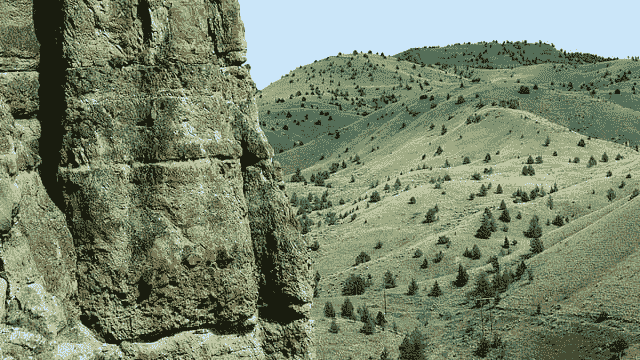
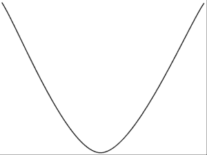
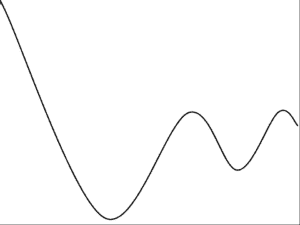
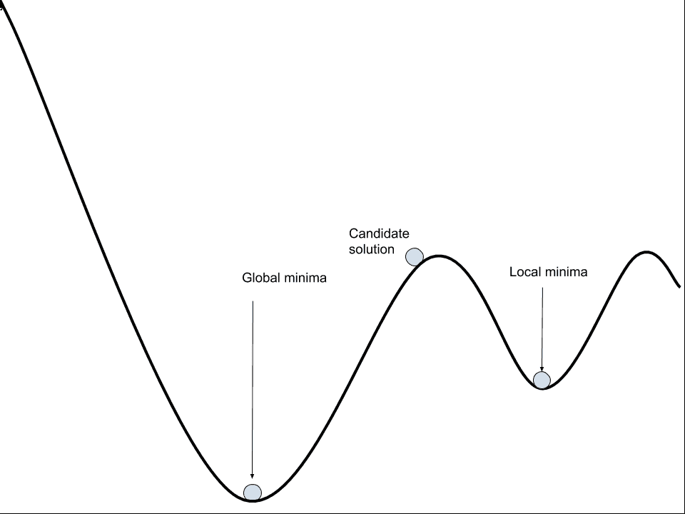
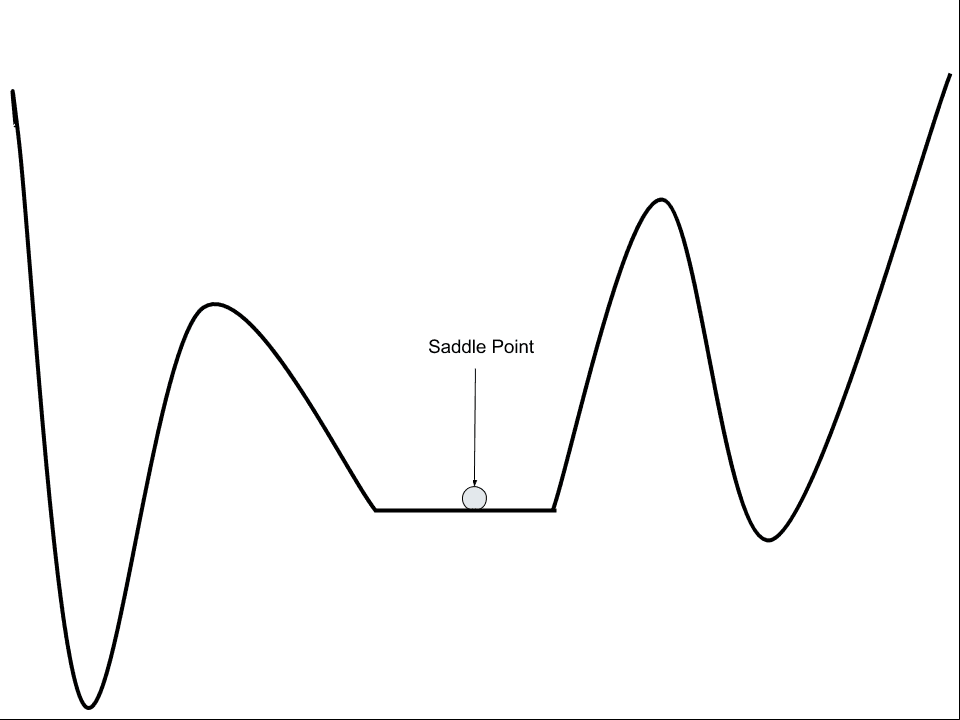

# 为什么训练神经网络很难

> 原文：<https://machinelearningmastery.com/why-training-a-neural-network-is-hard/>

最后更新于 2019 年 8 月 6 日

#### 或者，为什么用随机梯度下降来训练神经网络。

拟合神经网络包括使用训练数据集来更新模型权重，以创建输入到输出的良好映射。

使用优化算法来解决该训练过程，该优化算法在神经网络模型权重的可能值空间中搜索一组权重，从而在训练数据集上产生良好的表现。

在这篇文章中，你将发现训练神经网络的挑战是一个优化问题。

看完这篇文章，你会知道:

*   训练神经网络包括使用优化算法来找到一组权重，以最佳地将输入映射到输出。
*   这个问题很难，尤其是因为误差面是非凸的，包含局部极小值、平点，并且是高度多维的。
*   随机梯度下降算法是解决这一挑战性问题的最佳通用算法。

**用我的新书[更好的深度学习](https://machinelearningmastery.com/better-deep-learning/)启动你的项目**，包括*分步教程*和所有示例的 *Python 源代码*文件。

我们开始吧。

为什么训练神经网络是困难的
图片由[罗兰·克恩斯](https://www.flickr.com/photos/lorenkerns/14180577517/)提供，版权所有。

## 概观

本教程分为四个部分；它们是:

1.  学习即优化
2.  挑战性优化
3.  误差曲面的特征
4.  对培训的影响

## 学习即优化

深度学习神经网络模型学习给定示例的训练数据集，将输入映射到输出。

训练过程包括在网络中找到一组权重，这些权重在解决特定问题时被证明是好的，或者足够好。

这个训练过程是迭代的，这意味着它是一步一步地进行的，每次迭代都会对模型权重进行小的更新，反过来，每次迭代都会改变模型的表现。

神经网络的迭代训练过程解决了在评估训练数据集中的示例时寻找导致最小误差或损失的参数(模型权重)的优化问题。

优化是一个定向搜索过程，我们希望在训练神经网络模型时解决的优化问题非常具有挑战性。

这就提出了这个优化问题到底有什么挑战性的问题？

## 挑战性优化

训练深度学习神经网络非常具有挑战性。

已知用于解决该问题的最佳通用算法是随机梯度下降，其中使用误差算法的[反向传播在每次迭代中更新模型权重。](https://machinelearningmastery.com/implement-backpropagation-algorithm-scratch-python/)

> 优化通常是一项极其困难的任务。[……]在训练神经网络时，我们必须面对一般的非凸情况。

—第 282 页，[深度学习](https://amzn.to/2rjgvLI)，2016。

优化过程在概念上可以理解为在整个环境中搜索足够令人满意的候选解决方案。

景观上的一个点是模型的一组特定权重，该点的高程是对该组权重的评估，其中谷代表损失值较小的好模型。

这是优化问题的一个常见概念化，这种情况被称为“*误差面*”

> 一般来说，E(w)[权重的误差函数]是多维函数，不可能可视化。如果可以把它绘制成 w[权重]的函数，那么，E[误差函数]可能看起来像一个有山丘和山谷的风景…

—第 113 页，[神经锻造:前馈人工神经网络中的监督学习](https://amzn.to/2PgixWj)，1999。

优化算法迭代地跨越这一景观，更新权重，寻找好的或低海拔地区。

对于简单的优化问题，景观的形状是一个大碗，找到底部很容易，非常容易，因此可以设计非常高效的算法来找到最佳解决方案。

这些类型的优化问题在数学上被称为凸问题。

凸误差曲面的示例

当优化神经网络的权重时，我们希望导航的误差面不是碗状。这是一个有许多小山和山谷的景观。

这些类型的优化问题在数学上被称为非凸的。

非凸误差曲面的示例

事实上，不存在一种算法来解决在多项式时间内为神经网络找到最优权重集的问题。数学上，通过训练神经网络解决的优化问题被称为 NP 完全的(例如，它们非常难解决)。

> 我们证明了这个问题是 NP 完全的，从而证明了神经网络中的学习没有有效的通解。

——[神经网络设计与学习的复杂性](https://authors.library.caltech.edu/26705/1/88-20.pdf)，1988。

## 误差曲面的主要特征

非凸优化问题有很多种类型，但是我们在训练神经网络时要解决的特定类型的问题特别具有挑战性。

我们可以根据优化算法可能遇到的场景或错误表面的特征来描述困难，并且必须导航以便能够提供好的解决方案。

优化神经网络权重的许多方面使问题变得具有挑战性，但是误差景观的三个经常提到的特征是局部最小值的存在、平坦区域和搜索空间的高维性。

> 反向传播可能非常慢，特别是对于多层网络，其中成本面通常是非二次的、非凸的和高维的，具有许多局部最小值和/或平坦区域。

—第 13 页，[神经网络:交易技巧](https://amzn.to/2DX69sk)，2012 年。

### 1.局部最小值

局部最小值或局部最优值是指误差范围包含多个损耗相对较低的区域。

这些是山谷，相对于周围的斜坡和山峰，这些山谷中的解决方案看起来不错。问题是，从整个景观的更广视角来看，山谷的海拔相对较高，可能存在更好的解决方案。

很难知道优化算法是否在山谷中，因此，最好在噪声很大的情况下开始优化过程，允许在选择山谷之前对景观进行广泛采样。

相比之下，景观中的最低点被称为“*全局最小值*”。

神经网络可能有一个或多个全局极小值，挑战在于局部极小值和全局极小值之间的差异可能不会产生很大的差异。

这意味着通常找到一组足够好的权重比找到一组全局最优或最佳的权重更容易处理。

> 非线性网络通常有多个不同深度的局部极小值。训练的目标是找到这些最小值之一。

—第 14 页，[神经网络:交易技巧](https://amzn.to/2DX69sk)，2012 年。

解决局部极小值问题的经典方法是用不同的起点(随机初始权重)多次重启搜索过程，并允许优化算法找到不同的、希望更好的局部极小值。这就叫做*多次重启*。

> 随机重启:处理局部极小的最简单方法之一是训练许多不同的网络，它们具有不同的初始权重。

—第 121 页，[神经锻造:前馈人工神经网络中的监督学习](https://amzn.to/2PgixWj)，1999。

### 2.平坦区域(鞍点)

平坦区域或[鞍点](https://en.wikipedia.org/wiki/Saddle_point)是景观上坡度为零的点。

这些是谷底的平坦区域或峰顶之间的区域。问题是零梯度意味着优化算法不知道向哪个方向移动以改进模型。

> ……鞍点或误差函数非常平坦的区域的存在会导致一些迭代算法在很长一段时间内“停滞不前”，从而模仿局部极小值。

—第 255 页，[用于模式识别的神经网络](https://amzn.to/2EamNFL)，1995。

误差曲面上的鞍点示例

然而，最近的工作可能表明，也许局部最小值和平坦区域可能没有以前认为的那么具有挑战性。

> 神经网络会进入和逃脱一系列局部极小值吗？它们在接近时会以不同的速度移动，然后经过各种鞍点吗？[……]我们提供的证据强烈表明，所有这些问题的答案都是否定的。

——[定性表征神经网络优化问题](https://arxiv.org/abs/1412.6544)，2015。

### 3.高维

训练神经网络时解决的优化问题是高维的。

网络中的每个权重代表误差表面的另一个参数或维度。与更传统的机器学习算法相比，深度神经网络通常有数百万个参数，使得算法要导航的场景极其高维。

在高维空间中导航的问题是，每个新维度的增加会显著增加空间(或超体积)中点之间的距离。这通常被称为维度诅咒。

> 这种现象被称为维度的诅咒。特别值得关注的是，随着变量数量的增加，一组变量的可能不同配置的数量呈指数增长。

—第 155 页，[深度学习](https://amzn.to/2rjgvLI)，2016。

## 对培训的影响

当在实践中训练模型时，当使用深度学习神经网络时，要解决的优化问题的挑战性有所暗示。

一般来说，随机梯度下降是最好的算法，这种算法没有保证。

> 没有公式可以保证(1)网络会收敛到一个好的解，(2)收敛很快，或者(3)收敛甚至会发生。

—第 13 页，[神经网络:交易技巧](https://amzn.to/2DX69sk)，2012 年。

我们可以将这些含义总结如下:

*   **可能有问题的溶液质量**。优化过程可能会也可能不会找到好的解决方案，并且由于欺骗性的局部极小值，解决方案只能相对比较。
*   **可能训练时间较长**。由于搜索的迭代性质，优化过程可能需要很长时间才能找到满意的解决方案。
*   **可能的故障**。由于平坦区域的存在，优化过程可能无法进行(卡住)或无法找到可行的解决方案。

有效训练的任务是仔细配置、测试和调整模型和学习过程本身的超参数，以最好地应对这一挑战。

令人欣慰的是，现代技术的进步可以极大地简化搜索空间，加速搜索过程，通常会发现比以前想象的更大、更深、表现更好的模型。

## 进一步阅读

如果您想更深入地了解这个主题，本节将提供更多资源。

### 书

*   [深度学习](https://amzn.to/2rjgvLI)，2016 年。
*   [神经网络:交易技巧](https://amzn.to/2DX69sk)，2012 年。
*   [用于模式识别的神经网络](https://amzn.to/2EamNFL)，1995。
*   [神经锻造:前馈人工神经网络中的监督学习](https://amzn.to/2PgixWj)，1999。

### 报纸

*   [训练一个 3 节点神经网络是 NP 完全的](https://www.sciencedirect.com/science/article/pii/S0893608005800103)，1992。
*   [定性表征神经网络优化问题](https://arxiv.org/abs/1412.6544)，2015。
*   [神经网络设计与学习的复杂性](https://authors.library.caltech.edu/26705/1/88-20.pdf)，1988。

### 文章

*   [深度学习的难处](https://www.oreilly.com/ideas/the-hard-thing-about-deep-learning)，2016。
*   [鞍点，维基百科](https://en.wikipedia.org/wiki/Saddle_point)。
*   [维度的诅咒，维基百科](https://en.wikipedia.org/wiki/Curse_of_dimensionality)。
*   [NP-完全性，维基百科](https://en.wikipedia.org/wiki/NP-completeness)。

## 摘要

在这篇文章中，你发现了训练神经网络作为优化问题的挑战。

具体来说，您了解到:

*   训练神经网络包括使用优化算法来找到一组权重，以最佳地将输入映射到输出。
*   这个问题很难，尤其是因为误差面是非凸的，包含局部极小值、平点，并且是高度多维的。
*   随机梯度下降算法是解决这一挑战性问题的最佳通用算法。

你有什么问题吗？
在下面的评论中提问，我会尽力回答。