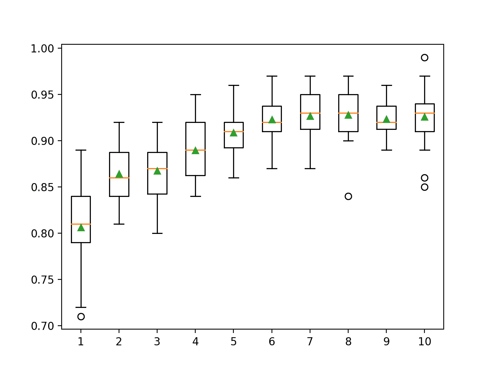
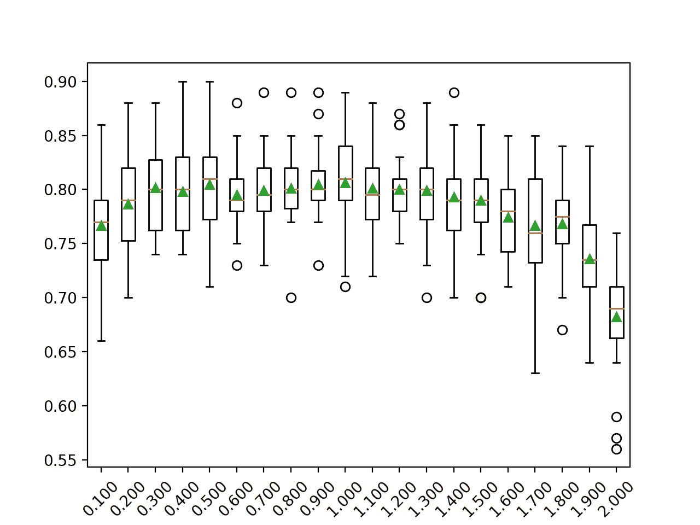

# 如何用 Python 开发 AdaBoost 集成

> 原文：<https://machinelearningmastery.com/adaboost-ensemble-in-python/>

最后更新于 2021 年 4 月 27 日

Boosting 是一类集成机器学习算法，它涉及组合来自许多弱学习器的预测。

弱学习器是一个非常简单的模型，尽管在数据集上有一些技巧。在开发出实用算法之前，Boosting 是一个理论概念，AdaBoost(自适应 boosting)算法是实现这一想法的第一个成功方法。

AdaBoost 算法包括使用非常短的(一级)决策树作为弱学习器，它们被顺序添加到集成中。每个随后的模型都试图纠正序列中它之前的模型所做的预测。这是通过对训练数据集进行加权来实现的，以将更多的注意力放在先前模型产生预测误差的训练示例上。

在本教程中，您将发现如何开发用于分类和回归的 AdaBoost 集成。

完成本教程后，您将知道:

*   AdaBoost 集成是从顺序添加到模型中的决策树创建的集成
*   如何使用 AdaBoost 集成与 Sklearn 进行分类和回归。
*   如何探索 AdaBoost 模型超参数对模型表现的影响？

**用我的新书[Python 集成学习算法](https://machinelearningmastery.com/ensemble-learning-algorithms-with-python/)启动你的项目**，包括*分步教程*和所有示例的 *Python 源代码*文件。

我们开始吧。

*   **2020 年 8 月更新**:增加了网格搜索模型超参数示例。


如何开发 Python 中的 AdaBoost 集成
图片由[雷在马尼拉](https://flickr.com/photos/rayinmanila/25223762580/)拍摄，保留部分权利。

## 教程概述

本教程分为四个部分；它们是:

1.  AdaBoost 集成算法
2.  学习应用编程接口
    1.  用于分类的 AdaBoost
    2.  回归的 AdaBoost
3.  AdaBoost 超参数
    1.  探索树的数量
    2.  探索弱势学习器
    3.  探索学习率
    4.  探索替代算法
4.  网格搜索 AdaBoost 超参数

## AdaBoost 集成算法

[Boosting](https://en.wikipedia.org/wiki/Boosting_(machine_learning)) 指的是一类机器学习集成算法，其中模型按顺序添加，序列中后面的模型修正序列中前面模型做出的预测。

[AdaBoost](https://en.wikipedia.org/wiki/AdaBoost) ，简称“*自适应 boosting* ”，是一种 Boosting 集成机器学习算法，是最早成功的 Boosting 方法之一。

> 我们称该算法为 AdaBoost，因为与以前的算法不同，它能自适应地调整弱假设的误差

——[在线学习的决策理论推广及其在增强](https://link.springer.com/chapter/10.1007/3-540-59119-2_166)中的应用，1996。

AdaBoost 结合了来自短的一级决策树的预测，称为决策树桩，尽管也可以使用其他算法。决策树桩算法被使用，因为 AdaBoost 算法试图使用许多弱模型，并通过添加额外的弱模型来校正它们的预测。

训练算法包括从一棵决策树开始，在训练数据集中找到那些被错误分类的例子，并给这些例子增加更多的权重。另一棵树是在相同的数据上训练的，尽管现在是由错误分类误差加权的。重复这个过程，直到添加了所需数量的树。

> 如果训练数据点被错误分类，则该训练数据点的权重增加(提升)。使用不再相等的新权重构建第二个分类器。同样，错误分类的训练数据的权重增加，并且重复该过程。

——[多级 AdaBoost](https://www.intlpress.com/site/pub/pages/journals/items/sii/content/vols/0002/0003/a008/) ，2009 年。

该算法是为分类而开发的，涉及到组合集合中所有决策树做出的预测。类似的方法也被开发用于回归问题，其中通过使用决策树的平均值进行预测。基于模型在训练数据集上的表现，加权每个模型对集成预测的贡献。

> ……新算法不需要弱假设准确性的先验知识。相反，它适应这些准确率，并生成加权多数假设，其中每个弱假设的权重是其准确率的函数。

——[在线学习的决策理论推广及其在增强](https://link.springer.com/chapter/10.1007/3-540-59119-2_166)中的应用，1996。

现在我们已经熟悉了 AdaBoost 算法，让我们看看如何在 Python 中拟合 AdaBoost 模型。

## 学习应用编程接口

AdaBoost 集成可以从零开始实现，尽管这对初学者来说可能很有挑战性。

有关示例，请参见教程:

*   [机器学习的 Boosting 和 AdaBoost】](https://machinelearningmastery.com/boosting-and-adaboost-for-machine-learning/)

Sklearn Python 机器学习库为机器学习提供了 AdaBoost 集成的实现。

它有现代版本的图书馆。

首先，通过运行以下脚本来确认您使用的是现代版本的库:

```py
# check Sklearn version
import sklearn
print(sklearn.__version__)
```

运行脚本将打印您的 Sklearn 版本。

您的版本应该相同或更高。如果没有，您必须升级 Sklearn 库的版本。

```py
0.22.1
```

AdaBoost 通过【AdaBoost 渐层和【AdaBoost 分类器类提供。

这两个模型以相同的方式运行，并采用相同的参数来影响决策树的创建。

随机性用于模型的构建。这意味着算法每次在相同的数据上运行时，都会产生稍微不同的模型。

当使用具有随机学习算法的机器学习算法时，最好通过在多次运行或重复交叉验证中平均它们的表现来评估它们。当拟合最终模型时，可能需要增加树的数量，直到模型的方差在重复评估中减小，或者拟合多个最终模型并对它们的预测进行平均。

让我们看看如何为分类和回归开发一个 AdaBoost 集成。

### 用于分类的 AdaBoost

在本节中，我们将研究使用 AdaBoost 解决分类问题。

首先，我们可以使用 [make_classification()函数](https://Sklearn.org/stable/modules/generated/sklearn.datasets.make_classification.html)创建一个包含 1000 个示例和 20 个输入特征的合成二进制分类问题。

下面列出了完整的示例。

```py
# test classification dataset
from sklearn.datasets import make_classification
# define dataset
X, y = make_classification(n_samples=1000, n_features=20, n_informative=15, n_redundant=5, random_state=6)
# summarize the dataset
print(X.shape, y.shape)
```

运行该示例将创建数据集并总结输入和输出组件的形状。

```py
(1000, 20) (1000,)
```

接下来，我们可以在这个数据集上评估一个 AdaBoost 算法。

我们将使用[重复分层 k 折叠交叉验证](https://machinelearningmastery.com/k-fold-cross-validation/)来评估模型，重复 3 次，折叠 10 次。我们将报告所有重复和折叠的模型准确率的平均值和标准偏差。

```py
# evaluate adaboost algorithm for classification
from numpy import mean
from numpy import std
from sklearn.datasets import make_classification
from sklearn.model_selection import cross_val_score
from sklearn.model_selection import RepeatedStratifiedKFold
from sklearn.ensemble import AdaBoostClassifier
# define dataset
X, y = make_classification(n_samples=1000, n_features=20, n_informative=15, n_redundant=5, random_state=6)
# define the model
model = AdaBoostClassifier()
# evaluate the model
cv = RepeatedStratifiedKFold(n_splits=10, n_repeats=3, random_state=1)
n_scores = cross_val_score(model, X, y, scoring='accuracy', cv=cv, n_jobs=-1, error_score='raise')
# report performance
print('Accuracy: %.3f (%.3f)' % (mean(n_scores), std(n_scores)))
```

运行该示例会报告模型的均值和标准差准确率。

**注**:考虑到算法或评估程序的随机性，或数值准确率的差异，您的[结果可能会有所不同](https://machinelearningmastery.com/different-results-each-time-in-machine-learning/)。考虑运行该示例几次，并比较平均结果。

在这种情况下，我们可以看到带有默认超参数的 AdaBoost 集成在这个测试数据集上实现了大约 80%的分类准确率。

```py
Accuracy: 0.806 (0.041)
```

我们也可以将 AdaBoost 模型作为最终模型，进行分类预测。

首先，AdaBoost 集成适合所有可用数据，然后可以调用 *predict()* 函数对新数据进行预测。

下面的示例在我们的二进制类别数据集上演示了这一点。

```py
# make predictions using adaboost for classification
from sklearn.datasets import make_classification
from sklearn.ensemble import AdaBoostClassifier
# define dataset
X, y = make_classification(n_samples=1000, n_features=20, n_informative=15, n_redundant=5, random_state=6)
# define the model
model = AdaBoostClassifier()
# fit the model on the whole dataset
model.fit(X, y)
# make a single prediction
row = [[-3.47224758,1.95378146,0.04875169,-0.91592588,-3.54022468,1.96405547,-7.72564954,-2.64787168,-1.81726906,-1.67104974,2.33762043,-4.30273117,0.4839841,-1.28253034,-10.6704077,-0.7641103,-3.58493721,2.07283886,0.08385173,0.91461126]]
yhat = model.predict(row)
print('Predicted Class: %d' % yhat[0])
```

运行该示例使 AdaBoost 集成模型适合整个数据集，然后用于对新的数据行进行预测，就像我们在应用程序中使用该模型时可能做的那样。

```py
Predicted Class: 0
```

既然我们已经熟悉了使用 AdaBoost 进行分类，那么让我们来看看回归的 API。

### 回归的 AdaBoost

在本节中，我们将研究使用 AdaBoost 解决回归问题。

首先，我们可以使用[make _ revolution()函数](https://Sklearn.org/stable/modules/generated/sklearn.datasets.make_regression.html)创建一个包含 1000 个示例和 20 个输入特征的合成回归问题。

下面列出了完整的示例。

```py
# test regression dataset
from sklearn.datasets import make_regression
# define dataset
X, y = make_regression(n_samples=1000, n_features=20, n_informative=15, noise=0.1, random_state=6)
# summarize the dataset
print(X.shape, y.shape)
```

运行该示例将创建数据集并总结输入和输出组件的形状。

```py
(1000, 20) (1000,)
```

接下来，我们可以在这个数据集上评估一个 AdaBoost 算法。

正如我们在上一节中所做的，我们将使用重复的 k-fold 交叉验证来评估模型，重复 3 次，重复 10 次。我们将报告所有重复和折叠模型的平均绝对误差(MAE)。Sklearn 库使 MAE 为负，因此它被最大化而不是最小化。这意味着负 MAE 越大越好，完美模型的 MAE 为 0。

下面列出了完整的示例。

```py
# evaluate adaboost ensemble for regression
from numpy import mean
from numpy import std
from sklearn.datasets import make_regression
from sklearn.model_selection import cross_val_score
from sklearn.model_selection import RepeatedKFold
from sklearn.ensemble import AdaBoostRegressor
# define dataset
X, y = make_regression(n_samples=1000, n_features=20, n_informative=15, noise=0.1, random_state=6)
# define the model
model = AdaBoostRegressor()
# evaluate the model
cv = RepeatedKFold(n_splits=10, n_repeats=3, random_state=1)
n_scores = cross_val_score(model, X, y, scoring='neg_mean_absolute_error', cv=cv, n_jobs=-1, error_score='raise')
# report performance
print('MAE: %.3f (%.3f)' % (mean(n_scores), std(n_scores)))
```

运行该示例会报告模型的均值和标准差准确率。

**注**:考虑到算法或评估程序的随机性，或数值准确率的差异，您的[结果可能会有所不同](https://machinelearningmastery.com/different-results-each-time-in-machine-learning/)。考虑运行该示例几次，并比较平均结果。

在这种情况下，我们可以看到带有默认超参数的 AdaBoost 集成实现了大约 100 的 MAE。

```py
MAE: -72.327 (4.041)
```

我们也可以使用 AdaBoost 模型作为最终模型，并对回归进行预测。

首先，AdaBoost 集成适合所有可用数据，然后可以调用 *predict()* 函数对新数据进行预测。

下面的例子在我们的回归数据集上演示了这一点。

```py
# adaboost ensemble for making predictions for regression
from sklearn.datasets import make_regression
from sklearn.ensemble import AdaBoostRegressor
# define dataset
X, y = make_regression(n_samples=1000, n_features=20, n_informative=15, noise=0.1, random_state=6)
# define the model
model = AdaBoostRegressor()
# fit the model on the whole dataset
model.fit(X, y)
# make a single prediction
row = [[1.20871625,0.88440466,-0.9030013,-0.22687731,-0.82940077,-1.14410988,1.26554256,-0.2842871,1.43929072,0.74250241,0.34035501,0.45363034,0.1778756,-1.75252881,-1.33337384,-1.50337215,-0.45099008,0.46160133,0.58385557,-1.79936198]]
yhat = model.predict(row)
print('Prediction: %d' % yhat[0])
```

运行该示例使 AdaBoost 集成模型适合整个数据集，然后用于对新的数据行进行预测，就像我们在应用程序中使用该模型时可能做的那样。

```py
Prediction: -10
```

现在我们已经熟悉了使用 Sklearn API 来评估和使用 AdaBoost 集成，接下来让我们看看如何配置模型。

## AdaBoost 超参数

在本节中，我们将仔细研究您应该考虑为 AdaBoost 集成调整的一些超参数及其对模型表现的影响。

### 探索树的数量

AdaBoost 算法的一个重要超参数是集成中使用的决策树的数量。

回想一下，集成中使用的每个决策树都是为弱学习器设计的。也就是说，它比随机预测有技巧，但技巧性不高。因此，使用了一级决策树，称为决策树桩。

添加到模型中的树的数量必须很高，模型才能很好地工作，通常是几百棵树，如果不是几千棵树的话。

树的数量可以通过“*n _ estimates*”参数设置，默认为 50。

下面的示例探讨了值在 10 到 5，000 之间的树的数量的影响。

```py
# explore adaboost ensemble number of trees effect on performance
from numpy import mean
from numpy import std
from sklearn.datasets import make_classification
from sklearn.model_selection import cross_val_score
from sklearn.model_selection import RepeatedStratifiedKFold
from sklearn.ensemble import AdaBoostClassifier
from matplotlib import pyplot

# get the dataset
def get_dataset():
	X, y = make_classification(n_samples=1000, n_features=20, n_informative=15, n_redundant=5, random_state=6)
	return X, y

# get a list of models to evaluate
def get_models():
	models = dict()
	# define number of trees to consider
	n_trees = [10, 50, 100, 500, 1000, 5000]
	for n in n_trees:
		models[str(n)] = AdaBoostClassifier(n_estimators=n)
	return models

# evaluate a given model using cross-validation
def evaluate_model(model, X, y):
	# define the evaluation procedure
	cv = RepeatedStratifiedKFold(n_splits=10, n_repeats=3, random_state=1)
	# evaluate the model and collect the results
	scores = cross_val_score(model, X, y, scoring='accuracy', cv=cv, n_jobs=-1)
	return scores

# define dataset
X, y = get_dataset()
# get the models to evaluate
models = get_models()
# evaluate the models and store results
results, names = list(), list()
for name, model in models.items():
	# evaluate the model
	scores = evaluate_model(model, X, y)
	# store the results
	results.append(scores)
	names.append(name)
	# summarize the performance along the way
	print('>%s %.3f (%.3f)' % (name, mean(scores), std(scores)))
# plot model performance for comparison
pyplot.boxplot(results, labels=names, showmeans=True)
pyplot.show()
```

运行该示例首先报告每个配置数量的决策树的平均准确性。

**注**:考虑到算法或评估程序的随机性，或数值准确率的差异，您的[结果可能会有所不同](https://machinelearningmastery.com/different-results-each-time-in-machine-learning/)。考虑运行该示例几次，并比较平均结果。

在这种情况下，我们可以看到这个数据集上的表现提高了，直到大约 50 棵树，然后下降。这可能是在添加额外树之后，集合过拟合训练数据集的迹象。

```py
>10 0.773 (0.039)
>50 0.806 (0.041)
>100 0.801 (0.032)
>500 0.793 (0.028)
>1000 0.791 (0.032)
>5000 0.782 (0.031)
```

为每个配置数量的树的准确度分数的分布创建一个方框和须图。

我们可以看到模型表现和集合大小的总体趋势。


AdaBoost 集成大小与分类准确率的箱线图

### 探索弱势学习器

默认情况下，具有一个级别的决策树被用作弱学习器。

通过增加决策树的深度，我们可以使集成中使用的模型不那么弱(更熟练)。

下面的例子探索了增加[决策树分类器](https://Sklearn.org/stable/modules/generated/sklearn.tree.DecisionTreeClassifier.html)弱学习器的深度对 AdBoost 集成的影响。

```py
# explore adaboost ensemble tree depth effect on performance
from numpy import mean
from numpy import std
from sklearn.datasets import make_classification
from sklearn.model_selection import cross_val_score
from sklearn.model_selection import RepeatedStratifiedKFold
from sklearn.ensemble import AdaBoostClassifier
from sklearn.tree import DecisionTreeClassifier
from matplotlib import pyplot

# get the dataset
def get_dataset():
	X, y = make_classification(n_samples=1000, n_features=20, n_informative=15, n_redundant=5, random_state=6)
	return X, y

# get a list of models to evaluate
def get_models():
	models = dict()
	# explore depths from 1 to 10
	for i in range(1,11):
		# define base model
		base = DecisionTreeClassifier(max_depth=i)
		# define ensemble model
		models[str(i)] = AdaBoostClassifier(base_estimator=base)
	return models

# evaluate a given model using cross-validation
def evaluate_model(model, X, y):
	# define the evaluation procedure
	cv = RepeatedStratifiedKFold(n_splits=10, n_repeats=3, random_state=1)
	# evaluate the model and collect the results
	scores = cross_val_score(model, X, y, scoring='accuracy', cv=cv, n_jobs=-1)
	return scores

# define dataset
X, y = get_dataset()
# get the models to evaluate
models = get_models()
# evaluate the models and store results
results, names = list(), list()
for name, model in models.items():
	# evaluate the model
	scores = evaluate_model(model, X, y)
	# store the results
	results.append(scores)
	names.append(name)
	# summarize the performance along the way
	print('>%s %.3f (%.3f)' % (name, mean(scores), std(scores)))
# plot model performance for comparison
pyplot.boxplot(results, labels=names, showmeans=True)
pyplot.show()
```

运行该示例首先报告每个配置的弱学习器树深度的平均准确率。

**注**:考虑到算法或评估程序的随机性，或数值准确率的差异，您的[结果可能会有所不同](https://machinelearningmastery.com/different-results-each-time-in-machine-learning/)。考虑运行该示例几次，并比较平均结果。

在这种情况下，我们可以看到，随着决策树深度的增加，集成的表现在这个数据集上也增加了。

```py
>1 0.806 (0.041)
>2 0.864 (0.028)
>3 0.867 (0.030)
>4 0.889 (0.029)
>5 0.909 (0.021)
>6 0.923 (0.020)
>7 0.927 (0.025)
>8 0.928 (0.028)
>9 0.923 (0.017)
>10 0.926 (0.030)
```

为每个已配置的弱学习器深度的准确度分数分布创建一个方框和须图。

我们可以看到模型表现和弱学习器深度的总体趋势。



AdaBoost 集成弱学习器深度与分类准确率的箱线图

### 探索学习率

AdaBoost 还支持一个学习率，控制每个模型对集成预测的贡献。

这由“ *learning_rate* ”参数控制，默认设置为 1.0 或完全贡献。根据集合中使用的模型数量，较小或较大的值可能是合适的。在模型的贡献和集合中的树的数量之间有一个平衡。

更多的树可能需要更小的学习率；较少的树可能需要较大的学习率。通常使用 0 到 1 之间的值，有时使用非常小的值来避免过拟合，例如 0.1、0.01 或 0.001。

下面的示例以 0.1 为增量探索 0.1 到 2.0 之间的学习率值。

```py
# explore adaboost ensemble learning rate effect on performance
from numpy import mean
from numpy import std
from numpy import arange
from sklearn.datasets import make_classification
from sklearn.model_selection import cross_val_score
from sklearn.model_selection import RepeatedStratifiedKFold
from sklearn.ensemble import AdaBoostClassifier
from matplotlib import pyplot

# get the dataset
def get_dataset():
	X, y = make_classification(n_samples=1000, n_features=20, n_informative=15, n_redundant=5, random_state=6)
	return X, y

# get a list of models to evaluate
def get_models():
	models = dict()
	# explore learning rates from 0.1 to 2 in 0.1 increments
	for i in arange(0.1, 2.1, 0.1):
		key = '%.3f' % i
		models[key] = AdaBoostClassifier(learning_rate=i)
	return models

# evaluate a given model using cross-validation
def evaluate_model(model, X, y):
	# define the evaluation procedure
	cv = RepeatedStratifiedKFold(n_splits=10, n_repeats=3, random_state=1)
	# evaluate the model and collect the results
	scores = cross_val_score(model, X, y, scoring='accuracy', cv=cv, n_jobs=-1)
	return scores

# define dataset
X, y = get_dataset()
# get the models to evaluate
models = get_models()
# evaluate the models and store results
results, names = list(), list()
for name, model in models.items():
	# evaluate the model
	scores = evaluate_model(model, X, y)
	# store the results
	results.append(scores)
	names.append(name)
	# summarize the performance along the way
	print('>%s %.3f (%.3f)' % (name, mean(scores), std(scores)))
# plot model performance for comparison
pyplot.boxplot(results, labels=names, showmeans=True)
pyplot.xticks(rotation=45)
pyplot.show()
```

运行示例首先报告每个配置的学习率的平均准确性。

**注**:考虑到算法或评估程序的随机性，或数值准确率的差异，您的[结果可能会有所不同](https://machinelearningmastery.com/different-results-each-time-in-machine-learning/)。考虑运行该示例几次，并比较平均结果。

在这种情况下，我们可以看到 0.5 到 1.0 之间的相似值，以及之后模型表现的下降。

```py
>0.100 0.767 (0.049)
>0.200 0.786 (0.042)
>0.300 0.802 (0.040)
>0.400 0.798 (0.037)
>0.500 0.805 (0.042)
>0.600 0.795 (0.031)
>0.700 0.799 (0.035)
>0.800 0.801 (0.033)
>0.900 0.805 (0.032)
>1.000 0.806 (0.041)
>1.100 0.801 (0.037)
>1.200 0.800 (0.030)
>1.300 0.799 (0.041)
>1.400 0.793 (0.041)
>1.500 0.790 (0.040)
>1.600 0.775 (0.034)
>1.700 0.767 (0.054)
>1.800 0.768 (0.040)
>1.900 0.736 (0.047)
>2.000 0.682 (0.048)
```

为每个配置的学习率的准确度分数的分布创建一个方框和须图。

在这个数据集上，我们可以看到学习率大于 1.0 时模型表现下降的总体趋势。



AdaBoost 集成学习率与分类准确率的箱线图

### 探索替代算法

集成中使用的默认算法是决策树，尽管也可以使用其他算法。

目的是使用非常简单的模型，称为弱学习器。此外，Sklearn 实现要求使用的任何模型也必须支持加权样本，因为它们是如何通过基于训练数据集的加权版本拟合模型来创建集成的。

可以通过“ *base_estimator* ”参数指定基础模型。在分类的情况下，基础模型还必须支持预测概率或类似概率的分数。如果指定的模型不支持加权训练数据集，您将看到如下错误消息:

```py
ValueError: KNeighborsClassifier doesn't support sample_weight.
```

支持加权训练的模型的一个例子是逻辑回归算法。

下面的例子演示了一个带有弱学习器的 AdaBoost 算法。

```py
# evaluate adaboost algorithm with logistic regression weak learner for classification
from numpy import mean
from numpy import std
from sklearn.datasets import make_classification
from sklearn.model_selection import cross_val_score
from sklearn.model_selection import RepeatedStratifiedKFold
from sklearn.ensemble import AdaBoostClassifier
from sklearn.linear_model import LogisticRegression
# define dataset
X, y = make_classification(n_samples=1000, n_features=20, n_informative=15, n_redundant=5, random_state=6)
# define the model
model = AdaBoostClassifier(base_estimator=LogisticRegression())
# evaluate the model
cv = RepeatedStratifiedKFold(n_splits=10, n_repeats=3, random_state=1)
n_scores = cross_val_score(model, X, y, scoring='accuracy', cv=cv, n_jobs=-1, error_score='raise')
# report performance
print('Accuracy: %.3f (%.3f)' % (mean(n_scores), std(n_scores)))
```

运行该示例会报告模型的均值和标准差准确率。

**注**:考虑到算法或评估程序的随机性，或数值准确率的差异，您的[结果可能会有所不同](https://machinelearningmastery.com/different-results-each-time-in-machine-learning/)。考虑运行该示例几次，并比较平均结果。

在这种情况下，我们可以看到带有逻辑回归弱模型的 AdaBoost 集成在这个测试数据集上实现了大约 79%的分类准确率。

```py
Accuracy: 0.794 (0.032)
```

## 网格搜索 AdaBoost 超参数

将 AdaBoost 配置为算法可能具有挑战性，因为许多影响模型在训练数据上的行为的关键超参数和超参数相互作用。

因此，使用搜索过程来发现模型超参数的配置是一个好的实践，该配置对于给定的预测建模问题是有效的或最好的。流行的搜索过程包括随机搜索和网格搜索。

在这一节中，我们将研究 AdaBoost 算法的关键超参数的网格搜索公共范围，您可以将其用作自己项目的起点。这可以通过使用 *GridSearchCV* 类并指定将模型超参数名称映射到要搜索的值的字典来实现。

在这种情况下，我们将网格搜索 AdaBoost 的两个关键超参数:集成中使用的树的数量和学习率。我们将为每个超参数使用一系列流行的表现良好的值。

每个配置组合将使用重复的 k 倍交叉验证进行评估，配置将使用平均得分进行比较，在这种情况下，使用分类准确率。

下面列出了在我们的合成类别数据集上网格搜索 AdaBoost 算法的关键超参数的完整示例。

```py
# example of grid searching key hyperparameters for adaboost on a classification dataset
from sklearn.datasets import make_classification
from sklearn.model_selection import RepeatedStratifiedKFold
from sklearn.model_selection import GridSearchCV
from sklearn.ensemble import AdaBoostClassifier
# define dataset
X, y = make_classification(n_samples=1000, n_features=20, n_informative=15, n_redundant=5, random_state=6)
# define the model with default hyperparameters
model = AdaBoostClassifier()
# define the grid of values to search
grid = dict()
grid['n_estimators'] = [10, 50, 100, 500]
grid['learning_rate'] = [0.0001, 0.001, 0.01, 0.1, 1.0]
# define the evaluation procedure
cv = RepeatedStratifiedKFold(n_splits=10, n_repeats=3, random_state=1)
# define the grid search procedure
grid_search = GridSearchCV(estimator=model, param_grid=grid, n_jobs=-1, cv=cv, scoring='accuracy')
# execute the grid search
grid_result = grid_search.fit(X, y)
# summarize the best score and configuration
print("Best: %f using %s" % (grid_result.best_score_, grid_result.best_params_))
# summarize all scores that were evaluated
means = grid_result.cv_results_['mean_test_score']
stds = grid_result.cv_results_['std_test_score']
params = grid_result.cv_results_['params']
for mean, stdev, param in zip(means, stds, params):
    print("%f (%f) with: %r" % (mean, stdev, param))
```

运行该示例可能需要一段时间，具体取决于您的硬件。在运行结束时，首先报告获得最佳分数的配置，然后是所考虑的所有其他配置的分数。

**注**:考虑到算法或评估程序的随机性，或数值准确率的差异，您的[结果可能会有所不同](https://machinelearningmastery.com/different-results-each-time-in-machine-learning/)。考虑运行该示例几次，并比较平均结果。

在这种情况下，我们可以看到具有 500 棵树和 0.1 学习率的配置表现最好，分类准确率约为 81.3%。

尽管在这种情况下没有测试这些配置，以确保网格搜索在合理的时间内完成，但该模型在有更多树(如 1000 或 5000 棵树)的情况下可能会表现得更好。

```py
Best: 0.813667 using {'learning_rate': 0.1, 'n_estimators': 500}
0.646333 (0.036376) with: {'learning_rate': 0.0001, 'n_estimators': 10}
0.646667 (0.036545) with: {'learning_rate': 0.0001, 'n_estimators': 50}
0.646667 (0.036545) with: {'learning_rate': 0.0001, 'n_estimators': 100}
0.647000 (0.038136) with: {'learning_rate': 0.0001, 'n_estimators': 500}
0.646667 (0.036545) with: {'learning_rate': 0.001, 'n_estimators': 10}
0.647000 (0.038136) with: {'learning_rate': 0.001, 'n_estimators': 50}
0.654333 (0.045511) with: {'learning_rate': 0.001, 'n_estimators': 100}
0.672667 (0.046543) with: {'learning_rate': 0.001, 'n_estimators': 500}
0.648333 (0.042197) with: {'learning_rate': 0.01, 'n_estimators': 10}
0.671667 (0.045613) with: {'learning_rate': 0.01, 'n_estimators': 50}
0.715000 (0.053213) with: {'learning_rate': 0.01, 'n_estimators': 100}
0.767667 (0.045948) with: {'learning_rate': 0.01, 'n_estimators': 500}
0.716667 (0.048876) with: {'learning_rate': 0.1, 'n_estimators': 10}
0.767000 (0.049271) with: {'learning_rate': 0.1, 'n_estimators': 50}
0.784667 (0.042874) with: {'learning_rate': 0.1, 'n_estimators': 100}
0.813667 (0.032092) with: {'learning_rate': 0.1, 'n_estimators': 500}
0.773333 (0.038759) with: {'learning_rate': 1.0, 'n_estimators': 10}
0.806333 (0.040701) with: {'learning_rate': 1.0, 'n_estimators': 50}
0.801000 (0.032491) with: {'learning_rate': 1.0, 'n_estimators': 100}
0.792667 (0.027560) with: {'learning_rate': 1.0, 'n_estimators': 500}
```

## 进一步阅读

如果您想更深入地了解这个主题，本节将提供更多资源。

### 教程

*   [机器学习的 Boosting 和 AdaBoost】](https://machinelearningmastery.com/boosting-and-adaboost-for-machine-learning/)

### 报纸

*   [在线学习的决策理论推广及其在提升中的应用](https://link.springer.com/chapter/10.1007/3-540-59119-2_166)，1996。
*   [多级 AdaBoost](https://www.intlpress.com/site/pub/pages/journals/items/sii/content/vols/0002/0003/a008/) ，2009。
*   [使用增强技术改进回归器](http://professordrucker.com/Pubications/ImprovingRegressorsUsingBoostingTechniques.pdf)，1997。

### 蜜蜂

*   [硬化。一起。AdaBoost gressier API](https://Sklearn.org/stable/modules/generated/sklearn.ensemble.AdaBoostRegressor.html)。
*   [硬化。一起。AdaBoost 分类 API](https://Sklearn.org/stable/modules/generated/sklearn.ensemble.AdaBoostClassifier.html) 。

### 文章

*   [Boosting(机器学习)，维基百科](https://en.wikipedia.org/wiki/Boosting_(machine_learning))。
*   [AdaBoost，维基百科](https://en.wikipedia.org/wiki/AdaBoost)。

## 摘要

在本教程中，您发现了如何开发用于分类和回归的 AdaBoost 集成。

具体来说，您了解到:

*   AdaBoost 集成是从顺序添加到模型中的决策树创建的集成。
*   如何使用 AdaBoost 集成与 Sklearn 进行分类和回归。
*   如何探索 AdaBoost 模型超参数对模型表现的影响？

**你有什么问题吗？**
在下面的评论中提问，我会尽力回答。